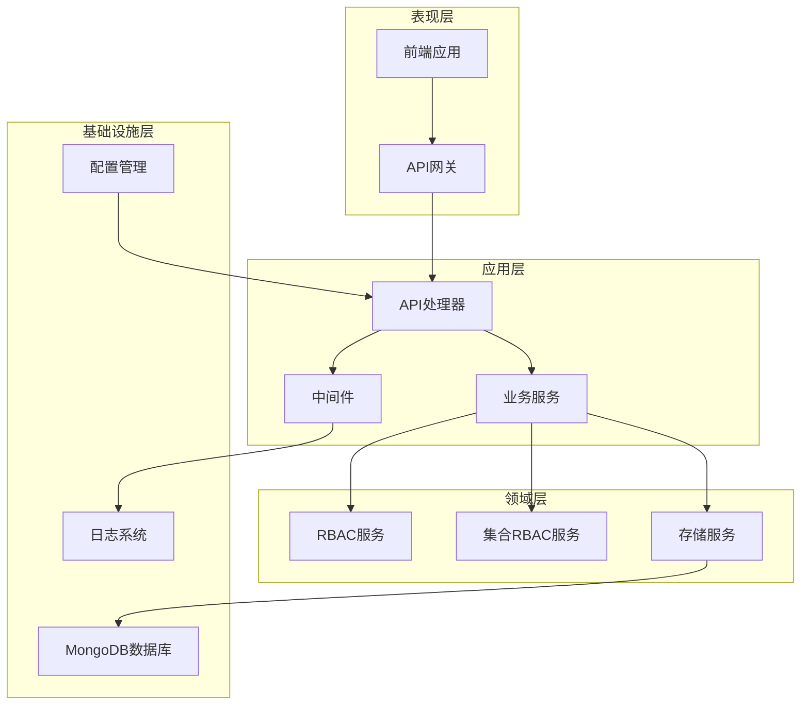
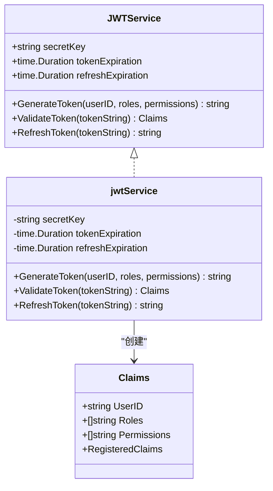
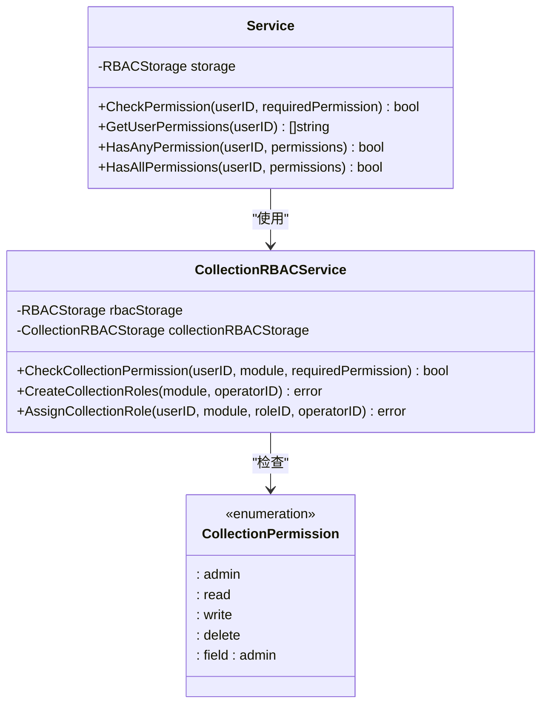
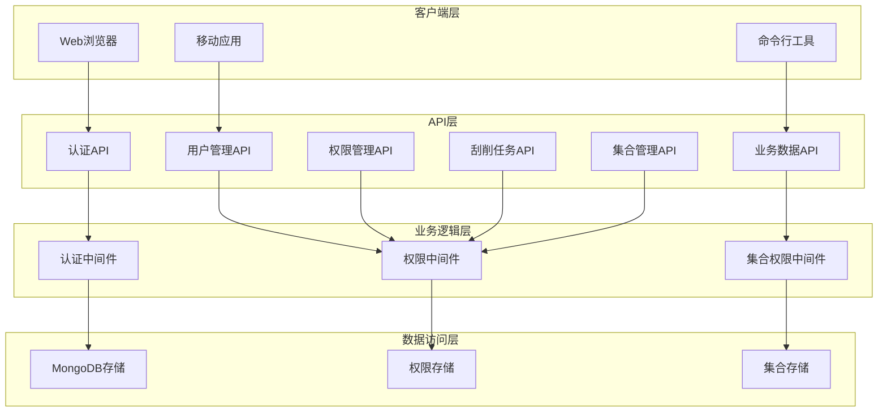
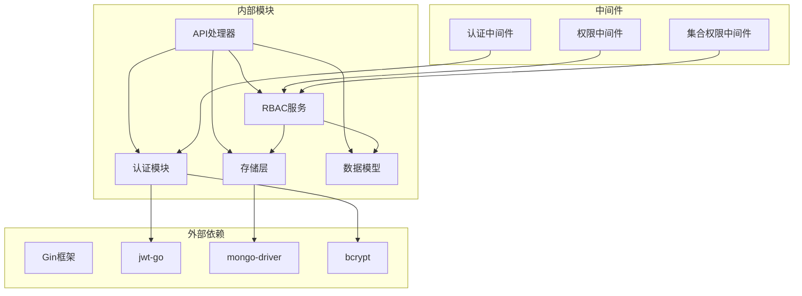
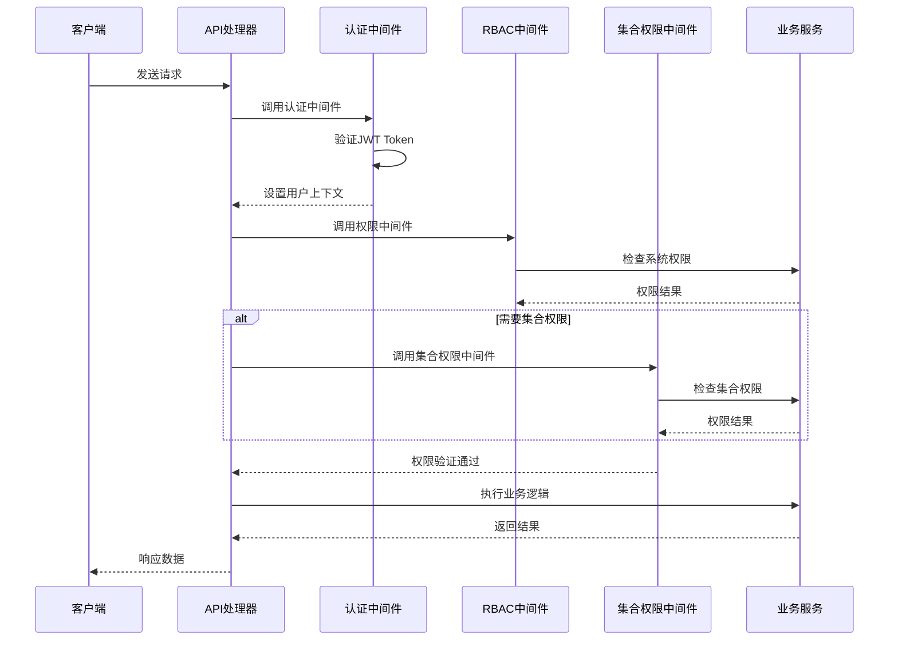

# API接口文档

<cite>
**本文档引用的文件**
- [main.go](file://cmd/server/main.go)
- [handlers.go](file://internal/api/handlers.go)
- [jwt.go](file://internal/auth/jwt.go)
- [middleware.go](file://internal/auth/middleware.go)
- [rbac.go](file://pkg/rbac/rbac.go)
- [collection_rbac.go](file://pkg/rbac/collection_rbac.go)
- [collection_permission_middleware.go](file://internal/api/collection_permission_middleware.go)
- [mongodb_storage.go](file://internal/storage/mongodb_storage.go)
- [models.go](file://internal/models/models.go)
- [api.md](file://docs/api.md)
- [authentication.md](file://docs/authentication.md)
- [api.ts](file://frontend/src/services/api.ts)
</cite>

## 目录
1. [简介](#简介)
2. [项目结构](#项目结构)
3. [核心组件](#核心组件)
4. [架构概览](#架构概览)
5. [详细组件分析](#详细组件分析)
6. [依赖关系分析](#依赖关系分析)
7. [性能考虑](#性能考虑)
8. [故障排除指南](#故障排除指南)
9. [结论](#结论)
10. [附录](#附录)

## 简介

数据中心项目是一个基于Go语言构建的RESTful API服务，提供完整的数据管理解决方案。该系统采用现代化的架构设计，集成了JWT认证、RBAC权限管理、业务数据管理和数据刮削功能。

### 主要特性
- **JWT认证机制**：基于Bearer Token的身份验证
- **RBAC权限管理**：细粒度的权限控制系统
- **集合级权限**：针对特定数据模块的权限管理
- **业务数据管理**：灵活的数据模型和查询能力
- **数据刮削系统**：自动化数据采集和处理
- **MongoDB集成**：高性能的NoSQL数据存储

## 项目结构

项目采用分层架构设计，主要分为以下几个层次：



**图表来源**
- [main.go:24-150](file://cmd/server/main.go#L24-L150)
- [handlers.go:45-181](file://internal/api/handlers.go#L45-L181)

### 核心模块职责

| 模块 | 职责 | 关键文件 |
|------|------|----------|
| 认证模块 | JWT Token管理和用户认证 | jwt.go, middleware.go |
| API处理器 | RESTful API路由和业务逻辑 | handlers.go |
| RBAC服务 | 基于角色的权限控制 | rbac.go, collection_rbac.go |
| 存储层 | 数据持久化和查询 | mongodb_storage.go |
| 中间件 | 请求拦截和权限验证 | collection_permission_middleware.go |

**章节来源**
- [main.go:13-95](file://cmd/server/main.go#L13-L95)
- [handlers.go:23-43](file://internal/api/handlers.go#L23-L43)

## 核心组件

### JWT认证服务

JWT服务负责生成、验证和刷新访问令牌，确保系统的安全性和可靠性。



**图表来源**
- [jwt.go:20-41](file://internal/auth/jwt.go#L20-L41)
- [jwt.go:12-18](file://internal/auth/jwt.go#L12-L18)

### RBAC权限控制系统

RBAC服务实现了基于角色的权限控制，支持系统级和集合级权限管理。



**图表来源**
- [rbac.go:55-61](file://pkg/rbac/rbac.go#L55-L61)
- [collection_rbac.go:27-37](file://pkg/rbac/collection_rbac.go#L27-L37)

**章节来源**
- [jwt.go:43-126](file://internal/auth/jwt.go#L43-L126)
- [rbac.go:55-250](file://pkg/rbac/rbac.go#L55-L250)
- [collection_rbac.go:27-294](file://pkg/rbac/collection_rbac.go#L27-L294)

## 架构概览

系统采用分层架构，确保关注点分离和代码的可维护性。



**图表来源**
- [handlers.go:45-181](file://internal/api/handlers.go#L45-L181)
- [main.go:94-119](file://cmd/server/main.go#L94-L119)

### API版本管理策略

系统采用语义化版本控制策略，通过URL路径中的版本号实现API版本管理：

- **v1版本**：当前稳定版本，位于`/api/v1/`路径下
- **向后兼容性**：新版本保持向后兼容，逐步引入破坏性变更
- **弃用策略**：提供明确的弃用时间表和迁移指南

## 详细组件分析

### 认证接口

#### 登录接口

**HTTP方法和URL**: `POST /api/auth/login`

**请求参数**:
```json
{
  "username": "string",
  "password": "string"
}
```

**响应格式**:
```json
{
  "token": "string",
  "user": {
    "id": "string",
    "username": "string",
    "email": "string",
    "roles": ["string"]
  }
}
```

**错误码**:
- `400 Bad Request`: 请求参数错误
- `401 Unauthorized`: 凭据无效
- `500 Internal Server Error`: 服务器内部错误

#### 注册接口

**HTTP方法和URL**: `POST /api/auth/register`

**请求参数**:
```json
{
  "username": "string",
  "password": "string",
  "email": "string"
}
```

**响应格式**:
```json
{
  "id": "string",
  "username": "string",
  "email": "string"
}
```

**错误码**:
- `400 Bad Request`: 请求参数错误
- `500 Internal Server Error`: 服务器内部错误

**章节来源**
- [handlers.go:183-258](file://internal/api/handlers.go#L183-L258)
- [api.md:15-68](file://docs/api.md#L15-L68)

### 用户管理接口

#### 获取用户列表

**HTTP方法和URL**: `GET /api/users?page=1&pageSize=10`

**查询参数**:
| 参数 | 类型 | 默认值 | 描述 |
|------|------|--------|------|
| page | int | 1 | 当前页码 |
| pageSize | int | 10 | 每页数量 |

**响应格式**:
```json
{
  "data": [
    {
      "_id": "string",
      "username": "string",
      "email": "string",
      "role_ids": ["string"],
      "created_at": "datetime",
      "updated_at": "datetime"
    }
  ],
  "total": 0,
  "page": 1,
  "pageSize": 10
}
```

**错误码**:
- `401 Unauthorized`: 未授权访问
- `403 Forbidden`: 权限不足
- `500 Internal Server Error`: 服务器内部错误

#### 创建用户

**HTTP方法和URL**: `POST /api/users`

**请求参数**:
```json
{
  "username": "string",
  "email": "string",
  "password": "string",
  "role_ids": ["string"]
}
```

**响应格式**:
```json
{
  "_id": "string",
  "username": "string",
  "email": "string",
  "role_ids": ["string"],
  "created_at": "datetime",
  "updated_at": "datetime"
}
```

**错误码**:
- `400 Bad Request`: 请求参数错误
- `401 Unauthorized`: 未授权访问
- `403 Forbidden`: 权限不足
- `500 Internal Server Error`: 服务器内部错误

**章节来源**
- [handlers.go:316-404](file://internal/api/handlers.go#L316-L404)
- [api.md:74-154](file://docs/api.md#L74-L154)

### 权限管理接口

#### 获取权限列表

**HTTP方法和URL**: `GET /api/permissions?page=1&pageSize=10`

**查询参数**:
| 参数 | 类型 | 默认值 | 描述 |
|------|------|--------|------|
| page | int | 1 | 当前页码 |
| pageSize | int | 10 | 每页数量 |

**响应格式**:
```json
{
  "data": [
    {
      "_id": "string",
      "name": "string",
      "code": "string",
      "description": "string"
    }
  ],
  "total": 0,
  "page": 1,
  "pageSize": 10
}
```

**错误码**:
- `401 Unauthorized`: 未授权访问
- `403 Forbidden`: 权限不足
- `500 Internal Server Error`: 服务器内部错误

#### 创建权限

**HTTP方法和URL**: `POST /api/permissions`

**请求参数**:
```json
{
  "name": "string",
  "code": "string",
  "description": "string"
}
```

**响应格式**:
```json
{
  "_id": "string",
  "name": "string",
  "code": "string",
  "description": "string"
}
```

**错误码**:
- `400 Bad Request`: 请求参数错误
- `401 Unauthorized`: 未授权访问
- `403 Forbidden`: 权限不足
- `500 Internal Server Error`: 服务器内部错误

**章节来源**
- [handlers.go:538-640](file://internal/api/handlers.go#L538-L640)
- [api.md:206-272](file://docs/api.md#L206-L272)

### 角色管理接口

#### 获取角色列表

**HTTP方法和URL**: `GET /api/roles?page=1&pageSize=10`

**查询参数**:
| 参数 | 类型 | 默认值 | 描述 |
|------|------|--------|------|
| page | int | 1 | 当前页码 |
| pageSize | int | 10 | 每页数量 |

**响应格式**:
```json
{
  "data": [
    {
      "_id": "string",
      "name": "string",
      "code": "string",
      "description": "string",
      "permission_ids": ["string"]
    }
  ],
  "total": 0,
  "page": 1,
  "pageSize": 10
}
```

**错误码**:
- `401 Unauthorized`: 未授权访问
- `403 Forbidden`: 权限不足
- `500 Internal Server Error`: 服务器内部错误

#### 分配权限给角色

**HTTP方法和URL**: `POST /api/roles/:id/permissions`

**路径参数**:
| 参数 | 类型 | 描述 |
|------|------|------|
| id | string | 角色ID |

**请求参数**:
```json
{
  "permission_id": "string"
}
```

**响应格式**:
```json
{
  "_id": "string",
  "name": "string",
  "code": "string",
  "description": "string",
  "permission_ids": ["string"]
}
```

**错误码**:
- `400 Bad Request`: 请求参数错误
- `401 Unauthorized`: 未授权访问
- `403 Forbidden`: 权限不足
- `404 Not Found`: 角色不存在
- `500 Internal Server Error`: 服务器内部错误

**章节来源**
- [handlers.go:642-750](file://internal/api/handlers.go#L642-L750)
- [api.md:275-370](file://docs/api.md#L275-L370)

### 业务数据接口

#### 获取业务数据列表

**HTTP方法和URL**: `GET /api/business/module/:module?page=1&pageSize=10&jql=filter`

**路径参数**:
| 参数 | 类型 | 描述 |
|------|------|------|
| module | string | 数据模块名称 |

**查询参数**:
| 参数 | 类型 | 默认值 | 描述 |
|------|------|--------|------|
| page | int | 1 | 当前页码 |
| pageSize | int | 10 | 每页数量 |
| jql | string | - | JQL查询条件 |

**响应格式**:
```json
{
  "data": [
    {
      "_id": "string",
      "module": "string",
      "description": "string",
      "custom_fields": {},
      "file_path": "string",
      "created_by": "string",
      "created_at": "datetime",
      "updated_by": "string",
      "updated_at": "datetime"
    }
  ],
  "total": 0,
  "page": 1,
  "pageSize": 10
}
```

**错误码**:
- `400 Bad Request`: 请求参数错误
- `401 Unauthorized`: 未授权访问
- `403 Forbidden`: 权限不足
- `500 Internal Server Error`: 服务器内部错误

#### 创建业务数据

**HTTP方法和URL**: `POST /api/business`

**请求参数**:
```json
{
  "module": "string",
  "data": {},
  "description": "string"
}
```

**响应格式**:
```json
{
  "message": "string",
  "data": {
    "_id": "string",
    "module": "string",
    "description": "string",
    "custom_fields": {},
    "created_by": "string",
    "created_at": "datetime"
  },
  "module": "string"
}
```

**错误码**:
- `400 Bad Request`: 请求参数错误
- `401 Unauthorized`: 未授权访问
- `403 Forbidden`: 权限不足
- `500 Internal Server Error`: 服务器内部错误

**章节来源**
- [handlers.go:105-122](file://internal/api/handlers.go#L105-L122)
- [api.md:372-494](file://docs/api.md#L372-L494)

### 集合管理接口

#### 获取集合列表

**HTTP方法和URL**: `GET /api/collections?page=1&pageSize=10`

**查询参数**:
| 参数 | 类型 | 默认值 | 描述 |
|------|------|--------|------|
| page | int | 1 | 当前页码 |
| pageSize | int | 10 | 每页数量 |

**响应格式**:
```json
{
  "data": [
    {
      "_id": "string",
      "module": "string",
      "description": "string",
      "datatype_owner": "string",
      "collection_name": "string",
      "created_by": "string",
      "created_at": "datetime"
    }
  ],
  "page": 1,
  "pageSize": 10,
  "total": 0
}
```

**错误码**:
- `401 Unauthorized`: 未授权访问
- `403 Forbidden`: 权限不足
- `500 Internal Server Error`: 服务器内部错误

#### 创建集合索引

**HTTP方法和URL**: `POST /api/collections/:module/indexes`

**路径参数**:
| 参数 | 类型 | 描述 |
|------|------|------|
| module | string | 集合模块名称 |

**请求参数**:
```json
{
  "keys": {},
  "options": {
    "unique": false,
    "background": true,
    "name": "string"
  }
}
```

**响应格式**:
```json
{
  "message": "string"
}
```

**错误码**:
- `400 Bad Request`: 请求参数错误
- `401 Unauthorized`: 未授权访问
- `403 Forbidden`: 权限不足
- `500 Internal Server Error`: 服务器内部错误

**章节来源**
- [handlers.go:161-179](file://internal/api/handlers.go#L161-L179)
- [api.md:496-598](file://docs/api.md#L496-L598)

### 刮削任务接口

#### 提交刮削任务

**HTTP方法和URL**: `POST /api/scraper/upload`

**请求参数**:
```json
{
  "module": "string",
  "data_path": "string",
  "scraper_path": "string",
  "description": "string"
}
```

**响应格式**:
```json
{
  "message": "string",
  "task_id": "string"
}
```

**错误码**:
- `400 Bad Request`: 请求参数错误
- `401 Unauthorized`: 未授权访问
- `403 Forbidden`: 权限不足
- `500 Internal Server Error`: 服务器内部错误

#### 获取刮削任务列表

**HTTP方法和URL**: `GET /api/scraper/tasks?module=movie&status=success&page=1&pageSize=10`

**查询参数**:
| 参数 | 类型 | 描述 |
|------|------|------|
| module | string | 模块名 |
| status | string | 任务状态 (pending/scraping/success/failed) |
| page | int | 当前页码 |
| pageSize | int | 每页数量 |

**响应格式**:
```json
{
  "data": [
    {
      "_id": "string",
      "module": "string",
      "data_path": "string",
      "scraper_path": "string",
      "status": "string",
      "result": {},
      "error_message": "string",
      "started_at": "datetime",
      "completed_at": "datetime",
      "business_data_id": "string",
      "description": "string"
    }
  ],
  "total": 0,
  "page": 1,
  "pageSize": 10
}
```

**错误码**:
- `400 Bad Request`: 请求参数错误
- `401 Unauthorized`: 未授权访问
- `403 Forbidden`: 权限不足
- `500 Internal Server Error`: 服务器内部错误

**章节来源**
- [handlers.go:142-160](file://internal/api/handlers.go#L142-L160)
- [api.md:601-684](file://docs/api.md#L601-L684)

## 依赖关系分析

系统采用依赖注入和接口抽象的设计模式，确保模块间的松耦合。



**图表来源**
- [main.go:13-19](file://cmd/server/main.go#L13-L19)
- [handlers.go:3-21](file://internal/api/handlers.go#L3-L21)

### 权限验证流程



**图表来源**
- [handlers.go:260-314](file://internal/api/handlers.go#L260-L314)
- [collection_permission_middleware.go:16-48](file://internal/api/collection_permission_middleware.go#L16-L48)

**章节来源**
- [handlers.go:260-314](file://internal/api/handlers.go#L260-L314)
- [collection_permission_middleware.go:16-137](file://internal/api/collection_permission_middleware.go#L16-L137)

## 性能考虑

### 缓存策略

系统采用多层缓存策略优化性能：

1. **MongoDB连接池**：复用数据库连接，减少连接开销
2. **集合缓存**：缓存动态集合引用，避免重复查询
3. **权限缓存**：缓存用户权限信息，减少权限检查开销

### 查询优化

- **分页查询**：默认每页10条记录，支持跳过和限制
- **索引优化**：为常用查询字段建立索引
- **投影优化**：只返回必要的字段

### 并发处理

- **Goroutine池**：限制并发请求数量
- **上下文超时**：防止长时间阻塞操作
- **信号处理**：优雅关闭服务器

## 故障排除指南

### 常见错误及解决方案

| 错误类型 | 状态码 | 描述 | 解决方案 |
|----------|--------|------|----------|
| 未认证 | 401 | 未提供Token或Token无效 | 检查Authorization头，重新登录获取Token |
| Token过期 | 401 | Token已过期 | 使用刷新Token获取新Token |
| 无权限 | 403 | 无权限访问 | 检查用户角色和权限分配 |
| 资源不存在 | 404 | 请求的资源不存在 | 验证ID和URL路径 |
| 参数错误 | 400 | 请求参数格式不正确 | 检查请求体格式和必需字段 |

### 调试工具推荐

1. **Postman**：RESTful API测试工具
2. **curl**：命令行HTTP客户端
3. **MongoDB Compass**：MongoDB图形界面工具
4. **JWT Debugger**：JWT Token解析工具

### 日志分析

系统提供详细的日志记录，包括：
- 请求和响应日志
- 错误堆栈跟踪
- 性能指标监控
- 安全事件记录

**章节来源**
- [authentication.md:70-79](file://docs/authentication.md#L70-L79)
- [api.md:797-872](file://docs/api.md#L797-L872)

## 结论

数据中心项目提供了一个完整、可扩展的数据管理解决方案。通过采用现代的架构设计和最佳实践，系统具备了以下优势：

1. **安全性**：基于JWT的认证机制和细粒度的权限控制
2. **可扩展性**：模块化的架构设计支持功能扩展
3. **可靠性**：完善的错误处理和监控机制
4. **易用性**：清晰的API设计和详细的文档

建议在生产环境中部署时，重点关注：
- 安全配置和证书管理
- 性能监控和调优
- 数据备份和灾难恢复
- 用户权限的定期审计

## 附录

### API使用最佳实践

#### 批量操作
- 使用分页查询处理大量数据
- 批量操作时设置适当的超时时间
- 实施幂等性设计防止重复操作

#### 分页查询
- 合理设置pageSize避免过大响应
- 使用skip和limit进行高效分页
- 实施游标分页优化大数据集查询

#### 数据验证
- 前端和后端双重验证
- 使用JQL进行复杂查询过滤
- 实施数据完整性检查

### API测试指南

#### 单元测试
- 为每个API端点编写测试用例
- 测试正常和异常场景
- 验证权限控制逻辑

#### 集成测试
- 测试完整的业务流程
- 验证数据库操作
- 检查错误处理机制

#### 性能测试
- 压力测试高并发场景
- 监控响应时间和吞吐量
- 识别性能瓶颈

**章节来源**
- [api.md:819-872](file://docs/api.md#L819-L872)
- [test/README.md:1-56](file://test/README.md#L1-L56)