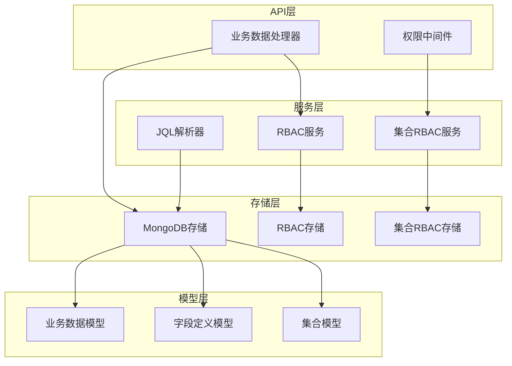
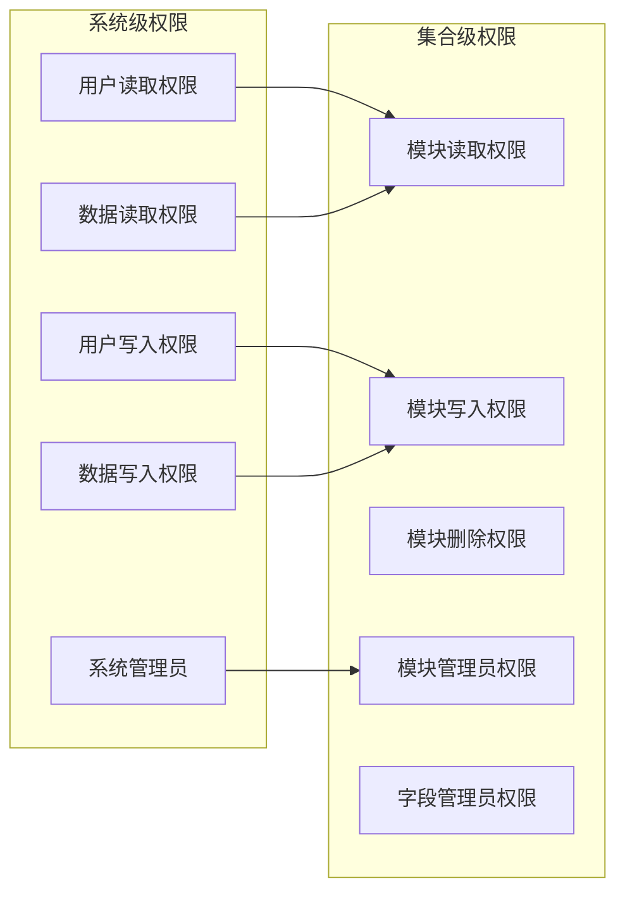
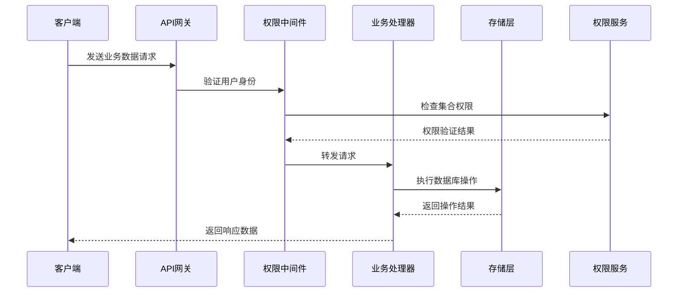
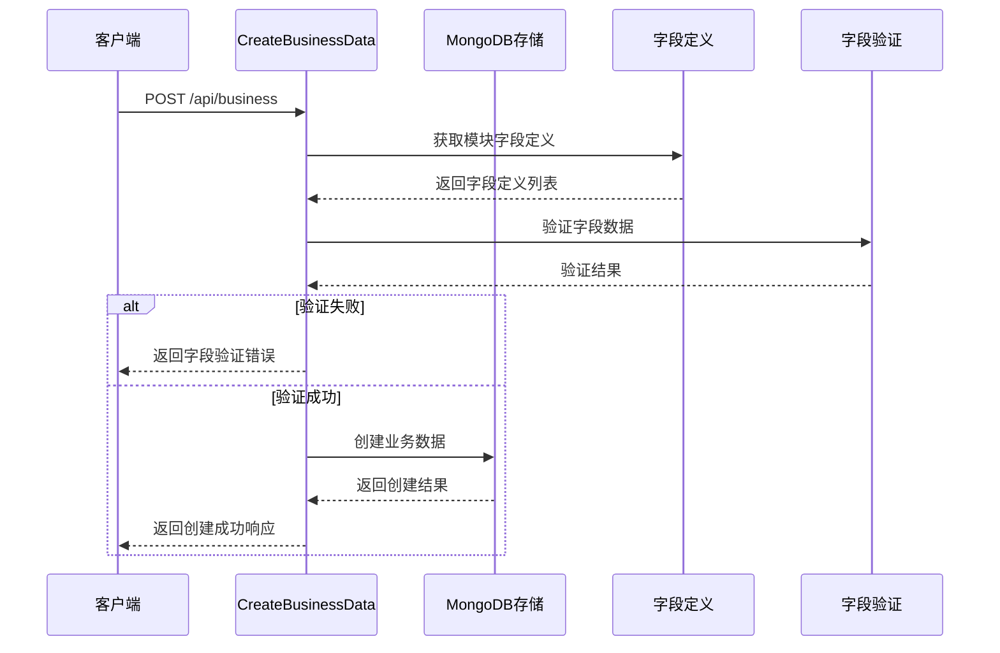
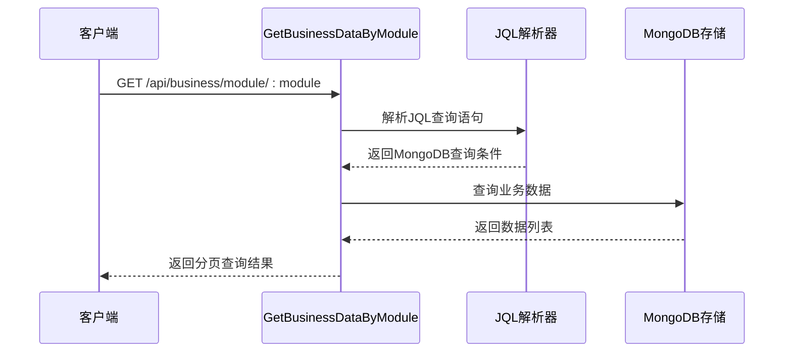
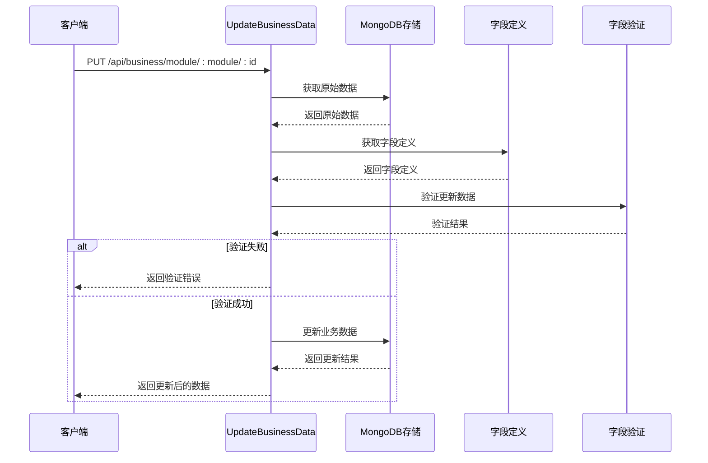
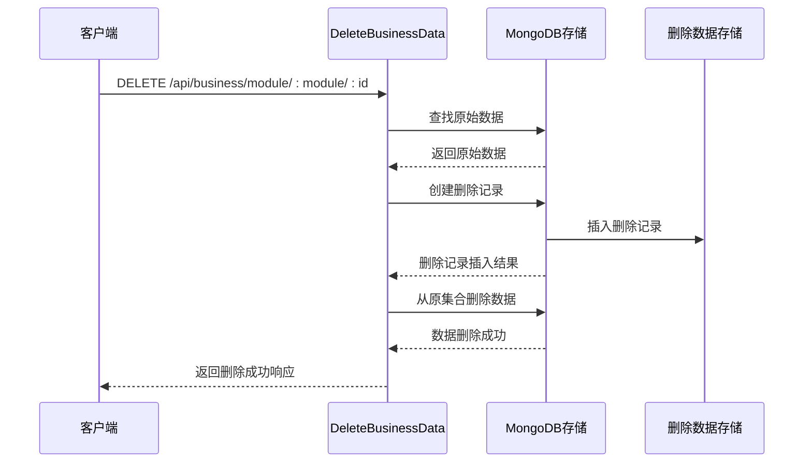
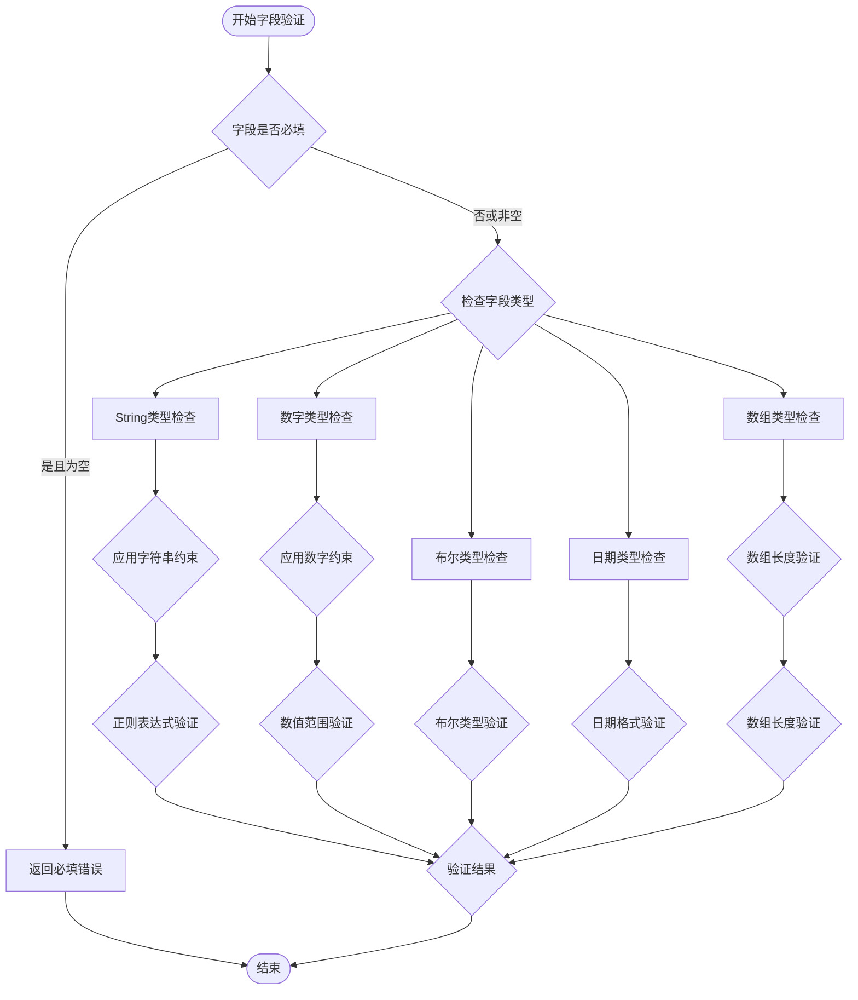
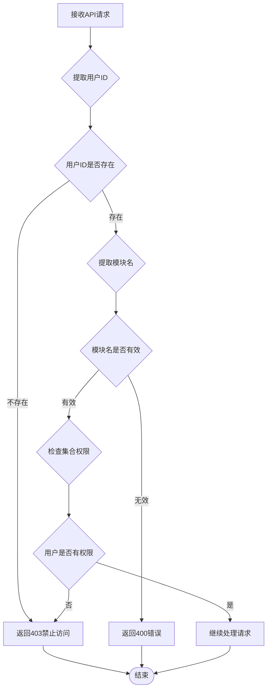
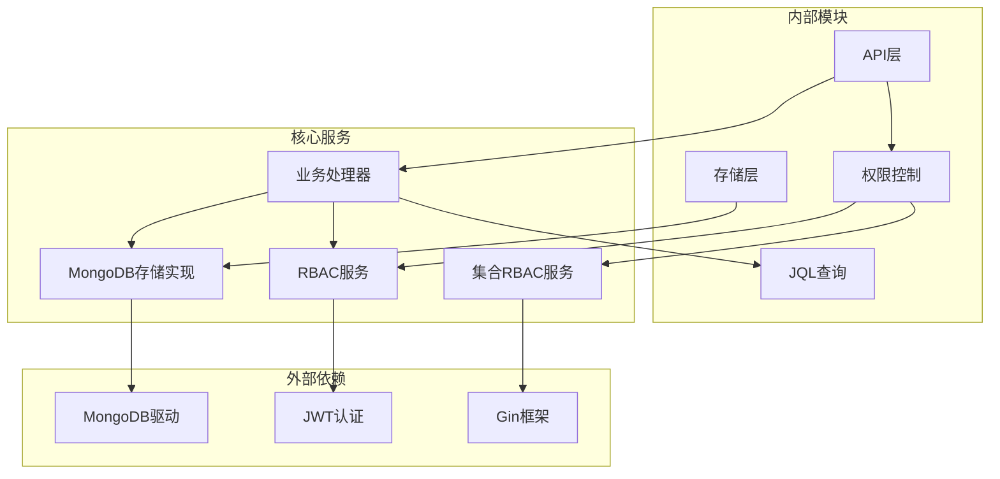

# 业务数据接口

<cite>
**本文档引用的文件**
- [handlers.go](file://internal/api/handlers.go)
- [mongodb_storage.go](file://internal/storage/mongodb_storage.go)
- [collection_rbac.go](file://pkg/rbac/collection_rbac.go)
- [collection_permission_middleware.go](file://internal/api/collection_permission_middleware.go)
- [models.go](file://internal/models/models.go)
- [parser.go](file://pkg/jql/parser.go)
- [business-data.md](file://docs/business-data.md)
- [query.md](file://docs/query.md)
- [rbac_storage.go](file://internal/storage/rbac_storage.go)
- [collection_rbac_storage.go](file://internal/storage/collection_rbac_storage.go)
</cite>

## 目录
1. [简介](#简介)
2. [项目结构](#项目结构)
3. [核心组件](#核心组件)
4. [架构概览](#架构概览)
5. [详细组件分析](#详细组件分析)
6. [依赖关系分析](#依赖关系分析)
7. [性能考量](#性能考量)
8. [故障排除指南](#故障排除指南)
9. [结论](#结论)

## 简介

业务数据接口是数据管理中心的核心功能模块，提供完整的业务数据生命周期管理能力。该系统采用模块化设计，支持动态集合创建、字段定义管理、权限控制和查询功能。

系统主要特性包括：
- **动态模块化架构**：每个业务模块对应独立的MongoDB集合
- **强类型字段验证**：基于字段定义的严格数据验证
- **集合级权限控制**：细粒度的读写删除权限管理
- **JQL查询语言**：类似JIRA JQL的安全查询语法
- **软删除机制**：完整的数据删除和恢复流程
- **审计日志**：完整的操作审计和追踪

## 项目结构



**图表来源**
- [handlers.go:45-181](file://internal/api/handlers.go#L45-L181)
- [mongodb_storage.go:16-51](file://internal/storage/mongodb_storage.go#L16-L51)
- [collection_rbac.go:27-37](file://pkg/rbac/collection_rbac.go#L27-L37)

**章节来源**
- [handlers.go:45-181](file://internal/api/handlers.go#L45-L181)
- [mongodb_storage.go:16-51](file://internal/storage/mongodb_storage.go#L16-L51)

## 核心组件

### 业务数据模型

系统采用灵活的动态数据模型设计，支持任意结构的业务数据存储：

```mermaid
classDiagram
class BusinessData {
+ObjectID _id
+string module
+string description
+map[string]interface{} custom_fields
+string file_path
+BaseModel base_model
}
class FieldDefinition {
+ObjectID _id
+string module
+string field_name
+FieldType field_type
+bool required
+interface{} default_value
+Constraints constraints
+BaseModel base_model
}
class BaseModel {
+string created_by
+datetime created_at
+string updated_by
+datetime updated_at
}
class Constraints {
+ConstraintType type
+float64 min
+float64 max
+int min_length
+int max_length
+string pattern
+array enum_values
+int list_min_len
+int list_max_len
}
BusinessData --> BaseModel
FieldDefinition --> BaseModel
FieldDefinition --> Constraints
```

**图表来源**
- [models.go:12-245](file://internal/models/models.go#L12-L245)

### 权限控制系统

系统实现两层权限控制机制：



**图表来源**
- [collection_rbac.go:13-25](file://pkg/rbac/collection_rbac.go#L13-L25)
- [rbac_storage.go:106-130](file://internal/storage/rbac_storage.go#L106-L130)

**章节来源**
- [models.go:12-245](file://internal/models/models.go#L12-L245)
- [collection_rbac.go:13-25](file://pkg/rbac/collection_rbac.go#L13-L25)
- [rbac_storage.go:106-130](file://internal/storage/rbac_storage.go#L106-L130)

## 架构概览



**图表来源**
- [handlers.go:941-1011](file://internal/api/handlers.go#L941-L1011)
- [collection_permission_middleware.go:16-48](file://internal/api/collection_permission_middleware.go#L16-L48)

## 详细组件分析

### 业务数据接口实现

#### 创建业务数据接口



**图表来源**
- [handlers.go:942-1011](file://internal/api/handlers.go#L942-L1011)
- [mongodb_storage.go:338-347](file://internal/storage/mongodb_storage.go#L338-L347)

#### 查询业务数据接口



**图表来源**
- [handlers.go:1013-1049](file://internal/api/handlers.go#L1013-L1049)
- [parser.go:46-65](file://pkg/jql/parser.go#L46-L65)

#### 更新业务数据接口



**图表来源**
- [handlers.go:1063-1125](file://internal/api/handlers.go#L1063-L1125)
- [mongodb_storage.go:397-409](file://internal/storage/mongodb_storage.go#L397-L409)

#### 删除业务数据接口



**图表来源**
- [handlers.go:1127-1141](file://internal/api/handlers.go#L1127-L1141)
- [mongodb_storage.go:411-493](file://internal/storage/mongodb_storage.go#L411-L493)

### 字段验证机制

系统实现严格的字段验证机制，确保数据完整性：



**图表来源**
- [models.go:73-221](file://internal/models/models.go#L73-L221)

**章节来源**
- [handlers.go:942-1011](file://internal/api/handlers.go#L942-L1011)
- [handlers.go:1063-1125](file://internal/api/handlers.go#L1063-L1125)
- [models.go:73-221](file://internal/models/models.go#L73-L221)

### 权限验证流程



**图表来源**
- [collection_permission_middleware.go:16-48](file://internal/api/collection_permission_middleware.go#L16-L48)
- [collection_rbac.go:39-90](file://pkg/rbac/collection_rbac.go#L39-L90)

**章节来源**
- [collection_permission_middleware.go:16-48](file://internal/api/collection_permission_middleware.go#L16-L48)
- [collection_rbac.go:39-90](file://pkg/rbac/collection_rbac.go#L39-L90)

### 查询功能实现

系统提供强大的JQL查询语言支持：

| 运算符 | 描述 | 示例 |
|--------|------|------|
| = | 等于 | status = "open" |
| != | 不等于 | status != "closed" |
| > | 大于 | created > "2024-01-01" |
| < | 小于 | created < "2024-12-31" |
| >= | 大于等于 | priority >= 3 |
| <= | 小于等于 | priority <= 5 |
| IN | 在列表中 | status IN ("open", "pending") |
| NOT IN | 不在列表中 | status NOT IN ("deleted") |
| LIKE | 模糊匹配 | title LIKE "%keyword%" |
| IS NULL | 为空 | assignee IS NULL |
| IS NOT NULL | 不为空 | assignee IS NOT NULL |
| AND | 逻辑与 | status = "open" AND priority > 3 |
| OR | 逻辑或 | status = "open" OR status = "pending" |

**章节来源**
- [handlers.go:1013-1049](file://internal/api/handlers.go#L1013-L1049)
- [parser.go:14-30](file://pkg/jql/parser.go#L14-L30)
- [query.md:16-32](file://docs/query.md#L16-L32)

## 依赖关系分析



**图表来源**
- [handlers.go:3-21](file://internal/api/handlers.go#L3-L21)
- [mongodb_storage.go:3-14](file://internal/storage/mongodb_storage.go#L3-L14)
- [collection_rbac.go:3-11](file://pkg/rbac/collection_rbac.go#L3-L11)

**章节来源**
- [handlers.go:3-21](file://internal/api/handlers.go#L3-L21)
- [mongodb_storage.go:3-14](file://internal/storage/mongodb_storage.go#L3-L14)
- [collection_rbac.go:3-11](file://pkg/rbac/collection_rbac.go#L3-L11)

## 性能考量

### 查询优化策略

1. **索引策略**
   - 为常用查询字段创建索引
   - 复合索引用于多条件查询
   - 避免在索引字段上使用函数

2. **分页机制**
   - 默认每页10条记录
   - 支持跳过和限制参数
   - 提供总数统计

3. **缓存策略**
   - 热门查询结果缓存
   - 字段定义缓存
   - 权限检查结果缓存

### 安全防护措施

1. **输入验证**
   - 严格的数据类型验证
   - 字段长度和范围限制
   - 正则表达式模式匹配

2. **权限控制**
   - 集合级权限检查
   - 字段级权限验证
   - 操作审计日志

3. **查询安全**
   - JQL语法解析和验证
   - 防注入攻击机制
   - 查询复杂度限制

## 故障排除指南

### 常见问题及解决方案

#### 权限相关问题

**问题**：用户无法访问业务数据
- 检查用户是否具有相应模块的读取权限
- 验证集合角色分配是否正确
- 确认系统权限配置

**问题**：字段验证失败
- 检查字段定义是否正确配置
- 验证数据类型是否符合约束
- 确认必填字段是否已提供

#### 查询相关问题

**问题**：JQL查询语法错误
- 使用查询验证接口检查语法
- 参考JQL语法示例
- 确认运算符使用正确

**问题**：查询性能问题
- 检查相关字段是否建立索引
- 优化查询条件
- 调整分页参数

#### 数据操作问题

**问题**：软删除后无法恢复
- 确认删除记录存在于deleted_data集合
- 检查恢复权限
- 验证数据完整性

**章节来源**
- [handlers.go:942-1011](file://internal/api/handlers.go#L942-L1011)
- [handlers.go:1063-1125](file://internal/api/handlers.go#L1063-L1125)
- [mongodb_storage.go:411-562](file://internal/storage/mongodb_storage.go#L411-L562)

## 结论

业务数据接口系统提供了完整的模块化数据管理解决方案。通过动态集合设计、严格的字段验证、细粒度的权限控制和强大的查询功能，系统能够满足各种业务场景的需求。

关键优势包括：
- **灵活性**：支持任意结构的业务数据存储
- **安全性**：多层次的权限控制和数据验证
- **可扩展性**：模块化设计便于功能扩展
- **易用性**：直观的API接口和丰富的查询功能

未来改进方向：
- 增加数据版本控制功能
- 优化查询性能监控
- 扩展审计日志功能
- 增强数据导入导出能力