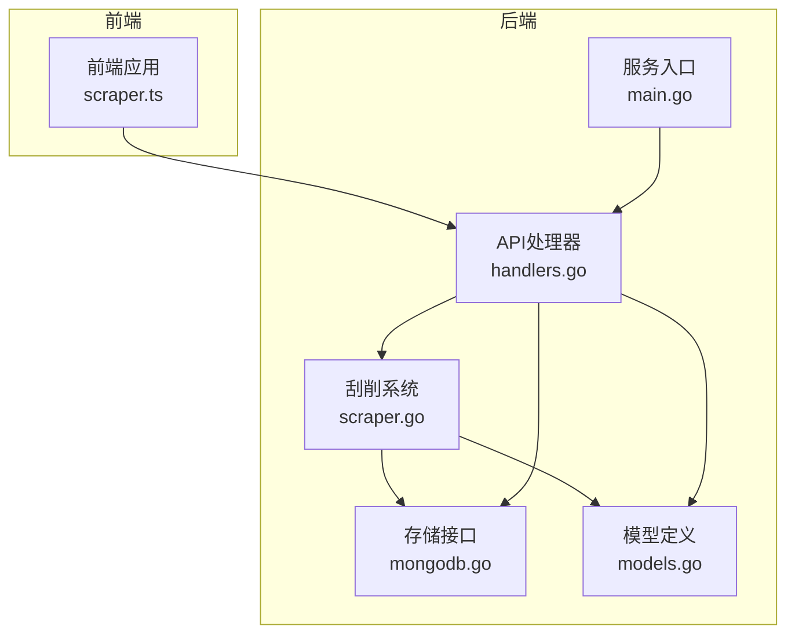
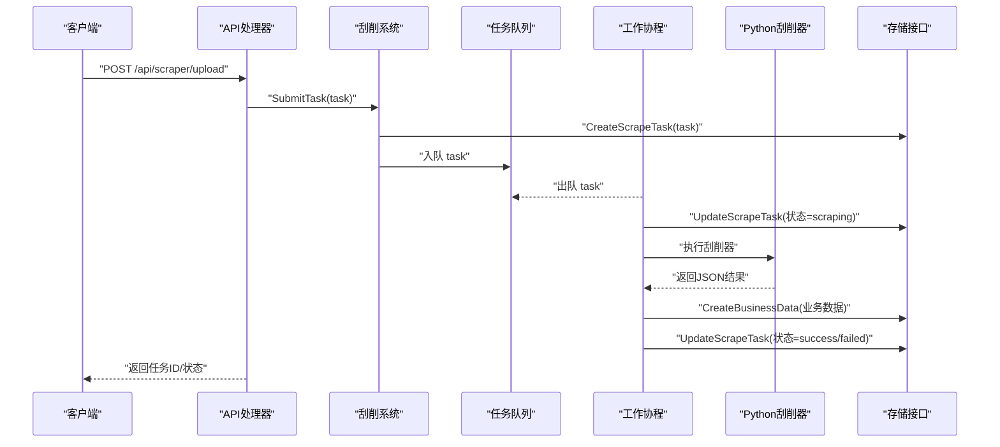
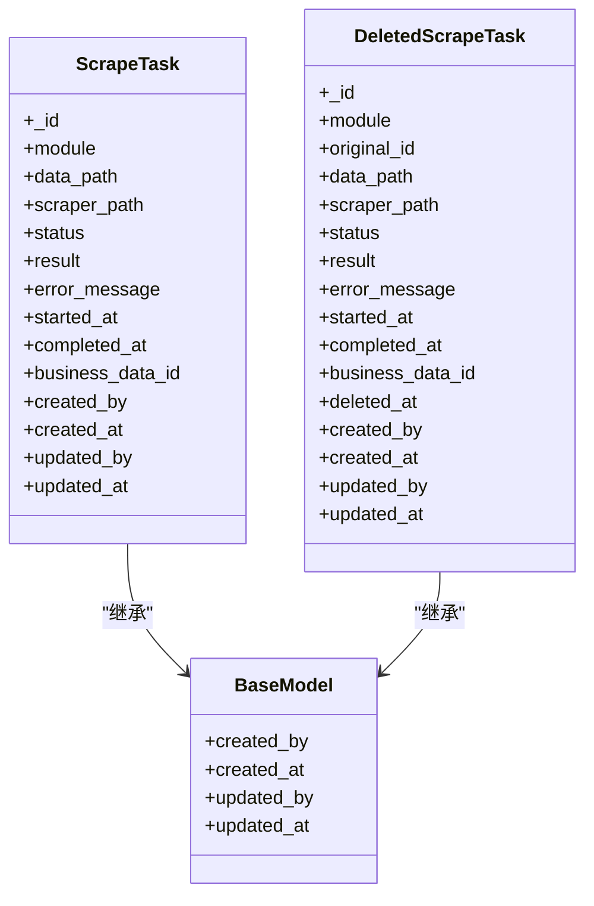
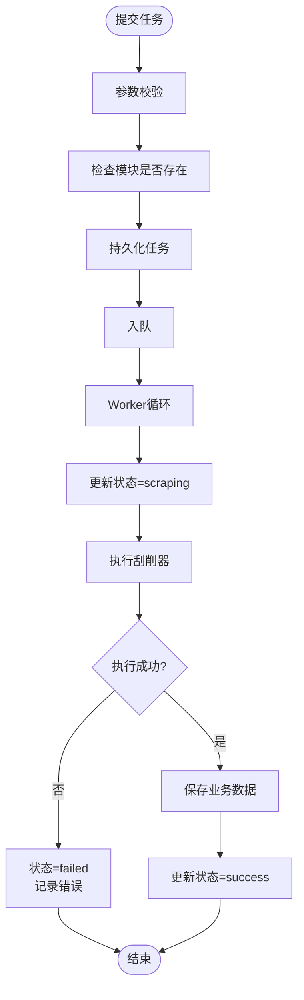
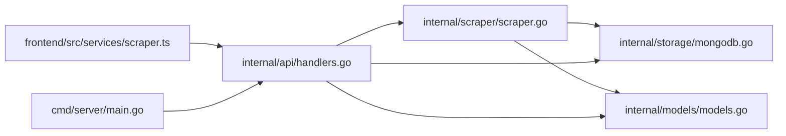

# 刮削任务接口

<cite>
**本文档引用的文件**
- [internal/scraper/scraper.go](file://internal/scraper/scraper.go)
- [internal/models/models.go](file://internal/models/models.go)
- [internal/api/handlers.go](file://internal/api/handlers.go)
- [internal/storage/mongodb.go](file://internal/storage/mongodb.go)
- [frontend/src/services/scraper.ts](file://frontend/src/services/scraper.ts)
- [cmd/server/main.go](file://cmd/server/main.go)
- [docs/modules/scraper/implementation.md](file://docs/modules/scraper/implementation.md)
</cite>

## 目录
1. [简介](#简介)
2. [项目结构](#项目结构)
3. [核心组件](#核心组件)
4. [架构总览](#架构总览)
5. [详细组件分析](#详细组件分析)
6. [依赖关系分析](#依赖关系分析)
7. [性能考虑](#性能考虑)
8. [故障排查指南](#故障排查指南)
9. [结论](#结论)
10. [附录](#附录)

## 简介
本文件面向前端与后端开发者，提供“刮削任务接口”的完整API文档。内容涵盖：
- 提交刮削任务
- 获取任务列表
- 根据ID获取任务
- 重试任务
- 删除任务
- 批量删除任务
- 已删除刮削任务的恢复机制与数据保留策略
- 刮削任务的数据结构、状态管理、异步处理机制、参数校验与错误处理
- 查询过滤、状态统计与性能监控建议

## 项目结构
后端采用分层架构：
- API层：定义REST接口与鉴权、权限中间件
- 业务层：刮削系统（Worker Pool + Channel队列）
- 存储层：MongoDB接口抽象
- 模型层：统一的数据模型与字段验证
- 前端：调用API的服务封装

图表来源
- [cmd/server/main.go:94-118](file://cmd/server/main.go#L94-L118)
- [internal/api/handlers.go:45-181](file://internal/api/handlers.go#L45-L181)
- [internal/scraper/scraper.go:25-45](file://internal/scraper/scraper.go#L25-L45)
- [internal/storage/mongodb.go:14-90](file://internal/storage/mongodb.go#L14-L90)
- [internal/models/models.go:273-311](file://internal/models/models.go#L273-L311)

章节来源
- [cmd/server/main.go:24-150](file://cmd/server/main.go#L24-L150)
- [internal/api/handlers.go:45-181](file://internal/api/handlers.go#L45-L181)

## 核心组件
- 刮削系统（Worker Pool）：负责接收任务、并发执行、状态更新与结果持久化
- API处理器：暴露REST接口，进行鉴权与权限控制
- 存储接口：抽象MongoDB访问，支持刮削任务与已删除任务的CRUD
- 模型与字段验证：定义任务结构、状态枚举、字段约束与验证逻辑

章节来源
- [internal/scraper/scraper.go:18-45](file://internal/scraper/scraper.go#L18-L45)
- [internal/models/models.go:273-311](file://internal/models/models.go#L273-L311)
- [internal/storage/mongodb.go:14-90](file://internal/storage/mongodb.go#L14-L90)

## 架构总览
后端通过Gin框架注册路由，API处理器在进入业务逻辑前经过鉴权与权限中间件。刮削系统以Worker Pool模式运行，使用Channel作为任务队列，每个Worker从队列取出任务并执行外部Python脚本，最终将结果写入业务数据集合，并更新任务状态。

图表来源
- [internal/api/handlers.go:1189-1226](file://internal/api/handlers.go#L1189-L1226)
- [internal/scraper/scraper.go:74-193](file://internal/scraper/scraper.go#L74-L193)
- [internal/scraper/scraper.go:196-231](file://internal/scraper/scraper.go#L196-L231)
- [internal/scraper/scraper.go:234-288](file://internal/scraper/scraper.go#L234-L288)

## 详细组件分析

### 刮削任务数据模型
- ScrapeTask：任务实体，包含模块、数据路径、刮削器路径、状态、结果、错误信息、时间戳、业务数据ID等
- DeletedScrapeTask：软删除后的任务镜像，包含删除时间
- 状态枚举：pending、scraping、success、failed

图表来源
- [internal/models/models.go:282-311](file://internal/models/models.go#L282-L311)

章节来源
- [internal/models/models.go:273-311](file://internal/models/models.go#L273-L311)

### 异步处理与状态管理
- 提交流程：参数校验 → 模块存在性检查 → 持久化任务 → 入队
- 执行流程：状态=scraping → 执行外部脚本 → 成功/失败 → 写入业务数据 → 更新任务状态
- Worker循环：select监听队列与停止信号；队列关闭或收到停止信号安全退出
- 最大重试次数：未设置上限，可通过重试接口多次提交同一任务

图表来源
- [internal/scraper/scraper.go:74-193](file://internal/scraper/scraper.go#L74-L193)
- [internal/scraper/scraper.go:102-120](file://internal/scraper/scraper.go#L102-L120)

章节来源
- [internal/scraper/scraper.go:74-193](file://internal/scraper/scraper.go#L74-L193)
- [docs/modules/scraper/implementation.md:98-126](file://docs/modules/scraper/implementation.md#L98-L126)

### API接口定义

- 提交刮削任务
  - 方法与路径：POST /api/scraper/upload
  - 权限：需要刮削写权限
  - 请求体字段：
    - module：目标模块（必填）
    - data_path：数据文件路径（必填）
    - scraper_path：刮削器脚本路径（必填）
    - description：任务描述（可选）
  - 返回：任务ID与消息
  - 错误：参数校验失败、模块不存在、内部错误

- 获取任务列表
  - 方法与路径：GET /api/scraper/tasks
  - 权限：需要刮削读权限
  - 查询参数：
    - module：按模块过滤
    - status：按状态过滤
    - page/pageSize 或 skip/limit：分页
  - 返回：任务列表与总数

- 根据ID获取任务
  - 方法与路径：GET /api/scraper/tasks/:id
  - 权限：需要刮削读权限
  - 返回：单个任务详情

- 重试任务
  - 方法与路径：POST /api/scraper/tasks/:id/retry
  - 权限：需要刮削写权限
  - 请求体字段：
    - scraper_path：可选，更新刮削器路径后重试
  - 行为：重置状态为pending，清空错误信息与时间戳，重新入队

- 删除任务
  - 方法与路径：DELETE /api/scraper/tasks/:id
  - 权限：需要刮削写权限
  - 行为：软删除，移至已删除刮削任务集合

- 批量删除任务
  - 方法与路径：POST /api/scraper/tasks/batch-delete
  - 权限：需要刮削写权限
  - 请求体字段：ids（任务ID数组，必填）
  - 行为：逐个软删除，返回成功删除数量

- 已删除刮削任务恢复
  - 方法与路径：POST /api/deleted-scraper/:id/recover
  - 权限：需要刮削写权限
  - 行为：将已删除任务恢复为正常任务

章节来源
- [internal/api/handlers.go:142-160](file://internal/api/handlers.go#L142-L160)
- [internal/api/handlers.go:1189-1226](file://internal/api/handlers.go#L1189-L1226)
- [internal/api/handlers.go:1228-1264](file://internal/api/handlers.go#L1228-L1264)
- [internal/api/handlers.go:1266-1302](file://internal/api/handlers.go#L1266-L1302)
- [internal/api/handlers.go:1304-1312](file://internal/api/handlers.go#L1304-L1312)
- [internal/api/handlers.go:1314-1332](file://internal/api/handlers.go#L1314-L1332)
- [internal/api/handlers.go:1376-1385](file://internal/api/handlers.go#L1376-L1385)

### 前端调用示例
- 任务列表查询：支持关键词（模块名）、状态、分页参数
- 重试任务：可选传入新的刮削器路径
- 恢复已删除任务：通过已删除任务ID发起恢复请求
- 创建任务：传入模块、数据路径、刮削器路径与描述

章节来源
- [frontend/src/services/scraper.ts:37-102](file://frontend/src/services/scraper.ts#L37-L102)

## 依赖关系分析
- API层依赖刮削系统与存储接口
- 刮削系统依赖存储接口与外部Python脚本
- 模型层被API与刮削系统共同使用
- 前端通过服务封装调用后端接口

图表来源
- [frontend/src/services/scraper.ts:1-105](file://frontend/src/services/scraper.ts#L1-L105)
- [internal/api/handlers.go:33-43](file://internal/api/handlers.go#L33-L43)
- [internal/scraper/scraper.go:26-44](file://internal/scraper/scraper.go#L26-L44)
- [internal/storage/mongodb.go:14-90](file://internal/storage/mongodb.go#L14-L90)
- [internal/models/models.go:273-311](file://internal/models/models.go#L273-L311)
- [cmd/server/main.go:94-118](file://cmd/server/main.go#L94-L118)

章节来源
- [internal/api/handlers.go:33-43](file://internal/api/handlers.go#L33-L43)
- [internal/scraper/scraper.go:26-44](file://internal/scraper/scraper.go#L26-L44)
- [internal/storage/mongodb.go:14-90](file://internal/storage/mongodb.go#L14-L90)
- [internal/models/models.go:273-311](file://internal/models/models.go#L273-L311)
- [cmd/server/main.go:94-118](file://cmd/server/main.go#L94-L118)

## 性能考虑
- Worker池大小：通过环境变量配置，默认4个协程
- 任务队列容量：默认1000，避免内存暴涨
- 并发执行：多个Worker并行处理，提升吞吐
- 外部脚本执行：同步等待，建议优化脚本执行效率与超时控制
- 分页查询：列表接口支持分页，避免一次性返回大量数据
- 字段验证：非阻塞策略，降低失败率

章节来源
- [cmd/server/main.go:65-69](file://cmd/server/main.go#L65-L69)
- [internal/scraper/scraper.go:39-44](file://internal/scraper/scraper.go#L39-L44)
- [internal/api/handlers.go:1228-1252](file://internal/api/handlers.go#L1228-L1252)

## 故障排查指南
- 提交任务失败
  - 检查模块是否存在
  - 校验数据文件与刮削器路径是否正确
  - 查看后端日志定位具体错误
- 任务长时间处于pending
  - 检查Worker池是否正常启动
  - 检查任务队列是否积压
- 任务执行失败
  - 查看错误信息字段
  - 检查外部脚本返回的JSON格式是否符合契约
- 无法获取任务列表
  - 确认查询参数（module/status/page/pageSize）
  - 检查权限是否具备刮削读权限
- 重试任务无效
  - 确认任务ID有效
  - 如需更换脚本路径，确认请求体包含新的scraper_path

章节来源
- [internal/scraper/scraper.go:74-99](file://internal/scraper/scraper.go#L74-L99)
- [internal/scraper/scraper.go:196-231](file://internal/scraper/scraper.go#L196-L231)
- [internal/api/handlers.go:1189-1226](file://internal/api/handlers.go#L1189-L1226)
- [internal/api/handlers.go:1266-1302](file://internal/api/handlers.go#L1266-L1302)

## 结论
本API体系以Worker Pool为核心，结合严格的参数校验与非阻塞字段验证，实现了高可靠的任务异步处理。通过软删除与恢复机制，保障了数据的可追溯性与可恢复性。建议在生产环境中合理配置Worker数量与队列容量，并对脚本执行进行超时与资源限制，以获得更稳定的性能表现。

## 附录

### 刮削器输出契约
- 成功时返回包含success与data字段的JSON
- 失败时返回包含success=false与error字段的JSON

章节来源
- [docs/modules/scraper/implementation.md:214-225](file://docs/modules/scraper/implementation.md#L214-L225)

### 已删除刮削任务的恢复机制
- 软删除：删除任务进入已删除刮削任务集合
- 恢复：通过deleted-scraper的恢复接口将任务恢复为正常任务
- 数据保留策略：删除后仍保留任务元数据与错误信息，便于审计与回溯

章节来源
- [internal/api/handlers.go:1334-1385](file://internal/api/handlers.go#L1334-L1385)
- [internal/models/models.go:297-311](file://internal/models/models.go#L297-L311)