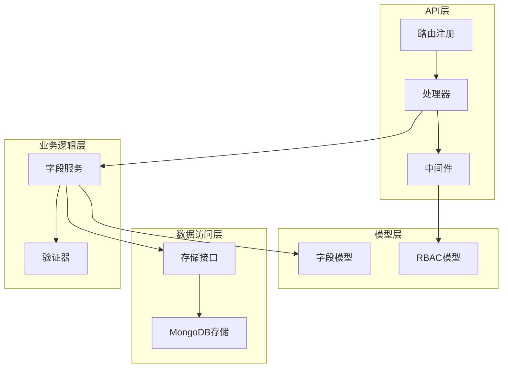
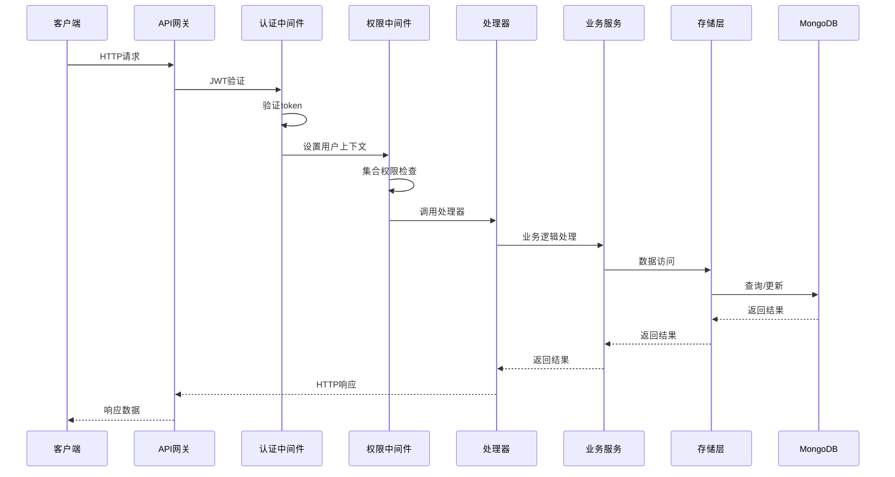
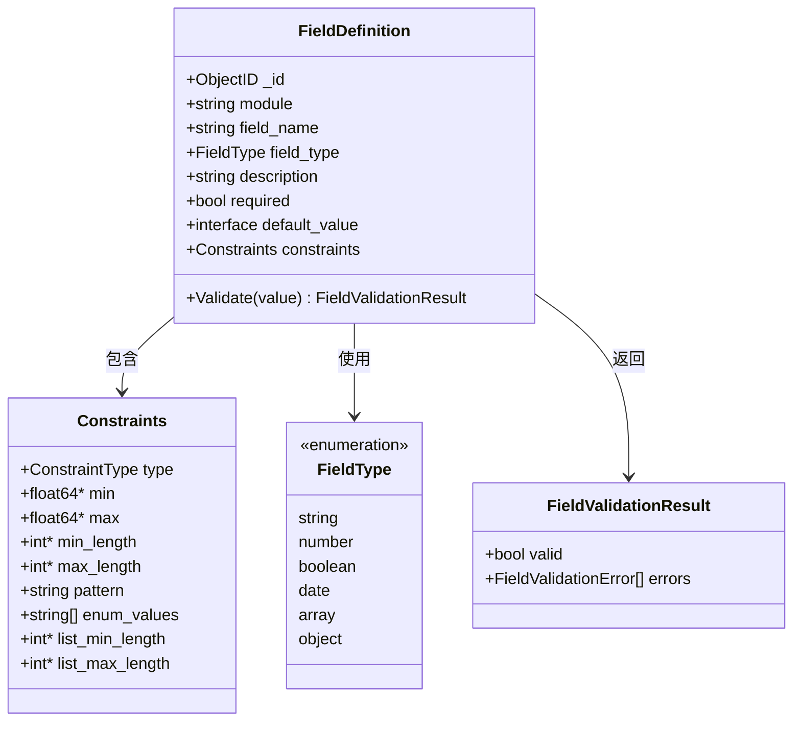
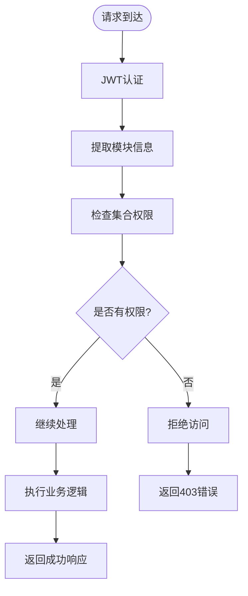
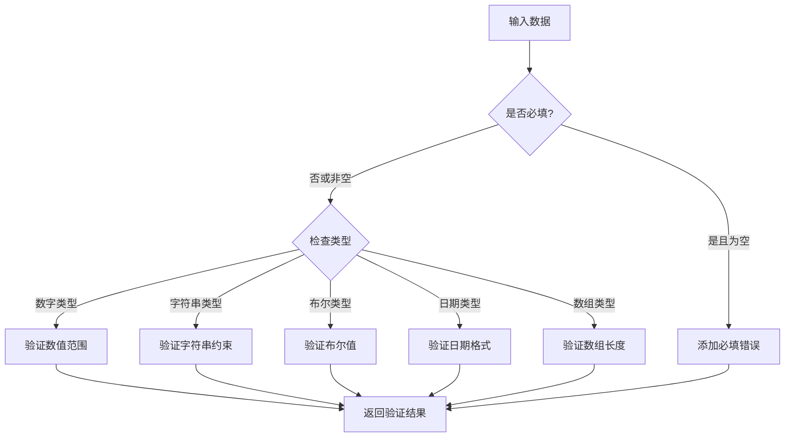
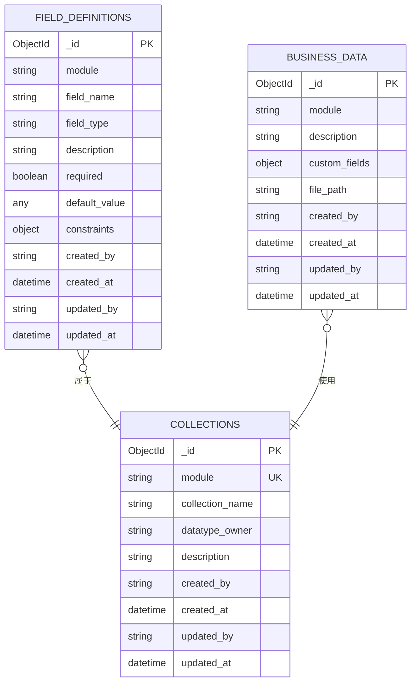
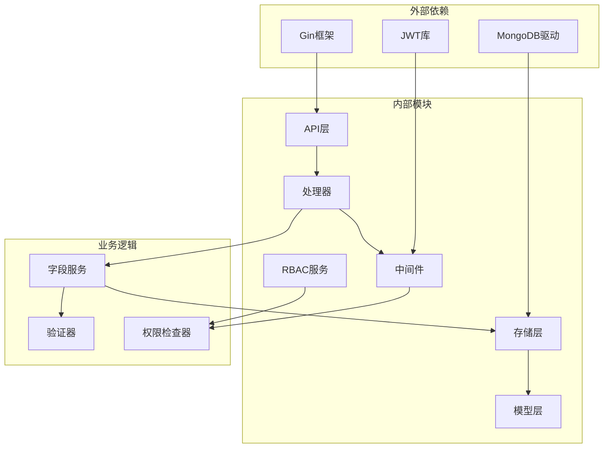

# 字段管理接口

<cite>
**本文引用的文件**
- [handlers.go](file://internal/api/handlers.go)
- [collection_permission_middleware.go](file://internal/api/collection_permission_middleware.go)
- [mongodb_storage.go](file://internal/storage/mongodb_storage.go)
- [models.go](file://internal/models/models.go)
- [rbac.go](file://pkg/rbac/collection_rbac.go)
- [api.md](file://docs/api.md)
- [api-spec.md](file://docs/api-spec.md)
</cite>

## 目录
1. [简介](#简介)
2. [项目结构](#项目结构)
3. [核心组件](#核心组件)
4. [架构概览](#架构概览)
5. [详细组件分析](#详细组件分析)
6. [依赖关系分析](#依赖关系分析)
7. [性能考量](#性能考量)
8. [故障排除指南](#故障排除指南)
9. [结论](#结论)

## 简介
本文件提供数据中心系统中字段管理接口的完整API文档。涵盖按模块获取字段定义、根据ID获取字段定义、创建字段定义、更新字段定义、删除字段定义等核心接口。详细说明字段定义的数据结构、验证规则、显示属性，以及集合级权限在字段管理中的应用机制。同时包含字段创建时的验证规则配置、字段更新时的兼容性检查、字段删除时的软删除机制和数据迁移考虑，以及字段查询的模块过滤和字段详情的完整信息展示。

## 项目结构
字段管理接口位于后端API层，采用分层架构设计：
- API层：处理HTTP请求和响应，实现路由注册和中间件
- 业务逻辑层：封装字段管理的具体业务逻辑
- 数据访问层：提供字段定义的持久化存储接口
- 模型层：定义字段定义的数据结构和验证规则
- 权限控制层：实现集合级权限验证机制

**图表来源**
- [handlers.go:45-181](file://internal/api/handlers.go#L45-L181)
- [mongodb_storage.go:16-51](file://internal/storage/mongodb_storage.go#L16-L51)
- [models.go:51-61](file://internal/models/models.go#L51-L61)

**章节来源**
- [handlers.go:45-181](file://internal/api/handlers.go#L45-L181)
- [mongodb_storage.go:16-51](file://internal/storage/mongodb_storage.go#L16-L51)

## 核心组件
字段管理接口由以下核心组件构成：

### 1. 路由注册
- `/api/fields/module/:module` - 按模块获取字段定义
- `/api/fields/:id` - 根据ID获取字段定义
- `/api/fields` - 创建字段定义
- `/api/fields/:id` (PUT) - 更新字段定义
- `/api/fields/:id` (DELETE) - 删除字段定义

### 2. 权限控制
- 集合级读权限：`CollectionPermissionRead`
- 字段管理权限：`:field:admin`
- 用户认证中间件：JWT Bearer Token

### 3. 数据模型
字段定义包含以下关键属性：
- 模块标识：`module`
- 字段名称：`field_name`
- 字段类型：`field_type`
- 描述信息：`description`
- 必填标志：`required`
- 默认值：`default_value`
- 约束条件：`constraints`

**章节来源**
- [handlers.go:88-103](file://internal/api/handlers.go#L88-L103)
- [models.go:51-61](file://internal/models/models.go#L51-L61)

## 架构概览
字段管理接口采用MVC架构模式，通过中间件实现权限控制，通过存储接口实现数据持久化。

**图表来源**
- [handlers.go:260-314](file://internal/api/handlers.go#L260-L314)
- [collection_permission_middleware.go:16-48](file://internal/api/collection_permission_middleware.go#L16-L48)

## 详细组件分析

### 字段定义数据结构
字段定义采用统一的数据模型，支持多种数据类型和约束条件：

**图表来源**
- [models.go:51-71](file://internal/models/models.go#L51-L71)
- [models.go:39-49](file://internal/models/models.go#L39-L49)

#### 字段类型支持
系统支持以下字段类型：
- 字符串类型 (`string`)：支持长度限制、正则表达式、枚举值
- 数字类型 (`number`)：支持数值范围限制
- 布尔类型 (`boolean`)：支持真/假值
- 日期类型 (`date`)：支持RFC3339格式验证
- 数组类型 (`array`)：支持数组长度限制
- 对象类型 (`object`)：支持复杂数据结构

#### 约束条件配置
字段约束提供灵活的验证机制：
- 数值约束：最小值、最大值
- 字符串约束：最小长度、最大长度、正则表达式、枚举值
- 数组约束：最小长度、最大长度
- 必填约束：强制必填验证

**章节来源**
- [models.go:19-28](file://internal/models/models.go#L19-L28)
- [models.go:39-49](file://internal/models/models.go#L39-L49)

### 权限控制机制
字段管理采用集合级权限控制，确保不同模块间的权限隔离：

**图表来源**
- [collection_permission_middleware.go:16-48](file://internal/api/collection_permission_middleware.go#L16-L48)
- [rbac.go:39-90](file://pkg/rbac/collection_rbac.go#L39-L90)

#### 权限类型说明
- `CollectionPermissionRead`：集合读取权限
- `CollectionPermissionFieldAdmin`：字段管理权限
- 系统管理员权限：`system:admin`

#### 权限检查流程
1. 验证用户JWT令牌
2. 提取请求中的模块信息
3. 检查用户是否具有指定模块的字段管理权限
4. 验证通过后执行相应操作

**章节来源**
- [rbac.go:13-21](file://pkg/rbac/collection_rbac.go#L13-L21)
- [collection_permission_middleware.go:50-93](file://internal/api/collection_permission_middleware.go#L50-L93)

### API接口规范

#### 按模块获取字段定义
- **方法**：GET
- **路径**：`/api/fields/module/:module`
- **权限**：`CollectionPermissionRead`
- **功能**：获取指定模块下的所有字段定义
- **响应**：字段定义数组

#### 根据ID获取字段定义
- **方法**：GET  
- **路径**：`/api/fields/:id`
- **权限**：`field:read`
- **功能**：获取指定ID的字段定义详情
- **响应**：单个字段定义对象

#### 创建字段定义
- **方法**：POST
- **路径**：`/api/fields`
- **权限**：`CollectionPermissionFieldAdmin` (从请求体提取模块)
- **功能**：创建新的字段定义
- **请求体**：字段定义对象
- **响应**：创建的字段定义对象

#### 更新字段定义
- **方法**：PUT
- **路径**：`/api/fields/:id`
- **权限**：`CollectionPermissionFieldAdmin` (从数据库获取模块)
- **功能**：更新现有字段定义
- **请求体**：部分字段定义对象
- **响应**：更新后的字段定义对象

#### 删除字段定义
- **方法**：DELETE
- **路径**：`/api/fields/:id`
- **权限**：`CollectionPermissionFieldAdmin`
- **功能**：删除字段定义（软删除）
- **响应**：删除成功消息

**章节来源**
- [handlers.go:88-103](file://internal/api/handlers.go#L88-L103)
- [handlers.go:853-940](file://internal/api/handlers.go#L853-L940)

### 字段验证机制
字段验证采用运行时验证策略，确保数据完整性：

**图表来源**
- [models.go:73-221](file://internal/models/models.go#L73-L221)

#### 验证规则
- 必填验证：检查`required`标志和空值
- 类型验证：根据`field_type`进行类型转换和验证
- 约束验证：根据具体约束条件进行验证
- 自定义验证：支持正则表达式和枚举值验证

**章节来源**
- [models.go:73-221](file://internal/models/models.go#L73-L221)

### 数据存储实现
字段定义存储在MongoDB中，采用统一的集合结构：

**图表来源**
- [mongodb_storage.go:43](file://internal/storage/mongodb_storage.go#L43)
- [mongodb_storage.go:284-336](file://internal/storage/mongodb_storage.go#L284-L336)

#### 存储特性
- 使用MongoDB的`field_definitions`集合存储字段定义
- 支持字段级别的查询和过滤
- 提供完整的CRUD操作支持
- 支持字段定义的版本控制

**章节来源**
- [mongodb_storage.go:284-336](file://internal/storage/mongodb_storage.go#L284-L336)

## 依赖关系分析

### 组件依赖图
字段管理接口涉及多个层次的依赖关系：

**图表来源**
- [handlers.go:1-21](file://internal/api/handlers.go#L1-L21)
- [mongodb_storage.go:16-51](file://internal/storage/mongodb_storage.go#L16-L51)

### 关键依赖关系
1. **API层依赖**：处理器依赖中间件、存储接口和RBAC服务
2. **存储层依赖**：MongoDB驱动提供数据持久化能力
3. **权限层依赖**：RBAC服务提供权限验证机制
4. **模型层依赖**：数据模型定义了字段结构和验证规则

**章节来源**
- [handlers.go:1-21](file://internal/api/handlers.go#L1-L21)
- [mongodb_storage.go:16-51](file://internal/storage/mongodb_storage.go#L16-L51)

## 性能考量
字段管理接口在设计时充分考虑了性能优化：

### 查询优化
- 使用MongoDB索引支持按模块快速查询
- 支持分页查询避免大数据量影响
- 缓存常用字段定义减少数据库访问

### 并发处理
- 采用连接池管理数据库连接
- 异步处理非关键操作
- 避免长事务阻塞

### 内存管理
- 流式处理大文档
- 及时释放数据库连接
- 控制响应体大小

## 故障排除指南

### 常见错误及解决方案
1. **权限不足错误 (403)**：
   - 确认用户是否具有相应的集合权限
   - 检查模块参数是否正确传递
   - 验证JWT令牌的有效性

2. **字段验证失败 (400)**：
   - 检查字段类型与约束配置
   - 验证输入数据格式
   - 确认必填字段是否提供

3. **数据不存在错误 (404)**：
   - 确认字段ID是否存在
   - 检查模块名称是否正确
   - 验证数据库连接状态

### 调试建议
- 启用详细的日志记录
- 使用API测试工具验证请求格式
- 检查数据库连接和索引状态
- 监控系统资源使用情况

**章节来源**
- [handlers.go:853-940](file://internal/api/handlers.go#L853-L940)

## 结论
字段管理接口提供了完整的字段生命周期管理能力，包括字段定义的创建、查询、更新和删除。通过集合级权限控制确保了多租户环境下的安全性，通过灵活的验证机制保证了数据质量。接口设计遵循RESTful原则，提供了清晰的错误处理和响应格式。整体架构采用分层设计，便于维护和扩展，能够满足复杂业务场景下的字段管理需求。