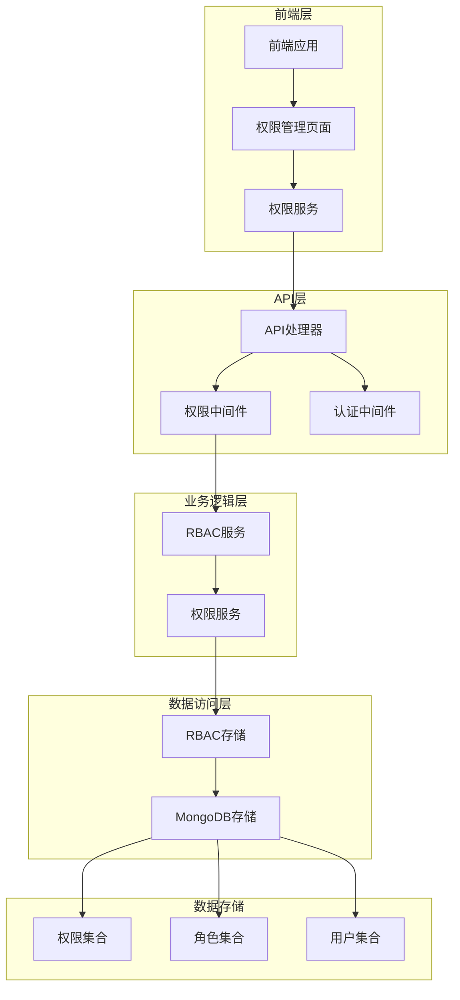
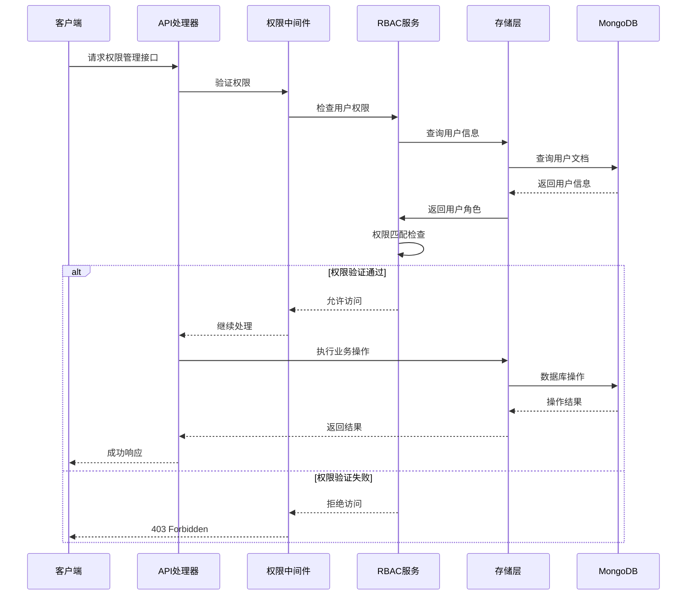
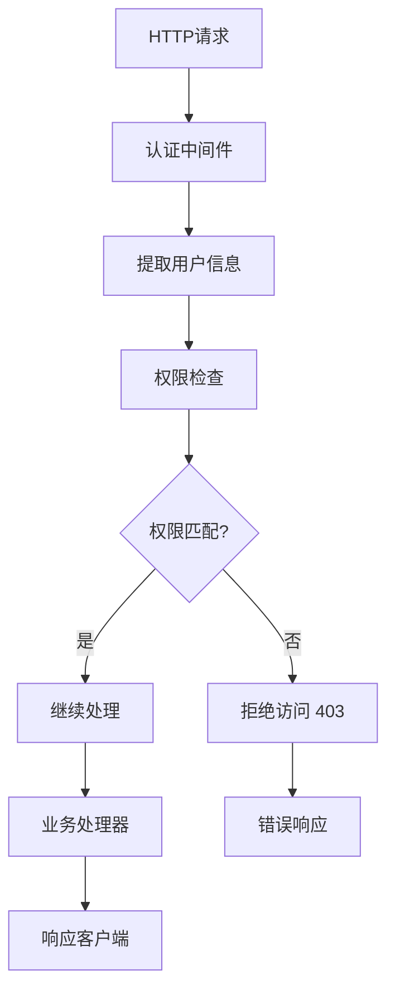
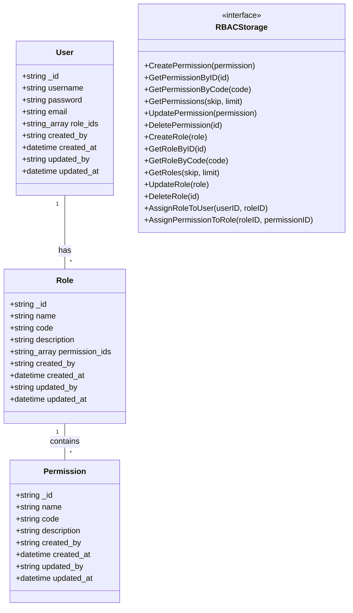
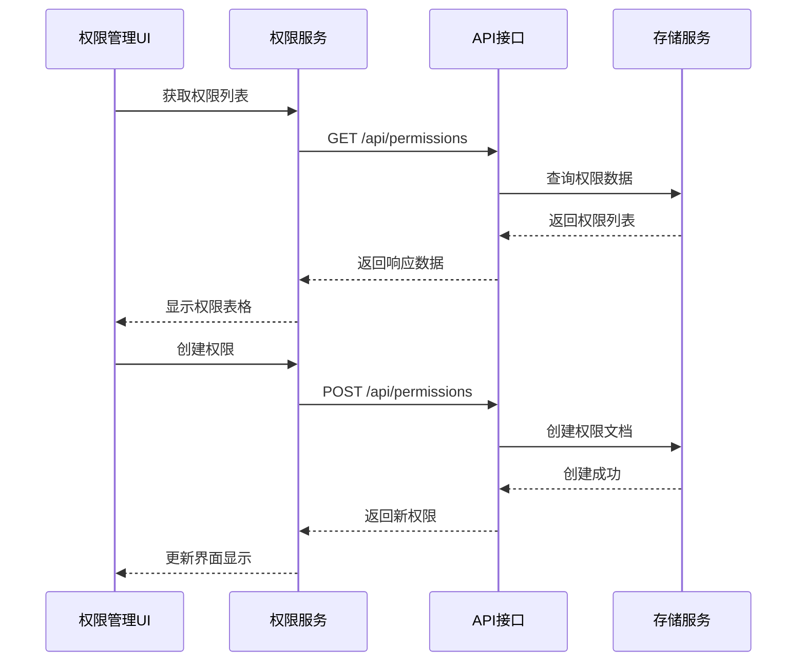

# 权限管理接口

<cite>
**本文档引用的文件**
- [models.go](file://internal/models/models.go)
- [rbac.go](file://pkg/rbac/rbac.go)
- [rbac_storage.go](file://internal/storage/rbac_storage.go)
- [handlers.go](file://internal/api/handlers.go)
- [rbac.ts](file://frontend/src/services/rbac.ts)
- [PermissionManagement.tsx](file://frontend/src/pages/Admin/PermissionManagement.tsx)
- [rbac.md](file://docs/rbac.md)
- [main.go](file://cmd/server/main.go)
</cite>

## 目录
1. [简介](#简介)
2. [项目结构](#项目结构)
3. [核心组件](#核心组件)
4. [架构概览](#架构概览)
5. [详细组件分析](#详细组件分析)
6. [依赖关系分析](#依赖关系分析)
7. [性能考量](#性能考量)
8. [故障排除指南](#故障排除指南)
9. [结论](#结论)

## 简介

权限管理接口是基于RBAC（基于角色的访问控制）模型构建的完整权限管理系统。该系统提供RESTful API接口，支持权限的创建、查询、更新和删除操作，同时实现了完善的权限检查机制和安全控制。

系统采用MongoDB作为数据存储，通过嵌入式数组实现多对多关系管理，支持权限继承和级联操作。前端提供完整的权限管理界面，支持权限的增删改查和批量操作。

## 项目结构



**图表来源**
- [main.go:94-118](file://cmd/server/main.go#L94-L118)
- [handlers.go:45-181](file://internal/api/handlers.go#L45-L181)
- [rbac_storage.go:16-79](file://internal/storage/rbac_storage.go#L16-L79)

**章节来源**
- [main.go:24-167](file://cmd/server/main.go#L24-L167)
- [handlers.go:23-43](file://internal/api/handlers.go#L23-L43)

## 核心组件

### 权限实体模型

权限实体是RBAC系统的核心数据结构，包含以下关键字段：

| 字段名 | 数据类型 | 描述 | 约束条件 |
|--------|----------|------|----------|
| `_id` | ObjectId | 权限唯一标识符 | 主键，自动生成 |
| `name` | String | 权限显示名称 | 必填，UTF-8编码 |
| `code` | String | 权限代码标识 | 唯一，必填，格式：`模块:操作` |
| `description` | String | 权限描述信息 | 可选，UTF-8编码 |
| `created_by` | String | 创建者标识 | 必填 |
| `created_at` | DateTime | 创建时间 | 自动生成 |
| `updated_by` | String | 更新者标识 | 必填 |
| `updated_at` | DateTime | 更新时间 | 自动生成 |

### 权限编码规范

权限代码采用层级命名规范，格式为：`模块:操作`

**模块分类：**
- `user` - 用户管理相关权限
- `role` - 角色管理相关权限  
- `permission` - 权限管理相关权限
- `data` - 数据操作相关权限
- `collection` - 集合管理相关权限
- `field` - 字段管理相关权限
- `scrape` - 数据抓取相关权限

**操作级别：**
- `read` - 读取权限
- `write` - 写入权限
- `manage` - 管理权限
- `admin` - 系统管理员权限

**章节来源**
- [models.go:256-262](file://internal/models/models.go#L256-L262)
- [rbac.go:12-42](file://pkg/rbac/rbac.go#L12-L42)

## 架构概览



**图表来源**
- [handlers.go:295-314](file://internal/api/handlers.go#L295-L314)
- [rbac.go:63-99](file://pkg/rbac/rbac.go#L63-L99)

## 详细组件分析

### API接口实现

#### 权限列表查询接口

**接口定义：**
- 方法：GET
- 路径：`/api/permissions`
- 权限：`permission:read`

**分页机制：**
- 支持两种分页参数格式
- `page` 和 `pageSize` 参数
- `skip` 和 `limit` 参数（兼容模式）

**排序选项：**
- 默认按创建时间降序排列
- 支持前端自定义排序

**响应格式：**
```json
{
  "data": [
    {
      "_id": "ObjectId",
      "name": "权限名称",
      "code": "模块:操作",
      "description": "权限描述",
      "created_by": "创建者",
      "created_at": "ISODate",
      "updated_by": "更新者", 
      "updated_at": "ISODate"
    }
  ],
  "total": 100,
  "page": 1,
  "pageSize": 10
}
```

#### 权限详情查询接口

**接口定义：**
- 方法：GET
- 路径：`/api/permissions/:id`
- 权限：`permission:read`

**参数说明：**
- `id`：权限文档ID（MongoDB ObjectId）

**响应格式：**
- 返回完整的权限对象
- 包含所有基础字段信息

#### 权限创建接口

**接口定义：**
- 方法：POST  
- 路径：`/api/permissions`
- 权限：`permission:write`

**请求体格式：**
```json
{
  "name": "权限名称",
  "code": "模块:操作",
  "description": "权限描述"
}
```

**业务规则：**
- `name` 字段必填
- `code` 字段必填且必须唯一
- `description` 字段可选

**章节来源**
- [handlers.go:538-561](file://internal/api/handlers.go#L538-L561)
- [handlers.go:563-571](file://internal/api/handlers.go#L563-L571)
- [handlers.go:573-597](file://internal/api/handlers.go#L573-L597)

### 权限更新接口

**接口定义：**
- 方法：PUT
- 路径：`/api/permissions/:id`
- 权限：`permission:write`

**请求体格式：**
```json
{
  "name": "新权限名称",
  "description": "新权限描述"
}
```

**业务规则：**
- 支持部分字段更新
- 不允许修改权限代码
- 自动更新 `updated_at` 时间戳

### 权限删除接口

**接口定义：**
- 方法：DELETE
- 路径：`/api/permissions/:id`
- 权限：`permission:write`

**级联影响：**
- 删除权限时会从所有角色的 `permission_ids` 数组中移除该权限
- 不会删除权限文档本身，但会清理所有关联关系
- 系统会自动维护数据一致性

**安全考虑：**
- 删除操作需要管理员权限
- 系统会检查权限是否被其他角色使用
- 删除前会进行完整性检查

**章节来源**
- [handlers.go:599-640](file://internal/api/handlers.go#L599-L640)
- [rbac_storage.go:297-305](file://internal/storage/rbac_storage.go#L297-L305)

### 权限中间件机制



**图表来源**
- [handlers.go:260-293](file://internal/api/handlers.go#L260-L293)
- [handlers.go:295-314](file://internal/api/handlers.go#L295-L314)

**章节来源**
- [rbac.go:63-99](file://pkg/rbac/rbac.go#L63-L99)
- [rbac.go:101-114](file://pkg/rbac/rbac.go#L101-L114)

## 依赖关系分析

### 数据模型依赖



**图表来源**
- [models.go:256-271](file://internal/models/models.go#L256-L271)
- [rbac_storage.go:16-50](file://internal/storage/rbac_storage.go#L16-L50)

### 前端集成



**图表来源**
- [rbac.ts:137-194](file://frontend/src/services/rbac.ts#L137-L194)
- [PermissionManagement.tsx:23-40](file://frontend/src/pages/Admin/PermissionManagement.tsx#L23-L40)

**章节来源**
- [rbac.ts:137-194](file://frontend/src/services/rbac.ts#L137-L194)
- [PermissionManagement.tsx:14-261](file://frontend/src/pages/Admin/PermissionManagement.tsx#L14-L261)

## 性能考量

### 查询优化

1. **索引策略**
   - `permissions.code` 唯一索引
   - `roles.code` 唯一索引
   - `users.username` 唯一索引
   - `users.email` 唯一索引

2. **分页优化**
   - 使用 `skip` 和 `limit` 参数实现高效分页
   - 默认按 `created_at` 降序排列
   - 支持自定义排序字段

3. **权限检查优化**
   - 使用 `$addToSet` 避免重复分配
   - 权限继承采用并集运算
   - 支持通配符权限匹配

### 存储优化

1. **嵌入式数组设计**
   - 减少JOIN操作
   - 提高查询性能
   - 简化数据一致性维护

2. **批量操作支持**
   - 支持批量权限分配
   - 减少网络往返次数
   - 提高系统吞吐量

## 故障排除指南

### 常见错误处理

| 错误类型 | HTTP状态码 | 错误描述 | 处理建议 |
|----------|------------|----------|----------|
| 权限不足 | 403 | 用户没有执行该操作的权限 | 检查用户角色和权限分配 |
| 权限不存在 | 404 | 指定的权限ID不存在 | 验证权限ID的有效性 |
| 参数错误 | 400 | 请求参数格式不正确 | 检查请求体格式和必填字段 |
| 服务器错误 | 500 | 服务器内部错误 | 查看服务器日志和数据库连接 |

### 权限冲突处理

1. **权限代码冲突**
   - 现象：创建权限时报错
   - 原因：权限代码重复
   - 解决：使用唯一的权限代码

2. **权限删除失败**
   - 现象：删除权限时报错
   - 原因：权限被角色使用
   - 解决：先从角色中移除权限

3. **权限继承问题**
   - 现象：用户权限不正确
   - 原因：角色权限继承链错误
   - 解决：检查角色权限分配

**章节来源**
- [rbac.md:467-482](file://docs/rbac.md#L467-L482)

## 结论

权限管理接口提供了完整的RBAC权限控制解决方案，具有以下特点：

1. **完整的API覆盖**：支持权限的全生命周期管理
2. **灵活的权限模型**：支持层级权限和通配符权限
3. **高性能实现**：采用嵌入式数组设计和索引优化
4. **安全可靠**：完善的权限检查和错误处理机制
5. **易于扩展**：模块化设计支持功能扩展

系统通过严格的权限控制和数据一致性保证，为企业级应用提供了可靠的权限管理基础。前端界面简洁易用，支持权限的可视化管理和批量操作，大大提高了权限管理的效率和准确性。