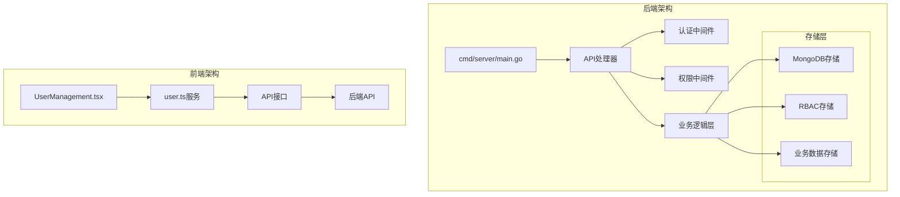
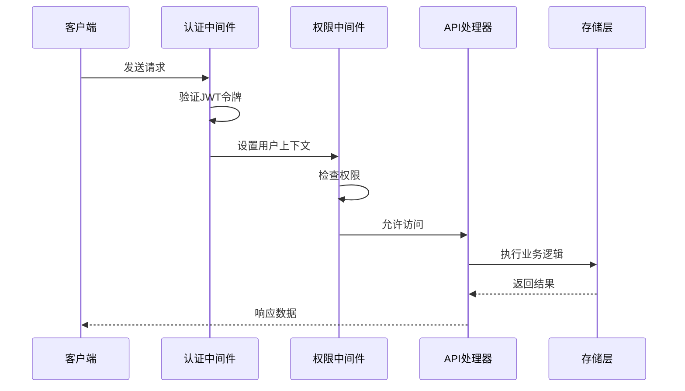
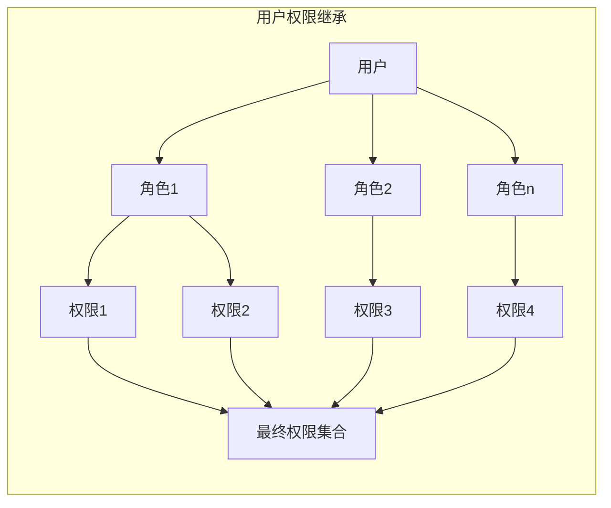
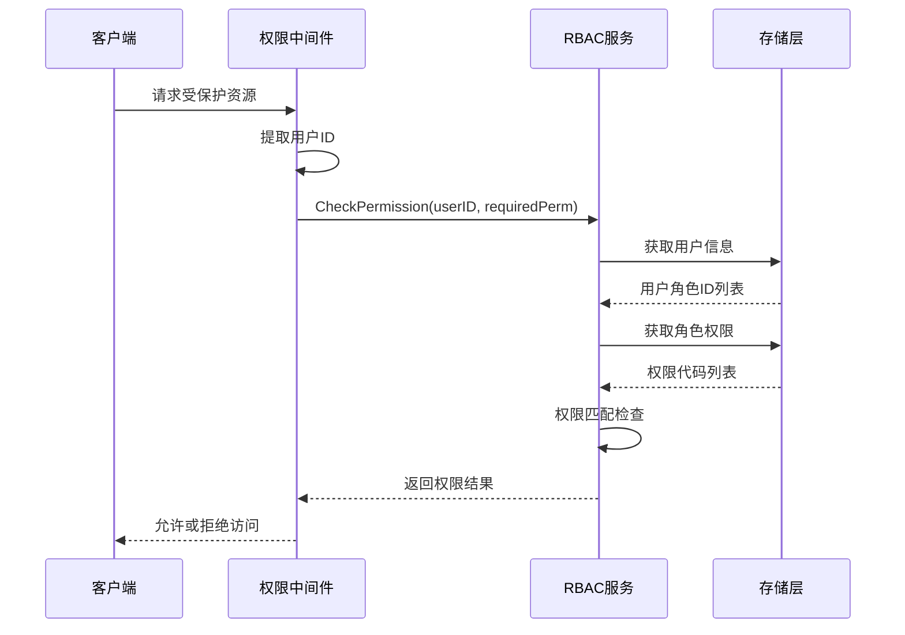
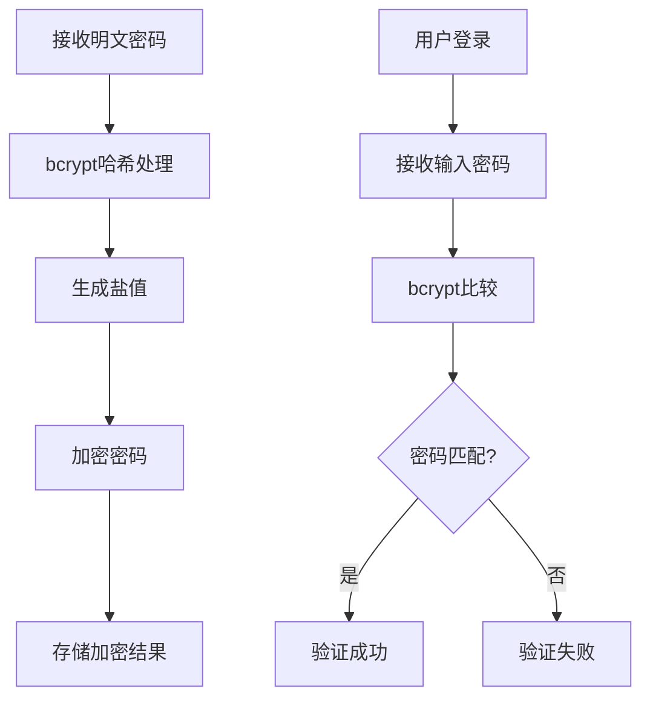
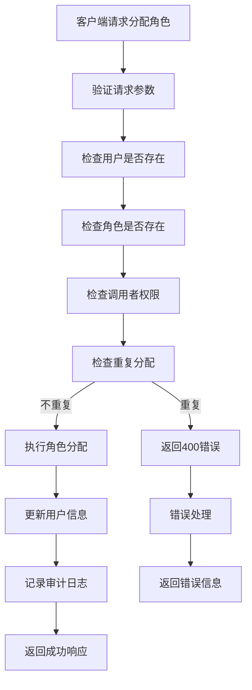
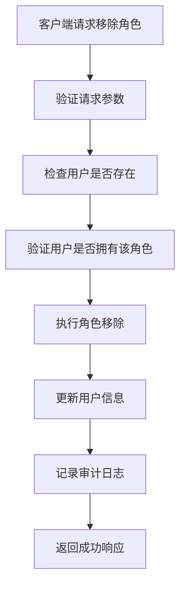

# 用户管理接口

<cite>
**本文档引用的文件**
- [main.go](file://cmd/server/main.go)
- [handlers.go](file://internal/api/handlers.go)
- [models.go](file://internal/models/models.go)
- [rbac.go](file://pkg/rbac/rbac.go)
- [rbac_storage.go](file://internal/storage/rbac_storage.go)
- [user.ts](file://frontend/src/services/user.ts)
- [UserManagement.tsx](file://frontend/src/pages/Admin/UserManagement.tsx)
- [index.ts](file://frontend/src/types/index.ts)
- [rbac.md](file://docs/rbac.md)
</cite>

## 目录
1. [简介](#简介)
2. [项目结构](#项目结构)
3. [核心组件](#核心组件)
4. [架构概览](#架构概览)
5. [详细接口规范](#详细接口规范)
6. [分页查询机制](#分页查询机制)
7. [权限验证机制](#权限验证机制)
8. [密码加密处理](#密码加密处理)
9. [角色分配逻辑](#角色分配逻辑)
10. [CRUD操作示例](#crud操作示例)
11. [错误处理](#错误处理)
12. [故障排除指南](#故障排除指南)
13. [结论](#结论)

## 简介

用户管理接口是数据中心系统的核心功能模块，提供完整的用户生命周期管理能力。该模块基于RBAC（基于角色的访问控制）权限模型构建，支持用户的基本CRUD操作、角色分配管理以及细粒度的权限控制。

系统采用Go语言开发，使用Gin框架作为Web服务器，MongoDB作为数据存储，实现了RESTful API设计规范。前端采用React + Ant Design技术栈，提供直观的用户管理界面。

## 项目结构



**图表来源**
- [main.go:45-181](file://cmd/server/main.go#L45-L181)
- [handlers.go:23-43](file://internal/api/handlers.go#L23-L43)

**章节来源**
- [main.go:1-167](file://cmd/server/main.go#L1-L167)
- [handlers.go:45-181](file://internal/api/handlers.go#L45-L181)

## 核心组件

### API处理器
API处理器负责路由注册和请求处理，实现了用户管理的所有核心功能。处理器包含认证中间件和权限中间件，确保每个请求都经过身份验证和授权检查。

### 数据模型
系统定义了完整的数据模型，包括User、Role、Permission等核心实体，支持复杂的多对多关系管理。

### 存储层
采用MongoDB作为主要数据存储，实现了RBAC相关的用户、角色、权限数据的持久化存储。

**章节来源**
- [handlers.go:23-43](file://internal/api/handlers.go#L23-L43)
- [models.go:247-271](file://internal/models/models.go#L247-L271)
- [rbac_storage.go:16-50](file://internal/storage/rbac_storage.go#L16-L50)

## 架构概览



**图表来源**
- [handlers.go:260-314](file://internal/api/handlers.go#L260-L314)
- [rbac.go:63-99](file://pkg/rbac/rbac.go#L63-L99)

## 详细接口规范

### 用户管理接口

#### 获取用户列表
- **HTTP方法**: GET
- **URL路径**: `/api/users`
- **权限要求**: `user:read`
- **请求参数**:
  - `skip`: 跳过记录数（默认0）
  - `limit`: 每页记录数（默认10）
  - `page`: 页码（可选，优先级高于skip/limit）
  - `pageSize`: 每页大小（可选）
  - `keyword`: 搜索关键词（可选）

- **响应格式**:
```json
{
  "data": [
    {
      "_id": "ObjectId",
      "username": "string",
      "email": "string",
      "role_ids": ["string"],
      "created_at": "datetime",
      "updated_at": "datetime"
    }
  ],
  "total": 0,
  "page": 0,
  "pageSize": 0
}
```

#### 根据ID获取用户
- **HTTP方法**: GET
- **URL路径**: `/api/users/:id`
- **权限要求**: `user:read`
- **路径参数**:
  - `id`: 用户ID（必填）

- **响应格式**: 用户对象（密码字段为空）

#### 创建用户
- **HTTP方法**: POST
- **URL路径**: `/api/users`
- **权限要求**: `user:write`
- **请求体**:
```json
{
  "username": "string",
  "password": "string",
  "email": "string",
  "role_ids": ["string"]
}
```

- **响应格式**: 创建的用户对象（密码字段为空）

#### 更新用户
- **HTTP方法**: PUT
- **URL路径**: `/api/users/:id`
- **权限要求**: `user:write`
- **路径参数**:
  - `id`: 用户ID（必填）

- **请求体**（可选字段）:
```json
{
  "email": "string",
  "password": "string",
  "role_ids": ["string"]
}
```

- **响应格式**: 更新后的用户对象（密码字段为空）

#### 删除用户
- **HTTP方法**: DELETE
- **URL路径**: `/api/users/:id`
- **权限要求**: `user:write`
- **路径参数**:
  - `id`: 用户ID（必填）

- **响应格式**:
```json
{
  "message": "User deleted successfully"
}
```

### 角色管理接口

#### 分配角色给用户
- **HTTP方法**: POST
- **URL路径**: `/api/users/:id/roles`
- **权限要求**: `user:write`
- **路径参数**:
  - `id`: 用户ID（必填）

- **请求体**:
```json
{
  "role_id": "string"
}
```

- **响应格式**: 用户对象（包含新角色）

#### 从用户移除角色
- **HTTP方法**: DELETE
- **URL路径**: `/api/users/:id/roles/:roleId`
- **权限要求**: `user:write`
- **路径参数**:
  - `id`: 用户ID（必填）
  - `roleId`: 角色ID（必填）

- **响应格式**: 用户对象（移除角色后）

#### 获取用户的角色列表
- **HTTP方法**: GET
- **URL路径**: `/api/users/:id/roles`
- **权限要求**: `user:read`
- **路径参数**:
  - `id`: 用户ID（必填）

- **响应格式**: 角色对象数组

**章节来源**
- [handlers.go:52-63](file://internal/api/handlers.go#L52-L63)
- [handlers.go:316-358](file://internal/api/handlers.go#L316-L358)
- [handlers.go:360-369](file://internal/api/handlers.go#L360-L369)
- [handlers.go:371-404](file://internal/api/handlers.go#L371-L404)
- [handlers.go:406-448](file://internal/api/handlers.go#L406-L448)
- [handlers.go:450-457](file://internal/api/handlers.go#L450-L457)
- [handlers.go:459-490](file://internal/api/handlers.go#L459-L490)
- [handlers.go:492-516](file://internal/api/handlers.go#L492-L516)
- [handlers.go:518-536](file://internal/api/handlers.go#L518-L536)

## 分页查询机制

系统支持两种分页参数格式，具有灵活的兼容性：

### 参数格式对比

| 参数类型 | 参数名称 | 默认值 | 转换关系 |
|---------|---------|--------|----------|
| 传统模式 | `skip` | 0 | `skip = (page-1) × pageSize` |
| 传统模式 | `limit` | 10 | `limit = pageSize` |
| 现代模式 | `page` | 1 | `page = floor(skip/limit) + 1` |
| 现代模式 | `pageSize` | 10 | `pageSize = limit` |

### 分页逻辑流程

```mermaid
flowchart TD
A[接收查询参数] --> B{检查page参数}
B --> |存在| C[解析page和pageSize]
B --> |不存在| D[使用skip和limit]
C --> E[计算skip = (page-1) × pageSize]
C --> F[设置limit = pageSize]
D --> G[使用默认skip和limit]
E --> H[生成分页数据]
F --> H
G --> H
H --> I[查询数据库]
I --> J[返回分页结果]
```

**图表来源**
- [handlers.go:317-331](file://internal/api/handlers.go#L317-L331)

### 响应数据结构

```json
{
  "data": [],           // 用户数据数组
  "total": 0,          // 总记录数
  "page": 0,           // 当前页码
  "pageSize": 0        // 每页大小
}
```

**章节来源**
- [handlers.go:316-358](file://internal/api/handlers.go#L316-L358)

## 权限验证机制

### 权限模型

系统采用RBAC权限模型，通过用户-角色-权限的三层关系实现细粒度的访问控制：



**图表来源**
- [rbac.go:63-99](file://pkg/rbac/rbac.go#L63-L99)

### 权限检查流程



**图表来源**
- [handlers.go:295-314](file://internal/api/handlers.go#L295-L314)
- [rbac.go:63-99](file://pkg/rbac/rbac.go#L63-L99)

### API权限映射

| API路径 | HTTP方法 | 权限代码 |
|---------|----------|----------|
| `/api/users` | GET | `user:read` |
| `/api/users` | POST | `user:write` |
| `/api/users/:id` | GET | `user:read` |
| `/api/users/:id` | PUT | `user:write` |
| `/api/users/:id` | DELETE | `user:write` |
| `/api/users/:id/roles` | POST | `user:write` |
| `/api/users/:id/roles/:roleId` | DELETE | `user:write` |
| `/api/users/:id/roles` | GET | `user:read` |

**章节来源**
- [rbac.go:173-249](file://pkg/rbac/rbac.go#L173-L249)
- [handlers.go:295-314](file://internal/api/handlers.go#L295-L314)

## 密码加密处理

### 加密算法
系统使用bcrypt算法对用户密码进行安全加密，确保密码存储的安全性。

### 加密流程



**图表来源**
- [handlers.go:384](file://internal/api/handlers.go#L384)
- [handlers.go:430](file://internal/api/handlers.go#L430)

### 密码处理策略

1. **创建用户时**: 对密码进行bcrypt哈希处理
2. **更新用户时**: 仅在提供新密码时才重新加密
3. **响应安全**: 所有用户响应中均不包含密码字段

**章节来源**
- [handlers.go:384-388](file://internal/api/handlers.go#L384-L388)
- [handlers.go:429-435](file://internal/api/handlers.go#L429-L435)
- [handlers.go:346](file://internal/api/handlers.go#L346)

## 角色分配逻辑

### 分配角色流程



**图表来源**
- [handlers.go:459-490](file://internal/api/handlers.go#L459-L490)

### 移除角色流程



**图表来源**
- [handlers.go:492-516](file://internal/api/handlers.go#L492-L516)

### 重复分配处理
系统通过遍历用户现有的角色ID列表来检测重复分配，如果发现重复则返回400错误。

**章节来源**
- [handlers.go:476-481](file://internal/api/handlers.go#L476-L481)
- [handlers.go:502-507](file://internal/api/handlers.go#L502-L507)

## CRUD操作示例

### 获取用户列表示例

**前端调用**:
```typescript
// 获取第1页，每页20条记录
const users = await userService.getUsers({
  skip: 0,
  limit: 20
});
```

**后端响应**:
```json
{
  "data": [
    {
      "_id": "507f1f77bcf86cd799439011",
      "username": "admin",
      "email": "admin@example.com",
      "role_ids": ["507f1f77bcf86cd799439012"],
      "created_at": "2023-01-01T00:00:00Z",
      "updated_at": "2023-01-01T00:00:00Z"
    }
  ],
  "total": 1,
  "page": 1,
  "pageSize": 20
}
```

### 创建用户示例

**前端调用**:
```typescript
const newUser = await userService.createUser({
  username: "newuser",
  password: "securepassword",
  email: "newuser@example.com",
  role_ids: ["507f1f77bcf86cd799439012"]
});
```

**后端响应**:
```json
{
  "_id": "507f1f77bcf86cd799439013",
  "username": "newuser",
  "email": "newuser@example.com"
}
```

### 更新用户示例

**前端调用**:
```typescript
const updatedUser = await userService.updateUser("507f1f77bcf86cd799439013", {
  email: "updated@example.com",
  password: "newpassword" // 可选，仅在需要更新密码时提供
});
```

**后端响应**:
```json
{
  "_id": "507f1f77bcf86cd799439013",
  "username": "newuser",
  "email": "updated@example.com",
  "role_ids": ["507f1f77bcf86cd799439012"]
}
```

### 分配角色示例

**前端调用**:
```typescript
await userService.assignRoleToUser("507f1f77bcf86cd799439013", "507f1f77bcf86cd799439014");
```

**后端响应**:
```json
{
  "_id": "507f1f77bcf86cd799439013",
  "username": "newuser",
  "email": "updated@example.com",
  "role_ids": [
    "507f1f77bcf86cd799439012",
    "507f1f77bcf86cd799439014"
  ]
}
```

**章节来源**
- [user.ts:25-46](file://frontend/src/services/user.ts#L25-L46)
- [user.ts:59-68](file://frontend/src/services/user.ts#L59-L68)
- [user.ts:70-79](file://frontend/src/services/user.ts#L70-L79)
- [user.ts:86-91](file://frontend/src/services/user.ts#L86-L91)

## 错误处理

### 错误类型和状态码

| 错误类型 | HTTP状态码 | 描述 | 处理建议 |
|---------|------------|------|----------|
| 角色不存在 | 404 | 指定的角色ID不存在 | 验证角色ID有效性 |
| 权限不存在 | 404 | 指定的权限ID不存在 | 检查权限配置 |
| 用户不存在 | 404 | 指定的用户ID不存在 | 验证用户ID |
| 角色已分配 | 400 | 用户已拥有该角色 | 检查现有角色分配 |
| 权限已分配 | 400 | 角色已拥有该权限 | 验证权限分配状态 |
| 角色未分配 | 400 | 用户未拥有该角色 | 检查角色分配状态 |
| 权限未分配 | 400 | 角色未拥有该权限 | 验证权限分配状态 |
| 无权限 | 403 | 无权限执行该操作 | 检查用户权限 |

### 错误响应格式
```json
{
  "error": "错误描述信息"
}
```

**章节来源**
- [rbac.md:467-482](file://docs/rbac.md#L467-L482)

## 故障排除指南

### 常见问题和解决方案

#### 1. 用户密码无法登录
**症状**: 用户无法使用创建时设置的密码登录
**原因**: 系统使用bcrypt加密存储密码
**解决方案**: 
- 检查密码是否正确（区分大小写）
- 确认用户状态正常
- 验证用户是否被分配了适当的权限

#### 2. 获取用户列表失败
**症状**: 返回403权限不足错误
**原因**: 调用者缺少`user:read`权限
**解决方案**:
- 确保调用者拥有`user:read`权限
- 检查用户角色配置
- 验证JWT令牌有效性

#### 3. 创建用户失败
**症状**: 返回400参数验证错误
**原因**: 请求参数缺失或格式不正确
**解决方案**:
- 确保提供必需的username、password、email字段
- 验证用户名和邮箱的唯一性
- 检查密码复杂度要求

#### 4. 角色分配重复
**症状**: 返回400"角色已分配"错误
**原因**: 用户已经拥有指定角色
**解决方案**:
- 检查用户现有角色列表
- 避免重复分配相同角色
- 如需更新，先移除再重新分配

#### 5. 分页数据异常
**症状**: 分页结果不正确或数据重复
**原因**: 分页参数使用不当
**解决方案**:
- 使用统一的分页参数格式
- 避免同时使用skip/limit和page/pageSize
- 确保页码和页面大小的合理性

**章节来源**
- [handlers.go:317-331](file://internal/api/handlers.go#L317-L331)
- [handlers.go:476-481](file://internal/api/handlers.go#L476-L481)

## 结论

用户管理接口提供了完整的企业级用户管理解决方案，具有以下特点：

### 技术优势
- **安全性**: 采用bcrypt加密和JWT令牌认证
- **灵活性**: 支持多种分页参数格式和灵活的权限模型
- **可扩展性**: 基于RBAC的权限系统支持复杂的权限管理需求
- **易用性**: 提供直观的RESTful API和完整的前端管理界面

### 功能完整性
- 支持用户全生命周期管理
- 提供细粒度的权限控制
- 实现角色驱动的权限继承
- 包含完整的审计日志功能

### 最佳实践建议
- 在生产环境中使用HTTPS协议
- 定期备份用户和权限数据
- 实施最小权限原则
- 建立完善的监控和日志系统
- 定期审查和优化权限配置

该接口设计充分考虑了企业级应用的需求，为用户管理提供了安全、可靠、易用的解决方案。