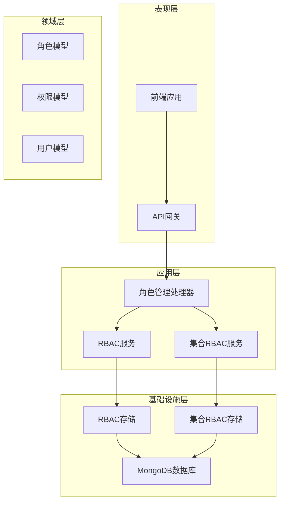
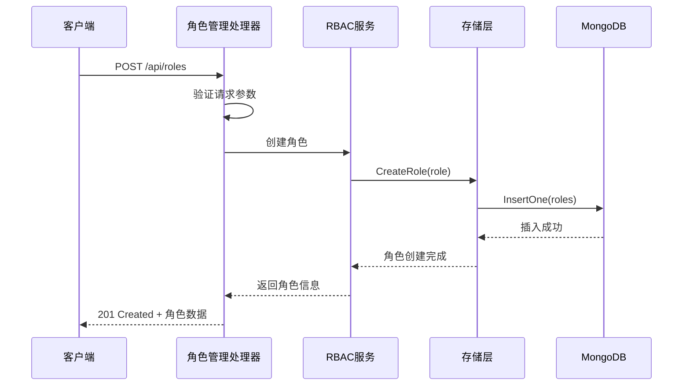
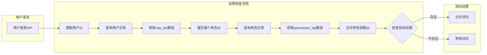
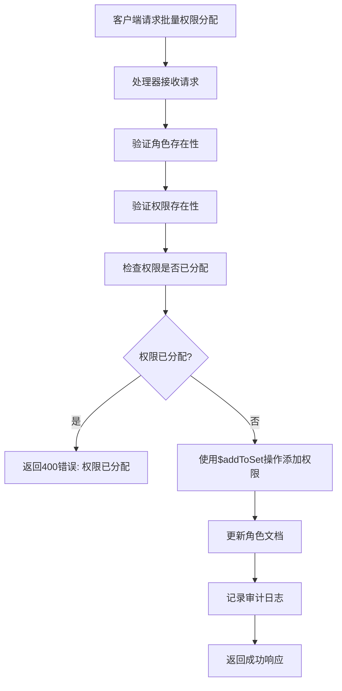
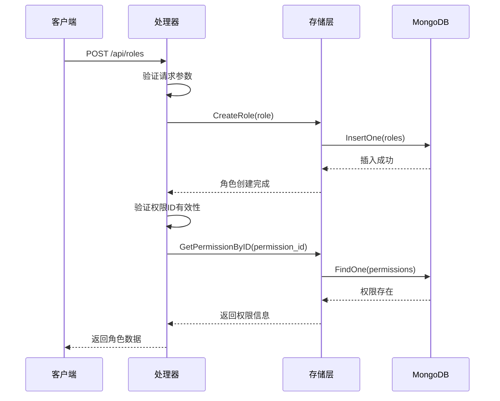
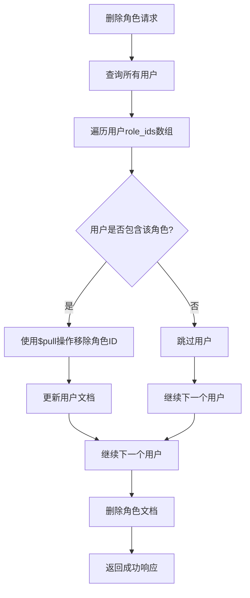
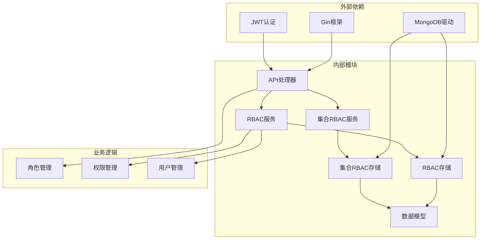

# 角色管理接口

<cite>
**本文档引用的文件**
- [models.go](file://internal/models/models.go)
- [rbac.go](file://pkg/rbac/rbac.go)
- [collection_rbac.go](file://pkg/rbac/collection_rbac.go)
- [rbac_storage.go](file://internal/storage/rbac_storage.go)
- [collection_rbac_storage.go](file://internal/storage/collection_rbac_storage.go)
- [handlers.go](file://internal/api/handlers.go)
- [rbac.md](file://docs/rbac.md)
- [api.md](file://docs/api.md)
- [api-spec.md](file://docs/api-spec.md)
- [rbac.ts](file://frontend/src/services/rbac.ts)
</cite>

## 目录
1. [简介](#简介)
2. [项目结构](#项目结构)
3. [核心组件](#核心组件)
4. [架构概览](#架构概览)
5. [详细组件分析](#详细组件分析)
6. [依赖关系分析](#依赖关系分析)
7. [性能考虑](#性能考虑)
8. [故障排除指南](#故障排除指南)
9. [结论](#结论)

## 简介

角色管理接口是数据中心系统RBAC（基于角色的访问控制）权限体系的核心组成部分。本文档详细说明了角色管理相关的完整API接口，包括角色的创建、查询、更新、删除以及权限分配等核心功能。

系统采用嵌入式多对多关系设计，通过在用户和角色文档中嵌入关联ID数组来实现灵活的权限管理。角色权限继承机制确保用户通过角色间接获得权限，用户拥有的全部权限是所有角色权限的并集。

## 项目结构

数据中心系统采用分层架构设计，角色管理功能位于以下层次：



**图表来源**
- [handlers.go:45-181](file://internal/api/handlers.go#L45-L181)
- [rbac.go:55-61](file://pkg/rbac/rbac.go#L55-L61)
- [rbac_storage.go:16-50](file://internal/storage/rbac_storage.go#L16-L50)

**章节来源**
- [handlers.go:45-181](file://internal/api/handlers.go#L45-L181)
- [rbac.go:55-61](file://pkg/rbac/rbac.go#L55-L61)
- [rbac_storage.go:16-50](file://internal/storage/rbac_storage.go#L16-L50)

## 核心组件

### 角色实体定义

角色实体是RBAC系统的核心数据模型，包含以下关键字段：

| 字段名 | 数据类型 | 描述 | 约束 |
|--------|----------|------|------|
| _id | ObjectId | 角色唯一标识符 | 主键 |
| name | String | 角色显示名称 | 必填 |
| code | String | 角色代码标识 | 唯一，必填 |
| description | String | 角色描述信息 | 可选 |
| permission_ids | Array<String> | 权限ID列表 | 嵌入数组，通过$addToSet/$pull操作管理 |
| created_by | String | 创建者标识 | 必填 |
| created_at | DateTime | 创建时间 | 自动生成 |
| updated_by | String | 更新者标识 | 必填 |
| updated_at | DateTime | 更新时间 | 自动生成 |

### 权限实体定义

权限实体定义了系统中的具体权限操作：

| 字段名 | 数据类型 | 描述 | 约束 |
|--------|----------|------|------|
| _id | ObjectId | 权限唯一标识符 | 主键 |
| name | String | 权限显示名称 | 必填 |
| code | String | 权限代码标识 | 唯一，必填 |
| description | String | 权限描述信息 | 可选 |
| created_by | String | 创建者标识 | 必填 |
| created_at | DateTime | 创建时间 | 自动生成 |
| updated_by | String | 更新者标识 | 必填 |
| updated_at | DateTime | 更新时间 | 自动生成 |

### 用户实体定义

用户实体与角色建立多对多关系：

| 字段名 | 数据类型 | 描述 | 约束 |
|--------|----------|------|------|
| _id | ObjectId | 用户唯一标识符 | 主键 |
| username | String | 用户名 | 唯一，必填 |
| email | String | 邮箱地址 | 唯一，必填 |
| role_ids | Array<String> | 角色ID列表 | 嵌入数组，通过$addToSet/$pull操作管理 |
| created_by | String | 创建者标识 | 必填 |
| created_at | DateTime | 创建时间 | 自动生成 |
| updated_by | String | 更新者标识 | 必填 |
| updated_at | DateTime | 更新时间 | 自动生成 |

**章节来源**
- [models.go:247-271](file://internal/models/models.go#L247-L271)

## 架构概览

角色管理系统的整体架构采用分层设计，确保职责分离和代码可维护性：



**图表来源**
- [handlers.go:677-703](file://internal/api/handlers.go#L677-L703)
- [rbac_storage.go:307-316](file://internal/storage/rbac_storage.go#L307-L316)

### 权限继承机制

系统实现了完整的权限继承机制，用户通过角色间接获得权限：



**图表来源**
- [rbac.go:63-99](file://pkg/rbac/rbac.go#L63-L99)
- [rbac.go:116-145](file://pkg/rbac/rbac.go#L116-L145)

**章节来源**
- [rbac.go:63-99](file://pkg/rbac/rbac.go#L63-L99)
- [rbac.go:116-145](file://pkg/rbac/rbac.go#L116-L145)

## 详细组件分析

### 角色管理API接口

#### 获取角色列表

**接口定义**
- 方法: GET
- 路径: `/api/roles`
- 权限: role:read

**查询参数**
| 参数名 | 类型 | 默认值 | 描述 |
|--------|------|--------|------|
| page | int | 1 | 当前页码 |
| pageSize | int | 10 | 每页记录数 |

**响应结构**
```json
{
  "data": [
    {
      "_id": "role_id",
      "name": "管理员",
      "code": "admin",
      "description": "系统管理员",
      "permission_ids": ["perm_id_1", "perm_id_2"]
    }
  ],
  "total": 10,
  "page": 1,
  "pageSize": 10
}
```

#### 获取单个角色

**接口定义**
- 方法: GET
- 路径: `/api/roles/:id`
- 权限: role:read

**响应结构**
```json
{
  "_id": "role_id",
  "name": "管理员",
  "code": "admin",
  "description": "系统管理员",
  "permission_ids": ["perm_id_1", "perm_id_2"]
}
```

#### 创建角色

**接口定义**
- 方法: POST
- 路径: `/api/roles`
- 权限: role:write

**请求体**
```json
{
  "name": "数据管理员",
  "code": "data_admin",
  "description": "管理系统数据",
  "permission_ids": ["permission_id_1"]
}
```

**响应结构**
```json
{
  "_id": "role_id",
  "name": "数据管理员",
  "code": "data_admin",
  "description": "管理系统数据",
  "permission_ids": ["permission_id_1"],
  "created_at": "2024-01-15T10:30:00Z"
}
```

#### 更新角色

**接口定义**
- 方法: PUT
- 路径: `/api/roles/:id`
- 权限: role:write

**请求体**
```json
{
  "name": "高级管理员",
  "description": "更新后的描述",
  "permission_ids": ["permission_id_1", "permission_id_2"]
}
```

**响应结构**
```json
{
  "_id": "role_id",
  "name": "高级管理员",
  "code": "admin",
  "description": "更新后的描述",
  "permission_ids": ["permission_id_1", "permission_id_2"],
  "updated_at": "2024-01-15T11:00:00Z"
}
```

#### 删除角色

**接口定义**
- 方法: DELETE
- 路径: `/api/roles/:id`
- 权限: role:write

**响应结构**
```json
{
  "message": "Role deleted successfully"
}
```

#### 为角色分配权限

**接口定义**
- 方法: POST
- 路径: `/api/roles/:id/permissions`
- 权限: role:write

**请求体**
```json
{
  "permission_id": "permission_id"
}
```

**响应结构**
```json
{
  "_id": "role_id",
  "name": "管理员",
  "permission_ids": ["perm_id_1", "perm_id_2"],
  "updated_at": "2024-01-15T11:00:00Z"
}
```

#### 从角色移除权限

**接口定义**
- 方法: DELETE
- 路径: `/api/roles/:id/permissions/:permissionId`
- 权限: role:write

**响应结构**
```json
{
  "_id": "role_id",
  "name": "管理员",
  "permission_ids": ["perm_id_1"],
  "updated_at": "2024-01-15T11:00:00Z"
}
```

#### 获取角色权限

**接口定义**
- 方法: GET
- 路径: `/api/roles/:id/permissions`
- 权限: role:read

**响应结构**
```json
[
  {
    "_id": "permission_id",
    "name": "用户管理",
    "code": "user:write",
    "description": "管理系统用户账户"
  }
]
```

**章节来源**
- [handlers.go:642-750](file://internal/api/handlers.go#L642-L750)
- [handlers.go:752-829](file://internal/api/handlers.go#L752-L829)

### 权限分配的批量操作和去重逻辑

系统实现了智能的权限分配机制，确保操作的原子性和数据完整性：



**图表来源**
- [handlers.go:752-783](file://internal/api/handlers.go#L752-L783)
- [rbac_storage.go:428-443](file://internal/storage/rbac_storage.go#L428-L443)

### 角色创建时的权限ID验证

系统在角色创建过程中实施严格的权限ID验证机制：



**图表来源**
- [handlers.go:677-703](file://internal/api/handlers.go#L677-L703)
- [rbac_storage.go:307-316](file://internal/storage/rbac_storage.go#L307-L316)

### 角色更新时的权限变更跟踪

系统提供完整的权限变更跟踪机制，确保所有操作都有据可查：

| 变更类型 | 操作前后对比 | 影响范围 |
|----------|-------------|----------|
| 添加权限 | 从[perm1, perm2]变为[perm1, perm2, perm3] | 角色权限集合扩大 |
| 移除权限 | 从[perm1, perm2, perm3]变为[perm1, perm2] | 角色权限集合缩小 |
| 替换权限 | 从[perm1]变为[perm2] | 角色权限完全替换 |
| 无变更 | 从[perm1, perm2]变为[perm1, perm2] | 角色权限保持不变 |

**章节来源**
- [handlers.go:705-741](file://internal/api/handlers.go#L705-L741)
- [rbac_storage.go:428-457](file://internal/storage/rbac_storage.go#L428-L457)

### 角色删除时的用户影响处理

系统在删除角色时执行级联清理，确保数据一致性和完整性：



**图表来源**
- [handlers.go:743-750](file://internal/api/handlers.go#L743-L750)
- [rbac_storage.go:369-377](file://internal/storage/rbac_storage.go#L369-L377)

### 角色查询的分页和过滤功能

系统支持灵活的分页和过滤功能，满足大数据量场景的需求：

**分页参数**
- `page`: 当前页码，默认1
- `pageSize`: 每页记录数，默认10

**过滤选项**
- 支持按角色名称模糊匹配
- 支持按角色代码精确匹配
- 支持按创建时间范围过滤

**章节来源**
- [handlers.go:642-665](file://internal/api/handlers.go#L642-L665)
- [rbac_storage.go:343-361](file://internal/storage/rbac_storage.go#L343-L361)

## 依赖关系分析

角色管理系统的依赖关系体现了清晰的分层架构：



**图表来源**
- [handlers.go:23-43](file://internal/api/handlers.go#L23-L43)
- [rbac.go:55-61](file://pkg/rbac/rbac.go#L55-L61)
- [rbac_storage.go:52-79](file://internal/storage/rbac_storage.go#L52-L79)

### 组件耦合度分析

系统采用松耦合设计，各组件间通过接口进行交互：

| 组件 | 耦合类型 | 说明 |
|------|----------|------|
| Handler | 低耦合 | 通过接口依赖RBACService和Storage |
| RBACService | 中等耦合 | 依赖RBACStorage接口 |
| RBACStorage | 低耦合 | 通过MongoDB驱动实现 |
| Models | 低耦合 | 纯数据结构，无业务逻辑 |

**章节来源**
- [handlers.go:23-43](file://internal/api/handlers.go#L23-L43)
- [rbac.go:55-61](file://pkg/rbac/rbac.go#L55-L61)
- [rbac_storage.go:52-79](file://internal/storage/rbac_storage.go#L52-L79)

## 性能考虑

### 数据库优化策略

系统采用嵌入式多对多关系设计，通过MongoDB数组操作符实现高效的关系管理：

**索引策略**
- `users.role_ids`: 用于快速查询某角色的所有用户
- `users.username`: 唯一索引用于登录查询
- `roles.permission_ids`: 用于快速查询某权限的所有角色
- `roles.code`: 唯一索引
- `permissions.code`: 唯一索引

**查询优化**
- 使用投影减少网络传输
- 实施分页避免大结果集
- 缓存常用查询结果

### 缓存策略

系统建议实施多层缓存策略：

1. **Redis缓存层**: 缓存热门角色和权限数据
2. **进程内缓存**: 缓存用户权限集合
3. **数据库连接池**: 优化数据库连接复用

### 并发控制

系统通过MongoDB的原子操作确保并发安全：

- `$addToSet`: 确保权限分配的原子性和去重
- `$pull`: 确保权限移除的原子性
- 原子更新操作保证数据一致性

## 故障排除指南

### 常见错误类型

| 错误类型 | HTTP状态码 | 描述 | 处理建议 |
|----------|------------|------|----------|
| 角色不存在 | 404 | 指定的角色ID不存在 | 验证角色ID有效性 |
| 权限不存在 | 404 | 指定的权限ID不存在 | 检查权限是否已创建 |
| 用户不存在 | 404 | 指定的用户ID不存在 | 验证用户ID有效性 |
| 角色已分配 | 400 | 用户已拥有该角色 | 检查用户角色分配状态 |
| 权限已分配 | 400 | 角色已拥有该权限 | 检查角色权限分配状态 |
| 无权限 | 403 | 无权限执行该操作 | 检查用户权限配置 |

### 调试技巧

1. **启用详细日志**: 在开发环境中启用详细的API调用日志
2. **使用Postman测试**: 通过Postman验证API接口的正确性
3. **监控数据库查询**: 使用MongoDB的explain()分析查询性能
4. **单元测试**: 为关键业务逻辑编写单元测试

**章节来源**
- [rbac.md:467-482](file://docs/rbac.md#L467-L482)

## 结论

角色管理接口提供了完整、灵活且高性能的权限管理体系。系统采用嵌入式多对多关系设计，通过权限继承机制实现了简洁而强大的权限控制。完善的API接口覆盖了角色管理的各个方面，包括基础CRUD操作、权限分配、批量操作和审计跟踪。

系统的设计充分考虑了性能优化和数据一致性，在保证功能完整性的同时提供了良好的扩展性。通过清晰的分层架构和严格的错误处理机制，确保了系统的稳定性和可靠性。

未来可以在以下方面进一步优化：
- 实施更细粒度的权限控制
- 增加权限继承的层级支持
- 优化大规模数据场景下的查询性能
- 增强权限变更的实时通知机制