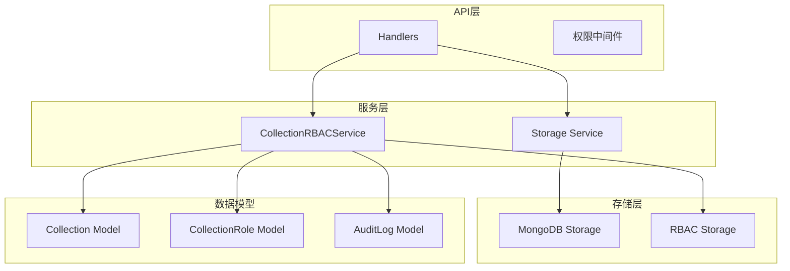
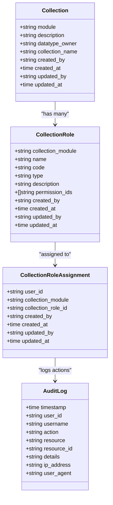
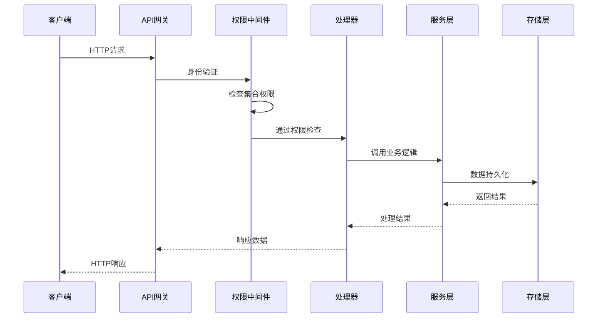
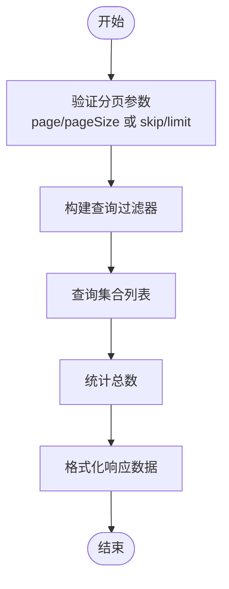
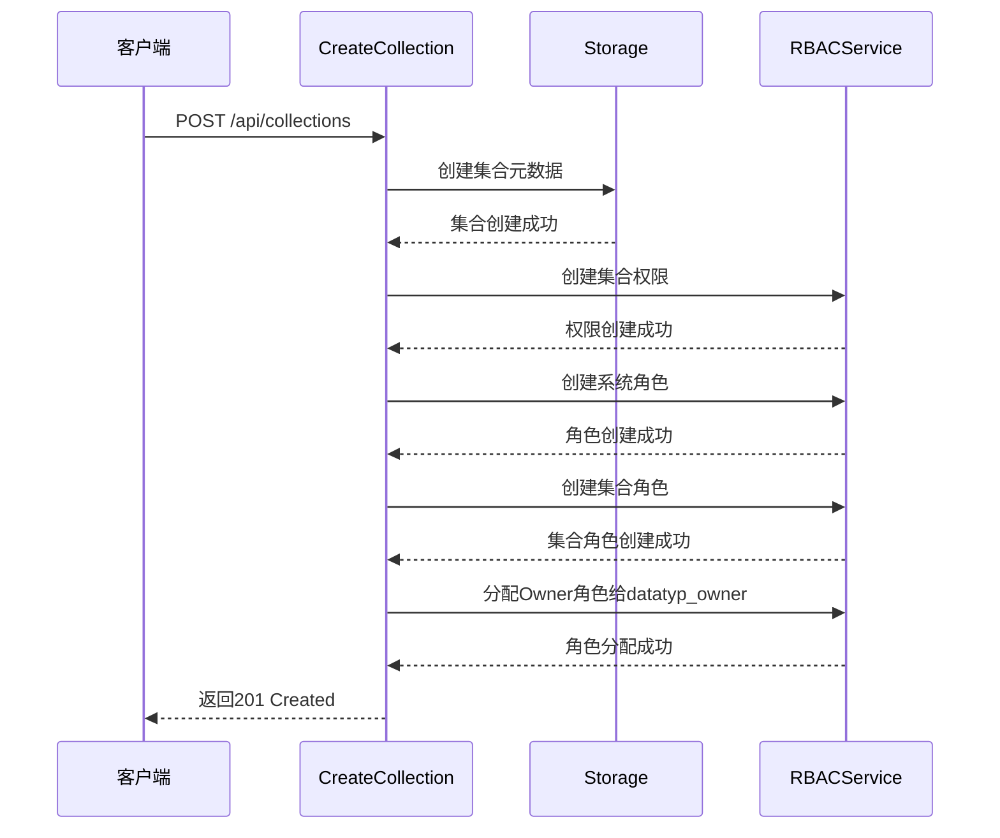
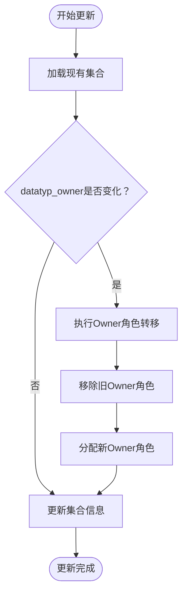
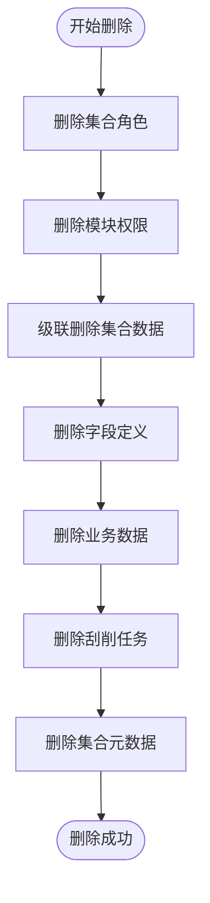
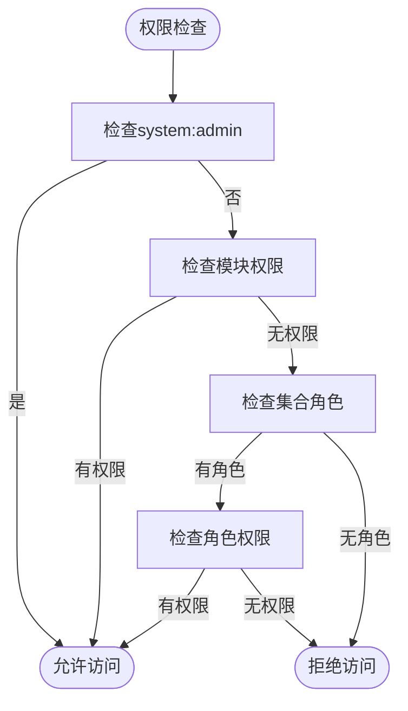
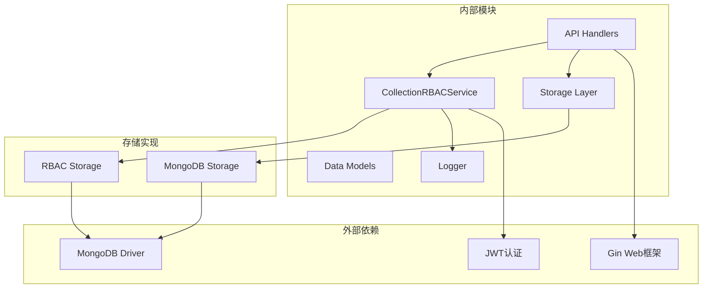

# 集合管理接口

<cite>
**本文档引用的文件**
- [handlers.go](file://internal/api/handlers.go)
- [mongodb.go](file://internal/storage/mongodb.go)
- [mongodb_storage.go](file://internal/storage/mongodb_storage.go)
- [collection_rbac.go](file://pkg/rbac/collection_rbac.go)
- [collection_rbac_storage.go](file://internal/storage/collection_rbac_storage.go)
- [collection_permission_middleware.go](file://internal/api/collection_permission_middleware.go)
- [models.go](file://internal/models/models.go)
- [tech.md](file://docs/modules/collection/tech.md)
</cite>

## 目录
1. [简介](#简介)
2. [项目结构](#项目结构)
3. [核心组件](#核心组件)
4. [架构概览](#架构概览)
5. [详细组件分析](#详细组件分析)
6. [依赖关系分析](#依赖关系分析)
7. [性能考虑](#性能考虑)
8. [故障排除指南](#故障排除指南)
9. [结论](#结论)

## 简介

集合管理接口是数据中心系统中的核心功能模块，负责管理MongoDB数据库中的业务数据集合。该模块提供了完整的集合生命周期管理功能，包括集合的创建、查询、更新、删除，以及集合级的索引管理和权限控制。

系统采用集合级RBAC（基于角色的访问控制）机制，为每个业务模块创建独立的权限体系，确保数据访问的安全性和可控性。每个集合都对应一个业务模块（如movie、music、book），包含该模块的数据存储、字段定义、索引管理和独立的权限控制。

## 项目结构

集合管理模块采用分层架构设计，主要包含以下层次：

**图表来源**
- [handlers.go:45-181](file://internal/api/handlers.go#L45-L181)
- [mongodb_storage.go:16-51](file://internal/storage/mongodb_storage.go#L16-L51)
- [collection_rbac.go:27-37](file://pkg/rbac/collection_rbac.go#L27-L37)

**章节来源**
- [handlers.go:45-181](file://internal/api/handlers.go#L45-L181)
- [mongodb_storage.go:16-51](file://internal/storage/mongodb_storage.go#L16-L51)
- [collection_rbac.go:27-37](file://pkg/rbac/collection_rbac.go#L27-L37)

## 核心组件

### 集合数据模型

集合管理模块的核心数据模型包括Collection、CollectionRole和CollectionRoleAssignment三个主要实体：

**图表来源**
- [models.go:313-364](file://internal/models/models.go#L313-L364)

### 权限体系

系统实现了三层权限检查机制：

1. **系统级权限**：检查用户是否具有system:admin超级管理员权限
2. **模块级权限**：检查用户是否具有特定模块的权限（如movie:read）
3. **集合级角色**：检查用户在特定模块中的集合角色分配

**章节来源**
- [models.go:313-364](file://internal/models/models.go#L313-L364)
- [collection_rbac.go:39-90](file://pkg/rbac/collection_rbac.go#L39-L90)

## 架构概览

集合管理接口采用RESTful API设计，遵循统一的权限控制模式：

**图表来源**
- [handlers.go:16-48](file://internal/api/handlers.go#L16-L48)
- [collection_permission_middleware.go:16-48](file://internal/api/collection_permission_middleware.go#L16-L48)

## 详细组件分析

### API路由注册

集合管理接口在Gin框架中注册了完整的路由组，包含所有必要的CRUD操作和扩展功能：

| HTTP方法 | 路由路径 | 权限要求 | 功能描述 |
|---------|---------|---------|---------|
| GET | `/api/collections` | collection:read | 获取集合列表（支持分页） |
| GET | `/api/collections/:module` | collection:read | 获取指定集合详情 |
| POST | `/api/collections` | collection:write | 创建新集合 |
| PUT | `/api/collections/:module` | collection:write | 更新集合信息 |
| DELETE | `/api/collections/:module` | collection:write | 删除集合（级联删除） |
| POST | `/api/collections/:module/indexes` | collection:write | 创建集合索引 |
| GET | `/api/collections/:module/indexes` | collection:read | 获取集合索引列表 |
| DELETE | `/api/collections/:module/indexes/:name` | collection:write | 删除指定索引 |
| GET | `/api/collections/:module/roles` | collection:read | 获取集合角色列表 |
| GET | `/api/collections/:module/roles/assignments` | collection:read | 获取角色分配列表 |
| POST | `/api/collections/:module/roles/assign` | collection:write | 分配集合角色 |
| DELETE | `/api/collections/:module/roles/:roleId/assignments/:userId` | collection:write | 移除集合角色分配 |
| GET | `/api/collections/:module/audit-logs` | collection:read | 获取集合审计日志 |

**章节来源**
- [handlers.go:161-180](file://internal/api/handlers.go#L161-L180)
- [tech.md:172-201](file://docs/modules/collection/tech.md#L172-L201)

### 集合CRUD操作

#### 获取集合列表

**图表来源**
- [handlers.go:1391-1410](file://internal/api/handlers.go#L1391-L1410)

#### 创建集合

创建集合时会自动执行完整的初始化流程：

**图表来源**
- [handlers.go:1422-1478](file://internal/api/handlers.go#L1422-L1478)
- [tech.md:241-273](file://docs/modules/collection/tech.md#L241-L273)

**章节来源**
- [handlers.go:1422-1478](file://internal/api/handlers.go#L1422-L1478)
- [tech.md:241-273](file://docs/modules/collection/tech.md#L241-L273)

#### 更新集合

集合更新支持管理员转移功能，当datatyp_owner字段发生变化时，系统会自动进行角色转移：

**图表来源**
- [handlers.go:1480-1542](file://internal/api/handlers.go#L1480-L1542)

**章节来源**
- [handlers.go:1480-1542](file://internal/api/handlers.go#L1480-L1542)
- [tech.md:301-319](file://docs/modules/collection/tech.md#L301-L319)

#### 删除集合

删除集合时执行完整的级联删除流程：

**图表来源**
- [handlers.go:1544-1576](file://internal/api/handlers.go#L1544-L1576)
- [tech.md:277-297](file://docs/modules/collection/tech.md#L277-L297)

**章节来源**
- [handlers.go:1544-1576](file://internal/api/handlers.go#L1544-L1576)
- [tech.md:277-297](file://docs/modules/collection/tech.md#L277-L297)

### 索引管理

集合索引管理提供了完整的索引生命周期操作：

#### 创建索引

索引创建支持多种选项配置：
- 索引键定义（支持复合索引）
- 索引名称
- 唯一性约束
- 后台构建
- 其他MongoDB索引选项

#### 获取索引列表

系统提供完整的索引信息查询功能，包括索引名称、类型、键定义等详细信息。

#### 删除索引

支持按索引名称精确删除，确保索引维护的灵活性。

**章节来源**
- [handlers.go:1578-1654](file://internal/api/handlers.go#L1578-L1654)

### 集合RBAC权限管理

#### 角色管理

系统为每个集合自动创建三种标准角色：

| 角色类型 | 角色代码 | 权限范围 | 描述 |
|---------|---------|---------|------|
| Owner | `{module}Owner` | 所有权限 | 集合管理员，拥有完全控制权 |
| Operator | `{module}Operator` | 读写删除 | 数据操作员，可管理数据但不能修改字段定义 |
| Tourist | `{module}Tourist` | 仅读取 | 普通用户，只能读取数据 |

#### 权限检查流程

**图表来源**
- [collection_rbac.go:39-90](file://pkg/rbac/collection_rbac.go#L39-L90)

**章节来源**
- [collection_rbac.go:39-90](file://pkg/rbac/collection_rbac.go#L39-L90)
- [tech.md:97-136](file://docs/modules/collection/tech.md#L97-L136)

### 审计日志

系统提供完整的审计日志功能，记录所有重要的管理操作：

| 操作类型 | 记录内容 | 触发时机 |
|---------|---------|---------|
| assign_role | 分配集合角色 | 角色分配操作 |
| remove_role | 移除集合角色 | 角色移除操作 |
| create_collection | 创建集合 | 集合创建操作 |
| update_collection | 更新集合 | 集合更新操作 |
| delete_collection | 删除集合 | 集合删除操作 |

**章节来源**
- [handlers.go:1722-1757](file://internal/api/handlers.go#L1722-L1757)
- [collection_rbac_storage.go:209-243](file://internal/storage/collection_rbac_storage.go#L209-L243)

## 依赖关系分析

集合管理模块的依赖关系呈现清晰的分层结构：

**图表来源**
- [handlers.go:3-21](file://internal/api/handlers.go#L3-L21)
- [mongodb_storage.go:3-14](file://internal/storage/mongodb_storage.go#L3-L14)

**章节来源**
- [handlers.go:3-21](file://internal/api/handlers.go#L3-L21)
- [mongodb_storage.go:3-14](file://internal/storage/mongodb_storage.go#L3-L14)

## 性能考虑

### 索引优化策略

1. **选择性索引**：优先为高选择性的查询字段创建索引
2. **复合索引**：为常用联合查询创建复合索引
3. **唯一索引**：为需要去重的字段创建唯一索引
4. **后台构建**：大数据量索引创建使用后台构建避免阻塞

### 查询优化

1. **分页查询**：使用skip/limit模式实现高效分页
2. **投影优化**：只查询需要的字段减少网络传输
3. **索引覆盖**：确保查询条件能够利用现有索引

### 缓存策略

1. **连接池**：MongoDB连接池复用减少连接开销
2. **集合缓存**：动态集合引用缓存提高访问效率

## 故障排除指南

### 常见错误及解决方案

| 错误类型 | 错误代码 | 可能原因 | 解决方案 |
|---------|---------|---------|---------|
| 权限不足 | 403 Forbidden | 用户缺少相应权限 | 检查用户角色分配 |
| 集合不存在 | 404 Not Found | 模块名称错误 | 验证集合是否存在 |
| 参数验证失败 | 400 Bad Request | 请求参数不正确 | 检查请求格式 |
| 内部服务器错误 | 500 Internal Server Error | 数据库操作失败 | 检查数据库连接 |

### 调试建议

1. **启用详细日志**：查看权限检查和数据库操作日志
2. **验证权限配置**：确认用户角色和权限分配正确
3. **检查索引状态**：验证索引创建和删除操作是否成功

**章节来源**
- [handlers.go:183-258](file://internal/api/handlers.go#L183-L258)

## 结论

集合管理接口提供了完整的业务数据集合生命周期管理功能，具备以下特点：

1. **完整的CRUD操作**：支持集合的创建、查询、更新、删除
2. **灵活的权限控制**：基于角色的访问控制，支持细粒度权限管理
3. **高效的索引管理**：提供完整的索引创建、查询、删除功能
4. **完善的审计机制**：记录所有重要操作，便于追踪和审计
5. **安全的级联删除**：确保删除操作不会产生数据残留

该模块的设计充分考虑了生产环境的需求，提供了高可用、高性能、易维护的数据管理解决方案。通过集合级RBAC权限体系，系统能够有效保护业务数据的安全性，同时保持良好的用户体验。