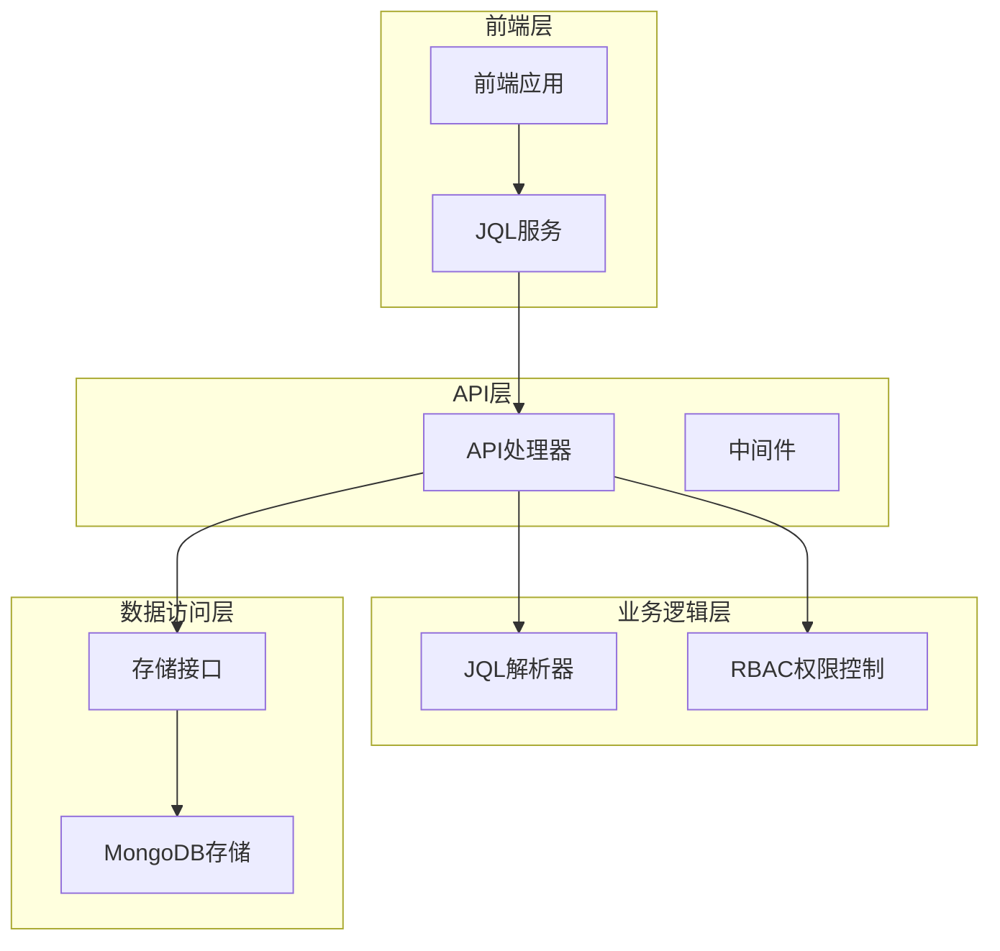
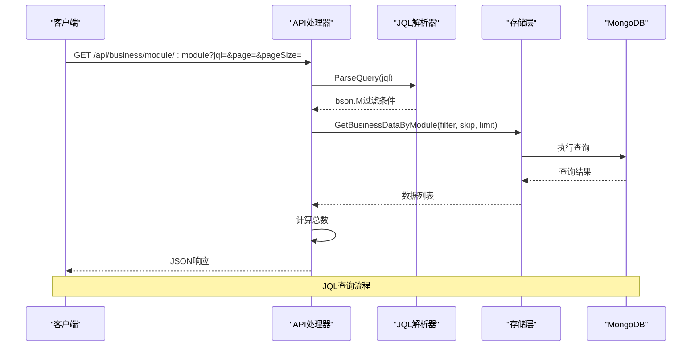
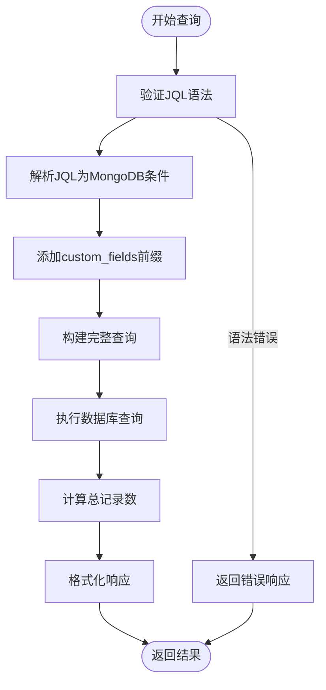
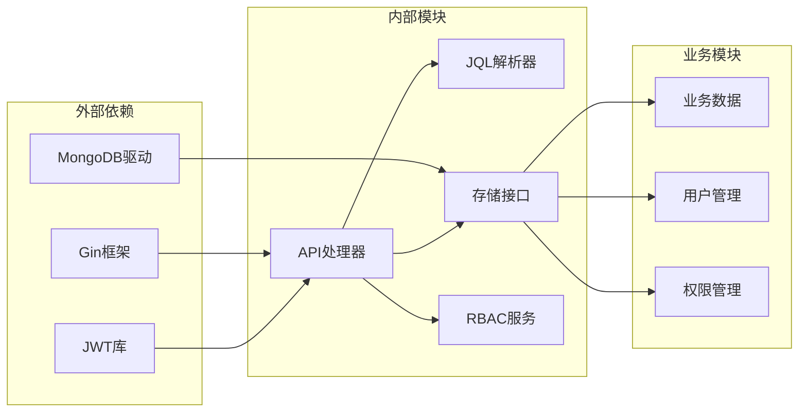
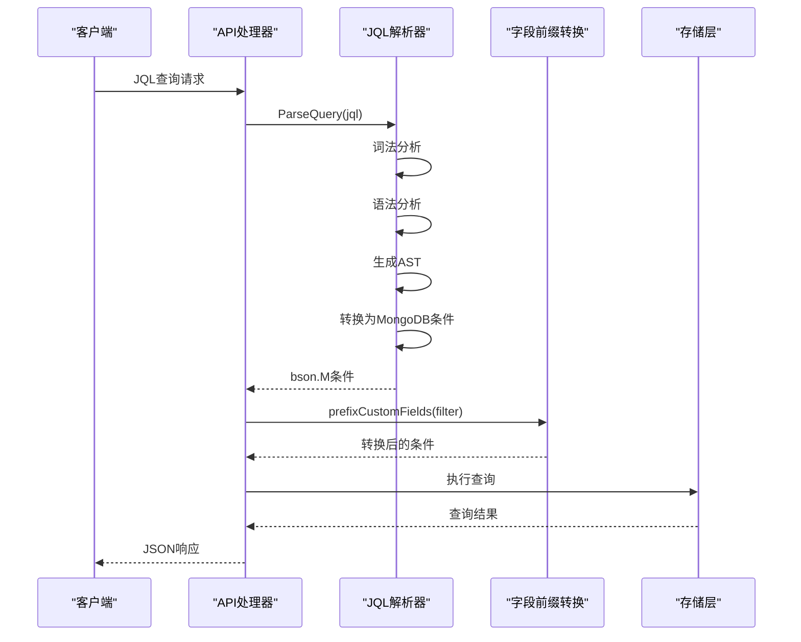

# JQL API文档

<cite>
**本文档引用的文件**
- [docs/query.md](file://docs/query.md)
- [docs/api-spec.md](file://docs/api-spec.md)
- [docs/api.md](file://docs/api.md)
- [pkg/jql/parser.go](file://pkg/jql/parser.go)
- [pkg/jql/parser_test.go](file://pkg/jql/parser_test.go)
- [internal/api/handlers.go](file://internal/api/handlers.go)
- [internal/storage/mongodb.go](file://internal/storage/mongodb.go)
- [internal/models/models.go](file://internal/models/models.go)
- [frontend/src/services/jql.ts](file://frontend/src/services/jql.ts)
</cite>

## 目录
1. [简介](#简介)
2. [项目结构](#项目结构)
3. [核心组件](#核心组件)
4. [架构概览](#架构概览)
5. [详细组件分析](#详细组件分析)
6. [依赖关系分析](#依赖关系分析)
7. [性能考虑](#性能考虑)
8. [故障排除指南](#故障排除指南)
9. [结论](#结论)
10. [附录](#附录)

## 简介

JQL（JSON查询语言）API是数据中心系统的核心查询接口，提供类SQL的查询语法，支持对业务数据进行灵活的过滤和检索。该API采用RESTful设计，基于JWT认证，支持多种查询操作符和内置函数，能够将JQL查询语句转换为MongoDB查询条件。

JQL查询语言专为非技术用户设计，通过简洁的语法降低了数据库查询的学习成本，同时保持了强大的查询能力。系统支持基本比较运算符、逻辑运算符、列表匹配、空值检查以及多种内置时间函数。

## 项目结构

数据中心系统的JQL查询API采用模块化架构设计：



**图表来源**
- [internal/api/handlers.go:45-181](file://internal/api/handlers.go#L45-L181)
- [pkg/jql/parser.go:1-653](file://pkg/jql/parser.go#L1-L653)

**章节来源**
- [internal/api/handlers.go:45-181](file://internal/api/handlers.go#L45-L181)
- [pkg/jql/parser.go:1-653](file://pkg/jql/parser.go#L1-L653)

## 核心组件

### JQL解析器

JQL解析器是整个API的核心组件，采用手写递归下降解析器实现，完全自包含在`pkg/jql/`目录中。

**主要特性：**
- 支持12种运算符：`=`, `!=`, `>`, `<`, `>=`, `<=`, `~`, `IN`, `NOT IN`, `IS NULL`, `IS NOT NULL`, `AND`, `OR`, `NOT`
- 支持6种内置函数：`CurrentUser()`, `Now()`, `StartOfDay()`, `EndOfDay()`, `StartOfWeek()`, `EndOfWeek()`, `StartOfMonth()`, `EndOfMonth()`
- 自动类型识别和转换
- 词法分析、语法分析、MongoDB转换三阶段处理

**章节来源**
- [pkg/jql/parser.go:12-653](file://pkg/jql/parser.go#L12-L653)
- [pkg/jql/parser_test.go:1-873](file://pkg/jql/parser_test.go#L1-L873)

### API处理器

API处理器负责处理HTTP请求，将JQL查询转换为MongoDB查询条件，并执行相应的业务逻辑。

**主要功能：**
- JWT认证和权限验证
- JQL查询解析和转换
- 分页查询支持
- 错误处理和响应格式化

**章节来源**
- [internal/api/handlers.go:1013-1049](file://internal/api/handlers.go#L1013-L1049)

### 存储接口

存储接口定义了统一的数据访问抽象，支持多种数据存储后端。

**主要接口：**
- 用户管理：`GetUsers()`, `GetUserByID()`, `CreateUser()`, `UpdateUser()`, `DeleteUser()`
- 业务数据：`GetBusinessDataByModule()`, `GetBusinessDataCount()`, `CreateBusinessData()`
- 权限管理：`GetPermissions()`, `GetRoles()`, `GetCollections()`

**章节来源**
- [internal/storage/mongodb.go:14-91](file://internal/storage/mongodb.go#L14-L91)

## 架构概览

JQL查询API采用分层架构设计，确保了良好的可维护性和扩展性：



**图表来源**
- [internal/api/handlers.go:1013-1049](file://internal/api/handlers.go#L1013-L1049)
- [pkg/jql/parser.go:46-65](file://pkg/jql/parser.go#L46-L65)

### 查询执行流程



**图表来源**
- [internal/api/handlers.go:1013-1049](file://internal/api/handlers.go#L1013-L1049)
- [internal/api/handlers.go:1782-1833](file://internal/api/handlers.go#L1782-L1833)

## 详细组件分析

### HTTP API规范

#### 基础信息
- **基础URL**: `http://localhost:8080`
- **认证方式**: JWT Bearer Token
- **内容类型**: `application/json`
- **字符编码**: UTF-8

#### 认证头部
| 头信息 | 必填 | 说明 |
|--------|------|------|
| Content-Type | 是 | application/json |
| Authorization | 否 | Bearer {token}，受保护接口需携带 |

**章节来源**
- [docs/api-spec.md:7-22](file://docs/api-spec.md#L7-L22)

### 查询接口

#### GET /api/business/module/:module

**功能**: 按模块查询业务数据，支持JQL查询条件

**查询参数**:
| 参数 | 类型 | 必填 | 默认值 | 说明 |
|------|------|------|--------|------|
| page | int | 否 | 1 | 页码 |
| pageSize | int | 否 | 10 | 每页数量 |
| jql | string | 否 | - | JQL查询条件 |

**请求示例**:
```javascript
// 基本查询
GET /api/business/module/movie?page=1&pageSize=10&jql=status="active"

// 复杂查询
GET /api/business/module/movie?page=1&pageSize=10&jql=status IN ("active","pending") AND created > StartOfWeek()
```

**响应格式**:
```json
{
  "data": [
    {
      "_id": "id",
      "module": "module",
      "description": "描述",
      "custom_fields": {}
    }
  ],
  "total": 100,
  "page": 1,
  "pageSize": 10
}
```

**章节来源**
- [docs/query.md:182-206](file://docs/query.md#L182-L206)
- [docs/api-spec.md:782-823](file://docs/api-spec.md#L782-L823)

### 语法验证接口

#### POST /api/query/validate

**功能**: 验证JQL查询语法的有效性

**请求体**:
```json
{
  "jql": "status = \"open\" AND priority >= 3"
}
```

**响应体**:
```json
{
  "valid": true,
  "error": null
}
```

**章节来源**
- [docs/query.md:208-225](file://docs/query.md#L208-L225)

### JQL查询语法

#### 支持的运算符

| 运算符 | 描述 | 示例 |
|--------|------|------|
| = | 等于 | status = "open" |
| != | 不等于 | status != "closed" |
| > | 大于 | created > "2024-01-01" |
| < | 小于 | created < "2024-12-31" |
| >= | 大于等于 | priority >= 3 |
| <= | 小于等于 | priority <= 5 |
| ~ | 模糊匹配 | title ~ "keyword" |
| IN | 在列表中 | status IN ("open","pending") |
| NOT IN | 不在列表中 | status NOT IN ("deleted") |
| IS NULL | 为空 | assignee IS NULL |
| IS NOT NULL | 不为空 | assignee IS NOT NULL |
| AND | 逻辑与 | status = "open" AND priority > 3 |
| OR | 逻辑或 | status = "open" OR status = "pending" |

#### 内置函数

**用户相关函数**:
- `CurrentUser()`: 获取当前用户

**时间相关函数**:
- `Now()`: 获取当前时间
- `StartOfDay()`: 获取当天开始时间
- `EndOfDay()`: 获取当天结束时间
- `StartOfWeek()`: 获取本周开始时间
- `EndOfWeek()`: 获取本周结束时间
- `StartOfMonth()`: 获取本月开始时间
- `EndOfMonth()`: 获取本月结束时间

**章节来源**
- [docs/query.md:16-63](file://docs/query.md#L16-L63)

### 数据模型

#### 业务数据模型

```mermaid
classDiagram
class BusinessData {
+ObjectID _id
+string module
+string description
+map[string]interface{}] custom_fields
+string file_path
+string created_by
+time created_at
+string updated_by
+time updated_at
}
class BaseModel {
+string created_by
+time created_at
+string updated_by
+time updated_at
}
class FieldDefinition {
+ObjectID _id
+string module
+string field_name
+FieldType field_type
+string description
+bool required
+interface{} default_value
+Constraints constraints
}
BusinessData --|> BaseModel
FieldDefinition --> Constraints
```

**图表来源**
- [internal/models/models.go:227-245](file://internal/models/models.go#L227-L245)
- [internal/models/models.go:51-61](file://internal/models/models.go#L51-L61)

**章节来源**
- [internal/models/models.go:227-245](file://internal/models/models.go#L227-L245)

## 依赖关系分析

### 组件耦合关系



**图表来源**
- [internal/api/handlers.go:3-21](file://internal/api/handlers.go#L3-L21)
- [pkg/jql/parser.go:3-10](file://pkg/jql/parser.go#L3-L10)

### 查询转换流程



**图表来源**
- [pkg/jql/parser.go:46-65](file://pkg/jql/parser.go#L46-L65)
- [internal/api/handlers.go:1019-1029](file://internal/api/handlers.go#L1019-L1029)

**章节来源**
- [internal/api/handlers.go:1019-1029](file://internal/api/handlers.go#L1019-L1029)

## 性能考虑

### 查询优化策略

1. **索引策略**
   - 为常用查询字段创建索引
   - 复合索引用于多条件查询
   - 避免在索引字段上使用函数

2. **查询优化**
   - 限制返回字段
   - 使用分页避免大结果集
   - 避免全表扫描

3. **缓存策略**
   - 热门查询结果缓存
   - 缓存失效策略

### 安全最佳实践

1. **防止注入攻击**
   - 参数化查询：所有用户输入都通过参数化处理
   - 字段白名单：只允许查询预定义的字段
   - 值类型验证：验证所有输入值的类型

2. **防止DoS攻击**
   - 查询复杂度限制：限制查询的嵌套层级和条件数量
   - 结果集大小限制：强制使用分页
   - 超时机制：设置查询超时

3. **防止权限绕过**
   - 字段权限检查：确保用户只能查询有权限的字段
   - 数据权限检查：确保用户只能查询有权限的数据
   - 查询审计：记录所有查询操作

**章节来源**
- [docs/query.md:140-179](file://docs/query.md#L140-L179)

## 故障排除指南

### 常见错误类型

| 错误类型 | 描述 | 解决方案 |
|----------|------|----------|
| 语法错误 | JQL语法不正确 | 检查运算符和括号匹配 |
| 语义错误 | 字段或值验证失败 | 确认字段类型和值范围 |
| 权限错误 | 用户无查询权限 | 检查用户权限配置 |
| 系统错误 | 数据库连接问题 | 检查数据库状态 |

### 错误响应格式

```json
{
  "error": "错误消息",
  "code": 400,
  "timestamp": "2024-01-01T00:00:00Z"
}
```

### 调试技巧

1. **使用语法验证接口**：先验证JQL语法再执行查询
2. **检查字段前缀**：确保自定义字段使用正确的前缀
3. **验证权限**：确认用户具有查询权限
4. **监控查询性能**：关注慢查询日志

**章节来源**
- [docs/query.md:174-179](file://docs/query.md#L174-L179)

## 结论

JQL查询API为数据中心系统提供了强大而易用的查询能力。通过类SQL的简洁语法和完善的错误处理机制，系统既满足了技术用户的专业需求，又降低了非技术用户的使用门槛。

该API的主要优势包括：
- **易用性**：简洁的JQL语法，学习成本低
- **安全性**：完整的权限控制和安全验证
- **性能**：优化的查询执行和缓存策略
- **可扩展性**：模块化设计，易于功能扩展

未来的发展方向包括：
- 增强查询性能监控
- 扩展更多内置函数
- 优化复杂查询的处理能力

## 附录

### API端点列表

**查询执行端点**:
- `GET /api/business/module/:module` - 按模块查询业务数据
- `GET /api/collection-data/module/:module` - 按模块查询集合数据

**查询验证端点**:
- `POST /api/query/validate` - 验证JQL语法

**示例查询端点**:
- `GET /api/business/module/:module/:id` - 获取单个业务数据
- `GET /api/collections/:module` - 获取单个集合

### JQL示例

```javascript
// 基本查询
status = "active"
price > 100
name ~ "产品"

// 条件组合
status = "active" AND price > 100
name = "A" OR name = "B"
NOT status = "deleted"

// 列表与空值
status IN ("active","pending","review")
category NOT IN ("deleted","archived")
assignee IS NULL
email IS NOT NULL

// 时间函数
created > StartOfWeek() AND module = "movie"
updated < EndOfMonth() AND status NOT IN ("deleted","archived")
```

### 版本管理

系统采用语义化版本控制，API版本通过URL路径标识。当前版本为1.0，后续版本将保持向后兼容性。

**章节来源**
- [docs/query.md:227-276](file://docs/query.md#L227-L276)
- [frontend/src/services/jql.ts:1-51](file://frontend/src/services/jql.ts#L1-L51)