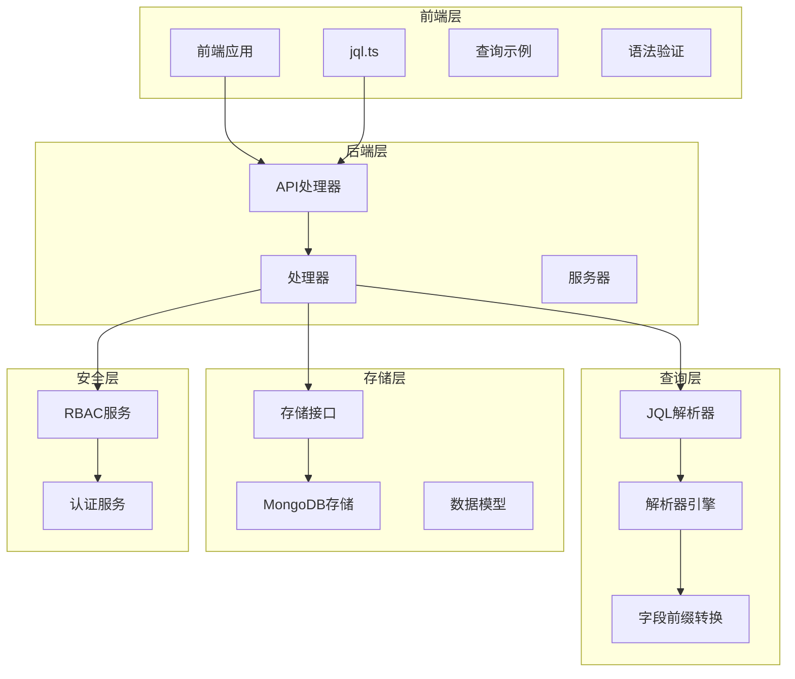
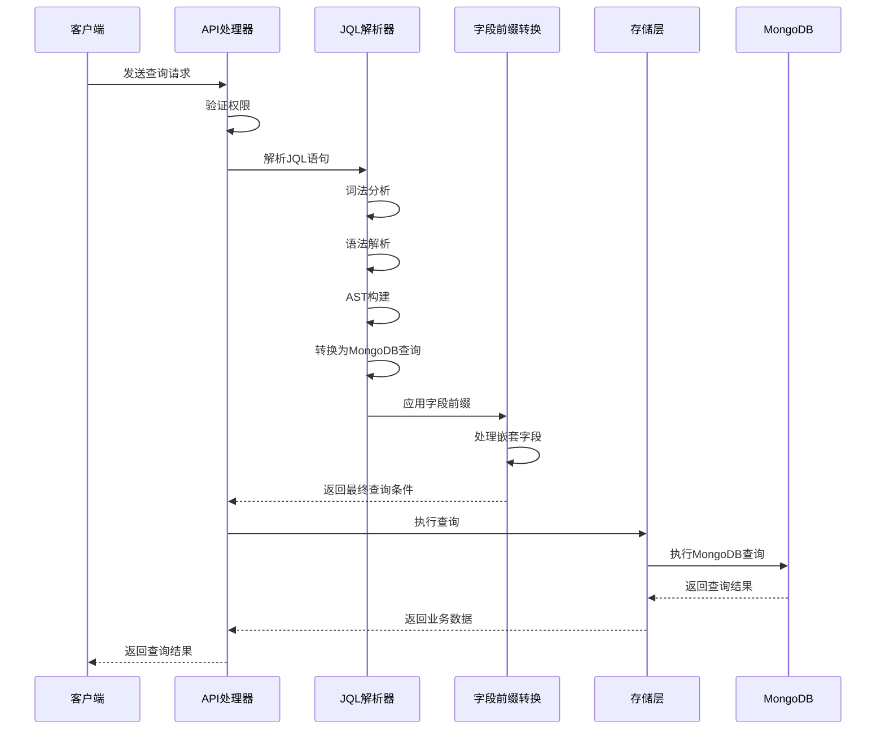
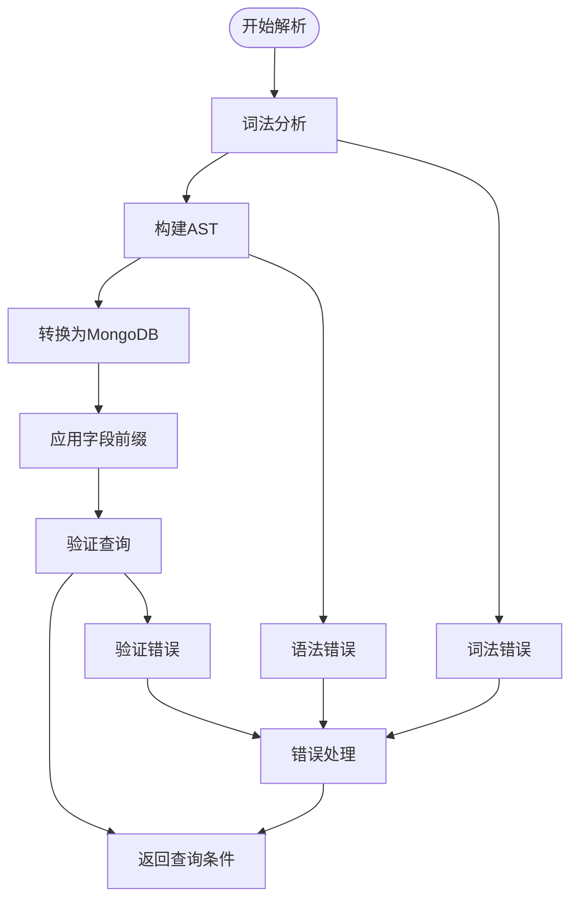
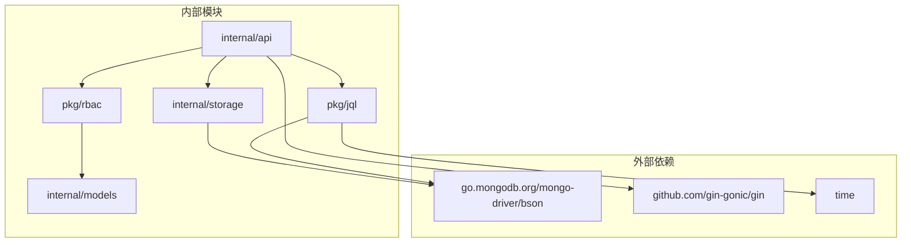

# JQL查询系统

<cite>
**本文档引用的文件**
- [parser.go](file://pkg/jql/parser.go)
- [parser_test.go](file://pkg/jql/parser_test.go)
- [mongodb.go](file://internal/storage/mongodb.go)
- [mongodb_storage.go](file://internal/storage/mongodb_storage.go)
- [jql.ts](file://frontend/src/services/jql.ts)
- [query.md](file://docs/query.md)
- [handlers.go](file://internal/api/handlers.go)
- [main.go](file://cmd/server/main.go)
- [models.go](file://internal/models/models.go)
- [rbac.go](file://pkg/rbac/rbac.go)
- [rbac_storage.go](file://internal/storage/rbac_storage.go)
- [requirements.md](file://docs/modules/jql/requirements.md)
- [tech.md](file://docs/modules/jql/tech.md)
- [implementation.md](file://docs/modules/jql/implementation.md)
</cite>

## 更新摘要
**变更内容**
- 新增JQL模块的完整技术规格文档
- 更新解析器实现细节和架构设计
- 增强查询优化和性能考虑
- 完善API接口和错误处理机制
- 扩展查询示例和使用场景

## 目录
1. [简介](#简介)
2. [项目结构](#项目结构)
3. [核心组件](#核心组件)
4. [架构概览](#架构概览)
5. [详细组件分析](#详细组件分析)
6. [依赖分析](#依赖分析)
7. [性能考虑](#性能考虑)
8. [故障排除指南](#故障排除指南)
9. [结论](#结论)
10. [附录](#附录)

## 简介

JQL（JSON Query Language）是一个专为MongoDB设计的安全查询语言系统。它提供了类似JIRA JQL的语法，支持丰富的操作符和逻辑运算符，能够将人类可读的查询语句转换为安全的MongoDB查询条件。

**更新** 新增了完整的JQL模块技术文档，包括需求设计、技术实现和详细架构说明。

本系统的核心特性包括：
- 安全的查询解析和转换机制
- 支持多种数据类型的值处理
- 内置函数支持（当前用户、时间函数等）
- 嵌套字段查询支持
- 完整的错误处理和验证机制
- 递归下降解析器实现
- 前端查询示例和验证

**章节来源**
- [requirements.md:1-198](file://docs/modules/jql/requirements.md#L1-L198)
- [tech.md:1-273](file://docs/modules/jql/tech.md#L1-L273)
- [implementation.md:1-474](file://docs/modules/jql/implementation.md#L1-L474)

## 项目结构

JQL查询系统采用模块化设计，主要包含以下核心模块：



**图表来源**
- [main.go:24-150](file://cmd/server/main.go#L24-L150)
- [handlers.go:45-181](file://internal/api/handlers.go#L45-L181)
- [parser.go:42-653](file://pkg/jql/parser.go#L42-L653)
- [tech.md:9-23](file://docs/modules/jql/tech.md#L9-L23)

**章节来源**
- [main.go:24-150](file://cmd/server/main.go#L24-L150)
- [handlers.go:45-181](file://internal/api/handlers.go#L45-L181)
- [tech.md:9-23](file://docs/modules/jql/tech.md#L9-L23)

## 核心组件

### JQL解析器

JQL解析器是整个系统的核心组件，负责将自然语言风格的查询语句转换为MongoDB可执行的查询条件。

**更新** 基于新增的技术文档，解析器实现了完整的递归下降解析器，包含词法分析、语法分析和MongoDB转换三个阶段。

#### 主要功能特性：
- **词法分析**：识别查询语句中的字段名、操作符、值和函数
- **语法解析**：构建抽象语法树（AST）
- **语义转换**：将AST转换为MongoDB查询条件
- **类型验证**：自动识别和转换不同数据类型

#### 支持的操作符：
- 比较操作符：`=`, `!=`, `>`, `<`, `>=`, `<=`
- 模糊匹配：`~`（正则表达式）
- 集合操作：`IN`, `NOT IN`
- 空值检查：`IS NULL`, `IS NOT NULL`
- 逻辑操作：`AND`, `OR`, `NOT`

#### 内置函数支持：
- 时间函数：`Now()`, `StartOfDay()`, `EndOfDay()`, `StartOfWeek()`, `EndOfWeek()`, `StartOfMonth()`, `EndOfMonth()`
- 用户函数：`CurrentUser()`

**章节来源**
- [parser.go:14-30](file://pkg/jql/parser.go#L14-L30)
- [parser.go:132-144](file://pkg/jql/parser.go#L132-L144)
- [parser.go:538-574](file://pkg/jql/parser.go#L538-L574)
- [requirements.md:9-77](file://docs/modules/jql/requirements.md#L9-L77)
- [tech.md:173-211](file://docs/modules/jql/tech.md#L173-L211)

### MongoDB存储层

存储层提供了统一的数据库访问接口，支持动态集合管理和索引创建。

#### 主要接口：
- **动态集合管理**：支持按需创建和访问业务数据集合
- **索引管理**：提供索引创建和查询功能
- **数据操作**：封装常见的CRUD操作

**章节来源**
- [mongodb.go:14-90](file://internal/storage/mongodb.go#L14-L90)
- [mongodb_storage.go:53-78](file://internal/storage/mongodb_storage.go#L53-L78)

### RBAC安全控制

基于角色的访问控制（RBAC）确保只有授权用户才能执行特定的查询操作。

#### 安全特性：
- **权限验证**：检查用户对特定资源的访问权限
- **超级管理员**：内置系统管理员权限
- **细粒度控制**：支持用户、角色、权限的完整管理

**章节来源**
- [rbac.go:63-99](file://pkg/rbac/rbac.go#L63-L99)
- [rbac_storage.go:16-50](file://internal/storage/rbac_storage.go#L16-L50)

### 前端查询服务

前端提供了完整的JQL查询服务，包括查询示例、语法验证和用户界面支持。

#### 主要功能：
- **查询示例**：提供13种常用查询示例
- **语法验证**：基本的语法检查和验证
- **操作符支持**：支持比较、逻辑和特殊操作符
- **函数支持**：支持时间函数和用户函数

**章节来源**
- [jql.ts:1-51](file://frontend/src/services/jql.ts#L1-L51)
- [implementation.md:253-272](file://docs/modules/jql/implementation.md#L253-L272)

## 架构概览

JQL查询系统的整体架构采用分层设计，确保了良好的可维护性和扩展性。



**图表来源**
- [handlers.go:1019-1029](file://internal/api/handlers.go#L1019-L1029)
- [parser.go:46-65](file://pkg/jql/parser.go#L46-L65)
- [implementation.md:418-449](file://docs/modules/jql/implementation.md#L418-L449)

## 详细组件分析

### JQL解析器实现

JQL解析器采用了经典的编译器设计模式，包含三个主要阶段：

**更新** 基于新增的实现文档，解析器是一个完整的递归下降解析器，实现了BNF语法规范。

#### 1. 词法分析阶段
词法分析器将输入的查询字符串分解为一系列标记（Token），包括：
- 字段标识符（Field）
- 操作符（Operator）
- 值（Value）
- 函数调用（Function）
- 逻辑操作符（AND, OR, NOT）

**更新** 词法分析实现了完整的优先级扫描机制，支持关键字识别、操作符识别、值识别等功能。

#### 2. 语法分析阶段
语法分析器根据JQL语法规则构建抽象语法树（AST），支持：
- 操作符优先级处理
- 括号优先级
- 嵌套表达式
- 逻辑运算符组合

**更新** 语法分析实现了完整的BNF语法规范，包括表达式、条件、值列表等语法规则。

#### 3. 语义转换阶段
将AST转换为MongoDB查询条件，包括：
- 字段名映射
- 操作符转换
- 值类型处理
- 嵌套查询支持

**更新** 转换阶段实现了MongoDB操作符映射和逻辑运算符转换。



**图表来源**
- [parser.go:67-230](file://pkg/jql/parser.go#L67-L230)
- [parser.go:268-421](file://pkg/jql/parser.go#L268-L421)
- [parser.go:576-623](file://pkg/jql/parser.go#L576-L623)
- [implementation.md:45-174](file://docs/modules/jql/implementation.md#L45-L174)

**章节来源**
- [parser.go:67-230](file://pkg/jql/parser.go#L67-L230)
- [parser.go:268-421](file://pkg/jql/parser.go#L268-L421)
- [parser.go:576-623](file://pkg/jql/parser.go#L576-L623)
- [implementation.md:45-174](file://docs/modules/jql/implementation.md#L45-L174)

### 查询条件转换机制

JQL到MongoDB的转换遵循严格的映射规则，确保查询的安全性和准确性。

**更新** 基于新增的技术文档，转换机制实现了完整的MongoDB操作符映射。

#### 操作符映射表：

| JQL操作符 | MongoDB操作符 | 说明 |
|-----------|---------------|------|
| `=` | `$eq` | 等值比较 |
| `!=` | `$ne` | 不等比较 |
| `>` | `$gt` | 大于比较 |
| `<` | `$lt` | 小于比较 |
| `>=` | `$gte` | 大于等于 |
| `<=` | `$lte` | 小于等于 |
| `IN` | `$in` | 包含在集合中 |
| `NOT IN` | `$nin` | 不包含在集合中 |
| `~` | `$regex` | 正则表达式匹配 |
| `IS NULL` | `$exists: false` | 检查字段不存在 |
| `IS NOT NULL` | `$exists: true` | 检查字段存在 |

#### 嵌套字段支持：
JQL解析器支持深度嵌套的文档字段查询，如：
- `profile.name = "John"`
- `address.city = "Beijing"`
- `company.department.team = "Engineering"`

**章节来源**
- [parser.go:538-574](file://pkg/jql/parser.go#L538-L574)
- [parser_test.go:565-717](file://pkg/jql/parser_test.go#L565-L717)
- [tech.md:122-171](file://docs/modules/jql/tech.md#L122-L171)

### API接口设计

系统提供了完整的RESTful API接口，支持查询验证和数据检索功能。

#### 查询接口：
```
GET /api/collection-data/module/:module
参数：
- jql: JQL查询语句
- page: 页码
- pageSize: 每页数量
```

#### 语法验证接口：
```
POST /api/query/validate
请求体：
{
  "jql": "status = \"open\" AND priority >= 3"
}
响应：
{
  "valid": true,
  "error": null
}
```

**章节来源**
- [query.md:182-226](file://docs/query.md#L182-L226)
- [handlers.go:124-132](file://internal/api/handlers.go#L124-L132)

### 字段前缀转换机制

**更新** 新增了字段前缀转换机制，用于处理业务数据的嵌套字段结构。

由于业务数据的自定义字段存储在 `custom_fields` 嵌套文档中，JQL解析后的字段名需要添加前缀。

#### 转换规则：
- 系统字段名（`_id`, `module`, `description`, `created_at`, `updated_at`, `created_by`, `updated_by`, `data_path`, `file_path`, `custom_fields`）→ 不添加前缀
- MongoDB操作符（以 `$` 开头）→ 不添加前缀
- 其他字段 → 添加 `custom_fields.` 前缀

**章节来源**
- [implementation.md:415-449](file://docs/modules/jql/implementation.md#L415-L449)
- [tech.md:214-249](file://docs/modules/jql/tech.md#L214-L249)

## 依赖分析

JQL查询系统的依赖关系清晰明确，各组件之间耦合度低，便于维护和扩展。



**图表来源**
- [parser.go:3-10](file://pkg/jql/parser.go#L3-L10)
- [handlers.go:3-21](file://internal/api/handlers.go#L3-L21)

### 关键依赖关系

1. **JQL解析器依赖**：
   - MongoDB驱动程序（bson）用于查询条件构建
   - time包用于时间函数处理

2. **API处理器依赖**：
   - Gin框架用于HTTP请求处理
   - JQL解析器用于查询语句解析
   - 存储层用于数据访问
   - RBAC服务用于权限验证

3. **存储层依赖**：
   - MongoDB驱动程序用于数据库操作
   - 数据模型用于数据结构定义

**章节来源**
- [parser.go:3-10](file://pkg/jql/parser.go#L3-L10)
- [handlers.go:3-21](file://internal/api/handlers.go#L3-L21)

## 性能考虑

JQL查询系统在设计时充分考虑了性能优化，提供了多种优化策略：

**更新** 基于新增的需求文档，系统具备高性能解析能力。

### 索引策略
- **单字段索引**：为常用查询字段创建索引
- **复合索引**：为多条件查询创建复合索引
- **文本索引**：为全文搜索创建文本索引
- **TTL索引**：为临时数据创建TTL索引

### 查询优化
- **投影优化**：只返回需要的字段
- **分页查询**：使用skip和limit限制结果集
- **索引提示**：在必要时使用索引提示
- **查询缓存**：缓存热点查询结果

### 性能监控
- **慢查询日志**：记录执行时间超过阈值的查询
- **查询统计**：统计查询频率和性能指标
- **内存使用监控**：监控查询过程中的内存使用情况

### 解析性能
- **单次解析在毫秒级完成**：满足高性能需求
- **递归下降解析器**：高效的语法解析
- **内存池优化**：减少内存分配开销

**章节来源**
- [requirements.md:176-184](file://docs/modules/jql/requirements.md#L176-L184)
- [tech.md:173-211](file://docs/modules/jql/tech.md#L173-L211)

## 故障排除指南

### 常见问题及解决方案

#### 1. 查询语法错误
**症状**：解析器返回语法错误
**可能原因**：
- 操作符使用错误
- 字段名不正确
- 引号未闭合
- 括号不匹配

**解决方法**：
- 检查操作符是否在支持列表中
- 验证字段名是否存在于数据模型中
- 确保字符串值使用正确的引号

#### 2. 权限不足错误
**症状**：返回403 Forbidden错误
**可能原因**：
- 用户没有查询权限
- 集合权限不足
- 超级管理员权限缺失

**解决方法**：
- 检查用户的角色和权限
- 验证集合级别的访问权限
- 确认用户是否具有超级管理员权限

#### 3. 数据类型不匹配
**症状**：查询执行失败或返回空结果
**可能原因**：
- 值类型与字段类型不匹配
- 日期格式不正确
- 数字格式错误

**解决方法**：
- 验证值的类型是否正确
- 检查日期格式是否符合RFC3339标准
- 确认数字格式的正确性

#### 4. 嵌套字段解析错误
**症状**：嵌套字段查询失败
**可能原因**：
- 字段路径格式错误
- 嵌套层级过多
- 特殊字符处理问题

**解决方法**：
- 验证字段路径格式
- 检查嵌套层级限制
- 使用正确的字段分隔符

**章节来源**
- [parser_test.go:204-265](file://pkg/jql/parser_test.go#L204-L265)
- [rbac.go:63-99](file://pkg/rbac/rbac.go#L63-L99)
- [implementation.md:565-787](file://docs/modules/jql/implementation.md#L565-L787)

## 结论

JQL查询系统是一个设计精良、功能完整的查询语言解决方案。它成功地将复杂的查询需求转化为简洁易用的语法，同时保持了高度的安全性和性能。

**更新** 基于新增的技术文档，系统展现了更完善的设计和实现。

### 主要优势
1. **安全性**：通过严格的解析和验证机制防止注入攻击
2. **易用性**：提供类似JIRA JQL的直观语法
3. **扩展性**：模块化设计便于功能扩展
4. **性能**：优化的查询转换和索引策略
5. **可靠性**：完善的错误处理和监控机制
6. **完整性**：完整的前端、后端和存储层支持

### 技术特色
- 支持嵌套字段查询
- 内置丰富的函数支持
- 完整的权限控制机制
- 灵活的查询结果处理
- 可扩展的存储架构
- 递归下降解析器实现
- 字段前缀转换机制

## 附录

### 查询示例

**更新** 基于新增的实现文档，提供了13种完整的查询示例。

#### 基础查询
```
status = "active"
price > 100
name ~ "产品"
```

#### 条件组合
```
status = "active" AND price > 100
name = "A" OR name = "B"
NOT status = "deleted"
```

#### 括号分组
```
(status = "active" OR status = "pending") AND price > 100
```

#### 列表与空值
```
status IN ("active", "pending", "review")
category NOT IN ("deleted", "archived")
assignee IS NULL
email IS NOT NULL
```

#### 时间函数
```
created > StartOfWeek() AND module = "movie"
updated < EndOfMonth() AND status NOT IN ("deleted", "archived")
```

**章节来源**
- [implementation.md:253-272](file://docs/modules/jql/implementation.md#L253-L272)
- [requirements.md:134-173](file://docs/modules/jql/requirements.md#L134-L173)

### 支持的操作符一览

**更新** 基于新增的需求文档，提供了完整的操作符支持列表。

| 操作符类别 | 支持的操作符 | 说明 |
|------------|--------------|------|
| 比较操作符 | `=`, `!=`, `>`, `<`, `>=`, `<=` | 基本数值和字符串比较 |
| 集合操作符 | `IN`, `NOT IN` | 检查值是否在集合中 |
| 空值操作符 | `IS NULL`, `IS NOT NULL` | 检查字段状态 |
| 模糊匹配 | `~` | 正则表达式匹配 |
| 逻辑操作符 | `AND`, `OR`, `NOT` | 组合多个条件 |
| 特殊操作符 | `LIKE`, `contains` | 文本匹配功能 |

### 内置函数支持

**更新** 基于新增的技术文档，提供了完整的函数支持列表。

| 函数类别 | 支持的函数 | 说明 |
|----------|------------|------|
| 时间函数 | `Now()`, `StartOfDay()`, `EndOfDay()` | 当前时间和日期范围 |
| 时间函数 | `StartOfWeek()`, `EndOfWeek()` | 本周开始和结束时间 |
| 时间函数 | `StartOfMonth()`, `EndOfMonth()` | 本月开始和结束时间 |
| 用户函数 | `CurrentUser()` | 当前登录用户信息 |

### 安全最佳实践

1. **输入验证**：始终验证用户输入的查询语句
2. **权限检查**：确保用户只能查询有权限的数据
3. **查询限制**：限制查询的复杂度和结果集大小
4. **监控告警**：监控异常查询行为
5. **定期审计**：定期审查查询日志和权限使用情况
6. **嵌套字段安全**：验证嵌套字段路径的有效性

**章节来源**
- [requirements.md:67-77](file://docs/modules/jql/requirements.md#L67-L77)
- [requirements.md:176-184](file://docs/modules/jql/requirements.md#L176-L184)
- [tech.md:173-211](file://docs/modules/jql/tech.md#L173-L211)
- [implementation.md:453-474](file://docs/modules/jql/implementation.md#L453-L474)