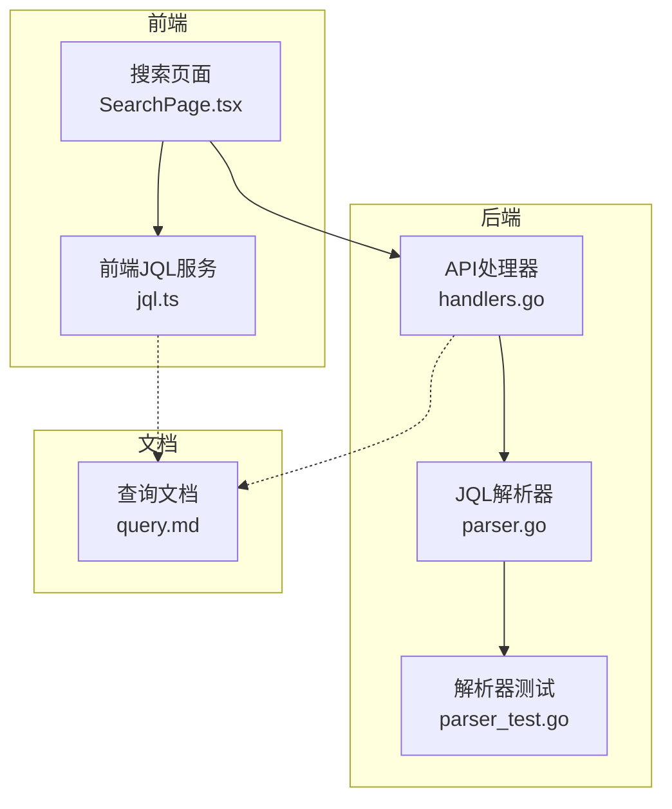
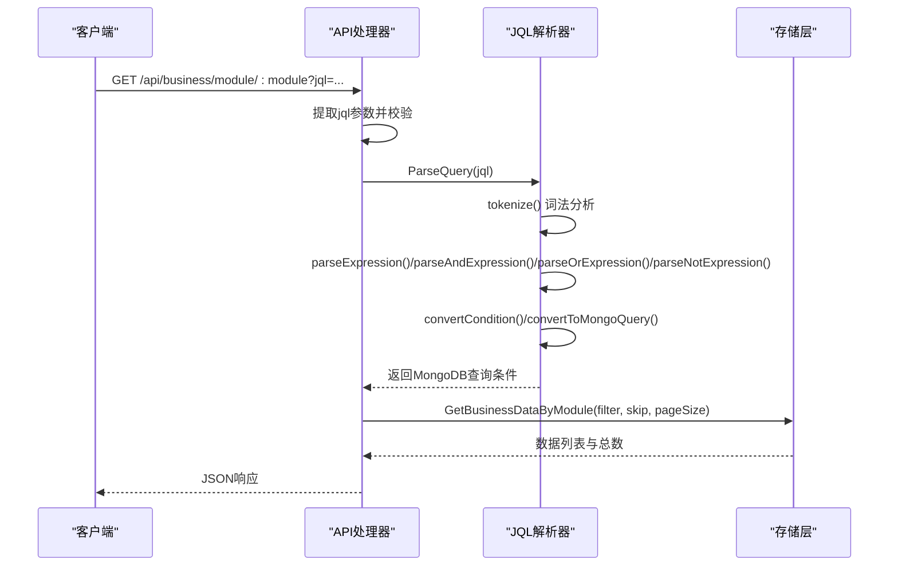
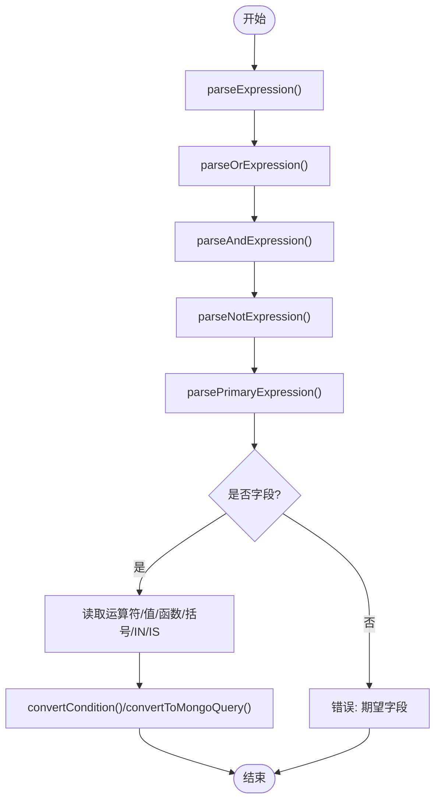
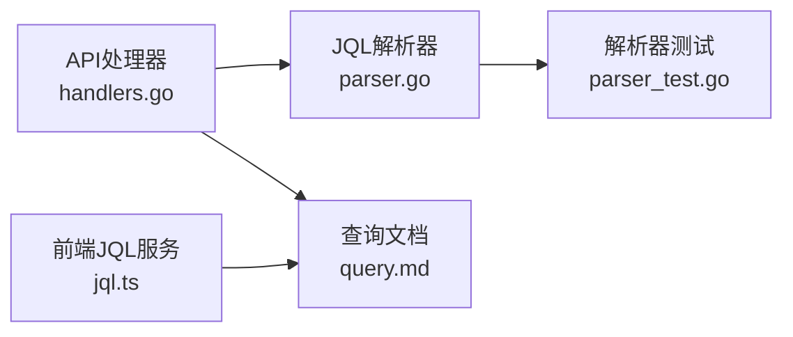

# JQL语法设计

<cite>
**本文引用的文件**
- [parser.go](file://pkg/jql/parser.go)
- [parser_test.go](file://pkg/jql/parser_test.go)
- [jql.ts](file://frontend/src/services/jql.ts)
- [query.md](file://docs/query.md)
- [handlers.go](file://internal/api/handlers.go)
- [e2e.go](file://test/e2e.go)
</cite>

## 目录
1. [简介](#简介)
2. [项目结构](#项目结构)
3. [核心组件](#核心组件)
4. [架构总览](#架构总览)
5. [详细组件分析](#详细组件分析)
6. [依赖分析](#依赖分析)
7. [性能考量](#性能考量)
8. [故障排查指南](#故障排查指南)
9. [结论](#结论)
10. [附录](#附录)

## 简介
本文件系统性阐述JQL（查询语言）的设计理念、语法规则、词法与语法解析流程、函数支持、括号优先级与表达式组合方式，并提供完整语法示例与错误检测机制说明。JQL面向业务数据查询，采用“字段 运算符 值/函数”的简洁表达，支持多种比较、逻辑与特殊操作符，以及内置时间与用户相关函数，最终转换为MongoDB查询条件，确保安全与可扩展性。

## 项目结构
JQL相关实现主要分布在后端解析器、前端示例与文档三部分：
- 后端解析器：负责词法分析、语法解析、AST构建与MongoDB查询转换
- 前端示例与校验：提供示例查询、操作符与函数清单，以及基础正则校验
- 文档：提供JQL语法规范、示例与转换映射

图表来源
- [handlers.go:1015-1048](file://internal/api/handlers.go#L1015-L1048)
- [parser.go:46-65](file://pkg/jql/parser.go#L46-L65)
- [jql.ts:1-51](file://frontend/src/services/jql.ts#L1-L51)
- [query.md:1-300](file://docs/query.md#L1-L300)

章节来源
- [handlers.go:1015-1048](file://internal/api/handlers.go#L1015-L1048)
- [parser.go:46-65](file://pkg/jql/parser.go#L46-L65)
- [jql.ts:1-51](file://frontend/src/services/jql.ts#L1-L51)
- [query.md:1-300](file://docs/query.md#L1-L300)

## 核心组件
- 词法分析器：将输入字符串切分为标记（字段、运算符、值、函数、括号、逻辑操作符等）
- 语法解析器：基于递归下降解析，构建表达式AST（支持AND/OR/NOT优先级与括号）
- 条件转换器：将AST转换为MongoDB查询对象
- 函数解析：内置函数(CurrentUser、Now、StartOfDay、EndOfDay、StartOfWeek、EndOfWeek、StartOfMonth、EndOfMonth)解析与求值
- 错误处理：对不匹配括号、非法字符、缺少操作数等进行报错

章节来源
- [parser.go:67-230](file://pkg/jql/parser.go#L67-L230)
- [parser.go:268-421](file://pkg/jql/parser.go#L268-L421)
- [parser.go:538-574](file://pkg/jql/parser.go#L538-L574)
- [parser.go:502-536](file://pkg/jql/parser.go#L502-L536)

## 架构总览
JQL查询从HTTP请求进入，经API处理器提取参数并调用解析器，生成MongoDB查询条件，再由存储层执行查询。

图表来源
- [handlers.go:1015-1048](file://internal/api/handlers.go#L1015-L1048)
- [parser.go:46-65](file://pkg/jql/parser.go#L46-L65)
- [parser.go:268-421](file://pkg/jql/parser.go#L268-L421)
- [parser.go:576-623](file://pkg/jql/parser.go#L576-L623)

## 详细组件分析

### 1) 字段标识符命名规范
- 允许字符：字母（大小写均可）、数字、下划线、点号
- 作用：支持普通字段与嵌套字段（如 profile.name、address.city、company.department.team）
- 识别规则：以字母或数字开头，后续可包含字母、数字、下划线或点号

章节来源
- [parser.go:236-238](file://pkg/jql/parser.go#L236-L238)
- [parser_test.go:565-717](file://pkg/jql/parser_test.go#L565-L717)

### 2) 操作符定义
- 比较运算符：=、!=、>、<、>=、<=、~
- 特殊运算符：IN、NOT IN、IS NULL、IS NOT NULL
- 注：文档中还列出LIKE与contains，但解析器源码显示实际支持~作为模糊匹配；IN/NOT IN与IS NULL/IS NOT NULL在解析器中有明确实现

章节来源
- [parser.go:132-144](file://pkg/jql/parser.go#L132-L144)
- [parser.go:361-402](file://pkg/jql/parser.go#L361-L402)
- [parser.go:538-574](file://pkg/jql/parser.go#L538-L574)
- [query.md:16-32](file://docs/query.md#L16-L32)

### 3) 逻辑操作符
- AND、OR、NOT
- 优先级：AND > OR；NOT优先级高于AND/OR
- 结合性：AND/OR左结合；NOT右结合（在解析中体现为先解析NOT，再解析其后的表达式）

章节来源
- [parser.go:272-306](file://pkg/jql/parser.go#L272-L306)
- [parser.go:308-319](file://pkg/jql/parser.go#L308-L319)

### 4) 函数支持
- 已知函数清单：CurrentUser、Now、StartOfDay、EndOfDay、StartOfWeek、EndOfWeek、StartOfMonth、EndOfMonth
- 识别规则：函数名前缀匹配，区分大小写，需以括号结尾
- 行为说明：
  - CurrentUser：返回字符串形式的currentUser占位，供上层逻辑替换为当前用户标识
  - Now/StartOfDay/EndOfDay/StartOfWeek/EndOfWeek/StartOfMonth/EndOfMonth：返回Go时间类型，用于时间比较

章节来源
- [parser.go:240-243](file://pkg/jql/parser.go#L240-L243)
- [parser.go:245-262](file://pkg/jql/parser.go#L245-L262)
- [parser.go:502-536](file://pkg/jql/parser.go#L502-L536)
- [parser_test.go:267-336](file://pkg/jql/parser_test.go#L267-L336)

### 5) 括号优先级与表达式组合
- 括号改变运算优先级，最内层先计算
- 表达式组合：AND/OR/NOT与IN/NOT IN/IS NULL/IS NOT NULL、比较运算符共同构成复合条件
- AST结构：$and/$or/$not与各条件键值对

章节来源
- [parser.go:328-339](file://pkg/jql/parser.go#L328-L339)
- [parser.go:576-623](file://pkg/jql/parser.go#L576-L623)

### 6) 语法示例
以下示例覆盖常见场景（示例来源于测试与文档）：
- 等值/比较/模糊匹配：status = "active"、price > 100、name ~ "产品"
- IN/NOT IN：status IN ("active","pending")、category NOT IN ("deleted","archived")
- IS NULL/IS NOT NULL：assignee IS NULL、email IS NOT NULL
- 逻辑组合：status = "active" AND price > 100；name = "A" OR name = "B"；(status = "active") AND (price > 100 OR price < 50)
- 函数使用：created > StartOfWeek() AND module = "movie"；updated < EndOfMonth() AND status NOT IN ("deleted","archived")

章节来源
- [parser_test.go:630-647](file://pkg/jql/parser_test.go#L630-L647)
- [query.md:64-78](file://docs/query.md#L64-L78)

### 7) 词法规则与标记化过程
- 标记类型：字段、运算符、值、函数、左右括号、AND、OR、NOT、逗号、IN、NOT IN、LIKE、IS NULL、IS NOT NULL
- 关键处理：
  - 逻辑操作符：AND/OR/NOT/IN/NOT IN/IS NULL/IS NOT NULL按关键字识别，注意与字段名边界判断
  - 比较运算符：>=、<=、!=、=、>、<、~按最长匹配原则识别
  - 数值：支持整数、小数、正负数
  - 字符串：单引号或双引号包裹，要求闭合
  - 函数：以knownFunctions前缀匹配，区分大小写
  - 字段：字母、数字、下划线、点号组成，支持嵌套字段
- 错误处理：遇到意外字符立即报错

章节来源
- [parser.go:14-30](file://pkg/jql/parser.go#L14-L30)
- [parser.go:67-230](file://pkg/jql/parser.go#L67-L230)
- [parser.go:240-243](file://pkg/jql/parser.go#L240-L243)

### 8) 语法解析流程（递归下降）
- parseExpression() -> parseOrExpression()
- parseOrExpression()：解析AND子表达式，左结合
- parseAndExpression()：解析NOT子表达式，左结合
- parseNotExpression()：若出现NOT，则解析其后的表达式
- parsePrimaryExpression()：处理字段、运算符、值/函数、括号与IN/NOT IN/IS NULL/IS NOT NULL

图表来源
- [parser.go:268-421](file://pkg/jql/parser.go#L268-L421)
- [parser.go:538-574](file://pkg/jql/parser.go#L538-L574)
- [parser.go:576-623](file://pkg/jql/parser.go#L576-L623)

### 9) 条件转换与MongoDB映射
- 比较运算符映射：=、!=、>、<、>=、<=、~分别映射为$eq、$ne、$gt、$lt、$gte、$lte、$regex（含$i选项）
- IN/NOT IN：映射为$in/$nin
- IS NULL/IS NOT NULL：映射为$exists:false/$exists:true
- 逻辑运算符：AND/OR映射为$and/$or

章节来源
- [parser.go:538-574](file://pkg/jql/parser.go#L538-L574)
- [query.md:86-101](file://docs/query.md#L86-L101)

### 10) 前端集成与示例
- 前端提供JQL示例数组与操作符/函数清单
- 搜索页面支持直接输入JQL并发起查询
- 基础正则校验用于提示输入合法性（非严格语法校验）

章节来源
- [jql.ts:1-51](file://frontend/src/services/jql.ts#L1-L51)
- [SearchPage.tsx:467-473](file://frontend/src/pages/Admin/SearchPage.tsx#L467-L473)

## 依赖分析
- API处理器依赖JQL解析器：在处理业务数据查询时，将jql参数解析为MongoDB查询条件
- 测试覆盖：解析器单元测试与端到端测试验证了语法正确性与错误处理
- 文档与实现一致性：文档中的示例与映射与解析器实现保持一致

图表来源
- [handlers.go:1015-1048](file://internal/api/handlers.go#L1015-L1048)
- [parser.go:46-65](file://pkg/jql/parser.go#L46-L65)
- [parser_test.go:405-418](file://pkg/jql/parser_test.go#L405-L418)
- [jql.ts:1-51](file://frontend/src/services/jql.ts#L1-L51)
- [query.md:1-300](file://docs/query.md#L1-L300)

章节来源
- [handlers.go:1015-1048](file://internal/api/handlers.go#L1015-L1048)
- [parser_test.go:405-418](file://pkg/jql/parser_test.go#L405-L418)
- [jql.ts:1-51](file://frontend/src/services/jql.ts#L1-L51)
- [query.md:1-300](file://docs/query.md#L1-L300)

## 性能考量
- 词法分析与语法解析均为线性扫描与递归下降，时间复杂度近似O(n)，其中n为查询长度
- 嵌套层级与条件数量建议控制，避免过深的$and/$or导致查询计划复杂
- 建议对常用字段建立索引，减少全表扫描
- 对复杂查询可考虑分页与结果集大小限制，避免长耗时查询

## 故障排查指南
- 常见错误类型与定位：
  - 未闭合字符串：词法分析阶段报错
  - 未闭合括号：语法解析阶段报错
  - 缺少运算符或值：语法解析阶段报错
  - IN后缺少括号或括号未闭合：语法解析阶段报错
  - 非法字符：词法分析阶段报错
- 建议排查步骤：
  - 使用ValidateJQL进行快速验证
  - 分段调试：先验证字段与运算符，再逐步加入逻辑与函数
  - 检查嵌套括号匹配与字符串引号闭合
  - 对复杂查询拆分为多个简单条件逐一验证

章节来源
- [parser_test.go:204-265](file://pkg/jql/parser_test.go#L204-L265)
- [parser.go:67-230](file://pkg/jql/parser.go#L67-L230)
- [parser.go:328-339](file://pkg/jql/parser.go#L328-L339)

## 结论
JQL以简洁清晰的语法与严格的解析流程，提供了安全、可扩展的业务数据查询能力。通过明确的字段命名规范、丰富的运算符与函数支持、严谨的错误处理与转换映射，JQL能够满足多样化的查询需求，并与MongoDB查询模型无缝衔接。建议在生产环境中配合索引策略、分页与查询复杂度限制，确保性能与稳定性。

## 附录

### A. 语法要点速查
- 字段命名：字母、数字、下划线、点号，支持嵌套
- 比较运算符：=、!=、>、<、>=、<=、~
- 特殊运算符：IN、NOT IN、IS NULL、IS NOT NULL
- 逻辑运算符：AND、OR、NOT
- 函数：CurrentUser、Now、StartOfDay、EndOfDay、StartOfWeek、EndOfWeek、StartOfMonth、EndOfMonth
- 优先级：NOT > AND > OR；括号最高

章节来源
- [parser.go:132-144](file://pkg/jql/parser.go#L132-L144)
- [parser.go:240-243](file://pkg/jql/parser.go#L240-L243)
- [parser.go:272-306](file://pkg/jql/parser.go#L272-L306)
- [parser.go:328-339](file://pkg/jql/parser.go#L328-L339)

### B. 示例查询路径
- 基础示例：参见测试用例中的示例数组
- 复杂示例：参见端到端测试中的JQL查询片段

章节来源
- [parser_test.go:630-647](file://pkg/jql/parser_test.go#L630-L647)
- [e2e.go:616-626](file://test/e2e.go#L616-L626)