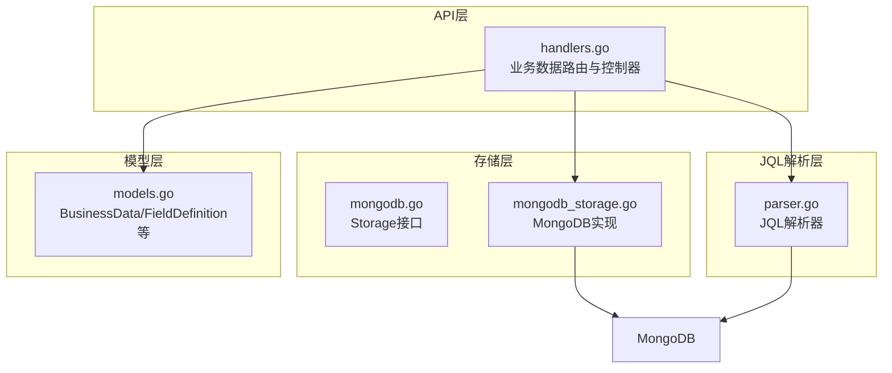
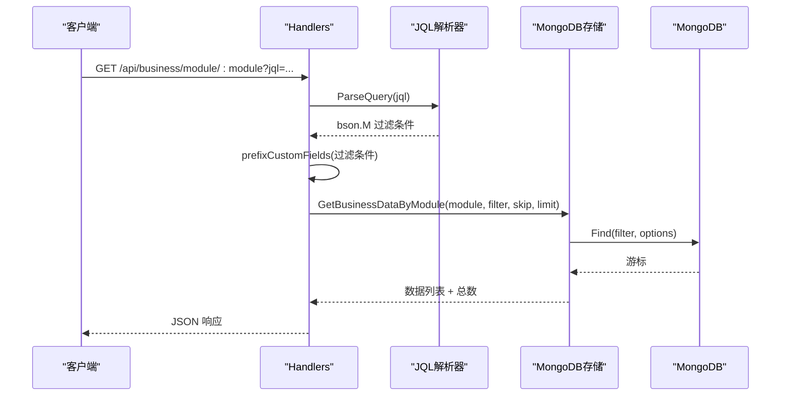
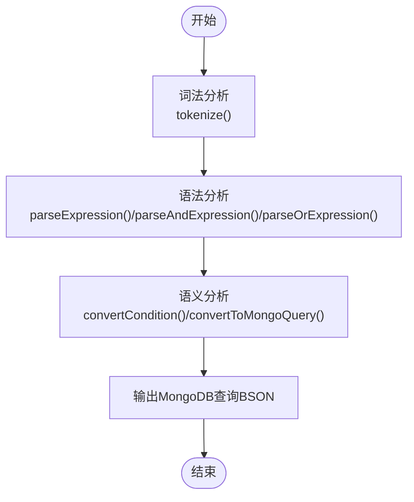
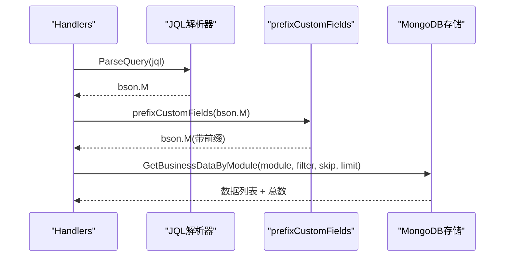
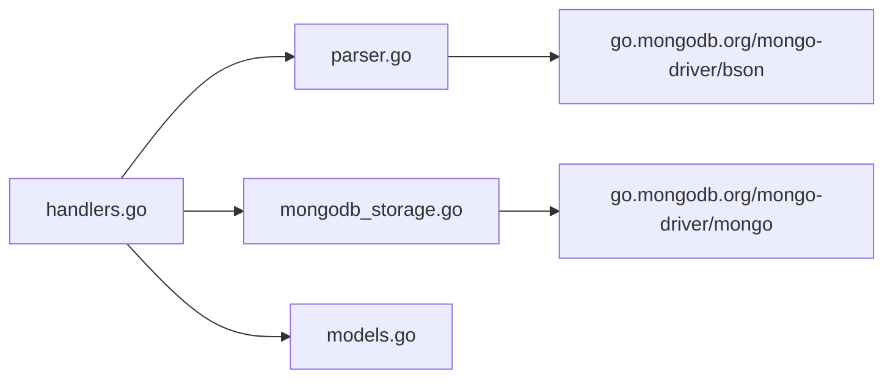

# MongoDB集成

<cite>
**本文引用的文件**
- [pkg/jql/parser.go](file://pkg/jql/parser.go)
- [pkg/jql/parser_test.go](file://pkg/jql/parser_test.go)
- [internal/api/handlers.go](file://internal/api/handlers.go)
- [internal/storage/mongodb.go](file://internal/storage/mongodb.go)
- [internal/storage/mongodb_storage.go](file://internal/storage/mongodb_storage.go)
- [internal/models/models.go](file://internal/models/models.go)
- [docs/query.md](file://docs/query.md)
- [docs/modules/business-data/tech.md](file://docs/modules/business-data/tech.md)
- [docs/modules/business-data/implementation.md](file://docs/modules/business-data/implementation.md)
- [test/e2e.go](file://test/e2e.go)
</cite>

## 目录
1. [简介](#简介)
2. [项目结构](#项目结构)
3. [核心组件](#核心组件)
4. [架构总览](#架构总览)
5. [详细组件分析](#详细组件分析)
6. [依赖分析](#依赖分析)
7. [性能考量](#性能考量)
8. [故障排查指南](#故障排查指南)
9. [结论](#结论)
10. [附录](#附录)

## 简介
本技术文档聚焦于JQL与MongoDB的深度集成，系统性阐述JQL到MongoDB查询的转换机制，覆盖：
- convertCondition方法如何将JQL条件转换为MongoDB BSON查询
- convertToMongoQuery方法如何递归转换整个AST为MongoDB查询结构
- 特殊查询处理：NULL值、正则表达式、日期范围
- 查询优化策略：索引利用、查询计划选择、性能优化技巧
- 查询API集成示例：在handlers中使用JQL解析器进行数据查询
- 查询性能监控与调试方法
- 查询安全考虑：注入防护与资源限制

## 项目结构
围绕“业务数据”模块，系统采用分层架构：
- API层：HTTP路由与控制器，负责接收JQL参数并调用存储层
- 存储层：MongoDB访问封装，提供动态集合CRUD与软删除
- 模型层：业务数据与字段定义模型，支持动态Schema与字段校验
- JQL解析器：词法/语法/语义分析，生成MongoDB查询BSON

图表来源
- [internal/api/handlers.go:1013-1049](file://internal/api/handlers.go#L1013-L1049)
- [pkg/jql/parser.go:46-65](file://pkg/jql/parser.go#L46-L65)
- [internal/storage/mongodb.go:14-90](file://internal/storage/mongodb.go#L14-L90)
- [internal/storage/mongodb_storage.go:366-395](file://internal/storage/mongodb_storage.go#L366-L395)
- [internal/models/models.go:227-245](file://internal/models/models.go#L227-L245)

章节来源
- [internal/api/handlers.go:1013-1049](file://internal/api/handlers.go#L1013-L1049)
- [pkg/jql/parser.go:46-65](file://pkg/jql/parser.go#L46-L65)
- [internal/storage/mongodb.go:14-90](file://internal/storage/mongodb.go#L14-L90)
- [internal/storage/mongodb_storage.go:366-395](file://internal/storage/mongodb_storage.go#L366-L395)
- [internal/models/models.go:227-245](file://internal/models/models.go#L227-L245)

## 核心组件
- JQL解析器：将JQL字符串解析为抽象语法树，并转换为MongoDB查询BSON
- Handlers：接收HTTP请求，解析JQL参数，调用存储层执行查询
- MongoDB存储：提供动态集合CRUD、计数、索引创建等能力
- 模型：业务数据结构与字段定义，支持动态Schema与字段校验

章节来源
- [pkg/jql/parser.go:46-65](file://pkg/jql/parser.go#L46-L65)
- [internal/api/handlers.go:1013-1049](file://internal/api/handlers.go#L1013-L1049)
- [internal/storage/mongodb.go:14-90](file://internal/storage/mongodb.go#L14-L90)
- [internal/storage/mongodb_storage.go:366-395](file://internal/storage/mongodb_storage.go#L366-L395)
- [internal/models/models.go:227-245](file://internal/models/models.go#L227-L245)

## 架构总览
JQL查询在API层被解析为MongoDB查询BSON，随后通过存储层执行，最终返回给客户端。

图表来源
- [internal/api/handlers.go:1013-1049](file://internal/api/handlers.go#L1013-L1049)
- [pkg/jql/parser.go:46-65](file://pkg/jql/parser.go#L46-L65)
- [internal/storage/mongodb_storage.go:366-395](file://internal/storage/mongodb_storage.go#L366-L395)

## 详细组件分析

### JQL解析器与转换机制
- 词法分析：识别字段、运算符、值、函数、括号、逻辑运算符等
- 语法分析：构建AST（表达式、AND/OR/NOT、括号组合）
- 语义分析：将AST转换为MongoDB查询BSON
- 特殊处理：内置函数（如Now、StartOfDay等）与NULL/正则/IN/NOT IN等

图表来源
- [pkg/jql/parser.go:67-230](file://pkg/jql/parser.go#L67-L230)
- [pkg/jql/parser.go:268-421](file://pkg/jql/parser.go#L268-L421)
- [pkg/jql/parser.go:538-574](file://pkg/jql/parser.go#L538-L574)
- [pkg/jql/parser.go:576-623](file://pkg/jql/parser.go#L576-L623)

章节来源
- [pkg/jql/parser.go:67-230](file://pkg/jql/parser.go#L67-L230)
- [pkg/jql/parser.go:268-421](file://pkg/jql/parser.go#L268-L421)
- [pkg/jql/parser.go:538-574](file://pkg/jql/parser.go#L538-L574)
- [pkg/jql/parser.go:576-623](file://pkg/jql/parser.go#L576-L623)

#### convertCondition：JQL条件到MongoDB BSON
- 运算符映射：=→$eq, !=→$ne, >→$gt, <→$lt, >=→$gte, <=→$lte, ~→$regex, IN→$in, NOT IN→$nin
- 特殊处理：
  - IS NULL/IS NOT NULL：使用$exists
  - 值为nil时的NULL处理
  - 正则默认大小写不敏感

章节来源
- [pkg/jql/parser.go:538-574](file://pkg/jql/parser.go#L538-L574)

#### convertToMongoQuery：递归转换AST
- 递归遍历AST，将$and/$or/$not子节点逐一转换
- 对普通键值对保持原样，或递归处理嵌套对象

章节来源
- [pkg/jql/parser.go:576-623](file://pkg/jql/parser.go#L576-L623)

### Handlers中的JQL集成
- 接收jql查询参数，调用ParseQuery生成过滤条件
- 调用prefixCustomFields将用户字段名转换为custom_fields.前缀
- 调用存储层执行查询与计数

图表来源
- [internal/api/handlers.go:1013-1049](file://internal/api/handlers.go#L1013-L1049)
- [internal/api/handlers.go:1782-1833](file://internal/api/handlers.go#L1782-L1833)

章节来源
- [internal/api/handlers.go:1013-1049](file://internal/api/handlers.go#L1013-L1049)
- [internal/api/handlers.go:1782-1833](file://internal/api/handlers.go#L1782-L1833)

### 特殊查询处理
- NULL值查询：IS NULL/IS NOT NULL映射为$exists
- 正则表达式查询：~映射为$regex，默认大小写不敏感
- 日期范围查询：内置函数Now/StartOfDay/EndOfDay/StartOfWeek/EndOfWeek/StartOfMonth/EndOfMonth生成时间边界

章节来源
- [pkg/jql/parser.go:538-574](file://pkg/jql/parser.go#L538-L574)
- [pkg/jql/parser.go:502-536](file://pkg/jql/parser.go#L502-L536)

### 字段前缀转换（prefixCustomFields）
- 系统字段白名单：_id、module、description、created_at、updated_at、created_by、updated_by、data_path、file_path、custom_fields
- 非系统字段：自动添加custom_fields.前缀，适配业务数据的嵌套结构
- 递归处理$and/$or/$not与嵌套对象

章节来源
- [internal/api/handlers.go:1775-1780](file://internal/api/handlers.go#L1775-L1780)
- [internal/api/handlers.go:1782-1833](file://internal/api/handlers.go#L1782-L1833)

### MongoDB存储层
- 提供动态集合CRUD、计数、索引创建等接口
- 业务数据集合命名规则：module+"_data"

章节来源
- [internal/storage/mongodb.go:14-90](file://internal/storage/mongodb.go#L14-L90)
- [internal/storage/mongodb_storage.go:366-395](file://internal/storage/mongodb_storage.go#L366-L395)

### 模型与字段校验
- BusinessData：模块标识、描述、自定义字段（map）、文件路径等
- FieldDefinition：字段类型、约束、枚举、正则、长度等
- 字段校验：在创建/更新时对自定义字段进行类型与约束校验

章节来源
- [internal/models/models.go:227-245](file://internal/models/models.go#L227-L245)
- [internal/models/models.go:51-71](file://internal/models/models.go#L51-L71)

## 依赖分析
- API层依赖JQL解析器与存储层
- JQL解析器依赖MongoDB BSON库
- 存储层依赖MongoDB驱动
- 模型层为API与存储层提供数据契约

图表来源
- [internal/api/handlers.go:1013-1049](file://internal/api/handlers.go#L1013-L1049)
- [pkg/jql/parser.go:9](file://pkg/jql/parser.go#L9)
- [internal/storage/mongodb_storage.go:10-14](file://internal/storage/mongodb_storage.go#L10-L14)

章节来源
- [internal/api/handlers.go:1013-1049](file://internal/api/handlers.go#L1013-L1049)
- [pkg/jql/parser.go:9](file://pkg/jql/parser.go#L9)
- [internal/storage/mongodb_storage.go:10-14](file://internal/storage/mongodb_storage.go#L10-L14)

## 性能考量
- 索引策略
  - 为常用查询字段创建单列索引
  - 复合索引用于多条件查询
  - 避免在索引字段上使用函数（内置函数可能影响索引命中）
- 查询优化
  - 使用分页（skip/limit）避免大结果集
  - 限制返回字段（投影）减少网络与内存开销
  - 避免全表扫描，尽量使用索引字段过滤
- 缓存策略
  - 热门查询结果缓存
  - 合理的缓存失效策略
- 查询复杂度与超时
  - 限制查询复杂度与条件数量
  - 设置查询超时，防止长耗时查询阻塞

章节来源
- [docs/query.md:140-158](file://docs/query.md#L140-L158)
- [docs/modules/business-data/tech.md:140-158](file://docs/modules/business-data/tech.md#L140-L158)

## 故障排查指南
- 语法错误
  - JQL解析失败：检查运算符、括号、引号闭合
  - 参考测试用例定位问题
- 语义错误
  - 字段名不在系统字段白名单且未加custom_fields前缀
  - 自定义字段类型与约束不匹配
- 安全与权限
  - 确认用户有相应集合读取权限
  - 查询审计日志可用于追踪异常行为
- 性能问题
  - 检查是否缺少必要索引
  - 分析查询计划，避免全表扫描
  - 监控慢查询与高延迟请求

章节来源
- [pkg/jql/parser_test.go:204-265](file://pkg/jql/parser_test.go#L204-L265)
- [docs/query.md:119-139](file://docs/query.md#L119-L139)
- [test/e2e.go:614-642](file://test/e2e.go#L614-L642)

## 结论
本系统通过JQL解析器与prefixCustomFields的协同，实现了从自然语言查询到MongoDB高效查询的无缝转换。结合完善的索引策略、查询优化与安全机制，能够在保证易用性的同时满足生产环境的性能与安全需求。

## 附录

### JQL到MongoDB运算符映射
- = → $eq
- != → $ne
- > → $gt
- < → $lt
- >= → $gte
- <= → $lte
- ~ → $regex（默认大小写不敏感）
- IN → $in
- NOT IN → $nin
- IS NULL → $exists: false
- IS NOT NULL → $exists: true
- AND → $and
- OR → $or

章节来源
- [docs/query.md:86-101](file://docs/query.md#L86-L101)
- [pkg/jql/parser.go:538-574](file://pkg/jql/parser.go#L538-L574)

### 查询API集成示例
- 路由：GET /api/business/module/:module?jql=...&page=&pageSize=
- 处理流程：解析JQL→转换过滤条件→添加custom_fields前缀→查询与计数→返回JSON

章节来源
- [docs/query.md:182-206](file://docs/query.md#L182-L206)
- [internal/api/handlers.go:1013-1049](file://internal/api/handlers.go#L1013-L1049)

### 测试与验证
- 单元测试覆盖常见运算符、布尔/数值/字符串/时间值、嵌套字段、复杂表达式
- 端到端测试验证JQL查询返回状态与错误处理

章节来源
- [pkg/jql/parser_test.go:10-873](file://pkg/jql/parser_test.go#L10-L873)
- [test/e2e.go:614-642](file://test/e2e.go#L614-L642)