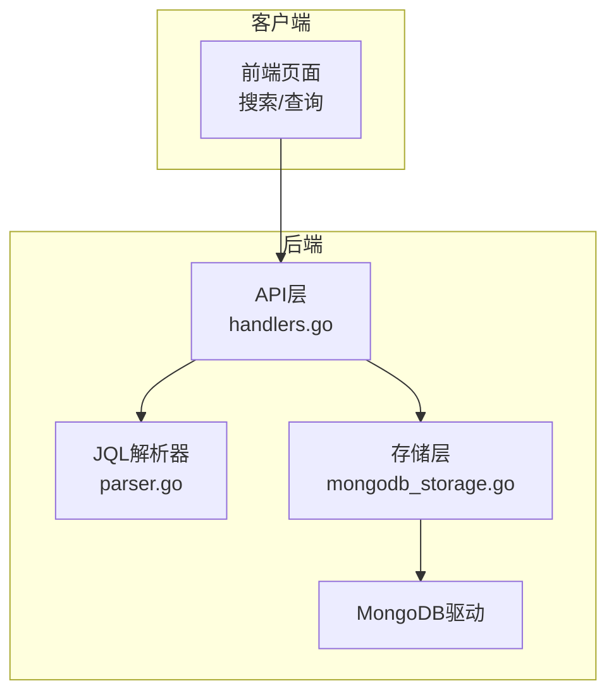
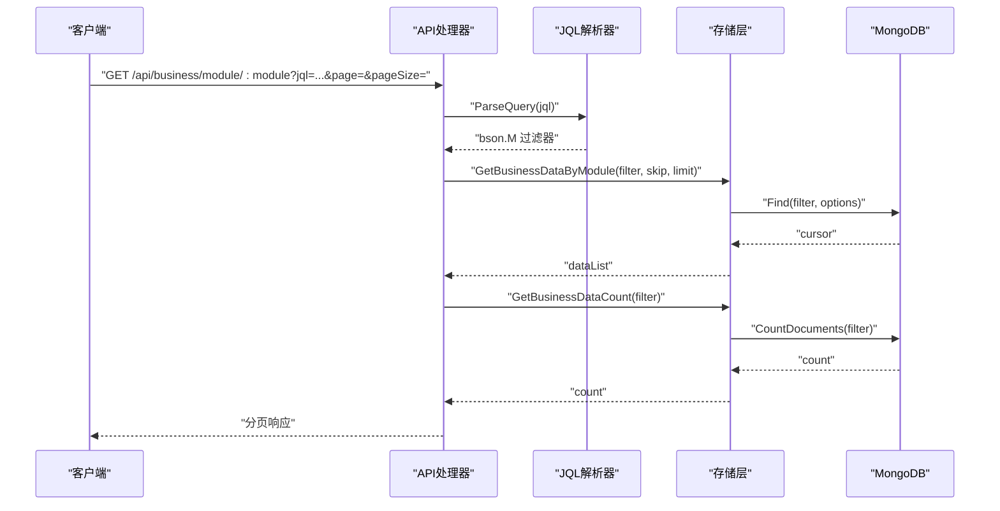
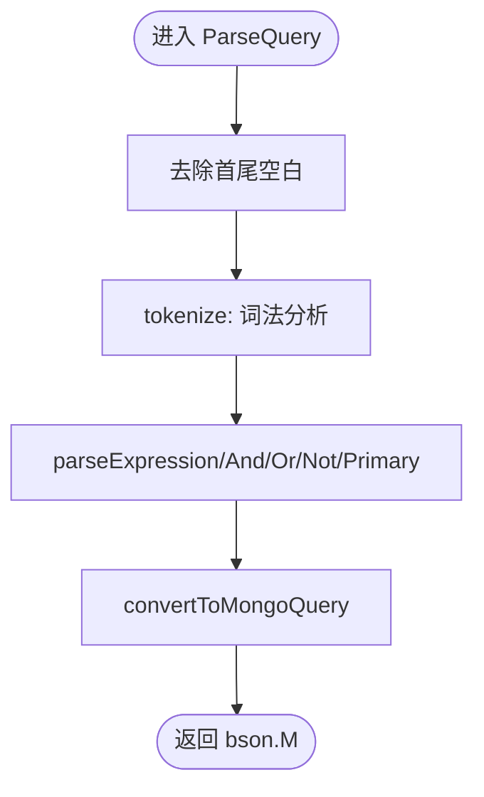
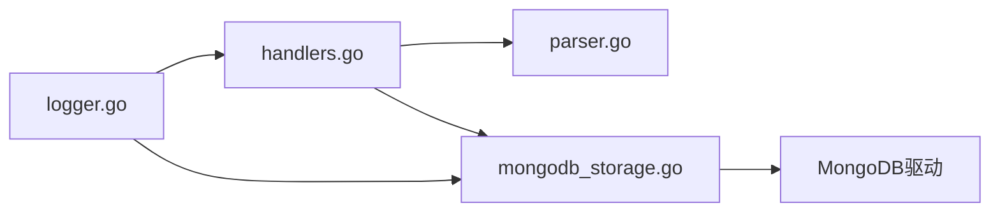

# 性能优化

<cite>
**本文引用的文件**
- [pkg/jql/parser.go](file://pkg/jql/parser.go)
- [pkg/jql/parser_test.go](file://pkg/jql/parser_test.go)
- [internal/storage/mongodb.go](file://internal/storage/mongodb.go)
- [internal/storage/mongodb_storage.go](file://internal/storage/mongodb_storage.go)
- [internal/api/handlers.go](file://internal/api/handlers.go)
- [cmd/server/main.go](file://cmd/server/main.go)
- [configs/config.yaml](file://configs/config.yaml)
- [docs/query.md](file://docs/query.md)
- [docs/architecture.md](file://docs/architecture.md)
- [internal/logger/logger.go](file://internal/logger/logger.go)
</cite>

## 目录
1. [简介](#简介)
2. [项目结构](#项目结构)
3. [核心组件](#核心组件)
4. [架构总览](#架构总览)
5. [详细组件分析](#详细组件分析)
6. [依赖分析](#依赖分析)
7. [性能考量](#性能考量)
8. [故障排查指南](#故障排查指南)
9. [结论](#结论)
10. [附录](#附录)

## 简介
本指南聚焦于JQL查询的性能优化，覆盖解析器性能优化（tokenize、AST构建、缓存）、MongoDB查询优化（索引设计、查询计划、投影优化）、大数据量查询策略（分页、游标、批量处理、内存管理）、查询缓存机制（结果、解析、计划缓存）、性能监控指标（执行时间、内存/CPU、数据库统计）、性能测试与基准测试方法、查询超时与资源限制、并发控制策略，以及常见性能问题的诊断与解决。

## 项目结构
- 后端采用Go + Gin + MongoDB，JQL解析器位于pkg/jql，业务查询通过API层调用存储层，存储层封装MongoDB访问。
- 查询入口主要在业务数据查询接口，支持JQL参数与分页参数；MongoDB存储层提供动态集合、索引管理与查询接口。

图表来源
- [internal/api/handlers.go:124-132](file://internal/api/handlers.go#L124-L132)
- [pkg/jql/parser.go:46-65](file://pkg/jql/parser.go#L46-L65)
- [internal/storage/mongodb_storage.go:366-395](file://internal/storage/mongodb_storage.go#L366-L395)

章节来源
- [docs/architecture.md:1-834](file://docs/architecture.md#L1-L834)
- [cmd/server/main.go:1-167](file://cmd/server/main.go#L1-L167)

## 核心组件
- JQL解析器：将JQL字符串解析为MongoDB过滤器，支持字段、运算符、函数、逻辑组合，并进行字段名前缀转换（业务数据自定义字段加custom_fields.前缀）。
- 存储层：封装MongoDB连接、动态集合、索引创建、查询与计数、游标管理等。
- API层：接收JQL查询参数，调用解析器与存储层，返回分页结果。
- 配置与日志：环境变量配置服务器、数据库、日志；日志系统提供HTTP请求耗时等可观测性。

章节来源
- [pkg/jql/parser.go:1-653](file://pkg/jql/parser.go#L1-L653)
- [internal/storage/mongodb.go:1-91](file://internal/storage/mongodb.go#L1-L91)
- [internal/storage/mongodb_storage.go:1-829](file://internal/storage/mongodb_storage.go#L1-L829)
- [internal/api/handlers.go:1-800](file://internal/api/handlers.go#L1-L800)
- [configs/config.yaml:1-26](file://configs/config.yaml#L1-L26)
- [internal/logger/logger.go:1-89](file://internal/logger/logger.go#L1-L89)

## 架构总览
JQL查询在API层被解析为MongoDB过滤器，随后通过存储层执行查询与计数，返回分页结果。系统支持动态集合与索引管理，便于针对不同模块与字段进行性能优化。

图表来源
- [internal/api/handlers.go:124-132](file://internal/api/handlers.go#L124-L132)
- [pkg/jql/parser.go:46-65](file://pkg/jql/parser.go#L46-L65)
- [internal/storage/mongodb_storage.go:366-395](file://internal/storage/mongodb_storage.go#L366-L395)

## 详细组件分析

### JQL解析器性能优化
- tokenize方法优化要点
  - 预处理：先做trim，减少无效字符扫描。
  - 词法识别：按序判断关键字、操作符、数值、字符串、函数名、字段名，避免重复扫描。
  - 字符串处理：使用单次扫描提取字符串字面量，避免多次切片。
  - 函数名识别：使用已知函数列表与前缀匹配，减少不必要的比较。
  - 大小写处理：统一转小写进行比较，减少分支判断。
- AST构建与内存管理
  - 递归下降解析，使用位置指针pos推进，避免复制tokens切片。
  - convertToMongoQuery递归转换，注意bson.M的浅拷贝与深拷贝边界，避免重复分配。
  - convertCondition根据运算符映射，尽量复用bson.M结构，减少临时对象。
- 解析器缓存机制
  - 当前实现未内置解析结果缓存；可在应用层引入LRU缓存，以“JQL字符串+模块”为键缓存bson.M过滤器，降低重复解析开销。
  - 注意：缓存键需包含模块信息，避免跨模块字段前缀差异导致误命中。

图表来源
- [pkg/jql/parser.go:46-65](file://pkg/jql/parser.go#L46-L65)
- [pkg/jql/parser.go:67-230](file://pkg/jql/parser.go#L67-L230)
- [pkg/jql/parser.go:268-421](file://pkg/jql/parser.go#L268-L421)
- [pkg/jql/parser.go:576-623](file://pkg/jql/parser.go#L576-L623)

章节来源
- [pkg/jql/parser.go:67-230](file://pkg/jql/parser.go#L67-L230)
- [pkg/jql/parser.go:268-421](file://pkg/jql/parser.go#L268-L421)
- [pkg/jql/parser.go:576-623](file://pkg/jql/parser.go#L576-L623)
- [pkg/jql/parser_test.go:1-873](file://pkg/jql/parser_test.go#L1-L873)

### MongoDB查询优化
- 索引设计建议
  - 为常用过滤字段建立单字段索引；为多条件组合建立复合索引。
  - 避免在索引字段上使用函数或表达式，否则无法命中索引。
  - 对排序字段建立索引，避免sort阶段的内存排序。
- 查询计划分析
  - 使用MongoDB Explain查看查询计划，确认索引使用情况、回表次数、扫描文档数。
  - 关注倒序索引与正序索引的使用，确保sort与filter方向一致。
- 复合索引使用
  - 将最常用的过滤字段放在前面，遵循“选择性高优先”的原则。
  - 考虑字段的等值过滤与范围过滤组合，合理设计复合索引顺序。
- 查询投影优化
  - 仅返回必要字段，避免返回整个文档，减少网络与内存压力。
  - 对热点查询使用投影字段白名单，减少custom_fields的传输。

章节来源
- [docs/query.md:140-158](file://docs/query.md#L140-L158)
- [docs/architecture.md:579-652](file://docs/architecture.md#L579-L652)
- [internal/storage/mongodb.go:35-36](file://internal/storage/mongodb.go#L35-L36)
- [internal/storage/mongodb_storage.go:366-395](file://internal/storage/mongodb_storage.go#L366-L395)

### 大数据量查询处理策略
- 分页查询
  - API层支持page/pageSize或skip/limit两种分页方式；优先使用page/pageSize，避免深层偏移。
  - 存储层使用options.Find().SetSkip(skip).SetLimit(limit).SetSort(...)，确保排序字段有索引。
- 游标使用
  - 存储层使用Find返回cursor，defer cursor.Close(context.Background())确保资源释放。
  - 使用cursor.All一次性读取，或逐条遍历，避免一次性加载过大结果集。
- 批量处理
  - 对于大批量导出或报表，建议异步任务+分批拉取，结合进度记录与断点续传。
- 内存管理
  - 控制pageSize上限，避免单页过大；对大字段（如custom_fields）谨慎返回。
  - 使用投影字段白名单，减少序列化与传输开销。

章节来源
- [internal/api/handlers.go:316-358](file://internal/api/handlers.go#L316-L358)
- [internal/storage/mongodb_storage.go:133-146](file://internal/storage/mongodb_storage.go#L133-L146)
- [internal/storage/mongodb_storage.go:366-395](file://internal/storage/mongodb_storage.go#L366-L395)

### 查询缓存机制
- 查询结果缓存
  - 对热点模块与稳定查询（如列表页）进行结果缓存，设置合理TTL与失效策略。
  - 缓存键建议包含：模块、JQL、排序、分页参数、权限上下文（如用户ID）。
- 解析结果缓存
  - 缓存JQL到bson.M的解析结果，避免重复解析；键包含模块与JQL字符串。
- 查询计划缓存
  - 在应用层记录查询计划（Explain结果摘要），用于性能回归检测与趋势分析。
- 注意事项
  - 缓存更新策略：写操作后主动失效相关缓存。
  - 缓存一致性：结合ETag或Last-Modified，避免脏读。

章节来源
- [docs/query.md:294-299](file://docs/query.md#L294-L299)
- [pkg/jql/parser.go:625-628](file://pkg/jql/parser.go#L625-L628)

### 性能监控指标
- 查询执行时间
  - 记录API请求耗时、JQL解析耗时、MongoDB查询耗时、游标读取耗时。
- 内存使用
  - 监控进程RSS、goroutines数量、GC频率与暂停时间。
- CPU占用
  - 监控CPU利用率、系统调用次数、解析器CPU占比。
- 数据库查询统计
  - 慢查询计数、索引命中率、回表次数、文档扫描数、聚合与排序次数。
- 日志与中间件
  - 使用LoggerMiddleware记录请求方法、路径、状态码、耗时、客户端IP等。

章节来源
- [internal/logger/logger.go:1-89](file://internal/logger/logger.go#L1-L89)
- [cmd/server/main.go:115-116](file://cmd/server/main.go#L115-L116)

### 性能测试与基准测试
- 单元测试
  - 使用parser_test.go覆盖基本运算符、IN/NOT IN、NULL/IS NULL、函数、嵌套字段等场景。
- 基准测试
  - 为tokenize、parseExpression、convertToMongoQuery分别编写Benchmark，对比不同JQL复杂度下的性能。
- E2E测试
  - 通过e2e.go模拟真实查询路径，测量端到端延迟与吞吐。
- 压力测试
  - 使用ab/wrk等工具对查询接口施压，观察响应时间、错误率、资源占用。

章节来源
- [pkg/jql/parser_test.go:1-873](file://pkg/jql/parser_test.go#L1-L873)
- [docs/query.md:294-299](file://docs/query.md#L294-L299)

### 查询超时、资源限制与并发控制
- 查询超时
  - API层设置ReadTimeout/WriteTimeout，避免长时间阻塞；MongoDB侧可设置查询超时选项。
- 资源限制
  - 限制pageSize上限、单次查询返回字段数、解析深度与条件数量。
- 并发控制
  - 使用连接池与限流，避免瞬时高并发导致数据库压力过大。
  - 对复杂查询采用异步队列，返回任务ID，客户端轮询结果。

章节来源
- [configs/config.yaml:24-25](file://configs/config.yaml#L24-L25)
- [cmd/server/main.go:121-126](file://cmd/server/main.go#L121-L126)
- [docs/query.md:128-133](file://docs/query.md#L128-L133)

## 依赖分析
- API层依赖JQL解析器与存储层；存储层依赖MongoDB驱动；日志系统贯穿各层。
- JQL解析器与存储层之间为纯数据传递，耦合度低，便于独立优化与替换。

图表来源
- [internal/api/handlers.go:1-800](file://internal/api/handlers.go#L1-L800)
- [pkg/jql/parser.go:1-653](file://pkg/jql/parser.go#L1-L653)
- [internal/storage/mongodb_storage.go:1-829](file://internal/storage/mongodb_storage.go#L1-L829)
- [internal/logger/logger.go:1-89](file://internal/logger/logger.go#L1-L89)

章节来源
- [internal/api/handlers.go:1-800](file://internal/api/handlers.go#L1-L800)
- [pkg/jql/parser.go:1-653](file://pkg/jql/parser.go#L1-L653)
- [internal/storage/mongodb_storage.go:1-829](file://internal/storage/mongodb_storage.go#L1-L829)
- [internal/logger/logger.go:1-89](file://internal/logger/logger.go#L1-L89)

## 性能考量
- 解析器层面
  - 词法分析尽量一次扫描完成；避免重复字符串比较；函数名匹配使用前缀判断。
  - AST构建避免深拷贝与冗余分配；convertToMongoQuery使用就地转换策略。
- 存储层层面
  - 使用索引字段进行过滤与排序；避免全表扫描；合理使用投影字段。
  - 游标使用后及时Close，避免连接泄漏；批量读取时控制内存峰值。
- API层层面
  - 强制分页与限制pageSize；对复杂查询采用异步处理；记录关键指标用于监控。

章节来源
- [pkg/jql/parser.go:67-230](file://pkg/jql/parser.go#L67-L230)
- [internal/storage/mongodb_storage.go:366-395](file://internal/storage/mongodb_storage.go#L366-L395)
- [docs/query.md:280-299](file://docs/query.md#L280-L299)

## 故障排查指南
- 解析错误
  - 检查JQL语法（括号闭合、引号闭合、运算符缺失）；使用ValidateJQL快速定位。
- 查询缓慢
  - 使用Explain分析查询计划；确认索引是否命中；检查排序字段是否建立索引。
- 内存飙升
  - 检查pageSize是否过大；确认是否返回了不必要的字段；监控游标是否正确关闭。
- 超时与拒绝
  - 检查服务器ReadTimeout/WriteTimeout配置；评估数据库连接池与并发限制。

章节来源
- [pkg/jql/parser_test.go:204-265](file://pkg/jql/parser_test.go#L204-L265)
- [configs/config.yaml:24-25](file://configs/config.yaml#L24-L25)
- [cmd/server/main.go:121-126](file://cmd/server/main.go#L121-L126)

## 结论
通过在解析器、存储层与API层的协同优化，结合索引设计、查询计划分析、分页与游标管理、缓存策略与监控指标，可以显著提升JQL查询性能与稳定性。建议在生产环境中引入解析结果缓存与查询计划缓存，并持续监控关键指标，定期进行基准测试与压力测试，确保系统在高负载下保持良好性能。

## 附录
- JQL语法与运算符映射详见架构文档与查询文档。
- 环境变量与服务器配置参考config.yaml与cmd/server/main.go。

章节来源
- [docs/architecture.md:579-652](file://docs/architecture.md#L579-L652)
- [docs/query.md:1-300](file://docs/query.md#L1-L300)
- [configs/config.yaml:1-26](file://configs/config.yaml#L1-L26)
- [cmd/server/main.go:1-167](file://cmd/server/main.go#L1-L167)