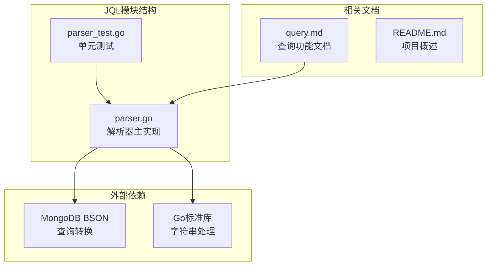
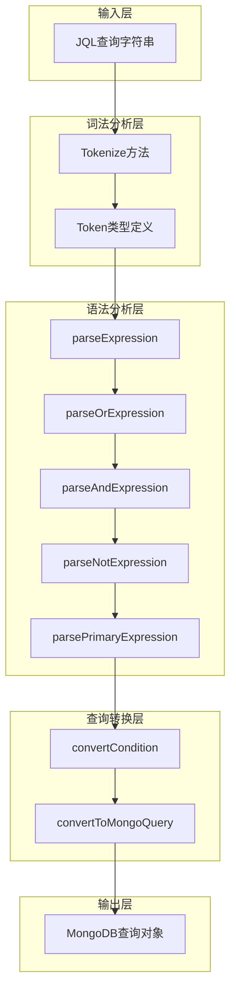
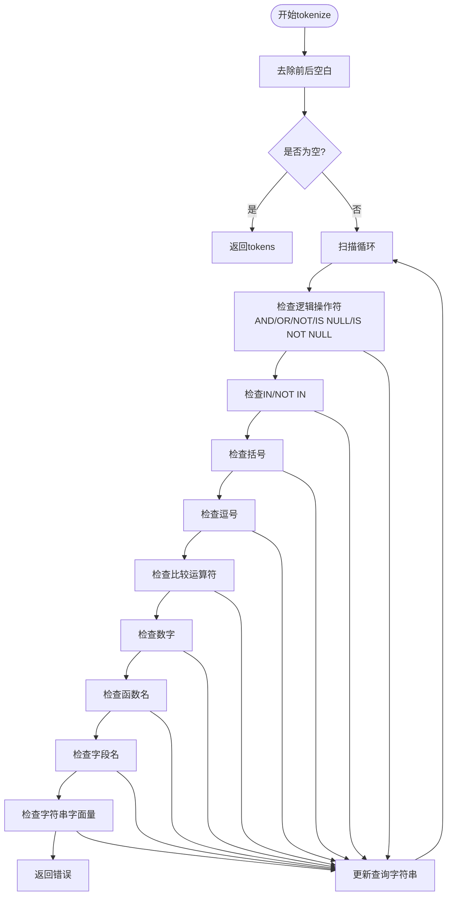
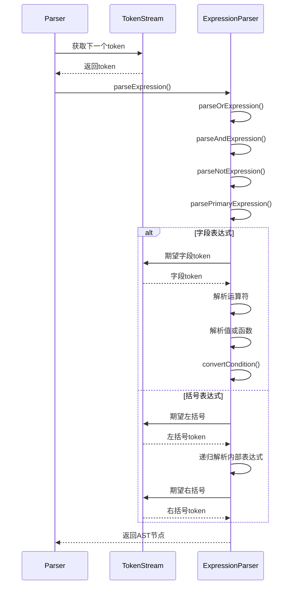
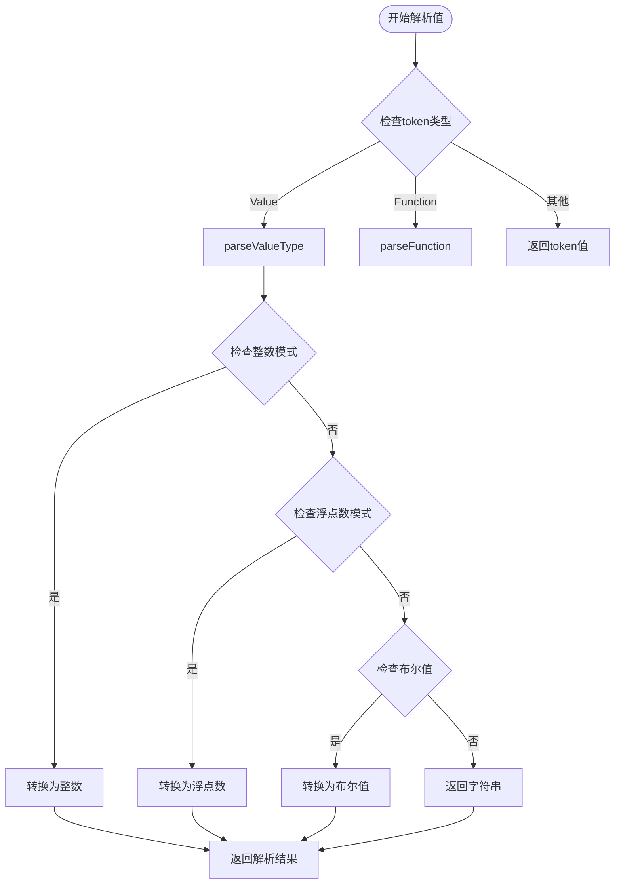
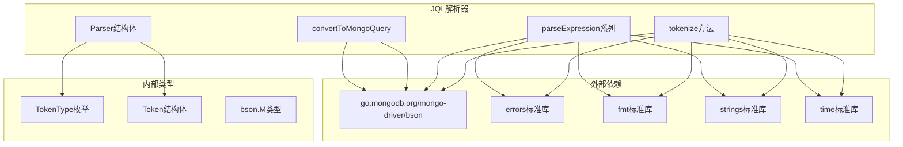

# 解析器实现

<cite>
**本文引用的文件**
- [parser.go](file://pkg/jql/parser.go)
- [parser_test.go](file://pkg/jql/parser_test.go)
- [query.md](file://docs/query.md)
- [README.md](file://README.md)
</cite>

## 目录
1. [简介](#简介)
2. [项目结构](#项目结构)
3. [核心组件](#核心组件)
4. [架构概览](#架构概览)
5. [详细组件分析](#详细组件分析)
6. [依赖关系分析](#依赖关系分析)
7. [性能考虑](#性能考虑)
8. [故障排除指南](#故障排除指南)
9. [结论](#结论)
10. [附录](#附录)

## 简介

JQL（JIRA Query Language）解析器是数据中心系统中的核心组件，负责将人类可读的查询语言转换为MongoDB可执行的查询条件。该解析器实现了完整的词法分析和语法分析功能，支持多种运算符、逻辑操作符、内置函数以及嵌套查询结构。

该项目采用Go语言实现，基于递归下降解析算法，提供了类型安全的查询解析能力和完善的错误处理机制。解析器能够将JQL查询转换为标准的MongoDB查询对象，为系统的业务数据查询功能提供基础支撑。

## 项目结构

JQL解析器位于`pkg/jql/`目录下，包含以下关键文件：



**图表来源**
- [parser.go:1-653](file://pkg/jql/parser.go#L1-L653)
- [parser_test.go:1-873](file://pkg/jql/parser_test.go#L1-L873)

**章节来源**
- [README.md:22-41](file://README.md#L22-L41)
- [parser.go:1-10](file://pkg/jql/parser.go#L1-L10)

## 核心组件

JQL解析器由三个主要组件构成：

### 1. 词法分析器（Tokenizer）
负责将输入的JQL字符串分解为token序列，识别各种语言元素如字段名、运算符、值、函数等。

### 2. 语法分析器（Parser）
实现递归下降解析算法，构建抽象语法树（AST），处理运算符优先级和括号嵌套。

### 3. 查询转换器
将解析得到的AST转换为MongoDB可执行的查询条件。

**章节来源**
- [parser.go:42-65](file://pkg/jql/parser.go#L42-L65)
- [parser.go:12-30](file://pkg/jql/parser.go#L12-L30)

## 架构概览

JQL解析器采用分层架构设计，各组件职责清晰分离：



**图表来源**
- [parser.go:67-230](file://pkg/jql/parser.go#L67-L230)
- [parser.go:268-421](file://pkg/jql/parser.go#L268-L421)
- [parser.go:538-623](file://pkg/jql/parser.go#L538-L623)

## 详细组件分析

### 词法分析器实现

词法分析器的核心是`tokenize`方法，它实现了状态机驱动的字符扫描逻辑：

#### Token类型系统

解析器支持以下token类型：

| Token类型 | 描述 | 示例 |
|-----------|------|------|
| field | 字段标识符 | `status`, `user.name` |
| operator | 比较运算符 | `=`, `!=`, `>`, `<`, `>=`, `<=`, `~` |
| value | 字面量值 | `"text"`, `123`, `3.14`, `true`, `false` |
| function | 内置函数 | `CurrentUser()`, `Now()`, `StartOfDay()` |
| left_paren/right_paren | 括号 | `(`, `)` |
| and/or/not | 逻辑操作符 | `AND`, `OR`, `NOT` |
| comma | 分隔符 | `,` |
| in/not_in | 集合操作符 | `IN`, `NOT IN` |
| is_null/is_not_null | 空值检查 | `IS NULL`, `IS NOT NULL` |

#### 词法分析算法



**图表来源**
- [parser.go:67-230](file://pkg/jql/parser.go#L67-L230)

**章节来源**
- [parser.go:14-30](file://pkg/jql/parser.go#L14-L30)
- [parser.go:67-230](file://pkg/jql/parser.go#L67-L230)

### 语法解析器实现

语法解析器采用递归下降解析算法，实现了完整的表达式语法：

#### 递归下降解析算法



**图表来源**
- [parser.go:268-421](file://pkg/jql/parser.go#L268-L421)

#### 表达式解析方法

每个解析方法都有明确的职责分工：

| 方法 | 作用 | 优先级 | 关键逻辑 |
|------|------|--------|----------|
| parseExpression | 顶层表达式入口 | 最低 | 调用parseOrExpression |
| parseOrExpression | OR逻辑运算 | 最低 | 处理连续OR操作 |
| parseAndExpression | AND逻辑运算 | 中等 | 处理连续AND操作 |
| parseNotExpression | NOT逻辑运算 | 高 | 单目NOT操作 |
| parsePrimaryExpression | 基础表达式 | 最高 | 字段、括号、函数 |

**章节来源**
- [parser.go:268-319](file://pkg/jql/parser.go#L268-L319)

### AST构建过程

解析器构建的AST采用嵌套的映射结构：

```mermaid
graph TB
subgraph "AST节点类型"
A[条件节点<br/>field: value/operator]
B[逻辑节点<br/>$and/$or/$not]
C[函数节点<br/>currentUser()/Now()]
D[值节点<br/>字符串/数字/布尔值]
end
subgraph "嵌套结构示例"
E[$or节点]
F[$and节点]
G[$not节点]
H[条件节点1]
I[条件节点2]
end
E --> H
E --> I
F --> H
F --> I
G --> H
```

**图表来源**
- [parser.go:272-306](file://pkg/jql/parser.go#L272-L306)
- [parser.go:308-319](file://pkg/jql/parser.go#L308-L319)

**章节来源**
- [parser.go:272-319](file://pkg/jql/parser.go#L272-L319)

### 值类型解析机制

解析器支持多种值类型的自动识别和转换：

#### 数值类型处理



**图表来源**
- [parser.go:423-463](file://pkg/jql/parser.go#L423-L463)

**章节来源**
- [parser.go:423-500](file://pkg/jql/parser.go#L423-L500)

### 内置函数支持

解析器内置了多种实用函数：

| 函数名 | 功能 | 返回值类型 | 示例 |
|--------|------|------------|------|
| CurrentUser() | 当前用户标识 | 字符串 | `"currentUser()"` |
| Now() | 当前时间 | time.Time | 当前时间戳 |
| StartOfDay() | 当天开始时间 | time.Time | 00:00:00 |
| EndOfDay() | 当天结束时间 | time.Time | 23:59:59.999999999 |
| StartOfWeek() | 本周开始时间 | time.Time | 周一00:00:00 |
| EndOfWeek() | 本周结束时间 | time.Time | 周日23:59:59.999999999 |
| StartOfMonth() | 本月开始时间 | time.Time | 1号00:00:00 |
| EndOfMonth() | 本月结束时间 | time.Time | 月末23:59:59.999999999 |

**章节来源**
- [parser.go:240-262](file://pkg/jql/parser.go#L240-L262)
- [parser.go:502-536](file://pkg/jql/parser.go#L502-L536)

## 依赖关系分析

解析器的依赖关系相对简单，主要依赖于MongoDB的BSON库：



**图表来源**
- [parser.go:3-10](file://pkg/jql/parser.go#L3-L10)

**章节来源**
- [parser.go:3-10](file://pkg/jql/parser.go#L3-L10)

## 性能考虑

### 时间复杂度分析

- **词法分析**：O(n)，其中n为输入字符串长度
- **语法分析**：O(n)，线性扫描token序列
- **查询转换**：O(n)，遍历AST结构
- **总体复杂度**：O(n)

### 空间复杂度分析

- **Token存储**：O(n)，存储所有识别的token
- **AST存储**：O(n)，存储解析树结构
- **递归深度**：O(d)，其中d为表达式嵌套深度

### 优化策略

1. **内存复用**：重用Parser实例进行多次解析
2. **延迟计算**：仅在需要时进行值类型转换
3. **早期失败**：在语法错误时立即返回，避免不必要的计算

## 故障排除指南

### 常见错误类型

| 错误类型 | 触发条件 | 错误信息 | 解决方案 |
|----------|----------|----------|----------|
| 语法错误 | 未知字符 | `unexpected character: X` | 检查输入字符是否合法 |
| 语法错误 | 缺少右括号 | `expected closing parenthesis` | 确保括号正确配对 |
| 语法错误 | 缺少运算符 | `expected operator` | 添加适当的运算符 |
| 语法错误 | 缺少值 | `expected value after operator` | 提供有效的值 |
| 语法错误 | 未闭合字符串 | `unclosed string` | 闭合引号 |
| 语法错误 | IN操作符缺少括号 | `expected ( after IN/NOT IN` | 添加括号包围值列表 |

### 调试技巧

1. **逐步验证**：使用`ValidateJQL`函数验证查询语法
2. **单元测试**：参考测试用例理解预期行为
3. **错误定位**：关注错误消息中的位置信息
4. **边界测试**：测试空查询、特殊字符、嵌套结构

**章节来源**
- [parser.go:322-421](file://pkg/jql/parser.go#L322-L421)
- [parser_test.go:204-265](file://pkg/jql/parser_test.go#L204-L265)

## 结论

JQL解析器实现了完整的查询语言处理功能，具有以下特点：

### 技术优势

1. **类型安全**：完整的类型系统确保解析结果的正确性
2. **扩展性强**：模块化设计便于添加新的运算符和函数
3. **错误处理完善**：详细的错误信息帮助快速定位问题
4. **性能优良**：线性时间复杂度适合大规模查询处理

### 应用价值

- 为业务数据查询提供直观的查询语言
- 支持复杂的嵌套查询和逻辑组合
- 与MongoDB无缝集成，提供高效的查询能力
- 通过内置函数增强查询表达力

### 发展方向

1. **性能优化**：考虑缓存常用查询模式
2. **功能扩展**：支持更多运算符和数据类型
3. **安全增强**：增加查询复杂度限制和访问控制
4. **文档完善**：提供更详细的使用示例和最佳实践

## 附录

### 使用示例

解析器提供了丰富的使用示例，包括基本查询、复杂查询、嵌套查询等场景：

**章节来源**
- [parser.go:630-647](file://pkg/jql/parser.go#L630-L647)
- [parser_test.go:389-403](file://pkg/jql/parser_test.go#L389-L403)

### API参考

| 函数 | 参数 | 返回值 | 描述 |
|------|------|--------|------|
| NewParser | 无 | *Parser | 创建新的解析器实例 |
| Parse | string | (bson.M, error) | 解析JQL查询并返回MongoDB查询对象 |
| ParseQuery | string | (bson.M, error) | 全局解析函数，便捷使用 |
| ValidateJQL | string | error | 验证查询语法的有效性 |
| GetExampleQueries | 无 | []string | 获取示例查询列表 |

**章节来源**
- [parser.go:42-65](file://pkg/jql/parser.go#L42-L65)
- [parser.go:625-652](file://pkg/jql/parser.go#L625-L652)