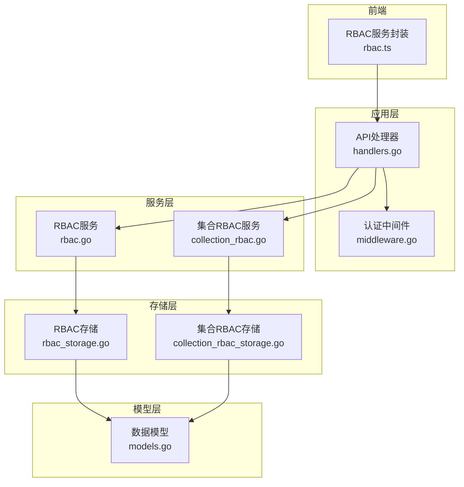
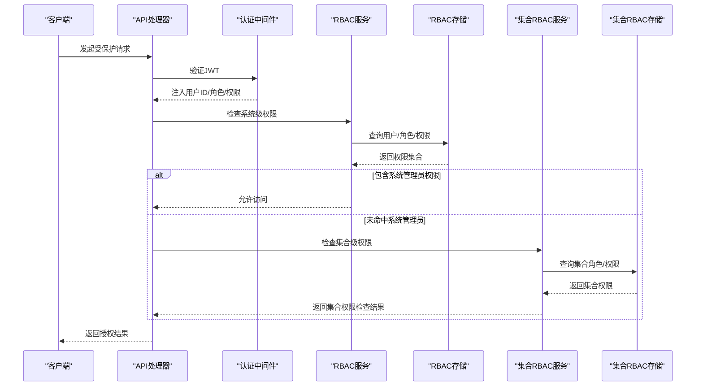
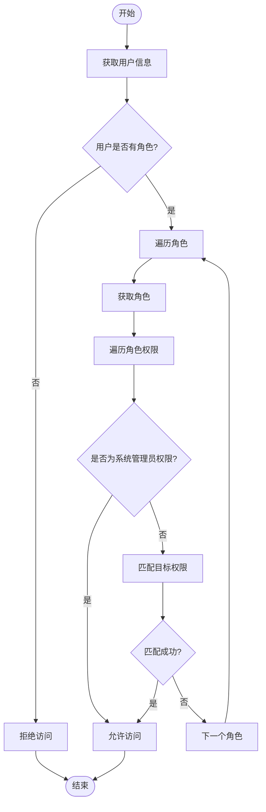
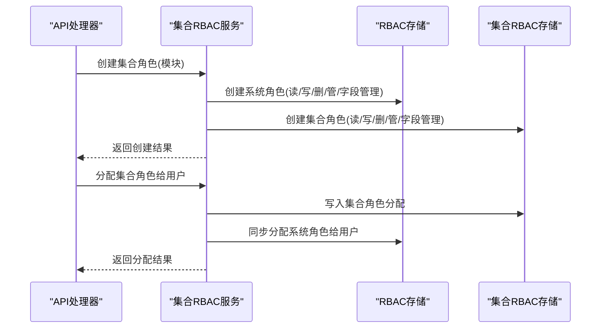
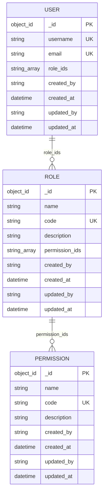
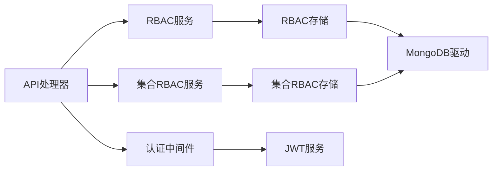

# RBAC权限管理系统

<cite>
**本文引用的文件**
- [rbac.go](file://pkg/rbac/rbac.go)
- [collection_rbac.go](file://pkg/rbac/collection_rbac.go)
- [rbac_storage.go](file://internal/storage/rbac_storage.go)
- [collection_rbac_storage.go](file://internal/storage/collection_rbac_storage.go)
- [models.go](file://internal/models/models.go)
- [handlers.go](file://internal/api/handlers.go)
- [middleware.go](file://internal/auth/middleware.go)
- [rbac.ts](file://frontend/src/services/rbac.ts)
- [implementation.md](file://docs/modules/rbac/implementation.md)
- [tech.md](file://docs/modules/rbac/tech.md)
- [api.md](file://docs/api.md)
- [rbac.md](file://docs/rbac.md)
- [config.yaml](file://configs/config.yaml)
- [main.go](file://cmd/server/main.go)
- [collection_roles_test.go](file://test/collection_roles_test.go)
</cite>

## 更新摘要
**变更内容**
- 新增RBAC权限模块的完整技术规格文档
- 更新系统级和集合级权限控制的详细实现说明
- 补充权限检查算法、通配符匹配和超级管理员机制
- 完善集合RBAC服务的权限分配、同步和审计功能
- 增加详细的API权限映射和中间件使用说明

## 目录
1. [简介](#简介)
2. [项目结构](#项目结构)
3. [核心组件](#核心组件)
4. [架构总览](#架构总览)
5. [详细组件分析](#详细组件分析)
6. [依赖关系分析](#依赖关系分析)
7. [性能考量](#性能考量)
8. [故障排查指南](#故障排查指南)
9. [结论](#结论)
10. [附录](#附录)

## 简介
本项目是一个基于双层权限模型的RBAC权限管理系统，结合系统级权限与集合级权限，实现细粒度的资源访问控制。系统采用MongoDB作为存储引擎，通过嵌入式数组管理多对多关系，并提供完善的权限继承、权限检查、审计日志与API接口，覆盖用户管理、角色管理、权限管理以及集合级角色与权限的分配与校验。

**更新** 新增完整的RBAC模块技术文档，详细说明系统级和集合级权限控制的实现规格。

## 项目结构
系统采用分层架构：
- 应用层：HTTP路由与控制器，负责请求解析、鉴权与响应封装
- 服务层：RBAC服务与集合RBAC服务，负责权限计算、集合权限匹配与审计日志
- 存储层：RBAC存储与集合RBAC存储，负责MongoDB读写与索引管理
- 模型层：统一的数据模型定义，确保前后端与存储层的一致性
- 前端层：RBAC相关的管理界面与服务封装

**图表来源**
- [handlers.go:45-181](file://internal/api/handlers.go#L45-L181)
- [middleware.go:11-49](file://internal/auth/middleware.go#L11-L49)
- [rbac.go:55-250](file://pkg/rbac/rbac.go#L55-L250)
- [collection_rbac.go:27-294](file://pkg/rbac/collection_rbac.go#L27-L294)
- [rbac_storage.go:16-476](file://internal/storage/rbac_storage.go#L16-L476)
- [collection_rbac_storage.go:15-244](file://internal/storage/collection_rbac_storage.go#L15-L244)
- [models.go:247-365](file://internal/models/models.go#L247-L365)
- [rbac.ts:1-196](file://frontend/src/services/rbac.ts#L1-L196)

**章节来源**
- [main.go:24-150](file://cmd/server/main.go#L24-L150)
- [config.yaml:1-26](file://configs/config.yaml#L1-L26)

## 核心组件
- RBAC服务：负责系统级权限的检查、继承与匹配，支持通配符匹配与"系统管理员"超级权限豁免
- 集合RBAC服务：负责集合级权限的检查与集合角色的创建、分配与同步
- RBAC存储：提供用户、角色、权限的CRUD与多对多关系的数组操作
- 集合RBAC存储：提供集合角色、集合角色分配与审计日志的CRUD
- API处理器：注册路由、注入中间件、封装响应
- 认证中间件：解析JWT、注入用户上下文
- 数据模型：统一的用户、角色、权限、集合角色、审计日志等模型

**章节来源**
- [rbac.go:55-250](file://pkg/rbac/rbac.go#L55-L250)
- [collection_rbac.go:27-294](file://pkg/rbac/collection_rbac.go#L27-L294)
- [rbac_storage.go:16-476](file://internal/storage/rbac_storage.go#L16-L476)
- [collection_rbac_storage.go:15-244](file://internal/storage/collection_rbac_storage.go#L15-L244)
- [models.go:247-365](file://internal/models/models.go#L247-L365)
- [handlers.go:45-181](file://internal/api/handlers.go#L45-L181)
- [middleware.go:11-49](file://internal/auth/middleware.go#L11-L49)

## 架构总览
系统采用"系统级RBAC + 集合级RBAC"的双层模型：
- 系统级RBAC：用户-角色-权限的多对多继承，支持通配符权限匹配
- 集合级RBAC：针对具体集合模块的角色与权限，支持模块前缀的权限匹配与集合角色分配

**图表来源**
- [handlers.go:260-314](file://internal/api/handlers.go#L260-L314)
- [rbac.go:63-99](file://pkg/rbac/rbac.go#L63-L99)
- [collection_rbac.go:39-90](file://pkg/rbac/collection_rbac.go#L39-L90)

## 详细组件分析

### RBAC服务（系统级）
- 权限检查：遍历用户所有角色，合并权限，支持精确匹配与通配符前缀匹配；若任一角色拥有"系统管理员"权限则直接放行
- 权限聚合：将用户所有角色的权限去重后返回
- API权限映射：根据HTTP方法与路径推导出对应的系统级权限代码

**更新** 完善了权限检查算法的实现细节，包括通配符匹配的具体逻辑和超级管理员的处理机制。

**图表来源**
- [rbac.go:63-99](file://pkg/rbac/rbac.go#L63-L99)
- [rbac.go:101-114](file://pkg/rbac/rbac.go#L101-L114)

**章节来源**
- [rbac.go:55-250](file://pkg/rbac/rbac.go#L55-L250)

### 集合RBAC服务（集合级）
- 集合权限检查：优先检查系统级权限，其次检查集合角色的权限匹配；支持模块前缀的权限代码匹配
- 集合角色创建：为指定模块创建"拥有者/操作员/游客"三类角色，并建立系统角色与集合角色的映射
- 角色分配与同步：将集合角色分配给用户时，同步为用户分配对应的系统角色

**更新** 新增了集合RBAC服务的详细实现，包括权限检查算法、角色创建模板和同步机制。

**图表来源**
- [collection_rbac.go:92-194](file://pkg/rbac/collection_rbac.go#L92-L194)
- [collection_rbac.go:217-239](file://pkg/rbac/collection_rbac.go#L217-L239)

**章节来源**
- [collection_rbac.go:27-294](file://pkg/rbac/collection_rbac.go#L27-L294)

### RBAC存储（MongoDB）
- 用户/角色/权限的CRUD与计数
- 多对多关系的数组操作：$addToSet/$pull保证关系唯一性与原子性
- 初始化默认数据：创建"系统管理员"权限与"超级管理员"角色

**更新** 完善了存储层的实现细节，包括默认数据初始化和各种CRUD操作的具体实现。

**图表来源**
- [rbac_storage.go:16-476](file://internal/storage/rbac_storage.go#L16-L476)
- [models.go:247-271](file://internal/models/models.go#L247-L271)

**章节来源**
- [rbac_storage.go:16-476](file://internal/storage/rbac_storage.go#L16-L476)

### 集合RBAC存储（MongoDB）
- 集合角色与集合角色分配的CRUD
- 审计日志的创建与查询（按用户/资源过滤）

**更新** 新增了集合RBAC存储的详细实现，包括集合角色、角色分配和审计日志的完整CRUD操作。

**章节来源**
- [collection_rbac_storage.go:15-244](file://internal/storage/collection_rbac_storage.go#L15-L244)

### API处理器与中间件
- 路由注册：按模块分组，注入认证与权限中间件
- 权限中间件：基于RBAC服务进行权限检查
- 认证中间件：解析JWT，注入用户上下文

**更新** 完善了API处理器的路由注册逻辑，包括系统级和集合级权限的中间件使用方式。

**章节来源**
- [handlers.go:45-181](file://internal/api/handlers.go#L45-L181)
- [handlers.go:260-314](file://internal/api/handlers.go#L260-L314)
- [middleware.go:11-49](file://internal/auth/middleware.go#L11-L49)

### 前端RBAC服务封装
- 角色与权限的CRUD封装
- 分页参数转换与字段映射

**章节来源**
- [rbac.ts:18-135](file://frontend/src/services/rbac.ts#L18-L135)

## 依赖关系分析
- 组件耦合
  - API处理器依赖RBAC服务与集合RBAC服务，以实现双层权限校验
  - RBAC服务依赖RBAC存储，集合RBAC服务依赖集合RBAC存储
  - 认证中间件依赖JWT服务，向API处理器注入用户上下文
- 外部依赖
  - MongoDB驱动：用于读写权限相关集合
  - Gin框架：用于HTTP路由与中间件
  - JWT库：用于令牌生成与验证

**图表来源**
- [handlers.go:33-43](file://internal/api/handlers.go#L33-L43)
- [rbac.go:55-61](file://pkg/rbac/rbac.go#L55-L61)
- [collection_rbac.go:32-37](file://pkg/rbac/collection_rbac.go#L32-L37)
- [rbac_storage.go:60-79](file://internal/storage/rbac_storage.go#L60-L79)
- [collection_rbac_storage.go:43-62](file://internal/storage/collection_rbac_storage.go#L43-L62)

**章节来源**
- [handlers.go:33-43](file://internal/api/handlers.go#L33-L43)
- [rbac_storage.go:60-79](file://internal/storage/rbac_storage.go#L60-L79)
- [collection_rbac_storage.go:43-62](file://internal/storage/collection_rbac_storage.go#L43-L62)

## 性能考量
- 查询复杂度
  - 系统级权限检查：O(R×P)，其中R为用户角色数，P为角色权限数
  - 集合级权限检查：O(R')，其中R'为集合角色数
- 索引策略
  - users.role_ids：加速查询某角色的所有用户
  - users.username/email：唯一索引，加速登录与去重
  - roles.permission_ids：加速查询某权限的所有角色
  - roles.code、permissions.code：唯一索引，加速查找
- 缓存建议
  - 可在应用层缓存用户权限集合，减少重复查询
  - 对热点角色/权限可做本地缓存，降低MongoDB压力
- 批量操作
  - 使用$addToSet/$pull进行原子性关系维护，避免多次往返

**更新** 新增了集合RBAC存储的索引策略和性能优化建议。

**章节来源**
- [rbac.md:192-204](file://docs/rbac.md#L192-L204)
- [rbac_storage.go:379-408](file://internal/storage/rbac_storage.go#L379-L408)
- [rbac_storage.go:428-457](file://internal/storage/rbac_storage.go#L428-L457)

## 故障排查指南
- 常见错误
  - 401 未授权：缺少Authorization头或Bearer Token无效
  - 403 权限不足：用户不具备所需权限
  - 404 资源不存在：用户/角色/权限不存在
  - 400 业务错误：角色/权限已分配、未分配等
- 审计与追踪
  - 集合RBAC存储提供审计日志的创建与查询接口，可用于追踪权限变更
- 调试建议
  - 开启日志中间件，查看请求链路
  - 在API处理器中打印用户ID、角色与权限，定位权限问题
  - 使用集合RBAC服务的日志接口记录关键操作

**更新** 完善了故障排查指南，增加了集合RBAC相关的调试建议。

**章节来源**
- [rbac.md:467-482](file://docs/rbac.md#L467-L482)
- [collection_rbac_storage.go:209-243](file://internal/storage/collection_rbac_storage.go#L209-L243)
- [handlers.go:260-314](file://internal/api/handlers.go#L260-L314)

## 结论
本系统通过双层RBAC模型实现了灵活且可扩展的权限控制：系统级RBAC负责全局资源的细粒度控制，集合级RBAC负责模块化的资源访问。配合嵌入式数组的多对多关系与MongoDB的原子数组操作，系统在保证一致性的同时具备良好的性能与可维护性。完善的API接口与审计机制为运维与合规提供了坚实基础。

**更新** 新增了对RBAC模块完整技术规格的理解，包括权限检查算法、通配符匹配和超级管理员机制的详细实现。

## 附录

### 权限模型与API规范
- 系统级权限
  - 用户管理：user:read、user:write、user:manage
  - 角色管理：role:read、role:write、role:manage
  - 权限管理：permission:read、permission:write、permission:manage
  - 集合管理：collection:read、collection:write、collection:manage
  - 字段管理：field:read、field:write、field:manage
  - 业务数据：data:read、data:write、data:manage
  - 刮削任务：scrape:read、scrape:write、scrape:manage
  - 系统管理员：system:admin
- 集合级权限
  - :read、:write、:delete、:admin、:field:admin
- API接口（节选）
  - 用户：GET/POST/PUT/DELETE /api/users
  - 角色：GET/POST/PUT/DELETE /api/roles
  - 权限：GET/POST/PUT/DELETE /api/permissions
  - 集合：GET/POST/PUT/DELETE /api/collections
  - 字段：GET/POST/PUT/DELETE /api/fields
  - 刮削：GET/POST/PUT/DELETE /api/scraper
  - 已删除：GET/POST /api/deleted

**更新** 完善了权限模型的详细分类，包括系统级和集合级权限的具体代码和用途。

**章节来源**
- [rbac.go:12-53](file://pkg/rbac/rbac.go#L12-L53)
- [rbac.go:173-249](file://pkg/rbac/rbac.go#L173-L249)
- [api.md:15-800](file://docs/api.md#L15-L800)

### 权限检查算法与缓存策略
- 权限检查算法
  - 系统级：遍历用户角色，合并权限，支持通配符前缀匹配
  - 集合级：优先系统级匹配，否则匹配集合角色权限
- 缓存策略
  - 用户权限缓存：在认证中间件中获取并注入，减少重复查询
  - 角色/权限缓存：对热点数据做本地缓存，降低数据库压力

**更新** 新增了详细的权限检查算法说明，包括通配符匹配的具体实现和超级管理员的处理逻辑。

**章节来源**
- [rbac.go:63-99](file://pkg/rbac/rbac.go#L63-L99)
- [rbac.go:101-114](file://pkg/rbac/rbac.go#L101-L114)
- [handlers.go:286-289](file://internal/api/handlers.go#L286-L289)

### 权限配置示例与常见场景
- 示例：为模块"movie"创建集合角色
  - 创建owner/operator/tourist三类角色，分别映射到系统角色与集合角色
  - 分配集合角色给用户时，同步分配系统角色
- 场景：字段管理权限
  - 仅拥有":field:admin"权限的用户可创建/更新字段定义
- 场景：批量权限检查
  - 使用HasAnyPermission/HasAllPermissions判断用户是否满足任一或全部权限

**更新** 完善了集合RBAC的权限配置示例，包括角色创建模板和权限分配流程。

**章节来源**
- [collection_rbac.go:92-194](file://pkg/rbac/collection_rbac.go#L92-L194)
- [collection_rbac.go:217-239](file://pkg/rbac/collection_rbac.go#L217-L239)
- [rbac.go:147-171](file://pkg/rbac/rbac.go#L147-L171)

### 审计机制与安全考虑
- 审计日志
  - 记录用户操作、资源、IP地址、User-Agent等
  - 支持按用户/资源过滤查询
- 安全考虑
  - JWT令牌有效期与刷新策略
  - 密码加密存储
  - 权限最小化原则与职责分离

**更新** 新增了集合RBAC的审计机制说明，包括审计日志的创建和查询接口。

**章节来源**
- [collection_rbac.go:280-293](file://pkg/rbac/collection_rbac.go#L280-L293)
- [collection_rbac_storage.go:209-243](file://internal/storage/collection_rbac_storage.go#L209-L243)
- [config.yaml:6-10](file://configs/config.yaml#L6-L10)

### RBAC模块技术规格
- 模块概述
  - RBAC (Role-Based Access Control) 模块实现系统级权限管理，采用经典的 User-Role-Permission 三层多对多模型
  - 支持通配符权限匹配和超级管理员机制
- 数据模型
  - User (users)：用户名、密码、邮箱、角色ID数组
  - Role (roles)：角色名称、代码、描述、权限ID数组
  - Permission (permissions)：权限名称、代码、描述
- Service接口
  - CheckPermission：检查用户是否拥有某权限
  - GetUserPermissions：获取用户全部权限code
  - HasAnyPermission/HasAllPermissions：批量权限检查
  - GetAPIPermission：根据HTTP方法+路径推断所需权限

**更新** 新增了完整的RBAC模块技术规格文档，包括数据模型、Service接口和权限检查算法的详细说明。

**章节来源**
- [tech.md:1-259](file://docs/modules/rbac/tech.md#L1-L259)

### RBAC实现细节
- 权限检查核心实现
  - CheckPermission：遍历用户角色，检查超级管理员权限，执行通配符匹配
  - matchPermission：实现精确匹配和通配符匹配算法
  - GetUserPermissions：聚合用户所有权限并去重
- 中间件实现
  - PermissionMiddleware：统一的权限检查中间件
  - 路由注册中的权限绑定：支持组级和单个路由的权限设置
- 存储层实现
  - MongoDB连接：独立的rbac数据库实例
  - 默认数据初始化：创建系统默认权限和超级管理员角色
  - 数据库索引：为常用查询字段建立索引

**更新** 新增了RBAC模块的详细实现文档，包括核心算法、中间件使用和存储层配置的具体实现。

**章节来源**
- [implementation.md:1-353](file://docs/modules/rbac/implementation.md#L1-L353)