# 权限存储实现

<cite>
**本文档引用的文件**
- [rbac_storage.go](file://internal/storage/rbac_storage.go)
- [mongodb_storage.go](file://internal/storage/mongodb_storage.go)
- [collection_rbac_storage.go](file://internal/storage/collection_rbac_storage.go)
- [rbac.go](file://pkg/rbac/rbac.go)
- [collection_rbac.go](file://pkg/rbac/collection_rbac.go)
- [models.go](file://internal/models/models.go)
- [main.go](file://cmd/server/main.go)
- [handlers.go](file://internal/api/handlers.go)
- [collection_permission_middleware.go](file://internal/api/collection_permission_middleware.go)
- [mongodb.go](file://internal/storage/mongodb.go)
- [config.yaml](file://configs/config.yaml)
</cite>

## 目录
1. [简介](#简介)
2. [项目结构](#项目结构)
3. [核心组件](#核心组件)
4. [架构概览](#架构概览)
5. [详细组件分析](#详细组件分析)
6. [依赖关系分析](#依赖关系分析)
7. [性能考虑](#性能考虑)
8. [故障排除指南](#故障排除指南)
9. [结论](#结论)

## 简介

本项目是一个基于MongoDB的权限存储系统，实现了完整的RBAC（基于角色的访问控制）模型。系统支持用户、角色、权限的完整生命周期管理，同时提供了集合级别的细粒度权限控制。该系统采用分层架构设计，将权限存储与业务数据存储分离，通过接口抽象实现了良好的可扩展性。

## 项目结构

项目采用Go语言的标准目录结构，主要分为以下几个层次：

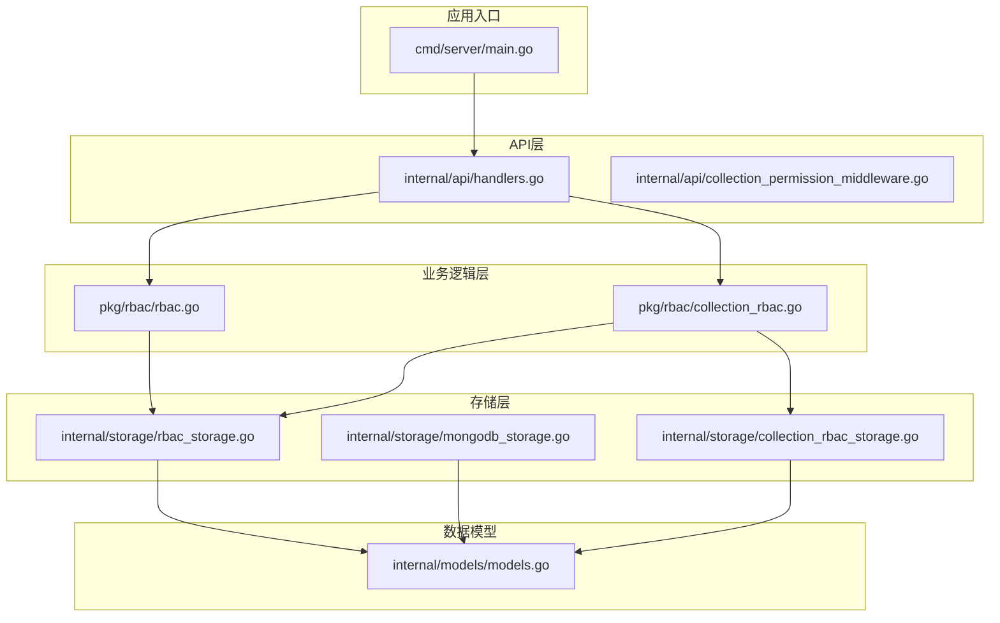

**图表来源**
- [main.go:24-167](file://cmd/server/main.go#L24-L167)
- [handlers.go:23-43](file://internal/api/handlers.go#L23-L43)

**章节来源**
- [main.go:24-167](file://cmd/server/main.go#L24-L167)
- [config.yaml:1-26](file://configs/config.yaml#L1-L26)

## 核心组件

### 权限存储接口设计

系统定义了两个核心存储接口，分别处理不同的权限存储需求：

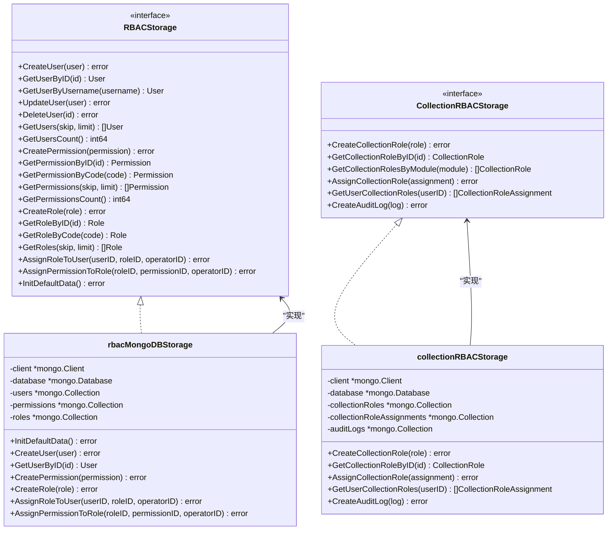

**图表来源**
- [rbac_storage.go:16-50](file://internal/storage/rbac_storage.go#L16-L50)
- [collection_rbac_storage.go:15-33](file://internal/storage/collection_rbac_storage.go#L15-L33)
- [rbac_storage.go:52-79](file://internal/storage/rbac_storage.go#L52-L79)
- [collection_rbac_storage.go:35-61](file://internal/storage/collection_rbac_storage.go#L35-L61)

### 数据模型设计

系统使用统一的BaseModel结构来管理所有实体的元数据：

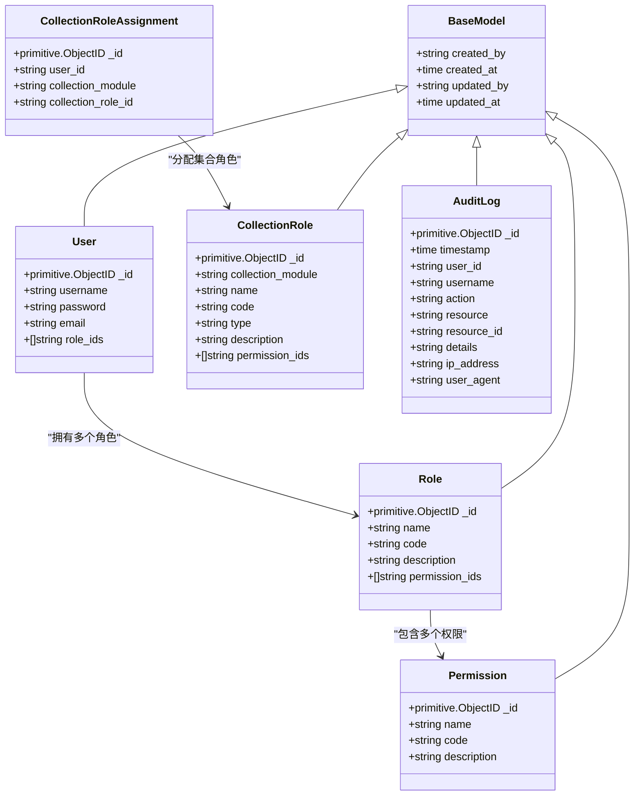

**图表来源**
- [models.go:12-17](file://internal/models/models.go#L12-L17)
- [models.go:247-254](file://internal/models/models.go#L247-L254)
- [models.go:256-262](file://internal/models/models.go#L256-L262)
- [models.go:264-271](file://internal/models/models.go#L264-L271)
- [models.go:328-340](file://internal/models/models.go#L328-L340)
- [models.go:342-351](file://internal/models/models.go#L342-L351)
- [models.go:353-364](file://internal/models/models.go#L353-L364)

**章节来源**
- [rbac_storage.go:16-50](file://internal/storage/rbac_storage.go#L16-L50)
- [collection_rbac_storage.go:15-33](file://internal/storage/collection_rbac_storage.go#L15-L33)
- [models.go:12-364](file://internal/models/models.go#L12-L364)

## 架构概览

系统采用分层架构设计，实现了权限存储与业务数据存储的分离：

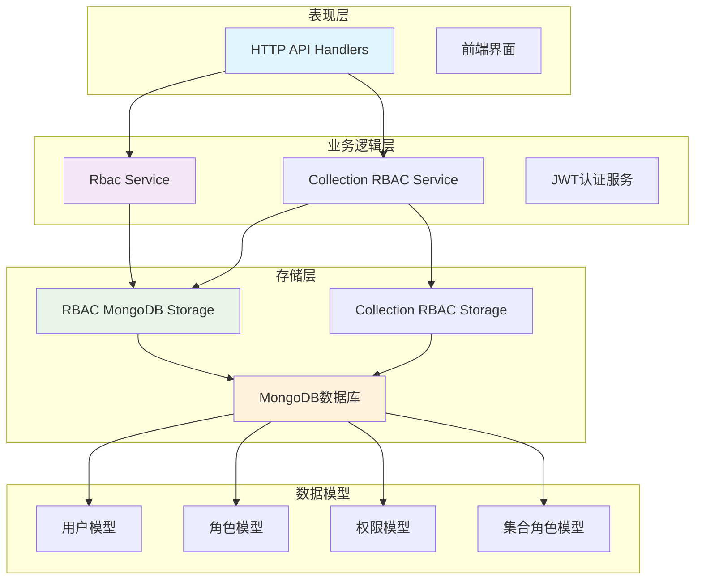

**图表来源**
- [main.go:79-92](file://cmd/server/main.go#L79-L92)
- [handlers.go:23-42](file://internal/api/handlers.go#L23-L42)
- [rbac.go:55-61](file://pkg/rbac/rbac.go#L55-L61)
- [collection_rbac.go:27-36](file://pkg/rbac/collection_rbac.go#L27-L36)

系统的核心特点包括：

1. **双存储分离**：RBAC数据和业务数据存储在不同的数据库中，提高了系统的可维护性和安全性
2. **接口抽象**：通过接口定义存储契约，便于替换和扩展存储实现
3. **中间件集成**：权限检查通过Gin中间件集成，实现了横切关注点的统一处理
4. **审计日志**：完整的操作审计功能，支持权限变更和业务操作的追踪

**章节来源**
- [main.go:42-92](file://cmd/server/main.go#L42-L92)
- [handlers.go:45-181](file://internal/api/handlers.go#L45-L181)

## 详细组件分析

### RBAC存储实现

RBAC存储实现了完整的权限管理功能，包括用户、角色、权限的CRUD操作：

#### 用户管理

用户管理提供了完整的用户生命周期管理功能：

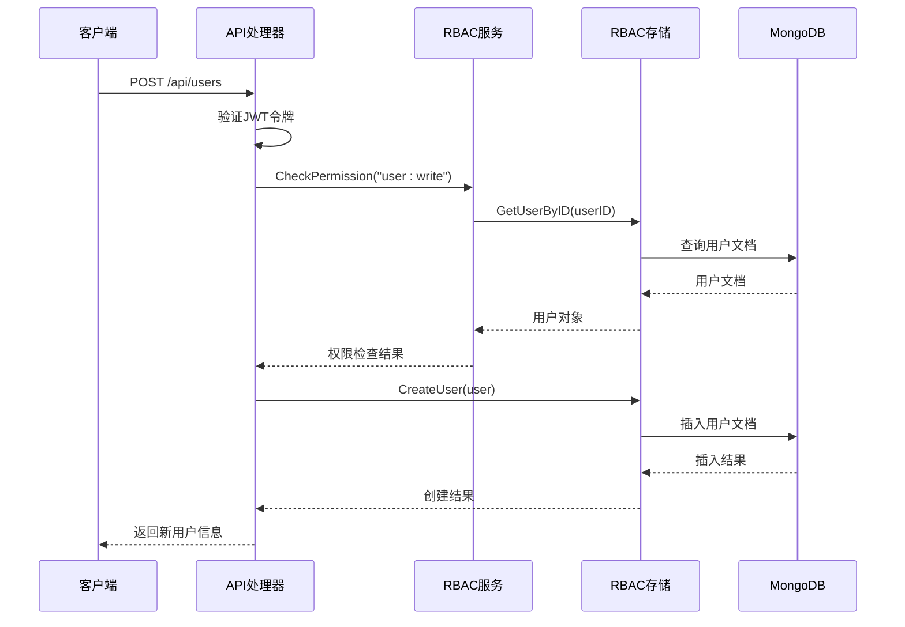

**图表来源**
- [handlers.go:371-404](file://internal/api/handlers.go#L371-L404)
- [rbac_storage.go:166-175](file://internal/storage/rbac_storage.go#L166-L175)

#### 角色管理

角色管理支持多对多的关系映射，通过数组字段实现灵活的权限分配：

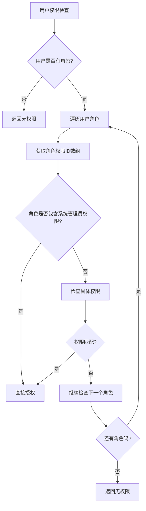

**图表来源**
- [rbac.go:63-99](file://pkg/rbac/rbac.go#L63-L99)

#### 权限管理

权限管理支持精确匹配和通配符匹配两种模式：

**章节来源**
- [rbac_storage.go:166-476](file://internal/storage/rbac_storage.go#L166-L476)
- [rbac.go:63-171](file://pkg/rbac/rbac.go#L63-L171)

### 集合RBAC存储实现

集合RBAC提供了针对特定业务集合的细粒度权限控制：

#### 集合角色管理

集合角色管理支持三种标准角色类型：

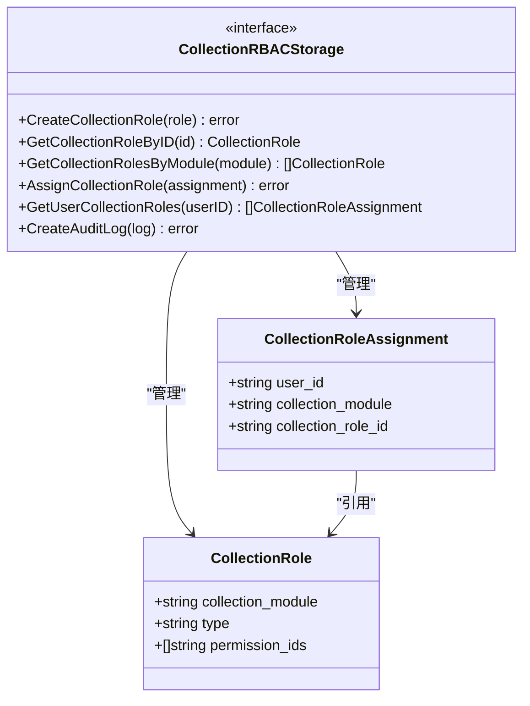

**图表来源**
- [collection_rbac_storage.go:15-33](file://internal/storage/collection_rbac_storage.go#L15-L33)
- [models.go:328-351](file://internal/models/models.go#L328-L351)

#### 角色类型定义

系统定义了三种标准的集合角色类型：

| 角色类型 | 角色代码 | 权限范围 | 描述 |
|---------|---------|---------|------|
| Owner | `{module}Owner` | `:admin`, `:read`, `:write`, `:delete`, `:field:admin` | 集合管理员，拥有最高权限 |
| Operator | `{module}Operator` | `:read`, `:write`, `:delete` | 数据操作员，可进行数据增删改查 |
| Tourist | `{module}Tourist` | `:read` | 普通用户，仅可读取数据 |

**章节来源**
- [collection_rbac_storage.go:15-33](file://internal/storage/collection_rbac_storage.go#L15-L33)
- [collection_rbac.go:129-151](file://pkg/rbac/collection_rbac.go#L129-L151)

### 权限检查服务

权限检查服务提供了统一的权限验证接口：

#### API权限映射

系统根据HTTP方法和路径自动映射到相应的权限：

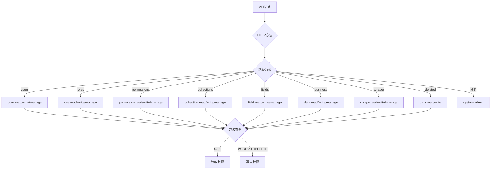

**图表来源**
- [rbac.go:173-249](file://pkg/rbac/rbac.go#L173-L249)

**章节来源**
- [rbac.go:55-249](file://pkg/rbac/rbac.go#L55-L249)

## 依赖关系分析

系统采用清晰的依赖层次结构，实现了良好的关注点分离：

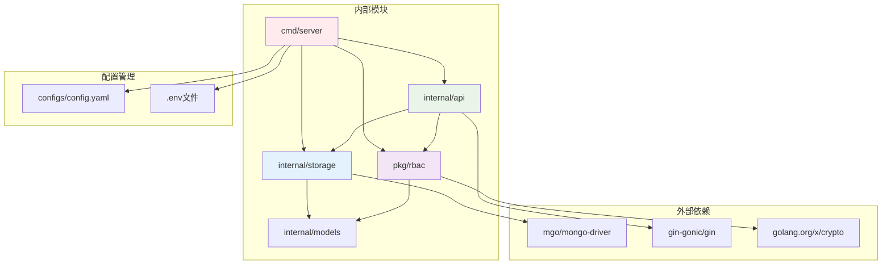

**图表来源**
- [main.go:3-22](file://cmd/server/main.go#L3-L22)
- [handlers.go:3-21](file://internal/api/handlers.go#L3-L21)

### 数据流分析

系统中的数据流向体现了清晰的职责分工：

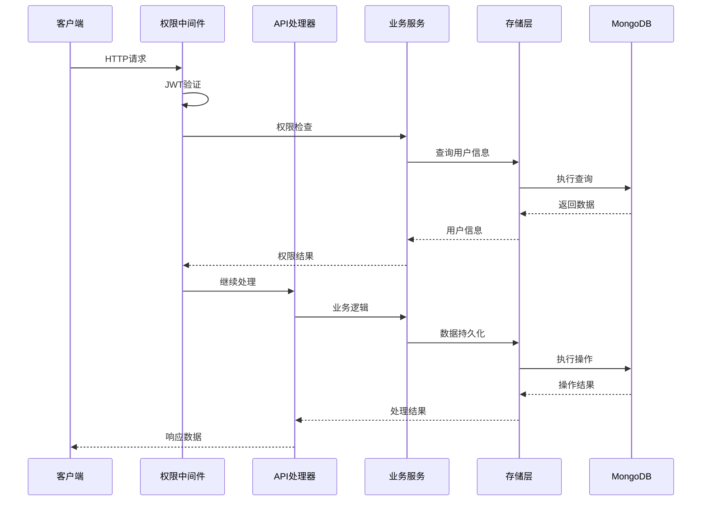

**图表来源**
- [handlers.go:260-314](file://internal/api/handlers.go#L260-L314)
- [rbac.go:63-99](file://pkg/rbac/rbac.go#L63-L99)

**章节来源**
- [main.go:3-22](file://cmd/server/main.go#L3-L22)
- [handlers.go:260-314](file://internal/api/handlers.go#L260-L314)

## 性能考虑

### 查询优化策略

系统采用了多种查询优化策略来提升性能：

#### 索引设计

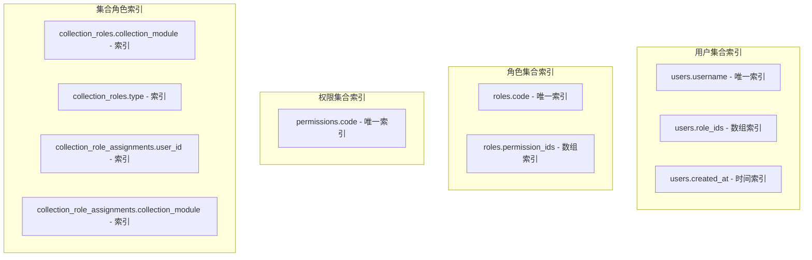

#### 批量查询优化

系统支持批量查询操作，减少数据库往返次数：

| 操作类型 | 批量支持 | 优化策略 |
|---------|---------|---------|
| 用户查询 | ✅ | 分页查询，限制返回字段 |
| 权限查询 | ✅ | 批量获取权限列表 |
| 角色查询 | ✅ | 批量获取角色详情 |
| 集合角色查询 | ✅ | 批量获取角色分配信息 |

### 缓存策略

虽然当前实现主要依赖数据库查询，但系统设计支持缓存层的扩展：

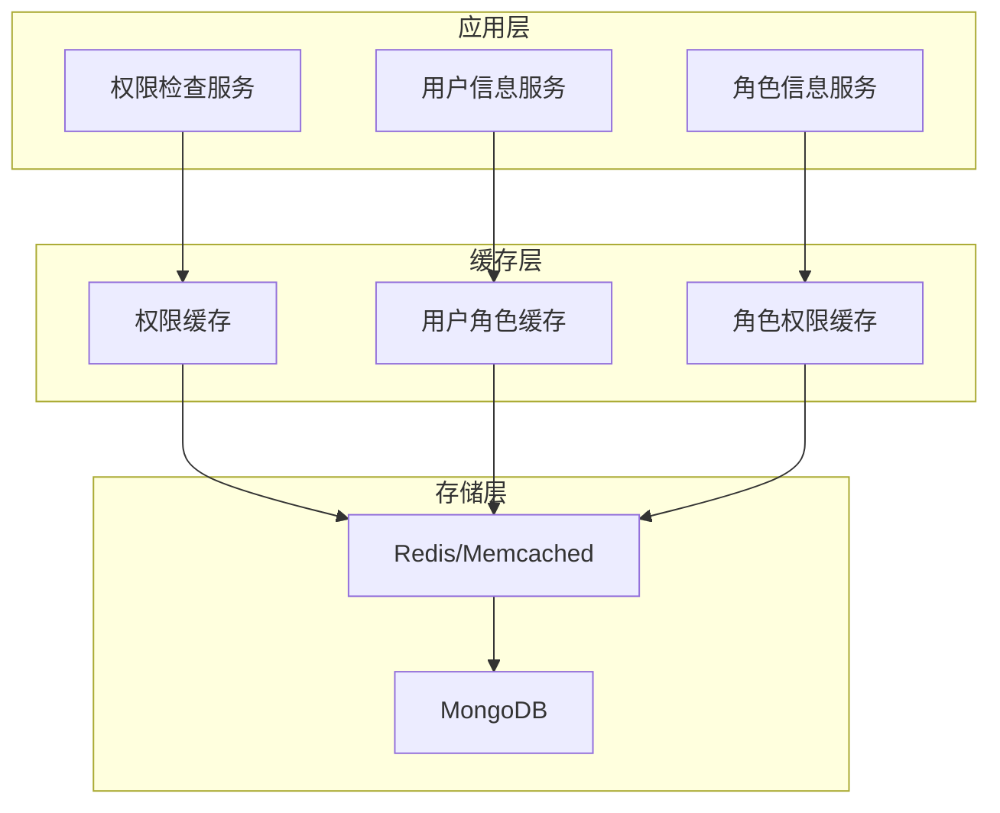

### 事务处理

系统在权限变更操作中采用了原子性保证：

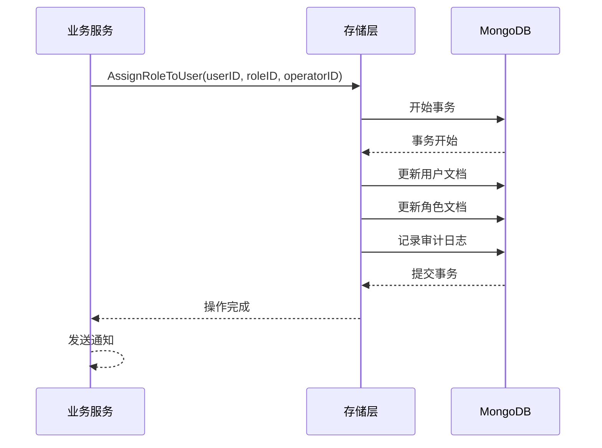

**章节来源**
- [rbac_storage.go:379-408](file://internal/storage/rbac_storage.go#L379-L408)
- [collection_rbac_storage.go:131-156](file://internal/storage/collection_rbac_storage.go#L131-L156)

## 故障排除指南

### 常见问题诊断

#### 权限检查失败

当遇到权限检查失败的问题时，可以按照以下步骤进行排查：

1. **检查用户角色分配**
   - 验证用户是否被正确分配了角色
   - 确认角色权限列表包含所需的权限代码

2. **检查权限代码格式**
   - 确认权限代码格式正确（如 `user:read`）
   - 验证通配符权限的正确使用

3. **检查中间件配置**
   - 确认API路由正确配置了权限中间件
   - 验证JWT令牌的有效性

#### 数据库连接问题

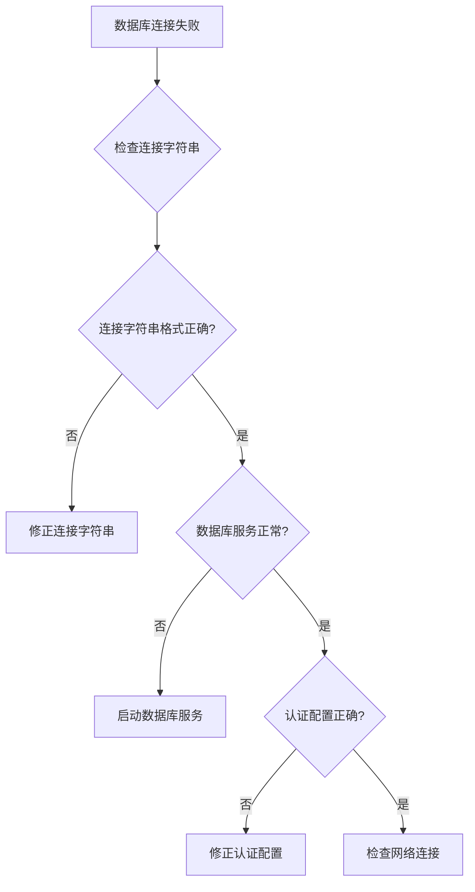

#### 性能问题

如果遇到性能问题，可以考虑以下优化措施：

1. **添加适当的索引**
2. **优化查询条件**
3. **启用分页查询**
4. **考虑缓存策略**

**章节来源**
- [handlers.go:260-314](file://internal/api/handlers.go#L260-L314)
- [rbac.go:63-99](file://pkg/rbac/rbac.go#L63-L99)

## 结论

本权限存储系统通过清晰的架构设计和完善的接口抽象，实现了灵活而强大的RBAC功能。系统的主要优势包括：

1. **模块化设计**：通过接口抽象实现了良好的可扩展性
2. **双存储分离**：权限数据和业务数据的分离提高了系统的安全性
3. **完整的生命周期管理**：支持用户、角色、权限的完整CRUD操作
4. **细粒度权限控制**：支持集合级别的权限控制
5. **审计日志**：完整的操作追踪功能

系统在设计上充分考虑了性能和可维护性，为后续的功能扩展和优化奠定了良好的基础。通过合理的索引设计和查询优化策略，系统能够满足大多数应用场景的性能需求。

未来可以考虑的改进方向包括：
- 实现权限缓存机制以提升查询性能
- 添加更多的监控和告警功能
- 扩展支持更多类型的权限检查场景
- 增强审计日志的详细程度和分析能力