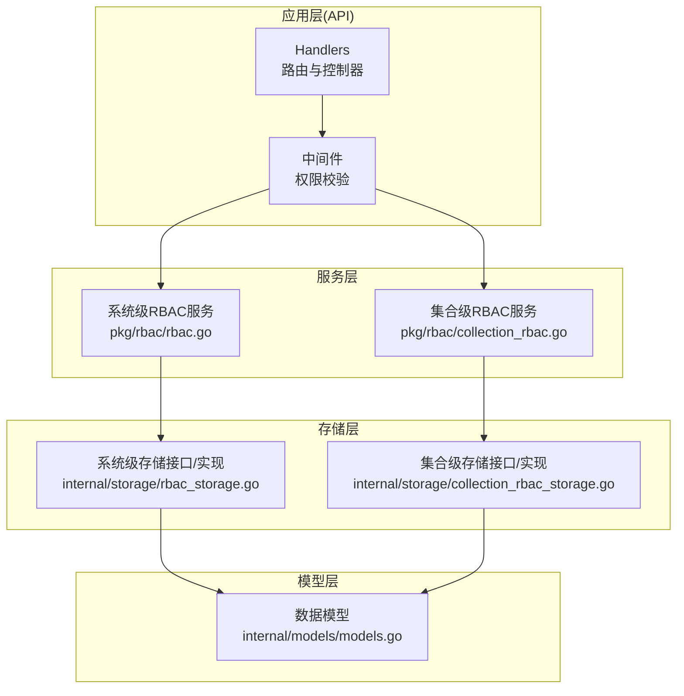
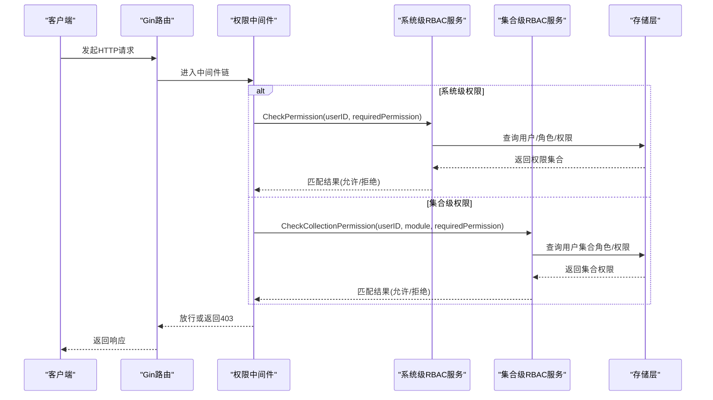
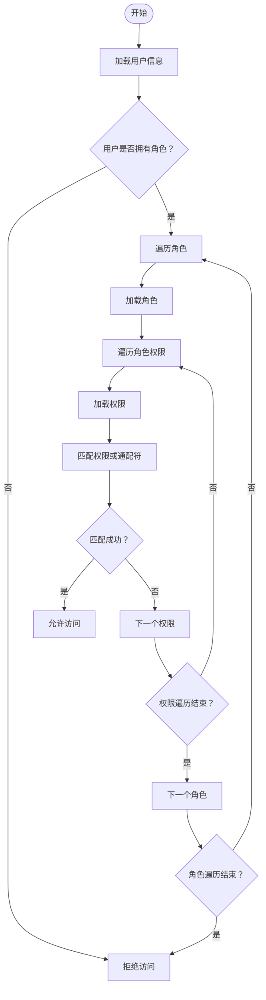
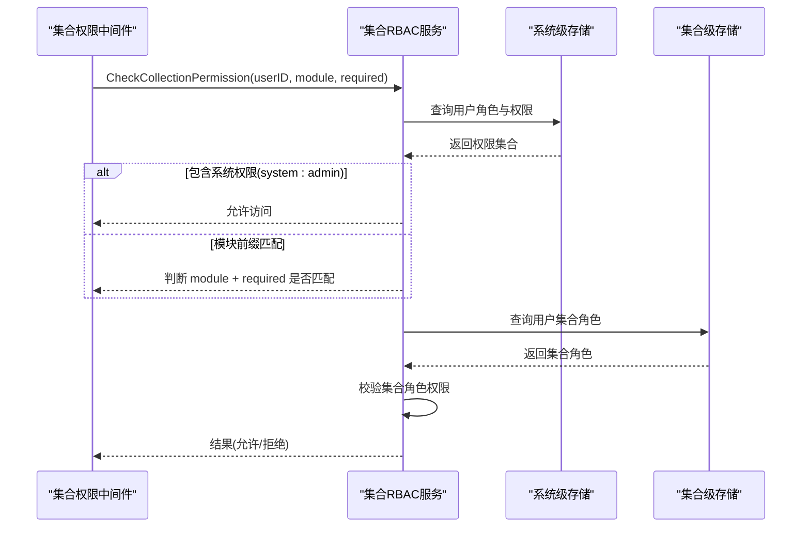
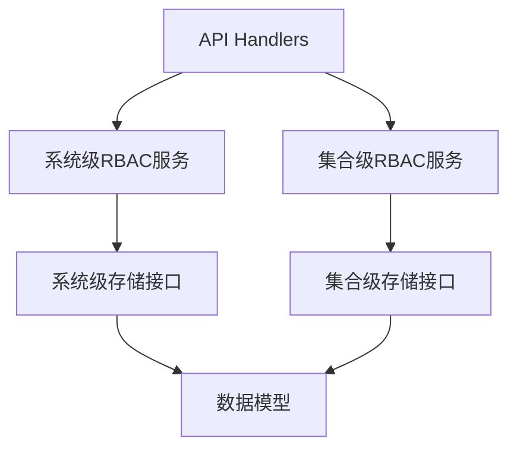

# 权限模型设计

<cite>
**本文档引用的文件**
- [pkg/rbac/rbac.go](file://pkg/rbac/rbac.go)
- [pkg/rbac/collection_rbac.go](file://pkg/rbac/collection_rbac.go)
- [internal/storage/rbac_storage.go](file://internal/storage/rbac_storage.go)
- [internal/storage/collection_rbac_storage.go](file://internal/storage/collection_rbac_storage.go)
- [internal/api/collection_permission_middleware.go](file://internal/api/collection_permission_middleware.go)
- [internal/api/handlers.go](file://internal/api/handlers.go)
- [internal/models/models.go](file://internal/models/models.go)
- [docs/rbac.md](file://docs/rbac.md)
- [frontend/src/services/rbac.ts](file://frontend/src/services/rbac.ts)
</cite>

## 目录
1. [简介](#简介)
2. [项目结构](#项目结构)
3. [核心组件](#核心组件)
4. [架构总览](#架构总览)
5. [详细组件分析](#详细组件分析)
6. [依赖关系分析](#依赖关系分析)
7. [性能考量](#性能考量)
8. [故障排查指南](#故障排查指南)
9. [结论](#结论)
10. [附录](#附录)

## 简介
本文件面向RBAC权限模型设计，系统性阐述双层权限模型（系统级权限与集合级权限）的设计理念、权限代码命名规范、权限继承与通配符机制、超级管理员权限的特殊处理、权限分类体系以及权限匹配算法与性能优化策略。文档基于仓库中的实际代码实现，结合架构文档与前端服务封装，帮助开发者与运维人员准确理解并高效落地权限体系。

## 项目结构
围绕RBAC权限模型，项目采用分层架构：
- 服务层：系统级RBAC服务与集合级RBAC服务
- 存储层：MongoDB存储接口与实现，分别承载系统级与集合级权限数据
- API层：Gin路由与中间件，负责权限校验与API授权
- 模型层：统一的数据模型定义，支撑权限、角色、用户、集合角色等实体
- 文档与前端：权限模型设计文档与前端服务封装

图表来源
- [internal/api/handlers.go:45-181](file://internal/api/handlers.go#L45-L181)
- [pkg/rbac/rbac.go:55-99](file://pkg/rbac/rbac.go#L55-L99)
- [pkg/rbac/collection_rbac.go:27-90](file://pkg/rbac/collection_rbac.go#L27-L90)
- [internal/storage/rbac_storage.go:16-50](file://internal/storage/rbac_storage.go#L16-L50)
- [internal/storage/collection_rbac_storage.go:15-33](file://internal/storage/collection_rbac_storage.go#L15-L33)
- [internal/models/models.go:247-364](file://internal/models/models.go#L247-L364)

章节来源
- [internal/api/handlers.go:45-181](file://internal/api/handlers.go#L45-L181)
- [docs/rbac.md:1-482](file://docs/rbac.md#L1-L482)

## 核心组件
- 系统级RBAC服务：负责用户-角色-权限的继承与匹配，支持通配符匹配与聚合权限查询。
- 集合级RBAC服务：负责按模块（集合）维度的权限校验，支持模块前缀权限与字段管理权限。
- 存储接口：抽象出系统级与集合级的存储能力，便于替换与扩展。
- 中间件：在API入口处拦截请求，完成权限校验与放行。
- 模型：统一的用户、角色、权限、集合角色、审计日志等模型定义。

章节来源
- [pkg/rbac/rbac.go:55-171](file://pkg/rbac/rbac.go#L55-L171)
- [pkg/rbac/collection_rbac.go:27-90](file://pkg/rbac/collection_rbac.go#L27-L90)
- [internal/storage/rbac_storage.go:16-50](file://internal/storage/rbac_storage.go#L16-L50)
- [internal/storage/collection_rbac_storage.go:15-33](file://internal/storage/collection_rbac_storage.go#L15-L33)
- [internal/models/models.go:247-364](file://internal/models/models.go#L247-L364)

## 架构总览
系统级与集合级权限模型协同工作：
- 系统级：用户通过角色继承权限，权限以“域:动作”形式存在，支持“域:*”通配符。
- 集合级：针对具体模块（集合）进行权限校验，支持模块前缀权限与字段管理权限。
- 中间件：在路由注册阶段挂载权限中间件，确保API访问受控。

图表来源
- [internal/api/handlers.go:49-181](file://internal/api/handlers.go#L49-L181)
- [internal/api/collection_permission_middleware.go:16-48](file://internal/api/collection_permission_middleware.go#L16-L48)
- [pkg/rbac/rbac.go:63-99](file://pkg/rbac/rbac.go#L63-L99)
- [pkg/rbac/collection_rbac.go:39-90](file://pkg/rbac/collection_rbac.go#L39-L90)

## 详细组件分析

### 系统级RBAC服务
系统级RBAC服务负责用户-角色-权限的继承与匹配，核心能力包括：
- 权限检查：遍历用户角色，逐条匹配权限或通配符。
- 权限聚合：收集用户通过角色继承的所有权限，去重返回。
- API权限映射：根据HTTP方法与路径推导所需权限常量。
- 权限组合判断：支持“任一满足/全部满足”的权限组合校验。

图表来源
- [pkg/rbac/rbac.go:63-114](file://pkg/rbac/rbac.go#L63-L114)

章节来源
- [pkg/rbac/rbac.go:55-171](file://pkg/rbac/rbac.go#L55-L171)

### 集合级RBAC服务
集合级RBAC服务负责模块维度的权限校验，核心能力包括：
- 模块权限校验：优先检查系统权限（如 system:admin），再检查模块前缀权限。
- 集合角色权限：根据用户在集合上的角色分配，校验集合级权限。
- 角色模板与创建：按模块自动生成集合角色与系统角色，并同步分配。
- 审计日志：记录集合权限相关的操作行为。

图表来源
- [pkg/rbac/collection_rbac.go:39-90](file://pkg/rbac/collection_rbac.go#L39-L90)
- [internal/api/collection_permission_middleware.go:16-48](file://internal/api/collection_permission_middleware.go#L16-L48)

章节来源
- [pkg/rbac/collection_rbac.go:27-278](file://pkg/rbac/collection_rbac.go#L27-L278)
- [internal/api/collection_permission_middleware.go:16-137](file://internal/api/collection_permission_middleware.go#L16-L137)

### 权限代码命名规范与分类体系
- 命名规范：采用“域:动作”格式，如 user:read、user:write、user:manage；集合级采用“模块:动作”，如 movie:read。
- 通配符：支持“域:*”通配符，用于批量授权。
- 分类体系：
  - 用户管理：user:read、user:write、user:manage
  - 角色管理：role:read、role:write、role:manage
  - 权限管理：permission:read、permission:write、permission:manage
  - 集合管理：collection:read、collection:write、collection:manage
  - 字段管理：field:read、field:write、field:manage
  - 数据管理：data:read、data:write、data:manage
  - 刮削管理：scrape:read、scrape:write、scrape:manage
  - 超级管理员：system:admin（系统级最高权限）

章节来源
- [pkg/rbac/rbac.go:12-42](file://pkg/rbac/rbac.go#L12-L42)
- [pkg/rbac/rbac.go:173-249](file://pkg/rbac/rbac.go#L173-L249)
- [docs/rbac.md:321-361](file://docs/rbac.md#L321-L361)

### 权限继承机制与通配符权限
- 继承机制：用户通过角色间接拥有权限，最终权限集合为所有角色权限的并集。
- 通配符匹配：若用户权限为“域:*”，则可匹配该域下的任意子权限。
- 特殊处理：系统级权限 system:admin 拥有最高权限，一旦匹配即直接放行。

章节来源
- [pkg/rbac/rbac.go:63-114](file://pkg/rbac/rbac.go#L63-L114)
- [pkg/rbac/rbac.go:101-114](file://pkg/rbac/rbac.go#L101-L114)

### 超级管理员权限(system:admin)
- 设计目的：为系统管理员提供不受限制的访问能力，简化运维与紧急处理。
- 特殊处理：在权限检查过程中，若发现用户拥有 system:admin，立即放行，无需进一步匹配。

章节来源
- [pkg/rbac/rbac.go:73-96](file://pkg/rbac/rbac.go#L73-L96)
- [internal/storage/rbac_storage.go:94-143](file://internal/storage/rbac_storage.go#L94-L143)

### 权限匹配算法与性能优化
- 匹配算法：
  - 精确匹配：权限完全一致。
  - 前缀匹配：若用户权限为“域:*”，则判断目标权限是否以“域:”开头。
- 性能优化：
  - 权限聚合：在获取用户权限时使用哈希表去重，避免重复计算。
  - 最短路径：系统级权限检查先于集合级权限检查，减少不必要的集合查询。
  - 存储索引：建议在用户角色ID数组、角色权限ID数组、权限代码上建立索引，提升查询效率。

章节来源
- [pkg/rbac/rbac.go:101-114](file://pkg/rbac/rbac.go#L101-L114)
- [pkg/rbac/rbac.go:116-144](file://pkg/rbac/rbac.go#L116-L144)
- [docs/rbac.md:192-204](file://docs/rbac.md#L192-L204)

## 依赖关系分析
系统级与集合级RBAC服务均依赖各自的存储接口，存储接口依赖MongoDB驱动与模型定义，API层通过中间件与服务层交互。

图表来源
- [internal/api/handlers.go:23-42](file://internal/api/handlers.go#L23-L42)
- [pkg/rbac/rbac.go:55-57](file://pkg/rbac/rbac.go#L55-L57)
- [pkg/rbac/collection_rbac.go:27-30](file://pkg/rbac/collection_rbac.go#L27-L30)
- [internal/storage/rbac_storage.go:16-50](file://internal/storage/rbac_storage.go#L16-L50)
- [internal/storage/collection_rbac_storage.go:15-33](file://internal/storage/collection_rbac_storage.go#L15-L33)
- [internal/models/models.go:247-364](file://internal/models/models.go#L247-L364)

章节来源
- [internal/api/handlers.go:45-181](file://internal/api/handlers.go#L45-L181)
- [pkg/rbac/rbac.go:55-99](file://pkg/rbac/rbac.go#L55-L99)
- [pkg/rbac/collection_rbac.go:27-90](file://pkg/rbac/collection_rbac.go#L27-L90)

## 性能考量
- 存储层优化：
  - 为 users.role_ids、roles.permission_ids、permissions.code、roles.code 建立索引，加速权限继承与权限查找。
  - 使用数组操作符 $addToSet/$pull 管理多对多关系，避免复杂事务。
- 服务层优化：
  - 权限聚合使用哈希表去重，降低后续匹配成本。
  - 尽可能早地短路返回（如发现 system:admin 或精确匹配成功）。
- API层优化：
  - 中间件按需加载模块信息，避免不必要的I/O。
  - 对集合级权限，尽量在URL参数中传递模块，减少解析开销。

[本节为通用指导，不直接分析具体文件]

## 故障排查指南
- 无权限错误：确认用户是否被分配了所需角色与权限，或是否遗漏 system:admin。
- 权限未生效：检查权限代码是否与API映射一致，确认中间件是否正确挂载。
- 集合权限异常：确认集合角色是否正确创建与分配，模块前缀是否匹配。
- 审计日志缺失：确认审计日志写入逻辑是否触发，检查集合审计日志接口。

章节来源
- [internal/api/collection_permission_middleware.go:16-48](file://internal/api/collection_permission_middleware.go#L16-L48)
- [pkg/rbac/collection_rbac.go:280-293](file://pkg/rbac/collection_rbac.go#L280-L293)
- [docs/rbac.md:467-481](file://docs/rbac.md#L467-L481)

## 结论
本RBAC权限模型通过系统级与集合级双层设计，实现了灵活而强大的权限控制能力。系统级提供统一的权限继承与通配符匹配，集合级提供模块化的细粒度控制。配合完善的中间件与存储层设计，能够满足复杂业务场景下的权限需求，并具备良好的扩展性与可维护性。

[本节为总结性内容，不直接分析具体文件]

## 附录
- 前端权限服务封装：前端通过服务层封装与后端交互，便于在UI层面展示与管理角色与权限。
- 路由与中间件：在路由注册时明确挂载权限中间件，确保API访问受控。

章节来源
- [frontend/src/services/rbac.ts:18-135](file://frontend/src/services/rbac.ts#L18-L135)
- [internal/api/handlers.go:49-181](file://internal/api/handlers.go#L49-L181)