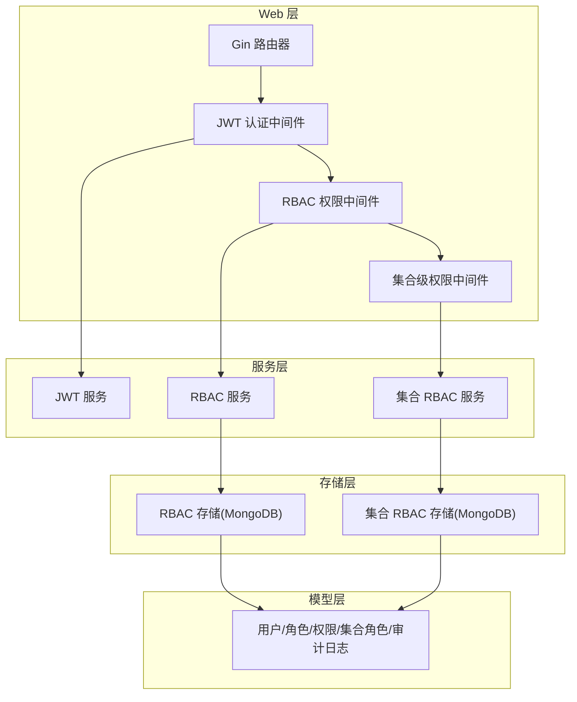
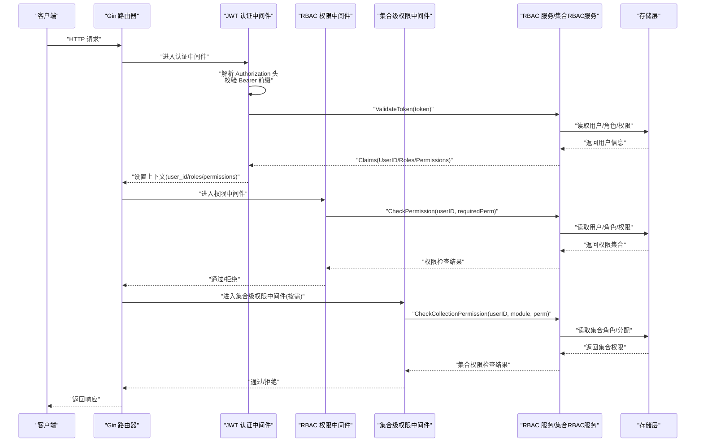
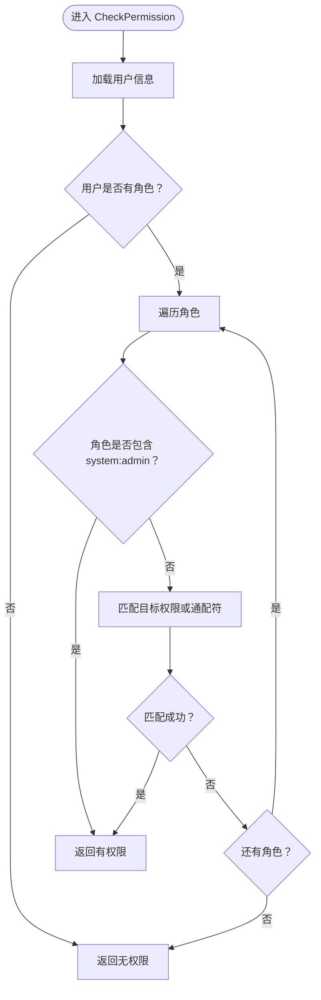
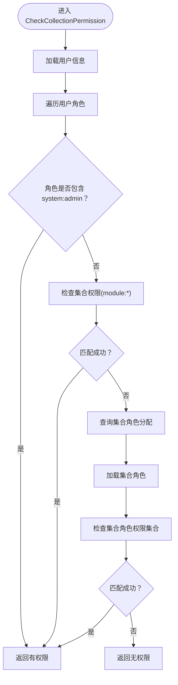
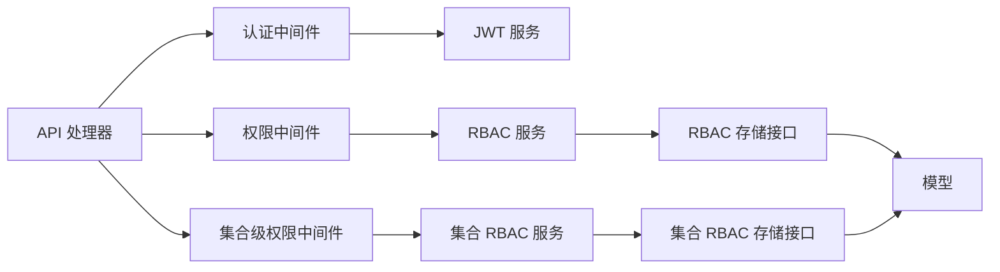

# 权限验证机制

<cite>
**本文档引用的文件**
- [internal/api/collection_permission_middleware.go](file://internal/api/collection_permission_middleware.go)
- [internal/api/handlers.go](file://internal/api/handlers.go)
- [internal/auth/middleware.go](file://internal/auth/middleware.go)
- [internal/auth/jwt.go](file://internal/auth/jwt.go)
- [pkg/rbac/rbac.go](file://pkg/rbac/rbac.go)
- [pkg/rbac/collection_rbac.go](file://pkg/rbac/collection_rbac.go)
- [internal/storage/rbac_storage.go](file://internal/storage/rbac_storage.go)
- [internal/storage/collection_rbac_storage.go](file://internal/storage/collection_rbac_storage.go)
- [internal/models/models.go](file://internal/models/models.go)
- [internal/logger/logger.go](file://internal/logger/logger.go)
- [cmd/server/main.go](file://cmd/server/main.go)
- [test/collection_roles_test.go](file://test/collection_roles_test.go)
</cite>

## 目录
1. [引言](#引言)
2. [项目结构](#项目结构)
3. [核心组件](#核心组件)
4. [架构总览](#架构总览)
5. [详细组件分析](#详细组件分析)
6. [依赖关系分析](#依赖关系分析)
7. [性能考量](#性能考量)
8. [故障排查指南](#故障排查指南)
9. [结论](#结论)
10. [附录](#附录)

## 引言
本文件系统性梳理数据中枢项目的权限验证机制，覆盖以下关键主题：
- 权限检查算法：CheckPermission、HasAnyPermission、HasAllPermissions 的工作流程与匹配规则
- API 权限映射：GetAPIPermission 如何将 HTTP 请求映射到具体权限
- 权限验证中间件：JWT 认证中间件与 RBAC 权限中间件在请求处理管道中的执行顺序与错误处理
- 权限缓存策略与性能优化：当前实现的局限与可优化点
- 错误处理与日志记录：统一的错误响应与日志输出
- 测试策略与调试方法：单元测试与集成测试实践
- 权限验证与 JWT 认证的集成：Claims 结构、令牌签发与校验、安全考虑

## 项目结构
权限相关代码主要分布在以下模块：
- 认证与授权服务层：JWT 服务、RBAC 服务、集合级 RBAC 服务
- 存储层：RBAC 存储、集合 RBAC 存储（MongoDB）
- Web 层：Gin 中间件与路由处理器
- 模型层：用户、角色、权限、集合角色、审计日志等模型
- 日志与入口：日志初始化、服务器启动与中间件注册

图表来源
- [cmd/server/main.go:94-118](file://cmd/server/main.go#L94-L118)
- [internal/api/handlers.go:260-314](file://internal/api/handlers.go#L260-L314)
- [internal/auth/middleware.go:12-48](file://internal/auth/middleware.go#L12-L48)
- [pkg/rbac/rbac.go:59-61](file://pkg/rbac/rbac.go#L59-L61)
- [pkg/rbac/collection_rbac.go:32-37](file://pkg/rbac/collection_rbac.go#L32-L37)

章节来源
- [cmd/server/main.go:94-118](file://cmd/server/main.go#L94-L118)
- [internal/api/handlers.go:45-181](file://internal/api/handlers.go#L45-L181)

## 核心组件
本节聚焦权限验证的核心算法与映射逻辑。

- 权限常量与集合权限枚举
  - 定义了用户、角色、权限、集合、字段、业务数据、刮削任务等维度的权限标识，并提供系统管理员权限常量
  - 集合权限枚举包含 admin、read、write、delete、field:admin 等

- 权限检查算法
  - CheckPermission：遍历用户角色，检查角色绑定的权限是否与目标权限完全匹配或满足“前缀:*”通配规则
  - HasAnyPermission：对多个权限执行“任一满足即通过”的判定
  - HasAllPermissions：对多个权限执行“全部满足才通过”的判定

- API 权限映射
  - GetAPIPermission：根据 HTTP 方法与路径前缀，将 /api/* 请求映射到对应维度的权限（如 user:read、role:write 等）

- 集合级权限检查
  - CheckCollectionPermission：优先检查系统权限（如 system:admin），其次检查集合权限（module:read/write/delete/admin/field:admin），最后查询集合角色分配与角色权限集合

章节来源
- [pkg/rbac/rbac.go:10-53](file://pkg/rbac/rbac.go#L10-L53)
- [pkg/rbac/rbac.go:63-99](file://pkg/rbac/rbac.go#L63-L99)
- [pkg/rbac/rbac.go:147-171](file://pkg/rbac/rbac.go#L147-L171)
- [pkg/rbac/rbac.go:173-249](file://pkg/rbac/rbac.go#L173-L249)
- [pkg/rbac/collection_rbac.go:13-21](file://pkg/rbac/collection_rbac.go#L13-L21)
- [pkg/rbac/collection_rbac.go:39-90](file://pkg/rbac/collection_rbac.go#L39-L90)

## 架构总览
下图展示权限验证在请求处理管道中的位置与调用链：

图表来源
- [internal/auth/middleware.go:12-48](file://internal/auth/middleware.go#L12-L48)
- [internal/api/handlers.go:295-314](file://internal/api/handlers.go#L295-L314)
- [internal/api/collection_permission_middleware.go:16-48](file://internal/api/collection_permission_middleware.go#L16-L48)
- [pkg/rbac/rbac.go:63-99](file://pkg/rbac/rbac.go#L63-L99)
- [pkg/rbac/collection_rbac.go:39-90](file://pkg/rbac/collection_rbac.go#L39-L90)

## 详细组件分析

### JWT 认证中间件
- 功能要点
  - 从 Authorization 头提取 Bearer 令牌
  - 调用 JWT 服务校验令牌有效性，解析用户身份与权限
  - 将用户 ID、角色、权限写入请求上下文，供后续中间件使用
  - 统一错误处理：缺失头、格式错误、无效或过期令牌均返回相应状态码并中止请求

- 执行顺序
  - 在所有受保护路由之前执行
  - 为后续 RBAC 中间件提供用户上下文

- 安全考虑
  - 严格校验 Bearer 前缀
  - 令牌过期与刷新策略由 JWT 服务实现
  - 密码哈希采用 bcrypt

章节来源
- [internal/auth/middleware.go:12-48](file://internal/auth/middleware.go#L12-L48)
- [internal/auth/jwt.go:68-83](file://internal/auth/jwt.go#L68-L83)
- [internal/auth/jwt.go:114-125](file://internal/auth/jwt.go#L114-L125)

### RBAC 权限中间件
- 功能要点
  - 从上下文获取 user_id
  - 调用 RBAC 服务的 CheckPermission 进行权限校验
  - 若用户拥有 system:admin 或满足目标权限，则放行；否则返回 403

- 与 API 权限映射的关系
  - 路由注册时通过 PermissionMiddleware 指定所需权限
  - GetAPIPermission 提供从 HTTP 方法与路径到权限的映射，用于动态权限控制场景

章节来源
- [internal/api/handlers.go:295-314](file://internal/api/handlers.go#L295-L314)
- [pkg/rbac/rbac.go:173-249](file://pkg/rbac/rbac.go#L173-L249)

### 集合级权限中间件
- 功能要点
  - 从 URL 参数或请求体提取 module
  - 调用集合 RBAC 服务检查用户在该模块上的集合权限
  - 支持从请求体提取 module 的变体中间件，适用于 POST 等方法
  - 支持字段级管理员权限中间件，先查询字段定义以获取所属模块

- 错误处理
  - 缺少 user_id、缺少 module、无法读取请求体、权限不足等情况均返回 400/403 并中止

章节来源
- [internal/api/collection_permission_middleware.go:16-48](file://internal/api/collection_permission_middleware.go#L16-L48)
- [internal/api/collection_permission_middleware.go:53-93](file://internal/api/collection_permission_middleware.go#L53-L93)
- [internal/api/collection_permission_middleware.go:97-136](file://internal/api/collection_permission_middleware.go#L97-L136)

### 权限检查算法详解
- CheckPermission 匹配规则
  - 用户拥有 system:admin 即可放行
  - 否则检查角色绑定的权限是否与目标权限完全一致
  - 支持“前缀:*”通配匹配（如 user:*）

- HasAnyPermission / HasAllPermissions
  - HasAnyPermission：逐个尝试，任一成功即返回
  - HasAllPermissions：逐个尝试，任一失败即返回

- API 权限映射规则
  - 根据 /api/* 下的子路径与 HTTP 方法，映射到 user/role/permission/collection/field/business/scraper 等维度的读写管理权限
  - 未匹配到特定维度时默认映射为系统管理员权限

图表来源
- [pkg/rbac/rbac.go:63-99](file://pkg/rbac/rbac.go#L63-L99)
- [pkg/rbac/rbac.go:101-114](file://pkg/rbac/rbac.go#L101-L114)

章节来源
- [pkg/rbac/rbac.go:63-99](file://pkg/rbac/rbac.go#L63-L99)
- [pkg/rbac/rbac.go:147-171](file://pkg/rbac/rbac.go#L147-L171)
- [pkg/rbac/rbac.go:173-249](file://pkg/rbac/rbac.go#L173-L249)

### 集合级权限检查流程
- 优先检查系统权限（如 system:admin）
- 检查集合权限（module:read/write/delete/admin/field:admin）
- 若未命中，查询集合角色分配与集合角色权限集合
- 返回最终检查结果

图表来源
- [pkg/rbac/collection_rbac.go:39-90](file://pkg/rbac/collection_rbac.go#L39-L90)

章节来源
- [pkg/rbac/collection_rbac.go:39-90](file://pkg/rbac/collection_rbac.go#L39-L90)

### 权限服务与存储层
- RBAC 服务
  - 提供用户权限查询、权限匹配、API 权限映射等功能
  - 依赖 RBAC 存储接口读取用户、角色、权限数据

- 集合 RBAC 服务
  - 提供集合级权限检查、集合角色创建/删除、角色分配/移除、审计日志记录等
  - 依赖 RBAC 存储与集合 RBAC 存储接口

- 存储层
  - RBAC 存储：用户、角色、权限的 CRUD 与关联查询
  - 集合 RBAC 存储：集合角色、角色分配、审计日志的 CRUD 与查询

章节来源
- [pkg/rbac/rbac.go:55-61](file://pkg/rbac/rbac.go#L55-L61)
- [pkg/rbac/collection_rbac.go:27-37](file://pkg/rbac/collection_rbac.go#L27-L37)
- [internal/storage/rbac_storage.go:16-50](file://internal/storage/rbac_storage.go#L16-L50)
- [internal/storage/collection_rbac_storage.go:15-33](file://internal/storage/collection_rbac_storage.go#L15-L33)

## 依赖关系分析
- 组件耦合
  - 中间件依赖服务层（JWT 服务、RBAC 服务、集合 RBAC 服务）
  - 服务层依赖存储层接口
  - 存储层依赖 MongoDB 驱动

- 关键依赖链
  - Gin 路由 -> 认证中间件 -> 权限中间件 -> 集合级权限中间件 -> 业务处理器
  - 服务层 -> 存储层接口 -> MongoDB

图表来源
- [internal/api/handlers.go:260-314](file://internal/api/handlers.go#L260-L314)
- [pkg/rbac/rbac.go:55-61](file://pkg/rbac/rbac.go#L55-L61)
- [pkg/rbac/collection_rbac.go:27-37](file://pkg/rbac/collection_rbac.go#L27-L37)
- [internal/storage/rbac_storage.go:16-50](file://internal/storage/rbac_storage.go#L16-L50)
- [internal/storage/collection_rbac_storage.go:15-33](file://internal/storage/collection_rbac_storage.go#L15-L33)

章节来源
- [internal/api/handlers.go:260-314](file://internal/api/handlers.go#L260-L314)
- [pkg/rbac/rbac.go:55-61](file://pkg/rbac/rbac.go#L55-L61)
- [pkg/rbac/collection_rbac.go:27-37](file://pkg/rbac/collection_rbac.go#L27-L37)
- [internal/storage/rbac_storage.go:16-50](file://internal/storage/rbac_storage.go#L16-L50)
- [internal/storage/collection_rbac_storage.go:15-33](file://internal/storage/collection_rbac_storage.go#L15-L33)

## 性能考量
- 当前实现特点
  - 权限检查涉及多次数据库查询（用户、角色、权限、集合角色等）
  - 中间件在每次请求中都会执行权限校验

- 可优化方向
  - 令牌内嵌权限集合：在 JWT 中直接携带用户权限，减少中间件阶段的数据库查询
  - 权限缓存：对常用权限查询结果进行短期缓存（如 Redis），降低存储层压力
  - 批量查询：合并多条查询为批量查询，减少网络往返
  - 通配符匹配优化：对“前缀:*”匹配进行索引与预计算，避免线性扫描

[本节为通用性能建议，不直接分析具体文件，故无章节来源]

## 故障排查指南
- 常见错误与定位
  - 401 未授权：Authorization 头缺失或格式错误、令牌无效或过期
  - 403 权限不足：用户无对应权限或集合权限不足
  - 400 参数错误：缺少 user_id、缺少 module、无法读取请求体
  - 404 资源不存在：字段定义不存在等

- 日志记录
  - 统一日志接口提供 Debug/Info/Warn/Error 等级别输出
  - 中间件与服务层在关键节点输出错误信息，便于定位问题

- 调试步骤
  - 检查 JWT 令牌是否正确签发与传递
  - 核对用户角色与权限分配是否正确
  - 验证集合模块与角色分配是否匹配
  - 查看日志文件定位具体错误位置

章节来源
- [internal/auth/middleware.go:12-48](file://internal/auth/middleware.go#L12-L48)
- [internal/api/collection_permission_middleware.go:16-48](file://internal/api/collection_permission_middleware.go#L16-L48)
- [internal/logger/logger.go:58-89](file://internal/logger/logger.go#L58-L89)

## 结论
本权限验证体系通过 JWT 认证与 RBAC/集合 RBAC 双层权限控制，实现了细粒度的资源访问控制。核心算法简洁清晰，支持通配符匹配与系统管理员特权。建议在生产环境中引入令牌内嵌权限与缓存策略，进一步提升性能与安全性。

[本节为总结性内容，不直接分析具体文件，故无章节来源]

## 附录

### 权限验证与 JWT 集成的安全考虑
- 令牌签名与有效期：使用强密钥与合理过期时间，支持刷新令牌
- 密码存储：bcrypt 哈希存储，避免明文或弱加密
- 中间件顺序：认证中间件必须在权限中间件之前执行
- 上下文注入：仅注入必要信息，避免敏感数据泄露

章节来源
- [internal/auth/jwt.go:28-41](file://internal/auth/jwt.go#L28-L41)
- [internal/auth/jwt.go:68-83](file://internal/auth/jwt.go#L68-L83)
- [internal/auth/jwt.go:114-125](file://internal/auth/jwt.go#L114-L125)
- [internal/api/handlers.go:260-314](file://internal/api/handlers.go#L260-L314)

### 测试策略与调试方法
- 单元测试
  - 集合角色创建测试：验证集合角色模板与权限集合的正确性
  - 权限匹配测试：验证通配符与精确匹配行为
- 集成测试
  - 路由注册与中间件执行顺序验证
  - 权限不足与权限充足场景的端到端测试
- 调试技巧
  - 使用日志查看中间件执行路径与权限检查结果
  - 通过最小化请求复现问题，逐步缩小范围

章节来源
- [test/collection_roles_test.go:13-106](file://test/collection_roles_test.go#L13-L106)
- [internal/logger/logger.go:58-89](file://internal/logger/logger.go#L58-L89)