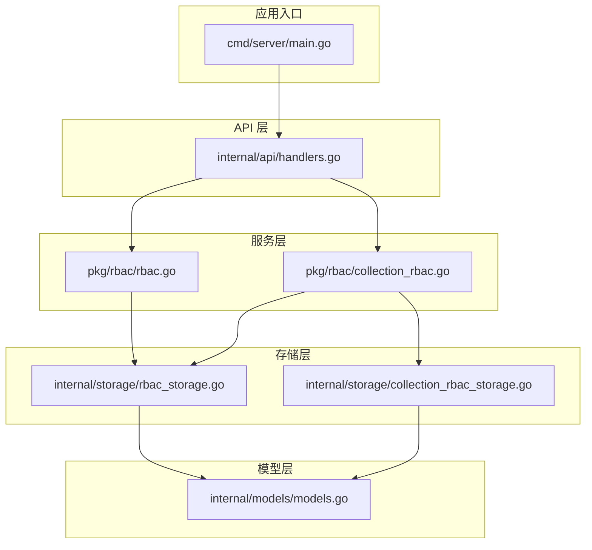
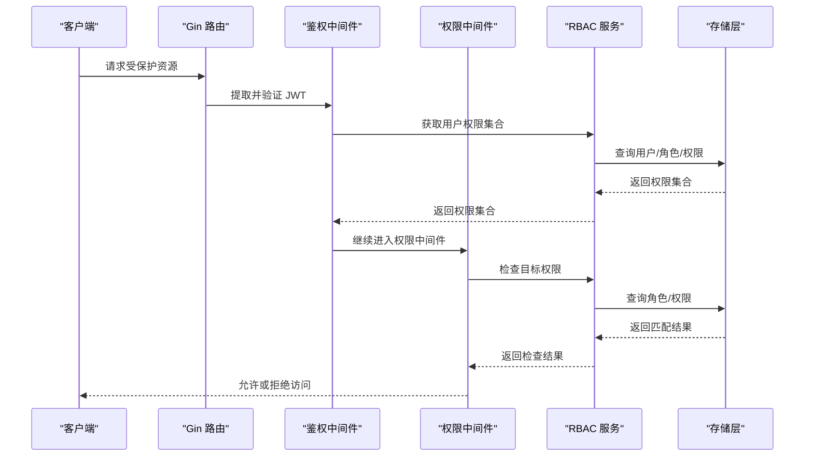
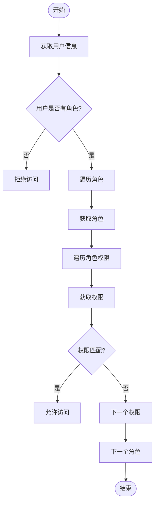
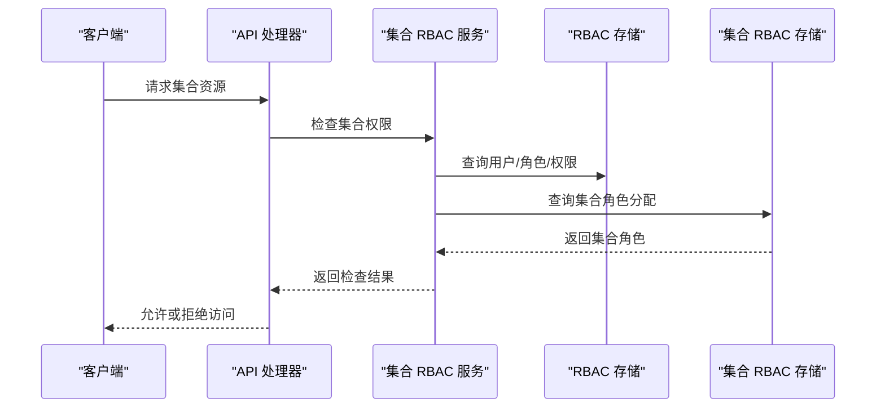
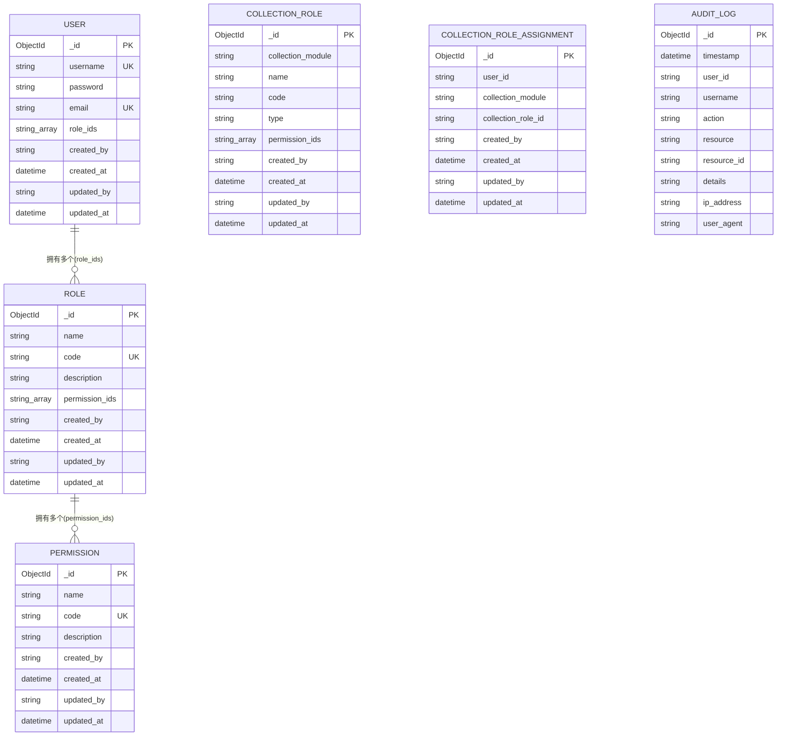
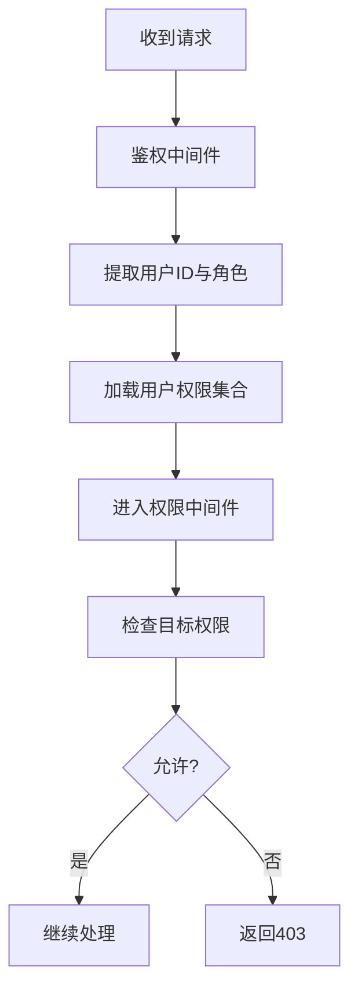
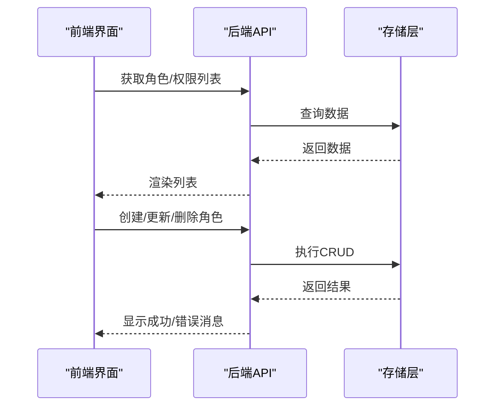
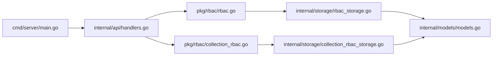

# 用户角色管理

<cite>
**本文档引用的文件**
- [rbac.go](file://pkg/rbac/rbac.go)
- [collection_rbac.go](file://pkg/rbac/collection_rbac.go)
- [rbac_storage.go](file://internal/storage/rbac_storage.go)
- [collection_rbac_storage.go](file://internal/storage/collection_rbac_storage.go)
- [models.go](file://internal/models/models.go)
- [handlers.go](file://internal/api/handlers.go)
- [main.go](file://cmd/server/main.go)
- [rbac.md](file://docs/rbac.md)
- [collection_roles_test.go](file://test/collection_roles_test.go)
- [config.yaml](file://configs/config.yaml)
- [rbac.ts](file://frontend/src/services/rbac.ts)
- [RoleManagement.tsx](file://frontend/src/pages/Admin/RoleManagement.tsx)
- [PermissionManagement.tsx](file://frontend/src/pages/Admin/PermissionManagement.tsx)
</cite>

## 目录
1. [简介](#简介)
2. [项目结构](#项目结构)
3. [核心组件](#核心组件)
4. [架构总览](#架构总览)
5. [详细组件分析](#详细组件分析)
6. [依赖关系分析](#依赖关系分析)
7. [性能考量](#性能考量)
8. [故障排查指南](#故障排查指南)
9. [结论](#结论)
10. [附录](#附录)

## 简介
本项目实现了基于 MongoDB 的 RBAC（基于角色的访问控制）系统，支持：
- 用户-角色多对多关系
- 角色-权限多对多关系
- 用户权限继承与计算
- 集合级权限（按模块划分）与角色管理
- API 层中间件权限校验
- 前端角色与权限管理界面

系统通过嵌入数组的方式在用户与角色、角色与权限之间建立多对多关系，结合权限匹配算法与集合权限中间件，实现灵活且可扩展的权限体系。

## 项目结构
后端采用分层架构：
- cmd/server：应用入口与服务初始化
- internal/api：HTTP 路由与权限中间件
- internal/storage：RBAC 与集合 RBAC 的存储抽象与实现
- pkg/rbac：通用 RBAC 服务与集合 RBAC 服务
- internal/models：数据模型定义
- frontend：前端角色与权限管理界面
- docs：RBAC 设计文档
- test：集合角色创建测试

图表来源
- [main.go:1-167](file://cmd/server/main.go#L1-L167)
- [handlers.go:1-180](file://internal/api/handlers.go#L1-L180)
- [rbac.go:1-250](file://pkg/rbac/rbac.go#L1-L250)
- [collection_rbac.go:1-294](file://pkg/rbac/collection_rbac.go#L1-L294)
- [rbac_storage.go:1-476](file://internal/storage/rbac_storage.go#L1-L476)
- [collection_rbac_storage.go:1-244](file://internal/storage/collection_rbac_storage.go#L1-L244)
- [models.go:1-365](file://internal/models/models.go#L1-L365)

章节来源
- [main.go:1-167](file://cmd/server/main.go#L1-L167)
- [handlers.go:1-180](file://internal/api/handlers.go#L1-L180)

## 核心组件
- RBAC 服务：提供用户权限检查、权限集合获取、API 权限映射等能力
- 集合 RBAC 服务：提供集合级权限检查、集合角色创建/删除、集合角色分配/移除等能力
- 存储接口与实现：抽象出 RBAC 与集合 RBAC 的 CRUD 操作，统一通过 MongoDB 实现
- API 中间件：鉴权与权限中间件，保护受控资源
- 前端服务：角色与权限管理界面，提供创建、编辑、删除、分配等操作

章节来源
- [rbac.go:55-250](file://pkg/rbac/rbac.go#L55-L250)
- [collection_rbac.go:27-294](file://pkg/rbac/collection_rbac.go#L27-L294)
- [rbac_storage.go:16-476](file://internal/storage/rbac_storage.go#L16-L476)
- [collection_rbac_storage.go:15-244](file://internal/storage/collection_rbac_storage.go#L15-L244)
- [handlers.go:295-314](file://internal/api/handlers.go#L295-L314)

## 架构总览
系统通过 Gin 路由注册受控资源，使用 JWT 进行鉴权，权限中间件根据用户角色计算其权限集合，再进行细粒度的权限校验。集合 RBAC 提供按模块划分的权限控制，适用于不同业务集合的细粒度授权。

图表来源
- [handlers.go:260-314](file://internal/api/handlers.go#L260-L314)
- [rbac.go:63-114](file://pkg/rbac/rbac.go#L63-L114)
- [rbac_storage.go:166-475](file://internal/storage/rbac_storage.go#L166-L475)

## 详细组件分析

### RBAC 服务与权限匹配
RBAC 服务负责：
- 用户权限检查：遍历用户角色，获取角色权限，匹配目标权限
- 权限通配匹配：支持“模块:*”通配符匹配
- 用户权限集合获取：合并所有角色权限，去重返回
- API 权限映射：根据 HTTP 方法与路径推导对应的权限常量

图表来源
- [rbac.go:63-114](file://pkg/rbac/rbac.go#L63-L114)
- [rbac.go:116-145](file://pkg/rbac/rbac.go#L116-L145)

章节来源
- [rbac.go:63-171](file://pkg/rbac/rbac.go#L63-L171)

### 集合 RBAC 服务与集合权限
集合 RBAC 服务负责：
- 集合权限检查：优先检查系统权限，再检查集合模块权限
- 集合角色创建：为指定模块创建“读/写/删/管理/字段管理”五种角色模板
- 集合角色分配/移除：同步用户与系统角色的关系
- 审计日志：记录权限相关的操作

图表来源
- [collection_rbac.go:39-90](file://pkg/rbac/collection_rbac.go#L39-L90)
- [collection_rbac.go:92-194](file://pkg/rbac/collection_rbac.go#L92-L194)
- [collection_rbac_storage.go:131-156](file://internal/storage/collection_rbac_storage.go#L131-L156)

章节来源
- [collection_rbac.go:39-278](file://pkg/rbac/collection_rbac.go#L39-L278)
- [collection_rbac_storage.go:15-244](file://internal/storage/collection_rbac_storage.go#L15-L244)

### 存储层与数据模型
存储层通过接口抽象，具体实现为 MongoDB：
- RBAC 存储：用户、角色、权限的 CRUD 与关系管理
- 集合 RBAC 存储：集合角色、角色分配、审计日志
- 数据模型：用户、角色、权限、集合角色、角色分配、审计日志

图表来源
- [models.go:247-365](file://internal/models/models.go#L247-L365)
- [rbac_storage.go:16-50](file://internal/storage/rbac_storage.go#L16-L50)
- [collection_rbac_storage.go:15-33](file://internal/storage/collection_rbac_storage.go#L15-L33)

章节来源
- [rbac_storage.go:16-476](file://internal/storage/rbac_storage.go#L16-L476)
- [collection_rbac_storage.go:15-244](file://internal/storage/collection_rbac_storage.go#L15-L244)
- [models.go:247-365](file://internal/models/models.go#L247-L365)

### API 中间件与权限校验
- 鉴权中间件：解析 JWT，注入用户信息与权限集合
- 权限中间件：基于 RBAC 服务检查目标权限
- 集合权限中间件：基于集合 RBAC 服务检查集合模块权限

图表来源
- [handlers.go:260-314](file://internal/api/handlers.go#L260-L314)
- [rbac.go:63-114](file://pkg/rbac/rbac.go#L63-L114)

章节来源
- [handlers.go:295-314](file://internal/api/handlers.go#L295-L314)

### 前端角色与权限管理
前端提供角色与权限的增删改查界面，支持：
- 角色列表与详情
- 权限列表与详情
- 角色权限分配
- 分页与搜索

图表来源
- [rbac.ts:18-135](file://frontend/src/services/rbac.ts#L18-L135)
- [RoleManagement.tsx:18-363](file://frontend/src/pages/Admin/RoleManagement.tsx#L18-L363)
- [PermissionManagement.tsx:14-261](file://frontend/src/pages/Admin/PermissionManagement.tsx#L14-L261)

章节来源
- [rbac.ts:18-196](file://frontend/src/services/rbac.ts#L18-L196)
- [RoleManagement.tsx:18-363](file://frontend/src/pages/Admin/RoleManagement.tsx#L18-L363)
- [PermissionManagement.tsx:14-261](file://frontend/src/pages/Admin/PermissionManagement.tsx#L14-L261)

## 依赖关系分析
- 应用入口依赖 API 处理器与服务层
- API 处理器依赖 RBAC 服务与集合 RBAC 服务
- 服务层依赖存储接口
- 存储接口依赖 MongoDB 实现
- 前端依赖后端 API

图表来源
- [main.go:79-95](file://cmd/server/main.go#L79-L95)
- [handlers.go:33-43](file://internal/api/handlers.go#L33-L43)
- [rbac.go:59-61](file://pkg/rbac/rbac.go#L59-L61)
- [collection_rbac.go:32-37](file://pkg/rbac/collection_rbac.go#L32-L37)

章节来源
- [main.go:79-95](file://cmd/server/main.go#L79-L95)
- [handlers.go:33-43](file://internal/api/handlers.go#L33-L43)

## 性能考量
- 权限计算复杂度：O(U×R×P)，其中 U 为用户数，R 为角色数，P 为权限数
- MongoDB 数组操作：$addToSet/$pull 保证关系去重与原子性
- 建议索引策略：
  - users.username、users.email（唯一）
  - roles.code（唯一）
  - permissions.code（唯一）
  - users.role_ids、roles.permission_ids（用于反向查询）
- 前端分页与搜索减少一次性传输数据量
- 集合 RBAC 的权限检查先检查系统权限，避免不必要的模块权限查询

[本节为通用性能建议，无需特定文件来源]

## 故障排查指南
- 无权限访问（403）：确认用户是否拥有目标权限；检查角色-权限关系是否正确；检查权限匹配逻辑
- 用户/角色/权限不存在（404）：确认 ID 是否有效；检查存储层查询逻辑
- 角色/权限已分配（400）：确认是否重复分配；使用 $addToSet/$pull 避免重复
- 集合角色创建失败：确认模块名与权限模板；检查存储层创建流程
- 前端交互异常：检查 API 返回数据结构；确认字段映射与分页参数

章节来源
- [rbac.go:63-114](file://pkg/rbac/rbac.go#L63-L114)
- [rbac_storage.go:166-475](file://internal/storage/rbac_storage.go#L166-L475)
- [collection_rbac_storage.go:131-156](file://internal/storage/collection_rbac_storage.go#L131-L156)
- [rbac.md:467-482](file://docs/rbac.md#L467-L482)

## 结论
本系统通过嵌入数组的多对多关系设计，结合权限匹配与集合 RBAC，实现了灵活、可扩展的权限控制。API 中间件确保了对受控资源的统一保护，前端界面提供了直观的角色与权限管理体验。建议在生产环境中配合完善的索引策略与审计日志，持续优化权限计算与存储性能。

[本节为总结性内容，无需特定文件来源]

## 附录

### 最佳实践
- 使用“模块:*”通配符简化权限配置
- 为集合模块创建标准化角色模板，避免重复劳动
- 定期清理无效角色与权限，保持权限集合整洁
- 严格区分系统权限与集合权限，避免越权访问
- 使用审计日志追踪权限变更，便于合规与排错

章节来源
- [rbac.go:101-114](file://pkg/rbac/rbac.go#L101-L114)
- [collection_rbac.go:92-194](file://pkg/rbac/collection_rbac.go#L92-L194)
- [rbac.md:26-36](file://docs/rbac.md#L26-L36)

### 常见问题与解决方案
- 无法登录：检查 JWT 密钥与过期时间配置；确认用户密码哈希
- 权限不生效：检查用户角色分配；确认权限匹配规则
- 集合权限异常：检查集合角色分配；确认模块名与权限模板一致
- 前端显示异常：检查 API 返回字段映射；确认分页参数

章节来源
- [main.go:72-77](file://cmd/server/main.go#L72-L77)
- [rbac.ts:18-135](file://frontend/src/services/rbac.ts#L18-L135)

### 角色配置示例与权限分配场景
- 示例：为模块“movie”创建集合角色模板，包含“管理/读写/只读/字段管理”四种角色
- 场景：用户 A 拥有“movie:read”和“movie:write”，可对电影数据进行读写；用户 B 拥有“movie:admin”，可管理字段与集合

章节来源
- [collection_rbac.go:92-194](file://pkg/rbac/collection_rbac.go#L92-L194)
- [collection_roles_test.go:33-105](file://test/collection_roles_test.go#L33-L105)