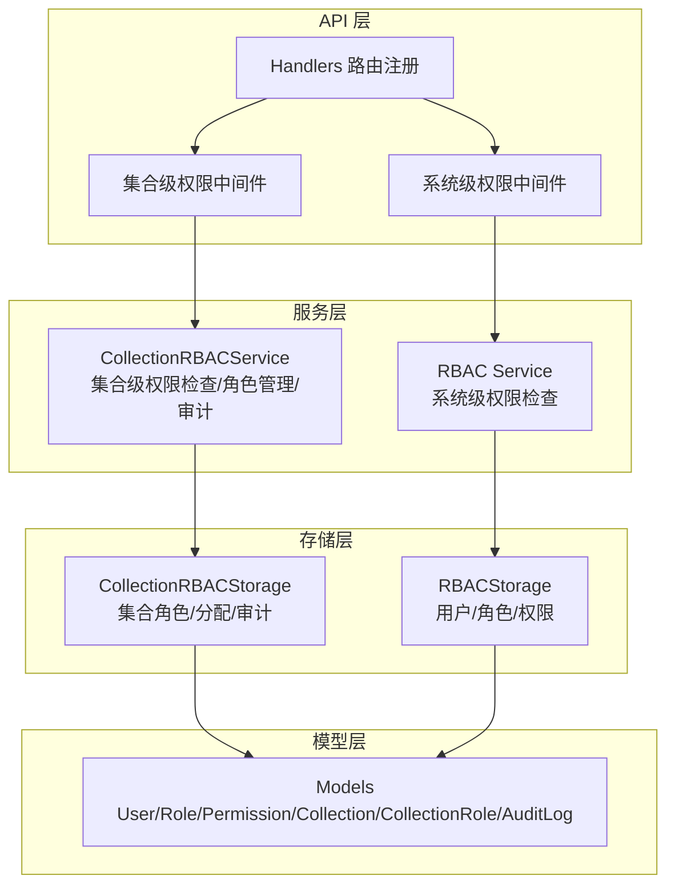
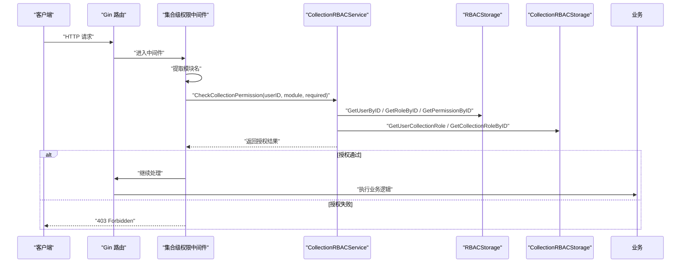
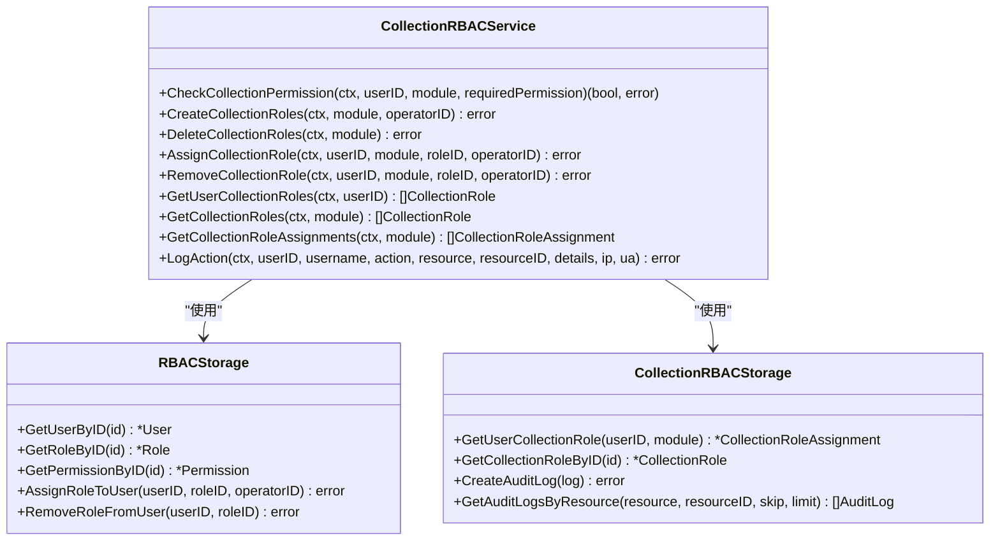
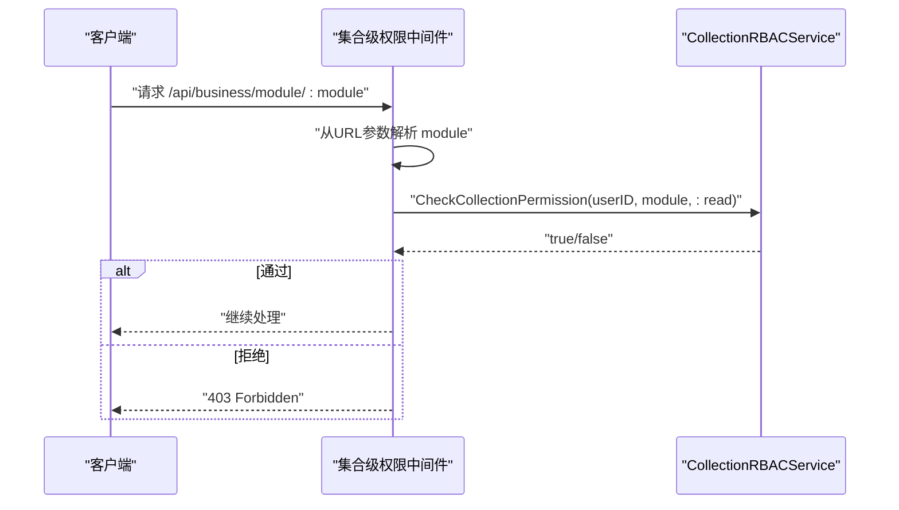
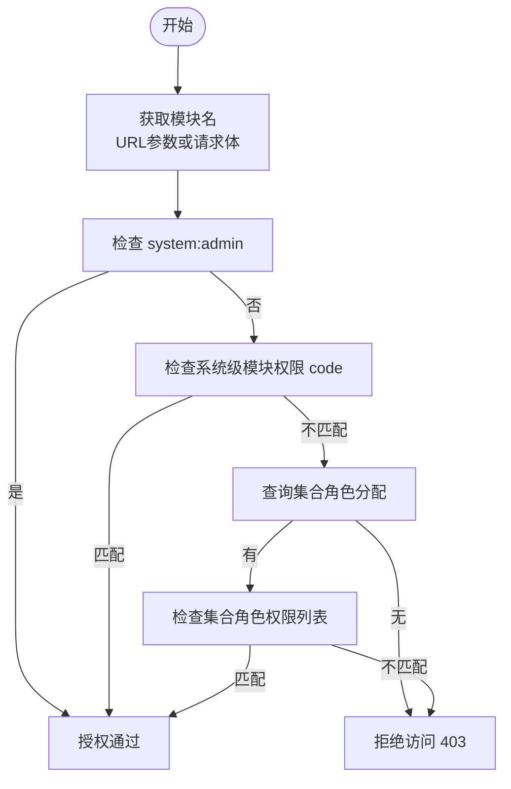
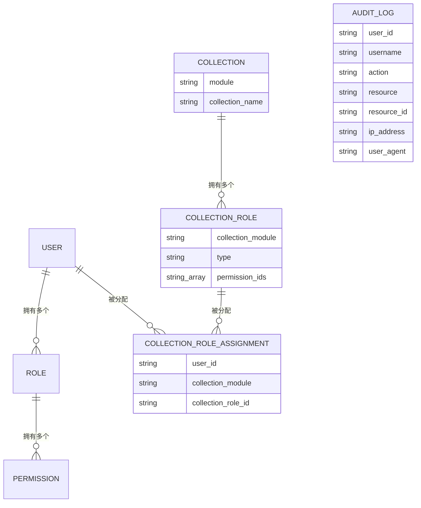
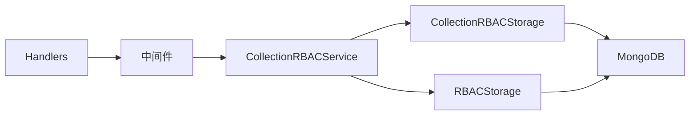

# 集合级权限控制

<cite>
**本文引用的文件**
- [collection_rbac.go](file://pkg/rbac/collection_rbac.go)
- [collection_permission_middleware.go](file://internal/api/collection_permission_middleware.go)
- [collection_rbac_storage.go](file://internal/storage/collection_rbac_storage.go)
- [rbac_storage.go](file://internal/storage/rbac_storage.go)
- [models.go](file://internal/models/models.go)
- [handlers.go](file://internal/api/handlers.go)
- [main.go](file://cmd/server/main.go)
- [requirements.md](file://docs/modules/collection/requirements.md)
- [tech.md](file://docs/modules/collection/tech.md)
- [rbac.md](file://docs/rbac.md)
- [collection_roles_test.go](file://test/collection_roles_test.go)
</cite>

## 目录
1. [简介](#简介)
2. [项目结构](#项目结构)
3. [核心组件](#核心组件)
4. [架构总览](#架构总览)
5. [详细组件分析](#详细组件分析)
6. [依赖分析](#依赖分析)
7. [性能考虑](#性能考虑)
8. [故障排查指南](#故障排查指南)
9. [结论](#结论)
10. [附录](#附录)

## 简介
本技术文档围绕“集合级权限控制系统”展开，系统通过“两层 RBAC”实现双重权限控制：系统级权限（如模块级权限 code）与集合级角色分配相结合，确保对业务数据集合（如电影、音乐、书籍）的细粒度访问控制。文档涵盖：
- 集合级权限与系统级权限的区别与应用场景
- 为什么需要双重权限控制
- 集合级权限的数据模型设计与字段定义
- 权限分配与管理机制（用户对特定集合的读写权限）
- 权限验证流程（集合标识符获取与权限匹配算法）
- 与业务数据的集成方案（数据访问控制与软删除权限）
- 性能优化策略与最佳实践
- 审计日志与安全监控机制

## 项目结构
系统采用分层架构，核心模块如下：
- API 层：路由注册与中间件（集合级权限中间件、系统级权限中间件）
- 服务层：集合级 RBAC 服务（权限检查、角色创建/分配/移除、审计日志）
- 存储层：系统 RBAC 存储（用户/角色/权限）与集合 RBAC 存储（集合角色/分配/审计）
- 模型层：统一的数据模型（用户、权限、角色、集合、集合角色、审计日志等）

图表来源
- [handlers.go:45-181](file://internal/api/handlers.go#L45-L181)
- [collection_permission_middleware.go:16-48](file://internal/api/collection_permission_middleware.go#L16-L48)
- [collection_rbac.go:27-37](file://pkg/rbac/collection_rbac.go#L27-L37)
- [rbac.go:55-61](file://pkg/rbac/rbac.go#L55-L61)
- [collection_rbac_storage.go:15-33](file://internal/storage/collection_rbac_storage.go#L15-L33)
- [rbac_storage.go:16-50](file://internal/storage/rbac_storage.go#L16-L50)
- [models.go:247-364](file://internal/models/models.go#L247-L364)

章节来源
- [main.go:94-118](file://cmd/server/main.go#L94-L118)
- [handlers.go:45-181](file://internal/api/handlers.go#L45-L181)

## 核心组件
- 集合级 RBAC 服务：负责集合级权限检查、集合角色创建/删除、集合角色分配/移除、审计日志记录
- 集合级权限中间件：从 URL 或请求体提取集合模块名，调用服务进行权限校验
- 系统级 RBAC 服务：负责系统级权限检查（如 system:admin、模块级权限 code）
- 存储层接口：分别封装系统 RBAC 与集合 RBAC 的持久化逻辑
- 模型定义：统一的数据结构，支撑权限、角色、集合、审计等实体

章节来源
- [collection_rbac.go:27-37](file://pkg/rbac/collection_rbac.go#L27-L37)
- [collection_permission_middleware.go:16-48](file://internal/api/collection_permission_middleware.go#L16-L48)
- [rbac.go:55-61](file://pkg/rbac/rbac.go#L55-L61)
- [collection_rbac_storage.go:15-33](file://internal/storage/collection_rbac_storage.go#L15-L33)
- [rbac_storage.go:16-50](file://internal/storage/rbac_storage.go#L16-L50)
- [models.go:247-364](file://internal/models/models.go#L247-L364)

## 架构总览
集合级权限控制的整体流程：
- API 路由注册时挂载系统级与集合级中间件
- 集合级中间件从 URL 或请求体解析模块名
- 集合级 RBAC 服务按优先级检查权限：系统级超级管理员 → 系统级模块权限 → 集合角色分配 → 拒绝
- 成功后进入业务处理；失败返回 403

图表来源
- [handlers.go:88-132](file://internal/api/handlers.go#L88-L132)
- [collection_permission_middleware.go:16-48](file://internal/api/collection_permission_middleware.go#L16-L48)
- [collection_rbac.go:39-90](file://pkg/rbac/collection_rbac.go#L39-L90)
- [rbac_storage.go:166-200](file://internal/storage/rbac_storage.go#L166-L200)
- [collection_rbac_storage.go:196-207](file://internal/storage/collection_rbac_storage.go#L196-L207)

## 详细组件分析

### 组件 A：集合级 RBAC 服务
职责与流程：
- 权限检查：优先检查系统级超级管理员；其次检查系统级模块权限 code；最后检查集合角色分配与集合角色权限列表
- 角色创建：为模块自动生成 5 个权限与 3 个集合角色（Owner/Operator/Tourist），并同步创建系统角色
- 角色分配/移除：同步更新用户系统角色与集合角色分配
- 审计日志：记录关键操作

图表来源
- [collection_rbac.go:27-37](file://pkg/rbac/collection_rbac.go#L27-L37)
- [rbac_storage.go:16-50](file://internal/storage/rbac_storage.go#L16-L50)
- [collection_rbac_storage.go:15-33](file://internal/storage/collection_rbac_storage.go#L15-L33)

章节来源
- [collection_rbac.go:39-90](file://pkg/rbac/collection_rbac.go#L39-L90)
- [collection_rbac.go:92-194](file://pkg/rbac/collection_rbac.go#L92-L194)
- [collection_rbac.go:217-252](file://pkg/rbac/collection_rbac.go#L217-L252)
- [collection_rbac.go:254-278](file://pkg/rbac/collection_rbac.go#L254-L278)
- [collection_rbac.go:280-293](file://pkg/rbac/collection_rbac.go#L280-L293)

### 组件 B：集合级权限中间件
职责与流程：
- 从 URL 参数或请求体提取模块名
- 调用集合级 RBAC 服务进行权限检查
- 通过则放行，否则返回 403

图表来源
- [collection_permission_middleware.go:16-48](file://internal/api/collection_permission_middleware.go#L16-L48)
- [collection_permission_middleware.go:53-93](file://internal/api/collection_permission_middleware.go#L53-L93)
- [collection_permission_middleware.go:95-136](file://internal/api/collection_permission_middleware.go#L95-L136)

章节来源
- [collection_permission_middleware.go:16-48](file://internal/api/collection_permission_middleware.go#L16-L48)
- [collection_permission_middleware.go:53-93](file://internal/api/collection_permission_middleware.go#L53-L93)
- [collection_permission_middleware.go:95-136](file://internal/api/collection_permission_middleware.go#L95-L136)

### 组件 C：权限验证流程（集合标识符获取与匹配算法）
- 集合标识符获取：URL 参数（如 :module）或请求体（POST/PUT）中的 module 字段
- 匹配算法：
  1) 检查系统级超级管理员（system:admin）
  2) 检查系统级角色是否包含模块权限 code（如 movie:read）
  3) 查询集合角色分配，再检查集合角色的权限列表（如 :read、:write、:delete、:admin、:field:admin）
- 字段管理权限：先根据字段 ID 获取字段所属模块，再检查 :field:admin

图表来源
- [collection_rbac.go:39-90](file://pkg/rbac/collection_rbac.go#L39-L90)
- [collection_permission_middleware.go:25-31](file://internal/api/collection_permission_middleware.go#L25-L31)
- [collection_permission_middleware.go:70-77](file://internal/api/collection_permission_middleware.go#L70-L77)

章节来源
- [collection_rbac.go:39-90](file://pkg/rbac/collection_rbac.go#L39-L90)
- [collection_permission_middleware.go:25-31](file://internal/api/collection_permission_middleware.go#L25-L31)
- [collection_permission_middleware.go:70-77](file://internal/api/collection_permission_middleware.go#L70-L77)
- [collection_permission_middleware.go:108-132](file://internal/api/collection_permission_middleware.go#L108-L132)

### 组件 D：数据模型设计
- 用户（User）：包含角色 ID 列表
- 权限（Permission）：权限 code（如 movie:read）
- 角色（Role）：包含权限 ID 列表
- 集合（Collection）：模块名与集合名映射
- 集合角色（CollectionRole）：集合模块、角色类型、权限 code 列表
- 集合角色分配（CollectionRoleAssignment）：用户在某模块的角色分配
- 审计日志（AuditLog）：记录操作时间、用户、资源、IP、UA 等

图表来源
- [models.go:247-364](file://internal/models/models.go#L247-L364)

章节来源
- [models.go:247-364](file://internal/models/models.go#L247-L364)

### 组件 E：与业务数据的集成方案
- 数据访问控制：业务数据路由挂载集合级中间件，按模块进行读写权限控制
- 软删除权限：删除接口使用集合级删除权限；软删除相关路由（如 /deleted/*）使用系统级数据管理权限
- 字段管理权限：字段定义的更新/删除使用集合级 :field:admin 权限，先查询字段所属模块再校验

章节来源
- [handlers.go:105-132](file://internal/api/handlers.go#L105-L132)
- [handlers.go:134-140](file://internal/api/handlers.go#L134-L140)
- [handlers.go:88-103](file://internal/api/handlers.go#L88-L103)
- [collection_permission_middleware.go:95-136](file://internal/api/collection_permission_middleware.go#L95-L136)

## 依赖分析
- 组件耦合与内聚
  - CollectionRBACService 依赖 RBACStorage 与 CollectionRBACStorage，职责清晰，内聚度高
  - Handlers 通过中间件与服务解耦，路由层仅负责挂载中间件与业务处理
- 直接与间接依赖
  - 中间件直接依赖 CollectionRBACService
  - 服务层依赖存储层接口，避免对具体实现的耦合
- 外部依赖
  - MongoDB 存储（users、roles、permissions、collection_roles、collection_role_assignments、audit_logs）
  - Gin Web 框架
  - JWT 认证

图表来源
- [handlers.go:45-181](file://internal/api/handlers.go#L45-L181)
- [collection_rbac.go:27-37](file://pkg/rbac/collection_rbac.go#L27-L37)
- [collection_rbac_storage.go:43-62](file://internal/storage/collection_rbac_storage.go#L43-L62)
- [rbac_storage.go:60-79](file://internal/storage/rbac_storage.go#L60-L79)

章节来源
- [handlers.go:45-181](file://internal/api/handlers.go#L45-L181)
- [collection_rbac.go:27-37](file://pkg/rbac/collection_rbac.go#L27-L37)
- [collection_rbac_storage.go:43-62](file://internal/storage/collection_rbac_storage.go#L43-L62)
- [rbac_storage.go:60-79](file://internal/storage/rbac_storage.go#L60-L79)

## 性能考虑
- 索引策略
  - users.username、users.email（唯一索引）
  - roles.code、permissions.code（唯一索引）
  - users.role_ids、roles.permission_ids（数组索引）
- 查询优化
  - 避免 N+1 查询：批量获取用户角色、批量获取角色权限
  - 使用投影与分页，减少不必要的字段传输
- 缓存建议
  - 对热点权限与角色缓存短期有效缓存，降低数据库压力
- 并发与事务
  - 集合角色分配使用 Replace/Insert 语义，避免重复分配
  - 审计日志异步写入，不影响主流程

章节来源
- [rbac_storage.go:192-200](file://internal/storage/rbac_storage.go#L192-L200)
- [rbac_storage.go:261-269](file://internal/storage/rbac_storage.go#L261-L269)
- [collection_rbac_storage.go:131-156](file://internal/storage/collection_rbac_storage.go#L131-L156)
- [collection_rbac_storage.go:209-216](file://internal/storage/collection_rbac_storage.go#L209-L216)

## 故障排查指南
- 常见问题
  - 无用户 ID：中间件无法提取 user_id，返回 403
  - 模块名缺失：从 URL 或请求体无法解析 module，返回 400/403
  - 权限不足：CheckCollectionPermission 返回 false，返回 403
  - 集合角色未分配：查询不到集合角色分配，检查 AssignCollectionRole 流程
- 审计与监控
  - 审计日志记录操作人、资源、IP、UA，便于追踪
  - 建议接入集中式日志系统，设置告警阈值
- 单元测试
  - 集合角色创建测试覆盖权限矩阵与角色数量

章节来源
- [collection_permission_middleware.go:18-31](file://internal/api/collection_permission_middleware.go#L18-L31)
- [collection_permission_middleware.go:55-77](file://internal/api/collection_permission_middleware.go#L55-L77)
- [collection_rbac.go:280-293](file://pkg/rbac/collection_rbac.go#L280-L293)
- [collection_roles_test.go:33-105](file://test/collection_roles_test.go#L33-L105)

## 结论
集合级权限控制系统通过“系统级模块权限 + 集合级角色分配”的双重机制，实现了对业务数据集合的精细化访问控制。系统以中间件为核心，结合服务层与存储层，形成清晰的职责边界与良好的扩展性。配合完善的审计日志与索引策略，能够在保证安全性的同时兼顾性能与可观测性。

## 附录
- 文档参考
  - 集合模块需求与技术文档
  - 系统级 RBAC 设计文档
- 测试参考
  - 集合角色创建与权限矩阵测试

章节来源
- [requirements.md:70-87](file://docs/modules/collection/requirements.md#L70-L87)
- [tech.md:97-136](file://docs/modules/collection/tech.md#L97-L136)
- [rbac.md:26-45](file://docs/rbac.md#L26-L45)
- [collection_roles_test.go:33-105](file://test/collection_roles_test.go#L33-L105)