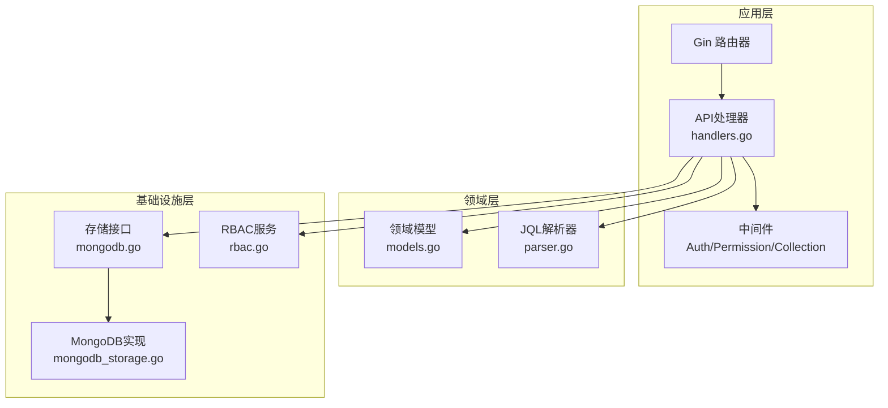
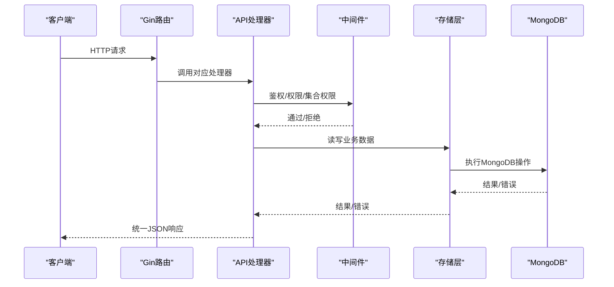
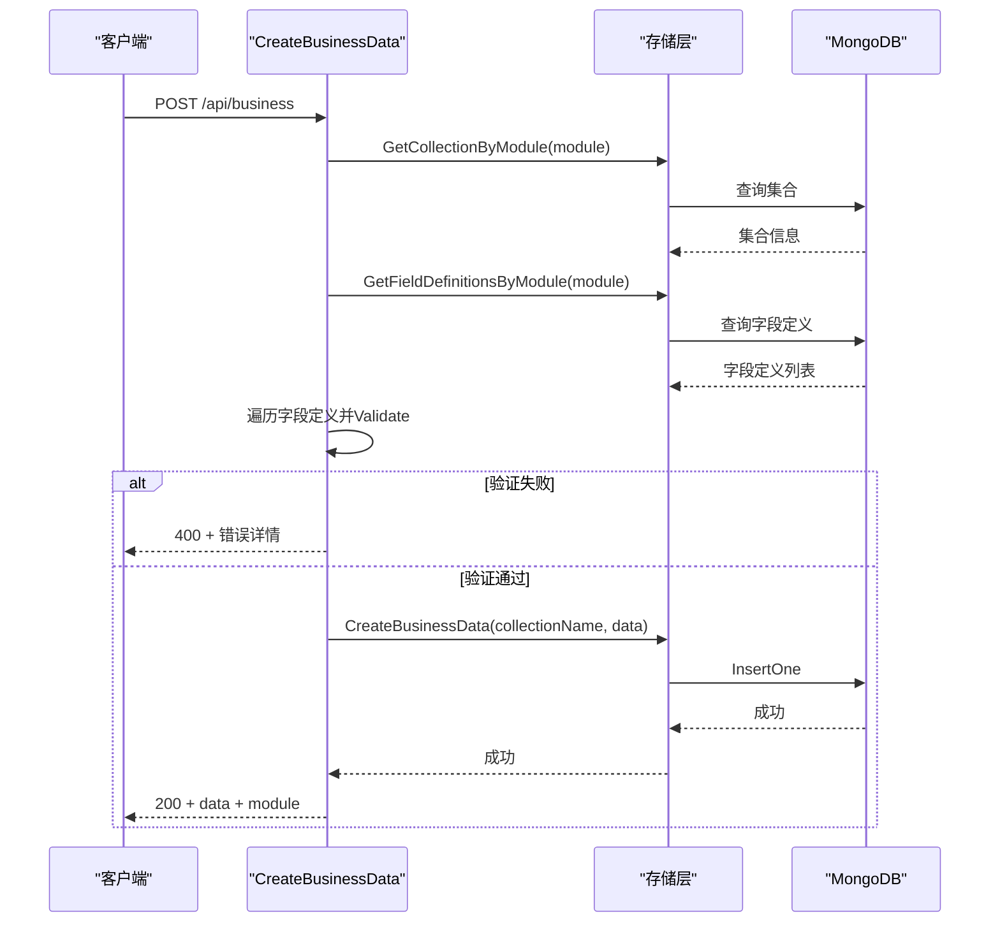
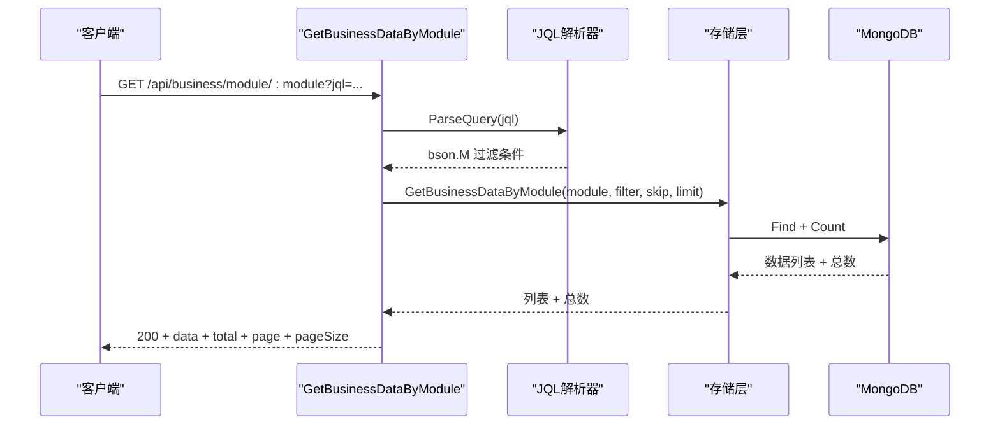
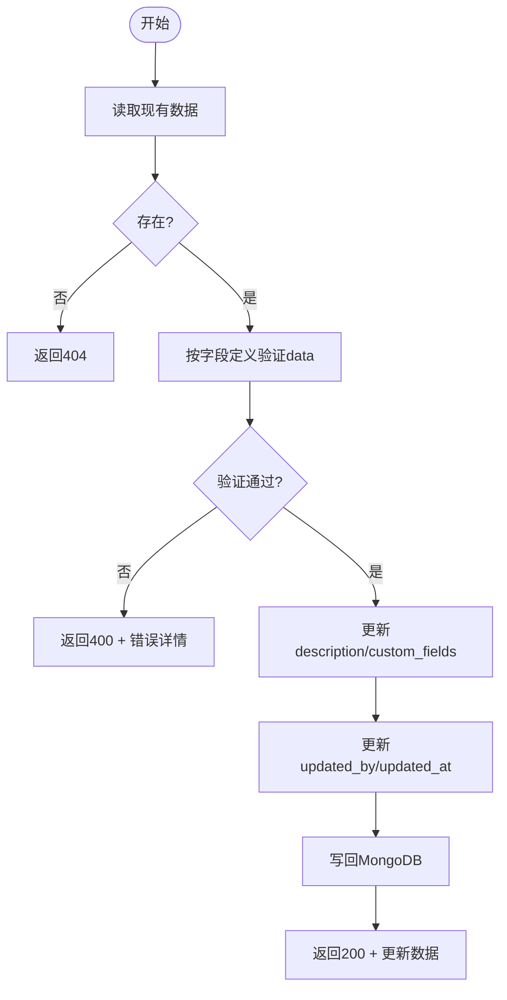
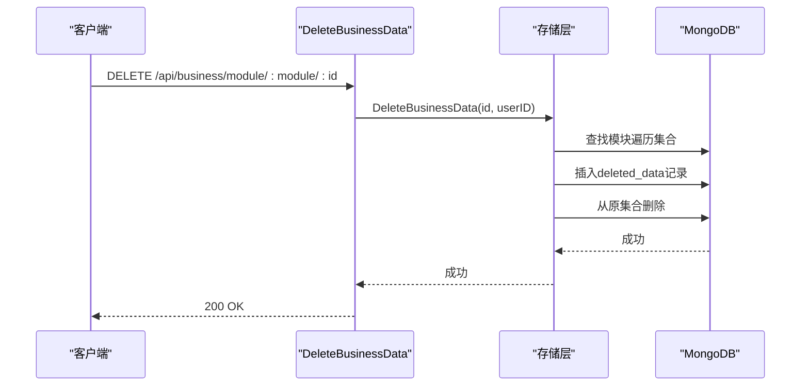
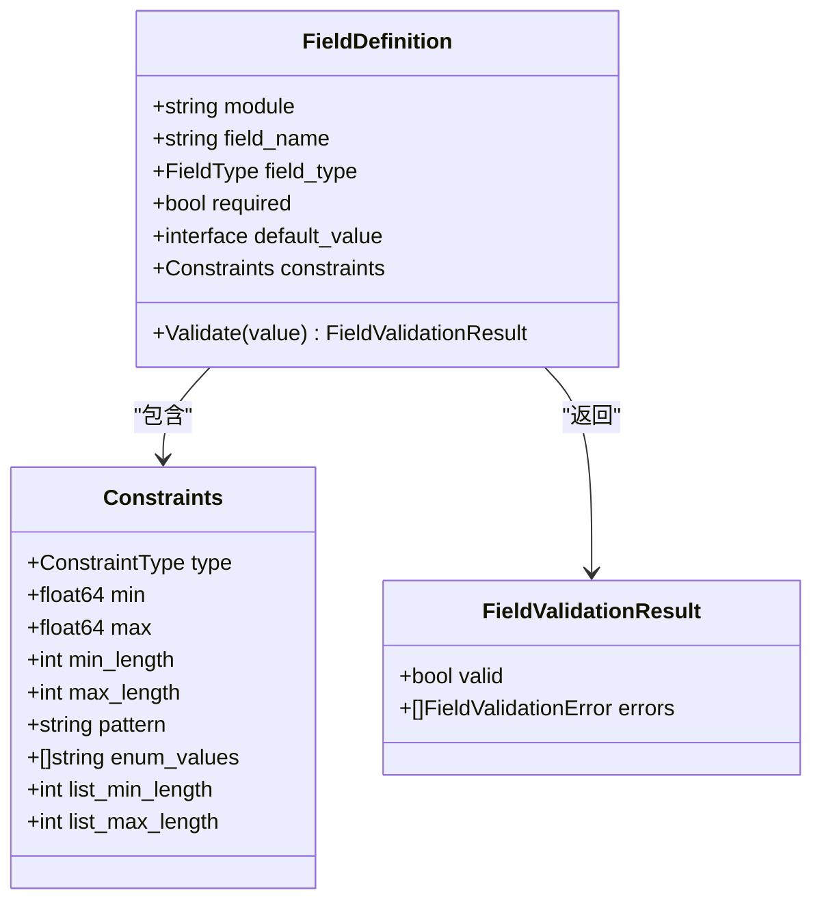
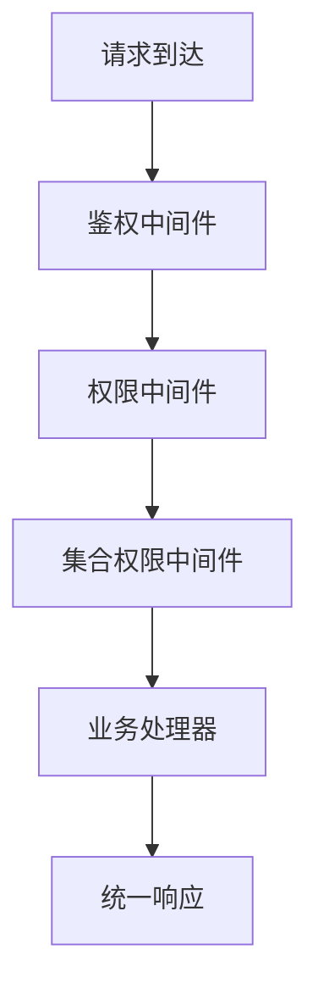
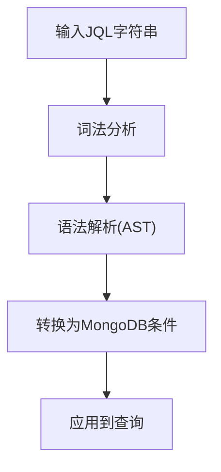
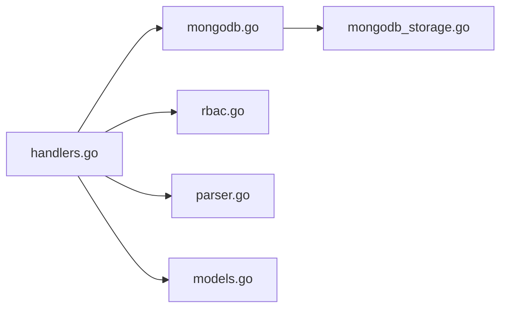

# CRUD操作API

<cite>
**本文引用的文件**
- [main.go](file://cmd/server/main.go)
- [handlers.go](file://internal/api/handlers.go)
- [mongodb_storage.go](file://internal/storage/mongodb_storage.go)
- [mongodb.go](file://internal/storage/mongodb.go)
- [models.go](file://internal/models/models.go)
- [collection_permission_middleware.go](file://internal/api/collection_permission_middleware.go)
- [rbac.go](file://pkg/rbac/rbac.go)
- [parser.go](file://pkg/jql/parser.go)
- [config.yaml](file://configs/config.yaml)
- [api.md](file://docs/api.md)
- [business-data.md](file://docs/business-data.md)
- [requirements.md](file://docs/modules/business-data/requirements.md)
- [implementation.md](file://docs/modules/business-data/implementation.md)
</cite>

## 目录
1. [简介](#简介)
2. [项目结构](#项目结构)
3. [核心组件](#核心组件)
4. [架构总览](#架构总览)
5. [详细组件分析](#详细组件分析)
6. [依赖关系分析](#依赖关系分析)
7. [性能考虑](#性能考虑)
8. [故障排除指南](#故障排除指南)
9. [结论](#结论)
10. [附录](#附录)

## 简介
本文件面向业务数据的CRUD操作API，系统化阐述HTTP端点设计、请求参数验证、响应格式标准化，以及软删除与硬删除策略。文档覆盖字段验证、默认值设置、唯一性检查、单条/批量查询、条件过滤、部分/全量更新等关键能力，并提供完整的API端点清单、请求示例、响应格式与错误码说明，帮助开发者快速集成与最佳实践落地。

## 项目结构
后端采用Go语言与Gin框架，数据持久化基于MongoDB，通过统一的存储接口抽象实现多类实体的CRUD。核心模块包括：
- 服务入口与路由注册：cmd/server/main.go
- API处理器与中间件：internal/api/handlers.go、collection_permission_middleware.go
- 存储层：internal/storage/mongodb_storage.go、internal/storage/mongodb.go
- 领域模型：internal/models/models.go
- 权限与RBAC：pkg/rbac/rbac.go
- 查询语言JQL：pkg/jql/parser.go
- 配置：configs/config.yaml
- API文档：docs/api.md、docs/business-data.md、docs/modules/business-data/*

图表来源
- [main.go:45-181](file://cmd/server/main.go#L45-L181)
- [handlers.go:23-43](file://internal/api/handlers.go#L23-L43)
- [mongodb.go:14-90](file://internal/storage/mongodb.go#L14-L90)
- [mongodb_storage.go:16-51](file://internal/storage/mongodb_storage.go#L16-L51)
- [models.go:12-365](file://internal/models/models.go#L12-L365)
- [rbac.go:55-99](file://pkg/rbac/rbac.go#L55-L99)
- [parser.go:46-653](file://pkg/jql/parser.go#L46-L653)

章节来源
- [main.go:24-167](file://cmd/server/main.go#L24-L167)
- [handlers.go:45-181](file://internal/api/handlers.go#L45-L181)

## 核心组件
- API处理器：负责路由注册、鉴权、权限校验、业务编排与响应封装。
- 存储接口：统一抽象各类实体的CRUD与聚合查询。
- MongoDB实现：具体实现业务数据、集合、字段定义、删除数据等的读写。
- 领域模型：BusinessData、FieldDefinition、DeletedData等，含字段验证逻辑。
- RBAC服务：基于角色的权限控制，支持系统管理员与集合级权限。
- JQL解析器：将人类可读查询语言转换为MongoDB查询条件。

章节来源
- [mongodb.go:14-90](file://internal/storage/mongodb.go#L14-L90)
- [mongodb_storage.go:16-51](file://internal/storage/mongodb_storage.go#L16-L51)
- [models.go:51-245](file://internal/models/models.go#L51-L245)
- [rbac.go:55-99](file://pkg/rbac/rbac.go#L55-L99)
- [parser.go:46-653](file://pkg/jql/parser.go#L46-L653)

## 架构总览
系统采用分层架构，HTTP请求经由Gin路由器进入API处理器，处理器调用存储层与领域模型，结合RBAC与JQL完成业务逻辑，最终以统一的JSON响应返回。

图表来源
- [main.go:94-118](file://cmd/server/main.go#L94-L118)
- [handlers.go:45-181](file://internal/api/handlers.go#L45-L181)
- [mongodb_storage.go:338-410](file://internal/storage/mongodb_storage.go#L338-L410)

## 详细组件分析

### 业务数据CRUD端点与流程

#### 1) 创建业务数据（CreateBusinessData）
- 端点：POST /api/business
- 请求参数：
  - module：模块标识（必填）
  - data/custom_fields：自定义字段映射
  - description：描述
- 流程要点：
  - 集合权限校验：CollectionPermissionMiddlewareFromBody
  - 模块集合存在性检查：GetCollectionByModule
  - 字段定义获取与逐字段验证：GetFieldDefinitionsByModule + FieldDefinition.Validate
  - 构造BusinessData并插入对应集合
- 响应：200 OK，包含message、data、module
- 错误：400（字段验证失败/模块不存在）、500（内部错误）

图表来源
- [handlers.go:942-1011](file://internal/api/handlers.go#L942-L1011)
- [mongodb_storage.go:338-347](file://internal/storage/mongodb_storage.go#L338-L347)
- [models.go:73-221](file://internal/models/models.go#L73-L221)

章节来源
- [handlers.go:942-1011](file://internal/api/handlers.go#L942-L1011)
- [mongodb_storage.go:338-347](file://internal/storage/mongodb_storage.go#L338-L347)
- [models.go:73-221](file://internal/models/models.go#L73-L221)
- [implementation.md:23-100](file://docs/modules/business-data/implementation.md#L23-L100)

#### 2) 读取业务数据（GetBusinessDataByModule / GetBusinessDataByID）
- 端点：
  - GET /api/business/module/:module?page=&pageSize=&jql=
  - GET /api/business/module/:module/:id
- 查询能力：
  - 分页：page/pageSize 或 skip/limit
  - 条件过滤：JQL查询字符串，解析为MongoDB查询条件
- 响应：
  - 列表：data、total、page、pageSize
  - 详情：返回单条BusinessData
- 错误：404（数据不存在）、500（内部错误）

图表来源
- [handlers.go:1013-1049](file://internal/api/handlers.go#L1013-L1049)
- [parser.go:625-628](file://pkg/jql/parser.go#L625-L628)
- [mongodb_storage.go:366-395](file://internal/storage/mongodb_storage.go#L366-L395)

章节来源
- [handlers.go:1013-1061](file://internal/api/handlers.go#L1013-L1061)
- [parser.go:46-653](file://pkg/jql/parser.go#L46-L653)
- [mongodb_storage.go:366-395](file://internal/storage/mongodb_storage.go#L366-L395)

#### 3) 更新业务数据（UpdateBusinessData）
- 端点：PUT /api/business/module/:module/:id
- 请求参数：
  - description、data、custom_fields（可选）
- 流程要点：
  - 读取现有数据
  - 若data存在，按字段定义进行验证
  - 更新字段与审计字段（updated_by/updated_at）
  - 写回MongoDB
- 响应：200 OK，返回更新后的BusinessData
- 错误：400（字段验证失败）、404（数据不存在）、500（内部错误）

图表来源
- [handlers.go:1063-1125](file://internal/api/handlers.go#L1063-L1125)
- [mongodb_storage.go:397-409](file://internal/storage/mongodb_storage.go#L397-L409)

章节来源
- [handlers.go:1063-1125](file://internal/api/handlers.go#L1063-L1125)
- [mongodb_storage.go:397-409](file://internal/storage/mongodb_storage.go#L397-L409)

#### 4) 删除业务数据（DeleteBusinessData）与恢复
- 端点：
  - DELETE /api/business/module/:module/:id
  - POST /api/deleted/:id/recover
- 删除策略：软删除
  - 在deleted_data集合中创建DeletedData记录
  - 从原集合中删除对应文档
- 恢复策略：从deleted_data读取并写回原集合，随后删除deleted_data中的记录
- 响应：
  - 删除：200 OK
  - 恢复：200 OK + message

图表来源
- [handlers.go:1127-1141](file://internal/api/handlers.go#L1127-L1141)
- [mongodb_storage.go:411-493](file://internal/storage/mongodb_storage.go#L411-L493)

章节来源
- [handlers.go:1127-1187](file://internal/api/handlers.go#L1127-L1187)
- [mongodb_storage.go:411-562](file://internal/storage/mongodb_storage.go#L411-L562)

### 字段验证与约束
- 字段定义模型包含类型、必填、默认值、约束（最小/最大、最小/最大长度、正则、枚举、数组长度等）
- 验证流程：按字段定义逐一校验，返回错误详情数组
- 支持类型：字符串、数字、布尔、日期、数组、对象
- 约束：数值范围、字符串长度、正则匹配、枚举值、数组长度

图表来源
- [models.go:39-71](file://internal/models/models.go#L39-L71)
- [models.go:51-221](file://internal/models/models.go#L51-L221)

章节来源
- [models.go:39-71](file://internal/models/models.go#L39-L71)
- [models.go:51-221](file://internal/models/models.go#L51-L221)
- [implementation.md:230-306](file://docs/modules/business-data/implementation.md#L230-L306)

### 权限与中间件
- 鉴权中间件：校验Authorization头与JWT有效性
- 权限中间件：基于RBAC服务检查用户是否具备所需权限
- 集合权限中间件：针对集合级别的读写/删除权限进行校验
- API权限映射：根据HTTP方法与路径自动推导所需权限

图表来源
- [handlers.go:260-314](file://internal/api/handlers.go#L260-L314)
- [collection_permission_middleware.go:16-93](file://internal/api/collection_permission_middleware.go#L16-L93)
- [rbac.go:63-99](file://pkg/rbac/rbac.go#L63-L99)

章节来源
- [handlers.go:260-314](file://internal/api/handlers.go#L260-L314)
- [collection_permission_middleware.go:16-93](file://internal/api/collection_permission_middleware.go#L16-L93)
- [rbac.go:63-99](file://pkg/rbac/rbac.go#L63-L99)

### JQL查询语言
- 支持操作符：=、!=、>、<、>=、<=、~（正则）、IN、NOT IN、IS NULL、IS NOT NULL
- 支持逻辑运算：AND、OR、NOT
- 支持函数：CurrentUser、Now、StartOfDay、EndOfDay、StartOfWeek、EndOfWeek、StartOfMonth、EndOfMonth
- 解析流程：词法分析 -> AST构建 -> 转换为MongoDB查询条件

图表来源
- [parser.go:46-653](file://pkg/jql/parser.go#L46-L653)

章节来源
- [parser.go:46-653](file://pkg/jql/parser.go#L46-L653)

## 依赖关系分析
- Handler依赖Storage接口，实现解耦与可测试性
- Storage依赖MongoDB驱动，封装集合操作
- RBAC服务依赖存储层获取用户、角色、权限信息
- JQL解析器独立于业务逻辑，便于扩展

图表来源
- [handlers.go:23-43](file://internal/api/handlers.go#L23-L43)
- [mongodb.go:14-90](file://internal/storage/mongodb.go#L14-L90)
- [mongodb_storage.go:16-51](file://internal/storage/mongodb_storage.go#L16-L51)
- [rbac.go:55-99](file://pkg/rbac/rbac.go#L55-L99)
- [parser.go:46-653](file://pkg/jql/parser.go#L46-L653)
- [models.go:12-365](file://internal/models/models.go#L12-L365)

章节来源
- [handlers.go:23-43](file://internal/api/handlers.go#L23-L43)
- [mongodb.go:14-90](file://internal/storage/mongodb.go#L14-L90)
- [mongodb_storage.go:16-51](file://internal/storage/mongodb_storage.go#L16-L51)
- [rbac.go:55-99](file://pkg/rbac/rbac.go#L55-L99)
- [parser.go:46-653](file://pkg/jql/parser.go#L46-L653)
- [models.go:12-365](file://internal/models/models.go#L12-L365)

## 性能考虑
- 分页与排序：列表查询默认按更新时间倒序，支持skip/limit或page/pageSize
- 索引管理：集合支持创建/删除索引，建议为常用过滤字段建立索引
- 查询优化：JQL解析后直接映射为MongoDB条件，避免复杂嵌套
- 字段验证：单次验证在微秒级完成，确保高吞吐场景下的低延迟

## 故障排除指南
- 认证失败：401 未认证/Token无效/Token过期
- 权限不足：403 无权限访问
- 资源不存在：404 用户/角色/权限/集合/数据不存在
- 参数错误：400 字段验证失败/模块不存在/JQL语法错误
- 服务器错误：500 内部错误

章节来源
- [api.md:797-800](file://docs/api.md#L797-L800)
- [rbac.md:467-482](file://docs/rbac.md#L467-L482)

## 结论
本系统通过清晰的分层架构、完善的权限控制与严格的字段验证，实现了业务数据的标准化CRUD操作。软删除机制保障了数据可追溯性，JQL查询语言提升了灵活性。建议在生产环境中配合索引策略与监控告警，持续优化查询性能与稳定性。

## 附录

### 完整API端点清单（节选）
- 业务数据
  - POST /api/business
  - GET /api/business/module/:module
  - GET /api/business/module/:module/:id
  - PUT /api/business/module/:module/:id
  - DELETE /api/business/module/:module/:id
- 已删除数据
  - GET /api/deleted/module/:module
  - GET /api/deleted/:id
  - POST /api/deleted/:id/recover

章节来源
- [business-data.md:250-281](file://docs/business-data.md#L250-L281)
- [api.md:372-494](file://docs/api.md#L372-L494)

### 请求示例与响应格式
- 创建业务数据
  - 请求体：包含module、data/custom_fields、description
  - 响应：200 + message + data + module
- 列表查询
  - 请求参数：page/pageSize 或 skip/limit，可选jql
  - 响应：200 + data + total + page + pageSize
- 更新业务数据
  - 请求体：description、data、custom_fields（可选）
  - 响应：200 + 更新后的BusinessData
- 删除与恢复
  - 删除：200 OK
  - 恢复：200 OK + message

章节来源
- [api.md:421-460](file://docs/api.md#L421-L460)
- [api.md:374-413](file://docs/api.md#L374-L413)
- [api.md:470-487](file://docs/api.md#L470-L487)
- [api.md:488-493](file://docs/api.md#L488-L493)
- [api.md:686-705](file://docs/api.md#L686-L705)

### 最佳实践
- 在创建前先确认模块集合存在
- 使用JQL进行复杂条件过滤，避免多次往返
- 对高频查询字段建立索引
- 使用软删除保存审计轨迹
- 严格遵守字段定义约束，减少脏数据