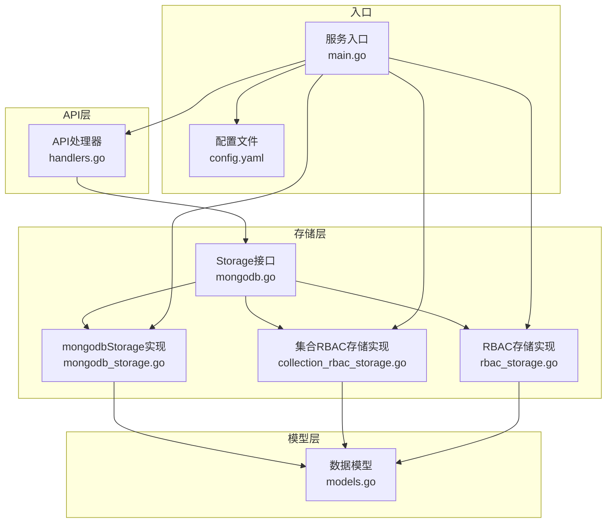
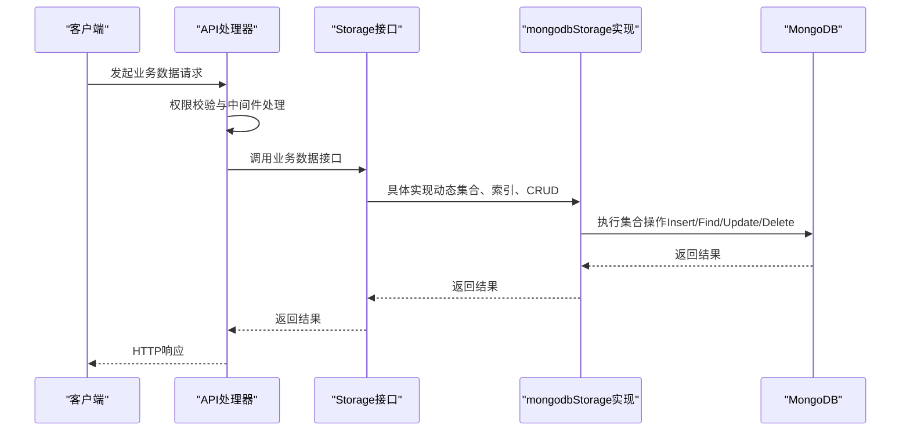
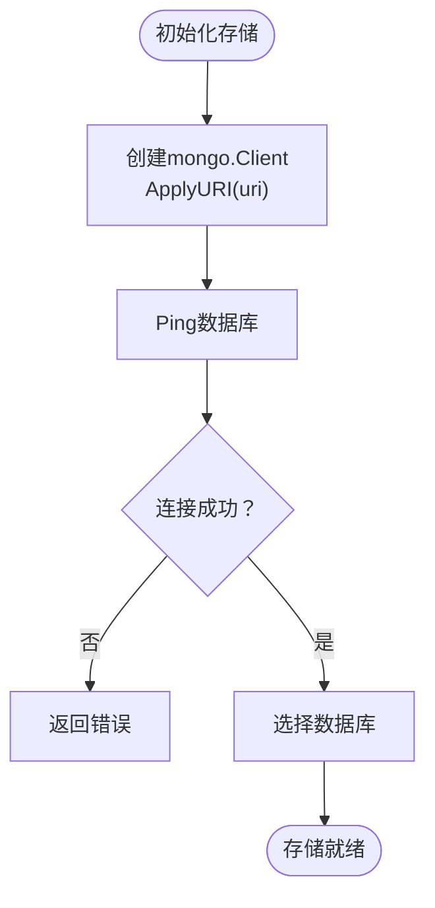
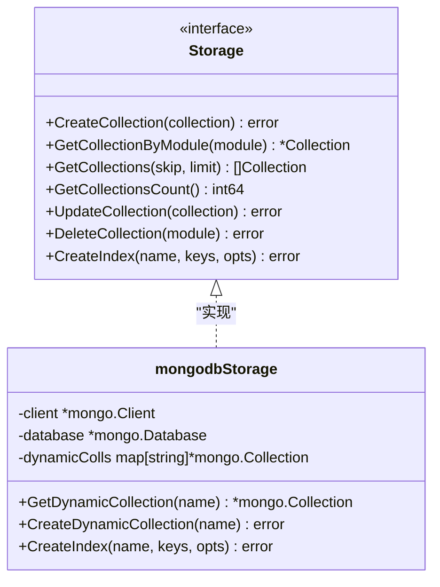
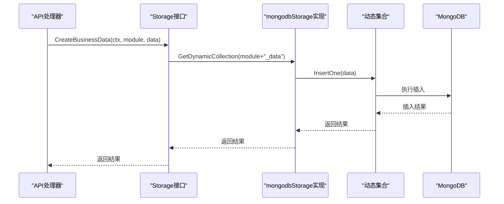
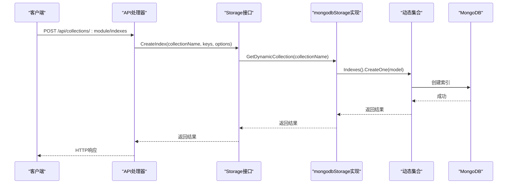
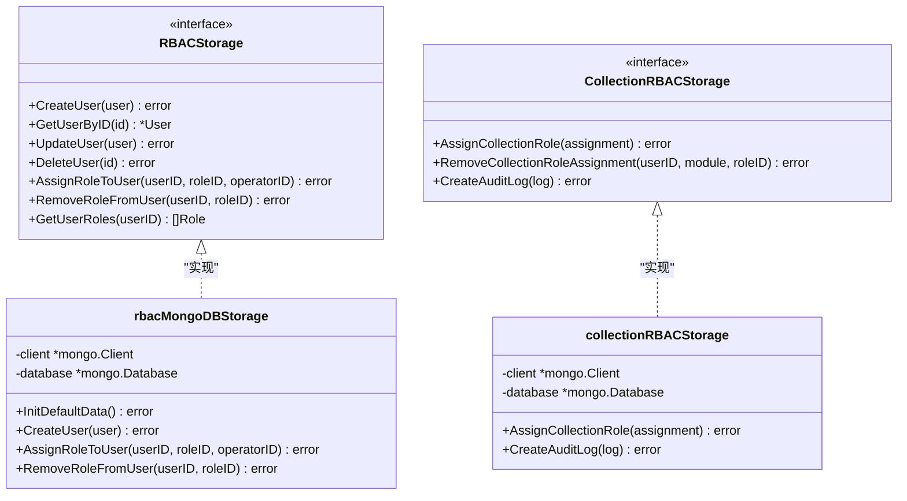
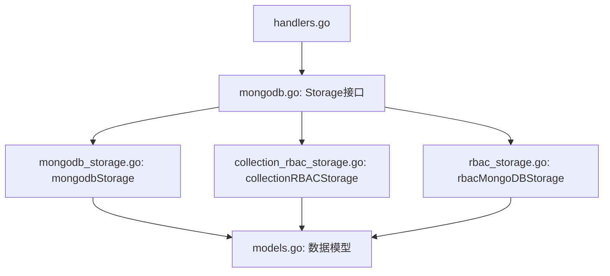

# MongoDB存储层

<cite>
**本文档引用的文件**
- [mongodb.go](file://internal/storage/mongodb.go)
- [mongodb_storage.go](file://internal/storage/mongodb_storage.go)
- [collection_rbac_storage.go](file://internal/storage/collection_rbac_storage.go)
- [rbac_storage.go](file://internal/storage/rbac_storage.go)
- [models.go](file://internal/models/models.go)
- [handlers.go](file://internal/api/handlers.go)
- [main.go](file://cmd/server/main.go)
- [config.yaml](file://configs/config.yaml)
</cite>

## 目录
1. [简介](#简介)
2. [项目结构](#项目结构)
3. [核心组件](#核心组件)
4. [架构总览](#架构总览)
5. [详细组件分析](#详细组件分析)
6. [依赖关系分析](#依赖关系分析)
7. [性能考量](#性能考量)
8. [故障排查指南](#故障排查指南)
9. [结论](#结论)
10. [附录](#附录)

## 简介
本文件面向MongoDB存储层的技术文档，聚焦于连接管理、集合与索引管理、数据持久化、权限控制、查询优化与一致性保障。文档基于仓库现有实现进行深入分析，并提供架构图、流程图与最佳实践建议，帮助开发者理解与扩展存储层能力。

## 项目结构
存储层位于internal/storage目录，采用按功能域划分的模块化组织：
- mongodb.go：统一的存储接口定义，涵盖用户、权限、角色、字段定义、业务数据、刮削任务、集合管理等接口。
- mongodb_storage.go：MongoDB具体实现，包含连接建立、动态集合管理、索引管理、各类CRUD操作。
- collection_rbac_storage.go：集合级别的RBAC存储实现，负责集合角色、分配与审计日志。
- rbac_storage.go：系统级RBAC存储实现，负责用户、角色、权限的CRUD与默认数据初始化。
- models.go：数据模型定义，包含业务数据、删除数据、用户、角色、权限、集合、集合角色、审计日志等。
- handlers.go：API处理器，提供集合索引管理、业务数据访问、集合RBAC等功能的HTTP接口。
- main.go：服务入口，初始化MongoDB连接、RBAC默认数据、刮削系统与HTTP服务。
- config.yaml：应用配置，包含MongoDB连接参数等。

图表来源
- [mongodb.go:14-90](file://internal/storage/mongodb.go#L14-L90)
- [mongodb_storage.go:16-51](file://internal/storage/mongodb_storage.go#L16-L51)
- [collection_rbac_storage.go:15-62](file://internal/storage/collection_rbac_storage.go#L15-L62)
- [rbac_storage.go:16-79](file://internal/storage/rbac_storage.go#L16-L79)
- [models.go:12-365](file://internal/models/models.go#L12-L365)
- [handlers.go:23-43](file://internal/api/handlers.go#L23-L43)
- [main.go:42-92](file://cmd/server/main.go#L42-L92)
- [config.yaml:1-26](file://configs/config.yaml#L1-L26)

章节来源
- [mongodb.go:1-91](file://internal/storage/mongodb.go#L1-L91)
- [mongodb_storage.go:1-829](file://internal/storage/mongodb_storage.go#L1-L829)
- [collection_rbac_storage.go:1-244](file://internal/storage/collection_rbac_storage.go#L1-L244)
- [rbac_storage.go:1-476](file://internal/storage/rbac_storage.go#L1-L476)
- [models.go:1-365](file://internal/models/models.go#L1-L365)
- [handlers.go:1-1834](file://internal/api/handlers.go#L1-L1834)
- [main.go:1-167](file://cmd/server/main.go#L1-L167)
- [config.yaml:1-26](file://configs/config.yaml#L1-L26)

## 核心组件
- 存储接口（Storage）：统一抽象了用户、权限、角色、字段定义、业务数据、刮削任务、集合管理以及动态集合与索引管理的接口方法。
- mongodbStorage实现：负责MongoDB客户端连接、数据库选择、集合缓存、动态集合创建与索引管理，以及各类CRUD操作的具体实现。
- 集合RBAC存储：提供集合角色、角色分配与审计日志的CRUD与查询能力。
- RBAC存储：提供系统级用户、角色、权限的CRUD与默认数据初始化。
- 模型定义：定义了业务数据、删除数据、用户、角色、权限、集合、集合角色、审计日志等数据结构。
- API处理器：提供集合索引管理、业务数据访问、集合RBAC等功能的HTTP接口。
- 服务入口：初始化MongoDB连接、RBAC默认数据、刮削系统与HTTP服务。

章节来源
- [mongodb.go:14-90](file://internal/storage/mongodb.go#L14-L90)
- [mongodb_storage.go:16-829](file://internal/storage/mongodb_storage.go#L16-L829)
- [collection_rbac_storage.go:15-244](file://internal/storage/collection_rbac_storage.go#L15-L244)
- [rbac_storage.go:16-476](file://internal/storage/rbac_storage.go#L16-L476)
- [models.go:12-365](file://internal/models/models.go#L12-L365)
- [handlers.go:23-181](file://internal/api/handlers.go#L23-L181)
- [main.go:24-150](file://cmd/server/main.go#L24-L150)

## 架构总览
存储层采用接口驱动的实现模式，通过统一接口屏蔽不同集合的差异，同时提供动态集合与索引管理能力。API层通过中间件与权限校验，确保对集合数据的访问符合RBAC策略。

图表来源
- [handlers.go:105-132](file://internal/api/handlers.go#L105-L132)
- [mongodb.go:33-38](file://internal/storage/mongodb.go#L33-L38)
- [mongodb_storage.go:338-410](file://internal/storage/mongodb_storage.go#L338-L410)

## 详细组件分析

### 连接管理与健康检查
- 连接建立：通过ApplyURI创建mongo.Client，随后执行Ping验证连接可用性。
- 数据库选择：根据配置选择目标数据库实例。
- 连接池与超时：当前实现未显式配置连接池参数与超时选项；建议在生产环境显式设置连接池大小、最大空闲时间、连接生命周期等参数，以提升稳定性与资源利用率。
- 健康检查：通过client.Ping进行基础连通性检测；可结合监控指标定期探测数据库状态。

图表来源
- [mongodb_storage.go:27-51](file://internal/storage/mongodb_storage.go#L27-L51)
- [main.go:42-58](file://cmd/server/main.go#L42-L58)

章节来源
- [mongodb_storage.go:27-51](file://internal/storage/mongodb_storage.go#L27-L51)
- [main.go:42-58](file://cmd/server/main.go#L42-L58)

### 集合管理策略
- 动态集合创建：CreateDynamicCollection通过database.CreateCollection创建集合，并缓存到dynamicColls映射中，避免重复创建。
- 集合命名规范：业务数据集合采用“module”+“_data”的命名规则，便于按模块隔离与检索。
- 集合权限控制：通过集合RBAC中间件在API层对集合读写进行权限校验，确保仅授权用户可访问特定模块的数据。
- 集合级联删除：DeleteCollection在API层触发，实现集合、字段定义、业务数据、刮削任务等的级联清理。

图表来源
- [mongodb_storage.go:16-78](file://internal/storage/mongodb_storage.go#L16-L78)
- [mongodb.go:78-90](file://internal/storage/mongodb.go#L78-L90)

章节来源
- [mongodb_storage.go:62-78](file://internal/storage/mongodb_storage.go#L62-L78)
- [mongodb_storage.go:355-356](file://internal/storage/mongodb_storage.go#L355-L356)
- [handlers.go:161-179](file://internal/api/handlers.go#L161-L179)

### 数据持久化操作
- 插入：CreateBusinessData为业务数据生成ID并写入对应模块集合；用户、权限、角色、字段定义等均采用InsertOne写入。
- 更新：UpdateBusinessData根据模块拼接集合名并执行UpdateOne；用户、角色、权限等采用ReplaceOne或UpdateOne更新。
- 删除：DeleteBusinessData先定位模块集合，再写入删除记录并删除原数据；DeleteCollection在API层触发级联删除。
- 查询：GetBusinessDataByModule支持skip/limit/sort；CountDocuments用于统计；FindOne用于单条查询。

图表来源
- [mongodb_storage.go:338-347](file://internal/storage/mongodb_storage.go#L338-L347)
- [mongodb_storage.go:366-395](file://internal/storage/mongodb_storage.go#L366-L395)

章节来源
- [mongodb_storage.go:338-493](file://internal/storage/mongodb_storage.go#L338-L493)

### 索引设计与管理
- 索引创建：CreateIndex接收keys与IndexOptions，通过Indexes().CreateOne创建索引；API层提供HTTP接口支持动态创建、列出与删除索引。
- 索引选项：支持name、unique、background等常用选项；建议结合查询模式设计复合索引与文本索引。
- 索引维护：GetCollectionIndexes列出集合索引；DeleteCollectionIndex按名称删除索引。

图表来源
- [handlers.go:1578-1618](file://internal/api/handlers.go#L1578-L1618)
- [mongodb_storage.go:71-78](file://internal/storage/mongodb_storage.go#L71-L78)

章节来源
- [handlers.go:1578-1654](file://internal/api/handlers.go#L1578-L1654)
- [mongodb_storage.go:71-78](file://internal/storage/mongodb_storage.go#L71-L78)

### 权限控制与一致性
- 系统级RBAC：rbac_storage.go提供用户、角色、权限的CRUD与默认数据初始化；通过$addToSet/$pull等原子操作维护角色与权限关系。
- 集合级RBAC：collection_rbac_storage.go提供集合角色、分配与审计日志；API层通过中间件在业务数据访问前进行权限校验。
- 一致性保障：删除操作采用“先写入删除记录，再删除原数据”的两步法，确保可恢复性；审计日志记录关键操作。

图表来源
- [rbac_storage.go:16-79](file://internal/storage/rbac_storage.go#L16-L79)
- [collection_rbac_storage.go:15-62](file://internal/storage/collection_rbac_storage.go#L15-L62)

章节来源
- [rbac_storage.go:81-164](file://internal/storage/rbac_storage.go#L81-L164)
- [collection_rbac_storage.go:131-164](file://internal/storage/collection_rbac_storage.go#L131-L164)

### 查询优化与分页
- 投影查询：当前实现未显式使用投影字段；建议在高频查询场景中使用Projections减少网络传输与解析开销。
- 分页处理：GetBusinessDataByModule使用Find().SetSkip().SetLimit()实现分页；建议结合索引与排序字段优化分页性能。
- 聚合管道：当前未见聚合管道使用；对于复杂统计与多表关联，可考虑引入聚合管道以提升查询效率。

章节来源
- [mongodb_storage.go:366-395](file://internal/storage/mongodb_storage.go#L366-L395)

### 并发控制与事务处理
- 当前实现未使用MongoDB事务；所有操作均为单文档写入或集合级操作。
- 并发控制：通过API中间件与RBAC权限控制限制并发访问；建议在高并发场景下引入连接池参数与读写分离策略。
- 事务建议：对于跨集合的强一致写入，可考虑引入事务（需要MongoDB副本集或分片集群支持）。

章节来源
- [mongodb_storage.go:338-493](file://internal/storage/mongodb_storage.go#L338-L493)

## 依赖关系分析
存储层各组件之间的依赖关系如下：
- API处理器依赖Storage接口，通过接口解耦具体实现。
- mongodbStorage实现Storage接口，提供动态集合与索引管理能力。
- 集合RBAC存储与RBAC存储分别提供集合级与系统级权限控制。
- 模型定义贯穿所有组件，作为数据契约。

图表来源
- [handlers.go:23-43](file://internal/api/handlers.go#L23-L43)
- [mongodb.go:14-90](file://internal/storage/mongodb.go#L14-L90)
- [mongodb_storage.go:16-25](file://internal/storage/mongodb_storage.go#L16-L25)
- [collection_rbac_storage.go:35-41](file://internal/storage/collection_rbac_storage.go#L35-L41)
- [rbac_storage.go:52-58](file://internal/storage/rbac_storage.go#L52-L58)
- [models.go:12-365](file://internal/models/models.go#L12-L365)

章节来源
- [handlers.go:23-181](file://internal/api/handlers.go#L23-L181)
- [mongodb.go:14-90](file://internal/storage/mongodb.go#L14-L90)

## 性能考量
- 连接池配置：建议显式设置连接池大小、最大空闲时间、连接生命周期等参数，以提升并发与资源利用率。
- 索引设计：针对高频查询字段建立合适索引，避免全表扫描；复合索引需遵循最左前缀原则。
- 查询优化：使用投影字段减少传输；分页查询结合索引与排序字段；避免在大集合上进行昂贵的聚合操作。
- 并发与事务：高并发场景下引入连接池参数与读写分离；跨集合强一致写入可考虑事务（需集群支持）。
- 监控与告警：结合数据库监控指标定期评估性能瓶颈，及时调整索引与查询策略。

[本节为通用性能指导，不直接分析具体文件]

## 故障排查指南
- 连接失败：检查MONGODB_URI与数据库可达性；确认Ping阶段无异常。
- 权限不足：核对API中间件与集合RBAC配置，确保用户具备相应集合角色与权限。
- 查询缓慢：检查索引是否命中；优化查询条件与排序字段；考虑投影与分页策略。
- 删除不可恢复：确认删除流程是否先写入删除记录再删除原数据；必要时通过恢复接口恢复数据。

章节来源
- [mongodb_storage.go:27-51](file://internal/storage/mongodb_storage.go#L27-L51)
- [handlers.go:105-132](file://internal/api/handlers.go#L105-L132)
- [mongodb_storage.go:411-493](file://internal/storage/mongodb_storage.go#L411-L493)

## 结论
本存储层通过接口抽象与动态集合管理，提供了灵活的业务数据存储能力；配合集合级RBAC与审计日志，实现了细粒度的权限控制与可追溯性。建议在生产环境中完善连接池配置、索引策略与查询优化，并根据业务需求引入事务与监控体系，以进一步提升稳定性与性能。

[本节为总结性内容，不直接分析具体文件]

## 附录
- 配置参考：MongoDB连接URI与数据库名称可在配置文件中设置，服务入口会读取环境变量或配置文件进行初始化。
- API接口：集合索引管理、业务数据访问、集合RBAC等功能均有对应的HTTP接口，便于前端与外部系统集成。

章节来源
- [config.yaml:1-26](file://configs/config.yaml#L1-L26)
- [main.go:42-92](file://cmd/server/main.go#L42-L92)
- [handlers.go:1578-1654](file://internal/api/handlers.go#L1578-L1654)