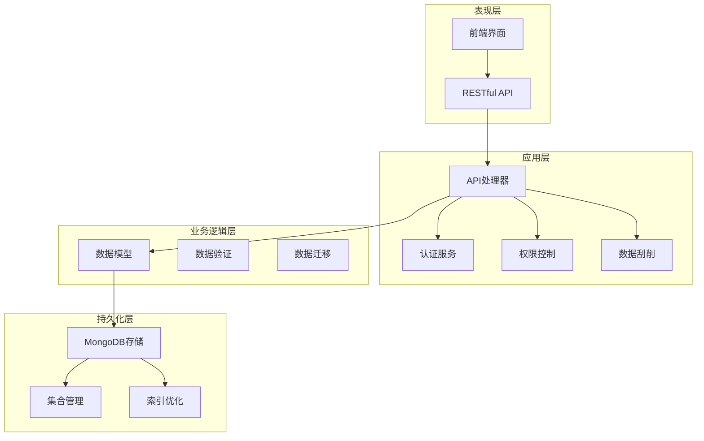
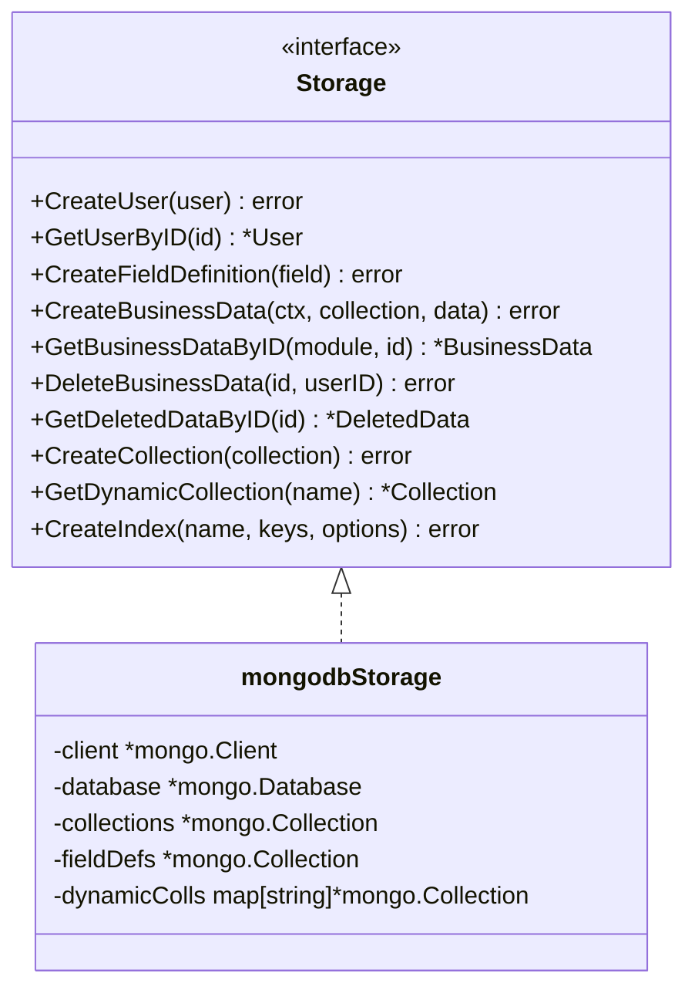
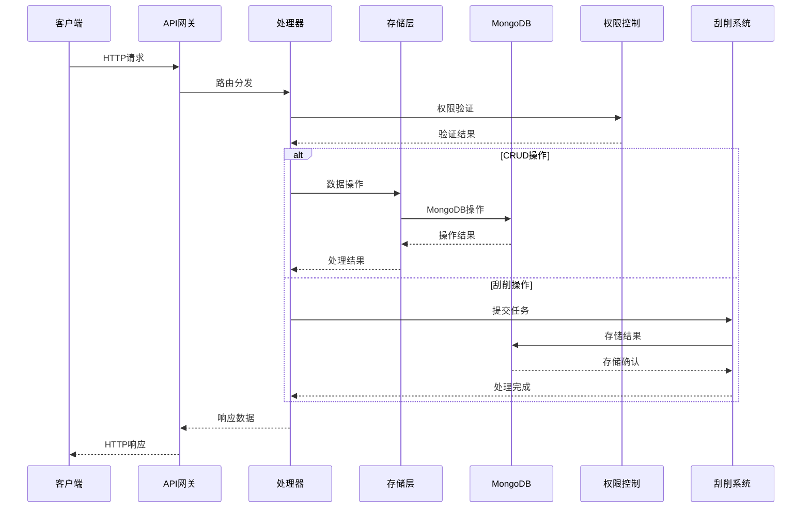
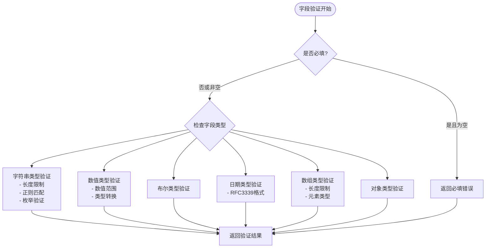
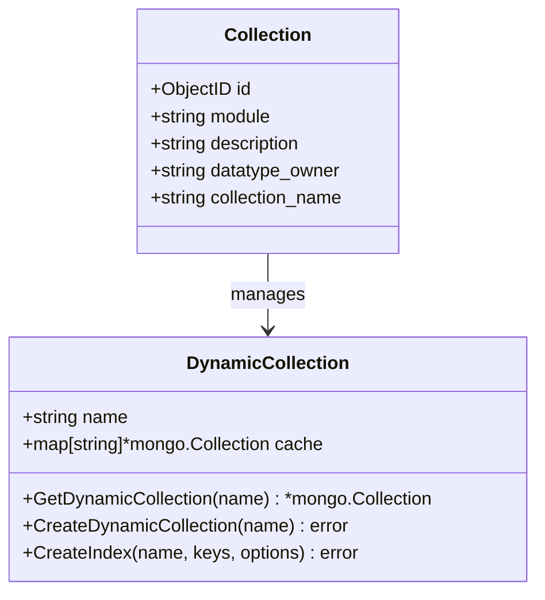
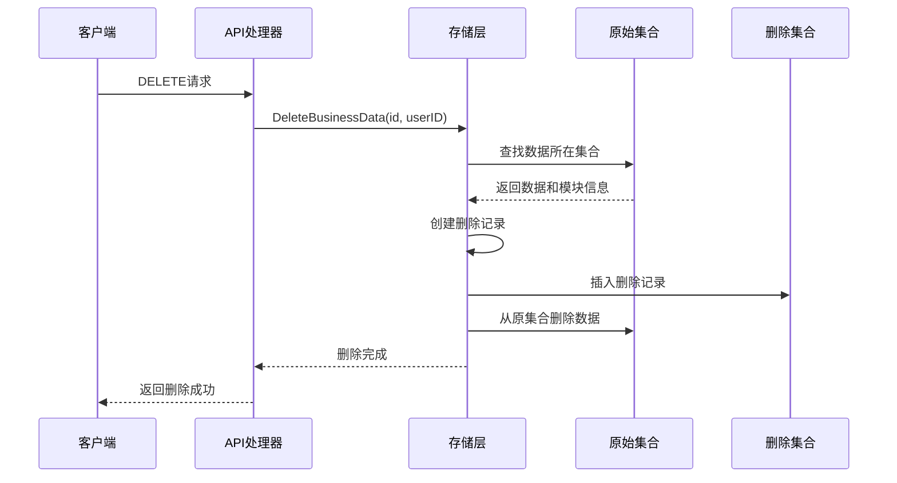
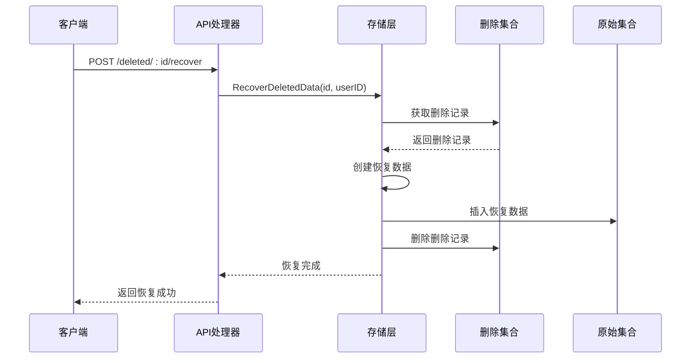
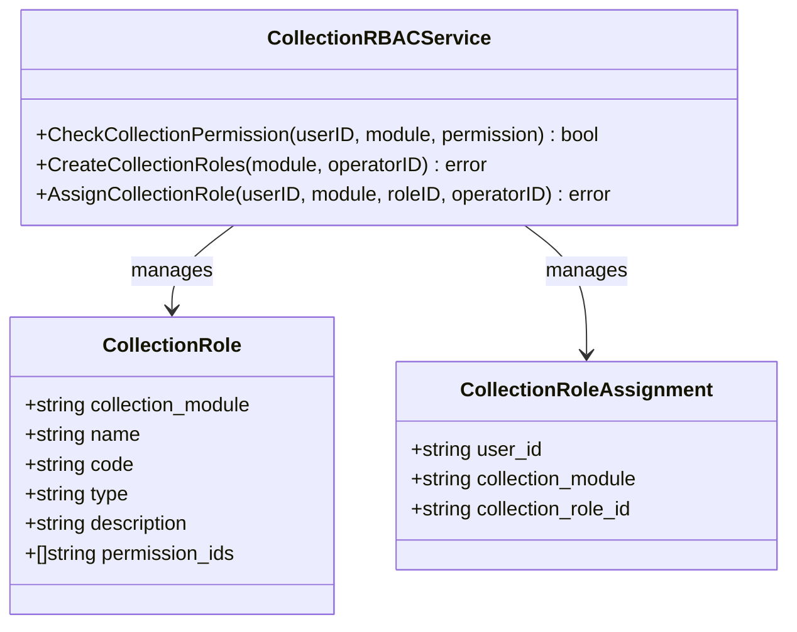
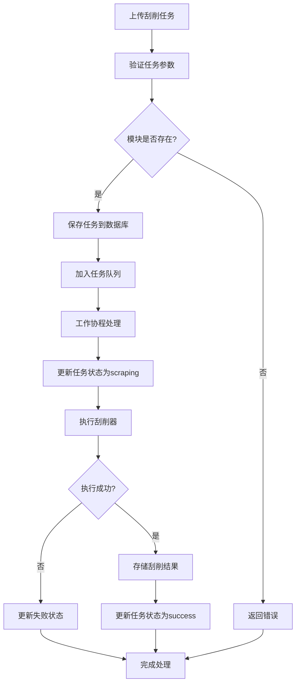
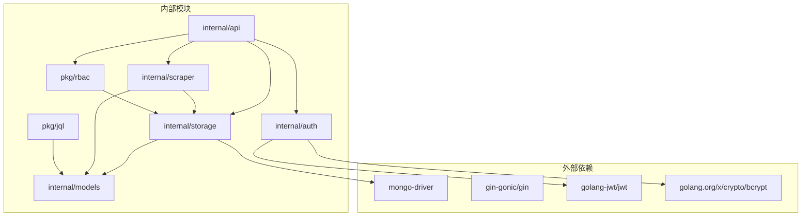

# 业务数据管理系统

<cite>
**本文档引用的文件**
- [main.go](file://cmd/server/main.go)
- [models.go](file://internal/models/models.go)
- [mongodb.go](file://internal/storage/mongodb.go)
- [mongodb_storage.go](file://internal/storage/mongodb_storage.go)
- [handlers.go](file://internal/api/handlers.go)
- [rbac_storage.go](file://internal/storage/rbac_storage.go)
- [collection_rbac_storage.go](file://internal/storage/collection_rbac_storage.go)
- [rbac.go](file://pkg/rbac/rbac.go)
- [collection_rbac.go](file://pkg/rbac/collection_rbac.go)
- [parser.go](file://pkg/jql/parser.go)
- [jwt.go](file://internal/auth/jwt.go)
- [scraper.go](file://internal/scraper/scraper.go)
- [business-data.md](file://docs/business-data.md)
- [api.md](file://docs/api.md)
</cite>

## 目录
1. [简介](#简介)
2. [项目结构](#项目结构)
3. [核心组件](#核心组件)
4. [架构概览](#架构概览)
5. [详细组件分析](#详细组件分析)
6. [依赖关系分析](#依赖关系分析)
7. [性能考虑](#性能考虑)
8. [故障排除指南](#故障排除指南)
9. [结论](#结论)
10. [附录](#附录)

## 简介

业务数据管理系统是一个基于Go语言构建的企业级数据管理平台，采用MongoDB作为主要存储引擎，提供完整的业务数据管理、动态数据模型、权限控制和数据刮削功能。系统支持动态字段定义、软删除机制、集合级权限控制和高性能查询优化。

该系统的核心特性包括：
- 动态数据模型设计，支持运行时字段定义和验证
- MongoDB存储层，包含集合管理、索引设计和查询优化
- 软删除机制，提供数据恢复和历史数据管理
- 完整的CRUD操作API，包含数据验证和错误处理
- 基于RBAC的权限控制系统，支持集合级权限管理
- JQL查询语言，提供灵活的数据过滤能力

## 项目结构

系统采用分层架构设计，主要分为以下几个层次：



**图表来源**
- [main.go:1-167](file://cmd/server/main.go#L1-L167)
- [handlers.go:1-1834](file://internal/api/handlers.go#L1-L1834)

**章节来源**
- [main.go:1-167](file://cmd/server/main.go#L1-L167)
- [business-data.md:1-519](file://docs/business-data.md#L1-L519)

## 核心组件

### 数据模型层

系统定义了完整的数据模型体系，支持动态字段定义和验证：

```mermaid
classDiagram
class BaseModel {
+string created_by
+time created_at
+string updated_by
+time updated_at
}
class FieldDefinition {
+ObjectID id
+string module
+string field_name
+FieldType field_type
+string description
+bool required
+interface default_value
+Constraints constraints
}
class BusinessData {
+ObjectID id
+string module
+string description
+map[string]interface{} custom_fields
+string file_path
}
class DeletedData {
+ObjectID id
+string module
+ObjectID original_id
+string description
+map[string]interface{} custom_fields
+string file_path
+time deleted_at
}
BaseModel <|-- FieldDefinition
BaseModel <|-- BusinessData
BaseModel <|-- DeletedData
```

**图表来源**
- [models.go:12-365](file://internal/models/models.go#L12-L365)

### 存储抽象层

系统实现了统一的存储接口，支持多种数据类型的持久化：



**图表来源**
- [mongodb.go:14-90](file://internal/storage/mongodb.go#L14-L90)
- [mongodb_storage.go:16-25](file://internal/storage/mongodb_storage.go#L16-L25)

**章节来源**
- [models.go:1-365](file://internal/models/models.go#L1-L365)
- [mongodb.go:1-91](file://internal/storage/mongodb.go#L1-L91)
- [mongodb_storage.go:1-829](file://internal/storage/mongodb_storage.go#L1-L829)

## 架构概览

系统采用微服务架构，主要组件协同工作：



**图表来源**
- [handlers.go:45-181](file://internal/api/handlers.go#L45-L181)
- [scraper.go:74-99](file://internal/scraper/scraper.go#L74-L99)

系统架构的关键特点：
- **模块化设计**：每个功能模块相对独立，便于维护和扩展
- **异步处理**：刮削任务采用异步处理，提升用户体验
- **权限控制**：多层次权限验证，确保数据安全
- **可扩展性**：支持动态集合创建和字段定义

**章节来源**
- [main.go:24-150](file://cmd/server/main.go#L24-L150)
- [handlers.go:1-1834](file://internal/api/handlers.go#L1-L1834)

## 详细组件分析

### 动态数据模型设计

系统实现了高度灵活的动态数据模型，支持运行时字段定义和验证：

#### 字段类型支持

系统支持多种数据类型，每种类型都有相应的验证规则：

| 字段类型 | 支持的约束 | 验证规则 |
|---------|-----------|---------|
| string | min_length, max_length, pattern, enum_values | 长度限制、正则匹配、枚举验证 |
| number | min, max | 数值范围验证 |
| boolean | 无 | 布尔值验证 |
| date | 无 | RFC3339格式验证 |
| array | list_min_length, list_max_length | 数组长度验证 |
| object | 无 | JSON对象验证 |

#### 字段验证机制



**图表来源**
- [models.go:73-221](file://internal/models/models.go#L73-L221)

**章节来源**
- [models.go:19-71](file://internal/models/models.go#L19-L71)
- [models.go:73-221](file://internal/models/models.go#L73-L221)

### MongoDB存储层实现

#### 集合管理

系统支持动态集合创建和管理，每个模块对应一个独立的MongoDB集合：



**图表来源**
- [models.go:313-320](file://internal/models/models.go#L313-L320)
- [mongodb_storage.go:53-78](file://internal/storage/mongodb_storage.go#L53-L78)

#### 索引设计

系统为关键集合建立了优化的索引策略：

| 集合名称 | 索引字段 | 索引类型 | 用途 |
|---------|---------|---------|------|
| collections | module | 唯一索引 | 快速查找模块 |
| field_definitions | module, field_name | 复合唯一索引 | 按模块和字段名查询 |
| scrape_tasks | module, status | 复合索引 | 按模块和状态查询任务 |
| scrape_tasks | created_at | 降序索引 | 按时间排序查询 |

#### 查询优化

系统采用多种查询优化策略：
- **复合索引**：针对常用查询组合建立复合索引
- **投影优化**：只返回需要的字段
- **分页查询**：支持大数据量的分页处理
- **查询缓存**：缓存常用的查询结果

**章节来源**
- [mongodb_storage.go:16-829](file://internal/storage/mongodb_storage.go#L16-L829)
- [business-data.md:399-425](file://docs/business-data.md#L399-L425)

### 软删除机制

系统实现了完整的软删除机制，确保数据的安全性和可恢复性：

#### 删除流程



**图表来源**
- [mongodb_storage.go:411-493](file://internal/storage/mongodb_storage.go#L411-L493)

#### 数据恢复流程



**图表来源**
- [mongodb_storage.go:527-562](file://internal/storage/mongodb_storage.go#L527-L562)

**章节来源**
- [mongodb_storage.go:411-569](file://internal/storage/mongodb_storage.go#L411-L569)
- [models.go:236-245](file://internal/models/models.go#L236-L245)

### 权限控制系统

系统采用基于RBAC的权限控制模型，支持细粒度的权限管理：

#### 权限类型

系统定义了多种权限类型：

| 权限类别 | 权限代码 | 描述 |
|---------|---------|------|
| 用户管理 | user:read, user:write, user:manage | 用户相关的读写管理权限 |
| 角色管理 | role:read, role:write, role:manage | 角色相关的读写管理权限 |
| 权限管理 | permission:read, permission:write, permission:manage | 权限相关的读写管理权限 |
| 集合管理 | collection:read, collection:write, collection:manage | 集合相关的读写管理权限 |
| 字段管理 | field:read, field:write, field:manage | 字段相关的读写管理权限 |
| 数据管理 | data:read, data:write, data:manage | 数据相关的读写管理权限 |
| 刮削管理 | scrape:read, scrape:write, scrape:manage | 刮削任务相关的读写管理权限 |

#### 集合级权限控制

系统还支持集合级别的权限控制，为每个模块定义专门的角色：



**图表来源**
- [models.go:328-351](file://internal/models/models.go#L328-L351)
- [collection_rbac.go:27-90](file://pkg/rbac/collection_rbac.go#L27-L90)

**章节来源**
- [rbac.go:10-53](file://pkg/rbac/rbac.go#L10-L53)
- [collection_rbac.go:13-90](file://pkg/rbac/collection_rbac.go#L13-L90)
- [rbac_storage.go:16-50](file://internal/storage/rbac_storage.go#L16-L50)

### 数据刮削系统

系统内置了强大的数据刮削功能，支持异步并发处理：

#### 刮削流程



**图表来源**
- [scraper.go:74-193](file://internal/scraper/scraper.go#L74-L193)

#### 并发处理

系统支持配置化的并发处理：
- **工作协程池**：可配置的工作协程数量，默认4个
- **任务队列**：支持1000个任务的队列容量
- **异步处理**：任务提交立即返回，后台异步执行

**章节来源**
- [scraper.go:18-45](file://internal/scraper/scraper.go#L18-L45)
- [scraper.go:74-289](file://internal/scraper/scraper.go#L74-L289)

### JQL查询语言

系统提供了JQL（JSON Query Language）查询语言，支持复杂的查询条件：

#### JQL语法支持

| 操作符 | 语法 | 描述 | 示例 |
|-------|------|------|------|
| 等于 | field=value | 等值比较 | status="active" |
| 不等于 | field!=value | 不等比较 | category!="deleted" |
| 大于 | field>value | 大于比较 | price>100 |
| 小于 | field<value | 小于比较 | age<65 |
| 大于等于 | field>=value | 大于等于 | score>=60 |
| 小于等于 | field<=value | 小于等于 | count<=1000 |
| 正则匹配 | field~pattern | 正则表达式 | name~"产品" |
| IN操作 | field IN (values) | 包含比较 | status IN ("active","pending") |
| NOT IN | field NOT IN (values) | 不包含比较 | category NOT IN ("deleted","archived") |
| IS NULL | field IS NULL | 空值检查 | assignee IS NULL |
| IS NOT NULL | field IS NOT NULL | 非空检查 | email IS NOT NULL |

#### 时间函数支持

JQL支持多种时间函数：

| 函数 | 描述 | 示例 |
|------|------|------|
| Now() | 当前时间 | created>Now() |
| StartOfDay() | 当天开始时间 | created>StartOfDay() |
| EndOfDay() | 当天结束时间 | created<EndOfDay() |
| StartOfWeek() | 当周开始时间 | created>StartOfWeek() |
| EndOfWeek() | 当周结束时间 | created<EndOfWeek() |
| StartOfMonth() | 当月开始时间 | created>StartOfMonth() |
| EndOfMonth() | 当月结束时间 | created<EndOfMonth() |

**章节来源**
- [parser.go:12-30](file://pkg/jql/parser.go#L12-L30)
- [parser.go:46-628](file://pkg/jql/parser.go#L46-L628)

## 依赖关系分析

系统采用清晰的依赖关系设计，确保模块间的松耦合：



**图表来源**
- [main.go:13-22](file://cmd/server/main.go#L13-L22)
- [handlers.go:3-21](file://internal/api/handlers.go#L3-L21)

系统的主要依赖特点：
- **明确的边界**：每个模块都有清晰的职责边界
- **接口抽象**：通过接口定义模块间交互契约
- **依赖注入**：通过构造函数注入依赖，便于测试和替换
- **版本管理**：使用go.mod管理依赖版本

**章节来源**
- [main.go:1-167](file://cmd/server/main.go#L1-L167)
- [handlers.go:1-1834](file://internal/api/handlers.go#L1-L1834)

## 性能考虑

系统在设计时充分考虑了性能优化：

### 查询性能优化

1. **索引策略**：为常用查询字段建立合适的索引
2. **查询投影**：只返回需要的字段，减少网络传输
3. **分页处理**：支持大数据量的分页查询
4. **查询缓存**：缓存常用的查询结果

### 并发处理优化

1. **异步处理**：刮削任务异步执行，不阻塞主线程
2. **工作协程池**：可配置的工作协程数量
3. **任务队列**：支持大量任务的排队处理
4. **资源限制**：防止内存和CPU过度消耗

### 存储优化

1. **集合分离**：每个模块独立集合，避免数据竞争
2. **动态集合**：支持运行时创建集合
3. **索引管理**：提供索引创建和删除接口
4. **数据压缩**：支持MongoDB的压缩功能

## 故障排除指南

### 常见问题及解决方案

#### 数据库连接问题

**问题症状**：系统启动时报数据库连接错误

**可能原因**：
- MongoDB连接字符串配置错误
- MongoDB服务未启动
- 网络连接问题

**解决步骤**：
1. 检查环境变量配置
2. 验证MongoDB服务状态
3. 测试网络连通性
4. 查看详细的错误日志

#### 权限验证失败

**问题症状**：用户无法访问某些功能

**可能原因**：
- 用户权限不足
- 角色配置错误
- 权限缓存问题

**解决步骤**：
1. 检查用户角色分配
2. 验证权限配置
3. 清除权限缓存
4. 重新登录系统

#### 刮削任务失败

**问题症状**：刮削任务执行失败

**可能原因**：
- 刮削器脚本错误
- 数据文件不存在
- 模块配置错误

**解决步骤**：
1. 检查刮削器脚本语法
2. 验证数据文件路径
3. 确认模块配置正确
4. 查看刮削日志

**章节来源**
- [mongodb_storage.go:84-131](file://internal/storage/mongodb_storage.go#L84-L131)
- [scraper.go:195-231](file://internal/scraper/scraper.go#L195-L231)

## 结论

业务数据管理系统是一个功能完整、架构清晰的企业级数据管理平台。系统的主要优势包括：

1. **高度可扩展性**：支持动态字段定义和集合管理
2. **强大的权限控制**：基于RBAC的多层次权限管理
3. **高性能设计**：优化的查询和存储策略
4. **完整的生命周期管理**：支持软删除和数据恢复
5. **灵活的查询能力**：支持JQL查询语言
6. **异步处理能力**：支持并发数据刮削

系统适用于需要管理大量动态数据的企业应用场景，能够满足复杂的数据管理需求。通过合理的架构设计和优化策略，系统能够在保证功能完整性的同时，提供良好的性能表现。

## 附录

### API参考

系统提供完整的RESTful API，支持所有核心功能：

#### 认证相关
- `POST /api/auth/login` - 用户登录
- `POST /api/auth/register` - 用户注册

#### 用户管理
- `GET /api/users` - 获取用户列表
- `GET /api/users/:id` - 获取用户详情
- `POST /api/users` - 创建用户
- `PUT /api/users/:id` - 更新用户
- `DELETE /api/users/:id` - 删除用户

#### 权限管理
- `GET /api/permissions` - 获取权限列表
- `GET /api/permissions/:id` - 获取权限详情
- `POST /api/permissions` - 创建权限
- `PUT /api/permissions/:id` - 更新权限
- `DELETE /api/permissions/:id` - 删除权限

#### 角色管理
- `GET /api/roles` - 获取角色列表
- `GET /api/roles/:id` - 获取角色详情
- `POST /api/roles` - 创建角色
- `PUT /api/roles/:id` - 更新角色
- `DELETE /api/roles/:id` - 删除角色

#### 业务数据管理
- `POST /api/business` - 创建业务数据
- `GET /api/business/module/:module` - 获取业务数据列表
- `GET /api/business/module/:module/:id` - 获取业务数据详情
- `PUT /api/business/module/:module/:id` - 更新业务数据
- `DELETE /api/business/module/:module/:id` - 删除业务数据

#### 集合管理
- `POST /api/collections` - 创建集合
- `GET /api/collections` - 获取集合列表
- `GET /api/collections/:module` - 获取集合详情
- `PUT /api/collections/:module` - 更新集合
- `DELETE /api/collections/:module` - 删除集合
- `POST /api/collections/:module/indexes` - 创建索引
- `GET /api/collections/:module/indexes` - 获取索引列表
- `DELETE /api/collections/:module/indexes/:name` - 删除索引

#### 刮削任务管理
- `POST /api/scraper/upload` - 提交刮削任务
- `GET /api/scraper/tasks` - 获取刮削任务列表
- `GET /api/scraper/tasks/:id` - 获取任务详情
- `POST /api/scraper/tasks/:id/retry` - 重试失败任务
- `DELETE /api/scraper/tasks/:id` - 删除任务
- `POST /api/scraper/tasks/batch-delete` - 批量删除任务

#### 已删除数据管理
- `GET /api/deleted/module/:module` - 获取已删除数据列表
- `GET /api/deleted/:id` - 获取已删除数据详情
- `POST /api/deleted/:id/recover` - 恢复已删除数据

#### 已删除刮削任务管理
- `GET /api/deleted-scraper/module/:module` - 获取已删除任务列表
- `GET /api/deleted-scraper/:id` - 获取已删除任务详情
- `POST /api/deleted-scraper/:id/recover` - 恢复已删除任务

#### 字段定义管理
- `POST /api/fields` - 创建字段定义
- `GET /api/fields/module/:module` - 获取字段定义列表
- `GET /api/fields/:id` - 获取字段定义详情
- `PUT /api/fields/:id` - 更新字段定义
- `DELETE /api/fields/:id` - 删除字段定义

**章节来源**
- [api.md:1-872](file://docs/api.md#L1-L872)
- [business-data.md:233-282](file://docs/business-data.md#L233-L282)