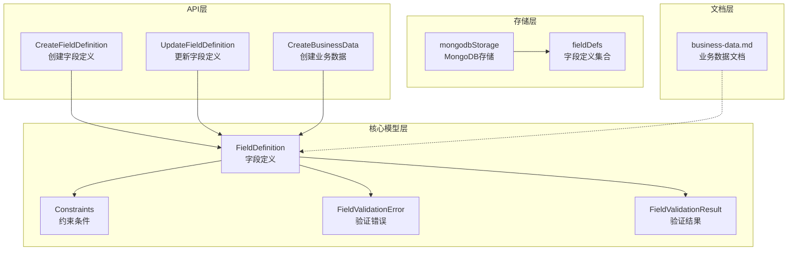
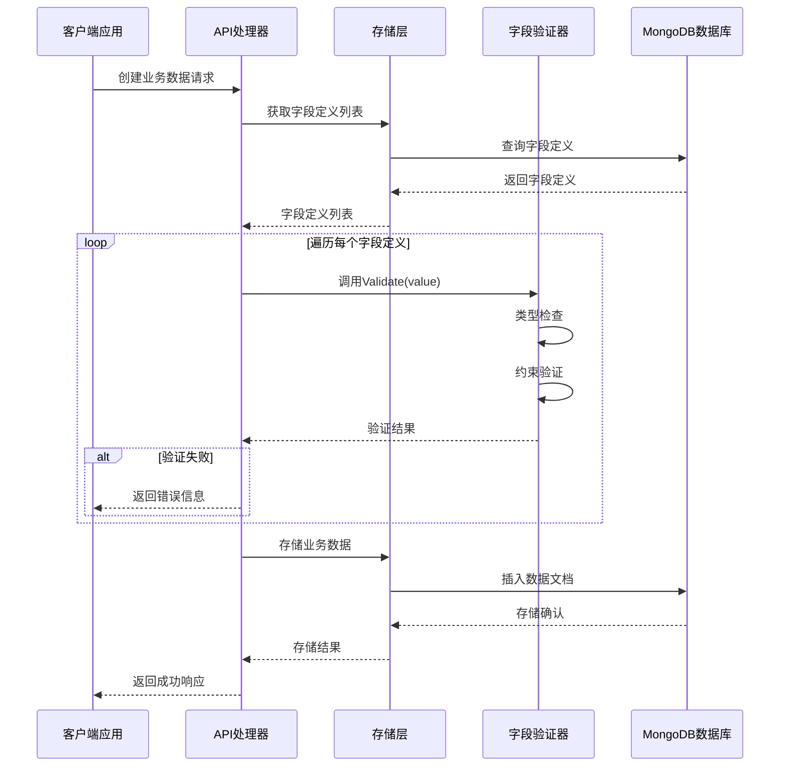
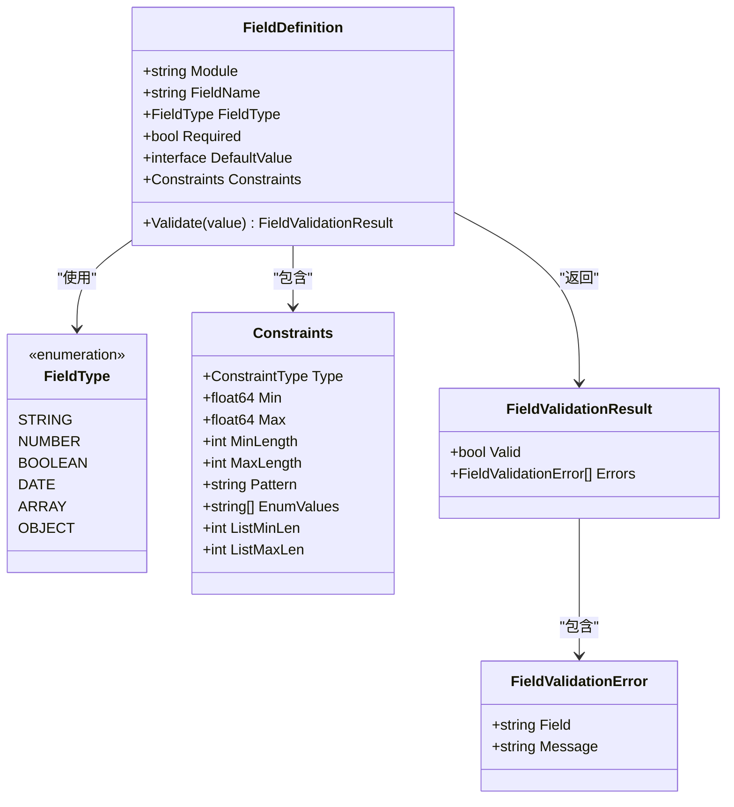
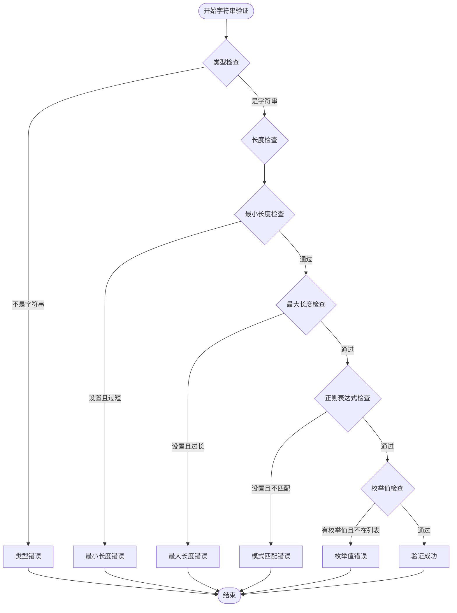
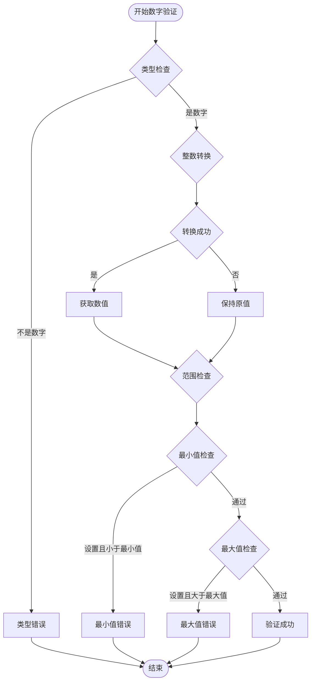
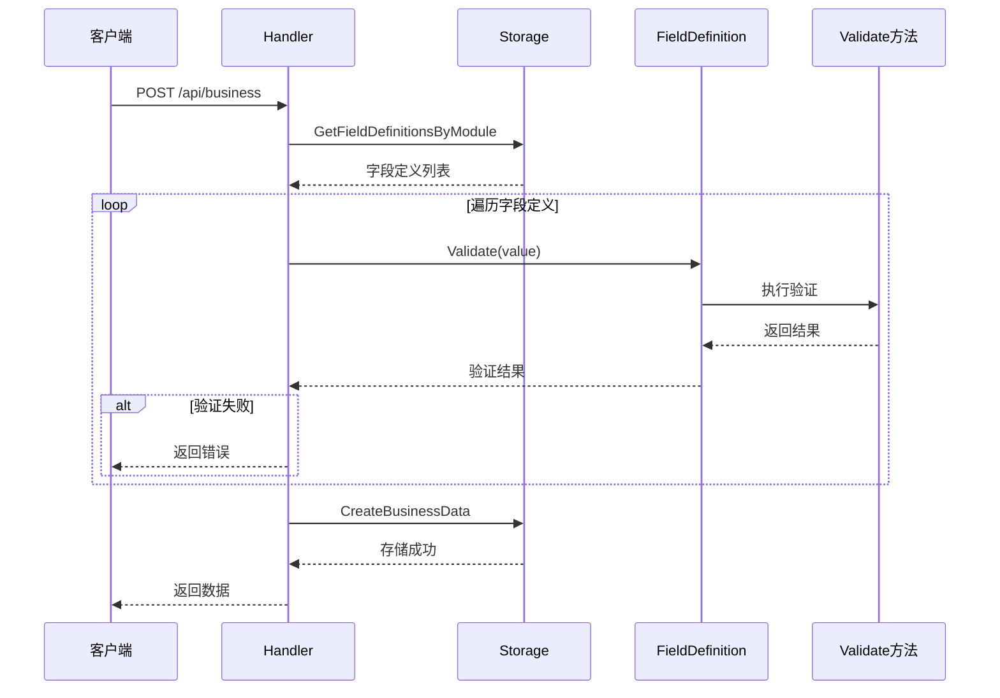
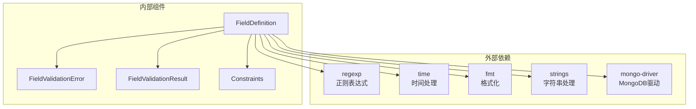

# 字段验证系统

<cite>
**本文档引用的文件**
- [models.go](file://internal/models/models.go)
- [handlers.go](file://internal/api/handlers.go)
- [mongodb_storage.go](file://internal/storage/mongodb_storage.go)
- [business-data.md](file://docs/business-data.md)
</cite>

## 目录
1. [简介](#简介)
2. [项目结构](#项目结构)
3. [核心组件](#核心组件)
4. [架构概览](#架构概览)
5. [详细组件分析](#详细组件分析)
6. [依赖分析](#依赖分析)
7. [性能考虑](#性能考虑)
8. [故障排除指南](#故障排除指南)
9. [结论](#结论)
10. [附录](#附录)

## 简介
字段验证系统是数据中心平台的核心功能模块，负责确保业务数据在存储前满足预定义的结构和约束要求。该系统提供了灵活的字段定义机制，支持多种数据类型和复杂的验证规则，包括必填字段检查、类型验证、范围限制、正则表达式匹配和枚举值验证等。

系统采用声明式的字段定义方式，通过FieldDefinition结构体描述每个字段的属性，包括字段类型、约束条件和默认值管理。验证过程贯穿整个数据生命周期，从字段定义创建到业务数据存储的全过程。

## 项目结构
字段验证系统主要分布在以下模块中：

**图表来源**
- [models.go:51-71](file://internal/models/models.go#L51-L71)
- [handlers.go:851-931](file://internal/api/handlers.go#L851-L931)
- [mongodb_storage.go:284-336](file://internal/storage/mongodb_storage.go#L284-L336)

**章节来源**
- [models.go:1-365](file://internal/models/models.go#L1-L365)
- [handlers.go:851-1011](file://internal/api/handlers.go#L851-L1011)

## 核心组件
字段验证系统由四个核心组件构成，每个组件都有明确的职责和交互关系：

### FieldDefinition 结构体
FieldDefinition是字段验证系统的核心数据结构，定义了单个字段的完整元数据信息：

- **基础属性**：模块标识、字段名称、字段类型
- **约束属性**：必填标志、默认值、约束条件对象
- **审计属性**：创建者、创建时间、更新者、更新时间

### Constraints 约束条件
Constraints结构体定义了字段的各种验证约束：
- 数字范围约束：最小值、最大值
- 字符串长度约束：最小长度、最大长度
- 正则表达式模式：Pattern
- 枚举值列表：EnumValues
- 数组长度约束：ListMinLen、ListMaxLen

### FieldValidationError 验证错误
FieldValidationError结构体封装了单个字段验证失败的信息：
- **字段名**：触发验证错误的具体字段
- **错误消息**：详细的错误描述信息

### FieldValidationResult 验证结果
FieldValidationResult结构体聚合了整个验证过程的结果：
- **有效性标志**：整体验证是否通过
- **错误列表**：所有验证失败的详细信息

**章节来源**
- [models.go:51-71](file://internal/models/models.go#L51-L71)
- [models.go:39-49](file://internal/models/models.go#L39-L49)

## 架构概览
字段验证系统采用分层架构设计，实现了清晰的关注点分离：

**图表来源**
- [handlers.go:962-976](file://internal/api/handlers.go#L962-L976)
- [models.go:73-221](file://internal/models/models.go#L73-L221)

系统架构的关键特性：
- **声明式验证**：字段定义决定验证行为
- **可扩展性**：支持新增字段类型和约束类型
- **一致性**：统一的验证错误处理机制
- **性能优化**：避免重复验证和不必要的计算

**章节来源**
- [handlers.go:942-1011](file://internal/api/handlers.go#L942-L1011)

## 详细组件分析

### 字段类型系统
系统支持五种基本字段类型，每种类型都有相应的验证规则：

**图表来源**
- [models.go:19-28](file://internal/models/models.go#L19-L28)
- [models.go:51-61](file://internal/models/models.go#L51-L61)
- [models.go:39-49](file://internal/models/models.go#L39-L49)

#### 字符串类型验证
字符串验证是最复杂的验证类型，包含多种约束检查：

**图表来源**
- [models.go:120-170](file://internal/models/models.go#L120-L170)

#### 数字类型验证
数字验证相对简单，主要关注数值范围：

**图表来源**
- [models.go:89-118](file://internal/models/models.go#L89-L118)

#### 日期类型验证
日期验证采用RFC3339标准格式：

**章节来源**
- [models.go:182-192](file://internal/models/models.go#L182-L192)

### 验证方法实现
Validate方法是字段验证系统的核心，实现了完整的验证逻辑：

#### 必填字段检查
系统首先检查字段是否为必填项，如果字段被标记为必填但值为空，则立即返回验证失败。

#### 类型验证流程
根据字段定义的类型，系统执行相应的类型检查：
- **字符串类型**：严格检查string类型
- **数字类型**：支持int和float64两种数值类型
- **布尔类型**：严格检查bool类型
- **日期类型**：检查字符串格式并解析为RFC3339格式
- **数组类型**：检查切片类型并验证长度约束

#### 约束验证顺序
对于每种数据类型，系统按照以下顺序执行约束验证：
1. 类型验证（必须首先通过）
2. 长度/范围验证（字符串长度、数字范围、数组长度）
3. 正则表达式验证
4. 枚举值验证

**章节来源**
- [models.go:73-221](file://internal/models/models.go#L73-L221)

### API集成点
字段验证系统与API层紧密集成，在业务数据创建过程中自动执行验证：

**图表来源**
- [handlers.go:962-976](file://internal/api/handlers.go#L962-L976)

**章节来源**
- [handlers.go:942-1011](file://internal/api/handlers.go#L942-L1011)

## 依赖分析
字段验证系统的依赖关系相对简单，主要依赖于标准库和MongoDB驱动：

**图表来源**
- [models.go:3-10](file://internal/models/models.go#L3-L10)

系统的主要依赖特征：
- **轻量级依赖**：仅使用Go标准库
- **零外部耦合**：不依赖第三方验证框架
- **MongoDB集成**：通过官方驱动程序访问数据库

**章节来源**
- [models.go:1-10](file://internal/models/models.go#L1-L10)

## 性能考虑
字段验证系统在设计时充分考虑了性能优化：

### 时间复杂度分析
- **类型检查**：O(1) - 基于类型断言的快速检查
- **字符串验证**：O(n) - n为字符串长度，主要受正则表达式影响
- **数字验证**：O(1) - 基本的数值比较操作
- **数组验证**：O(1) - 仅检查切片长度
- **整体验证**：O(k×n) - k为字段数量，n为最长字符串长度

### 内存使用优化
- **零拷贝设计**：尽量使用值传递而非指针传递
- **错误收集**：一次性收集所有错误，避免多次分配
- **字符串处理**：使用strings包进行高效的字符串操作

### 缓存策略
- **字段定义缓存**：API层可以缓存常用字段定义
- **正则表达式缓存**：系统会缓存编译后的正则表达式
- **类型转换缓存**：数字类型转换结果可重复使用

## 故障排除指南

### 常见验证错误类型
1. **类型不匹配错误**：值的实际类型与字段定义不符
2. **长度超出限制**：字符串长度或数组长度超出约束范围
3. **正则表达式不匹配**：值不符合指定的模式要求
4. **枚举值不在列表中**：值不是允许的枚举值之一
5. **必填字段缺失**：标记为必填的字段没有提供值

### 调试技巧
- **启用详细日志**：在开发环境中启用字段验证日志
- **单元测试**：为每个字段类型编写验证测试用例
- **边界值测试**：测试最小/最大值边界情况
- **正则表达式验证**：使用在线工具验证正则表达式正确性

### 性能问题诊断
- **验证延迟监控**：监控字段验证的执行时间
- **内存使用分析**：检查验证过程中的内存分配
- **数据库查询优化**：优化字段定义查询的性能

**章节来源**
- [models.go:63-71](file://internal/models/models.go#L63-L71)

## 结论
字段验证系统是一个设计精良、功能完整的数据验证解决方案。系统采用声明式的设计理念，通过清晰的抽象和严格的约束定义，确保了数据的一致性和完整性。

系统的主要优势包括：
- **灵活性**：支持多种数据类型和复杂的验证规则
- **可扩展性**：易于添加新的字段类型和验证约束
- **性能**：优化的算法和数据结构保证了高效的验证性能
- **易用性**：简洁的API设计降低了使用门槛

未来可以考虑的改进方向：
- **异步验证**：对于复杂的验证逻辑可以考虑异步执行
- **缓存机制**：实现字段定义和验证结果的缓存
- **分布式验证**：支持跨服务的字段验证协调

## 附录

### 字段验证最佳实践
1. **合理设置必填字段**：仅对真正重要的字段设置必填
2. **使用合适的约束**：根据业务需求设置合理的约束范围
3. **正则表达式优化**：使用高效的正则表达式模式
4. **枚举值管理**：维护稳定的枚举值列表
5. **错误消息本地化**：提供用户友好的错误消息

### 常见使用场景
1. **用户注册表单**：邮箱格式验证、密码强度检查
2. **产品信息录入**：价格范围验证、SKU格式检查
3. **订单处理**：数量验证、地址格式检查
4. **报表数据**：日期范围验证、数值精度控制

### API参考
字段验证系统提供的主要API接口：
- **字段定义管理**：创建、更新、删除字段定义
- **业务数据验证**：自动验证业务数据的完整性
- **自定义验证规则**：支持基于正则表达式的自定义验证