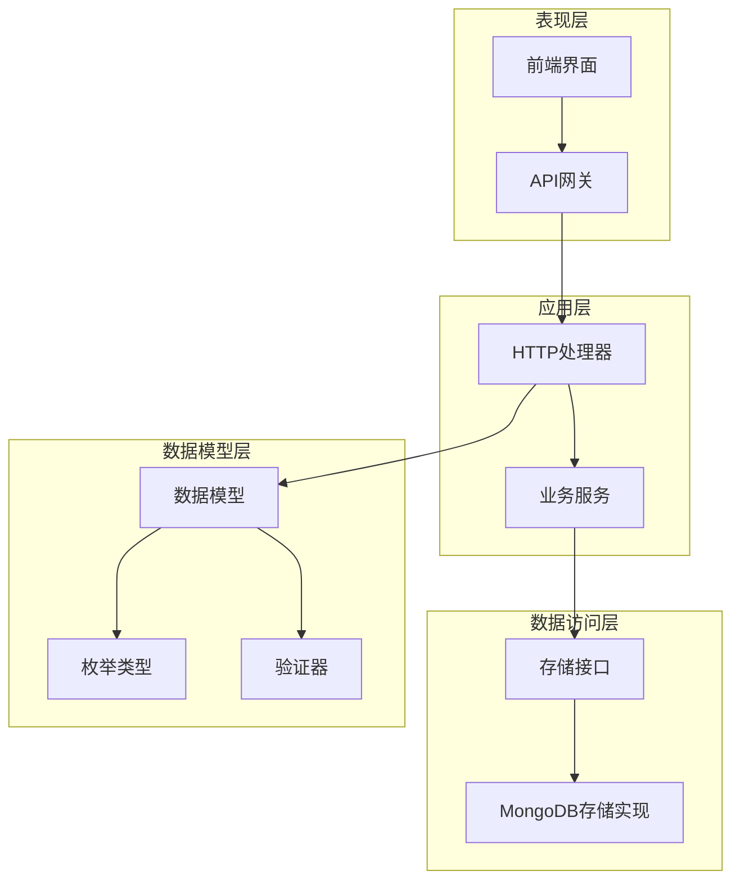
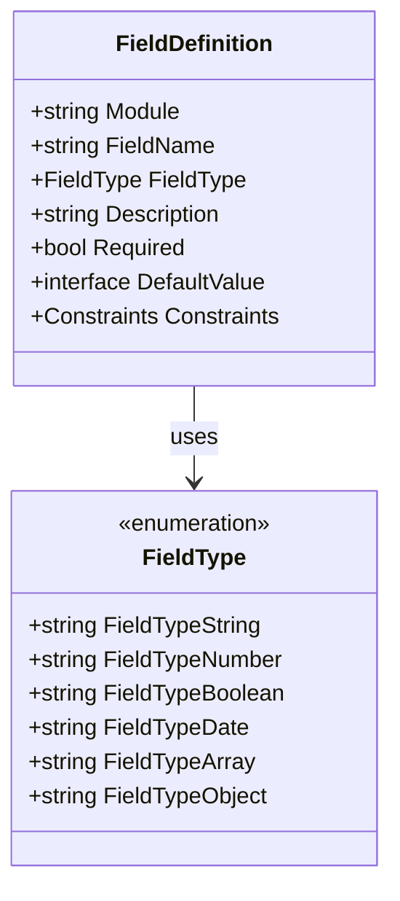
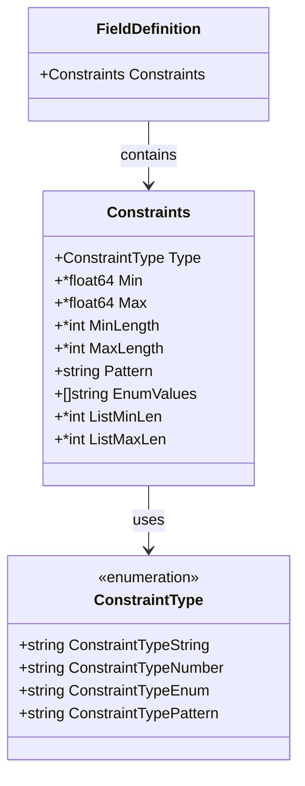
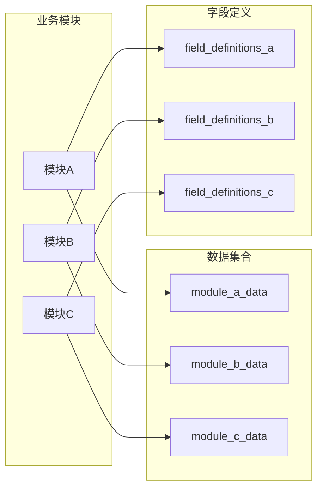
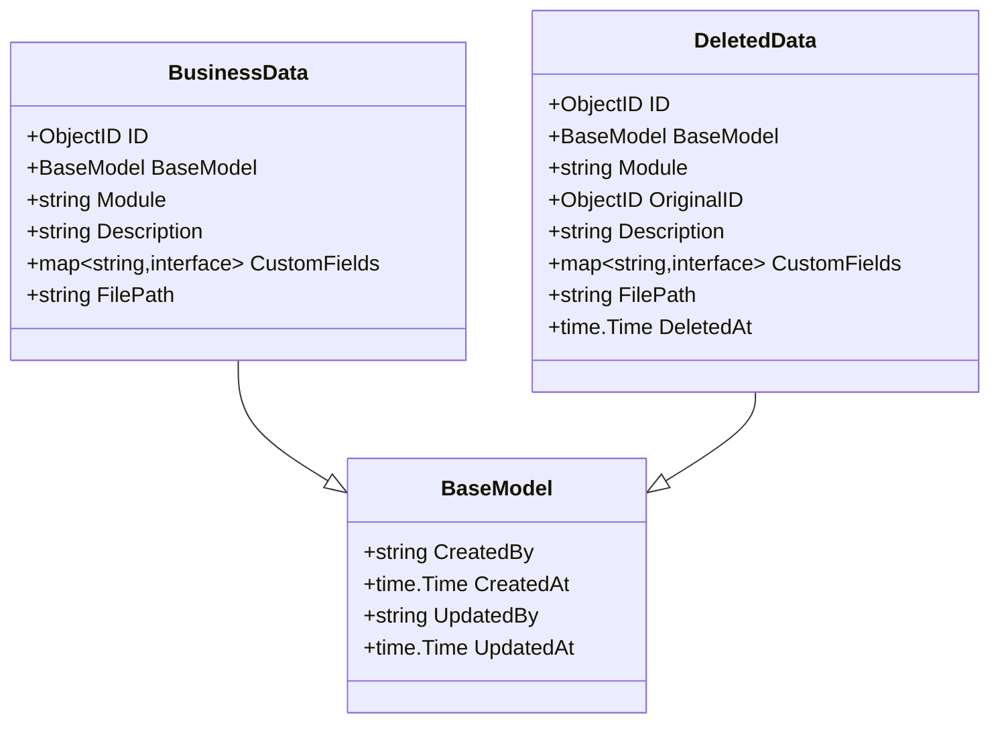
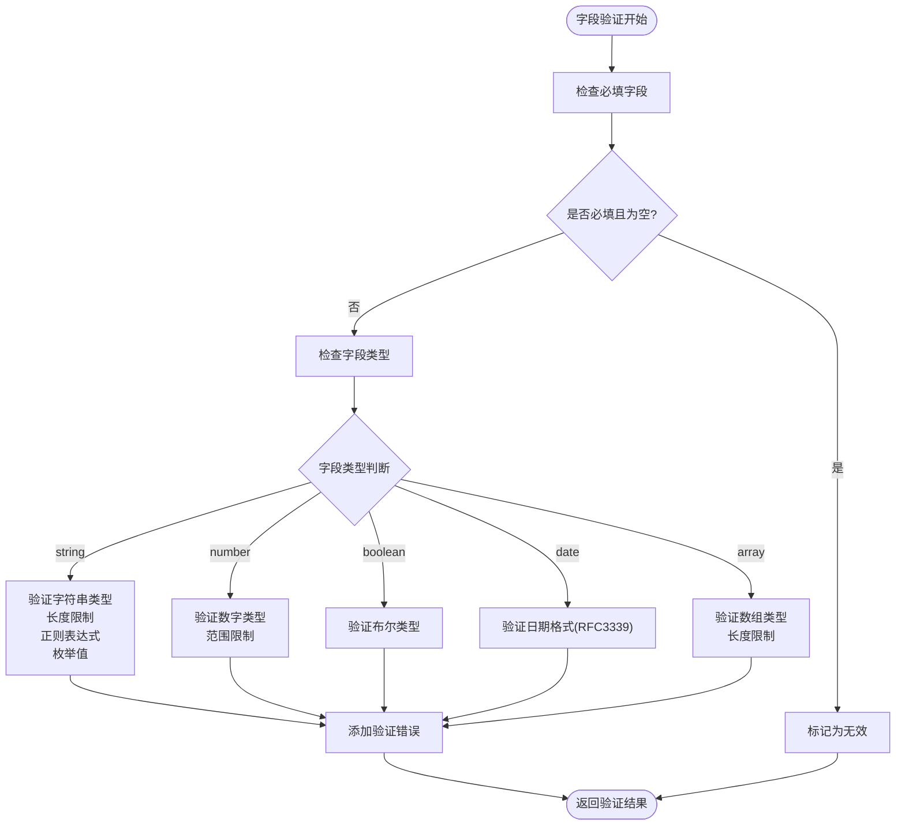
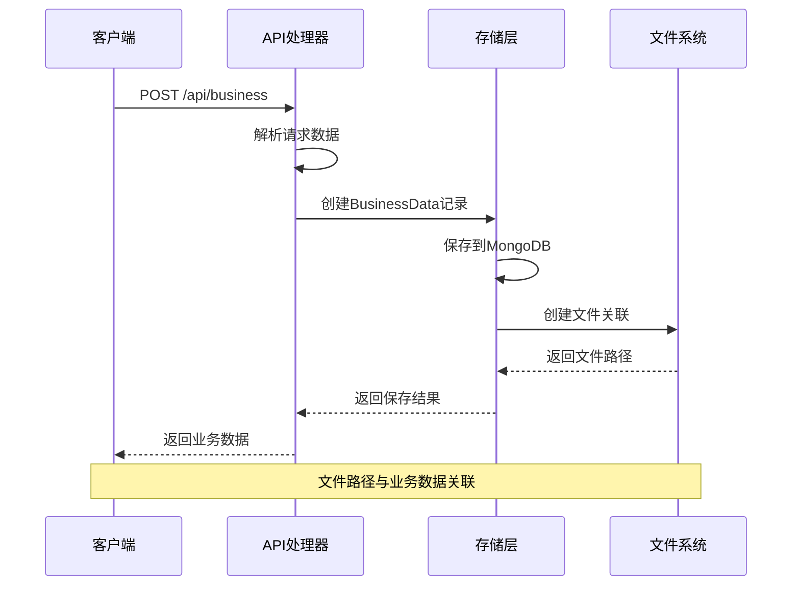
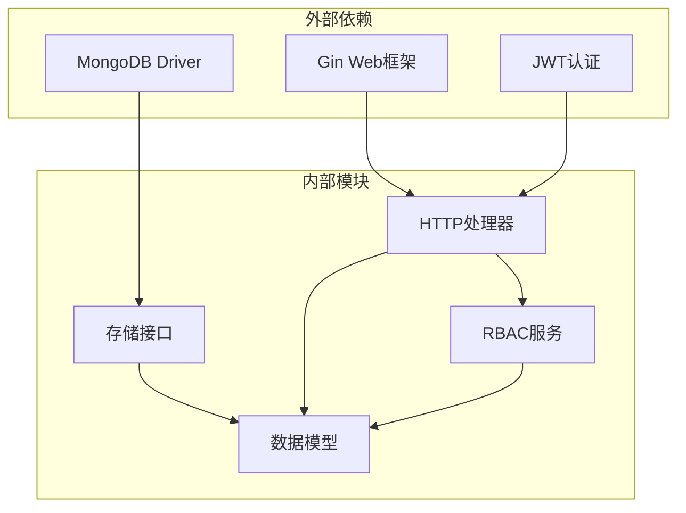
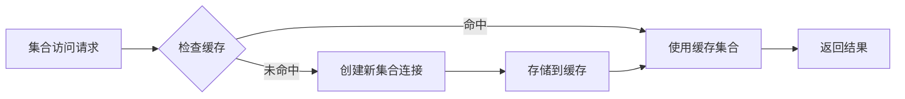

# 数据模型设计

<cite>
**本文档引用的文件**
- [models.go](file://internal/models/models.go)
- [mongodb_storage.go](file://internal/storage/mongodb_storage.go)
- [handlers.go](file://internal/api/handlers.go)
- [business-data.md](file://docs/business-data.md)
- [architecture_diagrams.md](file://docs/architecture_diagrams.md)
- [CustomFieldsPage.tsx](file://frontend/src/pages/Admin/CustomFieldsPage.tsx)
- [SearchPage.tsx](file://frontend/src/pages/Admin/SearchPage.tsx)
</cite>

## 目录
1. [简介](#简介)
2. [项目结构](#项目结构)
3. [核心组件](#核心组件)
4. [架构概览](#架构概览)
5. [详细组件分析](#详细组件分析)
6. [依赖分析](#依赖分析)
7. [性能考虑](#性能考虑)
8. [故障排除指南](#故障排除指南)
9. [结论](#结论)
10. [附录](#附录)

## 简介

本文档深入解析数据中心系统的数据模型设计，重点阐述BusinessData结构体的设计原理、模块化架构、自定义字段映射和文件路径管理。系统采用MongoDB作为主要数据存储，实现了灵活的业务数据管理、字段定义系统和完整的审计跟踪机制。

## 项目结构

系统采用分层架构设计，主要分为以下几个层次：

**图表来源**
- [models.go:1-365](file://internal/models/models.go#L1-L365)
- [mongodb_storage.go:1-829](file://internal/storage/mongodb_storage.go#L1-L829)

**章节来源**
- [models.go:1-365](file://internal/models/models.go#L1-L365)
- [mongodb_storage.go:1-829](file://internal/storage/mongodb_storage.go#L1-L829)

## 核心组件

### BaseModel通用字段设计

BaseModel作为所有业务实体的基础结构，提供了统一的审计跟踪能力：

| 字段名 | 类型 | 描述 | JSON标签 | BSON标签 |
|--------|------|------|----------|----------|
| CreatedBy | string | 创建者标识 | created_by | created_by |
| CreatedAt | time.Time | 创建时间戳 | created_at | created_at |
| UpdatedBy | string | 更新者标识 | updated_by | updated_by |
| UpdatedAt | time.Time | 更新时间戳 | updated_at | updated_at |

设计思路：
- **统一性**：所有业务实体继承BaseModel，确保审计信息的一致性
- **可追溯性**：完整记录数据的创建和修改历史
- **合规性**：满足企业级审计要求

**章节来源**
- [models.go:12-17](file://internal/models/models.go#L12-L17)

### FieldType枚举系统

系统支持以下数据类型：

**图表来源**
- [models.go:19-28](file://internal/models/models.go#L19-L28)
- [models.go:51-61](file://internal/models/models.go#L51-L61)

支持的字段类型：
- **string**：文本字段，支持长度限制和正则表达式验证
- **number**：数值字段，支持范围限制
- **boolean**：布尔值字段
- **date**：日期字段，使用RFC3339格式
- **array**：数组字段，支持长度限制
- **object**：对象字段，支持嵌套结构

**章节来源**
- [models.go:19-28](file://internal/models/models.go#L19-L28)
- [business-data.md:326-327](file://docs/business-data.md#L326-L327)

### ConstraintType约束系统

约束系统提供多层次的数据验证能力：

**图表来源**
- [models.go:30-37](file://internal/models/models.go#L30-L37)
- [models.go:39-49](file://internal/models/models.go#L39-L49)

**章节来源**
- [models.go:30-37](file://internal/models/models.go#L30-L37)
- [models.go:39-49](file://internal/models/models.go#L39-L49)

## 架构概览

系统采用模块化设计，每个业务模块对应独立的数据集合：

**图表来源**
- [business-data.md:95-100](file://docs/business-data.md#L95-L100)
- [mongodb_storage.go:338-347](file://internal/storage/mongodb_storage.go#L338-L347)

## 详细组件分析

### BusinessData结构体设计

BusinessData是系统的核心数据模型，专门用于存储业务数据：

**图表来源**
- [models.go:227-245](file://internal/models/models.go#L227-L245)
- [models.go:12-17](file://internal/models/models.go#L12-L17)

#### 字段映射机制

系统实现了灵活的字段映射和转换机制：

| 字段 | 类型 | 映射规则 | 转换逻辑 |
|------|------|----------|----------|
| custom_fields | map[string]interface{} | JSON嵌套结构 | 保持原始结构 |
| file_path | string | 文件路径 | 相对路径存储 |
| module | string | 模块标识 | 与集合名称关联 |

**章节来源**
- [models.go:227-245](file://internal/models/models.go#L227-L245)
- [business-data.md:357-358](file://docs/business-data.md#L357-L358)

### 字段验证系统

字段验证系统提供了完整的数据质量保证：

**图表来源**
- [models.go:73-221](file://internal/models/models.go#L73-L221)

#### 验证规则实现

验证系统支持以下规则：

1. **类型验证**：确保值与声明的字段类型匹配
2. **范围验证**：数字类型的最小值/最大值检查
3. **长度验证**：字符串的最小/最大长度限制
4. **格式验证**：日期格式和正则表达式验证
5. **枚举验证**：值必须在预定义的枚举列表中

**章节来源**
- [models.go:73-221](file://internal/models/models.go#L73-L221)

### 文件路径管理系统

系统支持业务数据与文件的关联管理：

**图表来源**
- [handlers.go:979-1011](file://internal/api/handlers.go#L979-L1011)
- [models.go:233](file://internal/models/models.go#L233)

**章节来源**
- [handlers.go:979-1011](file://internal/api/handlers.go#L979-L1011)
- [models.go:233](file://internal/models/models.go#L233)

## 依赖分析

系统采用松耦合的设计原则，各组件之间的依赖关系清晰：

**图表来源**
- [models.go:3-10](file://internal/models/models.go#L3-L10)
- [handlers.go:3-21](file://internal/api/handlers.go#L3-L21)

**章节来源**
- [models.go:3-10](file://internal/models/models.go#L3-L10)
- [handlers.go:3-21](file://internal/api/handlers.go#L3-L21)

## 性能考虑

### 索引策略

系统为关键查询场景建立了优化的索引策略：

| 集合 | 索引字段 | 类型 | 用途 |
|------|----------|------|------|
| collections | module | 唯一索引 | 快速查找模块 |
| field_definitions | module, field_name | 复合唯一索引 | 按模块和字段名查询 |
| scrape_tasks | module, status | 复合索引 | 按模块和状态查询任务 |
| scrape_tasks | created_at | 降序索引 | 按时间排序查询 |

### 缓存机制

系统实现了动态集合的缓存机制，避免重复的数据库连接：

**图表来源**
- [mongodb_storage.go:53-60](file://internal/storage/mongodb_storage.go#L53-L60)

**章节来源**
- [mongodb_storage.go:53-60](file://internal/storage/mongodb_storage.go#L53-L60)

## 故障排除指南

### 常见问题诊断

1. **字段验证失败**
   - 检查字段定义中的约束配置
   - 验证输入数据的类型和格式
   - 查看具体的错误信息定位问题

2. **集合访问异常**
   - 确认模块名称的正确性
   - 检查集合是否已创建
   - 验证MongoDB连接状态

3. **审计信息缺失**
   - 确认BaseModel字段的正确设置
   - 检查创建和更新时间戳
   - 验证用户身份信息

**章节来源**
- [models.go:63-71](file://internal/models/models.go#L63-L71)
- [mongodb_storage.go:411-493](file://internal/storage/mongodb_storage.go#L411-L493)

## 结论

该数据模型设计体现了现代Web应用的最佳实践：

1. **模块化架构**：通过模块化设计实现了业务功能的清晰分离
2. **灵活的数据类型**：支持多种数据类型和复杂的嵌套结构
3. **完善的验证机制**：多层次的字段验证确保数据质量
4. **完整的审计跟踪**：全面的审计信息满足合规要求
5. **良好的扩展性**：支持动态集合创建和字段定义管理

系统设计充分考虑了性能、可维护性和扩展性，在保证功能完整性的同时，为未来的功能扩展奠定了坚实基础。

## 附录

### 数据模型扩展指南

要定义新的业务数据类型，需要遵循以下步骤：

1. **创建字段定义**
   - 定义字段名称和类型
   - 配置必要的约束规则
   - 设置默认值和描述信息

2. **实现数据验证**
   - 根据业务需求配置验证规则
   - 测试字段验证逻辑
   - 处理验证错误情况

3. **集成到业务流程**
   - 在API层添加相应的处理逻辑
   - 实现数据的创建、读取、更新和删除操作
   - 集成到前端界面和用户交互流程

4. **配置权限控制**
   - 为新字段定义设置适当的访问权限
   - 配置RBAC规则
   - 测试权限验证机制

**章节来源**
- [business-data.md:205-213](file://docs/business-data.md#L205-L213)
- [handlers.go:88-103](file://internal/api/handlers.go#L88-L103)