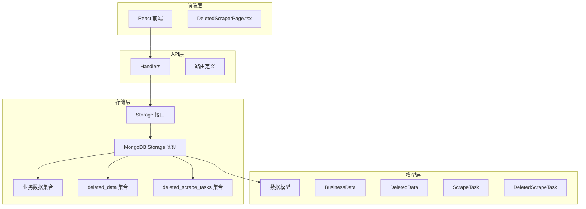
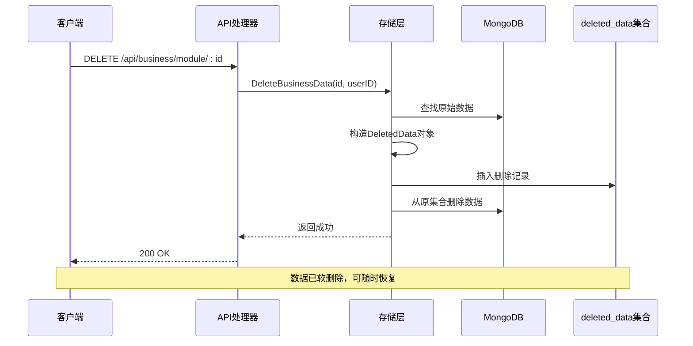
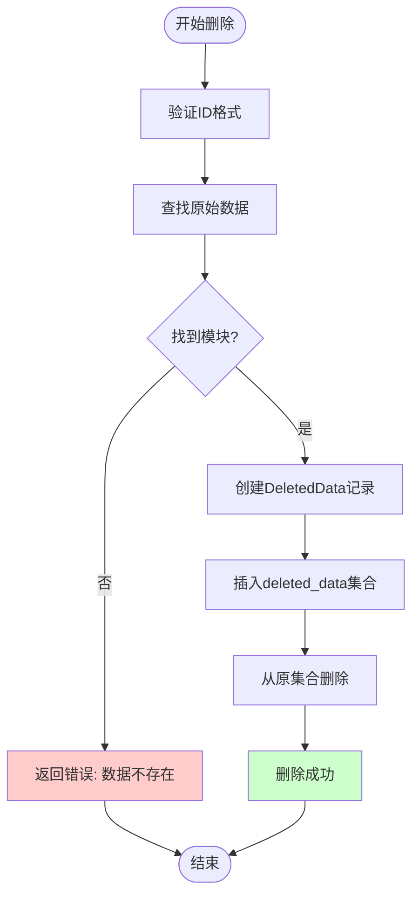
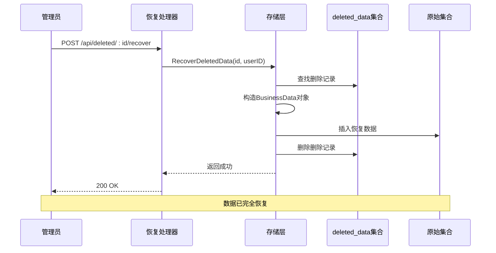
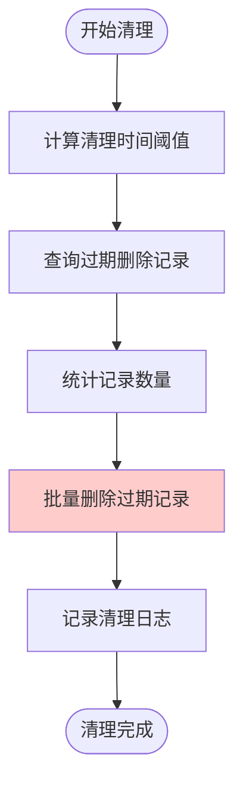
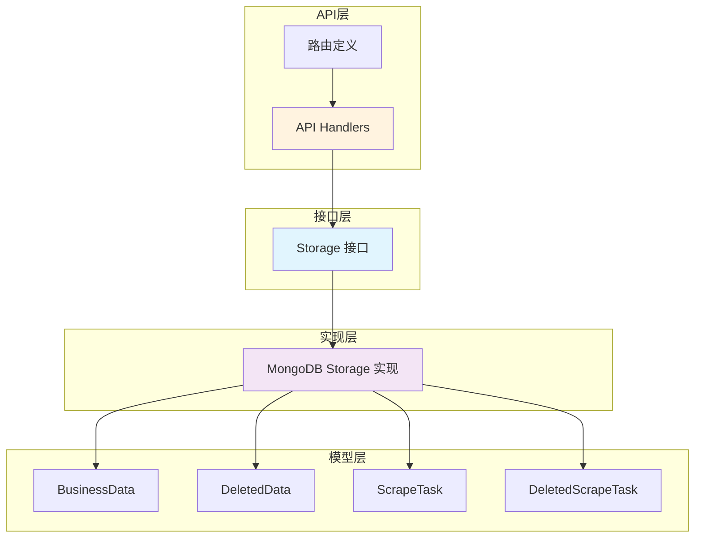

# 软删除机制

<cite>
**本文档引用的文件**
- [models.go](file://internal/models/models.go)
- [mongodb.go](file://internal/storage/mongodb.go)
- [mongodb_storage.go](file://internal/storage/mongodb_storage.go)
- [handlers.go](file://internal/api/handlers.go)
- [tech.md](file://docs/modules/business-data/tech.md)
- [implementation.md](file://docs/modules/business-data/implementation.md)
- [DeletedScraperPage.tsx](file://frontend/src/pages/Admin/DeletedScraperPage.tsx)
</cite>

## 目录
1. [简介](#简介)
2. [项目结构](#项目结构)
3. [核心组件](#核心组件)
4. [架构概览](#架构概览)
5. [详细组件分析](#详细组件分析)
6. [依赖关系分析](#依赖关系分析)
7. [性能考虑](#性能考虑)
8. [故障排除指南](#故障排除指南)
9. [结论](#结论)

## 简介

软删除机制是一种数据管理策略，通过将删除的数据移动到专门的存储集合中而不是物理删除，从而保留数据的历史记录和可恢复性。本项目实现了完整的软删除解决方案，包括业务数据和刮削任务的软删除与恢复功能。

软删除相比硬删除的主要优势包括：
- **数据可恢复性**：删除的数据可以随时恢复
- **审计追踪**：保留删除时间和操作员信息
- **数据完整性**：避免外键约束破坏
- **合规性**：满足数据保留法规要求

## 项目结构

该项目采用分层架构设计，软删除功能分布在多个层次中：



**图表来源**
- [mongodb_storage.go:16-51](file://internal/storage/mongodb_storage.go#L16-L51)
- [mongodb.go:14-90](file://internal/storage/mongodb.go#L14-L90)

**章节来源**
- [mongodb_storage.go:16-51](file://internal/storage/mongodb_storage.go#L16-L51)
- [mongodb.go:14-90](file://internal/storage/mongodb.go#L14-L90)

## 核心组件

### DeletedData 结构体设计

`DeletedData` 结构体是软删除机制的核心，它继承了基础模型并扩展了删除相关的字段：

```mermaid
classDiagram
class BaseModel {
+string created_by
+time created_at
+string updated_by
+time updated_at
}
class DeletedData {
+primitive.ObjectID _id
+primitive.ObjectID original_id
+string module
+string description
+map[string]interface{} custom_fields
+string file_path
+time deleted_at
+BaseModel
}
class BusinessData {
+primitive.ObjectID _id
+string module
+string description
+map[string]interface{} custom_fields
+string file_path
+BaseModel
}
DeletedData --|> BaseModel : 继承
BusinessData --|> BaseModel : 继承
DeletedData --> BusinessData : 复制数据
```

**图表来源**
- [models.go:236-245](file://internal/models/models.go#L236-L245)
- [models.go:227-234](file://internal/models/models.go#L227-L234)

#### 设计原理分析

1. **原始数据保留**：通过 `original_id` 字段保存被删除文档的原始ID，确保数据关联的完整性
2. **删除时间记录**：`deleted_at` 字段精确记录删除发生的时间点
3. **历史数据管理**：删除的数据被完整复制到 `deleted_data` 集合中，保留所有历史信息

**章节来源**
- [models.go:236-245](file://internal/models/models.go#L236-L245)
- [mongodb_storage.go:467-481](file://internal/storage/mongodb_storage.go#L467-L481)

### 存储策略

系统采用独立集合设计来存储删除的数据：

| 集合名称 | 用途 | 索引配置 |
|---------|------|----------|
| `deleted_data` | 存储软删除的业务数据 | `{module: 1}`, `{original_id: 1}`, `{deleted_at: 1}` |
| `deleted_scrape_tasks` | 存储软删除的刮削任务 | `{module: 1}`, `{original_id: 1}`, `{deleted_at: 1}` |

**章节来源**
- [mongodb_storage.go:44-46](file://internal/storage/mongodb_storage.go#L44-L46)
- [tech.md:57-60](file://docs/modules/business-data/tech.md#L57-L60)

## 架构概览

软删除机制的整体架构遵循分层设计原则：



**图表来源**
- [handlers.go:1127-1141](file://internal/api/handlers.go#L1127-L1141)
- [mongodb_storage.go:411-493](file://internal/storage/mongodb_storage.go#L411-L493)

## 详细组件分析

### 删除流程实现

删除操作是一个原子性的多步骤过程，确保数据的一致性和完整性：



**图表来源**
- [mongodb_storage.go:411-493](file://internal/storage/mongodb_storage.go#L411-L493)

#### 删除流程详细步骤

1. **ID验证**：验证传入的ID格式是否有效
2. **数据查找**：遍历所有动态集合查找目标数据
3. **模块识别**：确定数据所属的模块
4. **记录创建**：构建 `DeletedData` 对象，复制所有字段
5. **历史保存**：将删除记录插入 `deleted_data` 集合
6. **数据清理**：从原始集合中删除文档

**章节来源**
- [mongodb_storage.go:411-493](file://internal/storage/mongodb_storage.go#L411-L493)

### 恢复流程实现

数据恢复是一个逆向的复制过程，将删除的数据恢复到原始状态：



**图表来源**
- [handlers.go:1173-1187](file://internal/api/handlers.go#L1173-L1187)
- [mongodb_storage.go:527-562](file://internal/storage/mongodb_storage.go#L527-L562)

#### 恢复流程详细步骤

1. **记录查找**：从 `deleted_data` 集合获取删除记录
2. **数据重建**：根据删除记录构造 `BusinessData` 对象
3. **集合定位**：根据模块信息确定原始集合名称
4. **数据插入**：将恢复的数据插入到对应的动态集合
5. **记录清理**：从 `deleted_data` 集合删除对应记录

**章节来源**
- [mongodb_storage.go:527-562](file://internal/storage/mongodb_storage.go#L527-L562)

### 数据清理策略

系统提供了自动化的数据清理功能，用于定期清理过期的删除记录：



**图表来源**
- [mongodb_storage.go:564-569](file://internal/storage/mongodb_storage.go#L564-L569)

#### 清理策略配置

清理功能支持基于时间阈值的批量删除：

- **清理条件**：`deleted_at < olderThan`
- **清理范围**：支持全量清理或按模块清理
- **性能优化**：使用批量删除操作减少数据库压力

**章节来源**
- [mongodb_storage.go:564-569](file://internal/storage/mongodb_storage.go#L564-L569)

## 依赖关系分析

软删除机制涉及多个组件之间的复杂依赖关系：



**图表来源**
- [mongodb.go:14-90](file://internal/storage/mongodb.go#L14-L90)
- [mongodb_storage.go:16-25](file://internal/storage/mongodb_storage.go#L16-L25)

### 关键依赖关系

1. **接口抽象**：通过 `Storage` 接口实现存储层抽象
2. **模型映射**：MongoDB 文档与 Go 结构体的双向映射
3. **API封装**：HTTP 请求与存储操作的解耦
4. **事务保证**：删除操作的原子性保证

**章节来源**
- [mongodb.go:14-90](file://internal/storage/mongodb.go#L14-L90)
- [mongodb_storage.go:16-25](file://internal/storage/mongodb_storage.go#L16-L25)

## 性能考虑

软删除机制在设计时充分考虑了性能优化：

### 索引优化策略

| 索引类型 | 字段组合 | 用途 | 性能影响 |
|---------|----------|------|----------|
| 单字段索引 | `module` | 按模块查询 | 高效过滤 |
| 单字段索引 | `original_id` | 快速定位 | O(log n) 查询 |
| 单字段索引 | `deleted_at` | 时间排序 | 支持分页查询 |
| 复合索引 | `(module, deleted_at)` | 组合查询 | 更高效 |

### 存储优化

1. **集合分离**：删除数据独立存储，不影响主数据集合性能
2. **批量操作**：支持批量删除和恢复操作
3. **内存管理**：动态集合缓存减少连接开销

### 查询优化

1. **分页查询**：支持大规模删除数据的分页浏览
2. **条件过滤**：支持按模块、时间范围等条件查询
3. **索引利用**：充分利用建立的索引提高查询效率

## 故障排除指南

### 常见问题及解决方案

#### 删除操作失败

**问题症状**：删除请求返回错误，提示数据不存在

**可能原因**：
1. 数据ID格式不正确
2. 数据已被其他进程删除
3. 模块信息缺失

**解决步骤**：
1. 验证ID格式是否为有效的ObjectID
2. 检查数据是否存在于任何动态集合中
3. 确认模块信息的正确性

#### 恢复操作异常

**问题症状**：恢复请求失败，提示删除记录不存在

**可能原因**：
1. 删除记录已被清理
2. ID格式错误
3. 权限不足

**解决步骤**：
1. 确认删除记录仍在 `deleted_data` 集合中
2. 验证恢复请求的ID格式
3. 检查用户权限

#### 性能问题

**问题症状**：删除或恢复操作响应缓慢

**优化建议**：
1. 检查相关索引是否存在
2. 优化查询条件
3. 调整分页参数

**章节来源**
- [mongodb_storage.go:457-459](file://internal/storage/mongodb_storage.go#L457-L459)
- [mongodb_storage.go:532-534](file://internal/storage/mongodb_storage.go#L532-L534)

## 结论

软删除机制为本项目提供了完整的数据生命周期管理能力。通过精心设计的数据模型、完善的存储策略和高效的实现方案，系统能够在保证数据安全的同时提供灵活的恢复能力。

### 主要优势

1. **数据安全性**：删除的数据不会永久丢失
2. **操作灵活性**：支持随时恢复误删数据
3. **审计完整性**：保留完整的操作历史
4. **性能优化**：通过索引和批量操作提升性能

### 最佳实践建议

1. **定期清理**：设置合理的删除数据保留期限
2. **监控告警**：建立删除数据量的监控机制
3. **权限控制**：严格限制删除和恢复操作权限
4. **备份策略**：配合定期备份确保数据安全

软删除机制的成功实施为项目的长期发展奠定了坚实的数据管理基础，为用户提供了可靠的数据保护和灵活的操作体验。