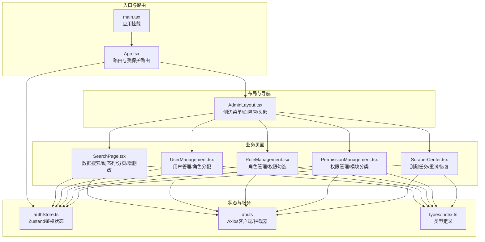
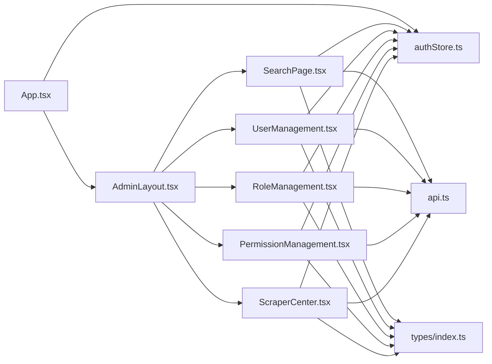
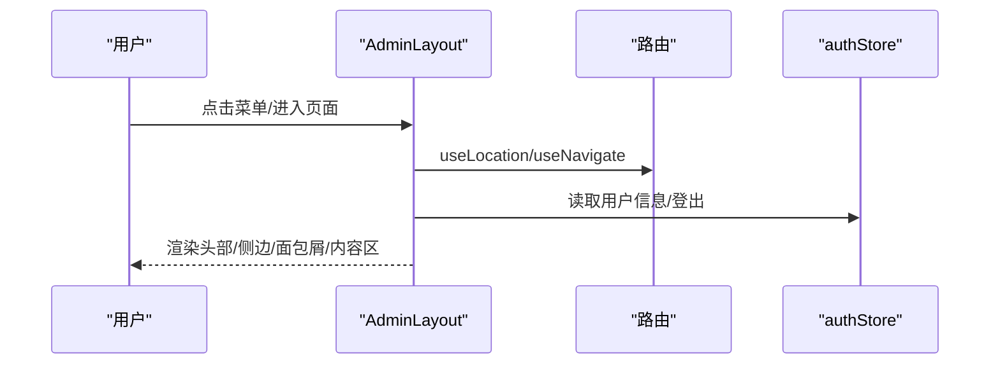
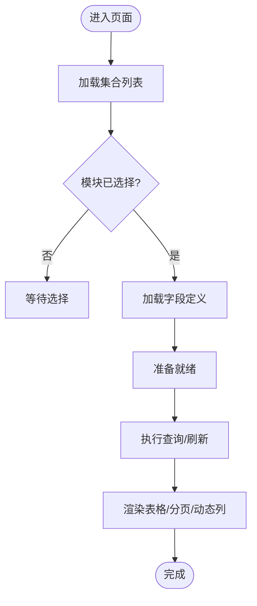
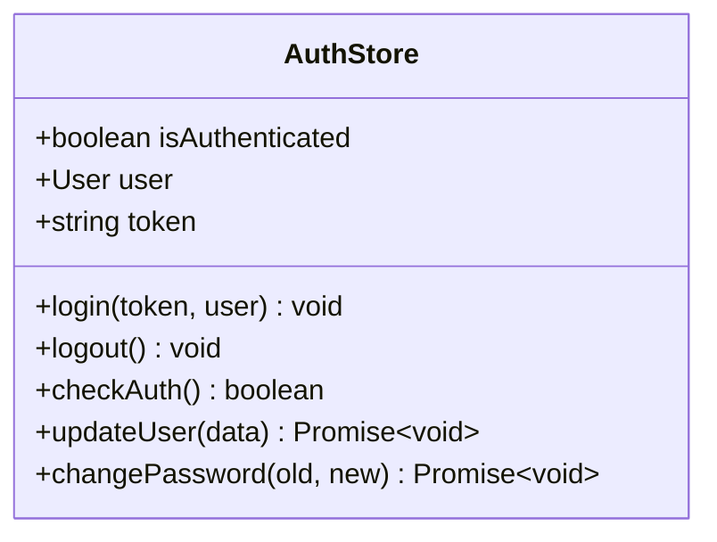
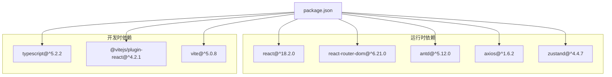

# React组件架构

<cite>
**本文引用的文件**
- [App.tsx](file://frontend/src/App.tsx)
- [main.tsx](file://frontend/src/main.tsx)
- [AdminLayout.tsx](file://frontend/src/pages/Admin/AdminLayout.tsx)
- [SearchPage.tsx](file://frontend/src/pages/Admin/SearchPage.tsx)
- [UserManagement.tsx](file://frontend/src/pages/Admin/UserManagement.tsx)
- [RoleManagement.tsx](file://frontend/src/pages/Admin/RoleManagement.tsx)
- [PermissionManagement.tsx](file://frontend/src/pages/Admin/PermissionManagement.tsx)
- [ScraperCenter.tsx](file://frontend/src/pages/Admin/ScraperCenter.tsx)
- [authStore.ts](file://frontend/src/stores/authStore.ts)
- [api.ts](file://frontend/src/services/api.ts)
- [index.ts](file://frontend/src/types/index.ts)
- [package.json](file://frontend/package.json)
- [vite.config.ts](file://frontend/vite.config.ts)
- [tsconfig.json](file://frontend/tsconfig.json)
</cite>

## 目录
1. [引言](#引言)
2. [项目结构](#项目结构)
3. [核心组件](#核心组件)
4. [架构总览](#架构总览)
5. [组件详细分析](#组件详细分析)
6. [依赖关系分析](#依赖关系分析)
7. [性能考量](#性能考量)
8. [故障排查指南](#故障排查指南)
9. [结论](#结论)
10. [附录](#附录)

## 引言
本文件面向数据中心项目的前端React组件架构，围绕React 18的设计理念与最佳实践，系统阐述函数组件、Hooks模式与组件层次结构；明确展示组件、容器组件与高阶组件的职责边界；总结组件间通信机制（props、事件、状态提升）；梳理生命周期管理（useEffect、useMemo、useCallback）；给出可复用性设计建议（通用组件库与接口标准化）；并提供测试策略与调试技巧。文档以实际源码为依据，辅以可视化图示帮助不同背景读者快速理解。

## 项目结构
前端采用Vite + React 18 + TypeScript + Ant Design技术栈，按功能域组织页面与组件，结合Zustand进行轻量状态管理，Axios封装HTTP客户端并统一拦截器处理鉴权与错误。

**图表来源**
- [main.tsx:1-10](file://frontend/src/main.tsx#L1-L10)
- [App.tsx:1-69](file://frontend/src/App.tsx#L1-L69)
- [AdminLayout.tsx:1-203](file://frontend/src/pages/Admin/AdminLayout.tsx#L1-L203)
- [SearchPage.tsx:1-583](file://frontend/src/pages/Admin/SearchPage.tsx#L1-L583)
- [UserManagement.tsx:1-385](file://frontend/src/pages/Admin/UserManagement.tsx#L1-L385)
- [RoleManagement.tsx:1-363](file://frontend/src/pages/Admin/RoleManagement.tsx#L1-L363)
- [PermissionManagement.tsx:1-261](file://frontend/src/pages/Admin/PermissionManagement.tsx#L1-L261)
- [ScraperCenter.tsx:1-500](file://frontend/src/pages/Admin/ScraperCenter.tsx#L1-L500)
- [authStore.ts:1-61](file://frontend/src/stores/authStore.ts#L1-L61)
- [api.ts:1-37](file://frontend/src/services/api.ts#L1-L37)
- [index.ts:1-97](file://frontend/src/types/index.ts#L1-L97)

**章节来源**
- [main.tsx:1-10](file://frontend/src/main.tsx#L1-L10)
- [App.tsx:1-69](file://frontend/src/App.tsx#L1-L69)
- [package.json:1-29](file://frontend/package.json#L1-L29)
- [vite.config.ts:1-6](file://frontend/vite.config.ts#L1-L6)
- [tsconfig.json:1-21](file://frontend/tsconfig.json#L1-L21)

## 核心组件
- 应用入口与路由
  - 入口文件负责在Strict模式下渲染根组件，确保开发期严格校验。
  - App集中配置路由、懒加载页面、全局主题与认证检查。
- 布局组件
  - AdminLayout提供顶部导航、侧边菜单、面包屑与内容区出口，作为所有管理页面的容器。
- 页面级组件（容器）
  - SearchPage：数据查询、动态字段渲染、分页、增删改、JQL过滤。
  - UserManagement：用户列表、角色分配、搜索过滤、分页。
  - RoleManagement：角色列表、权限勾选分组、搜索过滤、分页。
  - PermissionManagement：权限列表、模块分类、搜索过滤、分页。
  - ScraperCenter：刮削任务列表、重试/恢复、批量删除、搜索。
- 状态与服务
  - authStore：基于Zustand的鉴权状态（登录、登出、检查、用户信息）。
  - api：基于Axios的HTTP客户端，统一注入Token与401处理。
  - 类型：统一定义用户、角色、权限、响应体等类型。

**章节来源**
- [main.tsx:1-10](file://frontend/src/main.tsx#L1-L10)
- [App.tsx:19-67](file://frontend/src/App.tsx#L19-L67)
- [AdminLayout.tsx:9-201](file://frontend/src/pages/Admin/AdminLayout.tsx#L9-L201)
- [SearchPage.tsx:59-583](file://frontend/src/pages/Admin/SearchPage.tsx#L59-L583)
- [UserManagement.tsx:22-385](file://frontend/src/pages/Admin/UserManagement.tsx#L22-L385)
- [RoleManagement.tsx:7-363](file://frontend/src/pages/Admin/RoleManagement.tsx#L7-L363)
- [PermissionManagement.tsx:14-261](file://frontend/src/pages/Admin/PermissionManagement.tsx#L14-L261)
- [ScraperCenter.tsx:7-500](file://frontend/src/pages/Admin/ScraperCenter.tsx#L7-L500)
- [authStore.ts:15-61](file://frontend/src/stores/authStore.ts#L15-L61)
- [api.ts:5-37](file://frontend/src/services/api.ts#L5-L37)
- [index.ts:1-97](file://frontend/src/types/index.ts#L1-L97)

## 架构总览
整体采用“布局容器-页面组件”分层，页面组件承担数据获取与状态管理，布局组件负责UI骨架与导航；通过Zustand集中管理鉴权状态，Axios统一处理请求与响应拦截；Ant Design提供UI能力与交互组件。

**图表来源**
- [App.tsx:19-67](file://frontend/src/App.tsx#L19-L67)
- [AdminLayout.tsx:9-201](file://frontend/src/pages/Admin/AdminLayout.tsx#L9-L201)
- [SearchPage.tsx:59-583](file://frontend/src/pages/Admin/SearchPage.tsx#L59-L583)
- [UserManagement.tsx:22-385](file://frontend/src/pages/Admin/UserManagement.tsx#L22-L385)
- [RoleManagement.tsx:7-363](file://frontend/src/pages/Admin/RoleManagement.tsx#L7-L363)
- [PermissionManagement.tsx:14-261](file://frontend/src/pages/Admin/PermissionManagement.tsx#L14-L261)
- [ScraperCenter.tsx:7-500](file://frontend/src/pages/Admin/ScraperCenter.tsx#L7-L500)
- [authStore.ts:15-61](file://frontend/src/stores/authStore.ts#L15-L61)
- [api.ts:5-37](file://frontend/src/services/api.ts#L5-L37)
- [index.ts:1-97](file://frontend/src/types/index.ts#L1-L97)

## 组件详细分析

### 布局与导航：AdminLayout
- 职责分离
  - 展示组件：负责头部、侧边菜单、面包屑与内容出口。
  - 容器职责：通过useEffect根据路由生成面包屑；通过useNavigate与useLocation处理导航。
- 通信机制
  - props：从路由与store传入用户信息；通过children（Outlet）承载子页面。
  - 事件：按钮点击触发导航或登出。
- 生命周期
  - 使用useEffect监听location变化，动态计算面包屑。
- 可复用性
  - 将菜单项、面包屑映射抽离为常量，便于扩展与维护。

**图表来源**
- [AdminLayout.tsx:10-59](file://frontend/src/pages/Admin/AdminLayout.tsx#L10-L59)
- [AdminLayout.tsx:81-148](file://frontend/src/pages/Admin/AdminLayout.tsx#L81-L148)

**章节来源**
- [AdminLayout.tsx:9-201](file://frontend/src/pages/Admin/AdminLayout.tsx#L9-L201)

### 数据搜索：SearchPage
- 职责分离
  - 展示组件：表格、表单、模态框、分页控件。
  - 容器职责：管理模块切换、JQL查询、动态字段渲染、分页状态、增删改逻辑。
- 通信机制
  - props：从父组件传入的回调与状态；通过Form组件与Ant Design表单控件双向绑定。
  - 事件：按钮点击触发查询、刷新、创建、编辑、删除。
  - 状态提升：分页状态由父组件持有，子组件通过onChange回调更新。
- 生命周期与优化
  - useEffect：初始化加载集合与字段定义；模块变更时重新加载。
  - useCallback：封装API调用，避免重复渲染导致的请求风暴。
  - useMemo：根据字段定义或数据动态计算列配置，减少无效渲染。
- 可复用性
  - 动态列渲染逻辑可抽象为通用组件，支持不同模块的字段展示。

**图表来源**
- [SearchPage.tsx:74-144](file://frontend/src/pages/Admin/SearchPage.tsx#L74-L144)
- [SearchPage.tsx:146-177](file://frontend/src/pages/Admin/SearchPage.tsx#L146-L177)

**章节来源**
- [SearchPage.tsx:59-583](file://frontend/src/pages/Admin/SearchPage.tsx#L59-L583)

### 用户管理：UserManagement
- 职责分离
  - 展示组件：用户表格、表单、模态框。
  - 容器职责：用户列表、角色分配、搜索过滤、分页。
- 通信机制
  - props：分页参数、搜索词、用户列表。
  - 事件：编辑、删除、分配角色、刷新。
- 生命周期与优化
  - useEffect：首次加载用户与角色；分页变更时重新拉取。
  - useCallback：封装API调用，避免无谓重渲染。
- 可复用性
  - 表格列定义与操作按钮可抽取为通用组件，配合权限控制。

**章节来源**
- [UserManagement.tsx:22-385](file://frontend/src/pages/Admin/UserManagement.tsx#L22-L385)

### 角色管理：RoleManagement
- 职责分离
  - 展示组件：角色表格、权限勾选分组、表单。
  - 容器职责：角色列表、权限分组、新增/编辑/删除、搜索过滤。
- 通信机制
  - props：权限列表、角色数据。
  - 事件：提交表单、删除角色、刷新。
- 生命周期与优化
  - useEffect：加载角色与权限；权限列表变化时重组分组。
  - useCallback：封装API调用。
- 可复用性
  - 权限分组渲染逻辑可抽象为通用组件，支持多模块权限。

**章节来源**
- [RoleManagement.tsx:7-363](file://frontend/src/pages/Admin/RoleManagement.tsx#L7-L363)

### 权限管理：PermissionManagement
- 职责分离
  - 展示组件：权限表格、表单。
  - 容器职责：权限列表、模块筛选、新增/编辑/删除。
- 通信机制
  - props：权限数据、模块选项。
  - 事件：提交表单、删除权限、刷新。
- 生命周期与优化
  - useEffect：加载权限列表。
  - useCallback：封装API调用。
- 可复用性
  - 模块标签渲染与筛选器可抽取为通用组件。

**章节来源**
- [PermissionManagement.tsx:14-261](file://frontend/src/pages/Admin/PermissionManagement.tsx#L14-L261)

### 刮削中心：ScraperCenter
- 职责分离
  - 展示组件：任务表格、表单、模态框。
  - 容器职责：任务列表、重试/恢复、批量删除、搜索。
- 通信机制
  - props：任务数据、分页状态。
  - 事件：创建任务、重试、恢复、批量删除、刷新。
- 生命周期与优化
  - useEffect：加载模块与路径；根据当前标签页切换数据源。
  - useCallback：封装API调用。
- 可复用性
  - 表格列与操作按钮可抽取为通用组件，支持不同任务类型。

**章节来源**
- [ScraperCenter.tsx:7-500](file://frontend/src/pages/Admin/ScraperCenter.tsx#L7-L500)

### 鉴权与状态：authStore
- 设计要点
  - 使用Zustand集中管理登录态、用户信息与Token。
  - 提供登录、登出、检查与用户更新等方法。
  - 结合Axios拦截器自动处理401登出。
- 最佳实践
  - 将鉴权状态与业务状态解耦，避免跨组件共享复杂对象。
  - 在应用启动时调用checkAuth，保证页面刷新后状态一致。

**图表来源**
- [authStore.ts:4-13](file://frontend/src/stores/authStore.ts#L4-L13)

**章节来源**
- [authStore.ts:15-61](file://frontend/src/stores/authStore.ts#L15-L61)
- [api.ts:23-35](file://frontend/src/services/api.ts#L23-L35)

### HTTP客户端：api
- 设计要点
  - 统一基地址与超时。
  - 请求拦截器注入Authorization头。
  - 响应拦截器处理401自动登出。
- 最佳实践
  - 将错误处理与重定向逻辑集中在拦截器，降低页面组件负担。
  - 对于需要携带Token的请求，无需在每个页面重复处理。

**章节来源**
- [api.ts:5-37](file://frontend/src/services/api.ts#L5-L37)

## 依赖关系分析
- 技术栈
  - React 18、React Router、Ant Design、Axios、Zustand、TypeScript、Vite。
- 模块耦合
  - 页面组件对服务层与状态层存在直接依赖，属于典型容器模式。
  - 布局组件仅依赖路由与状态，保持低耦合。
- 循环依赖
  - 当前结构未见循环依赖迹象，组件间依赖方向清晰。

**图表来源**
- [package.json:12-27](file://frontend/package.json#L12-L27)

**章节来源**
- [package.json:1-29](file://frontend/package.json#L1-L29)

## 性能考量
- 函数组件与Hooks
  - 使用useMemo缓存昂贵计算（如动态列生成），避免每次渲染都重建列配置。
  - 使用useCallback缓存回调函数，防止子组件因引用变化而重渲染。
- 数据获取
  - 合理使用useEffect触发数据加载，避免在渲染期间发起请求。
  - 对高频操作（如搜索）进行防抖或节流，减少请求次数。
- 渲染优化
  - 表格启用虚拟滚动与横向滚动，避免大列表全量渲染。
  - 模态框按需渲染，减少不必要的DOM树深度。
- 状态管理
  - 将鉴权状态与业务状态分离，避免无关状态变化触发页面重渲染。
  - 使用局部状态管理小范围数据，避免全局状态污染。

## 故障排查指南
- 鉴权问题
  - 401自动登出：当后端返回401时，拦截器会清除本地存储并跳转登录页。
  - 登录态不一致：在App启动时调用checkAuth，确保刷新后状态同步。
- 网络请求
  - 请求失败：查看拦截器错误分支，确认是否触发了登出流程。
  - 参数错误：检查请求URL与参数拼接，确保模块与分页参数正确。
- 表单与表格
  - 表单字段不生效：确认Form组件的name与初始值一致，避免undefined覆盖。
  - 表格列不显示：检查动态列生成逻辑与字段定义映射。
- 调试技巧
  - 使用浏览器开发者工具的React DevTools查看组件树与状态变化。
  - 在关键函数上添加日志，定位useEffect依赖与回调执行顺序。
  - 对高频渲染的组件使用React Profiler分析渲染热点。

**章节来源**
- [api.ts:23-35](file://frontend/src/services/api.ts#L23-L35)
- [authStore.ts:29-46](file://frontend/src/stores/authStore.ts#L29-L46)
- [App.tsx:36-39](file://frontend/src/App.tsx#L36-L39)

## 结论
该架构以函数组件与Hooks为核心，采用“布局容器-页面组件”的分层设计，结合Zustand与Axios实现鉴权与网络层的统一处理。页面组件承担数据获取与状态管理，布局组件专注UI骨架与导航，职责清晰、耦合度低。通过useMemo、useCallback等Hooks优化渲染性能，配合类型系统与拦截器增强可维护性与稳定性。建议后续进一步抽象通用组件与服务层，完善测试策略与调试工具链，持续提升可复用性与可测试性。

## 附录
- 组件接口标准化建议
  - 统一Props命名规范（如data、loading、onChange、onSubmit）。
  - 明确事件回调约定（如onSuccess、onError、onCancel）。
  - 对外暴露稳定API，内部实现可演进。
- 测试策略
  - 单元测试：针对useCallback/useMemo包裹的纯函数与Hook组合逻辑。
  - 集成测试：模拟Axios响应与Zustand状态，验证页面交互。
  - 端到端测试：使用自动化工具覆盖关键业务流程（登录、查询、增删改）。
- 调试工具
  - React DevTools：查看组件树、Props与State。
  - Redux DevTools/Zustand DevTools：追踪状态变化轨迹。
  - 浏览器Network面板：观察请求与响应，定位401与错误。