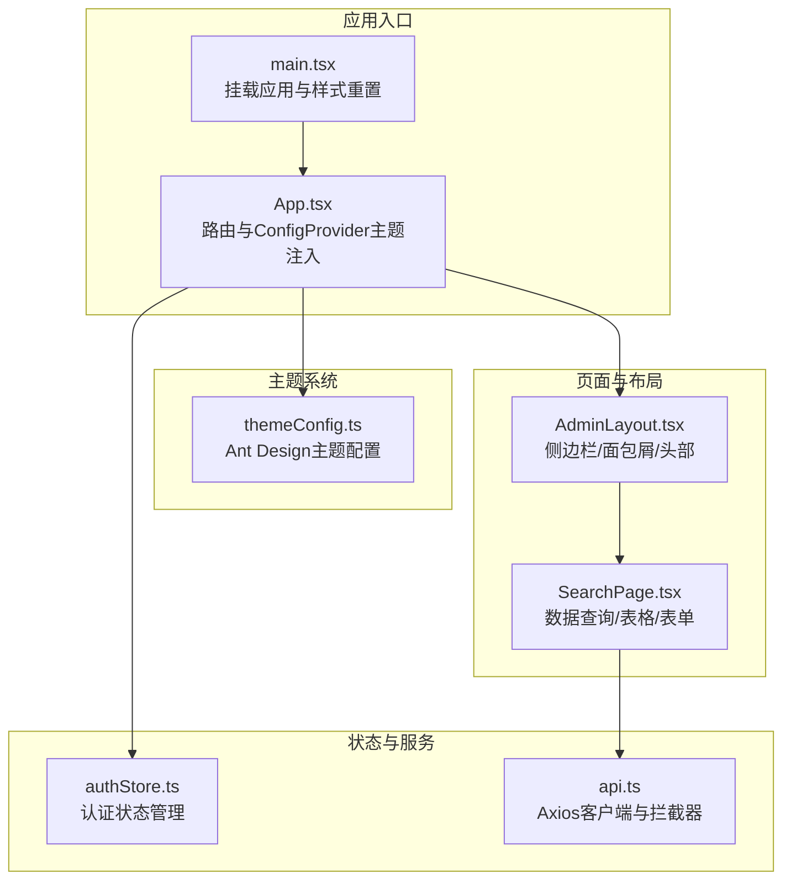
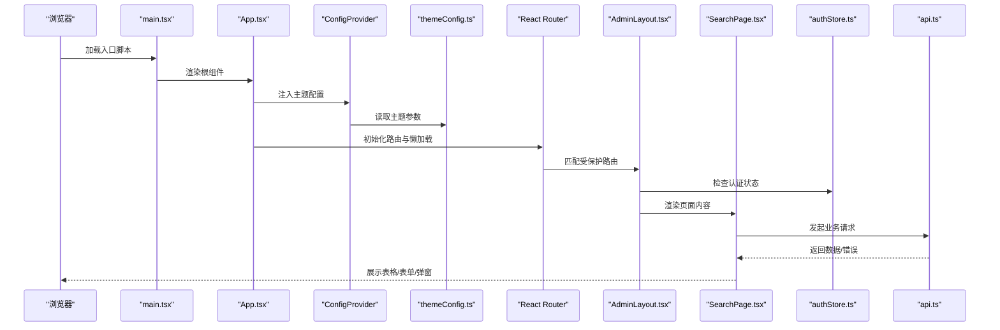
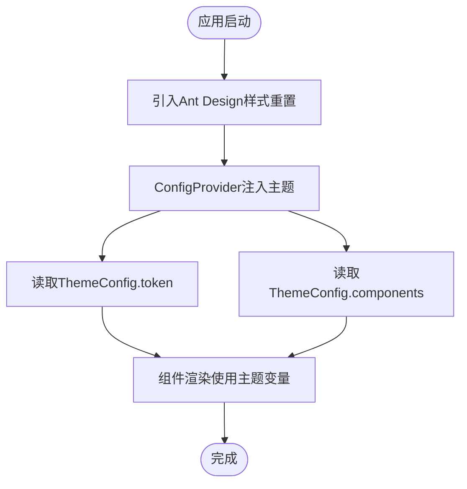
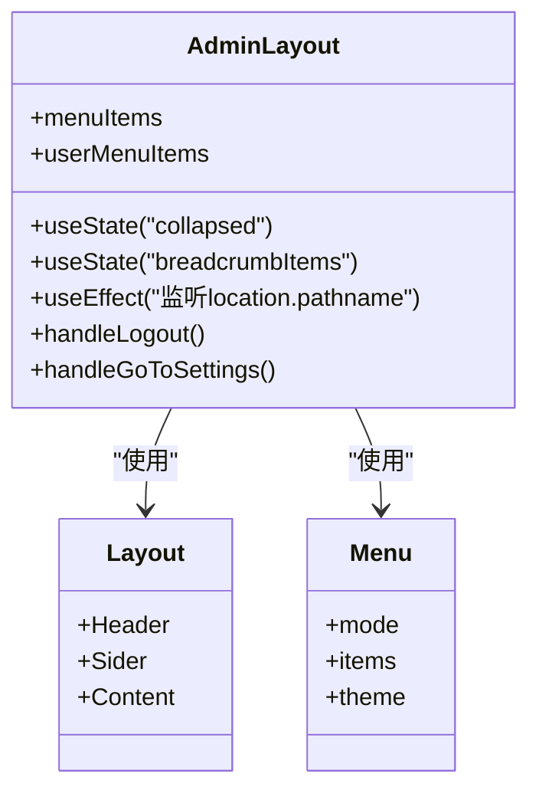
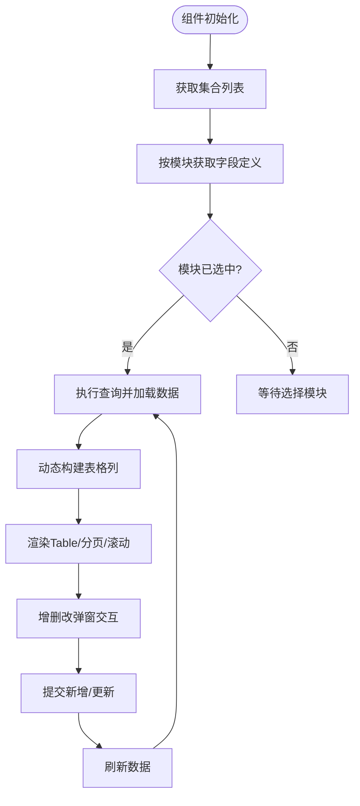
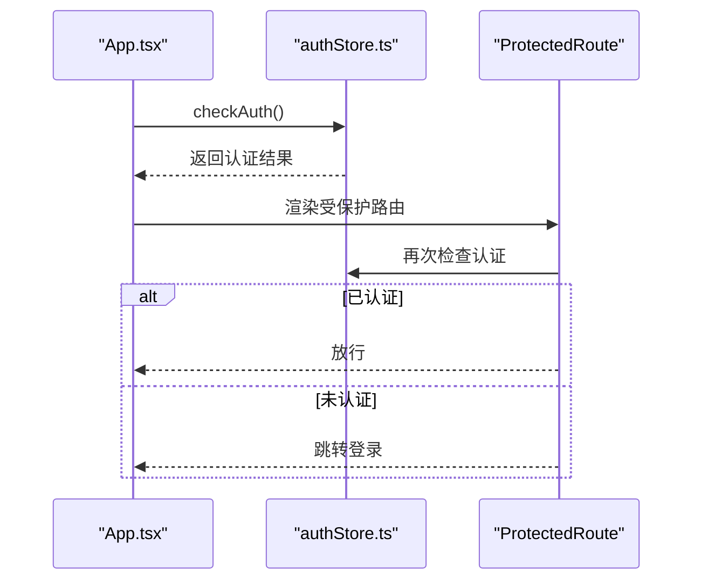
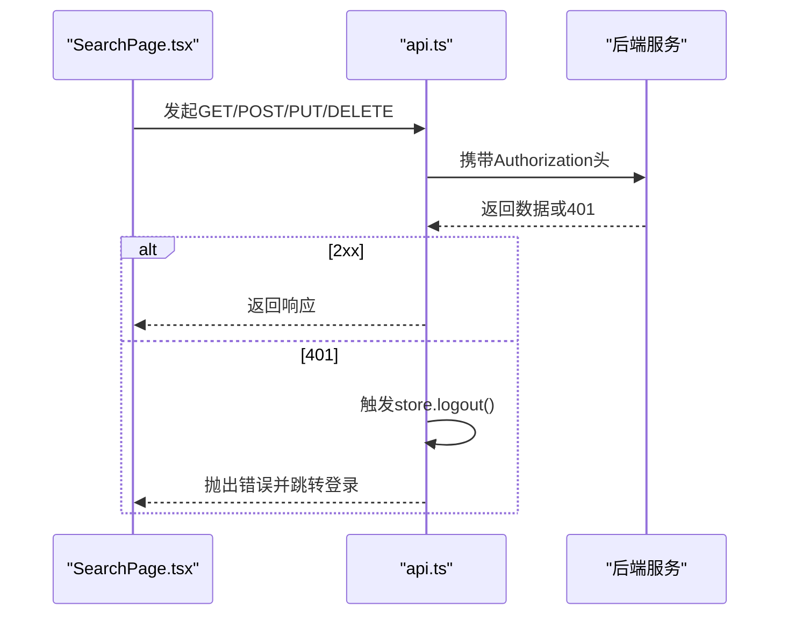
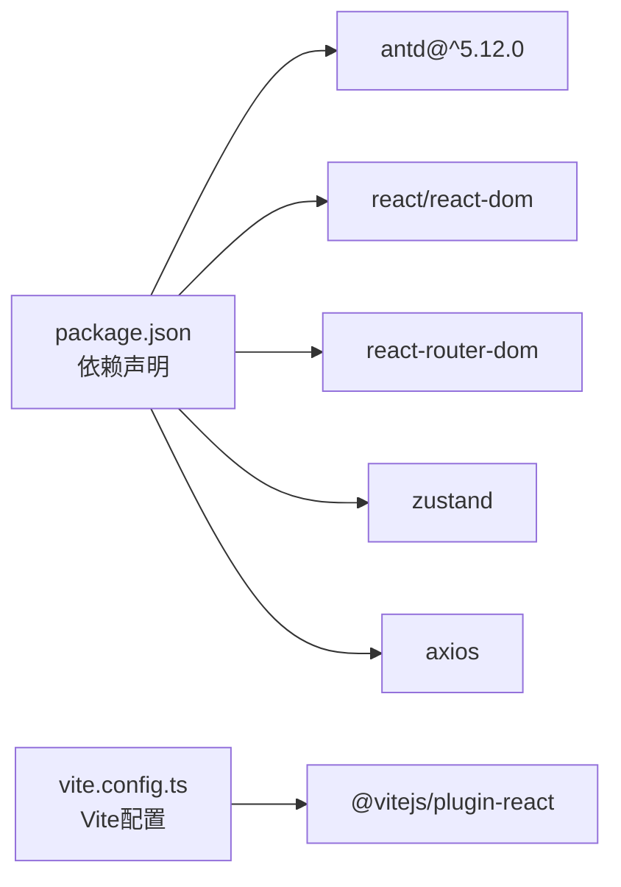

# UI组件与Ant Design集成

<cite>
**本文引用的文件**
- [package.json](file://frontend/package.json)
- [vite.config.ts](file://frontend/vite.config.ts)
- [themeConfig.ts](file://frontend/src/theme/themeConfig.ts)
- [App.tsx](file://frontend/src/App.tsx)
- [main.tsx](file://frontend/src/main.tsx)
- [AdminLayout.tsx](file://frontend/src/pages/Admin/AdminLayout.tsx)
- [SearchPage.tsx](file://frontend/src/pages/Admin/SearchPage.tsx)
- [authStore.ts](file://frontend/src/stores/authStore.ts)
- [api.ts](file://frontend/src/services/api.ts)
- [index.ts](file://frontend/src/types/index.ts)
</cite>

## 目录
1. [引言](#引言)
2. [项目结构](#项目结构)
3. [核心组件](#核心组件)
4. [架构总览](#架构总览)
5. [详细组件分析](#详细组件分析)
6. [依赖分析](#依赖分析)
7. [性能考虑](#性能考虑)
8. [故障排查指南](#故障排查指南)
9. [结论](#结论)
10. [附录](#附录)

## 引言
本文件面向数据中心项目的前端UI团队，系统化阐述Ant Design在本项目中的集成方式与最佳实践，涵盖主题定制、样式重置、组件本地化、主题系统（颜色/字体/响应式）、自定义组件开发规范、组件复用策略、测试方法（快照/交互/可访问性）以及性能优化（渲染与样式加载）。内容以仓库现有代码为依据，确保可落地、可验证。

## 项目结构
前端采用Vite + React + TypeScript技术栈，Ant Design作为UI基础库，通过ConfigProvider全局注入主题配置；页面路由基于React Router，使用懒加载与Suspense提升首屏体验；状态管理采用Zustand；Axios负责HTTP请求与拦截器处理。

图表来源
- [main.tsx:1-10](file://frontend/src/main.tsx#L1-L10)
- [App.tsx:1-69](file://frontend/src/App.tsx#L1-L69)
- [themeConfig.ts:1-62](file://frontend/src/theme/themeConfig.ts#L1-L62)
- [AdminLayout.tsx:1-203](file://frontend/src/pages/Admin/AdminLayout.tsx#L1-L203)
- [SearchPage.tsx:1-583](file://frontend/src/pages/Admin/SearchPage.tsx#L1-L583)
- [authStore.ts:1-61](file://frontend/src/stores/authStore.ts#L1-L61)
- [api.ts:1-37](file://frontend/src/services/api.ts#L1-L37)

章节来源
- [package.json:1-29](file://frontend/package.json#L1-L29)
- [vite.config.ts:1-6](file://frontend/vite.config.ts#L1-L6)
- [main.tsx:1-10](file://frontend/src/main.tsx#L1-L10)
- [App.tsx:1-69](file://frontend/src/App.tsx#L1-L69)

## 核心组件
- 主题配置：通过Ant Design提供的ThemeConfig进行全局主题定制，覆盖token与各组件级样式。
- 应用入口：在main.tsx引入Ant Design样式重置，在App.tsx通过ConfigProvider注入主题配置。
- 布局组件：AdminLayout整合Header、Sider、Menu、Breadcrumb等，提供统一导航与用户操作入口。
- 页面组件：SearchPage展示复杂数据查询、动态表单、分页与弹窗交互，体现Ant Design组件组合能力。
- 状态与服务：authStore管理认证状态与持久化，api.ts封装Axios并处理401登出逻辑。

章节来源
- [themeConfig.ts:1-62](file://frontend/src/theme/themeConfig.ts#L1-L62)
- [main.tsx:1-10](file://frontend/src/main.tsx#L1-L10)
- [App.tsx:1-69](file://frontend/src/App.tsx#L1-L69)
- [AdminLayout.tsx:1-203](file://frontend/src/pages/Admin/AdminLayout.tsx#L1-L203)
- [SearchPage.tsx:1-583](file://frontend/src/pages/Admin/SearchPage.tsx#L1-L583)
- [authStore.ts:1-61](file://frontend/src/stores/authStore.ts#L1-L61)
- [api.ts:1-37](file://frontend/src/services/api.ts#L1-L37)

## 架构总览
下图展示从应用启动到页面渲染的关键流程，突出主题注入、路由保护、状态管理与HTTP拦截器的作用点。

图表来源
- [main.tsx:1-10](file://frontend/src/main.tsx#L1-L10)
- [App.tsx:1-69](file://frontend/src/App.tsx#L1-L69)
- [themeConfig.ts:1-62](file://frontend/src/theme/themeConfig.ts#L1-L62)
- [AdminLayout.tsx:1-203](file://frontend/src/pages/Admin/AdminLayout.tsx#L1-L203)
- [SearchPage.tsx:1-583](file://frontend/src/pages/Admin/SearchPage.tsx#L1-L583)
- [authStore.ts:1-61](file://frontend/src/stores/authStore.ts#L1-L61)
- [api.ts:1-37](file://frontend/src/services/api.ts#L1-L37)

## 详细组件分析

### 主题系统与样式重置
- 全局样式重置：在入口文件引入Ant Design的reset.css，避免第三方样式污染。
- 主题配置：通过ThemeConfig集中定义token（如主色、链接色、圆角、阴影、文本与边框色等），并针对Button、Input、Table、Card、Menu、Layout等组件进行局部覆盖。
- 主题注入：在App组件顶层使用ConfigProvider包裹，使全站组件继承统一风格。

图表来源
- [main.tsx:1-10](file://frontend/src/main.tsx#L1-L10)
- [App.tsx:1-69](file://frontend/src/App.tsx#L1-L69)
- [themeConfig.ts:1-62](file://frontend/src/theme/themeConfig.ts#L1-L62)

章节来源
- [main.tsx:1-10](file://frontend/src/main.tsx#L1-L10)
- [App.tsx:1-69](file://frontend/src/App.tsx#L1-L69)
- [themeConfig.ts:1-62](file://frontend/src/theme/themeConfig.ts#L1-L62)

### 路由与布局组件（AdminLayout）
- 功能要点：侧边菜单折叠、面包屑生成、用户下拉菜单、页面出口Outlet承载子路由。
- 响应式：Sider使用breakpoint与collapsedWidth实现移动端适配。
- 导航：根据路径段映射中文标题，支持“刮削中心”特殊处理。
- 用户操作：提供个人设置与退出登录跳转。

图表来源
- [AdminLayout.tsx:1-203](file://frontend/src/pages/Admin/AdminLayout.tsx#L1-L203)

章节来源
- [AdminLayout.tsx:1-203](file://frontend/src/pages/Admin/AdminLayout.tsx#L1-L203)

### 页面组件（SearchPage）
- 数据模型：定义业务数据、字段定义、集合与动态字段类型，支撑动态表单与列渲染。
- 功能闭环：获取集合列表、按模块加载字段定义、执行JQL查询、分页与刷新、增删改弹窗、动态列生成与渲染。
- 表单与校验：根据字段类型与约束动态生成表单项与规则，支持枚举、数字范围、布尔等。
- 表格与滚动：固定列宽、溢出省略、横向滚动与纵向高度自适应。

图表来源
- [SearchPage.tsx:1-583](file://frontend/src/pages/Admin/SearchPage.tsx#L1-L583)
- [index.ts:1-97](file://frontend/src/types/index.ts#L1-L97)

章节来源
- [SearchPage.tsx:1-583](file://frontend/src/pages/Admin/SearchPage.tsx#L1-L583)
- [index.ts:1-97](file://frontend/src/types/index.ts#L1-L97)

### 认证与状态管理（authStore）
- 状态：包含认证状态、用户信息、token，以及登录、登出、检查认证、更新用户信息、修改密码等动作。
- 持久化：登录后写入localStorage，登出清理，启动时自动检查并恢复状态。
- 与路由配合：受保护路由在渲染前检查认证状态，未认证则跳转登录页。

图表来源
- [App.tsx:1-69](file://frontend/src/App.tsx#L1-L69)
- [authStore.ts:1-61](file://frontend/src/stores/authStore.ts#L1-L61)

章节来源
- [authStore.ts:1-61](file://frontend/src/stores/authStore.ts#L1-L61)
- [App.tsx:1-69](file://frontend/src/App.tsx#L1-L69)

### HTTP客户端与拦截器（api.ts）
- 客户端：基于Axios创建实例，设置基础URL与超时。
- 请求拦截：自动附加Authorization头（Bearer token）。
- 响应拦截：捕获401错误，触发登出并跳转登录页。
- 与页面协作：SearchPage等页面通过该客户端发起业务请求。

图表来源
- [api.ts:1-37](file://frontend/src/services/api.ts#L1-L37)
- [SearchPage.tsx:1-583](file://frontend/src/pages/Admin/SearchPage.tsx#L1-L583)

章节来源
- [api.ts:1-37](file://frontend/src/services/api.ts#L1-L37)
- [SearchPage.tsx:1-583](file://frontend/src/pages/Admin/SearchPage.tsx#L1-L583)

## 依赖分析
- Ant Design版本：项目依赖antd^5.12.0，配套icons、cssinjs、picker等生态包。
- 构建工具：Vite插件react用于开发与打包。
- 状态管理：Zustand提供轻量状态容器。
- 路由：React Router DOM负责路由与导航。
- 类型：TypeScript提供强类型保障。

图表来源
- [package.json:1-29](file://frontend/package.json#L1-L29)
- [vite.config.ts:1-6](file://frontend/vite.config.ts#L1-L6)

章节来源
- [package.json:1-29](file://frontend/package.json#L1-L29)
- [vite.config.ts:1-6](file://frontend/vite.config.ts#L1-L6)

## 性能考虑
- 渲染优化
  - 使用useMemo与useCallback缓存计算结果与回调，减少不必要的重渲染（例如动态列构建、查询函数）。
  - 表格启用虚拟滚动与固定列宽，结合scroll配置控制纵向与横向滚动区域。
  - 懒加载与Suspense：App与页面均采用lazy与Suspense，降低首屏资源压力。
- 样式加载优化
  - 仅引入reset.css，避免重复样式与冲突。
  - 通过ConfigProvider集中主题，减少多处样式覆盖导致的重复计算。
- 网络与状态
  - Axios拦截器统一处理401，避免页面内分散处理造成的重复请求。
  - 状态持久化于localStorage，减少重复鉴权请求。

章节来源
- [SearchPage.tsx:1-583](file://frontend/src/pages/Admin/SearchPage.tsx#L1-L583)
- [main.tsx:1-10](file://frontend/src/main.tsx#L1-L10)
- [App.tsx:1-69](file://frontend/src/App.tsx#L1-L69)
- [api.ts:1-37](file://frontend/src/services/api.ts#L1-L37)

## 故障排查指南
- 登录态异常
  - 现象：进入受保护路由被重定向至登录页。
  - 排查：确认localStorage中token与user是否存在；检查store.checkAuth是否正确恢复状态。
- 401未授权
  - 现象：接口返回401，自动跳转登录。
  - 排查：检查请求拦截器是否正确附加Authorization头；确认后端JWT签发与有效期。
- 主题不生效
  - 现象：组件未按预期使用主题色或圆角。
  - 排查：确认ConfigProvider包裹层级；检查themeConfig.ts中token与components配置是否正确。
- 表格列错位或滚动异常
  - 现象：横向滚动条缺失或列宽错乱。
  - 排查：检查columns宽度与ellipsis配置；确认scroll.x设置为字符串以支持自适应宽度。

章节来源
- [authStore.ts:1-61](file://frontend/src/stores/authStore.ts#L1-L61)
- [api.ts:1-37](file://frontend/src/services/api.ts#L1-L37)
- [App.tsx:1-69](file://frontend/src/App.tsx#L1-L69)
- [themeConfig.ts:1-62](file://frontend/src/theme/themeConfig.ts#L1-L62)
- [SearchPage.tsx:1-583](file://frontend/src/pages/Admin/SearchPage.tsx#L1-L583)

## 结论
本项目以Ant Design为核心UI框架，通过ConfigProvider集中主题、结合Zustand与Axios实现清晰的状态与网络层，辅以React Router的路由保护与懒加载，形成稳定、可扩展的前端架构。建议后续在现有基础上完善组件测试与可访问性，持续沉淀通用组件与组合模式，进一步提升开发效率与用户体验。

## 附录
- 自定义组件开发规范（建议）
  - 设计原则：单一职责、可组合、可复用；遵循Ant Design设计语言。
  - API设计：Props保持精简，事件回调命名一致；提供默认值与类型约束。
  - 样式封装：优先使用ConfigProvider主题变量；避免内联样式的过度使用。
- 组件复用策略（建议）
  - 通用组件抽象：将重复出现的交互（如弹窗、表单、分页）抽取为高阶组件或Hook。
  - 组合模式：通过children或render props实现灵活的内容承载。
- 测试方法（建议）
  - 快照测试：对静态布局与无状态组件进行快照对比，确保回归稳定。
  - 交互测试：使用用户行为驱动（如点击、输入、提交），断言状态变化与API调用。
  - 可访问性测试：确保键盘可达、ARIA属性完整、颜色对比度符合标准。