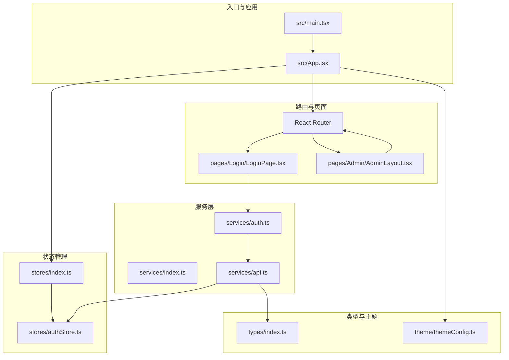
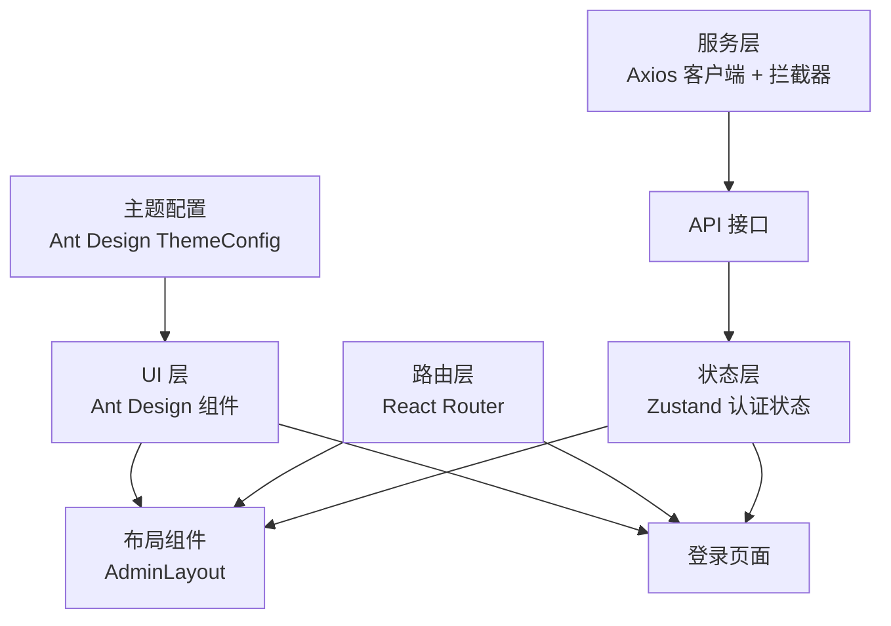
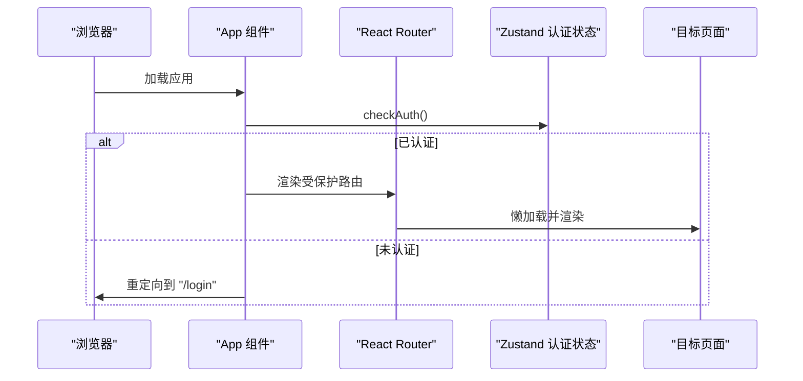
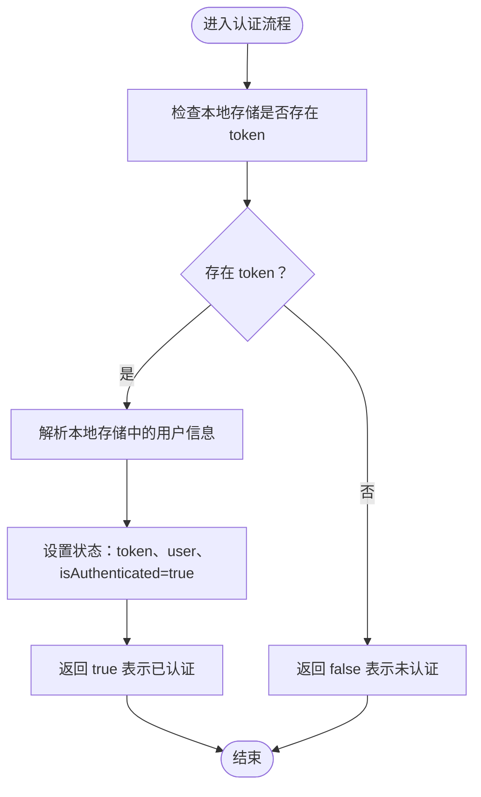
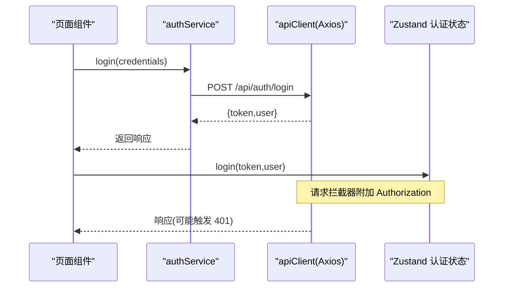
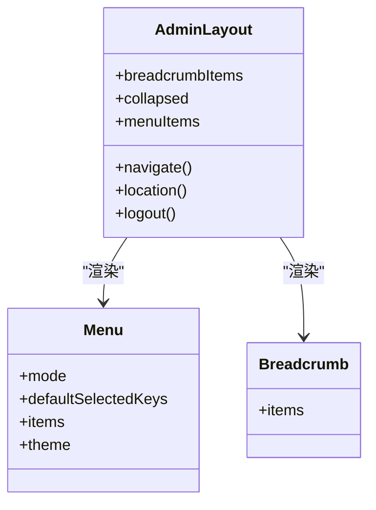
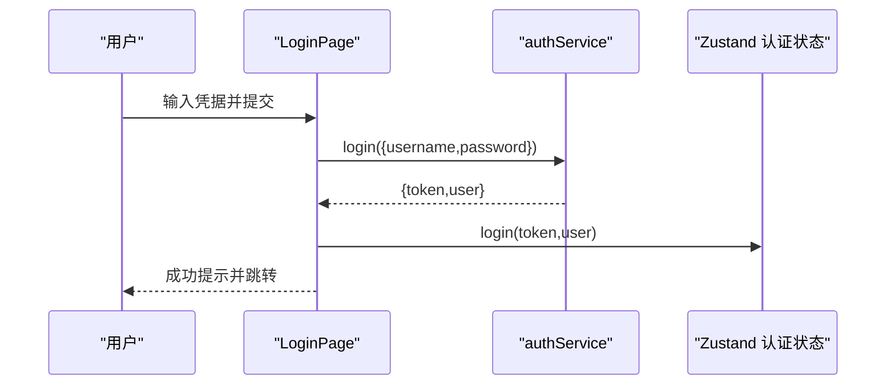
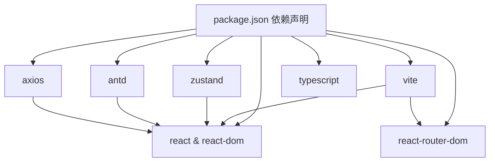

# 前端架构设计

<cite>
**本文档引用的文件**
- [frontend/package.json](file://frontend/package.json)
- [frontend/vite.config.ts](file://frontend/vite.config.ts)
- [frontend/tsconfig.json](file://frontend/tsconfig.json)
- [frontend/src/main.tsx](file://frontend/src/main.tsx)
- [frontend/src/App.tsx](file://frontend/src/App.tsx)
- [frontend/src/stores/index.ts](file://frontend/src/stores/index.ts)
- [frontend/src/stores/authStore.ts](file://frontend/src/stores/authStore.ts)
- [frontend/src/theme/themeConfig.ts](file://frontend/src/theme/themeConfig.ts)
- [frontend/src/services/index.ts](file://frontend/src/services/index.ts)
- [frontend/src/services/api.ts](file://frontend/src/services/api.ts)
- [frontend/src/services/auth.ts](file://frontend/src/services/auth.ts)
- [frontend/src/types/index.ts](file://frontend/src/types/index.ts)
- [frontend/src/pages/Admin/AdminLayout.tsx](file://frontend/src/pages/Admin/AdminLayout.tsx)
- [frontend/src/pages/Login/LoginPage.tsx](file://frontend/src/pages/Login/LoginPage.tsx)
- [frontend/src/components/index.ts](file://frontend/src/components/index.ts)
</cite>

## 目录
1. [引言](#引言)
2. [项目结构](#项目结构)
3. [核心组件](#核心组件)
4. [架构总览](#架构总览)
5. [详细组件分析](#详细组件分析)
6. [依赖关系分析](#依赖关系分析)
7. [性能考虑](#性能考虑)
8. [故障排查指南](#故障排查指南)
9. [结论](#结论)
10. [附录](#附录)

## 引言
本文件面向数据中心项目的前端团队与相关干系人，系统化阐述基于 React 18 + TypeScript 的现代前端架构设计。内容涵盖组件化理念、状态管理模式（Zustand）、路由系统（React Router）、Ant Design 集成与主题定制、构建与类型系统、代码规范、组件设计原则、性能优化策略以及开发与部署流程。

## 项目结构
前端采用模块化分层组织：入口与应用根组件负责路由与主题注入；页面按功能域划分；服务层封装 API 调用与拦截器；状态层使用 Zustand 管理认证状态；类型系统统一定义业务模型；组件导出入口集中管理。

**图表来源**
- [frontend/src/main.tsx:1-10](file://frontend/src/main.tsx#L1-L10)
- [frontend/src/App.tsx:1-69](file://frontend/src/App.tsx#L1-L69)
- [frontend/src/stores/index.ts:1-1](file://frontend/src/stores/index.ts#L1-L1)
- [frontend/src/stores/authStore.ts:1-61](file://frontend/src/stores/authStore.ts#L1-L61)
- [frontend/src/services/index.ts:1-6](file://frontend/src/services/index.ts#L1-L6)
- [frontend/src/services/api.ts:1-37](file://frontend/src/services/api.ts#L1-L37)
- [frontend/src/services/auth.ts:1-26](file://frontend/src/services/auth.ts#L1-L26)
- [frontend/src/types/index.ts:1-97](file://frontend/src/types/index.ts#L1-L97)
- [frontend/src/theme/themeConfig.ts:1-62](file://frontend/src/theme/themeConfig.ts#L1-L62)
- [frontend/src/pages/Admin/AdminLayout.tsx:1-203](file://frontend/src/pages/Admin/AdminLayout.tsx#L1-L203)
- [frontend/src/pages/Login/LoginPage.tsx:1-75](file://frontend/src/pages/Login/LoginPage.tsx#L1-L75)

**章节来源**
- [frontend/package.json:1-29](file://frontend/package.json#L1-L29)
- [frontend/vite.config.ts:1-6](file://frontend/vite.config.ts#L1-L6)
- [frontend/tsconfig.json:1-21](file://frontend/tsconfig.json#L1-L21)

## 核心组件
- 应用根组件与路由：在应用根组件中配置 Ant Design 主题、浏览器路由与懒加载骨架，并通过受保护路由守卫控制访问。
- 认证状态管理：使用 Zustand 管理 token、用户信息与认证状态，持久化到本地存储并在应用启动时进行校验。
- 页面布局与导航：管理后台布局组件提供侧边菜单、面包屑与用户下拉菜单，支持折叠与路由跳转。
- 登录页面：表单校验、调用认证服务、写入状态并跳转。
- 服务层：Axios 客户端封装、请求/响应拦截器、认证服务接口。
- 类型系统：统一定义用户、角色、权限、分页等业务模型。

**章节来源**
- [frontend/src/App.tsx:1-69](file://frontend/src/App.tsx#L1-L69)
- [frontend/src/stores/authStore.ts:1-61](file://frontend/src/stores/authStore.ts#L1-L61)
- [frontend/src/pages/Admin/AdminLayout.tsx:1-203](file://frontend/src/pages/Admin/AdminLayout.tsx#L1-L203)
- [frontend/src/pages/Login/LoginPage.tsx:1-75](file://frontend/src/pages/Login/LoginPage.tsx#L1-L75)
- [frontend/src/services/api.ts:1-37](file://frontend/src/services/api.ts#L1-L37)
- [frontend/src/services/auth.ts:1-26](file://frontend/src/services/auth.ts#L1-L26)
- [frontend/src/types/index.ts:1-97](file://frontend/src/types/index.ts#L1-L97)

## 架构总览
前端采用“路由驱动 + 状态驱动 + 服务驱动”的分层架构：
- 路由层：React Router 负责页面级路由与懒加载，结合受保护路由守卫实现访问控制。
- 状态层：Zustand 管理认证状态与用户信息，提供最小必要状态以降低耦合。
- 服务层：Axios 封装统一客户端，内置鉴权头注入与 401 自动登出逻辑。
- UI 层：Ant Design 提供基础组件与主题体系，配合自定义主题配置实现品牌一致性。
- 类型层：TypeScript 类型系统贯穿前后端交互，确保数据结构一致与编译期安全。

**图表来源**
- [frontend/src/App.tsx:1-69](file://frontend/src/App.tsx#L1-L69)
- [frontend/src/stores/authStore.ts:1-61](file://frontend/src/stores/authStore.ts#L1-L61)
- [frontend/src/services/api.ts:1-37](file://frontend/src/services/api.ts#L1-L37)
- [frontend/src/theme/themeConfig.ts:1-62](file://frontend/src/theme/themeConfig.ts#L1-L62)
- [frontend/src/pages/Admin/AdminLayout.tsx:1-203](file://frontend/src/pages/Admin/AdminLayout.tsx#L1-L203)
- [frontend/src/pages/Login/LoginPage.tsx:1-75](file://frontend/src/pages/Login/LoginPage.tsx#L1-L75)

## 详细组件分析

### 路由与受保护路由
- 使用 React Router v6 的嵌套路由与懒加载，结合 Suspense 提供加载骨架。
- 受保护路由通过 Zustand 认证状态判断是否放行，未认证则重定向至登录页。
- 应用启动时自动执行一次认证检查，保证刷新后状态一致。

**图表来源**
- [frontend/src/App.tsx:19-31](file://frontend/src/App.tsx#L19-L31)
- [frontend/src/App.tsx:33-67](file://frontend/src/App.tsx#L33-L67)
- [frontend/src/stores/authStore.ts:29-46](file://frontend/src/stores/authStore.ts#L29-L46)

**章节来源**
- [frontend/src/App.tsx:1-69](file://frontend/src/App.tsx#L1-L69)

### Zustand 认证状态管理
- 全局状态包含认证状态、用户信息与 token。
- 提供登录、登出、认证检查、更新用户信息、修改密码等方法。
- 登录时持久化 token 与用户信息；登出时移除持久化并清空状态。
- 认证检查从本地存储读取 token 与用户信息，恢复状态并返回布尔值。

**图表来源**
- [frontend/src/stores/authStore.ts:29-46](file://frontend/src/stores/authStore.ts#L29-L46)

**章节来源**
- [frontend/src/stores/authStore.ts:1-61](file://frontend/src/stores/authStore.ts#L1-L61)

### Ant Design 集成与主题定制
- 在入口文件引入重置样式，避免第三方样式污染。
- 通过 ConfigProvider 注入主题配置，覆盖全局 token 与组件级样式。
- 主题配置覆盖按钮、输入框、表格、卡片、菜单、布局等组件的视觉风格。

**图表来源**
- [frontend/src/main.tsx:4-4](file://frontend/src/main.tsx#L4-L4)
- [frontend/src/App.tsx:42-42](file://frontend/src/App.tsx#L42-L42)
- [frontend/src/theme/themeConfig.ts:3-60](file://frontend/src/theme/themeConfig.ts#L3-L60)

**章节来源**
- [frontend/src/main.tsx:1-10](file://frontend/src/main.tsx#L1-L10)
- [frontend/src/theme/themeConfig.ts:1-62](file://frontend/src/theme/themeConfig.ts#L1-L62)

### 服务层与 API 客户端
- Axios 客户端统一配置基础地址与超时时间。
- 请求拦截器自动附加 Bearer Token。
- 响应拦截器处理 401 未授权：触发登出并跳转登录页。
- 认证服务封装登录与获取当前用户信息接口。

**图表来源**
- [frontend/src/services/auth.ts:14-23](file://frontend/src/services/auth.ts#L14-L23)
- [frontend/src/services/api.ts:5-35](file://frontend/src/services/api.ts#L5-L35)
- [frontend/src/stores/authStore.ts:19-28](file://frontend/src/stores/authStore.ts#L19-L28)

**章节来源**
- [frontend/src/services/api.ts:1-37](file://frontend/src/services/api.ts#L1-L37)
- [frontend/src/services/auth.ts:1-26](file://frontend/src/services/auth.ts#L1-L26)

### 管理后台布局与导航
- 顶部区域包含标题与用户下拉菜单，支持退出登录与跳转设置。
- 侧边菜单采用分组结构，支持折叠与响应式断点。
- 面包屑根据路由路径动态生成中文标题映射。
- 通过 Outlet 渲染子路由页面。

**图表来源**
- [frontend/src/pages/Admin/AdminLayout.tsx:9-203](file://frontend/src/pages/Admin/AdminLayout.tsx#L9-L203)

**章节来源**
- [frontend/src/pages/Admin/AdminLayout.tsx:1-203](file://frontend/src/pages/Admin/AdminLayout.tsx#L1-L203)

### 登录页面
- 表单验证用户名与密码长度规则。
- 调用认证服务发起登录请求，成功后写入状态并跳转管理后台。
- 错误提示统一使用消息组件展示。

**图表来源**
- [frontend/src/pages/Login/LoginPage.tsx:13-31](file://frontend/src/pages/Login/LoginPage.tsx#L13-L31)
- [frontend/src/services/auth.ts:14-23](file://frontend/src/services/auth.ts#L14-L23)
- [frontend/src/stores/authStore.ts:19-23](file://frontend/src/stores/authStore.ts#L19-L23)

**章节来源**
- [frontend/src/pages/Login/LoginPage.tsx:1-75](file://frontend/src/pages/Login/LoginPage.tsx#L1-L75)

## 依赖关系分析
- 技术栈：React 18、TypeScript、Ant Design 5、React Router DOM、Zustand、Axios、Vite。
- 构建与类型：Vite 提供开发与生产构建，TypeScript 编译与严格模式保障类型安全。
- 组件导出：组件导出入口文件用于集中导出，便于后续扩展。

**图表来源**
- [frontend/package.json:12-27](file://frontend/package.json#L12-L27)

**章节来源**
- [frontend/package.json:1-29](file://frontend/package.json#L1-L29)
- [frontend/vite.config.ts:1-6](file://frontend/vite.config.ts#L1-L6)
- [frontend/tsconfig.json:1-21](file://frontend/tsconfig.json#L1-L21)
- [frontend/src/components/index.ts:1-1](file://frontend/src/components/index.ts#L1-L1)

## 性能考虑
- 代码分割与懒加载：路由级懒加载与 Suspense 骨架提升首屏体验。
- 状态最小化：Zustand 仅存放必要状态，避免跨组件冗余订阅。
- 组件按需：Ant Design 组件按需引入，减少打包体积。
- 缓存策略：利用本地存储持久化 token 与用户信息，减少重复请求。
- 构建优化：Vite 默认启用模块联邦与预构建，生产构建压缩资源。

[本节为通用性能建议，无需特定文件引用]

## 故障排查指南
- 登录失败：检查认证服务接口与网络连通性，查看错误消息提示。
- 401 未授权：确认请求拦截器是否正确附加 Authorization 头，检查响应拦截器登出逻辑。
- 路由跳转异常：确认受保护路由守卫与路由配置，检查懒加载组件是否正确导出。
- 主题不生效：确认入口文件引入重置样式与 ConfigProvider 包裹范围。

**章节来源**
- [frontend/src/services/api.ts:23-35](file://frontend/src/services/api.ts#L23-L35)
- [frontend/src/App.tsx:19-31](file://frontend/src/App.tsx#L19-L31)
- [frontend/src/main.tsx:4-4](file://frontend/src/main.tsx#L4-L4)

## 结论
该前端架构以 React 18 为核心，结合 TypeScript、Ant Design 与 Zustand，形成清晰的分层与职责边界。路由与状态驱动页面渲染，服务层统一处理 API 与鉴权，主题系统保障视觉一致性。通过懒加载、状态最小化与构建优化，兼顾可维护性与性能表现。建议后续完善 ESLint 规范与单元测试，持续迭代组件复用与可测试性。

## 附录
- 开发环境配置：安装依赖后运行开发服务器，访问本地端口查看效果。
- 构建与预览：执行构建脚本生成产物，使用预览命令本地验证。
- 类型系统：所有业务模型集中在类型文件中，确保前后端契约一致。

**章节来源**
- [frontend/package.json:6-11](file://frontend/package.json#L6-L11)
- [frontend/tsconfig.json:2-18](file://frontend/tsconfig.json#L2-L18)