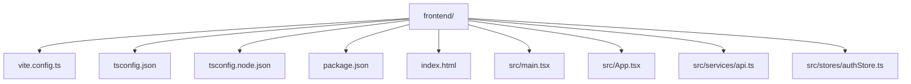
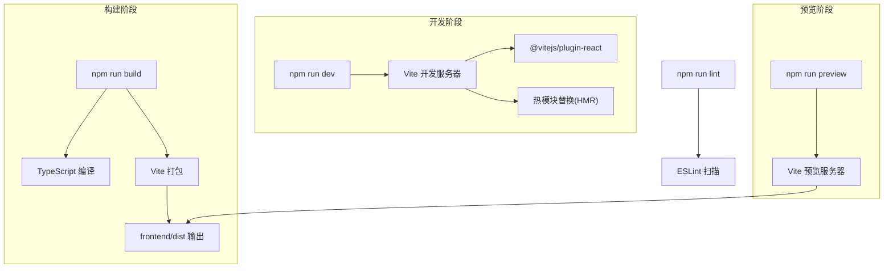
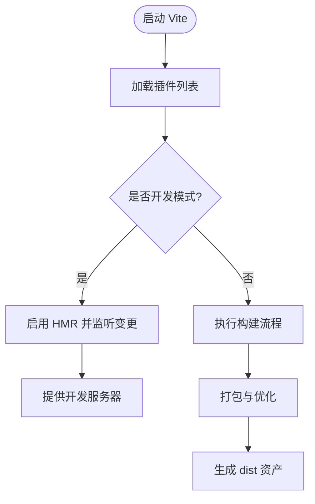
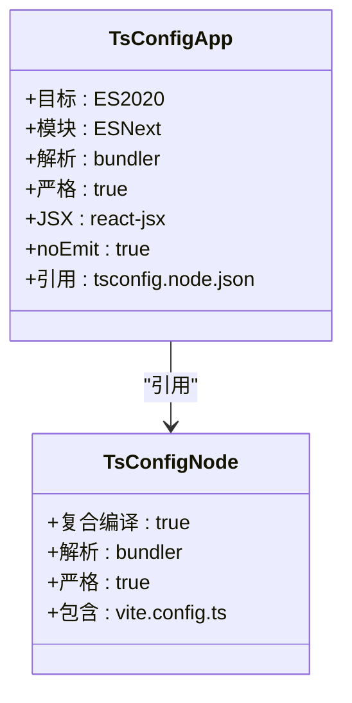
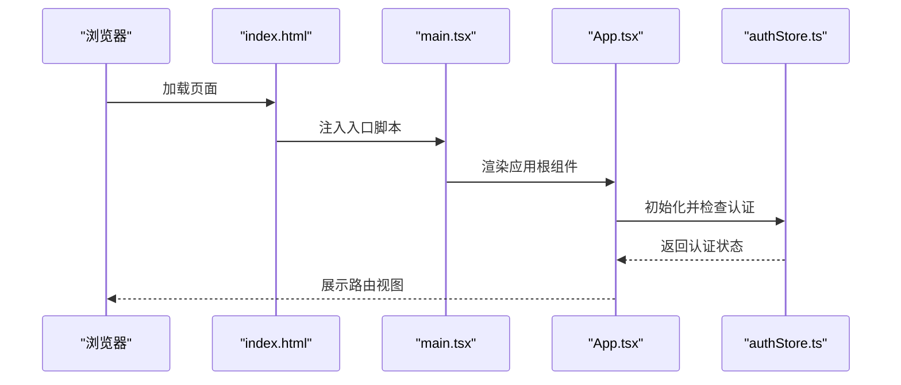
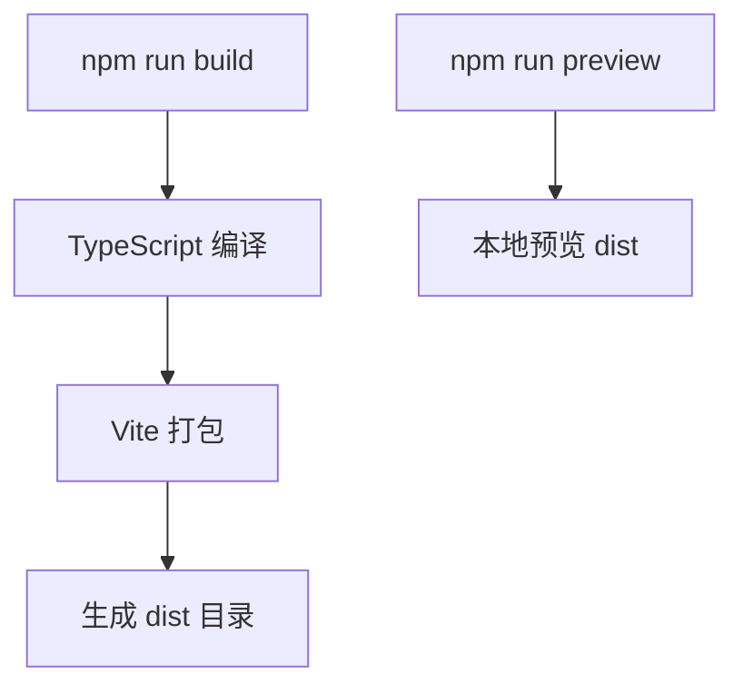
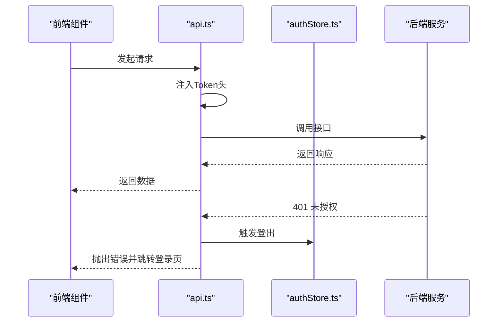
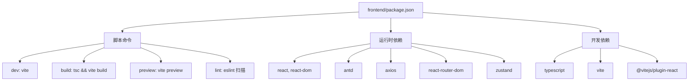

# 构建配置与开发环境

<cite>
**本文引用的文件**
- [vite.config.ts](file://frontend/vite.config.ts)
- [tsconfig.json](file://frontend/tsconfig.json)
- [tsconfig.node.json](file://frontend/tsconfig.node.json)
- [package.json](file://frontend/package.json)
- [README.md](file://README.md)
- [main.tsx](file://frontend/src/main.tsx)
- [App.tsx](file://frontend/src/App.tsx)
- [index.html](file://frontend/index.html)
- [api.ts](file://frontend/src/services/api.ts)
- [authStore.ts](file://frontend/src/stores/authStore.ts)
</cite>

## 目录
1. [简介](#简介)
2. [项目结构](#项目结构)
3. [核心组件](#核心组件)
4. [架构概览](#架构概览)
5. [详细组件分析](#详细组件分析)
6. [依赖分析](#依赖分析)
7. [性能考虑](#性能考虑)
8. [故障排除指南](#故障排除指南)
9. [结论](#结论)
10. [附录](#附录)

## 简介
本文件面向数据中心项目的前端构建配置与开发环境，围绕Vite构建工具、TypeScript配置、ESLint与Prettier规范、开发与生产环境搭建进行系统化说明。当前仓库前端采用React + TypeScript + Vite技术栈，构建脚本通过TypeScript编译与Vite打包结合，形成一体化的开发与生产流程。

## 项目结构
前端项目位于 `frontend/` 目录，关键配置与源码分布如下：
- 构建配置：`vite.config.ts`
- 类型配置：`tsconfig.json`、`tsconfig.node.json`
- 包管理与脚本：`package.json`
- 入口页面与应用：`index.html`、`src/main.tsx`、`src/App.tsx`
- 开发与生产脚本：`npm run dev`、`npm run build`、`npm run preview`、`npm run lint`

**图表来源**
- [vite.config.ts:1-6](file://frontend/vite.config.ts#L1-L6)
- [tsconfig.json:1-21](file://frontend/tsconfig.json#L1-L21)
- [tsconfig.node.json:1-11](file://frontend/tsconfig.node.json#L1-L11)
- [package.json:1-29](file://frontend/package.json#L1-L29)
- [index.html:1-13](file://frontend/index.html#L1-L13)
- [main.tsx:1-10](file://frontend/src/main.tsx#L1-L10)
- [App.tsx:1-69](file://frontend/src/App.tsx#L1-L69)
- [api.ts:1-37](file://frontend/src/services/api.ts#L1-L37)
- [authStore.ts:1-61](file://frontend/src/stores/authStore.ts#L1-L61)

**章节来源**
- [README.md:106-134](file://README.md#L106-L134)
- [package.json:1-29](file://frontend/package.json#L1-L29)

## 核心组件
- Vite构建配置：启用React插件，提供开发服务器与构建能力。
- TypeScript配置：双配置文件（应用与Node）确保严格类型检查与模块解析一致性。
- 包管理脚本：统一的开发、构建、预览与代码质量检查命令。
- 应用入口与路由：HTML模板、React入口、路由与状态管理集成。

**章节来源**
- [vite.config.ts:1-6](file://frontend/vite.config.ts#L1-L6)
- [tsconfig.json:1-21](file://frontend/tsconfig.json#L1-L21)
- [tsconfig.node.json:1-11](file://frontend/tsconfig.node.json#L1-L11)
- [package.json:6-11](file://frontend/package.json#L6-L11)
- [index.html:1-13](file://frontend/index.html#L1-L13)
- [main.tsx:1-10](file://frontend/src/main.tsx#L1-L10)
- [App.tsx:1-69](file://frontend/src/App.tsx#L1-L69)

## 架构概览
前端构建与运行涉及以下关键流程：
- 开发模式：Vite启动本地开发服务器，自动注入React插件，支持热更新。
- 构建模式：先执行TypeScript编译，再由Vite打包生成静态资源。
- 预览模式：本地预览生产构建产物。
- 代码质量：ESLint扫描与报告，配合Prettier格式化（如已配置）。

**图表来源**
- [package.json:6-11](file://frontend/package.json#L6-L11)
- [vite.config.ts:1-6](file://frontend/vite.config.ts#L1-L6)
- [tsconfig.json:1-21](file://frontend/tsconfig.json#L1-L21)

## 详细组件分析

### Vite 构建配置与优化
- 插件体系：仅启用React相关插件，保持最小化配置，便于后续按需扩展。
- 开发服务器：默认端口与代理可通过Vite配置扩展（当前未设置）。
- 构建优化：可引入压缩、资源内联、拆分策略等（当前未配置）。
- 热模块替换：由React插件与Vite协作提供，默认生效。

**图表来源**
- [vite.config.ts:1-6](file://frontend/vite.config.ts#L1-L6)
- [package.json:7-10](file://frontend/package.json#L7-L10)

**章节来源**
- [vite.config.ts:1-6](file://frontend/vite.config.ts#L1-L6)
- [package.json:7-10](file://frontend/package.json#L7-L10)

### TypeScript 配置详解
- 应用配置（tsconfig.json）
  - 目标与模块：ES2020目标与ESNext模块，适配现代浏览器与打包器。
  - 解析策略：bundler解析，避免传统node解析差异。
  - 严格性：开启严格模式与未使用检测，减少潜在错误。
  - JSX：使用React JSX转换，配合React插件。
  - 引用：通过references指向Node配置，保证双环境一致性。
- Node配置（tsconfig.node.json）
  - 用于Vite配置文件的类型检查，启用bundler解析与合成编译。

**图表来源**
- [tsconfig.json:1-21](file://frontend/tsconfig.json#L1-L21)
- [tsconfig.node.json:1-11](file://frontend/tsconfig.node.json#L1-L11)

**章节来源**
- [tsconfig.json:1-21](file://frontend/tsconfig.json#L1-L21)
- [tsconfig.node.json:1-11](file://frontend/tsconfig.node.json#L1-L11)

### 开发服务器与入口集成
- HTML模板：定义根节点与基础元信息，入口脚本指向应用入口。
- React入口：挂载应用根节点，启用严格模式。
- 应用路由：集中式路由与受保护路由，结合状态管理完成认证检查。

**图表来源**
- [index.html:1-13](file://frontend/index.html#L1-L13)
- [main.tsx:1-10](file://frontend/src/main.tsx#L1-L10)
- [App.tsx:1-69](file://frontend/src/App.tsx#L1-L69)
- [authStore.ts:1-61](file://frontend/src/stores/authStore.ts#L1-L61)

**章节来源**
- [index.html:1-13](file://frontend/index.html#L1-L13)
- [main.tsx:1-10](file://frontend/src/main.tsx#L1-L10)
- [App.tsx:1-69](file://frontend/src/App.tsx#L1-L69)
- [authStore.ts:1-61](file://frontend/src/stores/authStore.ts#L1-L61)

### 生产构建与部署准备
- 构建流程：先TypeScript编译，再Vite打包，生成静态资源至dist目录。
- 预览：本地预览生产构建产物，验证打包结果。
- 部署：将dist目录作为静态站点发布，或集成到反向代理。

**图表来源**
- [package.json:8-10](file://frontend/package.json#L8-L10)

**章节来源**
- [package.json:8-10](file://frontend/package.json#L8-L10)
- [README.md:127-134](file://README.md#L127-L134)

### 代码规范与格式化（ESLint 与 Prettier）
- ESLint：通过脚本执行扫描，报告未使用规则与警告上限控制。
- Prettier：当前仓库未发现配置文件，建议新增配置以统一格式化风格。
- 建议实践：在CI中强制执行ESLint与Prettier，确保提交前一致性。

**章节来源**
- [package.json:9-9](file://frontend/package.json#L9-L9)

### API 客户端与认证集成
- API客户端：固定后端地址与超时配置，统一注入Authorization头。
- 认证拦截：401响应触发登出与跳转，保障会话安全。
- 状态管理：Zustand存储认证状态与用户信息，持久化于本地存储。

**图表来源**
- [api.ts:1-37](file://frontend/src/services/api.ts#L1-L37)
- [authStore.ts:1-61](file://frontend/src/stores/authStore.ts#L1-L61)

**章节来源**
- [api.ts:1-37](file://frontend/src/services/api.ts#L1-L37)
- [authStore.ts:1-61](file://frontend/src/stores/authStore.ts#L1-L61)

## 依赖分析
- 运行时依赖：React、React DOM、Ant Design、Axios、React Router、Zustand。
- 开发依赖：TypeScript、Vite、React插件。
- 脚本命令：dev、build、preview、lint。

**图表来源**
- [package.json:1-29](file://frontend/package.json#L1-L29)

**章节来源**
- [package.json:1-29](file://frontend/package.json#L1-L29)

## 性能考虑
- 构建优化建议
  - 代码分割：按路由或组件拆分，结合懒加载减少首屏体积。
  - 资源压缩：启用压缩与Gzip/Brotli传输。
  - 静态资源：CDN托管与缓存策略。
  - Tree Shaking：确保模块化与严格模式以提升摇树效果。
- 开发体验
  - HMR：保持热更新启用，减少全量刷新。
  - 依赖预构建：Vite自动处理常见依赖，可按需调整。
- 类型检查
  - 双配置文件：确保应用与Node配置一致，避免类型漂移。
  - 严格模式：尽早暴露类型问题，降低运行时风险。

## 故障排除指南
- 开发服务器无法启动
  - 检查端口占用与网络权限；确认Node版本满足要求。
  - 查看Vite插件是否正确安装与加载。
- 构建失败
  - TypeScript编译错误：优先修复类型问题；必要时临时放宽规则定位根因。
  - Vite打包错误：检查入口与别名配置、动态导入语法。
- 401未授权
  - 检查本地存储中的Token有效性与过期时间。
  - 确认后端JWT密钥与过期策略一致。
- ESLint报错
  - 按提示修复未使用规则与警告；在CI中限制最大警告数。
- Prettier缺失
  - 新增配置文件并在提交前执行格式化，避免风格分歧。

**章节来源**
- [api.ts:23-35](file://frontend/src/services/api.ts#L23-L35)
- [authStore.ts:24-28](file://frontend/src/stores/authStore.ts#L24-L28)
- [package.json:9-9](file://frontend/package.json#L9-L9)

## 结论
本项目前端采用简洁高效的Vite + React + TypeScript组合，通过双TS配置与最小化插件集实现了快速开发与稳定构建。建议在现有基础上补充ESLint与Prettier配置、引入构建优化策略，并完善环境变量与后端联调流程，以进一步提升开发效率与交付质量。

## 附录
- 开发环境搭建步骤
  - 进入前端目录，安装依赖并启动开发服务器。
  - 后端服务需同时运行，确保API可达。
- 生产构建与部署
  - 执行构建脚本生成dist目录，本地预览验证后部署。

**章节来源**
- [README.md:106-134](file://README.md#L106-L134)