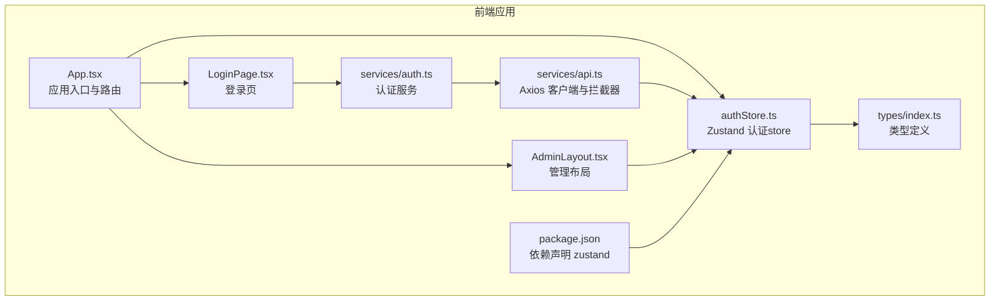
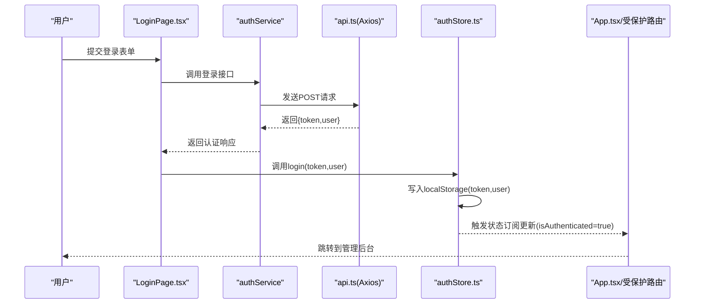
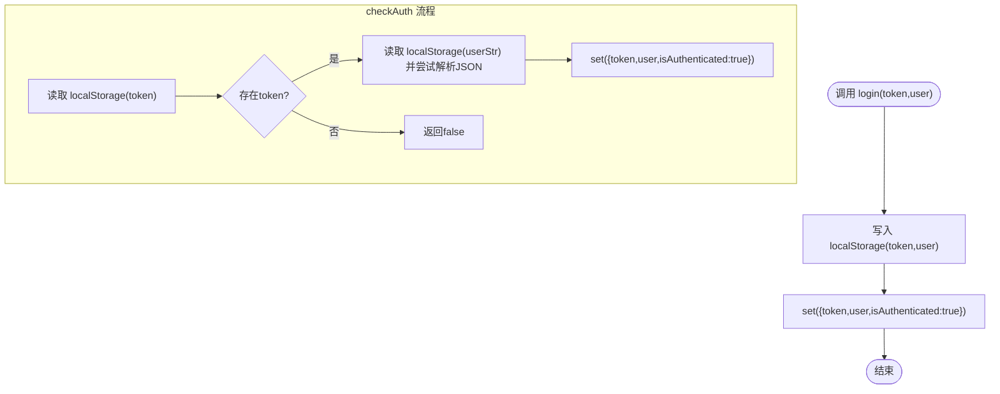
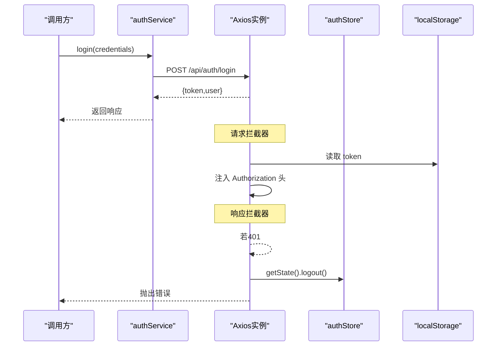
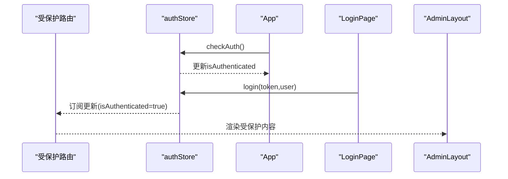
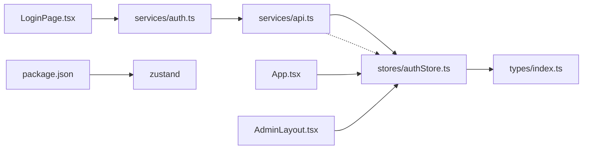

# 状态管理设计

<cite>
**本文引用的文件**
- [frontend/src/stores/index.ts](file://frontend/src/stores/index.ts)
- [frontend/src/stores/authStore.ts](file://frontend/src/stores/authStore.ts)
- [frontend/src/services/auth.ts](file://frontend/src/services/auth.ts)
- [frontend/src/services/api.ts](file://frontend/src/services/api.ts)
- [frontend/src/App.tsx](file://frontend/src/App.tsx)
- [frontend/src/pages/Login/LoginPage.tsx](file://frontend/src/pages/Login/LoginPage.tsx)
- [frontend/src/pages/Admin/AdminLayout.tsx](file://frontend/src/pages/Admin/AdminLayout.tsx)
- [frontend/src/types/index.ts](file://frontend/src/types/index.ts)
- [frontend/package.json](file://frontend/package.json)
</cite>

## 目录
1. [引言](#引言)
2. [项目结构](#项目结构)
3. [核心组件](#核心组件)
4. [架构总览](#架构总览)
5. [详细组件分析](#详细组件分析)
6. [依赖关系分析](#依赖关系分析)
7. [性能考量](#性能考量)
8. [故障排查指南](#故障排查指南)
9. [结论](#结论)
10. [附录](#附录)

## 引言
本文件面向数据中心项目的前端状态管理，聚焦于Zustand在认证态中的实现与使用，系统化阐述store设计模式、状态更新机制与订阅系统；梳理全局状态组织（认证、用户、令牌），说明本地持久化策略（localStorage）与会话存储（sessionStorage）的适用场景；给出状态更新的原子性、不可变性与性能优化建议；介绍调试与追踪方法，并提供测试策略与错误处理机制。

## 项目结构
前端采用React + TypeScript + Vite构建，状态管理基于Zustand。认证状态集中在单个store中，通过服务层与API拦截器协同完成登录、鉴权与登出流程；路由层通过受保护路由组件在应用启动时进行自动鉴权。

**图表来源**
- [frontend/src/App.tsx:1-69](file://frontend/src/App.tsx#L1-L69)
- [frontend/src/pages/Login/LoginPage.tsx:1-75](file://frontend/src/pages/Login/LoginPage.tsx#L1-L75)
- [frontend/src/pages/Admin/AdminLayout.tsx:1-203](file://frontend/src/pages/Admin/AdminLayout.tsx#L1-L203)
- [frontend/src/stores/authStore.ts:1-61](file://frontend/src/stores/authStore.ts#L1-L61)
- [frontend/src/services/auth.ts:1-26](file://frontend/src/services/auth.ts#L1-L26)
- [frontend/src/services/api.ts:1-37](file://frontend/src/services/api.ts#L1-L37)
- [frontend/src/types/index.ts:1-97](file://frontend/src/types/index.ts#L1-L97)
- [frontend/package.json:1-29](file://frontend/package.json#L1-L29)

**章节来源**
- [frontend/src/App.tsx:1-69](file://frontend/src/App.tsx#L1-L69)
- [frontend/src/stores/index.ts:1-1](file://frontend/src/stores/index.ts#L1-L1)
- [frontend/package.json:1-29](file://frontend/package.json#L1-L29)

## 核心组件
- Zustand 认证store：集中管理认证状态（是否已认证、当前用户、令牌），提供登录、登出、检查认证、更新用户信息、修改密码等动作。
- 认证服务：封装登录与获取当前用户信息的API调用。
- Axios 客户端与拦截器：统一请求头注入令牌、401自动登出与跳转。
- 路由与页面：受保护路由在应用启动时检查认证状态；登录页触发登录流程；管理布局展示用户信息并支持登出。

关键职责与边界
- store：仅负责状态与派发，不直接处理网络请求。
- 服务层：封装API调用，返回标准化响应。
- 拦截器：横切逻辑，处理认证态异常与自动登出。
- 页面与路由：消费store状态，触发动作。

**章节来源**
- [frontend/src/stores/authStore.ts:1-61](file://frontend/src/stores/authStore.ts#L1-L61)
- [frontend/src/services/auth.ts:1-26](file://frontend/src/services/auth.ts#L1-L26)
- [frontend/src/services/api.ts:1-37](file://frontend/src/services/api.ts#L1-L37)
- [frontend/src/App.tsx:1-69](file://frontend/src/App.tsx#L1-L69)
- [frontend/src/pages/Login/LoginPage.tsx:1-75](file://frontend/src/pages/Login/LoginPage.tsx#L1-L75)
- [frontend/src/pages/Admin/AdminLayout.tsx:1-203](file://frontend/src/pages/Admin/AdminLayout.tsx#L1-L203)

## 架构总览
下图展示了从用户登录到状态更新、持久化与路由控制的完整链路。

**图表来源**
- [frontend/src/pages/Login/LoginPage.tsx:13-31](file://frontend/src/pages/Login/LoginPage.tsx#L13-L31)
- [frontend/src/services/auth.ts:14-18](file://frontend/src/services/auth.ts#L14-L18)
- [frontend/src/services/api.ts:5-21](file://frontend/src/services/api.ts#L5-L21)
- [frontend/src/stores/authStore.ts:19-23](file://frontend/src/stores/authStore.ts#L19-L23)
- [frontend/src/App.tsx:19-31](file://frontend/src/App.tsx#L19-L31)

## 详细组件分析

### Zustand 认证store 设计与实现
- Store形态：函数式store，接收(set,get)两个参数，分别用于更新状态与读取当前状态。
- 状态字段：isAuthenticated、user、token。
- 动作方法：
  - login：写入localStorage并更新状态为已认证。
  - logout：移除localStorage并清空状态。
  - checkAuth：从localStorage读取token与用户信息，恢复store状态并返回布尔值。
  - updateUser：合并用户部分字段，更新store中的user（注：当前为本地模拟，后续应接入API）。
  - changePassword：预留接口（当前为模拟）。
- 订阅机制：React组件通过选择器订阅store的部分状态，实现细粒度重渲染。

**图表来源**
- [frontend/src/stores/authStore.ts:19-46](file://frontend/src/stores/authStore.ts#L19-L46)

**章节来源**
- [frontend/src/stores/authStore.ts:1-61](file://frontend/src/stores/authStore.ts#L1-L61)

### 认证服务与API客户端
- 认证服务：提供登录与获取当前用户信息的异步方法，返回标准化响应对象。
- Axios 客户端：
  - 请求拦截：自动从localStorage读取token并注入Authorization头。
  - 响应拦截：捕获401未授权错误，调用store的logout并跳转至登录页。

**图表来源**
- [frontend/src/services/auth.ts:14-24](file://frontend/src/services/auth.ts#L14-L24)
- [frontend/src/services/api.ts:10-35](file://frontend/src/services/api.ts#L10-L35)

**章节来源**
- [frontend/src/services/auth.ts:1-26](file://frontend/src/services/auth.ts#L1-L26)
- [frontend/src/services/api.ts:1-37](file://frontend/src/services/api.ts#L1-L37)

### 路由与页面中的状态使用
- 受保护路由：在组件挂载时调用checkAuth，若未认证则重定向至登录页。
- 应用启动：App在首次渲染时执行checkAuth，确保刷新后仍保持认证态。
- 登录页：提交表单后调用服务登录，成功后调用store的login并导航。
- 管理布局：展示当前用户信息，提供登出与菜单导航。

**图表来源**
- [frontend/src/App.tsx:19-39](file://frontend/src/App.tsx#L19-L39)
- [frontend/src/pages/Login/LoginPage.tsx:13-31](file://frontend/src/pages/Login/LoginPage.tsx#L13-L31)
- [frontend/src/pages/Admin/AdminLayout.tsx:9-14](file://frontend/src/pages/Admin/AdminLayout.tsx#L9-L14)

**章节来源**
- [frontend/src/App.tsx:1-69](file://frontend/src/App.tsx#L1-L69)
- [frontend/src/pages/Login/LoginPage.tsx:1-75](file://frontend/src/pages/Login/LoginPage.tsx#L1-L75)
- [frontend/src/pages/Admin/AdminLayout.tsx:1-203](file://frontend/src/pages/Admin/AdminLayout.tsx#L1-L203)

### 类型与数据模型
- 用户类型：包含标识、账户、联系信息与角色ID等字段。
- 登录请求/响应：标准化的登录输入输出结构。
- 分页与通用响应：便于API交互的数据包装。

**章节来源**
- [frontend/src/types/index.ts:1-97](file://frontend/src/types/index.ts#L1-L97)

## 依赖关系分析
- 组件耦合：
  - LoginPage依赖authService与authStore。
  - App与受保护路由依赖authStore的checkAuth。
  - AdminLayout依赖authStore的user与logout。
  - api.ts通过useAuthStore.getState()在拦截器中访问store。
- 外部依赖：
  - Zustand：状态管理核心。
  - Axios：HTTP客户端与拦截器。
  - React Router：路由与受保护路由。
  - Ant Design：UI组件与样式。

**图表来源**
- [frontend/src/pages/Login/LoginPage.tsx:1-75](file://frontend/src/pages/Login/LoginPage.tsx#L1-L75)
- [frontend/src/services/auth.ts:1-26](file://frontend/src/services/auth.ts#L1-L26)
- [frontend/src/services/api.ts:1-37](file://frontend/src/services/api.ts#L1-L37)
- [frontend/src/stores/authStore.ts:1-61](file://frontend/src/stores/authStore.ts#L1-L61)
- [frontend/src/App.tsx:1-69](file://frontend/src/App.tsx#L1-L69)
- [frontend/src/pages/Admin/AdminLayout.tsx:1-203](file://frontend/src/pages/Admin/AdminLayout.tsx#L1-L203)
- [frontend/src/types/index.ts:1-97](file://frontend/src/types/index.ts#L1-L97)
- [frontend/package.json:1-29](file://frontend/package.json#L1-L29)

**章节来源**
- [frontend/package.json:1-29](file://frontend/package.json#L1-L29)

## 性能考量
- 订阅粒度：通过选择器订阅所需字段，避免不必要的重渲染。
- 状态最小化：仅保存必要字段（如token、user、isAuthenticated），减少序列化开销。
- 持久化策略：
  - localStorage：适合长期持久化令牌与用户信息，跨标签页共享。
  - sessionStorage：适合临时会话数据，关闭标签页即失效。
- 异步操作：将API调用放在服务层，store仅做状态合并与派发，降低复杂度。
- 防抖与去抖：在高频输入或频繁路由切换时，可对checkAuth调用进行节流/防抖。

[本节为通用指导，无需列出章节来源]

## 故障排查指南
- 登录后无法进入受保护页面
  - 检查store的login是否正确写入localStorage并更新isAuthenticated。
  - 确认受保护路由在挂载时调用了checkAuth。
- 刷新页面后被重定向到登录页
  - 检查localStorage中是否存在token与user。
  - 确认checkAuth流程是否成功解析user并恢复状态。
- 401未授权自动登出
  - 检查响应拦截器是否正确调用store.logout并跳转登录页。
  - 确认请求拦截器是否注入了正确的Authorization头。
- 修改密码/更新用户信息无效
  - 当前实现为本地模拟，需在service与store中接入真实API。

**章节来源**
- [frontend/src/stores/authStore.ts:19-60](file://frontend/src/stores/authStore.ts#L19-L60)
- [frontend/src/services/api.ts:23-35](file://frontend/src/services/api.ts#L23-L35)
- [frontend/src/App.tsx:19-39](file://frontend/src/App.tsx#L19-L39)

## 结论
本项目采用Zustand实现轻量级认证状态管理，结合服务层与Axios拦截器完成登录、鉴权与登出闭环。通过localStorage实现持久化，配合受保护路由确保用户体验与安全性。建议后续完善API对接、引入调试工具与测试策略，持续提升可观测性与可靠性。

[本节为总结性内容，无需列出章节来源]

## 附录

### 状态持久化策略
- localStorage
  - 使用场景：长期令牌与用户信息持久化，跨标签页共享。
  - 实现位置：store的login与checkAuth均涉及localStorage读写。
- sessionStorage
  - 使用场景：临时会话数据，关闭标签页即失效。
  - 建议：可用于存放短期会话标志或临时状态，避免与localStorage混用造成混淆。

**章节来源**
- [frontend/src/stores/authStore.ts:19-46](file://frontend/src/stores/authStore.ts#L19-L46)
- [frontend/src/services/api.ts:10-21](file://frontend/src/services/api.ts#L10-L21)

### 状态调试与追踪
- 开发者工具：在浏览器开发者工具中观察localStorage变化，确认token与user同步。
- 控制台日志：在store动作中添加必要日志，定位状态变更路径。
- Redux DevTools（可选）：如需更强大的时间旅行与快照功能，可在开发环境集成相应工具。

[本节为通用指导，无需列出章节来源]

### 测试策略与错误处理
- 单元测试
  - store动作：验证login/logout/checkAuth在不同输入下的状态变更。
  - 服务层：mock API返回，覆盖成功与失败分支。
- 集成测试
  - 端到端：模拟登录、路由守卫、401自动登出等流程。
- 错误处理
  - 服务层：捕获并上报错误，提供用户友好的提示。
  - store：在异常时回滚状态或保持稳定态，避免脏数据。

[本节为通用指导，无需列出章节来源]