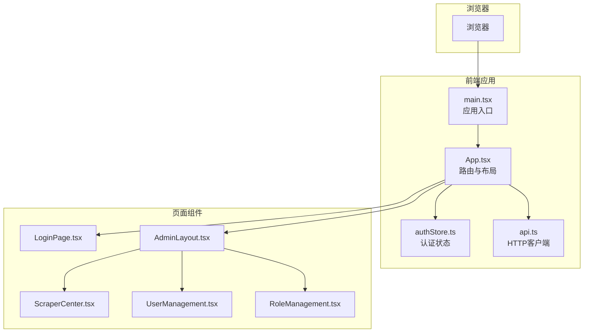
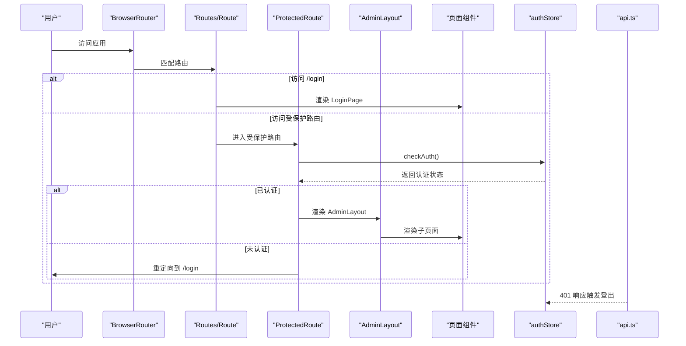
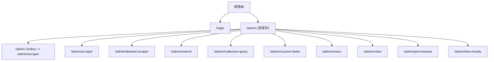
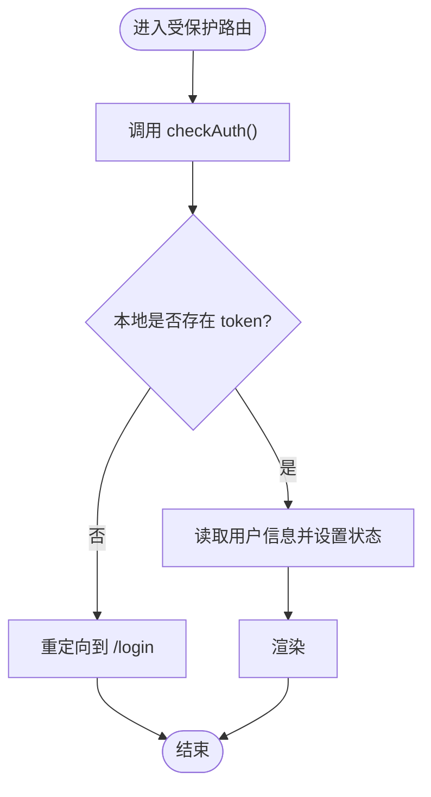
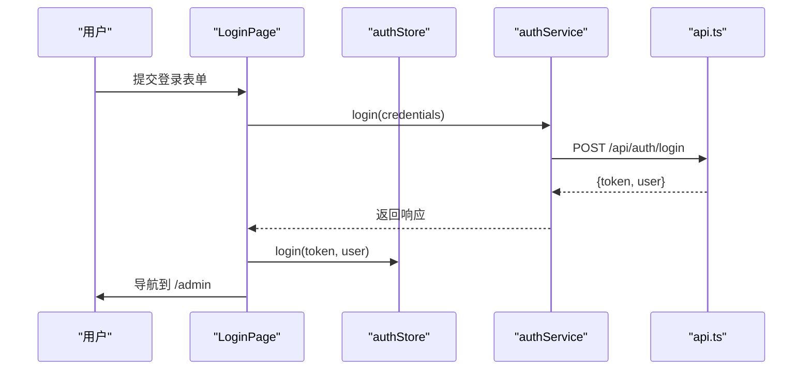
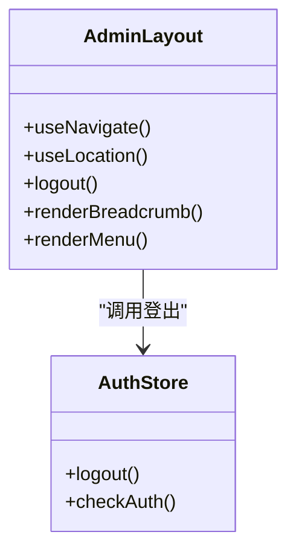
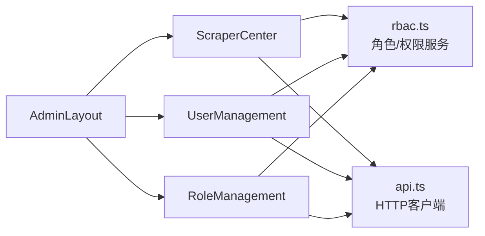
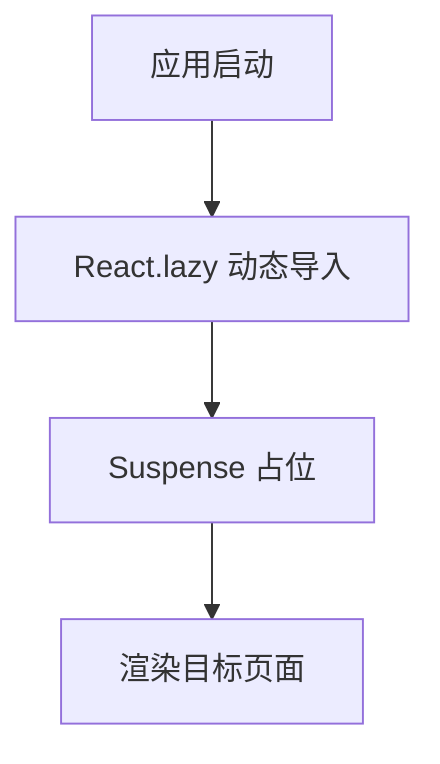
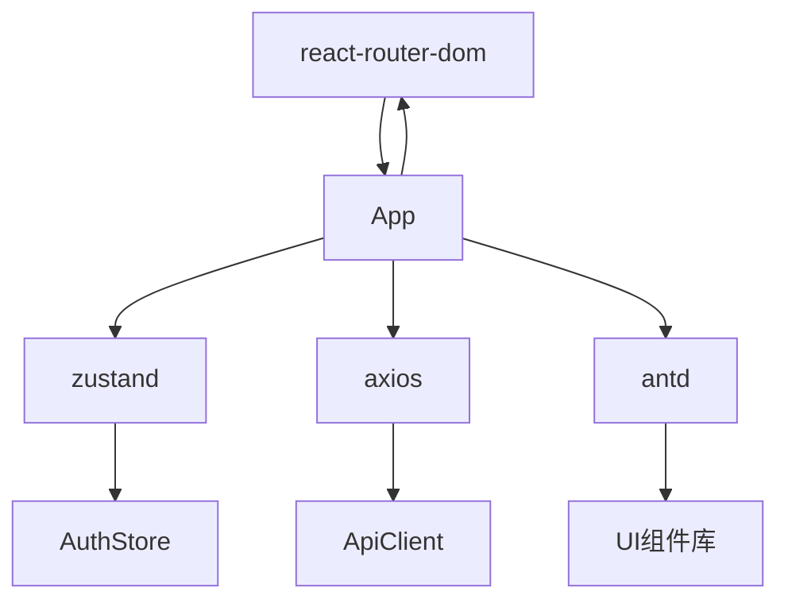

# 路由系统设计

<cite>
**本文档引用的文件**
- [frontend/src/App.tsx](file://frontend/src/App.tsx)
- [frontend/src/main.tsx](file://frontend/src/main.tsx)
- [frontend/vite.config.ts](file://frontend/vite.config.ts)
- [frontend/package.json](file://frontend/package.json)
- [frontend/src/stores/authStore.ts](file://frontend/src/stores/authStore.ts)
- [frontend/src/pages/Admin/AdminLayout.tsx](file://frontend/src/pages/Admin/AdminLayout.tsx)
- [frontend/src/services/auth.ts](file://frontend/src/services/auth.ts)
- [frontend/src/pages/Admin/ScraperCenter.tsx](file://frontend/src/pages/Admin/ScraperCenter.tsx)
- [frontend/src/pages/Admin/UserManagement.tsx](file://frontend/src/pages/Admin/UserManagement.tsx)
- [frontend/src/pages/Admin/RoleManagement.tsx](file://frontend/src/pages/Admin/RoleManagement.tsx)
- [frontend/src/pages/Login/LoginPage.tsx](file://frontend/src/pages/Login/LoginPage.tsx)
- [frontend/src/types/index.ts](file://frontend/src/types/index.ts)
- [frontend/src/services/rbac.ts](file://frontend/src/services/rbac.ts)
- [frontend/src/services/api.ts](file://frontend/src/services/api.ts)
- [frontend/src/stores/index.ts](file://frontend/src/stores/index.ts)
</cite>

## 目录
1. [引言](#引言)
2. [项目结构](#项目结构)
3. [核心组件](#核心组件)
4. [架构总览](#架构总览)
5. [详细组件分析](#详细组件分析)
6. [依赖关系分析](#依赖关系分析)
7. [性能考虑](#性能考虑)
8. [故障排查指南](#故障排查指南)
9. [结论](#结论)

## 引言
本文件面向数据中心项目的前端路由系统，围绕 React Router v6 的配置与使用进行深入技术说明，涵盖：
- 路由层级设计与嵌套路由
- 动态路由与参数处理
- 受保护路由的实现机制（认证检查、权限验证、重定向逻辑）
- 路由懒加载与代码分割
- 路由守卫与导航拦截
- 性能优化与 SEO 友好实践

## 项目结构
前端采用 Vite + React + React Router + Ant Design 技术栈，路由集中在应用入口文件中统一声明，配合 Zustand 状态管理与 Axios 拦截器实现认证与鉴权。

图表来源
- [frontend/src/main.tsx:1-10](file://frontend/src/main.tsx#L1-L10)
- [frontend/src/App.tsx:1-69](file://frontend/src/App.tsx#L1-L69)
- [frontend/src/stores/authStore.ts:1-61](file://frontend/src/stores/authStore.ts#L1-L61)
- [frontend/src/services/api.ts:1-37](file://frontend/src/services/api.ts#L1-L37)

章节来源
- [frontend/src/main.tsx:1-10](file://frontend/src/main.tsx#L1-L10)
- [frontend/src/App.tsx:1-69](file://frontend/src/App.tsx#L1-L69)
- [frontend/vite.config.ts:1-6](file://frontend/vite.config.ts#L1-L6)
- [frontend/package.json:1-29](file://frontend/package.json#L1-L29)

## 核心组件
- 应用入口与路由声明：在应用根组件中配置 BrowserRouter、Routes、Route，并通过 lazy 实现路由级代码分割。
- 受保护路由：通过自定义 ProtectedRoute 组件包裹需要鉴权的路由层级，结合 Zustand 认证状态与本地存储进行认证检查。
- 嵌套路由与布局：AdminLayout 作为受保护路由下的根布局，内部使用 Outlet 渲染子路由内容，并维护面包屑与菜单导航。
- 页面组件：各功能页面按路由层级组织，如刮削中心、用户管理、角色管理等，均在 AdminLayout 下渲染。

章节来源
- [frontend/src/App.tsx:19-31](file://frontend/src/App.tsx#L19-L31)
- [frontend/src/pages/Admin/AdminLayout.tsx:1-203](file://frontend/src/pages/Admin/AdminLayout.tsx#L1-L203)

## 架构总览
下图展示路由系统的关键交互流程：用户访问、认证检查、页面渲染与错误处理。

图表来源
- [frontend/src/App.tsx:19-31](file://frontend/src/App.tsx#L19-L31)
- [frontend/src/stores/authStore.ts:29-46](file://frontend/src/stores/authStore.ts#L29-L46)
- [frontend/src/services/api.ts:23-35](file://frontend/src/services/api.ts#L23-L35)

## 详细组件分析

### 路由层级与嵌套路由
- 根路由：/login 与 /（重定向至 /login）
- 受保护路由：以 /admin 开头的所有子路由均受 ProtectedRoute 保护
- 嵌套路由：AdminLayout 作为 /admin 的布局组件，其内部通过 Outlet 渲染具体页面（如 /admin/scraper、/admin/users 等）

图表来源
- [frontend/src/App.tsx:47-61](file://frontend/src/App.tsx#L47-L61)

章节来源
- [frontend/src/App.tsx:47-61](file://frontend/src/App.tsx#L47-L61)

### 受保护路由实现机制
- 认证检查：ProtectedRoute 在渲染前调用 authStore.checkAuth，读取本地存储中的 token 与用户信息，若存在则标记为已认证；否则触发重定向。
- 重定向逻辑：未认证时使用 Navigate 组件跳转到 /login。
- 初始化检查：应用启动时在 App 中调用 checkAuth，确保页面挂载前完成一次认证状态校验。

图表来源
- [frontend/src/App.tsx:19-31](file://frontend/src/App.tsx#L19-L31)
- [frontend/src/stores/authStore.ts:29-46](file://frontend/src/stores/authStore.ts#L29-L46)

章节来源
- [frontend/src/App.tsx:19-31](file://frontend/src/App.tsx#L19-L31)
- [frontend/src/stores/authStore.ts:15-46](file://frontend/src/stores/authStore.ts#L15-L46)

### 登录流程与认证状态建立
- 登录页：收集用户名与密码，调用 authService.login 获取 token 与用户信息，写入本地存储并更新 authStore。
- 登录成功后：navigate 到 /admin，随后受保护路由生效，AdminLayout 渲染。

图表来源
- [frontend/src/pages/Login/LoginPage.tsx:13-31](file://frontend/src/pages/Login/LoginPage.tsx#L13-L31)
- [frontend/src/services/auth.ts:14-23](file://frontend/src/services/auth.ts#L14-L23)
- [frontend/src/stores/authStore.ts:19-28](file://frontend/src/stores/authStore.ts#L19-L28)

章节来源
- [frontend/src/pages/Login/LoginPage.tsx:1-75](file://frontend/src/pages/Login/LoginPage.tsx#L1-L75)
- [frontend/src/services/auth.ts:1-26](file://frontend/src/services/auth.ts#L1-L26)
- [frontend/src/stores/authStore.ts:15-28](file://frontend/src/stores/authStore.ts#L15-L28)

### 布局与导航（AdminLayout）
- 布局组件：AdminLayout 使用 Ant Design Layout、Menu、Breadcrumb 等组件构建侧边栏与面包屑导航。
- 菜单与路由联动：点击菜单项通过 useNavigate 导航到对应 /admin/* 路由。
- 用户操作：支持退出登录，登出后重定向到 /login。

图表来源
- [frontend/src/pages/Admin/AdminLayout.tsx:9-203](file://frontend/src/pages/Admin/AdminLayout.tsx#L9-L203)
- [frontend/src/stores/authStore.ts:24-28](file://frontend/src/stores/authStore.ts#L24-L28)

章节来源
- [frontend/src/pages/Admin/AdminLayout.tsx:1-203](file://frontend/src/pages/Admin/AdminLayout.tsx#L1-L203)

### 页面组件与数据流
- 刮削中心（ScraperCenter）：负责展示与管理刮削任务，包含分页、搜索、创建、重试、恢复、批量删除等操作。
- 用户管理（UserManagement）：用户增删改查、角色分配与移除。
- 角色管理（RoleManagement）：角色 CRUD、权限分组与分配。

图表来源
- [frontend/src/pages/Admin/ScraperCenter.tsx:1-500](file://frontend/src/pages/Admin/ScraperCenter.tsx#L1-L500)
- [frontend/src/pages/Admin/UserManagement.tsx:1-385](file://frontend/src/pages/Admin/UserManagement.tsx#L1-L385)
- [frontend/src/pages/Admin/RoleManagement.tsx:1-363](file://frontend/src/pages/Admin/RoleManagement.tsx#L1-L363)
- [frontend/src/services/rbac.ts:18-135](file://frontend/src/services/rbac.ts#L18-L135)
- [frontend/src/services/api.ts:1-37](file://frontend/src/services/api.ts#L1-L37)

章节来源
- [frontend/src/pages/Admin/ScraperCenter.tsx:1-500](file://frontend/src/pages/Admin/ScraperCenter.tsx#L1-L500)
- [frontend/src/pages/Admin/UserManagement.tsx:1-385](file://frontend/src/pages/Admin/UserManagement.tsx#L1-L385)
- [frontend/src/pages/Admin/RoleManagement.tsx:1-363](file://frontend/src/pages/Admin/RoleManagement.tsx#L1-L363)
- [frontend/src/services/rbac.ts:1-196](file://frontend/src/services/rbac.ts#L1-L196)
- [frontend/src/services/api.ts:1-37](file://frontend/src/services/api.ts#L1-L37)

### 路由懒加载与代码分割
- 使用 React.lazy 对登录页与管理页面进行懒加载，结合 Suspense 提供加载占位。
- 代码分割策略：按路由拆分包，减少首屏体积，提升加载速度。

图表来源
- [frontend/src/App.tsx:7-17](file://frontend/src/App.tsx#L7-L17)
- [frontend/src/App.tsx:44](file://frontend/src/App.tsx#L44)

章节来源
- [frontend/src/App.tsx:7-17](file://frontend/src/App.tsx#L7-L17)
- [frontend/src/App.tsx:44](file://frontend/src/App.tsx#L44)

### 路由参数处理最佳实践
- URL 参数：当前路由未使用动态段（如 :id），建议在需要时通过 useNavigate/useParams 管理。
- 查询参数：页面组件中通过 axios params 或 URLSearchParams 管理分页与筛选条件。
- 路由状态：可通过 useLocation/state 传递轻量状态，避免全局状态污染。

章节来源
- [frontend/src/pages/Admin/UserManagement.tsx:35-52](file://frontend/src/pages/Admin/UserManagement.tsx#L35-L52)
- [frontend/src/pages/Admin/RoleManagement.tsx:18-31](file://frontend/src/pages/Admin/RoleManagement.tsx#L18-L31)

### 路由守卫与导航拦截
- 自定义守卫：ProtectedRoute 作为“路由守卫”，在进入受保护路由前执行认证检查。
- 导航拦截：Axios 响应拦截器在 401 时自动登出并跳转登录页，保证 API 层面的安全性。
- 数据预加载：页面组件在 mount 后拉取所需数据，结合分页与搜索参数实现高效加载。

章节来源
- [frontend/src/App.tsx:19-31](file://frontend/src/App.tsx#L19-L31)
- [frontend/src/services/api.ts:23-35](file://frontend/src/services/api.ts#L23-L35)
- [frontend/src/pages/Admin/ScraperCenter.tsx:89-99](file://frontend/src/pages/Admin/ScraperCenter.tsx#L89-L99)

## 依赖关系分析
- React Router：提供路由声明、嵌套路由与导航能力。
- Zustand：集中管理认证状态（token、user、isAuthenticated）。
- Axios：封装 HTTP 客户端，统一请求/响应拦截器。
- Ant Design：提供 UI 组件与主题配置。

图表来源
- [frontend/package.json:12-20](file://frontend/package.json#L12-L20)
- [frontend/src/App.tsx:1-69](file://frontend/src/App.tsx#L1-L69)
- [frontend/src/stores/authStore.ts:1-61](file://frontend/src/stores/authStore.ts#L1-L61)
- [frontend/src/services/api.ts:1-37](file://frontend/src/services/api.ts#L1-L37)

章节来源
- [frontend/package.json:12-20](file://frontend/package.json#L12-L20)
- [frontend/src/App.tsx:1-69](file://frontend/src/App.tsx#L1-L69)

## 性能考虑
- 代码分割：按路由拆分包，降低首屏 JS 体积。
- 懒加载：仅在访问时加载页面组件，缩短白屏时间。
- Suspense 占位：提供加载反馈，改善用户体验。
- 请求缓存：可在页面组件中引入缓存策略（如基于查询参数的缓存键）。
- 防抖搜索：对高频搜索输入增加防抖，减少请求次数。
- 分页与虚拟滚动：大数据表格建议使用虚拟滚动与服务端分页。

## 故障排查指南
- 登录失败：检查登录页表单校验与 authService.login 返回值，确认后端接口与网络连通性。
- 401 未授权：查看 Axios 响应拦截器是否正确触发登出与跳转。
- 页面空白：确认 Suspense 占位是否正确渲染，以及 lazy 导入路径是否正确。
- 路由不生效：检查 Routes/Route 嵌套层级与 ProtectedRoute 包裹范围。

章节来源
- [frontend/src/pages/Login/LoginPage.tsx:13-31](file://frontend/src/pages/Login/LoginPage.tsx#L13-L31)
- [frontend/src/services/api.ts:23-35](file://frontend/src/services/api.ts#L23-L35)
- [frontend/src/App.tsx:44](file://frontend/src/App.tsx#L44)

## 结论
该路由系统以 React Router v6 为核心，结合 Zustand 与 Axios 拦截器实现了清晰的路由层级、可靠的受保护路由与良好的用户体验。通过懒加载与代码分割进一步优化了性能。后续可在以下方面持续改进：
- 引入动态路由参数与查询参数规范化处理
- 增强权限守卫与细粒度权限控制
- 优化路由预加载策略与缓存机制
- 提升 SEO 友好性（如页面标题、meta 标签注入）