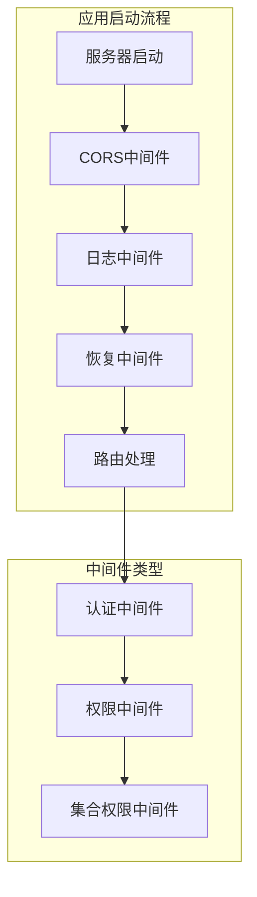
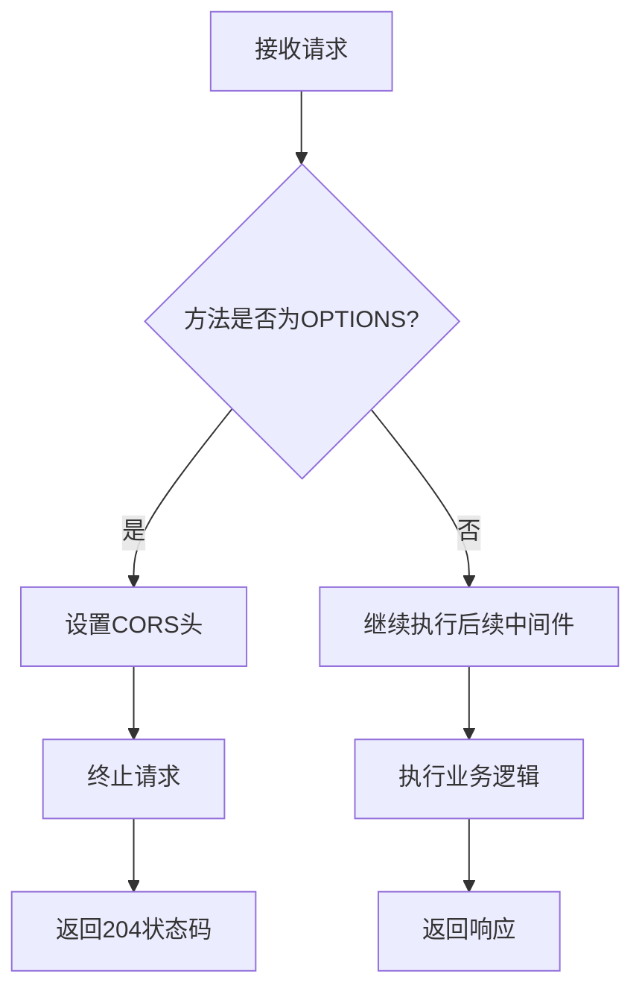
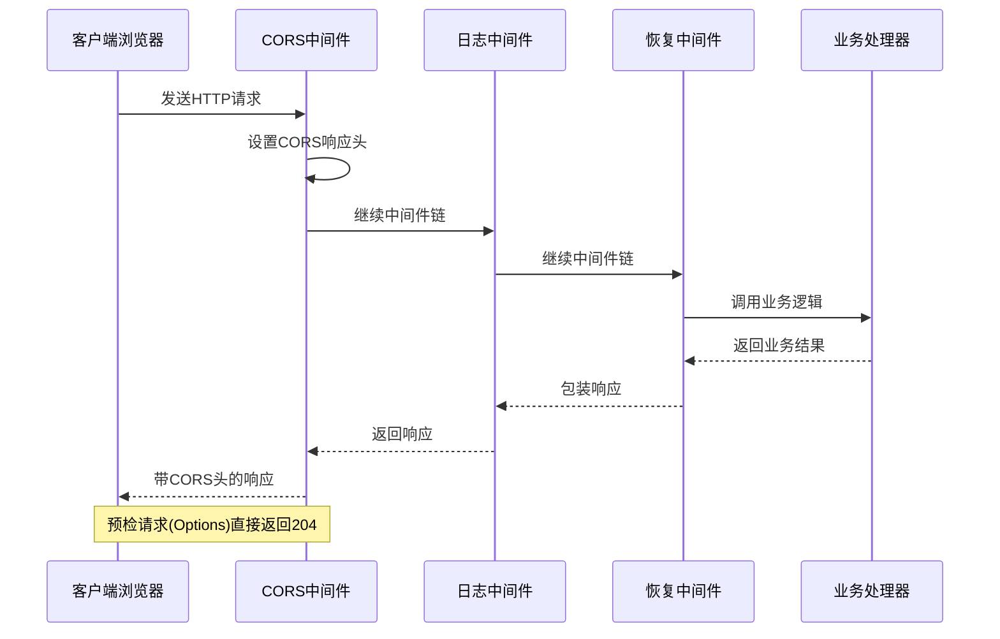
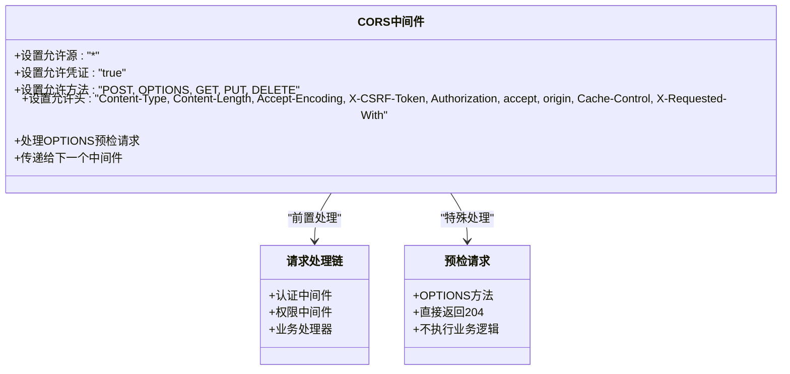
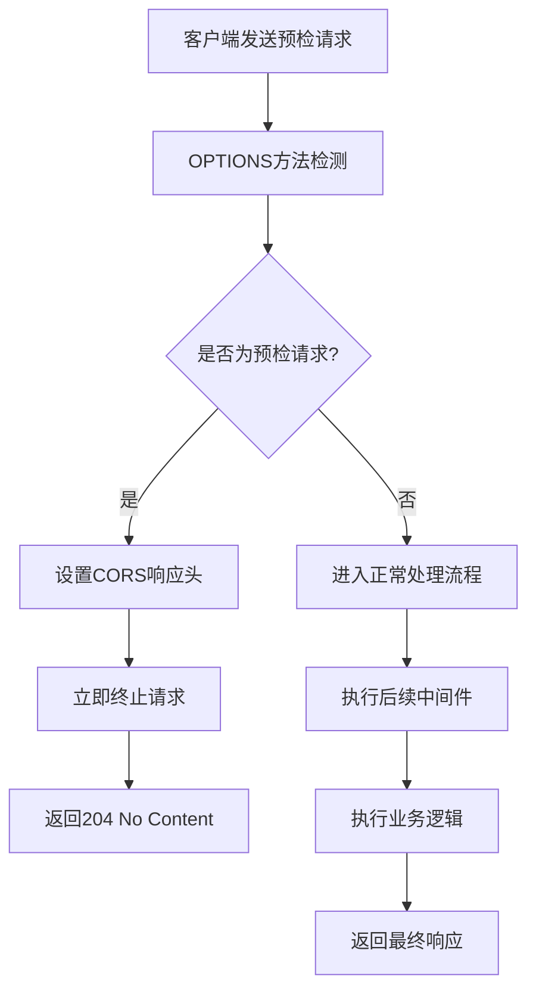
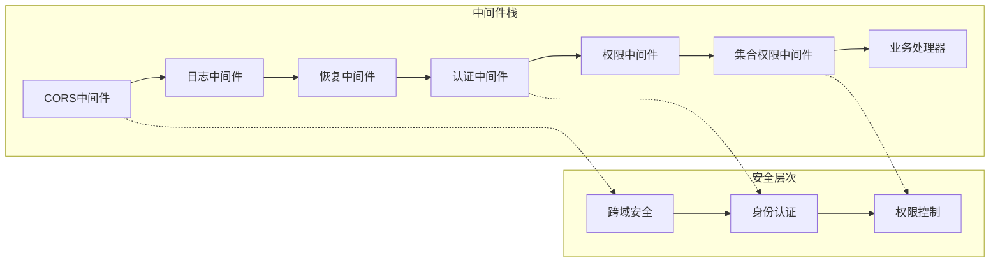
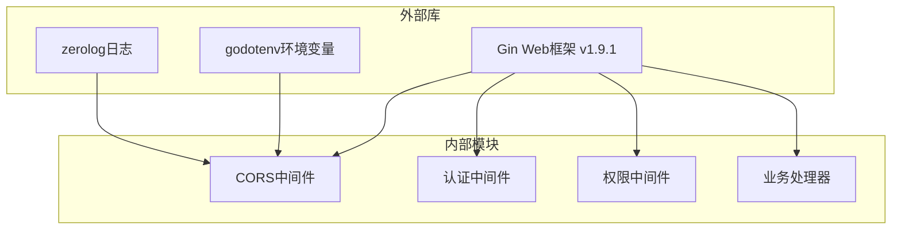
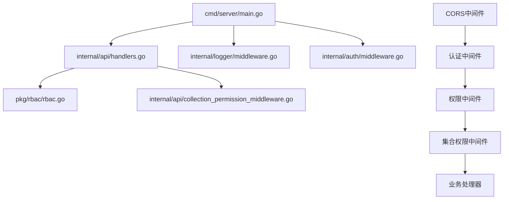
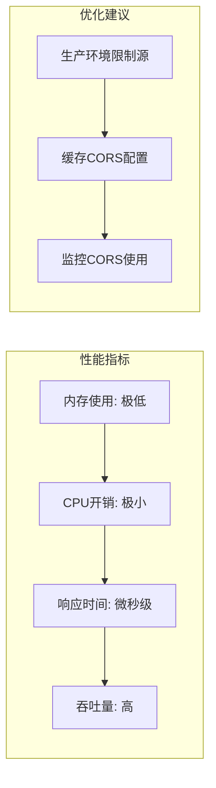
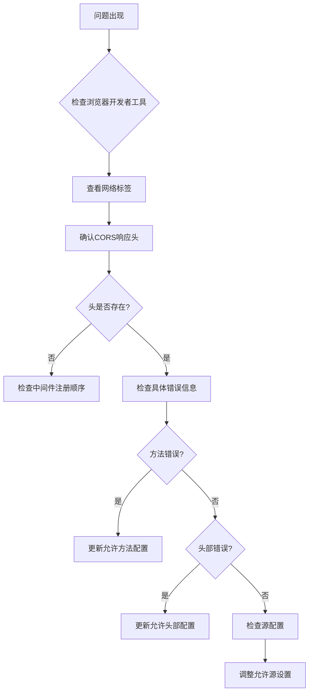

# CORS跨域中间件

<cite>
**本文档引用的文件**
- [main.go](file://cmd/server/main.go)
- [handlers.go](file://internal/api/handlers.go)
- [collection_permission_middleware.go](file://internal/api/collection_permission_middleware.go)
- [middleware.go](file://internal/auth/middleware.go)
- [middleware.go](file://internal/logger/middleware.go)
- [rbac.go](file://pkg/rbac/rbac.go)
- [config.yaml](file://configs/config.yaml)
- [go.mod](file://go.mod)
</cite>

## 目录
1. [简介](#简介)
2. [项目结构](#项目结构)
3. [核心组件](#核心组件)
4. [架构概览](#架构概览)
5. [详细组件分析](#详细组件分析)
6. [依赖关系分析](#依赖关系分析)
7. [性能考虑](#性能考虑)
8. [故障排除指南](#故障排除指南)
9. [结论](#结论)

## 简介

CORS（跨域资源共享）是浏览器安全策略的重要组成部分，用于控制不同源之间的资源访问。本项目中的CORS跨域中间件采用全局配置方式，通过设置HTTP响应头来实现跨域资源共享。

该中间件位于服务器入口点，作为第一个中间件执行，确保所有请求都经过CORS处理。它支持多种HTTP方法和标准请求头，并对预检请求（OPTIONS）进行特殊处理。

## 项目结构

该项目采用分层架构设计，CORS中间件作为应用启动时的第一个中间件，位于中间件栈的最前端：



**图表来源**
- [main.go:97-118](file://cmd/server/main.go#L97-L118)
- [handlers.go:45-181](file://internal/api/handlers.go#L45-L181)

**章节来源**
- [main.go:97-118](file://cmd/server/main.go#L97-L118)
- [handlers.go:45-181](file://internal/api/handlers.go#L45-L181)

## 核心组件

### CORS中间件实现

CORS中间件通过设置以下关键响应头来实现跨域支持：

| 响应头 | 值 | 用途 |
|--------|-----|------|
| Access-Control-Allow-Origin | * | 允许所有域名访问 |
| Access-Control-Allow-Credentials | true | 允许发送Cookie凭证 |
| Access-Control-Allow-Headers | 多种标准头部 | 允许的请求头列表 |
| Access-Control-Allow-Methods | POST, OPTIONS, GET, PUT, DELETE | 允许的HTTP方法 |

### 预检请求处理

中间件对OPTIONS方法进行特殊处理，直接返回204状态码，避免不必要的数据库查询：



**图表来源**
- [main.go:107-112](file://cmd/server/main.go#L107-L112)

**章节来源**
- [main.go:100-113](file://cmd/server/main.go#L100-L113)

## 架构概览

CORS中间件在整个请求处理链路中的位置决定了其重要性：



**图表来源**
- [main.go:99-118](file://cmd/server/main.go#L99-L118)
- [handlers.go:45-181](file://internal/api/handlers.go#L45-L181)

## 详细组件分析

### CORS中间件类图



**图表来源**
- [main.go:100-113](file://cmd/server/main.go#L100-L113)

### CORS配置选项详解

#### 允许的源（Origin）
- 当前配置为通配符"*"，表示允许来自任何域名的请求
- 在生产环境中建议指定具体的可信域名

#### 允许的方法（Methods）
支持的HTTP方法包括：POST、OPTIONS、GET、PUT、DELETE

#### 允许的头部（Headers）
包含以下标准头部：
- Content-Type：用于JSON请求体
- Content-Length：内容长度
- Accept-Encoding：内容编码
- X-CSRF-Token：CSRF保护
- Authorization：认证令牌
- Accept、Origin：标准HTTP头部
- Cache-Control、X-Requested-With：缓存和请求标识

#### 凭证设置（Credentials）
设置为true，允许携带Cookie和HTTP认证信息

**章节来源**
- [main.go:100-113](file://cmd/server/main.go#L100-L113)

### 预检请求处理流程



**图表来源**
- [main.go:107-112](file://cmd/server/main.go#L107-L112)

**章节来源**
- [main.go:107-112](file://cmd/server/main.go#L107-L112)

### 与其他中间件的协作

CORS中间件与认证、权限等中间件协同工作：



**图表来源**
- [main.go:115-116](file://cmd/server/main.go#L115-L116)
- [handlers.go:260-293](file://internal/api/handlers.go#L260-L293)

**章节来源**
- [main.go:115-116](file://cmd/server/main.go#L115-L116)
- [handlers.go:260-293](file://internal/api/handlers.go#L260-L293)

## 依赖关系分析

### 外部依赖

项目使用Gin框架作为Web服务器，CORS中间件直接依赖于Gin的Context对象：



**图表来源**
- [go.mod:5-14](file://go.mod#L5-L14)

### 内部依赖关系



**图表来源**
- [main.go:13-18](file://cmd/server/main.go#L13-L18)
- [handlers.go:3-21](file://internal/api/handlers.go#L3-L21)

**章节来源**
- [go.mod:5-14](file://go.mod#L5-L14)
- [main.go:13-18](file://cmd/server/main.go#L13-L18)

## 性能考虑

### 中间件执行效率

CORS中间件具有以下性能特点：
- **无状态处理**：不维护会话状态，内存占用极低
- **快速路径**：预检请求直接返回，避免数据库查询
- **最小化计算**：仅设置固定响应头，CPU开销很小

### 内存和CPU使用



### 生产环境优化

1. **限制允许源**：将通配符替换为具体域名
2. **精简允许方法**：仅暴露必要的HTTP方法
3. **优化允许头**：移除不需要的请求头
4. **启用缓存**：利用浏览器CORS缓存机制

## 故障排除指南

### 常见CORS错误及解决方案

#### 预检请求失败
**症状**：浏览器显示CORS预检失败，状态码200但CORS头缺失
**原因**：CORS中间件未正确设置响应头
**解决**：检查中间件是否在路由注册前添加

#### 凭证相关错误
**症状**：登录成功但后续请求被阻止
**原因**：客户端未正确发送Cookie或CORS凭证设置问题
**解决**：确认客户端设置withCredentials为true

#### 方法不被允许
**症状**：特定HTTP方法被拒绝
**原因**：CORS允许方法配置不完整
**解决**：在CORS中间件中添加相应方法

### 调试步骤



### 开发环境配置

在开发环境中，建议使用更宽松的CORS配置：

```yaml
# 开发环境配置示例
cors:
  allowed_origins: ["http://localhost:3000", "http://localhost:5173"]
  allowed_methods: ["GET", "POST", "PUT", "DELETE", "OPTIONS"]
  allowed_headers: ["Content-Type", "Authorization", "X-Requested-With"]
  allow_credentials: true
```

**章节来源**
- [main.go:100-113](file://cmd/server/main.go#L100-L113)

## 结论

本项目的CORS跨域中间件实现了基础的跨域资源共享功能，通过简单的响应头设置即可满足大多数应用场景的需求。中间件采用全局配置方式，在服务器启动时自动生效，确保所有请求都得到正确的CORS处理。

### 主要优势
- **简单易用**：配置简单，部署方便
- **性能优异**：无状态处理，开销极小
- **兼容性强**：支持标准CORS规范的所有特性

### 改进建议
1. **生产环境安全**：限制允许源为具体域名
2. **动态配置**：根据环境动态调整CORS设置
3. **监控告警**：添加CORS相关的监控和告警机制
4. **文档完善**：为CORS配置提供更详细的文档说明

该CORS中间件为整个系统的跨域访问提供了坚实的基础，配合认证、权限等中间件，构建了完整的安全防护体系。