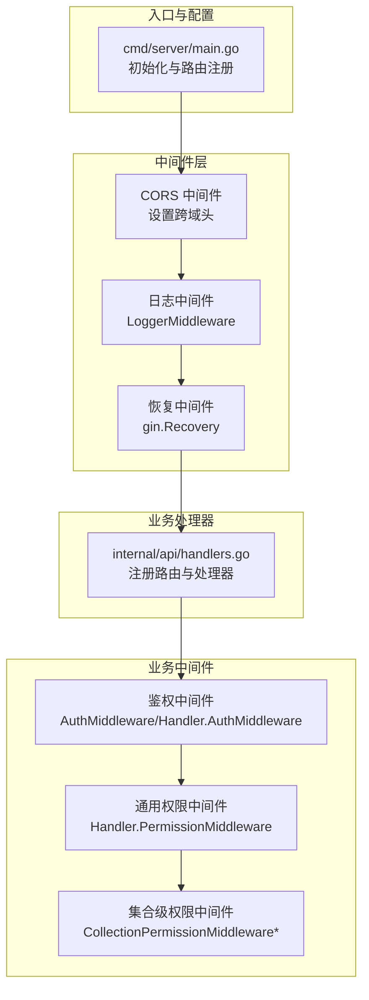
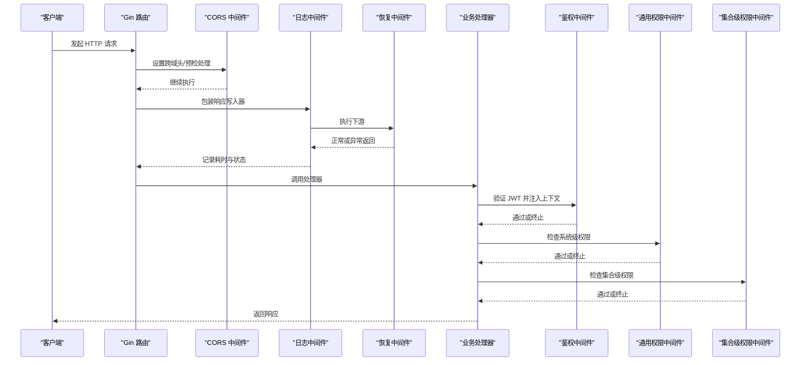
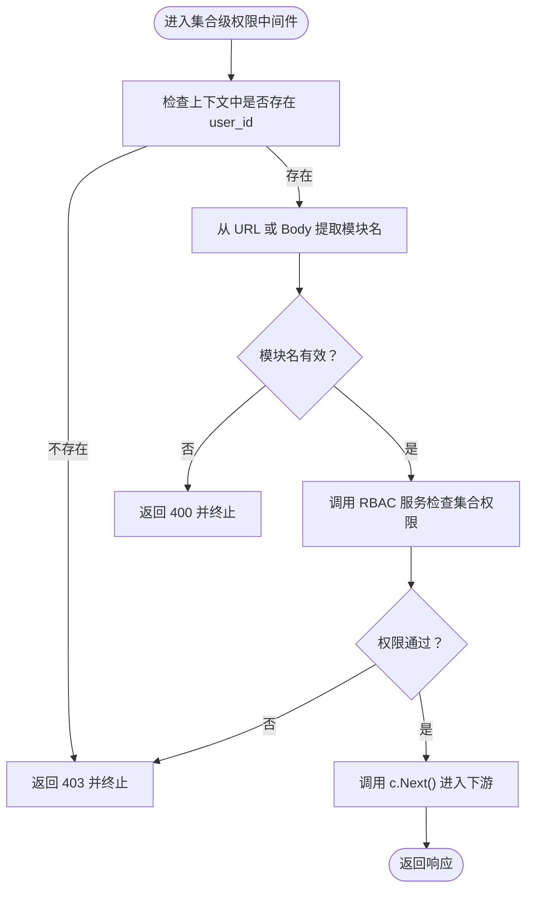
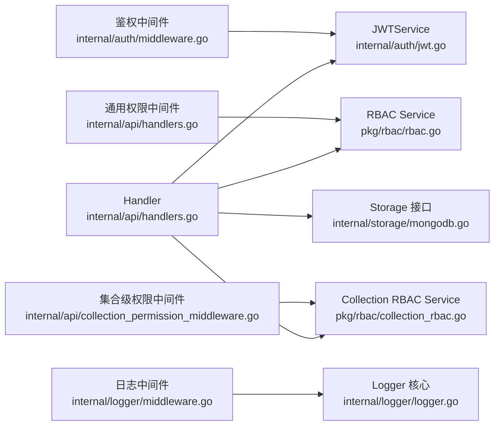

# 中间件执行链

<cite>
**本文引用的文件**
- [cmd/server/main.go](file://cmd/server/main.go)
- [internal/api/handlers.go](file://internal/api/handlers.go)
- [internal/auth/middleware.go](file://internal/auth/middleware.go)
- [internal/auth/jwt.go](file://internal/auth/jwt.go)
- [internal/logger/middleware.go](file://internal/logger/middleware.go)
- [internal/logger/logger.go](file://internal/logger/logger.go)
- [internal/api/collection_permission_middleware.go](file://internal/api/collection_permission_middleware.go)
- [pkg/rbac/rbac.go](file://pkg/rbac/rbac.go)
- [pkg/rbac/collection_rbac.go](file://pkg/rbac/collection_rbac.go)
- [internal/storage/mongodb.go](file://internal/storage/mongodb.go)
</cite>

## 目录
1. [简介](#简介)
2. [项目结构](#项目结构)
3. [核心组件](#核心组件)
4. [架构总览](#架构总览)
5. [详细组件分析](#详细组件分析)
6. [依赖分析](#依赖分析)
7. [性能考虑](#性能考虑)
8. [故障排查指南](#故障排查指南)
9. [结论](#结论)
10. [附录](#附录)

## 简介
本文件面向中间件执行链的架构与实现，重点阐述以下内容：
- 中间件的执行顺序与调用机制
- Next() 函数的工作原理与上下文传递
- 错误传播与异常处理策略
- 如何向执行链添加新的中间件及中间件间的依赖关系
- 性能优化与调试技巧

## 项目结构
该系统基于 Gin 框架构建，采用“全局中间件 + 路由组中间件”的组合方式组织中间件链。入口程序负责初始化日志、数据库、RBAC 服务，并注册路由；路由层通过 Handler 注册各业务模块的中间件与处理器。

图表来源
- [cmd/server/main.go:100-118](file://cmd/server/main.go#L100-L118)
- [internal/api/handlers.go:45-181](file://internal/api/handlers.go#L45-L181)

章节来源
- [cmd/server/main.go:24-120](file://cmd/server/main.go#L24-L120)
- [internal/api/handlers.go:45-181](file://internal/api/handlers.go#L45-L181)

## 核心组件
- 全局中间件
  - CORS：统一设置跨域头，OPTIONS 预检直接返回状态码
  - 日志：记录请求耗时、状态码、客户端 IP、UA、响应体等
  - 恢复：兜底捕获 panic，避免服务崩溃
- 业务中间件
  - 鉴权：解析 Authorization 头，校验 JWT，注入用户上下文
  - 通用权限：基于 RBAC 的系统级权限检查
  - 集合级权限：基于模块的集合级权限检查，支持从 URL 或 Body 提取模块名
- 服务与存储
  - JWT 服务：签发、验证、刷新 Token
  - RBAC 服务：系统级权限与集合级权限检查
  - MongoDB 存储：提供用户、角色、权限、集合等数据访问接口

章节来源
- [internal/logger/middleware.go:25-68](file://internal/logger/middleware.go#L25-L68)
- [internal/auth/middleware.go:11-48](file://internal/auth/middleware.go#L11-L48)
- [internal/api/handlers.go:260-314](file://internal/api/handlers.go#L260-L314)
- [internal/api/collection_permission_middleware.go:16-136](file://internal/api/collection_permission_middleware.go#L16-L136)
- [internal/auth/jwt.go:21-83](file://internal/auth/jwt.go#L21-L83)
- [pkg/rbac/rbac.go:55-99](file://pkg/rbac/rbac.go#L55-L99)
- [pkg/rbac/collection_rbac.go:27-90](file://pkg/rbac/collection_rbac.go#L27-L90)
- [internal/storage/mongodb.go:14-90](file://internal/storage/mongodb.go#L14-L90)

## 架构总览
下图展示了请求在中间件链中的流转路径与关键节点：

图表来源
- [cmd/server/main.go:100-118](file://cmd/server/main.go#L100-L118)
- [internal/logger/middleware.go:25-68](file://internal/logger/middleware.go#L25-L68)
- [internal/auth/middleware.go:11-48](file://internal/auth/middleware.go#L11-L48)
- [internal/api/handlers.go:260-314](file://internal/api/handlers.go#L260-L314)
- [internal/api/collection_permission_middleware.go:16-136](file://internal/api/collection_permission_middleware.go#L16-L136)

## 详细组件分析

### 中间件执行顺序与调用机制
- 全局中间件顺序
  - CORS → 日志中间件 → 恢复中间件 → 路由处理器
- 路由组中间件顺序
  - 鉴权中间件 → 通用权限中间件 → 集合级权限中间件 → 具体处理器
- Next() 的工作原理
  - 每个中间件在执行自身逻辑后调用 Next()，将控制权交给下一个中间件
  - 当某个中间件调用 Abort() 时，后续中间件不再执行，直接回溯到上游中间件
  - 上游中间件在 Next() 返回后继续执行收尾逻辑（例如日志中间件在 Next() 后计算耗时与状态）

章节来源
- [cmd/server/main.go:100-118](file://cmd/server/main.go#L100-L118)
- [internal/logger/middleware.go:25-68](file://internal/logger/middleware.go#L25-L68)
- [internal/auth/middleware.go:11-48](file://internal/auth/middleware.go#L11-L48)
- [internal/api/handlers.go:260-314](file://internal/api/handlers.go#L260-L314)
- [internal/api/collection_permission_middleware.go:16-136](file://internal/api/collection_permission_middleware.go#L16-L136)

### 上下文传递与数据注入
- 鉴权中间件将用户标识、角色、权限注入到 gin 上下文中，供后续中间件与处理器使用
- 日志中间件从上下文中读取用户标识，若不存在则标记为匿名
- 集合级权限中间件从上下文中读取用户标识，并从 URL 或 Body 提取模块名进行权限校验

章节来源
- [internal/auth/middleware.go:41-46](file://internal/auth/middleware.go#L41-L46)
- [internal/logger/middleware.go:39-42](file://internal/logger/middleware.go#L39-L42)
- [internal/api/collection_permission_middleware.go:18-31](file://internal/api/collection_permission_middleware.go#L18-L31)
- [internal/api/collection_permission_middleware.go:55-77](file://internal/api/collection_permission_middleware.go#L55-L77)

### 错误传播与异常处理
- 中断传播
  - 任一中间件在失败时调用 Abort() 并返回错误响应，后续中间件不再执行
- 异常兜底
  - 恢复中间件捕获 panic，防止服务崩溃
- 日志记录
  - 日志中间件根据状态码分类记录日志级别，便于问题定位
- 服务级错误
  - RBAC 与集合级权限检查返回错误时，中间件终止并返回 403/400 等状态码

章节来源
- [internal/logger/middleware.go:59-66](file://internal/logger/middleware.go#L59-L66)
- [internal/logger/middleware.go:34](file://internal/logger/middleware.go#L34)
- [internal/api/collection_permission_middleware.go:20-44](file://internal/api/collection_permission_middleware.go#L20-L44)
- [internal/api/handlers.go:296-313](file://internal/api/handlers.go#L296-L313)

### 添加新中间件到执行链
- 全局中间件
  - 在入口程序中通过 router.Use(...) 添加，影响所有路由
  - 注意顺序：越靠前的中间件越先执行，越晚结束
- 路由组中间件
  - 在 Handler.RegisterRoutes 中通过 Group.Use(...) 添加，仅影响该组路由
  - 可叠加多层中间件，形成“链式”执行
- 新中间件开发要点
  - 实现 gin.HandlerFunc，遵循“前置处理 → c.Next() → 后置处理”的模式
  - 在前置阶段读取上下文、解析请求；在后置阶段写入响应、记录日志
  - 失败时调用 Abort() 并返回合适的状态码

章节来源
- [cmd/server/main.go:100-118](file://cmd/server/main.go#L100-L118)
- [internal/api/handlers.go:49-181](file://internal/api/handlers.go#L49-L181)

### 中间件之间的依赖关系
- 顺序依赖
  - 鉴权必须在通用权限之前，因为通用权限依赖用户上下文
  - 通用权限必须在集合级权限之前，因为集合级权限依赖系统权限结果
- 数据依赖
  - 集合级权限中间件依赖鉴权中间件注入的用户标识
  - 集合级权限中间件依赖 RBAC 服务与集合级存储
- 路由依赖
  - 不同模块的处理器可能需要不同的集合级权限中间件变体（URL/Body 模块提取）

章节来源
- [internal/api/handlers.go:49-181](file://internal/api/handlers.go#L49-L181)
- [internal/api/collection_permission_middleware.go:16-136](file://internal/api/collection_permission_middleware.go#L16-L136)
- [pkg/rbac/rbac.go:55-99](file://pkg/rbac/rbac.go#L55-L99)
- [pkg/rbac/collection_rbac.go:27-90](file://pkg/rbac/collection_rbac.go#L27-L90)

### 关键流程图：集合级权限中间件

图表来源
- [internal/api/collection_permission_middleware.go:16-136](file://internal/api/collection_permission_middleware.go#L16-L136)

## 依赖分析
- 组件耦合
  - Handler 依赖 JWT 服务、RBAC 服务、集合 RBAC 服务与存储接口
  - 中间件依赖 Handler 注入的服务，形成“处理器驱动中间件”的结构
- 外部依赖
  - Gin：中间件框架与上下文
  - MongoDB：持久化存储接口
  - JWT：令牌签发与验证
- 循环依赖
  - 未发现循环依赖，中间件与处理器通过接口解耦

图表来源
- [internal/api/handlers.go:23-43](file://internal/api/handlers.go#L23-L43)
- [internal/auth/jwt.go:21-83](file://internal/auth/jwt.go#L21-L83)
- [pkg/rbac/rbac.go:55-99](file://pkg/rbac/rbac.go#L55-L99)
- [pkg/rbac/collection_rbac.go:27-90](file://pkg/rbac/collection_rbac.go#L27-L90)
- [internal/logger/middleware.go:25-68](file://internal/logger/middleware.go#L25-L68)
- [internal/logger/logger.go:11-56](file://internal/logger/logger.go#L11-L56)

章节来源
- [internal/api/handlers.go:23-43](file://internal/api/handlers.go#L23-L43)
- [internal/auth/jwt.go:21-83](file://internal/auth/jwt.go#L21-L83)
- [pkg/rbac/rbac.go:55-99](file://pkg/rbac/rbac.go#L55-L99)
- [pkg/rbac/collection_rbac.go:27-90](file://pkg/rbac/collection_rbac.go#L27-L90)
- [internal/logger/middleware.go:25-68](file://internal/logger/middleware.go#L25-L68)
- [internal/logger/logger.go:11-56](file://internal/logger/logger.go#L11-L56)

## 性能考虑
- 响应体捕获
  - 日志中间件通过包装 ResponseWriter 捕获响应体，可能带来额外内存占用；建议在高并发场景下谨慎开启或限制响应体大小
- 权限检查
  - 通用权限与集合级权限均涉及数据库查询；建议：
    - 缓存用户权限结果（短期）
    - 合理设计索引，避免慢查询
    - 对热点接口进行限流
- 中间件顺序
  - 将快速失败的中间件置于前部（如 CORS、鉴权），尽早短路
- 日志级别
  - 生产环境建议使用 info/warn 级别，避免过多 debug 日志带来的 I/O 开销

[本节为通用性能建议，不直接分析具体文件]

## 故障排查指南
- 常见问题定位
  - 401 未授权：检查 Authorization 头格式与 JWT 是否有效
  - 403 权限不足：检查用户角色与权限、集合级权限模块名
  - 400 参数错误：检查请求体解析与模块名提取
- 日志辅助
  - 使用日志中间件输出请求方法、路径、状态码、耗时、客户端 IP、UA、响应体
  - 结合 Logger 核心的级别控制，快速定位异常
- 中断点设置
  - 在中间件的前置与后置阶段分别设置断点，观察上下文变化与执行耗时
- 数据一致性
  - 若权限检查结果与预期不符，检查 RBAC 与集合级权限存储的数据是否一致

章节来源
- [internal/logger/middleware.go:25-68](file://internal/logger/middleware.go#L25-L68)
- [internal/logger/logger.go:11-56](file://internal/logger/logger.go#L11-L56)
- [internal/api/collection_permission_middleware.go:16-136](file://internal/api/collection_permission_middleware.go#L16-L136)
- [internal/api/handlers.go:296-313](file://internal/api/handlers.go#L296-L313)

## 结论
本系统的中间件执行链通过明确的顺序与职责划分，实现了鉴权、权限与日志的完整闭环。通过 Next()/Abort() 的协作与上下文传递，中间件能够高效地完成前置校验与后置收尾。建议在新增中间件时遵循现有模式，优先保证快速失败与可调试性，并结合缓存与索引优化权限检查性能。

[本节为总结性内容，不直接分析具体文件]

## 附录
- 关键接口与类型
  - gin.HandlerFunc：中间件函数签名
  - gin.Context：上下文与请求/响应对象
  - Storage 接口：统一的数据访问抽象
- 最佳实践
  - 中间件应尽量无副作用，避免在中间件中做重 IO
  - 对外暴露的中间件应保持幂等与可测试性
  - 对复杂中间件进行单元测试与集成测试

[本节为概念性内容，不直接分析具体文件]