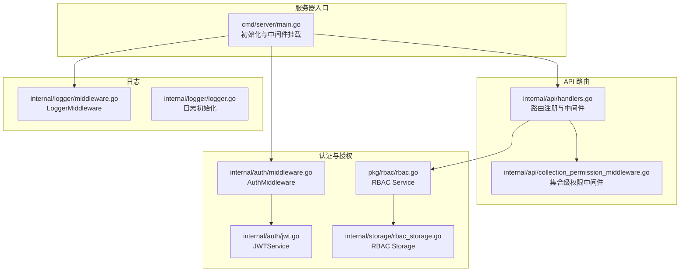
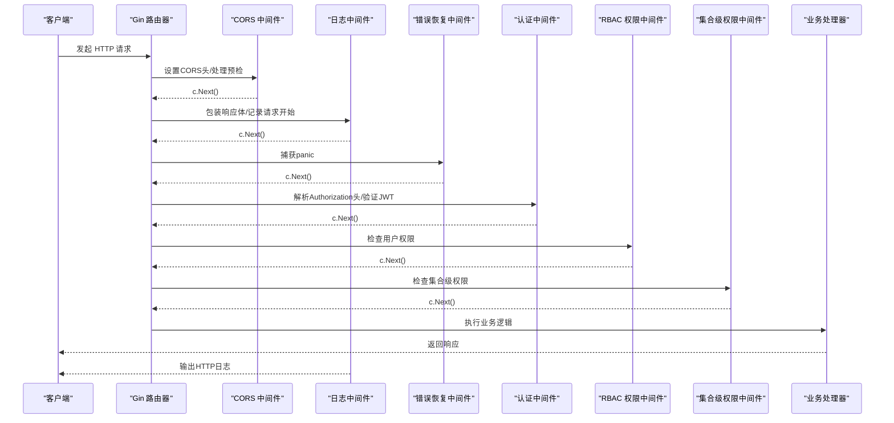
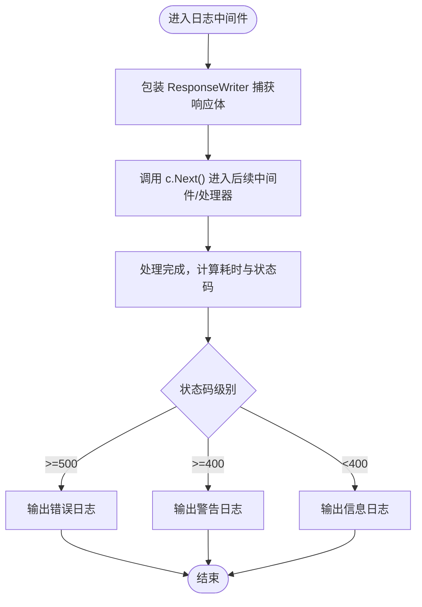
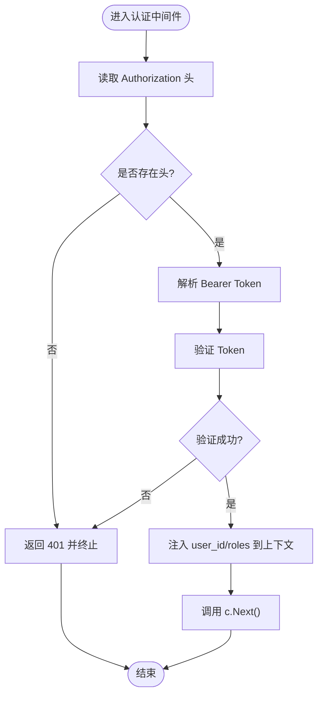
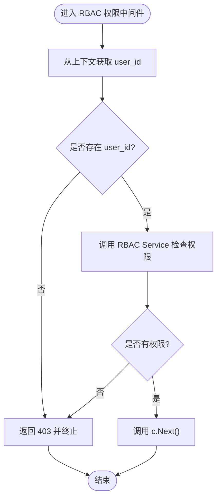
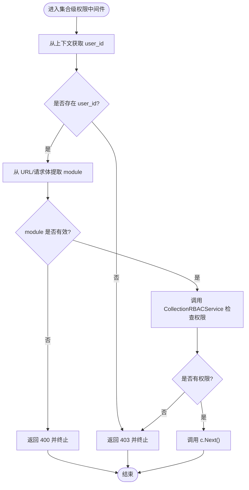
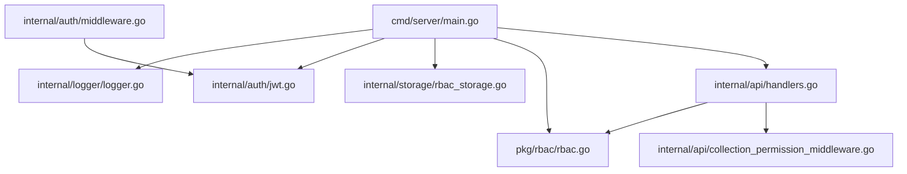

# 中间件系统

<cite>
**本文档引用的文件**
- [cmd/server/main.go](file://cmd/server/main.go)
- [internal/logger/middleware.go](file://internal/logger/middleware.go)
- [internal/logger/logger.go](file://internal/logger/logger.go)
- [internal/auth/middleware.go](file://internal/auth/middleware.go)
- [internal/auth/jwt.go](file://internal/auth/jwt.go)
- [internal/api/handlers.go](file://internal/api/handlers.go)
- [internal/api/collection_permission_middleware.go](file://internal/api/collection_permission_middleware.go)
- [internal/storage/rbac_storage.go](file://internal/storage/rbac_storage.go)
- [pkg/rbac/rbac.go](file://pkg/rbac/rbac.go)
- [configs/config.yaml](file://configs/config.yaml)
</cite>

## 目录
1. [简介](#简介)
2. [项目结构](#项目结构)
3. [核心组件](#核心组件)
4. [架构总览](#架构总览)
5. [详细组件分析](#详细组件分析)
6. [依赖关系分析](#依赖关系分析)
7. [性能考虑](#性能考虑)
8. [故障排查指南](#故障排查指南)
9. [结论](#结论)
10. [附录](#附录)

## 简介
本文件面向数据中心项目的中间件系统，系统基于 Gin 框架构建，采用“中间件链”模式组织请求处理流程。中间件负责跨领域横切关注点，包括：
- CORS 处理
- 日志记录（含响应体捕获）
- 错误恢复（内置 Recovery）
- 认证验证（JWT）
- 基于 RBAC 的权限控制
- 基于集合级别的细粒度权限控制

本文档将详细说明中间件的执行顺序、职责分工、请求/响应拦截点、自定义扩展方法，并提供流程图、配置示例与性能优化建议。

## 项目结构
中间件系统主要分布在以下模块：
- 服务器入口：初始化日志、数据库、JWT、RBAC、刮削系统，创建 Gin 路由器并挂载中间件
- 认证与授权：JWT 服务、认证中间件、通用 RBAC 权限中间件、集合级权限中间件
- 日志：HTTP 请求日志中间件与应用日志初始化
- API 路由：按组注册路由，按需挂载权限中间件

图表来源
- [cmd/server/main.go:97-118](file://cmd/server/main.go#L97-L118)
- [internal/logger/middleware.go:25-68](file://internal/logger/middleware.go#L25-L68)
- [internal/auth/middleware.go:11-49](file://internal/auth/middleware.go#L11-L49)
- [internal/auth/jwt.go:20-83](file://internal/auth/jwt.go#L20-L83)
- [internal/api/handlers.go:45-181](file://internal/api/handlers.go#L45-L181)
- [internal/api/collection_permission_middleware.go:16-137](file://internal/api/collection_permission_middleware.go#L16-L137)
- [internal/storage/rbac_storage.go:16-79](file://internal/storage/rbac_storage.go#L16-L79)
- [pkg/rbac/rbac.go:55-99](file://pkg/rbac/rbac.go#L55-L99)

章节来源
- [cmd/server/main.go:97-118](file://cmd/server/main.go#L97-L118)
- [internal/api/handlers.go:45-181](file://internal/api/handlers.go#L45-L181)

## 核心组件
- CORS 中间件：在入口处通过闭包设置标准 CORS 头，并对预检请求直接返回状态码
- 日志中间件：包装 ResponseWriter 捕获响应体，计算耗时，输出 HTTP 日志
- 错误恢复：使用 Gin 内置 Recovery 中间件自动捕获 panic 并返回错误
- 认证中间件：从 Authorization 头解析 Bearer Token，验证并通过上下文传递用户信息
- RBAC 权限中间件：基于用户角色与权限集合进行授权判断
- 集合级权限中间件：针对集合模块的读写删等操作进行细粒度权限控制

章节来源
- [cmd/server/main.go:100-113](file://cmd/server/main.go#L100-L113)
- [internal/logger/middleware.go:25-68](file://internal/logger/middleware.go#L25-L68)
- [internal/auth/middleware.go:11-49](file://internal/auth/middleware.go#L11-L49)
- [internal/api/handlers.go:295-314](file://internal/api/handlers.go#L295-L314)
- [internal/api/collection_permission_middleware.go:16-137](file://internal/api/collection_permission_middleware.go#L16-L137)

## 架构总览
中间件链在服务器启动时一次性挂载，随后按注册顺序依次执行。每个中间件可选择调用 c.Next() 进入下一个中间件或在当前层终止请求并返回响应。

图表来源
- [cmd/server/main.go:100-118](file://cmd/server/main.go#L100-L118)
- [internal/logger/middleware.go:25-68](file://internal/logger/middleware.go#L25-L68)
- [internal/auth/middleware.go:11-49](file://internal/auth/middleware.go#L11-L49)
- [internal/api/handlers.go:295-314](file://internal/api/handlers.go#L295-L314)
- [internal/api/collection_permission_middleware.go:16-137](file://internal/api/collection_permission_middleware.go#L16-L137)

## 详细组件分析

### CORS 中间件
- 作用：统一设置 Access-Control-Allow-* 头，支持跨域请求；对 OPTIONS 预检请求直接返回 204
- 关键点：在入口处挂载，保证所有路由均具备跨域能力
- 可定制：可通过修改头内容或增加白名单域名策略

章节来源
- [cmd/server/main.go:100-113](file://cmd/server/main.go#L100-L113)

### 日志中间件
- 作用：在进入业务处理前包装 ResponseWriter，捕获响应体；在处理完成后根据状态码输出不同等级日志
- 关键点：捕获响应体用于审计与调试；计算耗时用于性能监控
- 可定制：可调整日志字段、输出目标（文件/控制台）与级别

图表来源
- [internal/logger/middleware.go:25-68](file://internal/logger/middleware.go#L25-L68)

章节来源
- [internal/logger/middleware.go:25-68](file://internal/logger/middleware.go#L25-L68)
- [internal/logger/logger.go:14-56](file://internal/logger/logger.go#L14-L56)

### 错误恢复中间件
- 作用：使用 Gin 内置 Recovery 自动捕获 panic，避免进程崩溃
- 关键点：通常置于日志之后，确保异常也能被记录
- 可定制：可结合自定义 Recovery 中间件实现更精细的错误处理

章节来源
- [cmd/server/main.go:116](file://cmd/server/main.go#L116)

### 认证中间件
- 作用：从 Authorization 头提取 Bearer Token，验证后将用户信息注入上下文
- 关键点：依赖 JWTService；验证失败直接返回 401
- 可定制：可扩展为多租户、双因子等认证策略

图表来源
- [internal/auth/middleware.go:11-49](file://internal/auth/middleware.go#L11-L49)
- [internal/auth/jwt.go:68-83](file://internal/auth/jwt.go#L68-L83)

章节来源
- [internal/auth/middleware.go:11-49](file://internal/auth/middleware.go#L11-L49)
- [internal/auth/jwt.go:20-83](file://internal/auth/jwt.go#L20-L83)

### RBAC 权限中间件
- 作用：基于用户角色与权限集合判断是否具备所需权限
- 关键点：支持通配符匹配（如 user:*），超级管理员可绕过
- 可定制：可扩展为更复杂的权限模型（如资源级权限）

图表来源
- [internal/api/handlers.go:295-314](file://internal/api/handlers.go#L295-L314)
- [pkg/rbac/rbac.go:63-99](file://pkg/rbac/rbac.go#L63-L99)

章节来源
- [internal/api/handlers.go:295-314](file://internal/api/handlers.go#L295-L314)
- [pkg/rbac/rbac.go:101-114](file://pkg/rbac/rbac.go#L101-L114)

### 集合级权限中间件
- 作用：针对集合模块的读写删等操作进行细粒度权限控制，支持从 URL 或请求体提取模块名
- 关键点：提供多种变体以适配不同场景（URL 参数、请求体、字段定义）
- 可定制：可扩展为更细粒度的字段级权限

图表来源
- [internal/api/collection_permission_middleware.go:16-137](file://internal/api/collection_permission_middleware.go#L16-L137)

章节来源
- [internal/api/collection_permission_middleware.go:16-137](file://internal/api/collection_permission_middleware.go#L16-L137)

## 依赖关系分析
- 服务器入口依赖日志初始化、JWT 服务、RBAC 存储与服务、集合级 RBAC 存储与服务
- 认证中间件依赖 JWT 服务
- RBAC 权限中间件依赖 RBAC Service 与 RBAC Storage
- 集合级权限中间件依赖 CollectionRBACService 与存储接口

图表来源
- [cmd/server/main.go:32-94](file://cmd/server/main.go#L32-L94)
- [internal/auth/middleware.go:11-49](file://internal/auth/middleware.go#L11-L49)
- [internal/auth/jwt.go:20-41](file://internal/auth/jwt.go#L20-L41)
- [pkg/rbac/rbac.go:55-61](file://pkg/rbac/rbac.go#L55-L61)
- [internal/storage/rbac_storage.go:16-50](file://internal/storage/rbac_storage.go#L16-L50)
- [internal/api/handlers.go:33-43](file://internal/api/handlers.go#L33-L43)
- [internal/api/collection_permission_middleware.go:16-48](file://internal/api/collection_permission_middleware.go#L16-L48)

章节来源
- [cmd/server/main.go:32-94](file://cmd/server/main.go#L32-L94)
- [internal/api/handlers.go:33-43](file://internal/api/handlers.go#L33-L43)

## 性能考虑
- 中间件顺序优化：将轻量中间件（如 CORS、Recovery）置于链前端，重负载中间件（日志、权限）靠后
- 日志性能：仅在必要时捕获响应体；生产环境建议降低日志级别或启用异步日志
- 权限检查缓存：可在上下文中缓存用户权限列表，避免重复查询
- JWT 验证：保持密钥安全与合理的过期时间，避免频繁刷新导致的延迟
- 数据库连接池：确保 RBAC/集合级权限查询使用连接池，减少连接开销

## 故障排查指南
- 认证失败
  - 检查 Authorization 头格式是否为 Bearer Token
  - 核对 JWT 密钥与过期时间配置
  - 查看日志中间件输出的 user_id 与状态码
- 权限不足
  - 确认用户角色与权限集合是否正确
  - 检查 RBAC Service 的权限匹配规则（支持通配符）
- 集合级权限拒绝
  - 确认 module 参数是否正确传入（URL 或请求体）
  - 检查集合级角色与权限映射
- 日志未输出
  - 检查日志初始化参数（级别、文件路径、轮转参数）
  - 确认中间件顺序，确保日志中间件位于 Recovery 之后

章节来源
- [internal/auth/middleware.go:11-49](file://internal/auth/middleware.go#L11-L49)
- [internal/logger/middleware.go:25-68](file://internal/logger/middleware.go#L25-L68)
- [internal/logger/logger.go:14-56](file://internal/logger/logger.go#L14-L56)
- [pkg/rbac/rbac.go:63-99](file://pkg/rbac/rbac.go#L63-L99)
- [internal/api/collection_permission_middleware.go:16-137](file://internal/api/collection_permission_middleware.go#L16-L137)

## 结论
该中间件系统通过清晰的职责划分与可插拔设计，实现了跨域、日志、错误恢复、认证与权限控制的完整闭环。通过合理配置与扩展，可满足复杂的数据中心业务场景需求。建议在生产环境中进一步优化日志与权限检查性能，并完善错误处理与可观测性。

## 附录

### 中间件执行顺序与职责分工
- CORS：设置跨域头，处理预检请求
- 日志：捕获响应体，输出 HTTP 日志
- 错误恢复：捕获 panic，防止服务崩溃
- 认证：解析与验证 Token，注入用户上下文
- RBAC：基于角色与权限集合进行授权
- 集合级权限：针对集合模块进行细粒度授权

章节来源
- [cmd/server/main.go:100-118](file://cmd/server/main.go#L100-L118)
- [internal/logger/middleware.go:25-68](file://internal/logger/middleware.go#L25-L68)
- [internal/auth/middleware.go:11-49](file://internal/auth/middleware.go#L11-L49)
- [internal/api/handlers.go:295-314](file://internal/api/handlers.go#L295-L314)
- [internal/api/collection_permission_middleware.go:16-137](file://internal/api/collection_permission_middleware.go#L16-L137)

### 自定义中间件与新增处理逻辑
- 新增中间件步骤
  - 在相应包中实现 gin.HandlerFunc
  - 在服务器入口或路由注册处挂载
  - 如需访问上下文数据，使用 c.Get("key")
- 常见扩展方向
  - 速率限制中间件：统计请求频率并限流
  - 审计日志中间件：记录敏感操作
  - 缓存中间件：命中缓存直接返回
  - 业务前置校验：如请求体签名、IP 白名单等

章节来源
- [cmd/server/main.go:97-118](file://cmd/server/main.go#L97-L118)
- [internal/api/handlers.go:45-181](file://internal/api/handlers.go#L45-L181)

### 配置示例
- 服务器配置
  - 主机与端口、读写超时
- 日志配置
  - 日志级别、HTTP 日志文件路径、轮转参数
- JWT 配置
  - 密钥、过期时间、刷新过期时间
- MongoDB 配置
  - 业务库与 RBAC 库连接串与数据库名

章节来源
- [configs/config.yaml:1-26](file://configs/config.yaml#L1-L26)
- [cmd/server/main.go:32-94](file://cmd/server/main.go#L32-L94)