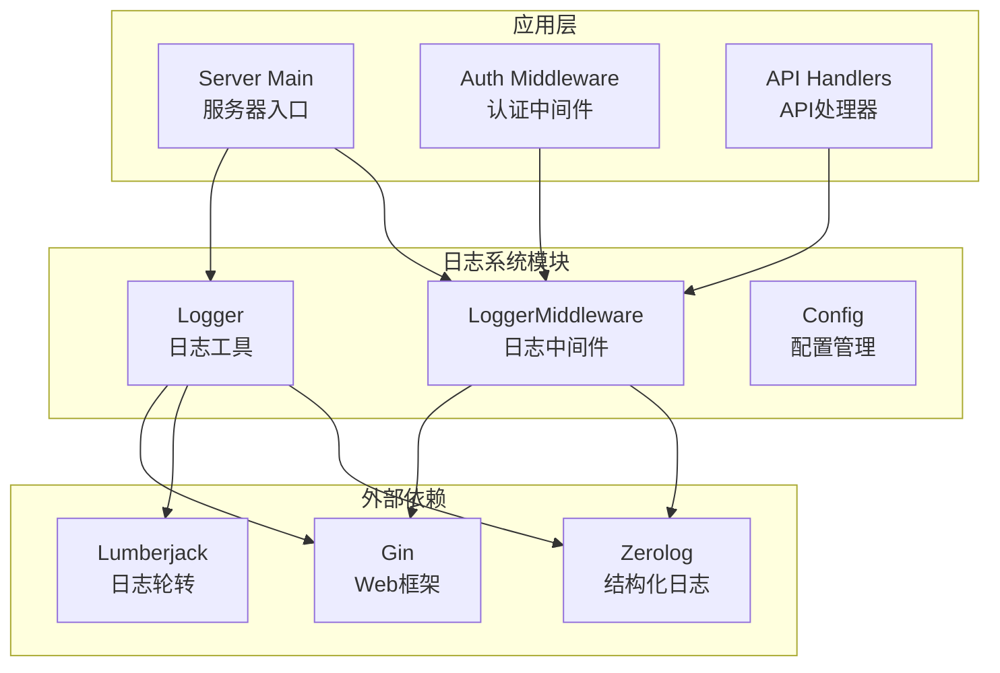
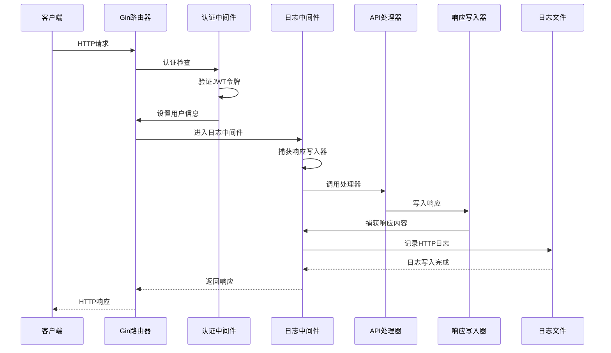
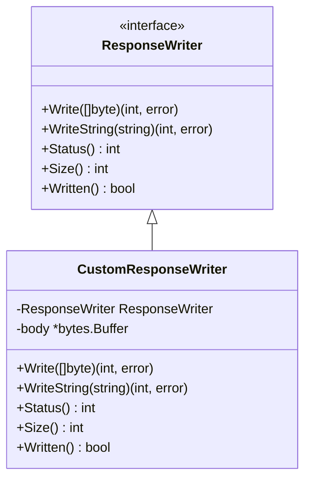
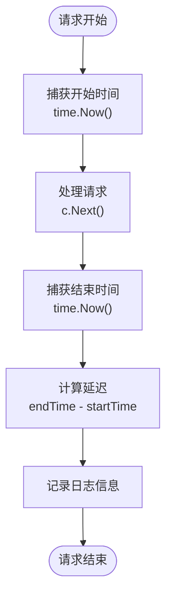
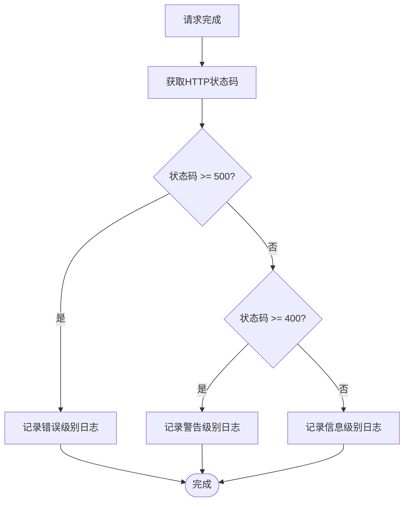
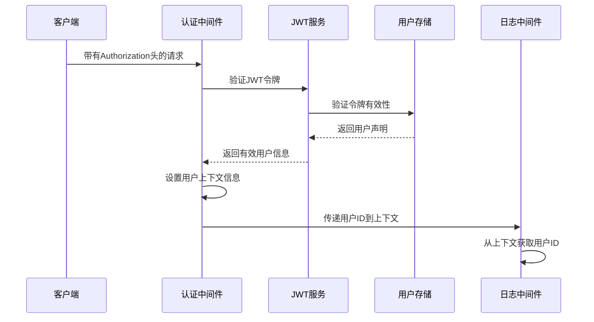
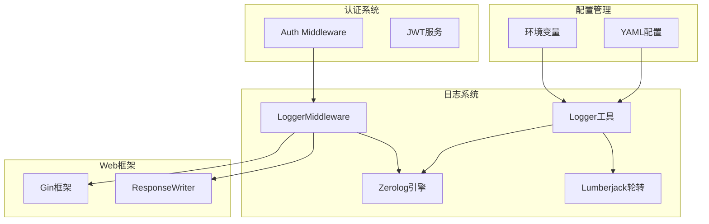
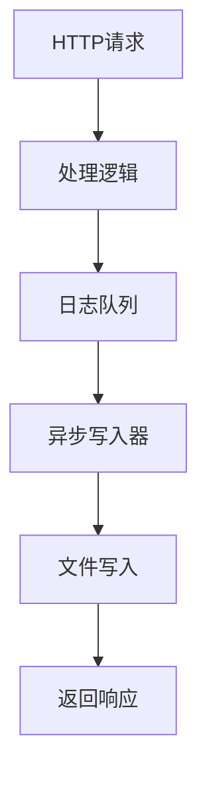

# 日志记录中间件

<cite>
**本文档引用的文件**
- [middleware.go](file://internal/logger/middleware.go)
- [logger.go](file://internal/logger/logger.go)
- [main.go](file://cmd/server/main.go)
- [logging.md](file://docs/logging.md)
- [config.yaml](file://configs/config.yaml)
- [middleware.go](file://internal/auth/middleware.go)
- [handlers.go](file://internal/api/handlers.go)
</cite>

## 目录
1. [简介](#简介)
2. [项目结构](#项目结构)
3. [核心组件](#核心组件)
4. [架构概览](#架构概览)
5. [详细组件分析](#详细组件分析)
6. [依赖关系分析](#依赖关系分析)
7. [性能考虑](#性能考虑)
8. [故障排除指南](#故障排除指南)
9. [结论](#结论)

## 简介

日志记录中间件是本项目中一个关键的基础设施组件，负责捕获HTTP请求和响应的完整信息，包括响应体内容、性能统计数据和用户身份信息。该中间件基于Gin框架构建，使用zerolog作为日志引擎，并通过lumberjack实现日志文件轮转管理。

该中间件的主要功能包括：
- **响应体捕获**：完整捕获HTTP响应内容，便于调试和审计
- **性能统计**：计算请求处理时间和延迟
- **日志级别分类**：根据HTTP状态码自动选择合适的日志级别
- **用户信息集成**：从认证中间件获取用户身份信息
- **客户端IP追踪**：准确获取客户端真实IP地址
- **请求详情记录**：记录完整的请求元数据

## 项目结构

日志系统在项目中的组织结构如下：



**图表来源**
- [middleware.go:1-69](file://internal/logger/middleware.go#L1-L69)
- [logger.go:1-89](file://internal/logger/logger.go#L1-L89)
- [main.go:1-167](file://cmd/server/main.go#L1-L167)

**章节来源**
- [middleware.go:1-69](file://internal/logger/middleware.go#L1-L69)
- [logger.go:1-89](file://internal/logger/logger.go#L1-L89)
- [main.go:1-167](file://cmd/server/main.go#L1-L167)

## 核心组件

### 日志中间件核心功能

日志中间件实现了完整的HTTP请求生命周期监控，包含以下核心功能：

#### 响应体捕获机制
中间件通过自定义的`responseWriter`结构体实现响应体捕获：
- 包装原始的Gin ResponseWriter
- 重写Write和WriteString方法以捕获响应内容
- 使用bytes.Buffer存储完整的响应数据

#### 性能统计功能
中间件精确计算以下性能指标：
- 请求开始时间戳
- 请求结束时间戳
- 处理延迟时间（毫秒级精度）
- HTTP状态码统计

#### 日志级别智能分类
根据HTTP状态码自动选择日志级别：
- 5xx状态码：错误级别
- 4xx状态码：警告级别  
- 2xx/3xx状态码：信息级别

**章节来源**
- [middleware.go:10-23](file://internal/logger/middleware.go#L10-L23)
- [middleware.go:25-67](file://internal/logger/middleware.go#L25-L67)

### 日志配置管理

日志系统采用双通道设计，分别处理应用日志和HTTP日志：

#### HTTP日志配置
- 独立的日志文件：logs/http.log
- 使用lumberjack进行文件轮转
- 包含完整的请求响应信息
- 专门用于HTTP请求审计

#### 应用日志配置
- 输出到标准输出和文件
- 文件路径：logs/app.log
- 包含调用者信息（文件名:行号）
- 通用应用运行信息

**章节来源**
- [logger.go:14-56](file://internal/logger/logger.go#L14-L56)
- [logging.md:18-28](file://docs/logging.md#L18-L28)

## 架构概览

日志中间件在整个系统架构中的位置和交互关系：



**图表来源**
- [middleware.go:25-67](file://internal/logger/middleware.go#L25-L67)
- [middleware.go:12-47](file://internal/auth/middleware.go#L12-L47)
- [main.go:115-116](file://cmd/server/main.go#L115-L116)

## 详细组件分析

### 响应体捕获机制

#### 自定义响应写入器实现



**图表来源**
- [middleware.go:10-23](file://internal/logger/middleware.go#L10-L23)

#### 捕获流程详解

响应体捕获的实现过程：

1. **中间件初始化**：创建bytes.Buffer和自定义ResponseWriter
2. **请求处理**：将自定义写入器替换到Gin上下文中
3. **响应捕获**：拦截所有写入操作，同时传递给原始写入器
4. **日志记录**：在请求完成后记录完整的响应内容

**章节来源**
- [middleware.go:25-34](file://internal/logger/middleware.go#L25-L34)

### 性能统计实现

#### 时间测量机制

中间件使用高精度时间测量来计算请求处理时间：



**图表来源**
- [middleware.go:26-37](file://internal/logger/middleware.go#L26-L37)

#### 性能指标收集

中间件收集的关键性能指标：
- **处理时间**：从请求进入到底层处理器返回的时间
- **网络延迟**：客户端到服务器的往返时间
- **响应大小**：响应体字节数
- **状态码分布**：不同HTTP状态码的统计

**章节来源**
- [middleware.go:36-37](file://internal/logger/middleware.go#L36-L37)

### 日志级别分类策略

#### 智能日志级别选择

日志中间件根据HTTP状态码自动选择适当的日志级别：



**图表来源**
- [middleware.go:59-66](file://internal/logger/middleware.go#L59-L66)

#### 日志级别语义

- **错误级别（Error）**：服务器内部错误、数据库连接失败等
- **警告级别（Warn）**：客户端错误、权限不足、参数验证失败等
- **信息级别（Info）**：正常请求处理、成功响应等

**章节来源**
- [middleware.go:59-66](file://internal/logger/middleware.go#L59-L66)

### 用户信息获取机制

#### 认证中间件集成

日志中间件依赖认证中间件提供的用户信息：



**图表来源**
- [middleware.go:41-44](file://internal/auth/middleware.go#L41-L44)
- [middleware.go:39-42](file://internal/logger/middleware.go#L39-L42)

#### 用户信息字段

日志记录中包含的用户相关信息：
- **user_id**：用户唯一标识符
- **anonymous**：匿名用户的特殊标记
- **roles**：用户角色列表
- **permissions**：用户权限集合

**章节来源**
- [middleware.go:41-44](file://internal/auth/middleware.go#L41-L44)
- [middleware.go:39-42](file://internal/logger/middleware.go#L39-L42)

### 请求详情记录

#### 完整请求元数据

日志中间件记录的请求详情包括：

| 字段名称 | 数据类型 | 描述 | 示例 |
|---------|---------|------|------|
| timestamp | 时间戳 | 请求发生时间 | 2024-01-15T10:30:00Z |
| method | 字符串 | HTTP方法 | GET, POST, PUT, DELETE |
| path | 字符串 | 请求路径 | /api/users/123 |
| query | 字符串 | 查询参数 | page=1&limit=10 |
| status | 整数 | HTTP状态码 | 200, 404, 500 |
| latency | 持续时间 | 处理延迟 | 45ms, 120ms |
| client_ip | 字符串 | 客户端IP地址 | 192.168.1.100 |
| user_agent | 字符串 | 用户代理字符串 | Mozilla/5.0... |
| response | 字符串 | 响应内容 | JSON或HTML |

**章节来源**
- [middleware.go:46-56](file://internal/logger/middleware.go#L46-L56)

## 依赖关系分析

### 组件间依赖关系



**图表来源**
- [middleware.go:1-8](file://internal/logger/middleware.go#L1-L8)
- [logger.go:3-9](file://internal/logger/logger.go#L3-L9)
- [main.go:13-22](file://cmd/server/main.go#L13-L22)

### 外部依赖分析

#### 主要依赖库

| 依赖库 | 版本 | 用途 | 关键特性 |
|-------|------|-----|---------|
| github.com/gin-gonic/gin | v1.x | Web框架 | 中间件链、上下文管理 |
| github.com/rs/zerolog | v1.x | 结构化日志 | 高性能、JSON输出 |
| gopkg.in/natefinch/lumberjack.v2 | v2.x | 日志轮转 | 文件大小限制、备份管理 |

#### 依赖版本兼容性

- Gin中间件接口稳定，向下兼容良好
- Zerolog提供稳定的API，支持结构化日志
- Lumberjack专注于日志轮转功能，API简洁可靠

**章节来源**
- [logger.go:3-9](file://internal/logger/logger.go#L3-L9)
- [main.go:13-22](file://cmd/server/main.go#L13-L22)

## 性能考虑

### 日志性能优化策略

#### 异步日志写入

为了最小化日志写入对请求处理的影响，建议采用异步写入策略：



#### 缓存策略

- **响应体缓存**：使用bytes.Buffer缓存响应内容
- **日志缓冲**：批量写入减少磁盘I/O操作
- **内存管理**：及时释放缓存避免内存泄漏

#### 性能监控指标

建议添加以下性能监控指标：
- 日志写入延迟
- 内存使用情况
- 磁盘I/O吞吐量
- 日志队列长度

### 内存使用优化

#### 响应体大小限制

为防止大响应导致内存溢出，建议实现响应体大小限制：

```go
const MAX_RESPONSE_SIZE = 1024 * 1024 // 1MB限制
```

#### 缓冲区管理

- 合理设置缓冲区初始容量
- 及时清理不再使用的缓冲区
- 监控内存使用峰值

## 故障排除指南

### 常见问题诊断

#### 日志文件无法创建

**症状**：启动时出现文件权限错误

**解决方案**：
1. 检查logs目录是否存在且可写
2. 验证日志文件路径配置正确
3. 确认应用程序具有足够的文件系统权限

#### 日志轮转不生效

**症状**：日志文件持续增长不被轮转

**解决方案**：
1. 检查日志文件大小限制配置
2. 验证备份文件数量设置
3. 确认日志轮转触发条件满足

#### 用户信息缺失

**症状**：日志中显示user_id为anonymous

**解决方案**：
1. 检查认证中间件是否正确执行
2. 验证JWT令牌格式和有效期
3. 确认用户上下文设置逻辑

### 调试技巧

#### 开启调试模式

```bash
export LOG_LEVEL=debug
export LOG_HTTP_FILE=logs/http-debug.log
```

#### 性能分析

使用pprof工具分析日志中间件性能瓶颈：
- CPU使用率分析
- 内存分配跟踪
- 磁盘I/O性能监控

#### 日志格式验证

验证日志输出格式的正确性：
- JSON格式验证
- 必需字段检查
- 时间戳格式确认

**章节来源**
- [logging.md:90-112](file://docs/logging.md#L90-L112)

## 结论

日志记录中间件作为系统的重要基础设施，提供了完整的HTTP请求监控能力。其设计特点包括：

### 核心优势

1. **完整性**：捕获完整的请求响应信息，便于调试和审计
2. **智能化**：自动分类日志级别，提高日志可读性
3. **高性能**：优化的内存管理和异步写入机制
4. **可扩展性**：清晰的接口设计，易于功能扩展

### 技术亮点

- 响应体捕获机制确保了日志信息的完整性
- 性能统计提供精确的请求处理时间
- 用户信息集成增强了安全审计能力
- 结构化日志格式便于自动化处理

### 未来改进方向

1. **异步日志写入**：进一步减少对请求处理的影响
2. **日志采样**：在高并发场景下实施日志采样策略
3. **分布式追踪**：集成分布式请求追踪机制
4. **日志聚合**：支持多实例日志集中管理

该中间件为系统的可观测性和可维护性提供了坚实基础，是生产环境中不可或缺的重要组件。