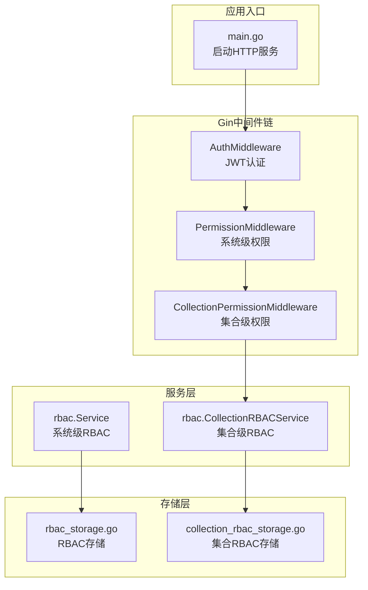
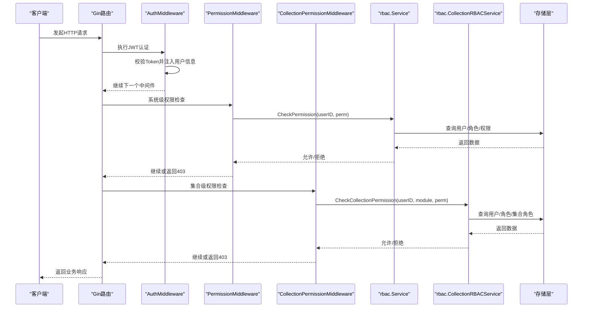
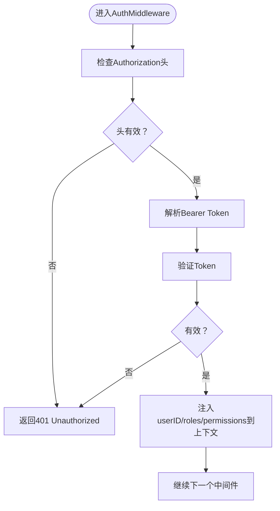
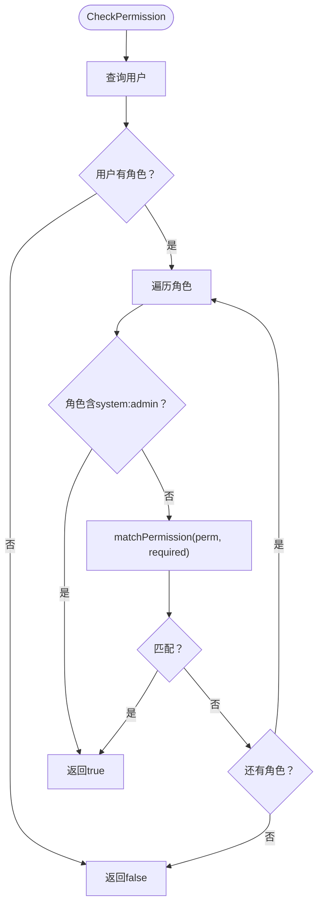
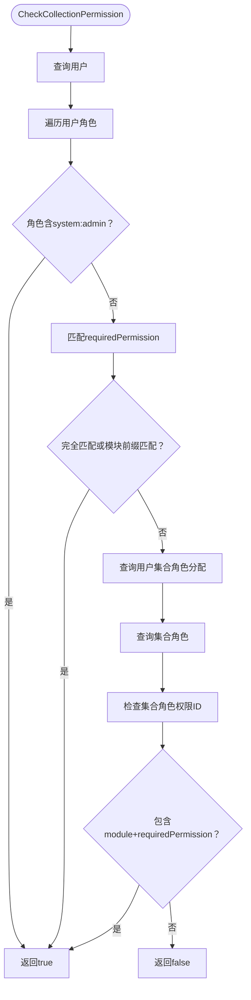
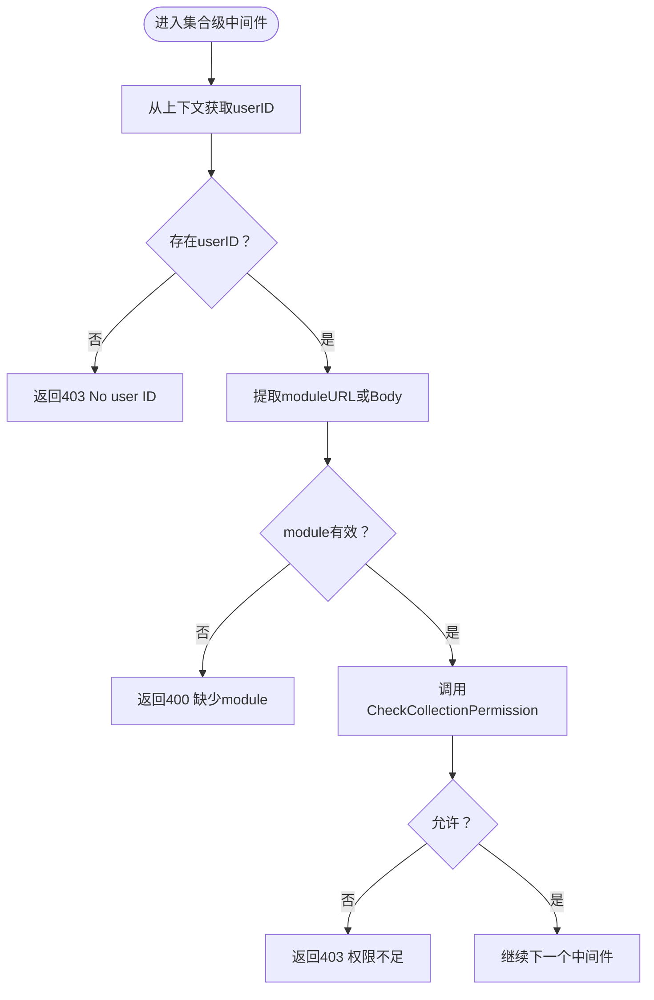
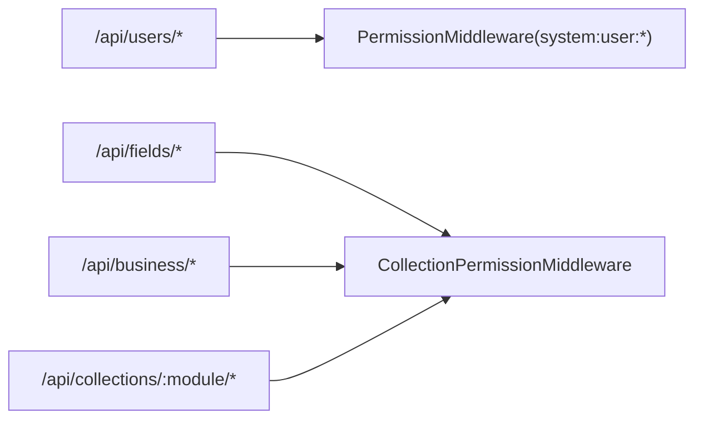
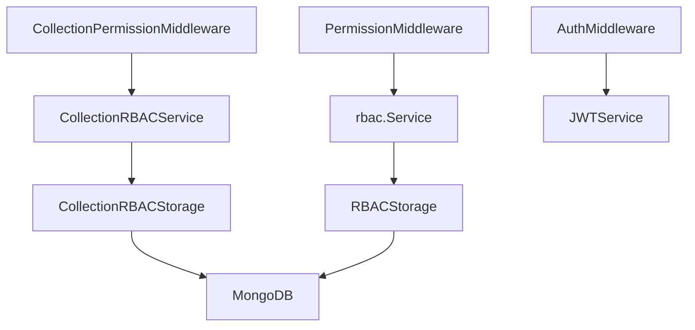

# 权限验证中间件

<cite>
**本文档引用的文件**
- [collection_permission_middleware.go](file://internal/api/collection_permission_middleware.go)
- [middleware.go](file://internal/auth/middleware.go)
- [rbac.go](file://pkg/rbac/rbac.go)
- [collection_rbac.go](file://pkg/rbac/collection_rbac.go)
- [rbac_storage.go](file://internal/storage/rbac_storage.go)
- [collection_rbac_storage.go](file://internal/storage/collection_rbac_storage.go)
- [models.go](file://internal/models/models.go)
- [handlers.go](file://internal/api/handlers.go)
- [main.go](file://cmd/server/main.go)
- [rbac.md](file://docs/rbac.md)
- [collection_roles_test.go](file://test/collection_roles_test.go)
</cite>

## 目录
1. [简介](#简介)
2. [项目结构](#项目结构)
3. [核心组件](#核心组件)
4. [架构总览](#架构总览)
5. [详细组件分析](#详细组件分析)
6. [依赖关系分析](#依赖关系分析)
7. [性能考虑](#性能考虑)
8. [故障排除指南](#故障排除指南)
9. [结论](#结论)
10. [附录](#附录)

## 简介
本文件面向权限验证中间件的使用者与维护者，系统性阐述基于 Gin 的 RBAC 权限检查流程、中间件链中的执行位置、用户权限获取与资源访问验证机制、集合级权限与系统级权限的区别与检查逻辑，并提供权限配置示例与常见问题的解决方案。文档以代码为依据，结合架构图与序列图，帮助读者快速理解并正确使用权限中间件。

## 项目结构
权限相关的代码主要分布在以下模块：
- 认证中间件：负责从请求头解析 JWT 并将用户信息注入上下文
- 系统级 RBAC 服务：提供通用权限检查与用户权限聚合
- 集合级 RBAC 服务：提供按集合模块维度的细粒度权限检查
- 中间件层：在路由注册阶段挂载权限中间件，拦截请求
- 存储层：MongoDB 存储抽象，提供用户、角色、权限、集合角色等数据访问

**图表来源**
- [main.go:94-118](file://cmd/server/main.go#L94-L118)
- [middleware.go:12-48](file://internal/auth/middleware.go#L12-L48)
- [rbac.go:59-99](file://pkg/rbac/rbac.go#L59-L99)
- [collection_rbac.go:32-90](file://pkg/rbac/collection_rbac.go#L32-L90)
- [rbac_storage.go:16-50](file://internal/storage/rbac_storage.go#L16-L50)
- [collection_rbac_storage.go:15-33](file://internal/storage/collection_rbac_storage.go#L15-L33)

**章节来源**
- [main.go:94-118](file://cmd/server/main.go#L94-L118)
- [handlers.go:45-181](file://internal/api/handlers.go#L45-L181)

## 核心组件
- 认证中间件（JWT）：从 Authorization 头提取 Bearer Token，校验后将用户ID、角色、权限注入上下文
- 系统级 RBAC 服务：根据用户角色继承权限，支持通配符匹配与超级管理员豁免
- 集合级 RBAC 服务：按集合模块维度检查权限，支持模块前缀匹配与集合角色映射
- 集合级权限中间件：在路由层拦截请求，提取模块与所需权限，调用集合级 RBAC 服务进行验证

**章节来源**
- [middleware.go:12-48](file://internal/auth/middleware.go#L12-L48)
- [rbac.go:63-99](file://pkg/rbac/rbac.go#L63-L99)
- [collection_rbac.go:39-90](file://pkg/rbac/collection_rbac.go#L39-L90)
- [collection_permission_middleware.go:16-48](file://internal/api/collection_permission_middleware.go#L16-L48)

## 架构总览
下图展示了权限中间件在 Gin 中间件链中的位置以及与服务层、存储层的交互关系。

**图表来源**
- [middleware.go:12-48](file://internal/auth/middleware.go#L12-L48)
- [rbac.go:63-99](file://pkg/rbac/rbac.go#L63-L99)
- [collection_rbac.go:39-90](file://pkg/rbac/collection_rbac.go#L39-L90)
- [collection_permission_middleware.go:16-48](file://internal/api/collection_permission_middleware.go#L16-L48)
- [handlers.go:88-132](file://internal/api/handlers.go#L88-L132)

## 详细组件分析

### 认证中间件（JWT）
- 作用：从 Authorization 头解析 Bearer Token，校验有效性，将用户ID、角色、权限注入上下文
- 关键行为：
  - 校验 Authorization 头格式
  - 使用 JWT 服务验证 Token
  - 将 userID、roles、permissions 设置到上下文
- 异常处理：缺失头、格式错误、Token 无效时返回 401

**图表来源**
- [middleware.go:12-48](file://internal/auth/middleware.go#L12-L48)

**章节来源**
- [middleware.go:12-48](file://internal/auth/middleware.go#L12-L48)

### 系统级 RBAC 服务
- 作用：基于用户角色继承权限，支持通配符匹配与超级管理员豁免
- 关键方法：
  - CheckPermission：检查用户是否拥有指定系统级权限
  - GetUserPermissions：聚合用户通过角色继承的所有权限
  - matchPermission：支持形如 "prefix:*" 的通配符匹配
- 特殊处理：若任一角色包含 "system:admin"，则直接放行

**图表来源**
- [rbac.go:63-99](file://pkg/rbac/rbac.go#L63-L99)
- [rbac.go:101-114](file://pkg/rbac/rbac.go#L101-L114)

**章节来源**
- [rbac.go:63-99](file://pkg/rbac/rbac.go#L63-L99)
- [rbac.go:101-114](file://pkg/rbac/rbac.go#L101-L114)

### 集合级 RBAC 服务
- 作用：按集合模块维度检查权限，支持模块前缀匹配与集合角色映射
- 关键方法：
  - CheckCollectionPermission：先检查系统级权限，再检查集合角色权限
  - CreateCollectionRoles：为模块创建预置集合角色与权限
  - AssignCollectionRole/RemoveCollectionRole：同步用户集合角色与系统角色
- 权限匹配逻辑：
  - 若系统权限代码与 requiredPermission 完全相等，或系统权限代码去掉模块前缀后与 requiredPermission 相等，则放行
  - 否则查询集合角色，检查集合角色的权限ID列表是否包含 "module+requiredPermission"

**图表来源**
- [collection_rbac.go:39-90](file://pkg/rbac/collection_rbac.go#L39-L90)

**章节来源**
- [collection_rbac.go:39-90](file://pkg/rbac/collection_rbac.go#L39-L90)

### 集合级权限中间件
- 作用：在路由层拦截请求，提取模块与所需权限，调用集合级 RBAC 服务进行验证
- 三种变体：
  - 从 URL 参数提取模块：适用于 GET/PUT/DELETE 等路径参数场景
  - 从请求体提取模块：适用于 POST 等请求体包含 module 的场景
  - 字段级管理员中间件：针对字段定义的管理员权限，先查询字段记录获取模块
- 异常处理：缺少用户ID、模块缺失、权限不足时返回 403

**图表来源**
- [collection_permission_middleware.go:16-48](file://internal/api/collection_permission_middleware.go#L16-L48)
- [collection_permission_middleware.go:53-93](file://internal/api/collection_permission_middleware.go#L53-L93)
- [collection_permission_middleware.go:97-136](file://internal/api/collection_permission_middleware.go#L97-L136)

**章节来源**
- [collection_permission_middleware.go:16-48](file://internal/api/collection_permission_middleware.go#L16-L48)
- [collection_permission_middleware.go:53-93](file://internal/api/collection_permission_middleware.go#L53-L93)
- [collection_permission_middleware.go:97-136](file://internal/api/collection_permission_middleware.go#L97-L136)

### 路由与中间件链
- 路由注册时挂载中间件：
  - 系统级权限中间件：对用户、角色、权限等管理接口进行系统级权限控制
  - 集合级权限中间件：对字段、业务数据、集合管理等接口进行集合级权限控制
- 中间件链顺序：Auth -> 系统级权限 -> 集合级权限 -> 业务处理器

**图表来源**
- [handlers.go:49-181](file://internal/api/handlers.go#L49-L181)

**章节来源**
- [handlers.go:49-181](file://internal/api/handlers.go#L49-L181)

## 依赖关系分析
- 中间件依赖：
  - 集合级中间件依赖集合级 RBAC 服务
  - 系统级中间件依赖系统级 RBAC 服务
  - 认证中间件依赖 JWT 服务
- 服务依赖：
  - rbac.Service 依赖 RBAC 存储接口
  - CollectionRBACService 依赖 RBAC 存储与集合 RBAC 存储
- 存储依赖：
  - RBAC 存储与集合 RBAC 存储均基于 MongoDB

**图表来源**
- [collection_permission_middleware.go:16-48](file://internal/api/collection_permission_middleware.go#L16-L48)
- [rbac.go:59-61](file://pkg/rbac/rbac.go#L59-L61)
- [collection_rbac.go:32-37](file://pkg/rbac/collection_rbac.go#L32-L37)
- [rbac_storage.go:16-50](file://internal/storage/rbac_storage.go#L16-L50)
- [collection_rbac_storage.go:15-33](file://internal/storage/collection_rbac_storage.go#L15-L33)

**章节来源**
- [rbac.go:59-61](file://pkg/rbac/rbac.go#L59-L61)
- [collection_rbac.go:32-37](file://pkg/rbac/collection_rbac.go#L32-L37)
- [rbac_storage.go:16-50](file://internal/storage/rbac_storage.go#L16-L50)
- [collection_rbac_storage.go:15-33](file://internal/storage/collection_rbac_storage.go#L15-L33)

## 性能考虑
- 权限检查复杂度：
  - 系统级：O(R×P)，R 为用户角色数，P 为角色权限数
  - 集合级：系统级检查后，再查询集合角色与权限映射，额外 O(C)，C 为集合角色权限数
- 优化建议：
  - 为用户角色与角色权限建立合适的索引，减少查询开销
  - 对频繁访问的用户权限进行缓存（如内存缓存或Redis），降低数据库压力
  - 合理拆分中间件链，避免在同一路由上叠加过多权限检查

[本节为通用性能讨论，无需具体文件来源]

## 故障排除指南
- 常见错误与排查：
  - 401 未授权：确认 Authorization 头格式为 "Bearer <token>"，且 Token 未过期
  - 403 权限不足：检查用户是否拥有系统级 "system:admin" 或集合级相应权限
  - 400 缺少模块：确认请求体或 URL 参数包含有效的 module 字段
  - 模块权限不生效：确认集合角色已正确创建并分配给用户
- 调试建议：
  - 查看中间件日志输出，定位权限检查失败的具体步骤
  - 使用测试工具验证集合角色创建与权限映射是否正确

**章节来源**
- [collection_permission_middleware.go:18-44](file://internal/api/collection_permission_middleware.go#L18-L44)
- [collection_permission_middleware.go:55-89](file://internal/api/collection_permission_middleware.go#L55-L89)
- [collection_rbac.go:92-194](file://pkg/rbac/collection_rbac.go#L92-L194)

## 结论
权限验证中间件通过“认证中间件 + 系统级 RBAC + 集合级 RBAC”的三层防护，实现了从全局到细粒度的权限控制。系统级权限覆盖通用资源，集合级权限提供模块化的细粒度控制。通过合理的中间件链与存储设计，既能满足功能需求，又能在性能与可维护性之间取得平衡。

[本节为总结性内容，无需具体文件来源]

## 附录

### 权限配置示例
- 创建集合角色与权限
  - 使用集合级 RBAC 服务为模块创建预置角色与权限
  - 示例：为模块 "movie" 创建 "movie:read"、"movie:write"、"movie:delete"、"movie:admin"、"movie:field:admin"
- 分配集合角色
  - 将用户分配到集合角色，系统会同步分配对应的系统角色
  - 支持按模块批量查询角色与分配情况
- 字段级管理员
  - 通过字段级管理员中间件，先查询字段记录获取模块，再检查 "movie:field:admin"

**章节来源**
- [collection_rbac.go:92-194](file://pkg/rbac/collection_rbac.go#L92-L194)
- [collection_rbac.go:217-252](file://pkg/rbac/collection_rbac.go#L217-L252)
- [collection_permission_middleware.go:97-136](file://internal/api/collection_permission_middleware.go#L97-L136)

### 集合级权限与系统级权限的区别
- 系统级权限
  - 通用资源权限，如 "user:read"、"role:write"、"permission:manage"
  - 通过角色继承，支持通配符匹配
  - 超级管理员 "system:admin" 可豁免所有系统级权限检查
- 集合级权限
  - 针对特定集合模块的权限，如 "movie:read"、"movie:write"
  - 支持模块前缀匹配与集合角色映射
  - 优先检查系统级权限，再检查集合角色权限

**章节来源**
- [rbac.go:12-42](file://pkg/rbac/rbac.go#L12-L42)
- [collection_rbac.go:15-25](file://pkg/rbac/collection_rbac.go#L15-L25)
- [collection_rbac.go:53-69](file://pkg/rbac/collection_rbac.go#L53-L69)

### 中间件链执行位置与最佳实践
- 执行位置
  - 认证中间件：所有受保护路由之前
  - 系统级权限中间件：对通用资源接口进行控制
  - 集合级权限中间件：对集合相关接口进行控制
- 最佳实践
  - 将高频权限检查放在靠前位置，尽早拒绝无效请求
  - 对集合级权限中间件的模块提取逻辑进行统一规范
  - 对权限不足的错误响应保持一致的格式与状态码

**章节来源**
- [handlers.go:49-181](file://internal/api/handlers.go#L49-L181)
- [collection_permission_middleware.go:16-48](file://internal/api/collection_permission_middleware.go#L16-L48)

### 数据模型与存储
- 用户、角色、权限模型
  - 用户包含角色ID数组，角色包含权限ID数组
  - 权限代码唯一，支持通配符匹配
- 集合角色与审计日志
  - 集合角色包含模块、类型、权限ID列表
  - 提供审计日志记录权限变更与操作行为

**章节来源**
- [models.go:247-271](file://internal/models/models.go#L247-L271)
- [models.go:328-351](file://internal/models/models.go#L328-L351)
- [rbac_storage.go:16-50](file://internal/storage/rbac_storage.go#L16-L50)
- [collection_rbac_storage.go:15-33](file://internal/storage/collection_rbac_storage.go#L15-L33)