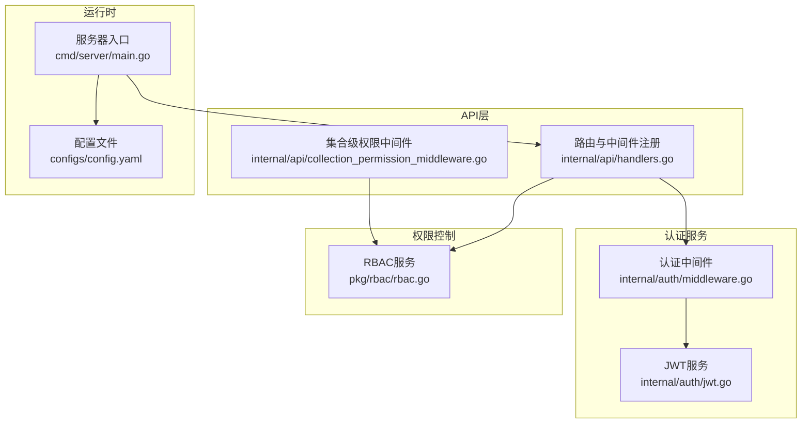
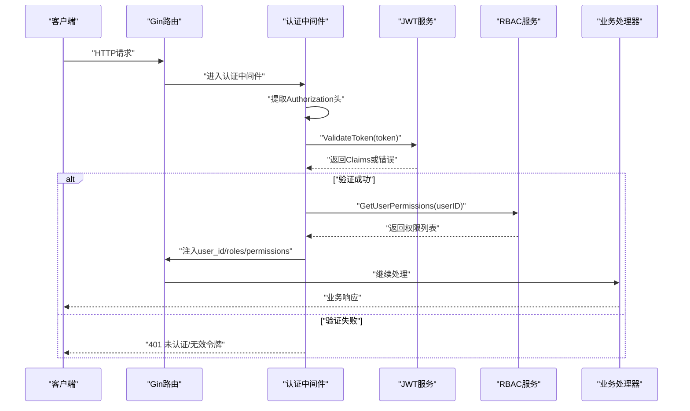
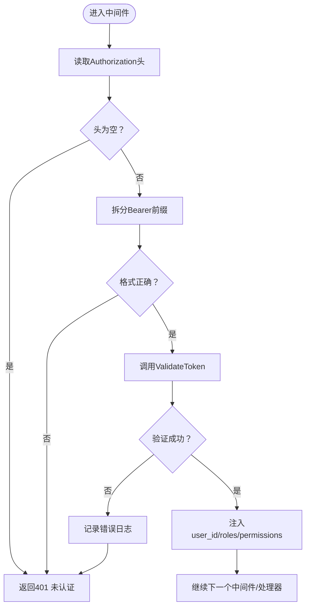
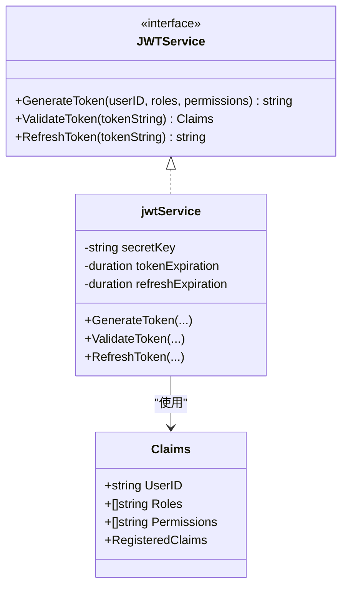
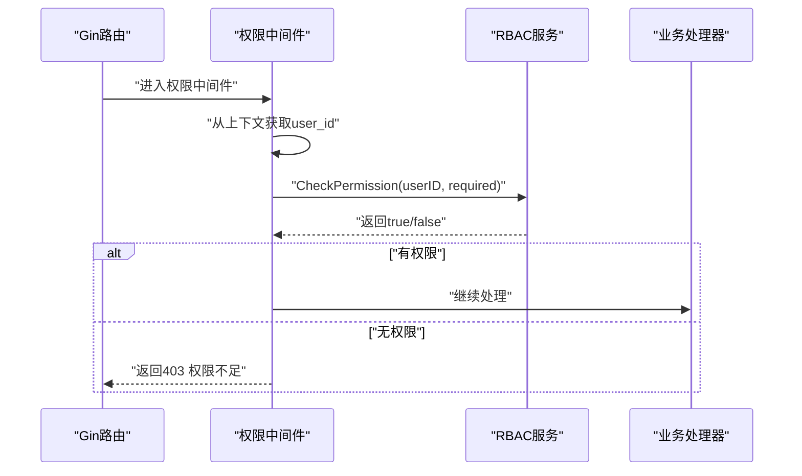
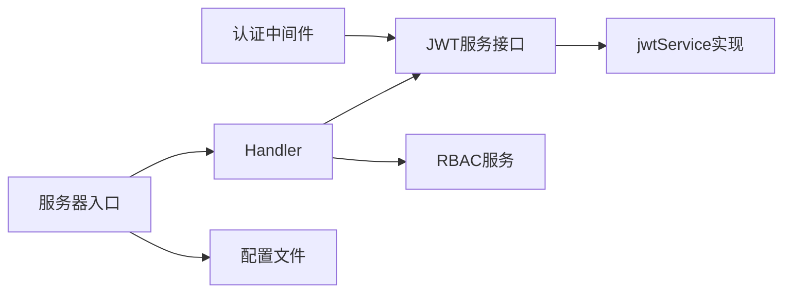

# 认证中间件

<cite>
**本文引用的文件列表**
- [middleware.go](file://internal/auth/middleware.go)
- [jwt.go](file://internal/auth/jwt.go)
- [handlers.go](file://internal/api/handlers.go)
- [collection_permission_middleware.go](file://internal/api/collection_permission_middleware.go)
- [rbac.go](file://pkg/rbac/rbac.go)
- [main.go](file://cmd/server/main.go)
- [config.yaml](file://configs/config.yaml)
- [authentication.md](file://docs/authentication.md)
- [jwt_test.go](file://internal/auth/test/jwt_test.go)
</cite>

## 目录
1. [简介](#简介)
2. [项目结构](#项目结构)
3. [核心组件](#核心组件)
4. [架构总览](#架构总览)
5. [详细组件分析](#详细组件分析)
6. [依赖分析](#依赖分析)
7. [性能考虑](#性能考虑)
8. [故障排查指南](#故障排查指南)
9. [结论](#结论)
10. [附录](#附录)

## 简介
本文件面向认证中间件的实现与使用，重点解释JWT令牌验证流程、中间件执行逻辑、从请求头提取与校验令牌、解析用户信息、认证失败处理机制与错误响应格式，并补充令牌刷新、过期处理与安全配置的最佳实践。文档同时结合实际代码路径，帮助开发者快速理解与维护认证体系。

## 项目结构
认证相关代码主要分布在以下模块：
- 认证服务与中间件：internal/auth
- API路由与权限中间件：internal/api
- 权限控制服务：pkg/rbac
- 服务器入口与配置：cmd/server, configs

图表来源
- [handlers.go:45-181](file://internal/api/handlers.go#L45-L181)
- [middleware.go:11-48](file://internal/auth/middleware.go#L11-L48)
- [jwt.go:20-41](file://internal/auth/jwt.go#L20-L41)
- [rbac.go:55-99](file://pkg/rbac/rbac.go#L55-L99)
- [main.go:72-77](file://cmd/server/main.go#L72-L77)
- [config.yaml:6-10](file://configs/config.yaml#L6-L10)

章节来源
- [handlers.go:45-181](file://internal/api/handlers.go#L45-L181)
- [middleware.go:11-48](file://internal/auth/middleware.go#L11-L48)
- [jwt.go:20-41](file://internal/auth/jwt.go#L20-L41)
- [rbac.go:55-99](file://pkg/rbac/rbac.go#L55-L99)
- [main.go:72-77](file://cmd/server/main.go#L72-L77)
- [config.yaml:6-10](file://configs/config.yaml#L6-L10)

## 核心组件
- JWT服务：负责生成、验证与刷新令牌，定义Claims结构与服务接口。
- 认证中间件：从请求头提取Authorization头，校验Bearer格式，调用JWT服务验证令牌，注入用户上下文。
- 权限中间件：基于RBAC服务检查用户对具体资源的权限。
- 服务器入口：初始化JWT服务、RBAC服务与路由，设置全局中间件。

章节来源
- [jwt.go:12-25](file://internal/auth/jwt.go#L12-L25)
- [middleware.go:11-48](file://internal/auth/middleware.go#L11-L48)
- [handlers.go:295-314](file://internal/api/handlers.go#L295-L314)
- [main.go:72-77](file://cmd/server/main.go#L72-L77)

## 架构总览
下图展示认证与授权在系统中的交互关系：客户端发起请求，经过全局认证中间件与权限中间件，最终到达业务处理器；JWT服务负责令牌生命周期管理，RBAC服务负责权限判定。

图表来源
- [handlers.go:260-293](file://internal/api/handlers.go#L260-L293)
- [jwt.go:68-83](file://internal/auth/jwt.go#L68-L83)
- [rbac.go:116-145](file://pkg/rbac/rbac.go#L116-L145)

## 详细组件分析

### 认证中间件执行逻辑
- 请求头提取：从Authorization头读取值，若为空则返回未认证错误。
- Bearer格式校验：必须为“Bearer <token>”，否则返回格式错误。
- 令牌验证：调用JWT服务的ValidateToken方法，若失败记录日志并返回未认证。
- 上下文注入：成功后将用户ID、角色与权限注入Gin上下文，供后续中间件与处理器使用。

图表来源
- [middleware.go:14-47](file://internal/auth/middleware.go#L14-L47)

章节来源
- [middleware.go:11-48](file://internal/auth/middleware.go#L11-L48)

### JWT服务与令牌结构
- Claims结构：包含用户ID、角色、权限以及标准声明（过期、签发、主题等）。
- 服务接口：提供生成、验证、刷新令牌的能力。
- 令牌生成：设置过期时间、签发时间、主题与唯一ID，使用HS256签名。
- 令牌验证：使用相同密钥解析并校验签名与有效期。
- 令牌刷新：支持对已过期但仍在刷新窗口内的令牌进行刷新，生成新令牌。

图表来源
- [jwt.go:12-25](file://internal/auth/jwt.go#L12-L25)
- [jwt.go:27-41](file://internal/auth/jwt.go#L27-L41)
- [jwt.go:43-83](file://internal/auth/jwt.go#L43-L83)
- [jwt.go:85-111](file://internal/auth/jwt.go#L85-L111)

章节来源
- [jwt.go:12-25](file://internal/auth/jwt.go#L12-L25)
- [jwt.go:43-83](file://internal/auth/jwt.go#L43-L83)
- [jwt.go:85-111](file://internal/auth/jwt.go#L85-L111)

### 权限中间件与RBAC集成
- 权限中间件：从上下文读取user_id，调用RBAC服务检查所需权限，不满足则返回403。
- RBAC服务：根据用户角色与权限映射判断是否拥有指定权限，支持通配符匹配与超级管理员判定。
- 集合级权限中间件：针对集合维度的权限检查，支持从URL或请求体提取模块名。

图表来源
- [handlers.go:295-314](file://internal/api/handlers.go#L295-L314)
- [rbac.go:63-99](file://pkg/rbac/rbac.go#L63-L99)

章节来源
- [handlers.go:295-314](file://internal/api/handlers.go#L295-L314)
- [rbac.go:63-99](file://pkg/rbac/rbac.go#L63-L99)
- [collection_permission_middleware.go:16-48](file://internal/api/collection_permission_middleware.go#L16-L48)

### 登录与令牌发放
- 登录流程：解析请求体、查询用户、验证密码、获取用户权限、生成JWT并返回。
- 令牌内容：包含用户ID、角色与权限，便于后续中间件快速判断。

章节来源
- [handlers.go:183-221](file://internal/api/handlers.go#L183-L221)
- [jwt.go:43-66](file://internal/auth/jwt.go#L43-L66)

### 令牌刷新与过期处理
- 刷新策略：对有效令牌直接生成新令牌；对已过期但仍在刷新窗口内的令牌，解析其Claims并校验刷新过期时间后生成新令牌。
- 刷新窗口：由配置决定，超过刷新窗口则拒绝刷新。

章节来源
- [jwt.go:85-111](file://internal/auth/jwt.go#L85-L111)
- [config.yaml:6-10](file://configs/config.yaml#L6-L10)

## 依赖分析
- 认证中间件依赖JWT服务接口，实现解耦。
- API层通过Handler组合JWT服务与RBAC服务，统一注册路由与中间件。
- 服务器入口负责初始化JWT与RBAC服务，并注入到Handler。

图表来源
- [middleware.go:11-48](file://internal/auth/middleware.go#L11-L48)
- [jwt.go:20-41](file://internal/auth/jwt.go#L20-L41)
- [handlers.go:23-43](file://internal/api/handlers.go#L23-L43)
- [main.go:72-77](file://cmd/server/main.go#L72-L77)
- [config.yaml:6-10](file://configs/config.yaml#L6-L10)

章节来源
- [middleware.go:11-48](file://internal/auth/middleware.go#L11-L48)
- [jwt.go:20-41](file://internal/auth/jwt.go#L20-L41)
- [handlers.go:23-43](file://internal/api/handlers.go#L23-L43)
- [main.go:72-77](file://cmd/server/main.go#L72-L77)
- [config.yaml:6-10](file://configs/config.yaml#L6-L10)

## 性能考虑
- 令牌验证成本低：HS256签名验证与标准声明校验，开销较小。
- 权限查询：认证中间件会重新查询用户权限，确保实时性，建议在高并发场景下优化RBAC存储与缓存策略。
- 中间件链路：尽量减少不必要的上下文写入与重复查询，避免在高频路径上做昂贵操作。

## 故障排查指南
- 未提供Authorization头或格式错误：返回401，提示需要Authorization头或Bearer格式。
- 令牌无效或过期：返回401，提示无效或过期令牌；可尝试使用刷新令牌。
- 无权限访问：返回403，提示权限不足；检查用户角色与权限映射。
- 登录失败：用户名不存在或密码错误，返回401；检查用户凭据与哈希验证。
- 服务器启动问题：确认环境变量与配置文件正确，特别是JWT密钥与过期时间。

章节来源
- [middleware.go:16-39](file://internal/auth/middleware.go#L16-L39)
- [handlers.go:194-203](file://internal/api/handlers.go#L194-L203)
- [authentication.md:70-79](file://docs/authentication.md#L70-L79)

## 结论
认证中间件通过严格的请求头校验与JWT服务验证，确保只有合法令牌才能访问受保护资源；配合RBAC服务实现细粒度权限控制。建议在生产环境中强化安全配置与监控，合理设置令牌过期与刷新窗口，并持续优化权限查询性能。

## 附录

### 请求头与错误响应规范
- 请求头：Authorization: Bearer <token>
- 错误响应：统一返回JSON对象，包含错误描述字段；状态码遵循未认证、无权限等约定。

章节来源
- [authentication.md:70-79](file://docs/authentication.md#L70-L79)

### 安全配置最佳实践
- 密钥管理：使用强随机密钥，定期轮换；避免硬编码在源码中。
- 过期策略：短令牌+长刷新窗口，降低泄露风险。
- 传输安全：启用HTTPS，限制CORS策略，避免明文传输。
- 日志与审计：记录认证失败事件，但不输出敏感信息。

章节来源
- [config.yaml:6-10](file://configs/config.yaml#L6-L10)
- [main.go:100-113](file://cmd/server/main.go#L100-L113)