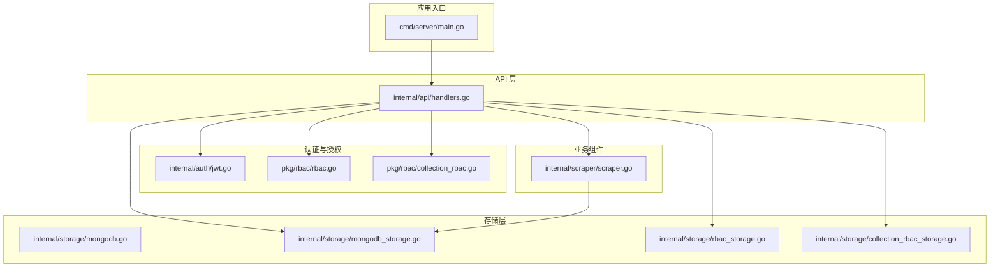
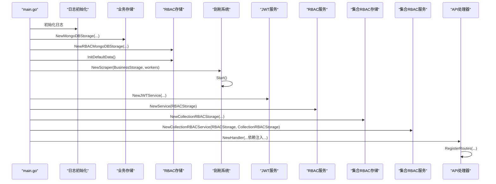
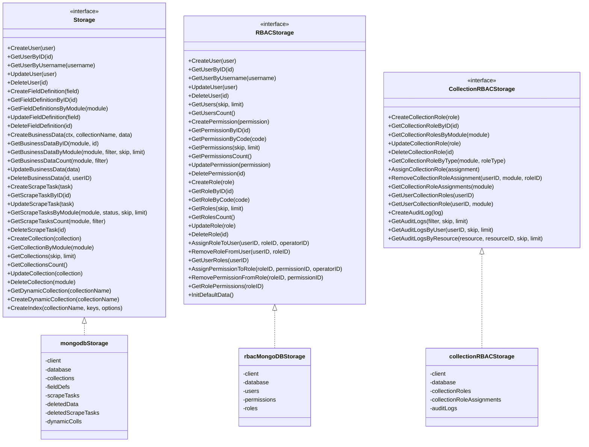
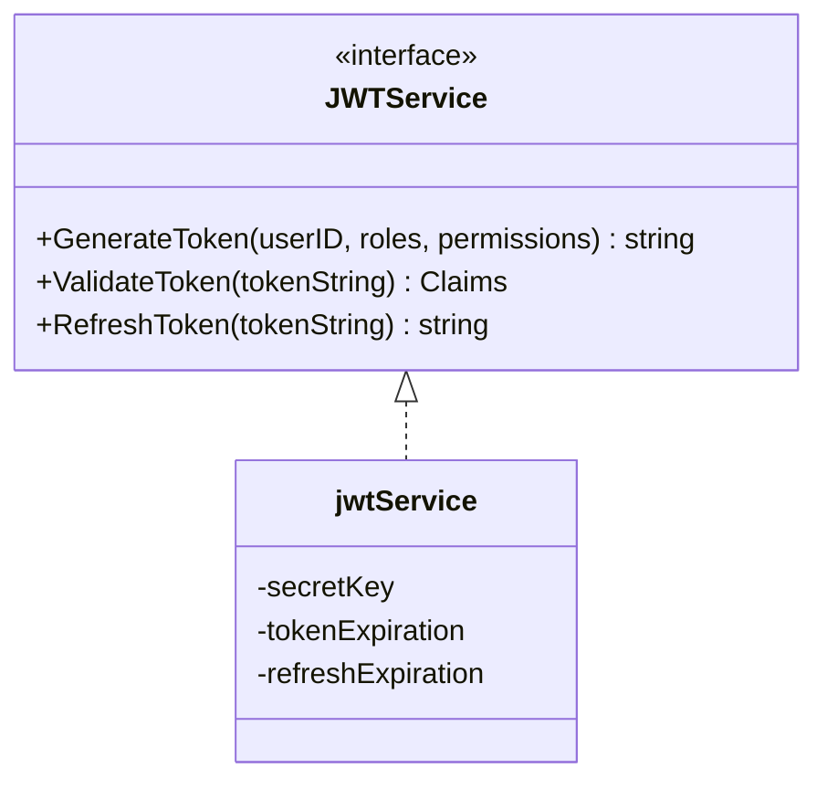
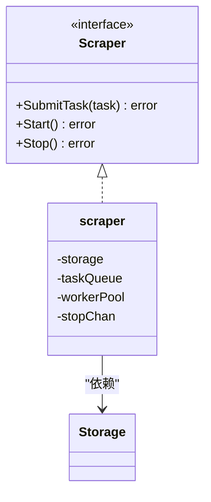
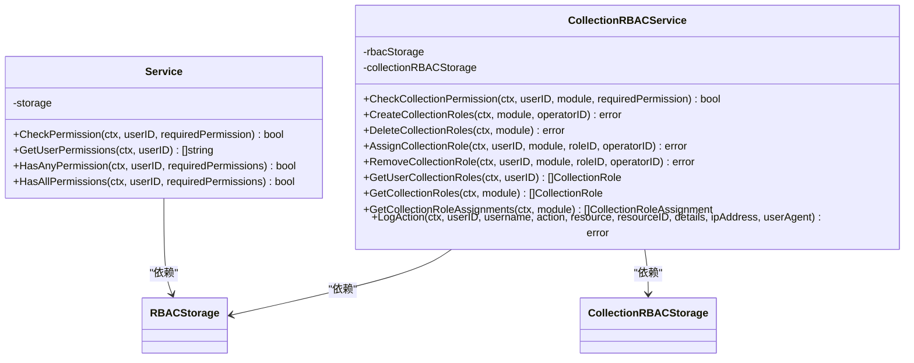
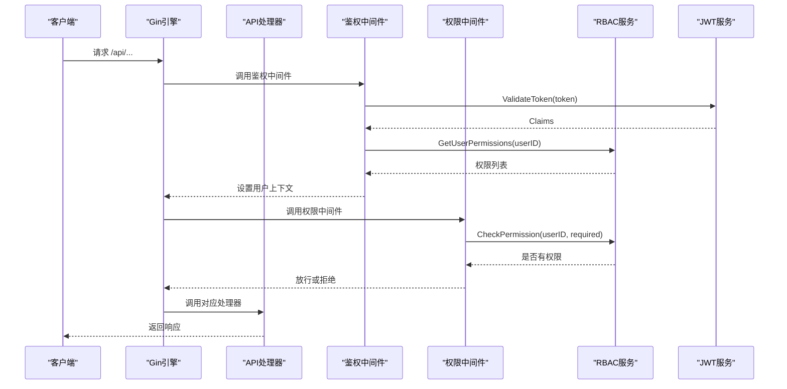
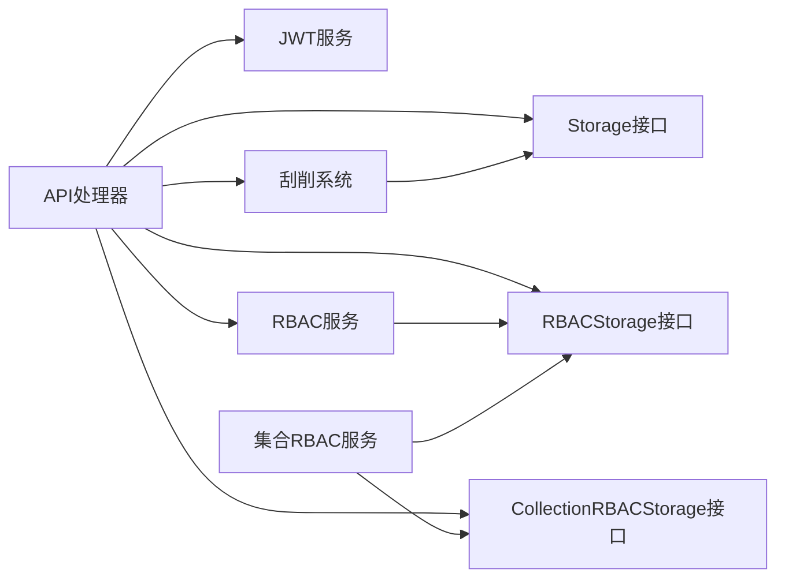

# 依赖注入模式

<cite>
**本文引用的文件**
- [main.go](file://cmd/server/main.go)
- [mongodb.go](file://internal/storage/mongodb.go)
- [mongodb_storage.go](file://internal/storage/mongodb_storage.go)
- [rbac_storage.go](file://internal/storage/rbac_storage.go)
- [collection_rbac_storage.go](file://internal/storage/collection_rbac_storage.go)
- [jwt.go](file://internal/auth/jwt.go)
- [scraper.go](file://internal/scraper/scraper.go)
- [rbac.go](file://pkg/rbac/rbac.go)
- [collection_rbac.go](file://pkg/rbac/collection_rbac.go)
- [handlers.go](file://internal/api/handlers.go)
- [models.go](file://internal/models/models.go)
- [main.go](file://cmdenscrape/main.go)
- [go.mod](file://go.mod)
</cite>

## 目录
1. [简介](#简介)
2. [项目结构](#项目结构)
3. [核心组件](#核心组件)
4. [架构总览](#架构总览)
5. [详细组件分析](#详细组件分析)
6. [依赖关系分析](#依赖关系分析)
7. [性能考量](#性能考量)
8. [故障排查指南](#故障排查指南)
9. [结论](#结论)
10. [附录](#附录)

## 简介
本技术文档围绕数据中心项目的依赖注入模式展开，重点阐述在 Go 语言中如何通过构造函数注入与接口注入实现组件解耦与可测试性。文档覆盖业务存储、RBAC 存储、JWT 服务、刮削系统等核心服务的依赖关系与生命周期管理，并给出在 main 函数中进行服务实例化的最佳实践、依赖图与组件交互示例，以及设计原则与重构指南。

## 项目结构
项目采用按领域分层与功能模块结合的组织方式：
- cmd/server：HTTP 服务入口，负责环境变量加载、服务实例化与生命周期管理
- internal/storage：数据访问层，提供业务存储与 RBAC 存储接口及 MongoDB 实现
- internal/auth：认证与授权相关服务（JWT）
- internal/scraper：刮削系统，负责异步任务队列与执行
- pkg/rbac：业务级 RBAC 服务与集合级 RBAC 服务
- internal/api：Gin 路由与处理器，聚合各服务并提供中间件
- internal/models：跨模块共享的数据模型
- cmdenscrape：独立的刮削任务生成工具

图表来源
- [main.go:24-150](file://cmd/server/main.go#L24-L150)
- [handlers.go:23-43](file://internal/api/handlers.go#L23-L43)
- [mongodb.go:14-90](file://internal/storage/mongodb.go#L14-L90)
- [mongodb_storage.go:16-51](file://internal/storage/mongodb_storage.go#L16-L51)
- [rbac_storage.go:16-50](file://internal/storage/rbac_storage.go#L16-L50)
- [collection_rbac_storage.go:15-33](file://internal/storage/collection_rbac_storage.go#L15-L33)
- [jwt.go:20-41](file://internal/auth/jwt.go#L20-L41)
- [scraper.go:18-45](file://internal/scraper/scraper.go#L18-L45)
- [rbac.go:55-61](file://pkg/rbac/rbac.go#L55-L61)
- [collection_rbac.go:27-37](file://pkg/rbac/collection_rbac.go#L27-L37)

章节来源
- [main.go:24-150](file://cmd/server/main.go#L24-L150)
- [handlers.go:23-43](file://internal/api/handlers.go#L23-L43)

## 核心组件
- 业务存储接口与实现
  - 接口定义于 storage 包，涵盖用户、字段定义、业务数据、权限、角色、刮削任务、集合管理等 CRUD 与索引能力
  - MongoDB 实现提供连接、动态集合、索引创建与各类业务方法
- RBAC 存储接口与实现
  - 定义用户、角色、权限的 CRUD 与分配关系管理，并提供默认数据初始化
- 集合级 RBAC 存储接口与实现
  - 定义集合角色、分配与审计日志能力
- JWT 服务
  - 提供令牌生成、校验、刷新与密码加解密
- 刮削系统
  - 基于通道的任务队列与多协程工作池，支持提交任务、执行与结果持久化
- RBAC 服务与集合级 RBAC 服务
  - 提供权限检查、集合权限匹配、角色创建与分配等业务逻辑
- API 处理器
  - 聚合上述服务，注册路由并提供鉴权与权限中间件

章节来源
- [mongodb.go:14-90](file://internal/storage/mongodb.go#L14-L90)
- [mongodb_storage.go:16-51](file://internal/storage/mongodb_storage.go#L16-L51)
- [rbac_storage.go:16-50](file://internal/storage/rbac_storage.go#L16-L50)
- [collection_rbac_storage.go:15-33](file://internal/storage/collection_rbac_storage.go#L15-L33)
- [jwt.go:20-41](file://internal/auth/jwt.go#L20-L41)
- [scraper.go:18-45](file://internal/scraper/scraper.go#L18-L45)
- [rbac.go:55-61](file://pkg/rbac/rbac.go#L55-L61)
- [collection_rbac.go:27-37](file://pkg/rbac/collection_rbac.go#L27-L37)

## 架构总览
下图展示 main 函数中服务实例化与依赖注入的总体流程，体现构造函数注入与接口抽象带来的解耦效果。

图表来源
- [main.go:32-95](file://cmd/server/main.go#L32-L95)

章节来源
- [main.go:32-95](file://cmd/server/main.go#L32-L95)

## 详细组件分析

### 业务存储与 RBAC 存储
- 接口抽象
  - 业务存储接口统一了用户、字段定义、业务数据、权限、角色、刮削任务、集合管理等操作
  - RBAC 存储接口统一了用户、角色、权限的 CRUD 与分配关系管理
  - 集合级 RBAC 存储接口统一了集合角色、分配与审计日志
- 实现细节
  - MongoDB 实现负责连接、动态集合与索引管理，并提供具体业务方法
  - RBAC 存储实现提供默认数据初始化，包括系统权限、角色与管理员用户
  - 集合级 RBAC 存储实现提供集合角色、分配与审计日志查询

图表来源
- [mongodb.go:14-90](file://internal/storage/mongodb.go#L14-L90)
- [rbac_storage.go:16-50](file://internal/storage/rbac_storage.go#L16-L50)
- [collection_rbac_storage.go:15-33](file://internal/storage/collection_rbac_storage.go#L15-L33)
- [mongodb_storage.go:16-51](file://internal/storage/mongodb_storage.go#L16-L51)
- [rbac_storage.go:52-79](file://internal/storage/rbac_storage.go#L52-L79)
- [collection_rbac_storage.go:35-62](file://internal/storage/collection_rbac_storage.go#L35-L62)

章节来源
- [mongodb.go:14-90](file://internal/storage/mongodb.go#L14-L90)
- [rbac_storage.go:16-50](file://internal/storage/rbac_storage.go#L16-L50)
- [collection_rbac_storage.go:15-33](file://internal/storage/collection_rbac_storage.go#L15-L33)
- [mongodb_storage.go:16-51](file://internal/storage/mongodb_storage.go#L16-L51)
- [rbac_storage.go:52-79](file://internal/storage/rbac_storage.go#L52-L79)
- [collection_rbac_storage.go:35-62](file://internal/storage/collection_rbac_storage.go#L35-L62)

### JWT 服务
- 设计要点
  - 通过构造函数注入密钥与过期时长，确保配置集中管理
  - 提供令牌生成、校验与刷新，支持过期刷新窗口控制
  - 提供密码哈希与校验工具方法
- 生命周期
  - 在 main 中初始化后注入到 API 处理器，供登录与鉴权中间件使用

图表来源
- [jwt.go:20-41](file://internal/auth/jwt.go#L20-L41)
- [jwt.go:27-41](file://internal/auth/jwt.go#L27-L41)

章节来源
- [jwt.go:20-41](file://internal/auth/jwt.go#L20-L41)
- [jwt.go:27-41](file://internal/auth/jwt.go#L27-L41)

### 刮削系统
- 设计要点
  - 通过构造函数注入存储接口与工作池大小，实现任务队列与多协程处理
  - 支持提交任务、启动/停止系统、执行刮削器并持久化结果
- 生命周期
  - 在 main 中创建并启动，随应用一起关闭

图表来源
- [scraper.go:18-45](file://internal/scraper/scraper.go#L18-L45)
- [scraper.go:25-45](file://internal/scraper/scraper.go#L25-L45)

章节来源
- [scraper.go:18-45](file://internal/scraper/scraper.go#L18-L45)
- [scraper.go:25-45](file://internal/scraper/scraper.go#L25-L45)

### RBAC 服务与集合级 RBAC 服务
- RBAC 服务
  - 通过构造函数注入 RBAC 存储，提供权限检查、集合权限匹配与用户权限汇总
- 集合级 RBAC 服务
  - 通过构造函数注入 RBAC 存储与集合 RBAC 存储，提供集合权限检查、角色创建与分配、审计日志记录

图表来源
- [rbac.go:55-61](file://pkg/rbac/rbac.go#L55-L61)
- [collection_rbac.go:27-37](file://pkg/rbac/collection_rbac.go#L27-L37)

章节来源
- [rbac.go:55-61](file://pkg/rbac/rbac.go#L55-L61)
- [collection_rbac.go:27-37](file://pkg/rbac/collection_rbac.go#L27-L37)

### API 处理器与中间件
- 设计要点
  - 通过构造函数注入所有依赖，形成单一职责的处理器
  - 提供鉴权中间件与权限中间件，结合 RBAC 服务与集合级 RBAC 服务进行细粒度控制
- 路由注册
  - 按模块划分受保护路由组，统一使用中间件链

图表来源
- [handlers.go:260-314](file://internal/api/handlers.go#L260-L314)
- [handlers.go:45-181](file://internal/api/handlers.go#L45-L181)
- [rbac.go:63-99](file://pkg/rbac/rbac.go#L63-L99)
- [jwt.go:68-83](file://internal/auth/jwt.go#L68-L83)

章节来源
- [handlers.go:260-314](file://internal/api/handlers.go#L260-L314)
- [handlers.go:45-181](file://internal/api/handlers.go#L45-L181)
- [rbac.go:63-99](file://pkg/rbac/rbac.go#L63-L99)
- [jwt.go:68-83](file://internal/auth/jwt.go#L68-L83)

## 依赖关系分析
- 组件耦合与内聚
  - API 处理器通过构造函数注入多个服务，保持高内聚低耦合
  - 存储层以接口抽象屏蔽具体实现，便于替换与测试
- 直接与间接依赖
  - API 处理器直接依赖存储接口、JWT 服务、RBAC 服务与刮削系统
  - 刮削系统依赖存储接口与模型定义
- 循环依赖
  - 当前结构未见循环依赖；若后续扩展，需避免服务间相互引用
- 外部依赖与集成点
  - MongoDB 驱动、Gin、JWT 库、日志库等外部依赖在 go.mod 中声明

图表来源
- [handlers.go:23-43](file://internal/api/handlers.go#L23-L43)
- [scraper.go:25-45](file://internal/scraper/scraper.go#L25-L45)
- [rbac.go:55-61](file://pkg/rbac/rbac.go#L55-L61)
- [collection_rbac.go:27-37](file://pkg/rbac/collection_rbac.go#L27-L37)

章节来源
- [handlers.go:23-43](file://internal/api/handlers.go#L23-L43)
- [scraper.go:25-45](file://internal/scraper/scraper.go#L25-L45)
- [rbac.go:55-61](file://pkg/rbac/rbac.go#L55-L61)
- [collection_rbac.go:27-37](file://pkg/rbac/collection_rbac.go#L27-L37)

## 性能考量
- 连接池与超时
  - MongoDB 客户端连接与 Ping 检测在存储初始化阶段完成，建议在生产环境设置合理的连接池与超时参数
- 任务队列与并发
  - 刮削系统使用通道与固定工作池，建议根据 CPU 与 I/O 特性调整 workerPool 数量
- 缓存与索引
  - 动态集合与索引创建在存储层实现，建议针对高频查询建立合适索引
- 中间件开销
  - 鉴权与权限检查在中间件中执行，建议对热点路径进行缓存优化（如用户权限列表）

## 故障排查指南
- 环境变量与配置
  - main 中通过 godotenv 加载 .env 并提供默认值，若加载失败，检查 .env 文件路径与键名
- 数据库连接
  - 若存储初始化失败，检查 MongoDB URI 与网络连通性
- 默认数据初始化
  - RBAC 默认数据初始化失败可能由于权限/角色已存在，检查数据库状态
- 刮削系统
  - 任务提交失败通常因模块不存在或参数不合法，检查模块集合与任务参数
- 权限问题
  - 登录成功但接口返回权限不足，检查用户角色与权限分配，确认 RBAC 服务正常运行

章节来源
- [main.go:25-28](file://cmd/server/main.go#L25-L28)
- [main.go:42-58](file://cmd/server/main.go#L42-L58)
- [rbac_storage.go:81-164](file://internal/storage/rbac_storage.go#L81-L164)
- [scraper.go:75-99](file://internal/scraper/scraper.go#L75-L99)
- [handlers.go:260-314](file://internal/api/handlers.go#L260-L314)

## 结论
本项目通过接口抽象与构造函数注入实现了良好的依赖解耦，main 函数承担了服务实例化与生命周期管理的核心职责。API 处理器通过中间件链实现鉴权与权限控制，存储层以接口屏蔽底层实现差异，便于扩展与替换。建议在后续开发中持续遵循接口优先、构造函数注入与最小依赖的原则，配合单元测试与集成测试，进一步提升系统的可维护性与稳定性。

## 附录
- 设计原则
  - 接口优先：以接口定义行为，隐藏实现细节
  - 构造函数注入：集中配置与依赖声明，便于测试与替换
  - 最小依赖：每个组件只依赖必要的接口，降低耦合
  - 生命周期清晰：明确服务创建、启动、停止与销毁时机
- 重构指南
  - 引入工厂或容器：在复杂场景引入依赖注入容器，减少 main 的样板代码
  - 抽象配置：将硬编码的配置迁移到配置文件或环境变量，统一管理
  - 增强测试：为接口编写模拟实现，隔离单元测试
  - 文档与注释：补充接口与关键流程的文档，便于团队协作