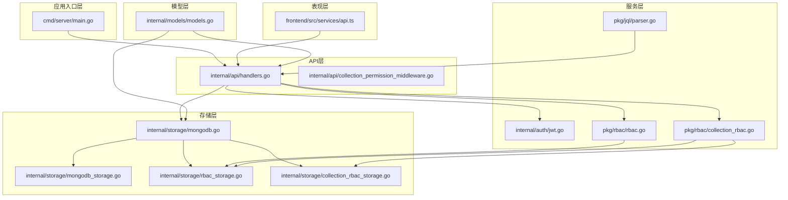
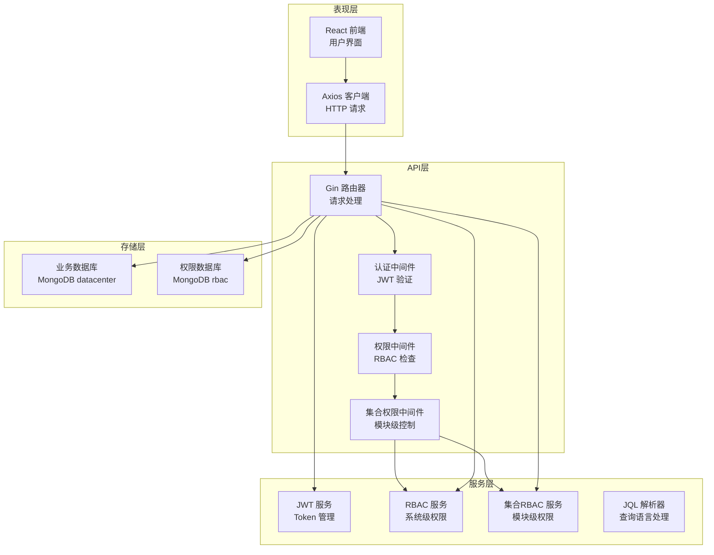
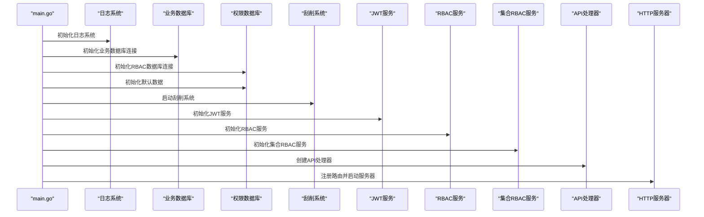
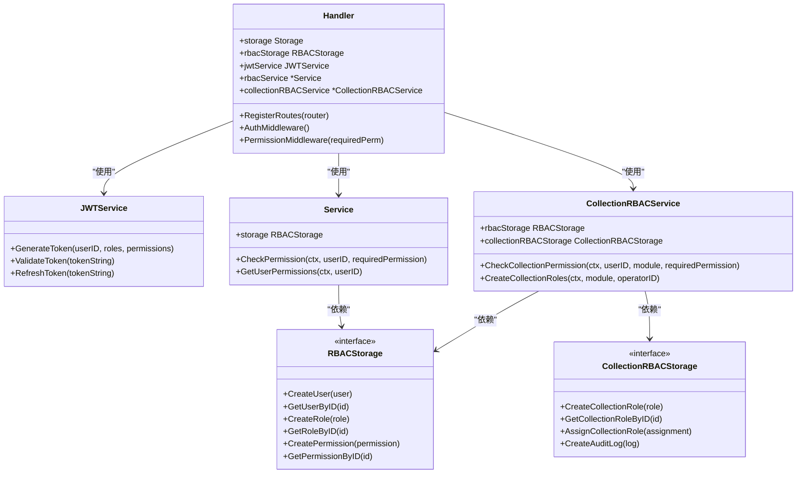
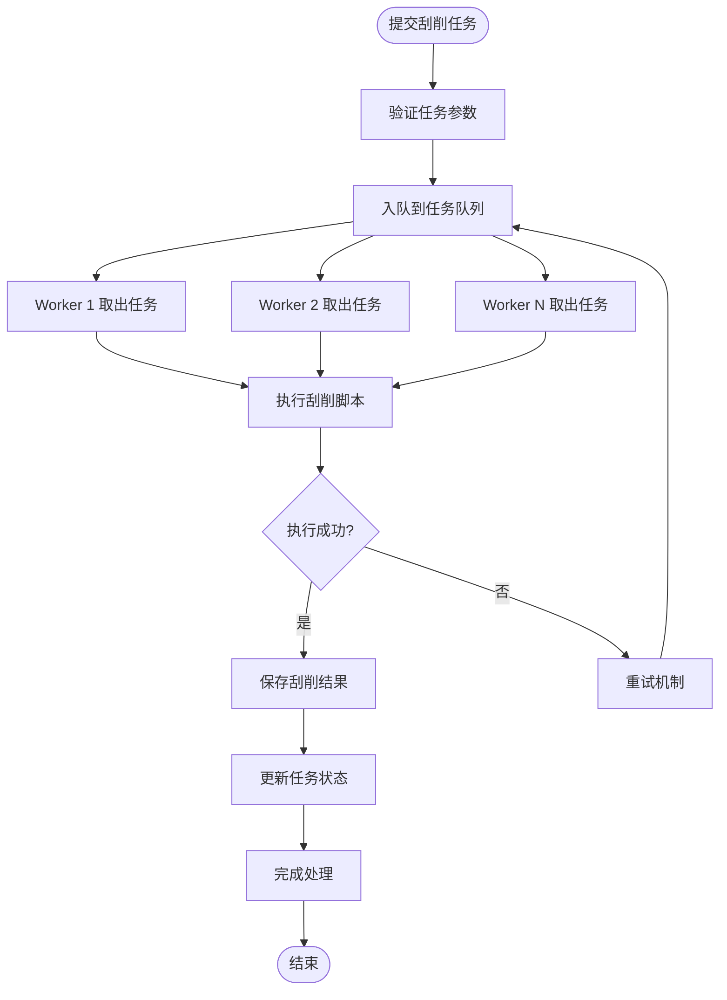
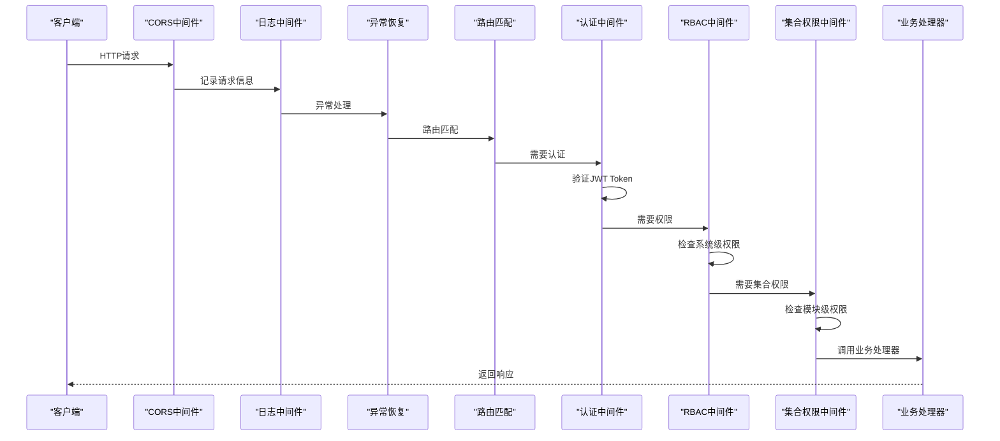
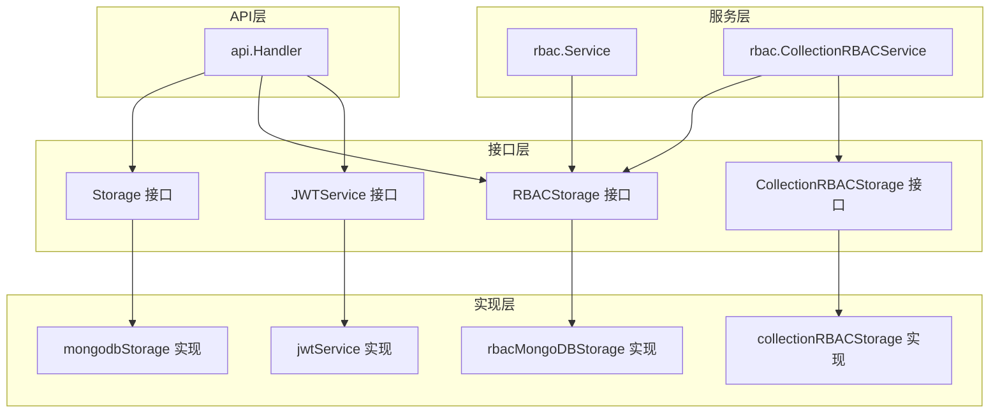
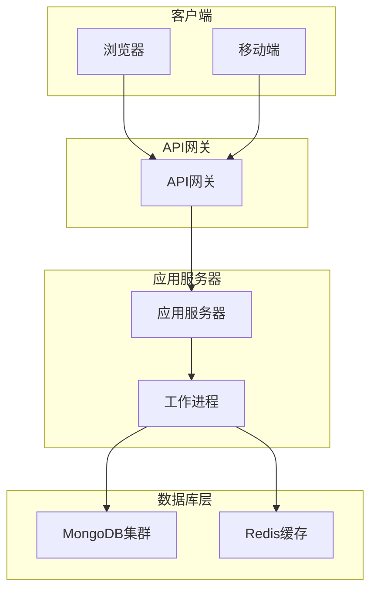

# 分层架构设计

<cite>
**本文档引用的文件**
- [main.go](file://cmd/server/main.go)
- [handlers.go](file://internal/api/handlers.go)
- [mongodb.go](file://internal/storage/mongodb.go)
- [mongodb_storage.go](file://internal/storage/mongodb_storage.go)
- [rbac_storage.go](file://internal/storage/rbac_storage.go)
- [collection_rbac_storage.go](file://internal/storage/collection_rbac_storage.go)
- [rbac.go](file://pkg/rbac/rbac.go)
- [collection_rbac.go](file://pkg/rbac/collection_rbac.go)
- [jwt.go](file://internal/auth/jwt.go)
- [collection_permission_middleware.go](file://internal/api/collection_permission_middleware.go)
- [models.go](file://internal/models/models.go)
- [parser.go](file://pkg/jql/parser.go)
- [api.ts](file://frontend/src/services/api.ts)
- [architecture.md](file://docs/architecture.md)
</cite>

## 目录
1. [简介](#简介)
2. [项目结构](#项目结构)
3. [核心组件](#核心组件)
4. [架构总览](#架构总览)
5. [详细组件分析](#详细组件分析)
6. [依赖关系分析](#依赖关系分析)
7. [性能考虑](#性能考虑)
8. [故障排除指南](#故障排除指南)
9. [结论](#结论)
10. [附录](#附录)

## 简介

数据中心项目采用前后端分离的分层架构设计，后端基于 Go 语言、Gin 框架和 MongoDB 构建，前端基于 React + TypeScript + Ant Design。系统提供企业级数据管理、用户权限控制（双层 RBAC）、异步数据刮削、自定义字段验证、JQL 高级查询和审计日志等核心功能。

该架构的核心设计理念是通过清晰的分层边界实现关注点分离，确保各层职责明确、耦合度低、可维护性强。系统采用显式的依赖注入模式，通过接口抽象实现层间解耦，支持灵活的扩展和重构。

## 项目结构

项目采用标准的 Go 模块化组织方式，按照功能域和层次进行划分：

**图表来源**
- [main.go:1-167](file://cmd/server/main.go#L1-L167)
- [handlers.go:1-800](file://internal/api/handlers.go#L1-L800)
- [mongodb.go:1-91](file://internal/storage/mongodb.go#L1-L91)

**章节来源**
- [architecture.md:74-131](file://docs/architecture.md#L74-L131)

## 核心组件

### 表现层（Presentation Layer）

表现层主要负责用户界面展示和用户交互，采用 React + TypeScript + Ant Design 技术栈构建。前端通过 Axios 客户端与后端 API 进行通信，实现了完整的用户认证、权限管理和数据操作功能。

前端架构特点：
- 使用 React Router 进行客户端路由管理
- 采用 Zustand 进行轻量级状态管理
- 通过 Axios Interceptor 自动注入 JWT Token
- 实现了完整的认证状态管理和错误处理

### API层（API Layer）

API层是系统的对外接口，采用 Gin 框架实现 RESTful API。该层负责请求路由、中间件处理、业务逻辑协调和响应格式化。

API层核心职责：
- 路由注册和请求分发
- 中间件链处理（认证、权限、CORS）
- 业务逻辑协调和数据转换
- 错误处理和响应格式化

### 服务层（Service Layer）

服务层包含多个专门的服务组件，提供领域特定的业务逻辑和数据处理能力：

- **JWT服务**：处理用户认证和Token管理
- **RBAC服务**：实现系统级权限控制
- **集合RBAC服务**：实现模块级权限控制
- **JQL解析器**：处理自定义查询语言
- **刮削服务**：异步数据处理和任务调度

### 存储层（Storage Layer）

存储层采用双数据库设计，物理隔离业务数据和权限数据：

- **业务数据库**：存储业务数据、字段定义、刮削任务等
- **RBAC数据库**：存储用户、角色、权限等权限相关信息
- **集合级RBAC存储**：管理模块级权限和角色分配

**章节来源**
- [architecture.md:39-51](file://docs/architecture.md#L39-L51)
- [architecture.md:132-144](file://docs/architecture.md#L132-L144)

## 架构总览

系统采用经典的四层架构设计，每层都有明确的职责边界和交互规范：

**图表来源**
- [architecture.md:7-37](file://docs/architecture.md#L7-L37)
- [handlers.go:45-181](file://internal/api/handlers.go#L45-L181)

## 详细组件分析

### 应用启动流程

应用采用显式的依赖注入模式，通过 main.go 进行统一的初始化编排：

**图表来源**
- [main.go:24-150](file://cmd/server/main.go#L24-L150)

### 权限控制架构

系统实现了双层RBAC权限控制模型，确保细粒度的权限管理：

**图表来源**
- [handlers.go:23-43](file://internal/api/handlers.go#L23-L43)
- [rbac.go:55-61](file://pkg/rbac/rbac.go#L55-L61)
- [collection_rbac.go:27-37](file://pkg/rbac/collection_rbac.go#L27-L37)

### 数据流处理

系统采用异步处理模式，特别是在数据刮削场景中：

**图表来源**
- [architecture.md:485-520](file://docs/architecture.md#L485-L520)

### 中间件权限控制

系统通过多层中间件实现权限控制，确保请求在进入业务逻辑之前就得到验证：

**图表来源**
- [architecture.md:259-267](file://docs/architecture.md#L259-L267)
- [handlers.go:260-314](file://internal/api/handlers.go#L260-L314)

**章节来源**
- [architecture.md:255-480](file://docs/architecture.md#L255-L480)

## 依赖关系分析

系统采用接口驱动的设计模式，通过接口抽象实现层间解耦：

**图表来源**
- [mongodb.go:14-90](file://internal/storage/mongodb.go#L14-L90)
- [rbac_storage.go:16-50](file://internal/storage/rbac_storage.go#L16-L50)
- [collection_rbac_storage.go:15-33](file://internal/storage/collection_rbac_storage.go#L15-L33)
- [jwt.go:20-41](file://internal/auth/jwt.go#L20-L41)

### 设计原则

系统遵循以下设计原则：

1. **单一职责原则**：每层只负责特定的职责
2. **开闭原则**：对扩展开放，对修改封闭
3. **依赖倒置原则**：高层模块不依赖低层模块
4. **接口隔离原则**：接口应该小而专一

### 边界定义

- **表现层边界**：仅负责UI渲染和用户交互
- **API层边界**：仅负责请求处理和响应格式化
- **服务层边界**：仅负责业务逻辑处理
- **存储层边界**：仅负责数据持久化

**章节来源**
- [architecture.md:146-166](file://docs/architecture.md#L146-L166)

## 性能考虑

系统在设计时充分考虑了性能优化：

### 缓存策略
- MongoDB连接池管理
- 动态集合缓存机制
- JWT Token缓存

### 并发处理
- 刮削系统采用协程池模式
- 异步任务队列处理
- 非阻塞I/O操作

### 数据库优化
- 双数据库物理隔离
- 索引管理机制
- 分页查询优化

## 故障排除指南

### 常见问题诊断

1. **认证失败**
   - 检查JWT密钥配置
   - 验证Token过期时间设置
   - 确认用户密码哈希

2. **权限拒绝**
   - 检查用户角色分配
   - 验证权限代码配置
   - 确认集合权限设置

3. **数据库连接问题**
   - 验证MongoDB连接字符串
   - 检查数据库权限配置
   - 确认网络连通性

### 日志分析

系统提供详细的日志记录，包括：
- HTTP请求日志
- 业务操作日志
- 错误堆栈信息
- 性能监控指标

**章节来源**
- [architecture.md:664-697](file://docs/architecture.md#L664-L697)

## 结论

数据中心项目采用的分层架构设计具有以下优势：

1. **清晰的职责分离**：每层都有明确的职责边界
2. **良好的可维护性**：接口抽象降低了耦合度
3. **灵活的扩展性**：支持新的功能模块快速集成
4. **强大的安全性**：双层RBAC提供细粒度权限控制
5. **优秀的性能表现**：异步处理和缓存机制提升系统效率

该架构设计为系统的长期发展奠定了坚实基础，既满足了当前的功能需求，也为未来的功能扩展和技术演进提供了充足的空间。

## 附录

### 架构图

### 最佳实践

1. **分层重构建议**
   - 保持接口稳定性
   - 渐进式迁移策略
   - 充分的单元测试覆盖

2. **扩展指导**
   - 新功能优先考虑服务层扩展
   - 存储层变更遵循接口抽象
   - 前端组件化开发

3. **维护策略**
   - 定期审查依赖关系
   - 持续优化性能指标
   - 建立完善的监控体系