# 后端架构设计

<cite>
**本文档引用的文件**
- [main.go](file://cmd/server/main.go)
- [handlers.go](file://internal/api/handlers.go)
- [collection_permission_middleware.go](file://internal/api/collection_permission_middleware.go)
- [middleware.go](file://internal/auth/middleware.go)
- [jwt.go](file://internal/auth/jwt.go)
- [middleware.go](file://internal/logger/middleware.go)
- [logger.go](file://internal/logger/logger.go)
- [mongodb.go](file://internal/storage/mongodb.go)
- [mongodb_storage.go](file://internal/storage/mongodb_storage.go)
- [rbac.go](file://pkg/rbac/rbac.go)
- [collection_rbac.go](file://pkg/rbac/collection_rbac.go)
- [models.go](file://internal/models/models.go)
- [config.yaml](file://configs/config.yaml)
- [go.mod](file://go.mod)
- [architecture.md](file://docs/architecture.md)
</cite>

## 更新摘要
**所做更改**
- 基于扩展的架构文档更新了详细的API端点文档
- 新增了完整的中间件链设计和权限控制模式
- 更新了数据模型和数据库架构说明
- 增强了JQL查询语言和刮削系统的技术细节
- 完善了前端架构和部署架构说明

## 目录
1. [引言](#引言)
2. [项目结构](#项目结构)
3. [核心组件](#核心组件)
4. [架构概览](#架构概览)
5. [详细组件分析](#详细组件分析)
6. [依赖分析](#依赖分析)
7. [性能考虑](#性能考虑)
8. [故障排除指南](#故障排除指南)
9. [结论](#结论)

## 引言

数据中心项目是一个基于Gin框架构建的企业级Web服务系统，采用分层架构设计，实现了完整的RBAC权限管理和业务数据管理功能。本项目通过依赖注入模式实现了组件间的松耦合设计，支持动态集合管理和刮削任务调度功能。系统现已扩展为包含认证授权、权限管理、业务数据管理、刮削系统、JQL查询引擎等多个核心模块的完整解决方案。

## 项目结构

项目采用清晰的分层架构组织，主要分为以下层次：

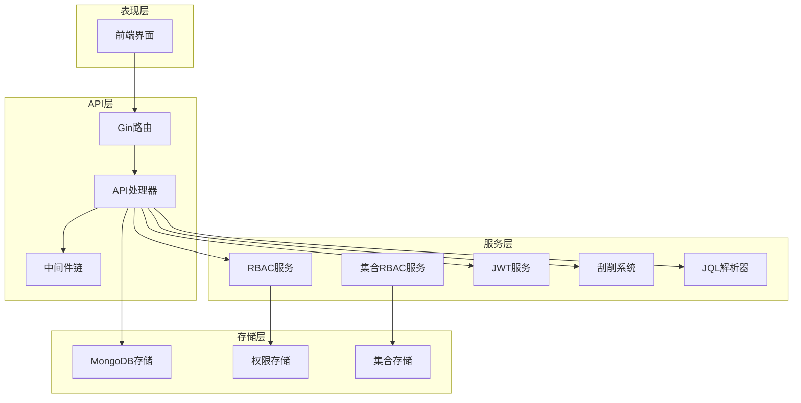

**图表来源**
- [main.go:24-167](file://cmd/server/main.go#L24-L167)
- [handlers.go:23-43](file://internal/api/handlers.go#L23-L43)

**章节来源**
- [main.go:1-167](file://cmd/server/main.go#L1-L167)
- [go.mod:1-50](file://go.mod#L1-L50)

## 核心组件

### 应用启动流程

系统启动采用渐进式初始化策略，确保各组件按依赖顺序正确初始化：

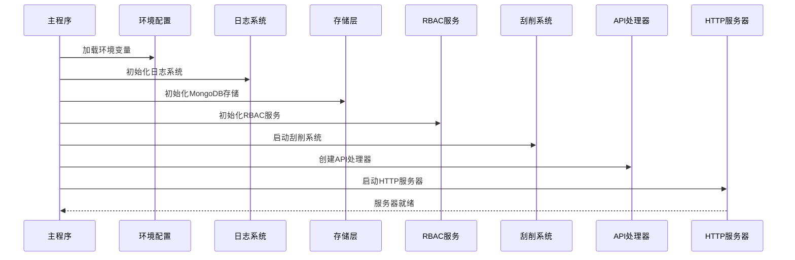

**图表来源**
- [main.go:24-150](file://cmd/server/main.go#L24-L150)

### 依赖注入模式

系统采用构造函数注入的方式实现依赖注入，Handler作为核心协调者负责管理所有依赖：

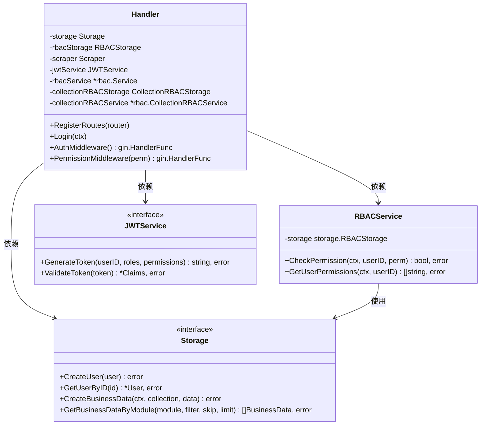

**图表来源**
- [handlers.go:23-43](file://internal/api/handlers.go#L23-L43)
- [mongodb.go:14-90](file://internal/storage/mongodb.go#L14-L90)
- [rbac.go:55-61](file://pkg/rbac/rbac.go#L55-L61)

**章节来源**
- [handlers.go:23-43](file://internal/api/handlers.go#L23-L43)
- [main.go:94-95](file://cmd/server/main.go#L94-L95)

## 架构概览

系统采用经典的四层架构设计，每层都有明确的职责分工：

### 分层架构设计理念

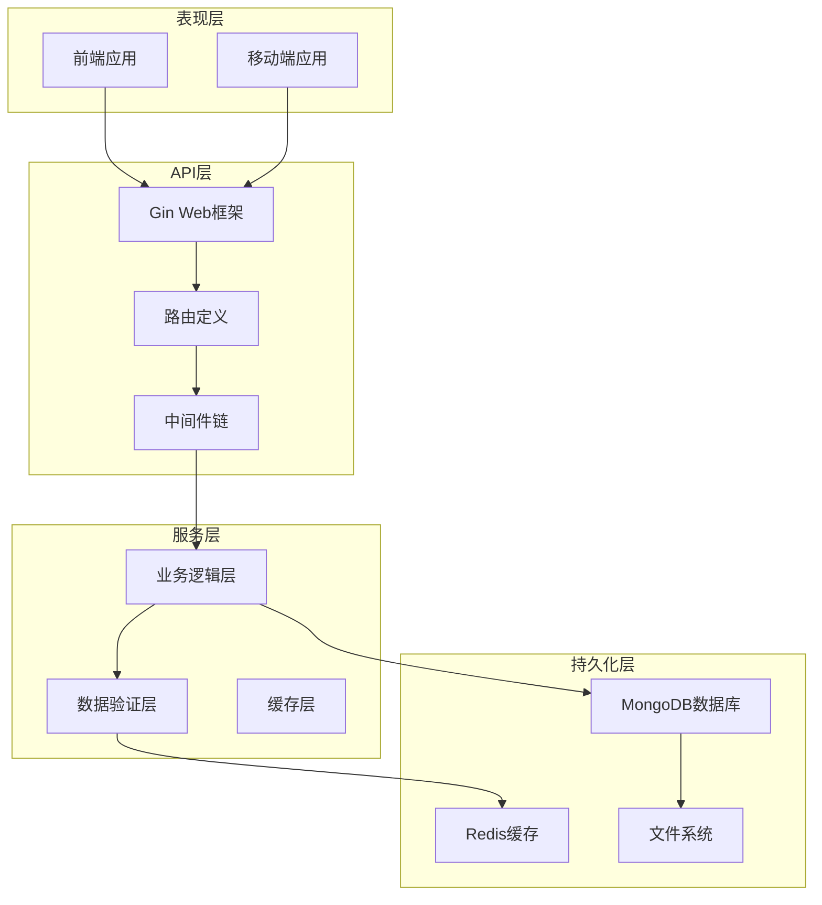

**图表来源**
- [handlers.go:45-181](file://internal/api/handlers.go#L45-L181)
- [main.go:97-118](file://cmd/server/main.go#L97-L118)

### 中间件链设计

系统实现了完整的中间件链，每个中间件都有特定的职责：

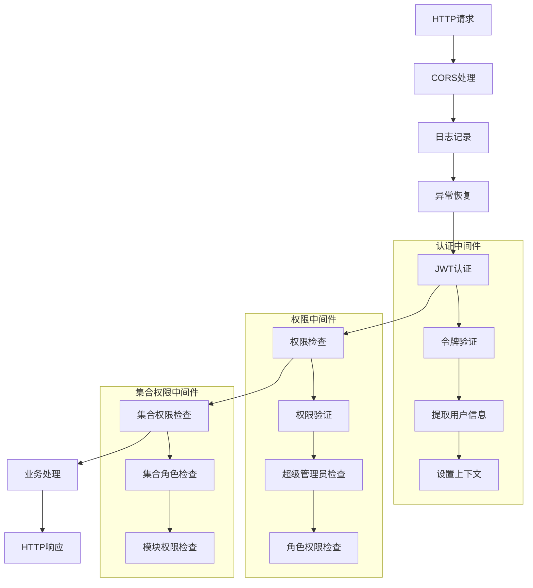

**图表来源**
- [main.go:100-116](file://cmd/server/main.go#L100-L116)
- [middleware.go:11-48](file://internal/auth/middleware.go#L11-L48)
- [middleware.go:26-68](file://internal/logger/middleware.go#L26-L68)

**章节来源**
- [middleware.go:11-48](file://internal/auth/middleware.go#L11-L48)
- [middleware.go:26-68](file://internal/logger/middleware.go#L26-L68)

## 详细组件分析

### API处理器组件

API处理器是系统的业务协调中心，负责路由注册和业务逻辑处理：

#### 路由注册机制

```mermaid
graph LR
subgraph "认证路由"
Login[/api/auth/login]
Register[/api/auth/register]
end
subgraph "受保护路由"
Users[/api/users]
Permissions[/api/permissions]
Roles[/api/roles]
Fields[/api/fields]
Business[/api/business]
Collections[/api/collections]
Scraper[/api/scraper]
Deleted[/api/deleted]
end
subgraph "中间件链"
AuthMW[AuthMiddleware]
PermMW[PermissionMiddleware]
CollPermMW[CollectionPermissionMiddleware]
end
Users --> AuthMW
Users --> PermMW
Fields --> CollPermMW
Business --> CollPermMW
Collections --> PermMW
Scraper --> PermMW
```

**图表来源**
- [handlers.go:45-181](file://internal/api/handlers.go#L45-L181)

#### 认证中间件实现

认证中间件负责JWT令牌验证和用户身份识别：

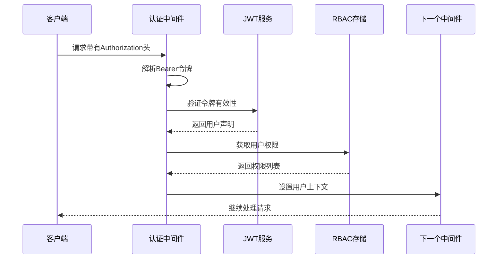

**图表来源**
- [middleware.go:12-48](file://internal/auth/middleware.go#L12-L48)
- [jwt.go:68-83](file://internal/auth/jwt.go#L68-L83)

**章节来源**
- [handlers.go:260-293](file://internal/api/handlers.go#L260-L293)
- [jwt.go:44-83](file://internal/auth/jwt.go#L44-L83)

### RBAC权限管理系统

系统实现了两级权限控制机制：系统级权限和集合级权限。

#### 权限模型设计

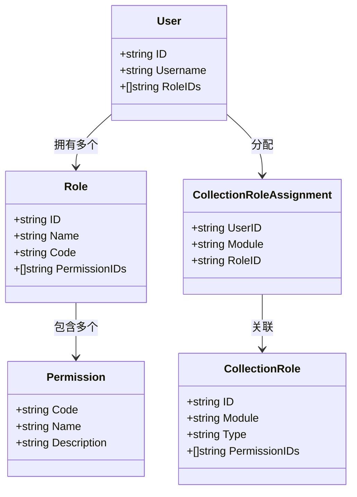

**图表来源**
- [models.go:256-271](file://internal/models/models.go#L256-L271)
- [models.go:328-351](file://internal/models/models.go#L328-L351)

#### 集合RBAC中间件

集合级别的权限控制通过专门的中间件实现：

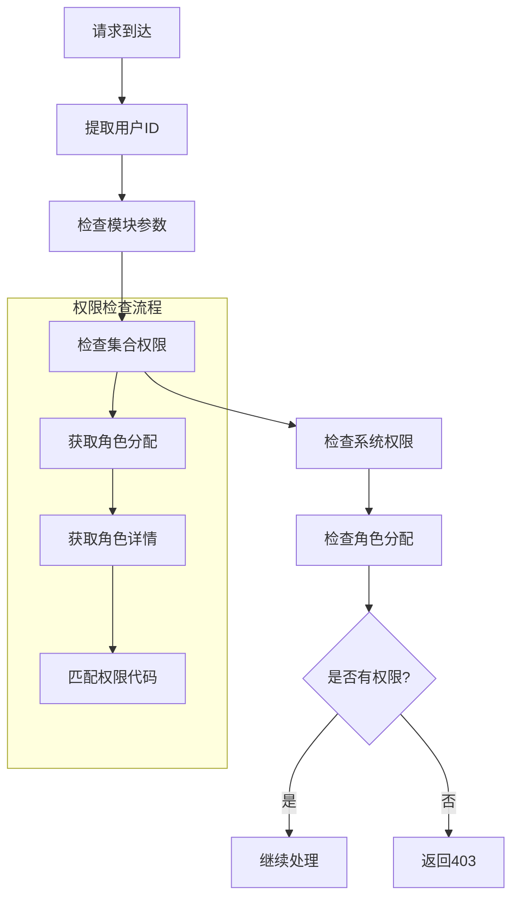

**图表来源**
- [middleware.go:16-48](file://internal/api/collection_permission_middleware.go#L16-L48)
- [collection_rbac.go:39-90](file://pkg/rbac/collection_rbac.go#L39-L90)

**章节来源**
- [middleware.go:16-48](file://internal/api/collection_permission_middleware.go#L16-L48)
- [rbac.go:63-99](file://pkg/rbac/rbac.go#L63-L99)

### 存储层架构

系统采用接口抽象的存储层设计，支持多种数据源和扩展性。

#### 存储接口设计

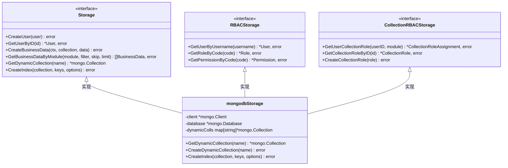

**图表来源**
- [mongodb.go:14-90](file://internal/storage/mongodb.go#L14-L90)
- [mongodb_storage.go:16-51](file://internal/storage/mongodb_storage.go#L16-L51)

**章节来源**
- [mongodb.go:14-90](file://internal/storage/mongodb.go#L14-L90)
- [mongodb_storage.go:27-51](file://internal/storage/mongodb_storage.go#L27-L51)

### 数据模型设计

系统定义了完整的企业级数据模型，支持复杂的业务场景：

#### 核心数据模型

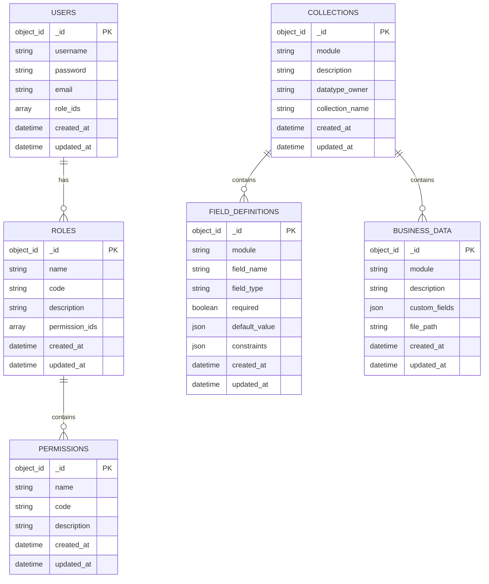

**图表来源**
- [models.go:247-320](file://internal/models/models.go#L247-L320)

**章节来源**
- [models.go:247-320](file://internal/models/models.go#L247-L320)

### JQL查询语言系统

系统实现了强大的JQL查询语言，支持复杂的业务查询需求：

#### JQL语法解析器

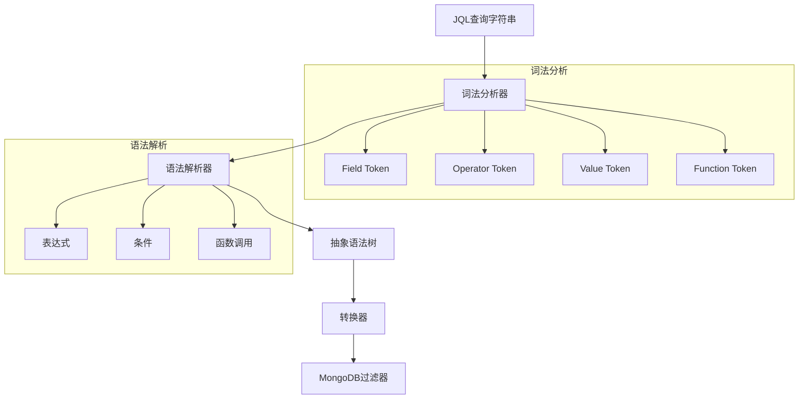

**图表来源**
- [architecture.md:580-652](file://docs/architecture.md#L580-L652)

**章节来源**
- [architecture.md:580-652](file://docs/architecture.md#L580-L652)

### 刮削系统架构

系统实现了高效的异步刮削处理机制：

#### 刮削任务处理流程

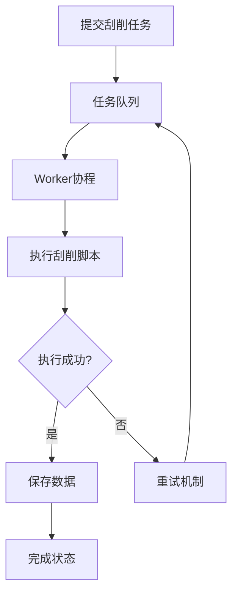

**图表来源**
- [architecture.md:481-578](file://docs/architecture.md#L481-L578)

**章节来源**
- [architecture.md:481-578](file://docs/architecture.md#L481-L578)

## 依赖分析

### 外部依赖关系

系统采用Go Modules管理依赖，主要外部库包括：

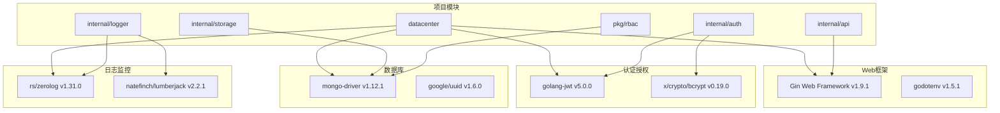

**图表来源**
- [go.mod:5-14](file://go.mod#L5-L14)

### 内部模块依赖

系统内部模块之间遵循清晰的依赖关系，避免循环依赖：

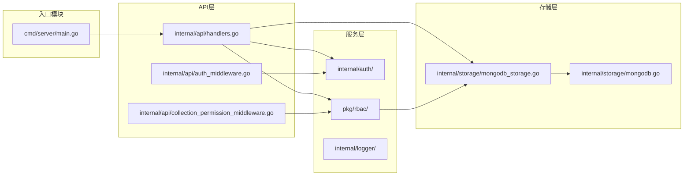

**图表来源**
- [main.go:13-18](file://cmd/server/main.go#L13-L18)
- [handlers.go:11-16](file://internal/api/handlers.go#L11-L16)

**章节来源**
- [go.mod:1-50](file://go.mod#L1-L50)

## 性能考虑

### 缓存策略

系统采用多层缓存策略提升性能：

1. **连接池管理**：MongoDB客户端连接池自动管理
2. **动态集合缓存**：频繁访问的集合名称缓存
3. **权限缓存**：用户权限结果短期缓存

### 并发处理

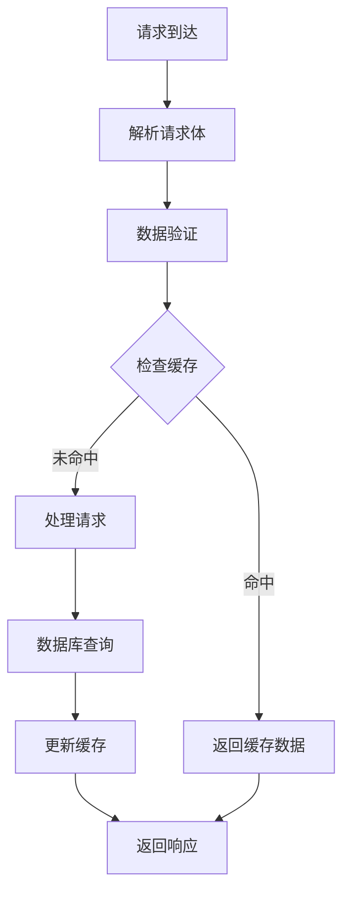

### 错误处理机制

系统实现了完善的错误处理和恢复机制：

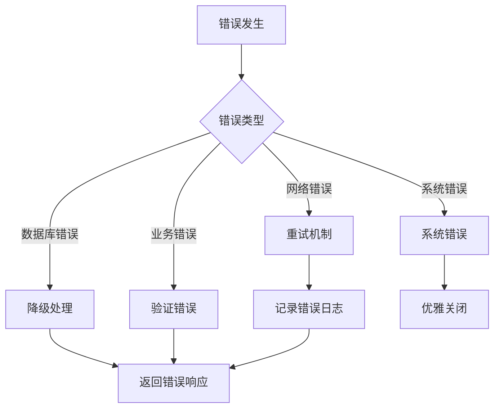

**章节来源**
- [middleware.go:26-68](file://internal/logger/middleware.go#L26-L68)
- [main.go:143-147](file://cmd/server/main.go#L143-L147)

## 故障排除指南

### 常见问题诊断

#### 启动阶段问题

1. **环境变量加载失败**
   - 检查`.env`文件路径和格式
   - 验证必需环境变量是否设置

2. **数据库连接失败**
   - 确认MongoDB服务状态
   - 检查连接字符串格式
   - 验证网络连通性

#### 运行时问题

1. **JWT令牌验证失败**
   - 检查令牌签名密钥
   - 验证令牌过期时间
   - 确认用户权限状态

2. **权限检查失败**
   - 验证用户角色分配
   - 检查权限代码匹配
   - 确认集合角色配置

**章节来源**
- [main.go:26-28](file://cmd/server/main.go#L26-L28)
- [jwt.go:68-83](file://internal/auth/jwt.go#L68-L83)

### 日志分析

系统采用结构化日志记录，便于问题诊断：

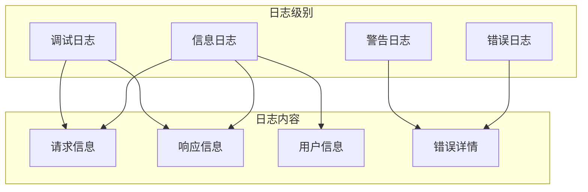

**图表来源**
- [logger.go:14-56](file://internal/logger/logger.go#L14-L56)

**章节来源**
- [logger.go:14-56](file://internal/logger/logger.go#L14-L56)

## 结论

数据中心项目采用现代化的分层架构设计，通过Gin框架实现了高性能的Web服务。系统的核心优势包括：

1. **清晰的架构分层**：表现层、API层、服务层、存储层职责明确
2. **完善的权限体系**：支持系统级和集合级双重权限控制
3. **灵活的依赖注入**：组件间松耦合，易于测试和维护
4. **健壮的错误处理**：多层次的错误处理和恢复机制
5. **可扩展的数据模型**：支持动态集合和复杂业务场景
6. **强大的查询能力**：JQL语言支持复杂的业务查询
7. **高效的异步处理**：刮削系统支持高并发任务处理

该架构设计为后续的功能扩展和性能优化奠定了良好的基础，能够满足企业级应用的高可用性和可维护性要求。通过持续的架构演进和技术优化，系统将继续保持技术领先性和业务适应性。