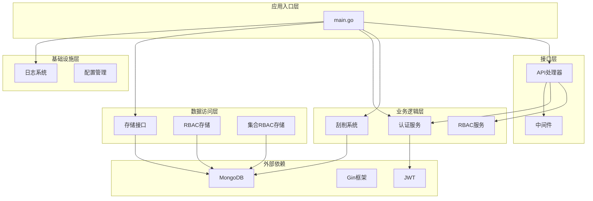
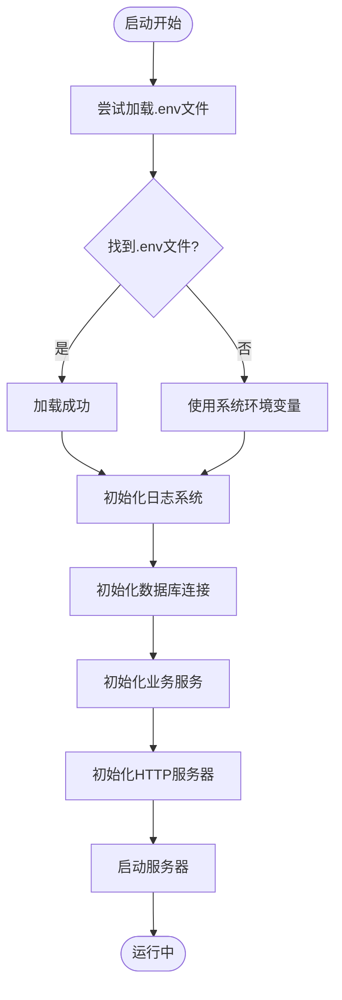
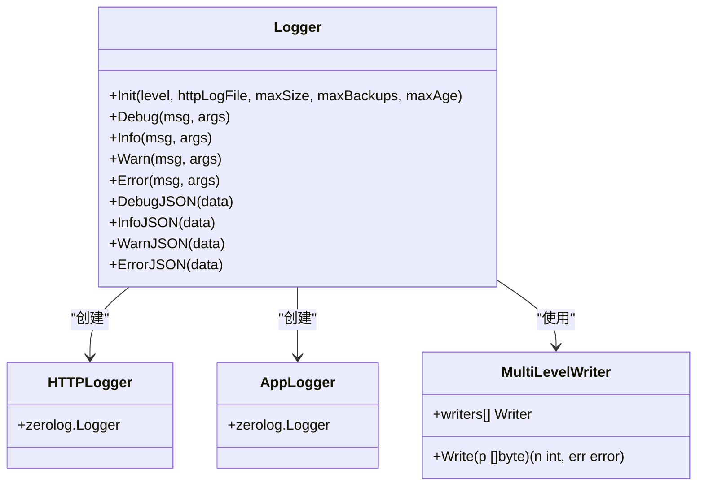
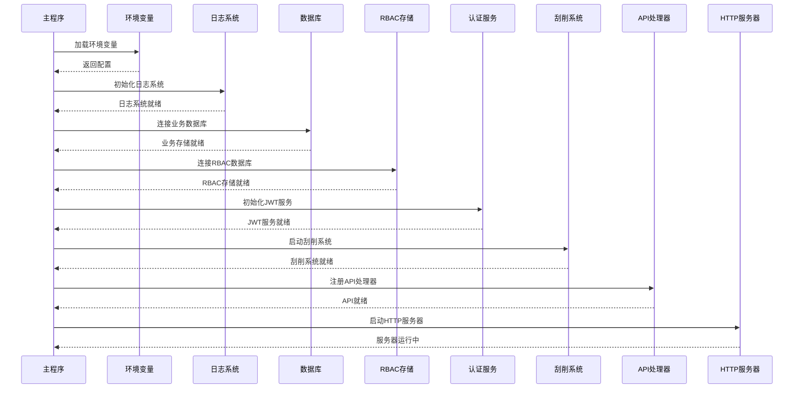
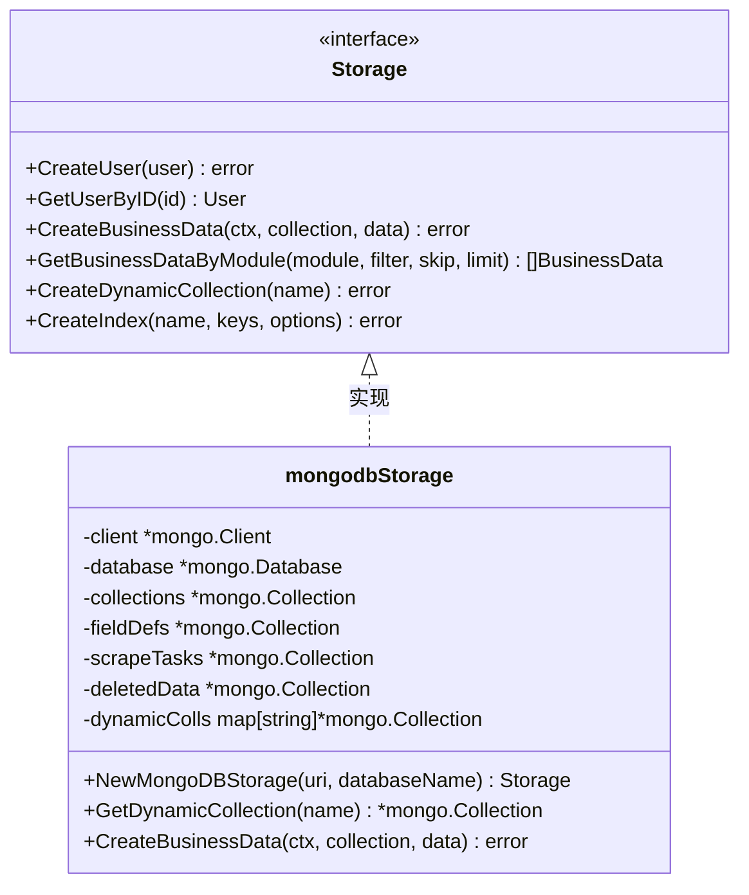
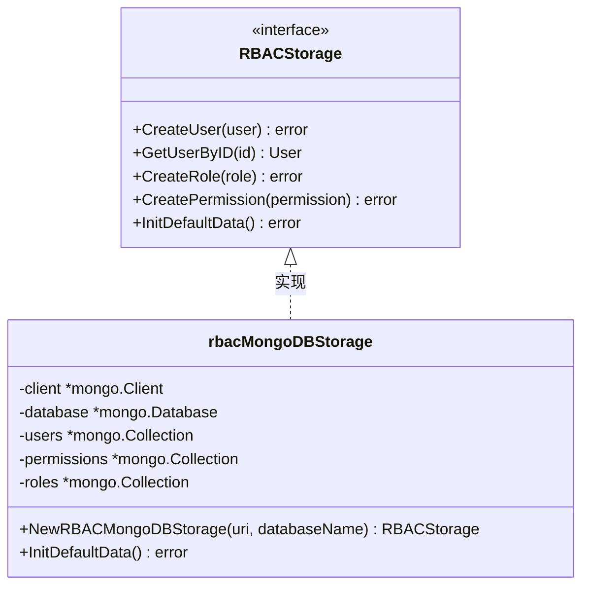
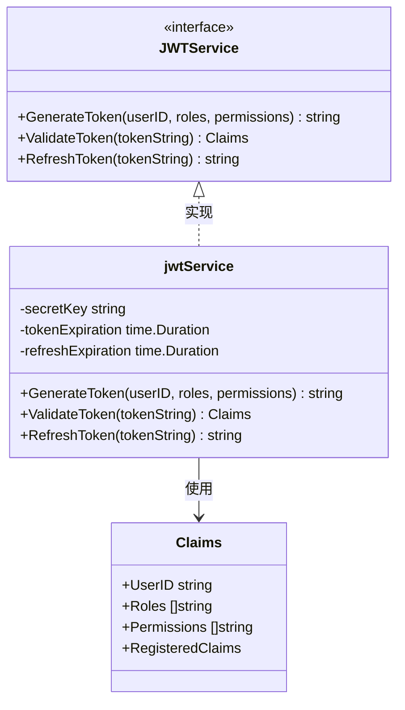
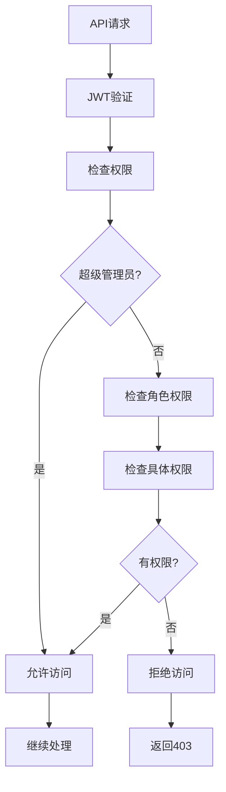
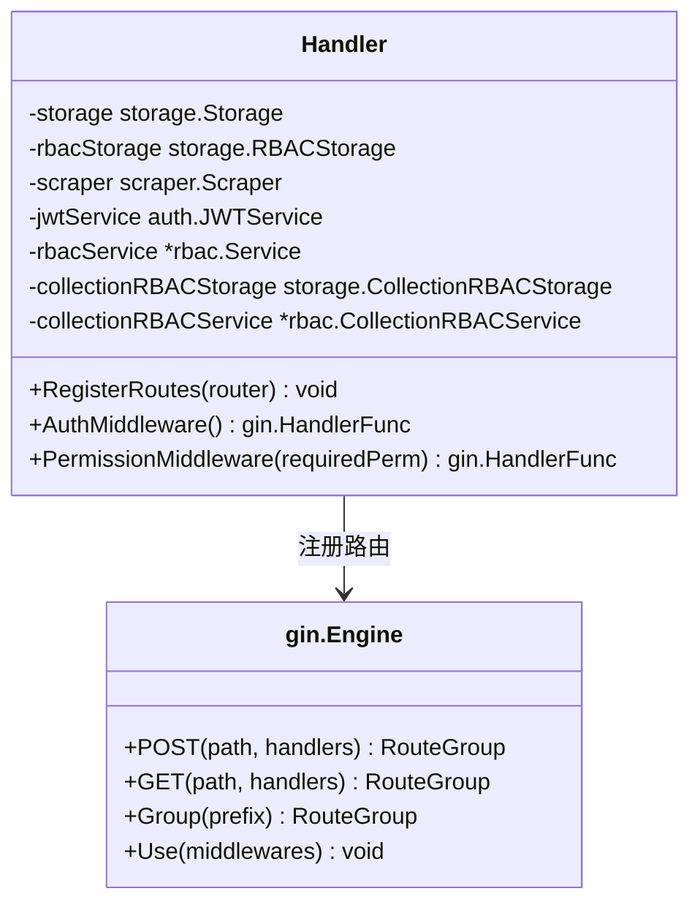
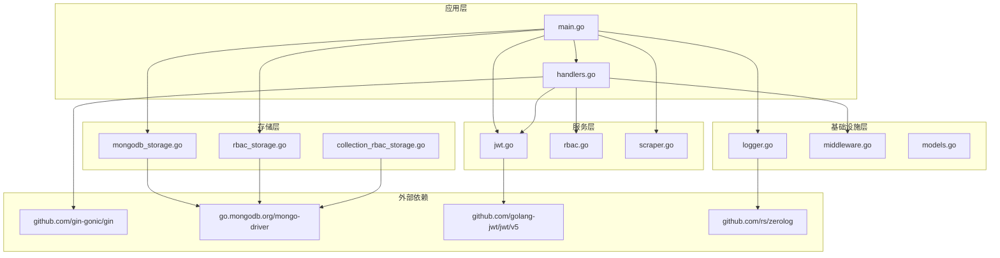

# 应用启动流程

<cite>
**本文档引用的文件**
- [main.go](file://cmd/server/main.go)
- [logger.go](file://internal/logger/logger.go)
- [middleware.go](file://internal/logger/middleware.go)
- [mongodb.go](file://internal/storage/mongodb.go)
- [mongodb_storage.go](file://internal/storage/mongodb_storage.go)
- [rbac_storage.go](file://internal/storage/rbac_storage.go)
- [collection_rbac_storage.go](file://internal/storage/collection_rbac_storage.go)
- [jwt.go](file://internal/auth/jwt.go)
- [rbac.go](file://pkg/rbac/rbac.go)
- [scraper.go](file://internal/scraper/scraper.go)
- [handlers.go](file://internal/api/handlers.go)
- [models.go](file://internal/models/models.go)
- [config.yaml](file://configs/config.yaml)
- [go.mod](file://go.mod)
</cite>

## 目录
1. [简介](#简介)
2. [项目结构](#项目结构)
3. [核心组件](#核心组件)
4. [架构概览](#架构概览)
5. [详细组件分析](#详细组件分析)
6. [依赖关系分析](#依赖关系分析)
7. [性能考虑](#性能考虑)
8. [故障排除指南](#故障排除指南)
9. [结论](#结论)

## 简介

数据中心项目的应用启动流程是一个复杂的多阶段过程，涉及环境变量加载、日志系统初始化、数据库连接建立、服务实例化和服务器启动等多个关键步骤。本文档将详细分析从main函数开始的完整启动序列，解释每个启动阶段的作用和依赖关系，说明错误处理机制和启动失败的回退策略。

## 项目结构

该项目采用分层架构设计，主要包含以下层次：



**图表来源**
- [main.go:24-150](file://cmd/server/main.go#L24-L150)
- [logger.go:14-56](file://internal/logger/logger.go#L14-L56)
- [mongodb_storage.go:27-51](file://internal/storage/mongodb_storage.go#L27-L51)

**章节来源**
- [main.go:1-167](file://cmd/server/main.go#L1-L167)
- [go.mod:1-50](file://go.mod#L1-L50)

## 核心组件

### 环境变量管理系统

应用启动时首先尝试加载.env文件，如果不存在则使用系统环境变量。环境变量通过统一的辅助函数进行管理：



**图表来源**
- [main.go:25-40](file://cmd/server/main.go#L25-L40)

### 日志系统架构

日志系统采用zerolog作为核心，支持多级别日志输出和文件轮转：



**图表来源**
- [logger.go:11-56](file://internal/logger/logger.go#L11-L56)

**章节来源**
- [logger.go:1-89](file://internal/logger/logger.go#L1-L89)
- [middleware.go:25-68](file://internal/logger/middleware.go#L25-L68)

## 架构概览

应用启动流程遵循严格的顺序依赖关系，确保每个组件在需要时都已正确初始化：



**图表来源**
- [main.go:24-150](file://cmd/server/main.go#L24-L150)

## 详细组件分析

### 数据库连接管理

应用建立了两个独立的MongoDB连接：一个用于业务数据存储，另一个专门用于RBAC权限控制。

#### 业务数据库连接



**图表来源**
- [mongodb.go:14-90](file://internal/storage/mongodb.go#L14-L90)
- [mongodb_storage.go:16-51](file://internal/storage/mongodb_storage.go#L16-L51)

#### RBAC数据库连接

RBAC存储负责权限管理和用户角色控制：



**图表来源**
- [rbac_storage.go:16-79](file://internal/storage/rbac_storage.go#L16-L79)

**章节来源**
- [mongodb_storage.go:27-51](file://internal/storage/mongodb_storage.go#L27-L51)
- [rbac_storage.go:60-79](file://internal/storage/rbac_storage.go#L60-L79)

### 认证与授权系统

JWT服务提供用户身份验证和令牌管理功能：



**图表来源**
- [jwt.go:20-41](file://internal/auth/jwt.go#L20-L41)
- [jwt.go:12-18](file://internal/auth/jwt.go#L12-L18)

RBAC服务实现基于角色的访问控制：



**图表来源**
- [rbac.go:63-99](file://pkg/rbac/rbac.go#L63-L99)

**章节来源**
- [jwt.go:1-126](file://internal/auth/jwt.go#L1-L126)
- [rbac.go:55-171](file://pkg/rbac/rbac.go#L55-L171)

### 刮削系统

刮削系统采用并发工作池模式，支持多任务并行处理：

```mermaid
classDiagram
class Scraper {
<<interface>>
+SubmitTask(task) error
+Start() error
+Stop() error
}
class scraper {
-storage storage.Storage
-taskQueue chan *models.ScrapeTask
-workerPool int
-stopChan chan struct{}
+Start() error
+Stop() error
+SubmitTask(task) error
-worker(id) void
-processTask(task, workerID) void
-executeScraper(scraperPath, dataPath) map[string]interface{}
-saveScrapedData(task, data) primitive.ObjectID
}
Scraper <|.. scraper : 实现
scraper --> storage.Storage : 依赖
```

**图表来源**
- [scraper.go:18-45](file://internal/scraper/scraper.go#L18-L45)

**章节来源**
- [scraper.go:1-289](file://internal/scraper/scraper.go#L1-L289)

### API处理器

API处理器负责路由注册和中间件配置：



**图表来源**
- [handlers.go:23-43](file://internal/api/handlers.go#L23-L43)

**章节来源**
- [handlers.go:45-181](file://internal/api/handlers.go#L45-L181)

## 依赖关系分析

应用的依赖关系遵循清晰的分层原则，避免循环依赖：



**图表来源**
- [go.mod:5-14](file://go.mod#L5-L14)

**章节来源**
- [go.mod:1-50](file://go.mod#L1-L50)

## 性能考虑

### 并发处理优化

1. **刮削系统并发**: 默认4个工作协程，可根据CPU核心数调整
2. **任务队列缓冲**: 1000个任务的缓冲区，避免内存溢出
3. **数据库连接池**: MongoDB驱动自动管理连接池

### 内存管理

1. **日志轮转**: 自动文件轮转，限制最大文件大小和保留数量
2. **中间件响应体捕获**: 只在必要时捕获响应体，避免内存浪费
3. **上下文超时**: 5秒优雅关闭超时，防止长时间阻塞

### 错误处理策略

1. **早期失败**: 数据库连接失败立即终止启动
2. **降级处理**: 日志系统异常不影响核心功能
3. **优雅关闭**: 支持SIGINT和SIGTERM信号

## 故障排除指南

### 常见启动问题

#### 1. 环境变量加载失败

**症状**: 应用启动后立即崩溃
**原因**: .env文件不存在或格式错误
**解决方案**: 
- 确认.env文件路径正确
- 检查环境变量格式
- 验证系统环境变量设置

#### 2. 数据库连接失败

**症状**: 应用在第3-4步停止
**原因**: MongoDB服务不可达或认证失败
**解决方案**:
- 检查MongoDB服务状态
- 验证连接字符串格式
- 确认网络连通性

#### 3. JWT密钥配置错误

**症状**: 登录接口返回认证错误
**原因**: JWT_SECRET配置不正确
**解决方案**:
- 设置安全的随机密钥
- 确保密钥长度足够
- 避免使用默认密钥

#### 4. 刮削系统启动失败

**症状**: 刮削任务无法执行
**原因**: Python环境或脚本路径问题
**解决方案**:
- 确认Python可执行文件路径
- 检查刮削器脚本权限
- 验证数据文件路径

### 调试技巧

1. **启用详细日志**: 设置LOG_LEVEL=debug查看详细信息
2. **检查端口占用**: 使用netstat -ano | findstr :端口号
3. **验证配置文件**: 使用yaml验证工具检查config.yaml格式
4. **监控数据库连接**: 使用MongoDB客户端验证连接

### 启动参数配置

| 参数名 | 默认值 | 作用 | 必需 |
|--------|--------|------|------|
| LOG_LEVEL | info | 日志级别 | 否 |
| LOG_HTTP_FILE | logs/http.log | HTTP日志文件 | 否 |
| LOG_MAX_SIZE | 100 | 日志文件大小(MB) | 否 |
| LOG_MAX_BACKUPS | 5 | 保留的日志文件数 | 否 |
| LOG_MAX_AGE | 30 | 日志保留天数 | 否 |
| MONGODB_URI | mongodb://localhost:27017 | 业务数据库连接串 | 是 |
| MONGODB_DATABASE | datacenter | 业务数据库名称 | 是 |
| MONGODB_RBAC_URI | mongodb://localhost:27017 | RBAC数据库连接串 | 是 |
| MONGODB_RBAC_DATABASE | rbac | RBAC数据库名称 | 是 |
| SERVER_HOST | 0.0.0.0 | 服务器监听地址 | 否 |
| SERVER_PORT | 8080 | 服务器端口 | 否 |
| JWT_SECRET | your-secret-key | JWT密钥 | 是 |
| JWT_EXPIRATION | 24 | 访问令牌过期小时数 | 否 |
| JWT_REFRESH_EXPIRATION | 720 | 刷新令牌过期小时数 | 否 |
| SCRAPER_WORKERS | 4 | 刮削工作协程数 | 否 |

**章节来源**
- [main.go:152-167](file://cmd/server/main.go#L152-L167)
- [config.yaml:1-26](file://configs/config.yaml#L1-L26)

## 结论

数据中心项目的应用启动流程设计严谨，遵循了微服务架构的最佳实践。通过分层架构、明确的依赖关系和完善的错误处理机制，确保了系统的稳定性和可维护性。

关键优势包括：
1. **模块化设计**: 各组件职责明确，便于测试和维护
2. **配置灵活**: 支持多种配置方式，适应不同部署环境
3. **错误处理**: 完善的错误处理和回退策略
4. **性能优化**: 并发处理和资源管理优化

建议的后续改进方向：
1. 添加健康检查端点
2. 实现配置热重载
3. 增加监控指标收集
4. 完善日志聚合和分析