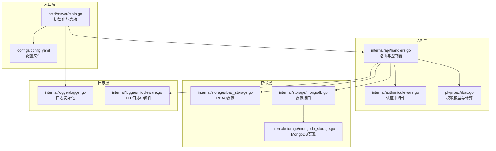
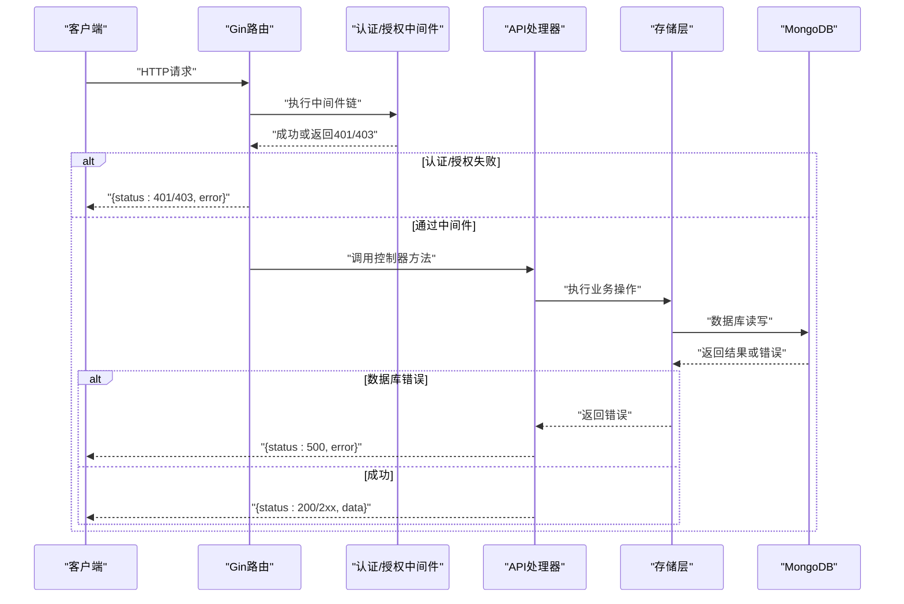
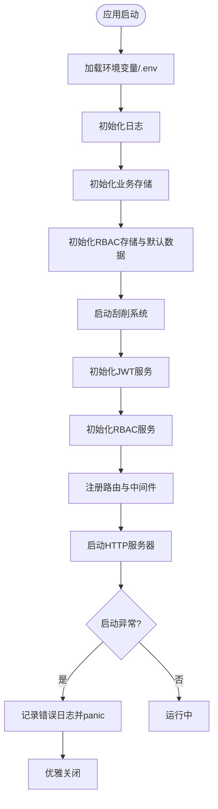
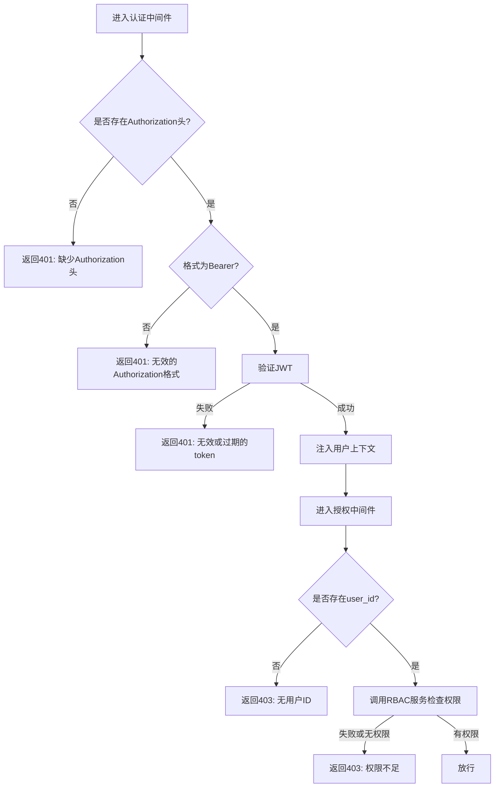
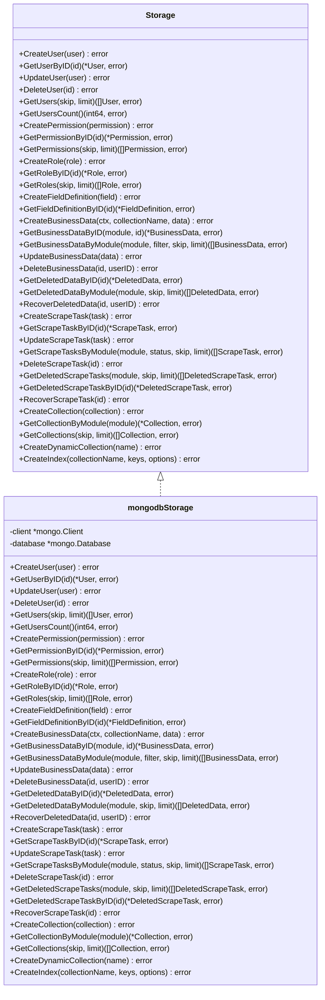
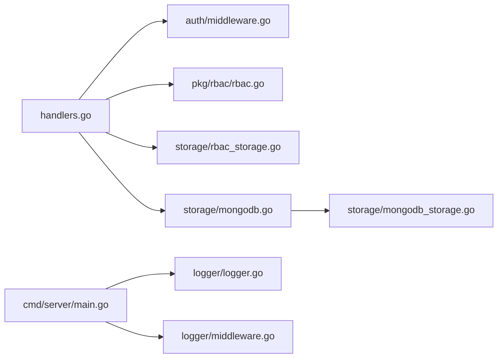

# 错误处理机制

<cite>
**本文档引用的文件**
- [cmd/server/main.go](file://cmd/server/main.go)
- [internal/logger/logger.go](file://internal/logger/logger.go)
- [internal/logger/middleware.go](file://internal/logger/middleware.go)
- [internal/api/handlers.go](file://internal/api/handlers.go)
- [internal/storage/mongodb.go](file://internal/storage/mongodb.go)
- [internal/storage/mongodb_storage.go](file://internal/storage/mongodb_storage.go)
- [internal/storage/rbac_storage.go](file://internal/storage/rbac_storage.go)
- [internal/auth/middleware.go](file://internal/auth/middleware.go)
- [internal/auth/jwt.go](file://internal/auth/jwt.go)
- [pkg/rbac/rbac.go](file://pkg/rbac/rbac.go)
- [configs/config.yaml](file://configs/config.yaml)
</cite>

## 目录
1. [简介](#简介)
2. [项目结构](#项目结构)
3. [核心组件](#核心组件)
4. [架构总览](#架构总览)
5. [详细组件分析](#详细组件分析)
6. [依赖分析](#依赖分析)
7. [性能考虑](#性能考虑)
8. [故障排查指南](#故障排查指南)
9. [结论](#结论)
10. [附录](#附录)

## 简介
本文件面向数据中心项目的错误处理机制，系统化阐述从底层数据库错误到API响应的全链路错误处理策略。内容涵盖全局错误处理（panic捕获、错误日志记录、HTTP错误响应格式）、分层错误处理方式（认证、授权、存储、业务）、错误分类与错误码设计原则、错误监控与告警配置建议，以及常见错误场景的处理方案与流程图。

## 项目结构
数据中心采用分层架构：入口层负责初始化与路由注册；API层负责路由与中间件；业务层封装RBAC与业务逻辑；存储层对接MongoDB；日志层统一输出与归档。错误处理贯穿各层，通过Gin中间件、自定义日志、panic捕获与HTTP状态码返回形成闭环。

**图表来源**
- [cmd/server/main.go:24-150](file://cmd/server/main.go#L24-L150)
- [internal/api/handlers.go:45-181](file://internal/api/handlers.go#L45-L181)
- [internal/logger/logger.go:14-56](file://internal/logger/logger.go#L14-L56)
- [internal/logger/middleware.go:25-68](file://internal/logger/middleware.go#L25-L68)
- [internal/storage/mongodb.go:14-91](file://internal/storage/mongodb.go#L14-L91)
- [internal/storage/mongodb_storage.go:27-51](file://internal/storage/mongodb_storage.go#L27-L51)
- [internal/storage/rbac_storage.go:60-79](file://internal/storage/rbac_storage.go#L60-L79)
- [pkg/rbac/rbac.go:55-99](file://pkg/rbac/rbac.go#L55-L99)

**章节来源**
- [cmd/server/main.go:24-150](file://cmd/server/main.go#L24-L150)
- [configs/config.yaml:1-26](file://configs/config.yaml#L1-L26)

## 核心组件
- 全局panic捕获与优雅退出：入口程序在关键初始化阶段使用panic快速暴露致命错误，并通过HTTP服务器优雅关闭避免资源泄漏。
- HTTP错误响应格式：统一返回JSON结构，包含错误描述字段，便于前端与监控系统解析。
- 分层错误处理：
  - 认证层：校验Authorization头与Bearer格式，验证JWT并注入用户上下文。
  - 授权层：基于RBAC模型计算权限，支持通配符匹配与超级管理员豁免。
  - 存储层：MongoDB操作返回原始错误，上层统一映射为HTTP状态码。
  - 日志层：HTTP请求日志按状态码分级记录，支持响应体捕获与多写入器。

**章节来源**
- [cmd/server/main.go:115-117](file://cmd/server/main.go#L115-L117)
- [internal/api/handlers.go:183-221](file://internal/api/handlers.go#L183-L221)
- [internal/auth/middleware.go:12-49](file://internal/auth/middleware.go#L12-L49)
- [pkg/rbac/rbac.go:63-99](file://pkg/rbac/rbac.go#L63-L99)
- [internal/storage/mongodb_storage.go:84-131](file://internal/storage/mongodb_storage.go#L84-L131)
- [internal/logger/middleware.go:25-68](file://internal/logger/middleware.go#L25-L68)

## 架构总览
下图展示从客户端请求到数据库访问再到HTTP响应的完整错误处理路径，突出各层的错误捕获与转换策略。

**图表来源**
- [internal/api/handlers.go:260-314](file://internal/api/handlers.go#L260-L314)
- [internal/auth/middleware.go:12-49](file://internal/auth/middleware.go#L12-L49)
- [internal/storage/mongodb_storage.go:84-131](file://internal/storage/mongodb_storage.go#L84-L131)

## 详细组件分析

### 全局错误处理与panic捕获
- 初始化阶段的致命错误通过panic抛出，确保系统在启动即刻暴露问题，避免静默失败。
- HTTP服务器启动失败同样触发panic，随后由入口程序捕获并记录错误日志。
- 服务器优雅关闭时，若Shutdown超时则记录错误，保证进程退出可控。

**图表来源**
- [cmd/server/main.go:24-150](file://cmd/server/main.go#L24-L150)

**章节来源**
- [cmd/server/main.go:26-28](file://cmd/server/main.go#L26-L28)
- [cmd/server/main.go:46-48](file://cmd/server/main.go#L46-L48)
- [cmd/server/main.go:55-57](file://cmd/server/main.go#L55-L57)
- [cmd/server/main.go:60-62](file://cmd/server/main.go#L60-L62)
- [cmd/server/main.go:66-68](file://cmd/server/main.go#L66-L68)
- [cmd/server/main.go:131-134](file://cmd/server/main.go#L131-L134)

### HTTP错误响应格式与状态码策略
- 统一响应结构：错误时返回包含错误描述的JSON对象，成功时返回包含数据的JSON对象。
- 状态码映射：
  - 400：请求参数绑定失败、请求体解析失败等输入错误。
  - 401：缺少或无效的Authorization头、无效或过期的JWT。
  - 403：权限不足、未通过RBAC校验。
  - 404：资源不存在（如用户、权限、角色、数据）。
  - 500：内部错误（数据库操作失败、服务生成令牌失败等）。
- 示例响应结构（不展示具体代码，仅说明结构）：
  - 错误响应：{"error": "错误描述"}
  - 成功响应：根据业务返回具体数据对象或列表

**章节来源**
- [internal/api/handlers.go:189-191](file://internal/api/handlers.go#L189-L191)
- [internal/api/handlers.go:195-198](file://internal/api/handlers.go#L195-L198)
- [internal/api/handlers.go:200-202](file://internal/api/handlers.go#L200-L202)
- [internal/api/handlers.go:207-209](file://internal/api/handlers.go#L207-L209)
- [internal/api/handlers.go:230-232](file://internal/api/handlers.go#L230-L232)
- [internal/api/handlers.go:236-238](file://internal/api/handlers.go#L236-L238)
- [internal/api/handlers.go:248-250](file://internal/api/handlers.go#L248-L250)

### 认证与授权错误处理
- 认证中间件：
  - 必须提供Authorization头且格式为Bearer。
  - 验证JWT有效性，失败时返回401并记录错误日志。
  - 成功后将用户ID、角色与权限注入上下文。
- 授权中间件：
  - 从上下文获取用户ID，缺失则返回403。
  - 调用RBAC服务检查权限，支持通配符匹配与超级管理员豁免。
  - 任意错误或无权限均返回403。

**图表来源**
- [internal/auth/middleware.go:12-49](file://internal/auth/middleware.go#L12-L49)
- [internal/api/handlers.go:260-314](file://internal/api/handlers.go#L260-L314)
- [pkg/rbac/rbac.go:63-99](file://pkg/rbac/rbac.go#L63-L99)

**章节来源**
- [internal/auth/middleware.go:12-49](file://internal/auth/middleware.go#L12-L49)
- [internal/api/handlers.go:260-314](file://internal/api/handlers.go#L260-L314)
- [pkg/rbac/rbac.go:63-99](file://pkg/rbac/rbac.go#L63-L99)

### 存储层错误处理（MongoDB）
- 存储接口定义了完整的CRUD与聚合方法，所有数据库操作返回error，供上层统一处理。
- MongoDB实现中，插入、更新、删除、查询等操作直接返回底层驱动错误。
- 上层控制器在调用存储方法后，若err非空，统一返回500与错误描述。

**图表来源**
- [internal/storage/mongodb.go:14-91](file://internal/storage/mongodb.go#L14-L91)
- [internal/storage/mongodb_storage.go:16-81](file://internal/storage/mongodb_storage.go#L16-L81)

**章节来源**
- [internal/storage/mongodb.go:14-91](file://internal/storage/mongodb.go#L14-L91)
- [internal/storage/mongodb_storage.go:84-131](file://internal/storage/mongodb_storage.go#L84-L131)
- [internal/storage/mongodb_storage.go:338-493](file://internal/storage/mongodb_storage.go#L338-L493)

### RBAC服务与权限中间件
- 权限模型：
  - 权限常量采用“领域:动作”命名，支持“领域:*”通配符。
  - 超级管理员角色拥有全部权限，可豁免其他规则。
- 权限计算：
  - 通过用户角色集合并去重得到最终权限集合。
  - 匹配算法支持精确匹配与前缀通配符。
- 中间件：
  - 在路由注册时附加权限中间件，按HTTP方法与路径推导所需权限。
  - 任何错误或无权限均返回403。

**章节来源**
- [pkg/rbac/rbac.go:12-53](file://pkg/rbac/rbac.go#L12-L53)
- [pkg/rbac/rbac.go:63-99](file://pkg/rbac/rbac.go#L63-L99)
- [pkg/rbac/rbac.go:101-114](file://pkg/rbac/rbac.go#L101-L114)
- [pkg/rbac/rbac.go:116-145](file://pkg/rbac/rbac.go#L116-L145)
- [pkg/rbac/rbac.go:173-249](file://pkg/rbac/rbac.go#L173-L249)

### 日志与HTTP审计
- 日志初始化：
  - 支持控制台与文件多写入器，HTTP日志与应用日志分离。
  - 可配置日志级别与滚动参数（最大大小、备份数、保留天数）。
- HTTP中间件：
  - 捕获响应体，记录请求方法、路径、查询参数、状态码、耗时、客户端IP、UA等。
  - 按状态码分级：>=500为Error，>=400为Warn，否则Info。

**章节来源**
- [internal/logger/logger.go:14-56](file://internal/logger/logger.go#L14-L56)
- [internal/logger/middleware.go:25-68](file://internal/logger/middleware.go#L25-L68)
- [configs/config.yaml:12-19](file://configs/config.yaml#L12-L19)

## 依赖分析
- 组件耦合与内聚：
  - API处理器依赖存储接口与RBAC服务，保持良好的抽象与可替换性。
  - 认证中间件与JWT服务解耦，便于独立测试与演进。
  - 日志中间件与HTTP层解耦，便于扩展其他审计需求。
- 外部依赖：
  - Gin：Web框架与中间件生态。
  - MongoDB Driver：数据库访问与错误传播。
  - Zerolog：高性能结构化日志。
  - go-dotenv：环境变量加载。

**图表来源**
- [internal/api/handlers.go:33-43](file://internal/api/handlers.go#L33-L43)
- [internal/auth/middleware.go:12-49](file://internal/auth/middleware.go#L12-L49)
- [pkg/rbac/rbac.go:55-99](file://pkg/rbac/rbac.go#L55-L99)
- [internal/storage/rbac_storage.go:16-50](file://internal/storage/rbac_storage.go#L16-L50)
- [internal/storage/mongodb.go:14-91](file://internal/storage/mongodb.go#L14-L91)
- [internal/storage/mongodb_storage.go:16-25](file://internal/storage/mongodb_storage.go#L16-L25)
- [cmd/server/main.go:32-38](file://cmd/server/main.go#L32-L38)
- [internal/logger/middleware.go:25-68](file://internal/logger/middleware.go#L25-L68)

**章节来源**
- [internal/api/handlers.go:33-43](file://internal/api/handlers.go#L33-L43)
- [internal/storage/mongodb.go:14-91](file://internal/storage/mongodb.go#L14-L91)
- [internal/storage/rbac_storage.go:16-50](file://internal/storage/rbac_storage.go#L16-L50)
- [internal/logger/logger.go:14-56](file://internal/logger/logger.go#L14-L56)

## 性能考虑
- 中间件链路短、职责单一，避免在日志与鉴权中引入不必要的I/O。
- HTTP日志中间件仅在必要时捕获响应体，避免大体积响应带来内存压力。
- MongoDB操作尽量使用索引与合适的查询条件，减少扫描成本。
- 通过配置文件调整日志滚动参数，平衡磁盘占用与检索效率。

## 故障排查指南
- 启动阶段错误
  - 症状：应用启动即崩溃或无法监听端口。
  - 排查：查看入口日志与panic堆栈，确认.env加载、数据库连接、默认数据初始化是否成功。
  - 处理：修正环境变量与连接串，确保数据库可达并具备相应权限。
- 认证/授权失败
  - 症状：401/403频繁出现。
  - 排查：检查Authorization头格式、JWT签名密钥与有效期、用户角色与权限分配。
  - 处理：修复前端Token发送方式，更新JWT配置，重新分配角色与权限。
- 数据库访问异常
  - 症状：500错误，响应体含数据库错误描述。
  - 排查：查看存储层日志与MongoDB日志，确认集合存在性、索引状态、写入权限。
  - 处理：创建缺失集合与索引，修正权限，重试操作。
- HTTP审计与监控
  - 建议：结合HTTP日志中间件输出与外部APM/日志平台，设置状态码阈值告警与慢请求告警。

**章节来源**
- [cmd/server/main.go:26-28](file://cmd/server/main.go#L26-L28)
- [cmd/server/main.go:46-48](file://cmd/server/main.go#L46-L48)
- [cmd/server/main.go:55-57](file://cmd/server/main.go#L55-L57)
- [cmd/server/main.go:60-62](file://cmd/server/main.go#L60-L62)
- [cmd/server/main.go:131-134](file://cmd/server/main.go#L131-L134)
- [internal/logger/middleware.go:25-68](file://internal/logger/middleware.go#L25-L68)

## 结论
数据中心项目的错误处理机制以“分层清晰、统一响应、可观测性强”为目标，通过入口层的panic捕获与优雅退出、API层的中间件与控制器、存储层的错误透传与上层映射、日志层的结构化输出，构建了完整的错误处理闭环。配合RBAC权限模型与HTTP审计，能够有效定位问题并保障系统稳定运行。

## 附录
- 错误分类与错误码设计原则
  - 分类：输入错误（400）、认证错误（401）、授权错误（403）、资源不存在（404）、内部错误（500）。
  - 设计原则：语义明确、前后一致、便于自动化处理；错误描述应包含上下文信息但不泄露敏感数据。
- 错误监控与告警配置建议
  - 指标：错误率、状态码分布、响应时间、数据库错误次数。
  - 告警：针对5xx错误率突增、认证失败率异常、数据库连接失败、存储层超时等设置阈值告警。
  - 平台：结合HTTP日志中间件输出与外部日志/监控平台（如Prometheus/Grafana/Loki等）。