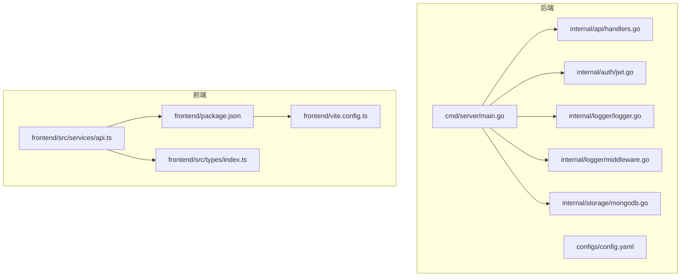
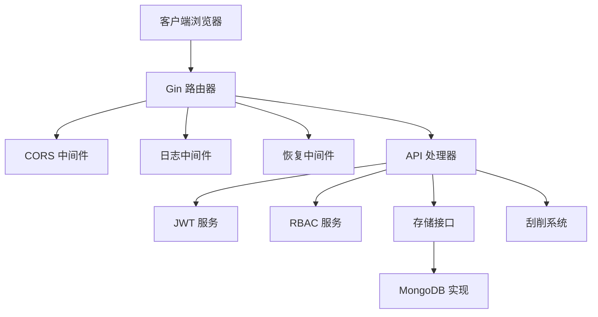
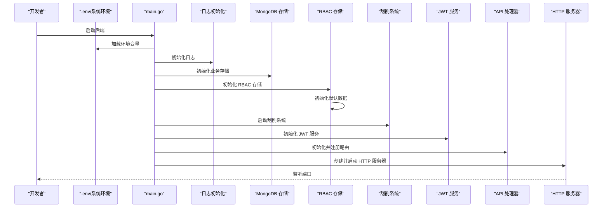
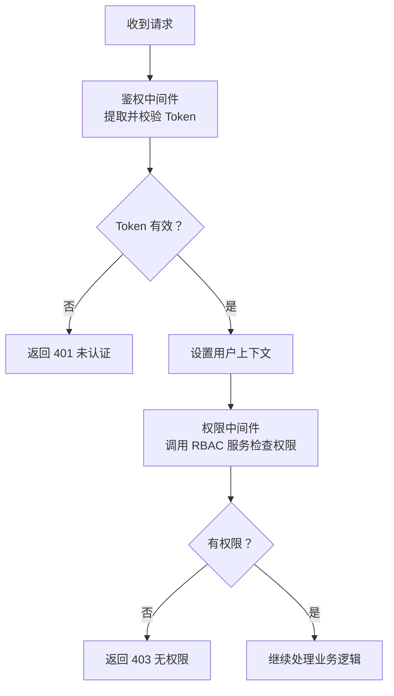
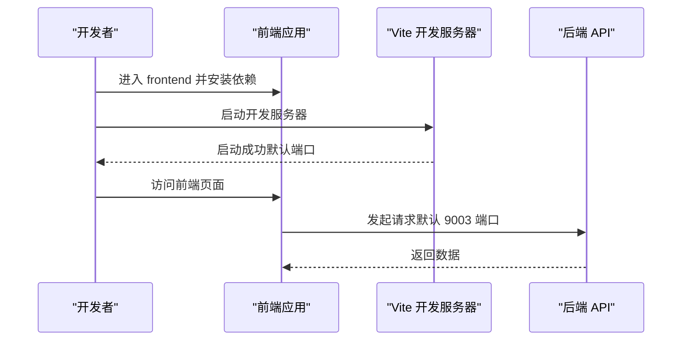
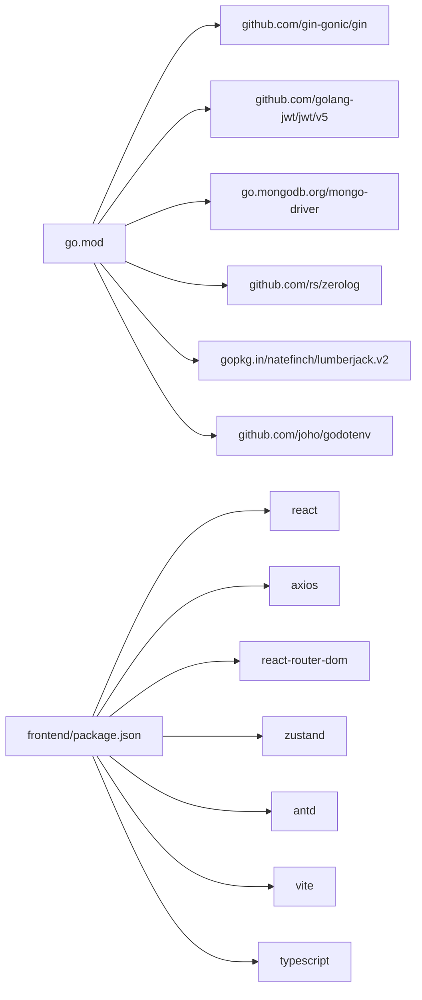

# 快速开始

<cite>
**本文引用的文件**
- [README.md](file://README.md)
- [go.mod](file://go.mod)
- [configs/config.yaml](file://configs/config.yaml)
- [cmd/server/main.go](file://cmd/server/main.go)
- [internal/storage/mongodb.go](file://internal/storage/mongodb.go)
- [internal/auth/jwt.go](file://internal/auth/jwt.go)
- [internal/api/handlers.go](file://internal/api/handlers.go)
- [internal/logger/logger.go](file://internal/logger/logger.go)
- [internal/logger/middleware.go](file://internal/logger/middleware.go)
- [frontend/package.json](file://frontend/package.json)
- [frontend/vite.config.ts](file://frontend/vite.config.ts)
- [frontend/src/services/api.ts](file://frontend/src/services/api.ts)
- [frontend/src/types/index.ts](file://frontend/src/types/index.ts)
</cite>

## 目录
1. [简介](#简介)
2. [项目结构](#项目结构)
3. [核心组件](#核心组件)
4. [架构总览](#架构总览)
5. [详细组件分析](#详细组件分析)
6. [依赖分析](#依赖分析)
7. [性能考虑](#性能考虑)
8. [故障排除指南](#故障排除指南)
9. [结论](#结论)
10. [附录](#附录)

## 简介
本指南面向开发者，帮助你快速搭建并运行数据中心项目。项目采用前后端分离架构：后端基于 Go 与 Gin 提供 REST API，前端基于 React 18 + TypeScript，使用 Vite 构建。后端通过 MongoDB 存储业务与权限数据，支持 JWT 认证与 RBAC 权限控制，并内置数据刮削任务系统。

## 项目结构
- 后端入口：cmd/server/main.go
- 配置：configs/config.yaml（用于默认配置），同时支持环境变量覆盖
- 前端：frontend 目录，包含 React 应用、TypeScript 类型、Axios 客户端等
- 核心模块：internal 下的 API、认证、日志、存储、刮削、RBAC 等
- 公共包：pkg 下的 JQL 解析器与 RBAC 服务

图表来源
- [cmd/server/main.go:1-167](file://cmd/server/main.go#L1-L167)
- [configs/config.yaml:1-26](file://configs/config.yaml#L1-L26)
- [internal/api/handlers.go:1-180](file://internal/api/handlers.go#L1-L180)
- [internal/auth/jwt.go:1-126](file://internal/auth/jwt.go#L1-L126)
- [internal/logger/logger.go:1-89](file://internal/logger/logger.go#L1-L89)
- [internal/logger/middleware.go:1-69](file://internal/logger/middleware.go#L1-L69)
- [internal/storage/mongodb.go:1-91](file://internal/storage/mongodb.go#L1-L91)
- [frontend/package.json:1-29](file://frontend/package.json#L1-L29)
- [frontend/vite.config.ts:1-6](file://frontend/vite.config.ts#L1-L6)
- [frontend/src/services/api.ts:1-37](file://frontend/src/services/api.ts#L1-L37)
- [frontend/src/types/index.ts:1-97](file://frontend/src/types/index.ts#L1-L97)

章节来源
- [README.md:22-41](file://README.md#L22-L41)
- [go.mod:1-14](file://go.mod#L1-L14)

## 核心组件
- 后端服务启动与环境变量加载：从 .env 文件读取配置，初始化日志、存储、JWT、RBAC、刮削系统，注册路由并启动 HTTP 服务器
- 配置文件：YAML 提供默认值，可通过环境变量覆盖
- 前端开发与构建：Vite + React + TypeScript，Axios 发起请求，本地默认指向后端 9003 端口（需注意与后端端口区分）

章节来源
- [cmd/server/main.go:24-150](file://cmd/server/main.go#L24-L150)
- [configs/config.yaml:1-26](file://configs/config.yaml#L1-L26)
- [frontend/package.json:6-10](file://frontend/package.json#L6-L10)
- [frontend/src/services/api.ts:5-8](file://frontend/src/services/api.ts#L5-L8)

## 架构总览
后端以 Gin 作为 Web 框架，统一注入日志中间件与恢复中间件；认证采用 JWT；权限控制基于 RBAC；存储抽象为接口，具体实现对接 MongoDB；前端通过 Axios 与后端交互。

图表来源
- [cmd/server/main.go:97-118](file://cmd/server/main.go#L97-L118)
- [internal/api/handlers.go:23-43](file://internal/api/handlers.go#L23-L43)
- [internal/auth/jwt.go:20-41](file://internal/auth/jwt.go#L20-L41)
- [internal/storage/mongodb.go:14-90](file://internal/storage/mongodb.go#L14-L90)

## 详细组件分析

### 后端启动流程与环境变量
- 环境变量加载：尝试加载项目根目录 .env 文件，若不存在则回退到系统环境变量
- 初始化顺序：日志 → 业务存储 → RBAC 存储 → 默认数据 → 刮削系统 → JWT 服务 → RBAC 服务 → 集合 RBAC 存储与服务 → 注册路由 → 启动 HTTP 服务器
- 关键环境变量（示例）：MONGODB_URI、MONGODB_DATABASE、JWT_SECRET、JWT_EXPIRATION、REFRESH_EXPIRATION、LOG_LEVEL、LOG_PATH、PORT、SCRAPER_WORKERS

图表来源
- [cmd/server/main.go:24-150](file://cmd/server/main.go#L24-L150)

章节来源
- [cmd/server/main.go:24-150](file://cmd/server/main.go#L24-L150)
- [README.md:45-78](file://README.md#L45-L78)

### 配置文件与默认参数
- YAML 默认配置项：MongoDB 连接、数据库名、JWT 密钥与过期时间、日志级别与文件路径、服务器端口与超时
- 环境变量优先级：若存在同名环境变量，将覆盖 YAML 默认值
- 建议：首次运行建议直接使用 .env 文件覆盖必要参数，避免硬编码

章节来源
- [configs/config.yaml:1-26](file://configs/config.yaml#L1-L26)
- [cmd/server/main.go:32-89](file://cmd/server/main.go#L32-L89)

### 认证与权限控制
- JWT 服务：生成、校验、刷新 Token，支持过期刷新策略
- API 中间件：鉴权中间件提取并校验 Bearer Token，权限中间件基于 RBAC 服务判断是否放行
- 权限范围：用户、角色、权限、字段定义、业务数据、集合、刮削任务等资源均有对应权限控制

图表来源
- [internal/api/handlers.go:260-314](file://internal/api/handlers.go#L260-L314)
- [internal/auth/jwt.go:68-111](file://internal/auth/jwt.go#L68-L111)

章节来源
- [internal/auth/jwt.go:12-126](file://internal/auth/jwt.go#L12-L126)
- [internal/api/handlers.go:260-314](file://internal/api/handlers.go#L260-L314)

### 前端开发与构建
- 开发服务器：进入 frontend 目录，安装依赖后启动 Vite 开发服务器
- 生产构建：打包输出至 dist 目录
- API 客户端：Axios 默认指向本地 9003 端口，需确保后端端口一致或调整前端配置

图表来源
- [frontend/package.json:6-10](file://frontend/package.json#L6-L10)
- [frontend/vite.config.ts:1-6](file://frontend/vite.config.ts#L1-L6)
- [frontend/src/services/api.ts:5-8](file://frontend/src/services/api.ts#L5-L8)

章节来源
- [README.md:106-133](file://README.md#L106-L133)
- [frontend/package.json:1-29](file://frontend/package.json#L1-29)
- [frontend/src/services/api.ts:1-37](file://frontend/src/services/api.ts#L1-L37)

## 依赖分析
- 后端依赖：Gin、JWT、MongoDB Driver、Zerolog、Lumberjack、godotenv 等
- 前端依赖：React、Ant Design、Axios、React Router、Zustand、Vite、TypeScript 等

图表来源
- [go.mod:5-14](file://go.mod#L5-L14)
- [frontend/package.json:12-27](file://frontend/package.json#L12-L27)

章节来源
- [go.mod:1-50](file://go.mod#L1-L50)
- [frontend/package.json:1-29](file://frontend/package.json#L1-L29)

## 性能考虑
- 刮削系统并发：通过环境变量控制工作线程数，默认值可在启动时调整
- 日志轮转：日志按大小轮转，避免单文件过大
- 服务器超时：读写超时可按需调整，避免长时间占用连接
- 前端静态资源：生产构建后由 Nginx/Apache 提供，减少后端压力

章节来源
- [cmd/server/main.go:65-76](file://cmd/server/main.go#L65-L76)
- [internal/logger/logger.go:14-56](file://internal/logger/logger.go#L14-L56)
- [configs/config.yaml:20-26](file://configs/config.yaml#L20-L26)

## 故障排除指南
- 后端无法启动
  - 检查 .env 是否存在且包含必要键（如 MONGODB_URI、JWT_SECRET、PORT 等）
  - 查看日志输出与错误堆栈，确认存储初始化、JWT 初始化、RBAC 初始化是否成功
- MongoDB 连接失败
  - 确认 MongoDB 服务已启动，URI 可访问
  - 若使用不同数据库，请同步更新环境变量与 YAML 配置
- 前端无法访问后端
  - 确认前端 API 客户端基地址与后端端口一致（默认 9003 vs 8080）
  - 检查跨域配置（后端已开放 CORS）
- 认证失败
  - 确认 Token 未过期，刷新策略是否生效
  - 检查权限是否正确授予，RBAC 默认数据是否初始化成功
- 日志异常
  - 检查日志文件路径与权限，确认轮转参数合理

章节来源
- [cmd/server/main.go:24-150](file://cmd/server/main.go#L24-L150)
- [internal/logger/logger.go:14-56](file://internal/logger/logger.go#L14-L56)
- [frontend/src/services/api.ts:5-8](file://frontend/src/services/api.ts#L5-L8)

## 结论
按照本指南完成环境准备、依赖安装、配置覆盖与启动流程后，你将可以快速运行数据中心项目。建议先完成后端与数据库的连通性验证，再启动前端进行界面联调。后续可逐步完善权限与业务数据的初始化配置。

## 附录

### 环境要求与安装步骤
- 后端
  - Go 1.20+
  - MongoDB 4.4+
  - 安装依赖：go mod tidy
  - 编译：go build ./...
  - 运行：go run cmd/server/main.go
- 前端
  - Node.js 16+
  - 安装依赖：npm install
  - 启动开发服务器：npm run dev
  - 构建生产版本：npm run build

章节来源
- [README.md:45-78](file://README.md#L45-L78)
- [README.md:108-133](file://README.md#L108-L133)
- [go.mod:3](file://go.mod#L3)

### 环境变量与默认配置对照
- MongoDB 连接与数据库：MONGODB_URI、MONGODB_DATABASE（默认来自 YAML）
- JWT：JWT_SECRET、JWT_EXPIRATION、REFRESH_EXPIRATION
- 日志：LOG_LEVEL、LOG_PATH、LOG_MAX_SIZE、LOG_MAX_BACKUPS、LOG_MAX_AGE
- 服务器：SERVER_HOST、SERVER_PORT、READ_TIMEOUT、WRITE_TIMEOUT
- 刮削：SCRAPER_WORKERS

章节来源
- [README.md:50-63](file://README.md#L50-L63)
- [configs/config.yaml:1-26](file://configs/config.yaml#L1-L26)
- [cmd/server/main.go:32-89](file://cmd/server/main.go#L32-L89)

### 启动后的验证与基本功能测试
- 后端健康检查：访问后端根路径或 /api（根据实际路由），确认服务正常
- 登录接口：POST /api/auth/login，使用有效账号获取 Token
- 权限验证：尝试访问受保护资源，确认鉴权与权限中间件生效
- 前端联调：访问前端开发服务器，确认与后端通信正常（注意端口一致性）

章节来源
- [README.md:80-105](file://README.md#L80-L105)
- [internal/api/handlers.go:45-181](file://internal/api/handlers.go#L45-L181)
- [frontend/src/services/api.ts:10-35](file://frontend/src/services/api.ts#L10-L35)