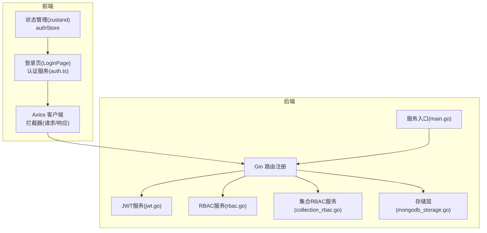
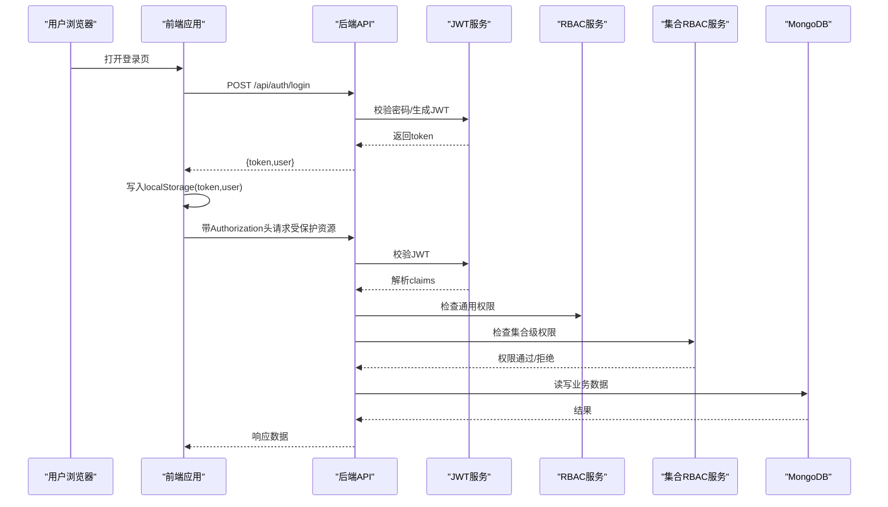
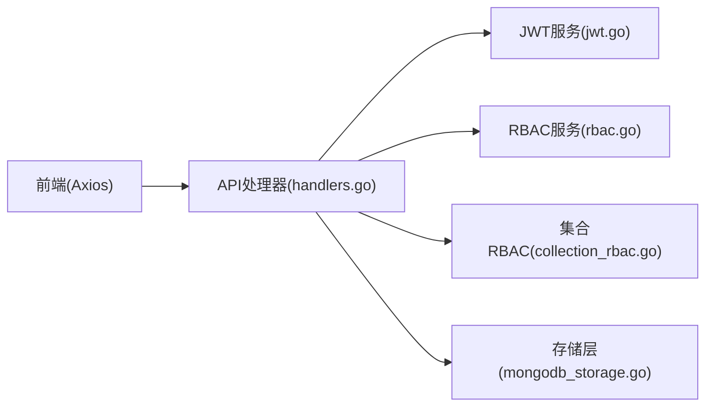

# 常见问题解答

<cite>
**本文引用的文件**
- [README.md](file://README.md)
- [cmd/server/main.go](file://cmd/server/main.go)
- [configs/config.yaml](file://configs/config.yaml)
- [internal/auth/jwt.go](file://internal/auth/jwt.go)
- [internal/api/handlers.go](file://internal/api/handlers.go)
- [internal/api/collection_permission_middleware.go](file://internal/api/collection_permission_middleware.go)
- [internal/storage/mongodb.go](file://internal/storage/mongodb.go)
- [internal/storage/mongodb_storage.go](file://internal/storage/mongodb_storage.go)
- [internal/storage/rbac_storage.go](file://internal/storage/rbac_storage.go)
- [internal/models/models.go](file://internal/models/models.go)
- [pkg/rbac/rbac.go](file://pkg/rbac/rbac.go)
- [pkg/rbac/collection_rbac.go](file://pkg/rbac/collection_rbac.go)
- [frontend/src/services/auth.ts](file://frontend/src/services/auth.ts)
- [frontend/src/services/api.ts](file://frontend/src/services/api.ts)
- [frontend/src/stores/authStore.ts](file://frontend/src/stores/authStore.ts)
- [frontend/src/pages/Login/LoginPage.tsx](file://frontend/src/pages/Login/LoginPage.tsx)
- [frontend/src/types/index.ts](file://frontend/src/types/index.ts)
</cite>

## 目录
1. [简介](#简介)
2. [项目结构](#项目结构)
3. [核心组件](#核心组件)
4. [架构总览](#架构总览)
5. [详细组件分析](#详细组件分析)
6. [依赖分析](#依赖分析)
7. [性能考虑](#性能考虑)
8. [故障排查指南](#故障排查指南)
9. [结论](#结论)
10. [附录](#附录)

## 简介
本FAQ面向数据中心项目的使用者与运维人员，聚焦于日常使用中最常见的问题，覆盖认证（JWT过期/令牌无效/密码错误）、权限（角色缺失/权限不足/集合访问限制）、数据库连接（连接超时/认证失败/网络异常）、前端界面（页面加载失败/API调用错误/状态不同步）等典型场景。每个问题均提供症状、可能原因与标准解决步骤，并给出快速诊断清单与自助解决指南。

## 项目结构
数据中心采用前后端分离架构：后端基于Go与Gin，使用MongoDB存储；前端基于React+Vite，采用Ant Design与Zustand状态管理。系统提供用户认证、RBAC权限管理、业务数据管理、集合级权限控制与数据刮削能力。

图表来源
- [cmd/server/main.go:121-127](file://cmd/server/main.go#L121-L127)
- [frontend/src/services/api.ts:5-8](file://frontend/src/services/api.ts#L5-L8)
- [frontend/src/services/auth.ts:14-24](file://frontend/src/services/auth.ts#L14-L24)
- [frontend/src/stores/authStore.ts:15-28](file://frontend/src/stores/authStore.ts#L15-L28)
- [internal/auth/jwt.go:27-41](file://internal/auth/jwt.go#L27-L41)
- [pkg/rbac/rbac.go:55-61](file://pkg/rbac/rbac.go#L55-L61)
- [pkg/rbac/collection_rbac.go:27-37](file://pkg/rbac/collection_rbac.go#L27-L37)
- [internal/storage/mongodb_storage.go:27-51](file://internal/storage/mongodb_storage.go#L27-L51)

章节来源
- [README.md:22-41](file://README.md#L22-L41)
- [cmd/server/main.go:121-127](file://cmd/server/main.go#L121-L127)

## 核心组件
- 认证与授权
  - JWT服务负责签发/校验/刷新令牌，支持过期刷新。
  - RBAC服务根据用户角色与权限计算最终权限。
  - 集合级RBAC服务支持按模块的细粒度权限控制。
- 存储层
  - 统一Storage接口抽象，MongoDB实现提供用户、权限、角色、业务数据、刮削任务等CRUD。
- 前端
  - Axios统一请求客户端，自动注入Authorization头；401自动登出。
  - Zustand状态持久化到localStorage，登录成功后写入token与用户信息。

章节来源
- [internal/auth/jwt.go:27-41](file://internal/auth/jwt.go#L27-L41)
- [pkg/rbac/rbac.go:55-61](file://pkg/rbac/rbac.go#L55-L61)
- [pkg/rbac/collection_rbac.go:27-37](file://pkg/rbac/collection_rbac.go#L27-L37)
- [internal/storage/mongodb.go:14-90](file://internal/storage/mongodb.go#L14-L90)
- [internal/storage/mongodb_storage.go:27-51](file://internal/storage/mongodb_storage.go#L27-L51)
- [frontend/src/services/api.ts:10-21](file://frontend/src/services/api.ts#L10-L21)
- [frontend/src/stores/authStore.ts:15-28](file://frontend/src/stores/authStore.ts#L15-L28)

## 架构总览
后端通过Gin路由注册各类API，中间件链路包括认证中间件与权限中间件；集合级权限通过专用中间件校验模块与细粒度权限。前端通过Axios统一发送请求，自动携带令牌并在401时触发登出流程。

图表来源
- [frontend/src/pages/Login/LoginPage.tsx:13-31](file://frontend/src/pages/Login/LoginPage.tsx#L13-L31)
- [frontend/src/services/api.ts:10-21](file://frontend/src/services/api.ts#L10-L21)
- [internal/api/handlers.go:260-293](file://internal/api/handlers.go#L260-L293)
- [internal/api/handlers.go:295-314](file://internal/api/handlers.go#L295-L314)
- [internal/api/collection_permission_middleware.go:16-48](file://internal/api/collection_permission_middleware.go#L16-L48)
- [internal/auth/jwt.go:68-83](file://internal/auth/jwt.go#L68-L83)
- [pkg/rbac/rbac.go:63-99](file://pkg/rbac/rbac.go#L63-L99)
- [pkg/rbac/collection_rbac.go:39-90](file://pkg/rbac/collection_rbac.go#L39-L90)

## 详细组件分析

### 认证相关问题
- 症状
  - 登录失败，提示“用户名或密码错误”。
  - 页面跳转至登录页，反复出现401未授权。
  - 令牌过期后接口报错。
- 可能原因
  - 用户名/密码不正确。
  - JWT密钥不一致或环境变量未正确加载。
  - 令牌过期且未刷新。
  - 前端未正确设置Authorization头。
- 标准解决步骤
  - 确认用户名/密码正确，必要时重置密码。
  - 检查后端JWT密钥与过期时间配置，确保与前端一致。
  - 若出现401，确认本地存储中的token是否存在且未过期；若过期，尝试重新登录以刷新令牌。
  - 确认前端Axios拦截器已注入Authorization头。
- 快速诊断清单
  - 后端JWT配置：密钥、过期时间、刷新过期时间。
  - 前端Axios基础URL与超时设置。
  - 浏览器localStorage中是否存在token与用户信息。
  - 登录接口返回的token是否被正确写入。

章节来源
- [frontend/src/pages/Login/LoginPage.tsx:13-31](file://frontend/src/pages/Login/LoginPage.tsx#L13-L31)
- [frontend/src/services/api.ts:10-21](file://frontend/src/services/api.ts#L10-L21)
- [frontend/src/stores/authStore.ts:19-28](file://frontend/src/stores/authStore.ts#L19-L28)
- [internal/auth/jwt.go:68-83](file://internal/auth/jwt.go#L68-L83)
- [cmd/server/main.go:72-77](file://cmd/server/main.go#L72-L77)

### 权限相关问题
- 症状
  - 提示“权限不足”或“禁止访问”。
  - 某些模块无法查看/编辑数据。
- 可能原因
  - 用户未分配角色或角色缺少相应权限。
  - 集合级角色未分配或权限不足。
  - 通用权限与集合级权限同时校验，任一不满足即拒绝。
- 标准解决步骤
  - 确认用户已分配角色，且角色具备所需通用权限。
  - 检查集合级角色分配与权限，确保模块与所需权限匹配。
  - 如需批量赋权，先在通用权限中添加，再同步到集合角色。
- 快速诊断清单
  - 用户角色与权限映射是否完整。
  - 集合角色模板是否已创建并分配。
  - 请求路径对应的权限常量与中间件是否正确绑定。

章节来源
- [pkg/rbac/rbac.go:63-99](file://pkg/rbac/rbac.go#L63-L99)
- [pkg/rbac/collection_rbac.go:39-90](file://pkg/rbac/collection_rbac.go#L39-L90)
- [internal/api/collection_permission_middleware.go:16-48](file://internal/api/collection_permission_middleware.go#L16-L48)
- [internal/api/handlers.go:295-314](file://internal/api/handlers.go#L295-L314)

### 数据库连接问题
- 症状
  - 启动时报MongoDB连接失败。
  - 查询/写入接口偶发超时或失败。
- 可能原因
  - MONGODB_URI配置错误或不可达。
  - 数据库认证失败（用户名/密码/认证源）。
  - 网络异常导致连接超时。
- 标准解决步骤
  - 校验MONGODB_URI与数据库名称配置。
  - 确认MongoDB服务运行正常，防火墙放通端口。
  - 如使用认证，检查用户名/密码与认证源配置。
  - 调整读写超时配置，确保与网络状况匹配。
- 快速诊断清单
  - configs/config.yaml中的uri/database配置。
  - 后端启动日志中MongoDB连接与Ping结果。
  - 网络连通性与MongoDB服务状态。

章节来源
- [configs/config.yaml:2-4](file://configs/config.yaml#L2-L4)
- [internal/storage/mongodb_storage.go:27-51](file://internal/storage/mongodb_storage.go#L27-L51)
- [cmd/server/main.go:42-48](file://cmd/server/main.go#L42-L48)

### 前端界面问题
- 症状
  - 登录页无法提交表单或提示输入错误。
  - 页面空白或资源加载失败。
  - API调用报错，状态不同步。
- 可能原因
  - 前端Axios基础URL与后端端口不一致。
  - localStorage中token缺失或格式异常。
  - 前端路由或构建产物未正确部署。
- 标准解决步骤
  - 确认前端基础URL指向正确的后端地址与端口。
  - 清空localStorage后重新登录，确保token写入。
  - 检查前端构建产物与静态资源路径。
- 快速诊断清单
  - 前端基础URL与后端监听地址一致性。
  - 登录成功后localStorage中token与用户信息。
  - Axios拦截器是否注入Authorization头。

章节来源
- [frontend/src/services/api.ts:5-8](file://frontend/src/services/api.ts#L5-L8)
- [frontend/src/stores/authStore.ts:19-28](file://frontend/src/stores/authStore.ts#L19-L28)
- [frontend/src/pages/Login/LoginPage.tsx:13-31](file://frontend/src/pages/Login/LoginPage.tsx#L13-L31)

## 依赖分析
后端组件间依赖清晰：API层依赖JWT、RBAC与集合RBAC服务，以及存储层；存储层封装MongoDB访问；前端通过Axios与后端交互。

图表来源
- [internal/api/handlers.go:33-42](file://internal/api/handlers.go#L33-L42)
- [internal/auth/jwt.go:27-41](file://internal/auth/jwt.go#L27-L41)
- [pkg/rbac/rbac.go:55-61](file://pkg/rbac/rbac.go#L55-L61)
- [pkg/rbac/collection_rbac.go:27-37](file://pkg/rbac/collection_rbac.go#L27-L37)
- [internal/storage/mongodb_storage.go:27-51](file://internal/storage/mongodb_storage.go#L27-L51)
- [frontend/src/services/api.ts:5-8](file://frontend/src/services/api.ts#L5-L8)

章节来源
- [internal/api/handlers.go:33-42](file://internal/api/handlers.go#L33-L42)

## 性能考虑
- JWT令牌有效期与刷新策略需平衡安全与用户体验。
- 集合级权限检查涉及多次数据库查询，建议合理缓存与索引优化。
- 前端请求超时与重试策略需结合后端读写超时配置。
- 大数据量查询建议分页与投影优化，避免全量传输。

## 故障排查指南

### 登录失败
- 症状
  - 提示“用户名或密码错误”。
- 可能原因
  - 密码错误或用户不存在。
  - 后端未正确加载用户或密码校验失败。
- 解决步骤
  - 确认用户名存在且密码正确。
  - 检查后端用户存储与密码哈希逻辑。
  - 重新登录获取新token。

章节来源
- [internal/api/handlers.go:183-221](file://internal/api/handlers.go#L183-L221)
- [internal/storage/rbac_storage.go:192-200](file://internal/storage/rbac_storage.go#L192-L200)

### 令牌无效/过期
- 症状
  - 接口返回“无效令牌”或401。
- 可能原因
  - 令牌签名密钥不一致。
  - 令牌过期或刷新过期。
- 解决步骤
  - 确认JWT密钥与过期时间一致。
  - 重新登录以获取新令牌。
  - 检查前端是否正确注入Authorization头。

章节来源
- [internal/auth/jwt.go:68-83](file://internal/auth/jwt.go#L68-L83)
- [frontend/src/services/api.ts:10-21](file://frontend/src/services/api.ts#L10-L21)

### 权限不足
- 症状
  - 返回“权限不足”或“禁止访问”。
- 可能原因
  - 用户无对应角色或角色缺少权限。
  - 集合级权限未分配或不足。
- 解决步骤
  - 为用户分配具备所需权限的角色。
  - 为模块创建集合角色并分配给用户。
  - 检查中间件绑定的权限常量。

章节来源
- [pkg/rbac/rbac.go:63-99](file://pkg/rbac/rbac.go#L63-L99)
- [pkg/rbac/collection_rbac.go:39-90](file://pkg/rbac/collection_rbac.go#L39-L90)
- [internal/api/collection_permission_middleware.go:16-48](file://internal/api/collection_permission_middleware.go#L16-L48)

### 数据查询异常
- 症状
  - 查询接口返回错误或数据为空。
- 可能原因
  - 集合不存在或索引缺失。
  - 查询过滤条件或分页参数错误。
- 解决步骤
  - 确认集合存在并创建索引。
  - 检查过滤条件与分页参数。
  - 校验集合级读权限。

章节来源
- [internal/storage/mongodb_storage.go:338-395](file://internal/storage/mongodb_storage.go#L338-L395)
- [internal/api/collection_permission_middleware.go:16-48](file://internal/api/collection_permission_middleware.go#L16-L48)

### 刮削任务失败
- 症状
  - 任务状态异常或无法删除。
- 可能原因
  - 任务不存在或已被删除。
  - 权限不足或集合级权限不匹配。
- 解决步骤
  - 确认任务存在且状态正常。
  - 检查任务删除与恢复流程。
  - 核对集合级写/删除权限。

章节来源
- [internal/storage/mongodb_storage.go:571-686](file://internal/storage/mongodb_storage.go#L571-L686)
- [internal/api/handlers.go:142-160](file://internal/api/handlers.go#L142-L160)

### 前端页面加载失败
- 症状
  - 页面空白或资源404。
- 可能原因
  - 前端基础URL指向错误端口。
  - 构建产物未正确部署。
- 解决步骤
  - 确认前端基础URL与后端监听地址一致。
  - 重新构建并部署前端静态资源。

章节来源
- [frontend/src/services/api.ts:5-8](file://frontend/src/services/api.ts#L5-L8)

### API调用错误
- 症状
  - 控制台报跨域或401。
- 可能原因
  - CORS未正确配置或未注入Authorization头。
- 解决步骤
  - 检查后端CORS中间件与请求头注入。
  - 确认前端拦截器已设置Authorization。

章节来源
- [cmd/server/main.go:100-113](file://cmd/server/main.go#L100-L113)
- [frontend/src/services/api.ts:10-21](file://frontend/src/services/api.ts#L10-L21)

### 状态同步问题
- 症状
  - 登录后页面未更新或权限未生效。
- 可能原因
  - localStorage未正确写入或解析失败。
- 解决步骤
  - 清空localStorage后重新登录。
  - 检查用户信息序列化/反序列化逻辑。

章节来源
- [frontend/src/stores/authStore.ts:19-28](file://frontend/src/stores/authStore.ts#L19-L28)

## 结论
通过明确的认证、权限与存储组件边界，以及前后端协作机制，系统能够稳定支撑业务数据管理与集合级权限控制。遇到问题时，建议按照“症状—原因—步骤”的思路逐项排查，并优先核对配置与中间件链路，确保令牌、权限与集合级规则的一致性。

## 附录

### 快速诊断清单
- 后端
  - 环境变量：JWT密钥、过期时间、数据库URI与名称。
  - 路由与中间件：认证、权限、集合RBAC中间件是否正确注册。
  - 存储：MongoDB连接与Ping结果。
- 前端
  - Axios基础URL与超时。
  - localStorage中token与用户信息。
  - 登录页表单校验与提交流程。

章节来源
- [configs/config.yaml:6-10](file://configs/config.yaml#L6-L10)
- [cmd/server/main.go:72-77](file://cmd/server/main.go#L72-L77)
- [internal/storage/mongodb_storage.go:27-51](file://internal/storage/mongodb_storage.go#L27-L51)
- [frontend/src/services/api.ts:5-8](file://frontend/src/services/api.ts#L5-L8)
- [frontend/src/stores/authStore.ts:19-28](file://frontend/src/stores/authStore.ts#L19-L28)
- [frontend/src/pages/Login/LoginPage.tsx:13-31](file://frontend/src/pages/Login/LoginPage.tsx#L13-L31)