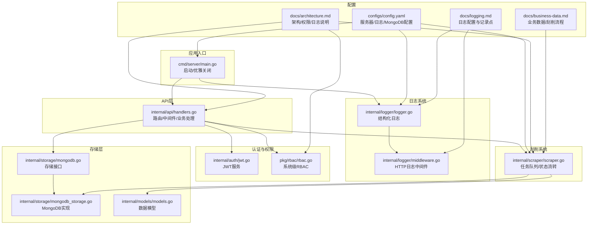
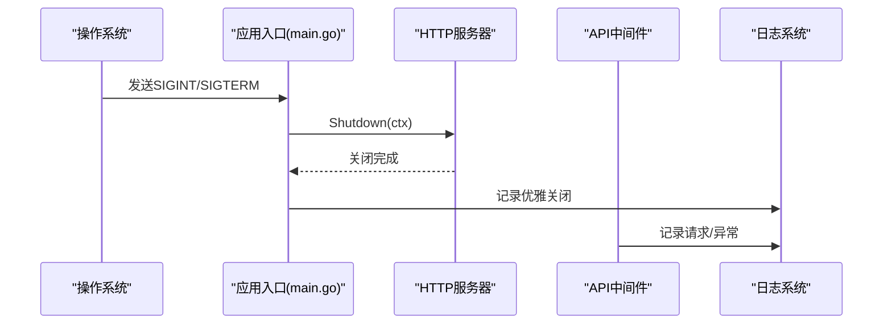
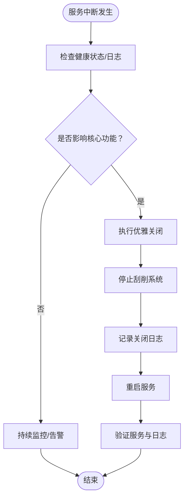
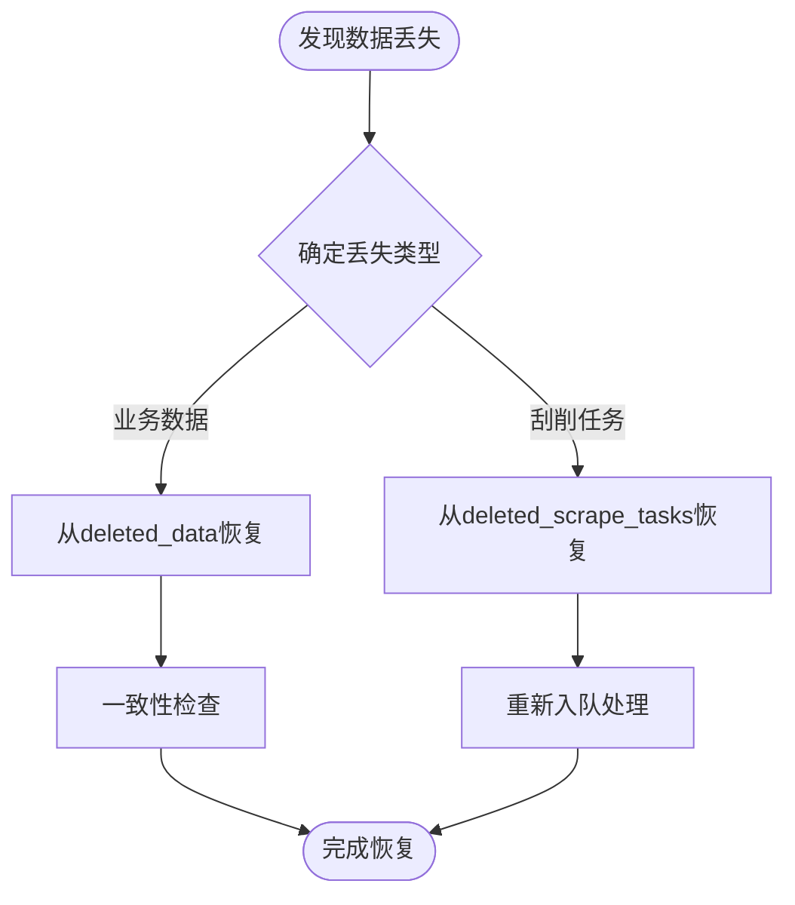
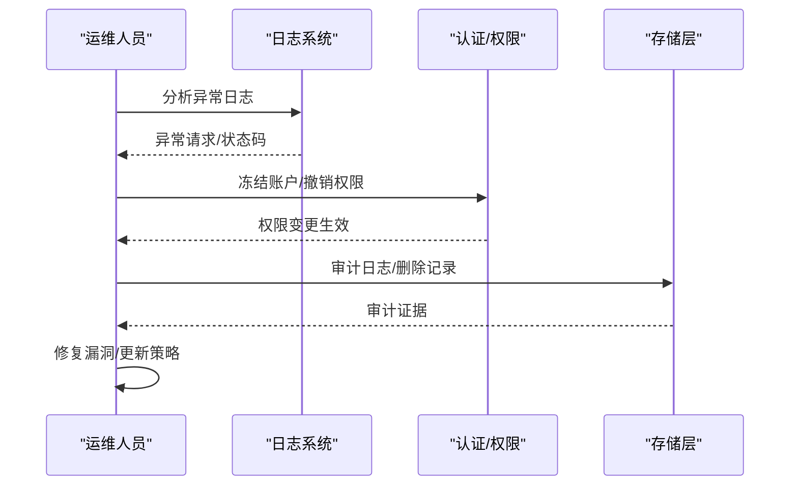
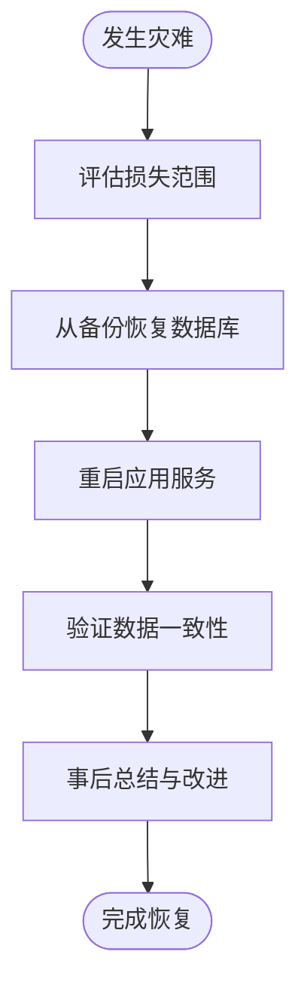
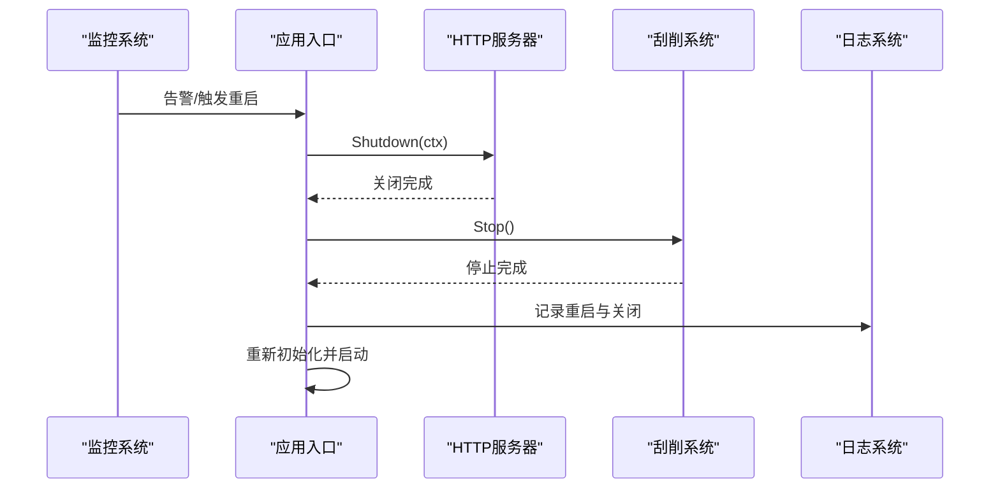
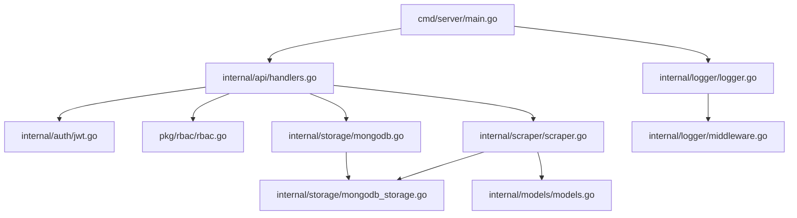

# 应急响应处理

<cite>
**本文引用的文件**
- [README.md](file://README.md)
- [cmd/server/main.go](file://cmd/server/main.go)
- [configs/config.yaml](file://configs/config.yaml)
- [internal/logger/logger.go](file://internal/logger/logger.go)
- [internal/logger/middleware.go](file://internal/logger/middleware.go)
- [internal/api/handlers.go](file://internal/api/handlers.go)
- [internal/auth/jwt.go](file://internal/auth/jwt.go)
- [internal/scraper/scraper.go](file://internal/scraper/scraper.go)
- [internal/storage/mongodb.go](file://internal/storage/mongodb.go)
- [internal/storage/mongodb_storage.go](file://internal/storage/mongodb_storage.go)
- [internal/models/models.go](file://internal/models/models.go)
- [pkg/rbac/rbac.go](file://pkg/rbac/rbac.go)
- [docs/architecture.md](file://docs/architecture.md)
- [docs/logging.md](file://docs/logging.md)
- [docs/business-data.md](file://docs/business-data.md)
- [test/README.md](file://test/README.md)
</cite>

## 目录
1. [简介](#简介)
2. [项目结构](#项目结构)
3. [核心组件](#核心组件)
4. [架构总览](#架构总览)
5. [详细组件分析](#详细组件分析)
6. [依赖分析](#依赖分析)
7. [性能考虑](#性能考虑)
8. [故障排查指南](#故障排查指南)
9. [结论](#结论)
10. [附录](#附录)

## 简介
本手册面向数据中心项目的运维与开发团队，旨在建立一套标准化的应急响应流程，覆盖服务中断、数据丢失、安全事件与灾难恢复四大类紧急情况。手册结合代码库的实际实现，明确识别标准、响应级别、处理优先级、服务重启流程、数据恢复程序、安全事件处置、监控告警配置与响应机制，并提供应急联系人清单、处理记录模板与事后总结报告格式，帮助团队快速、有序地应对突发状况。

## 项目结构
数据中心系统采用前后端分离的分层架构，后端基于 Go + Gin + MongoDB，前端基于 React + TypeScript。系统包含认证授权、RBAC 权限管理、业务数据管理、数据刮削、JQL 查询与审计日志等核心能力。应急响应流程与处理要点与以下模块密切相关：
- 应用入口与优雅关闭：cmd/server/main.go
- 日志系统：internal/logger/*
- API 路由与中间件：internal/api/handlers.go
- 认证与权限：internal/auth/jwt.go、pkg/rbac/rbac.go
- 存储层：internal/storage/*
- 刮削系统：internal/scraper/scraper.go
- 数据模型：internal/models/models.go
- 配置：configs/config.yaml、docs/architecture.md、docs/logging.md

**图表来源**
- [cmd/server/main.go:24-150](file://cmd/server/main.go#L24-L150)
- [internal/logger/logger.go:14-56](file://internal/logger/logger.go#L14-L56)
- [internal/logger/middleware.go:25-68](file://internal/logger/middleware.go#L25-L68)
- [internal/api/handlers.go:45-181](file://internal/api/handlers.go#L45-L181)
- [internal/auth/jwt.go:34-111](file://internal/auth/jwt.go#L34-L111)
- [pkg/rbac/rbac.go:55-99](file://pkg/rbac/rbac.go#L55-L99)
- [internal/storage/mongodb.go:14-90](file://internal/storage/mongodb.go#L14-L90)
- [internal/storage/mongodb_storage.go:27-51](file://internal/storage/mongodb_storage.go#L27-L51)
- [internal/models/models.go:227-320](file://internal/models/models.go#L227-L320)
- [internal/scraper/scraper.go:33-72](file://internal/scraper/scraper.go#L33-L72)
- [configs/config.yaml:20-26](file://configs/config.yaml#L20-L26)
- [docs/architecture.md:146-166](file://docs/architecture.md#L146-L166)
- [docs/logging.md:90-112](file://docs/logging.md#L90-L112)
- [docs/business-data.md:14-49](file://docs/business-data.md#L14-L49)

**章节来源**
- [README.md:22-41](file://README.md#L22-L41)
- [docs/architecture.md:146-166](file://docs/architecture.md#L146-L166)

## 核心组件
- 应用入口与优雅关闭：负责加载环境变量、初始化日志、连接数据库、启动刮削系统、注册路由、启动 HTTP 服务器并在收到信号时优雅关闭。
- 日志系统：zerolog + lumberjack，支持 HTTP 请求日志与应用日志，具备结构化输出与自动轮转。
- API 层：Gin 路由注册与中间件链，包含认证、权限与集合级权限中间件。
- 认证与权限：JWT 令牌签发与验证；系统级 RBAC 权限检查与集合级 RBAC 角色分配。
- 存储层：MongoDB 接口与实现，支持动态集合、索引与软删除恢复。
- 刮削系统：协程池 + Channel 队列，支持任务状态流转与结果存储。
- 配置：服务器、日志、MongoDB、JWT、刮削工作协程等配置项。

**章节来源**
- [cmd/server/main.go:24-150](file://cmd/server/main.go#L24-L150)
- [internal/logger/logger.go:14-56](file://internal/logger/logger.go#L14-L56)
- [internal/api/handlers.go:45-181](file://internal/api/handlers.go#L45-L181)
- [internal/auth/jwt.go:34-111](file://internal/auth/jwt.go#L34-L111)
- [pkg/rbac/rbac.go:55-99](file://pkg/rbac/rbac.go#L55-L99)
- [internal/storage/mongodb.go:14-90](file://internal/storage/mongodb.go#L14-L90)
- [internal/storage/mongodb_storage.go:27-51](file://internal/storage/mongodb_storage.go#L27-L51)
- [internal/scraper/scraper.go:33-72](file://internal/scraper/scraper.go#L33-L72)
- [configs/config.yaml:20-26](file://configs/config.yaml#L20-L26)

## 架构总览
应急响应涉及的关键交互如下：
- 服务中断：应用入口监听系统信号，触发优雅关闭；日志记录启动与关闭过程；API 层中间件记录请求与异常。
- 数据丢失：业务数据与刮削任务均支持软删除与恢复；存储层提供恢复接口；日志记录删除与恢复操作。
- 安全事件：JWT 与 RBAC 控制访问；日志记录用户行为与异常状态；必要时可冻结账户或撤销权限。
- 灾难恢复：配置文件与日志目录结构清晰；数据库双库分离；刮削系统可重启恢复任务队列。

**图表来源**
- [cmd/server/main.go:138-149](file://cmd/server/main.go#L138-L149)
- [internal/logger/middleware.go:25-68](file://internal/logger/middleware.go#L25-L68)

**章节来源**
- [cmd/server/main.go:138-149](file://cmd/server/main.go#L138-L149)
- [docs/architecture.md:146-166](file://docs/architecture.md#L146-L166)

## 详细组件分析

### 服务中断应急处理
- 识别标准：服务无法响应、健康检查失败、日志出现大量错误、CPU/内存异常飙升。
- 响应级别：一级（立即处理）
- 处理优先级：优先保障业务连续性，其次定位问题根因。
- 服务重启标准流程：
  1) 触发优雅关闭：应用入口监听 SIGINT/SIGTERM，设置超时上下文并调用 HTTP 服务器 Shutdown。
  2) 停止刮削系统：关闭任务队列与工作协程，确保未处理任务被释放。
  3) 记录日志：记录启动、关闭、异常等关键节点，便于事后分析。
  4) 重启服务：重新加载配置、重建连接、恢复服务。
- 监控与告警：结合日志中间件记录请求状态与耗时，异常状态自动触发告警。

**图表来源**
- [cmd/server/main.go:138-149](file://cmd/server/main.go#L138-L149)
- [internal/scraper/scraper.go:60-72](file://internal/scraper/scraper.go#L60-L72)
- [internal/logger/middleware.go:25-68](file://internal/logger/middleware.go#L25-L68)

**章节来源**
- [cmd/server/main.go:138-149](file://cmd/server/main.go#L138-L149)
- [docs/logging.md:114-147](file://docs/logging.md#L114-L147)

### 数据丢失应急处理
- 识别标准：业务数据缺失、刮削任务丢失、软删除记录异常。
- 响应级别：一级（立即处理）
- 处理优先级：优先恢复数据，其次追查原因。
- 数据恢复程序：
  1) 业务数据恢复：通过存储层提供的恢复接口，从已删除集合中恢复业务数据。
  2) 刮削任务恢复：从已删除刮削任务集合恢复，重新进入队列处理。
  3) 一致性检查：核对模块元数据、字段定义与业务数据结构，确保恢复后数据一致。
  4) 回滚策略：若恢复导致数据不一致，回退到最近一次备份或已知一致状态。
- 备份验证：定期验证备份文件完整性与可恢复性，确保灾难恢复可用。

**图表来源**
- [internal/storage/mongodb_storage.go:527-562](file://internal/storage/mongodb_storage.go#L527-L562)
- [internal/storage/mongodb_storage.go:721-753](file://internal/storage/mongodb_storage.go#L721-L753)
- [internal/models/models.go:236-245](file://internal/models/models.go#L236-L245)
- [internal/models/models.go:297-311](file://internal/models/models.go#L297-L311)

**章节来源**
- [internal/storage/mongodb_storage.go:527-562](file://internal/storage/mongodb_storage.go#L527-L562)
- [internal/storage/mongodb_storage.go:721-753](file://internal/storage/mongodb_storage.go#L721-L753)
- [docs/business-data.md:225-232](file://docs/business-data.md#L225-L232)

### 安全事件应急处理
- 识别标准：异常登录、频繁 4xx/5xx、越权访问、异常用户行为。
- 响应级别：一级（立即处理）
- 处理优先级：优先阻断威胁，其次取证与修复。
- 应急处置步骤：
  1) 入侵检测：通过日志中间件与审计日志识别异常请求与用户行为。
  2) 威胁隔离：冻结账户、撤销权限、限制来源 IP、禁用相关 API。
  3) 漏洞修复：修复认证与授权缺陷，更新密钥与配置。
  4) 事后分析：复盘事件、完善监控与告警、更新应急预案。
- 权限控制：利用系统级 RBAC 与集合级 RBAC 实现细粒度权限管理，快速撤销越权操作。

**图表来源**
- [internal/logger/middleware.go:25-68](file://internal/logger/middleware.go#L25-L68)
- [pkg/rbac/rbac.go:63-99](file://pkg/rbac/rbac.go#L63-L99)
- [internal/auth/jwt.go:69-83](file://internal/auth/jwt.go#L69-L83)

**章节来源**
- [internal/logger/middleware.go:25-68](file://internal/logger/middleware.go#L25-L68)
- [pkg/rbac/rbac.go:63-99](file://pkg/rbac/rbac.go#L63-L99)
- [internal/auth/jwt.go:69-83](file://internal/auth/jwt.go#L69-L83)

### 灾难恢复应急处理
- 识别标准：数据库不可用、磁盘故障、配置丢失、日志损坏。
- 响应级别：一级（立即处理）
- 处理优先级：优先恢复核心数据与服务，其次完善备份策略。
- 恢复步骤：
  1) 评估损失：确认数据库、配置、日志与备份状态。
  2) 恢复数据库：从最近可用备份恢复业务数据库与 RBAC 数据库。
  3) 恢复服务：重启应用，验证连接与权限。
  4) 验证数据：检查业务数据与刮削任务一致性，必要时执行增量恢复。
  5) 总结改进：完善备份策略、监控与演练。

**图表来源**
- [configs/config.yaml:1-26](file://configs/config.yaml#L1-L26)
- [docs/architecture.md:167-186](file://docs/architecture.md#L167-L186)

**章节来源**
- [configs/config.yaml:1-26](file://configs/config.yaml#L1-L26)
- [docs/architecture.md:167-186](file://docs/architecture.md#L167-L186)

### 服务重启标准流程
- 优雅关闭：应用入口监听系统信号，设置超时上下文并调用 HTTP 服务器 Shutdown，随后关闭刮削系统。
- 进程监控：通过日志中间件记录请求状态与耗时，异常状态自动触发告警。
- 健康检查：结合日志与外部探针，确认服务可用性。
- 服务恢复：重启后验证数据库连接、权限与业务功能。

**图表来源**
- [cmd/server/main.go:138-149](file://cmd/server/main.go#L138-L149)
- [internal/scraper/scraper.go:60-72](file://internal/scraper/scraper.go#L60-L72)
- [internal/logger/middleware.go:25-68](file://internal/logger/middleware.go#L25-L68)

**章节来源**
- [cmd/server/main.go:138-149](file://cmd/server/main.go#L138-L149)
- [docs/logging.md:114-147](file://docs/logging.md#L114-L147)

### 数据恢复程序
- 备份验证：定期验证备份文件完整性与可恢复性。
- 数据修复：通过存储层恢复接口从软删除集合恢复业务数据与刮削任务。
- 一致性检查：核对模块元数据、字段定义与业务数据结构。
- 回滚策略：若恢复导致不一致，回退到最近一次备份或已知一致状态。

**章节来源**
- [internal/storage/mongodb_storage.go:527-562](file://internal/storage/mongodb_storage.go#L527-L562)
- [internal/storage/mongodb_storage.go:721-753](file://internal/storage/mongodb_storage.go#L721-L753)
- [docs/business-data.md:225-232](file://docs/business-data.md#L225-L232)

### 安全事件应急处理
- 入侵检测：通过日志中间件与审计日志识别异常请求与用户行为。
- 威胁隔离：冻结账户、撤销权限、限制来源 IP、禁用相关 API。
- 漏洞修复：修复认证与授权缺陷，更新密钥与配置。
- 事后分析：复盘事件、完善监控与告警、更新应急预案。

**章节来源**
- [internal/logger/middleware.go:25-68](file://internal/logger/middleware.go#L25-L68)
- [pkg/rbac/rbac.go:63-99](file://pkg/rbac/rbac.go#L63-L99)
- [internal/auth/jwt.go:69-83](file://internal/auth/jwt.go#L69-L83)

### 系统监控告警配置与响应机制
- 日志配置：zerolog + lumberjack，支持结构化输出与自动轮转；HTTP 日志中间件记录请求状态与耗时。
- 告警触发：异常状态码（4xx/5xx）、长时间延迟、错误日志激增。
- 响应机制：自动告警通知、分级响应、升级机制与事后复盘。

**章节来源**
- [docs/logging.md:90-112](file://docs/logging.md#L90-L112)
- [internal/logger/middleware.go:25-68](file://internal/logger/middleware.go#L25-L68)

## 依赖分析
- 组件耦合：API 层依赖认证、权限、存储与刮削系统；存储层依赖 MongoDB 接口与实现；日志系统贯穿全链路。
- 外部依赖：MongoDB、Gin、zerolog、lumberjack、golang-jwt、bcrypt。
- 依赖可视化：

**图表来源**
- [cmd/server/main.go:24-150](file://cmd/server/main.go#L24-L150)
- [internal/api/handlers.go:33-43](file://internal/api/handlers.go#L33-L43)
- [internal/auth/jwt.go:34-111](file://internal/auth/jwt.go#L34-L111)
- [pkg/rbac/rbac.go:55-99](file://pkg/rbac/rbac.go#L55-L99)
- [internal/storage/mongodb.go:14-90](file://internal/storage/mongodb.go#L14-L90)
- [internal/storage/mongodb_storage.go:27-51](file://internal/storage/mongodb_storage.go#L27-L51)
- [internal/scraper/scraper.go:33-72](file://internal/scraper/scraper.go#L33-L72)
- [internal/logger/logger.go:14-56](file://internal/logger/logger.go#L14-L56)
- [internal/logger/middleware.go:25-68](file://internal/logger/middleware.go#L25-L68)

**章节来源**
- [cmd/server/main.go:24-150](file://cmd/server/main.go#L24-L150)
- [internal/api/handlers.go:33-43](file://internal/api/handlers.go#L33-L43)

## 性能考虑
- 刮削系统并发：默认 4 个工作协程，队列缓冲 1000；可根据负载调整。
- 日志性能：结构化日志与文件轮转，避免阻塞主线程。
- 数据库性能：集合索引策略与动态集合管理，提升查询效率。
- 建议：定期压测、容量规划、监控关键指标（QPS、P95/P99 延迟、错误率、数据库连接数）。

[本节为通用指导，无需特定文件引用]

## 故障排查指南
- 服务无法启动：检查环境变量与配置文件，确认日志输出与数据库连接。
- 刮削任务失败：检查刮削器脚本、数据文件路径与权限，查看任务状态与错误信息。
- 权限不足：检查用户角色与权限分配，确认集合级角色与权限。
- 日志异常：检查日志级别与文件轮转配置，确认日志目录权限。

**章节来源**
- [configs/config.yaml:1-26](file://configs/config.yaml#L1-L26)
- [docs/logging.md:90-112](file://docs/logging.md#L90-L112)
- [docs/business-data.md:14-49](file://docs/business-data.md#L14-L49)

## 结论
本应急响应手册基于数据中心系统的实际实现，明确了服务中断、数据丢失、安全事件与灾难恢复的识别标准、响应级别、处理优先级与标准流程。通过日志系统、API 中间件、认证与权限、存储层与刮削系统等关键组件的协同，团队可在紧急情况下快速定位问题、采取有效措施并恢复服务。建议定期演练、完善监控与告警、持续优化应急预案与备份策略。

[本节为总结性内容，无需特定文件引用]

## 附录

### 应急联系人清单
- 一线值班工程师：负责初步响应与处置
- 二线架构师：负责技术方案与协调
- 三线专家：负责复杂问题与根因分析
- 安全负责人：负责安全事件与合规
- 运维负责人：负责资源与平台支持

[本节为通用模板，无需特定文件引用]

### 处理记录模板
- 事件时间：YYYY-MM-DD HH:mm:ss
- 影响范围：受影响模块/接口/用户
- 处置过程：关键步骤与决策
- 恢复时间：服务恢复时间
- 根因分析：根本原因与改进措施
- 复盘总结：经验教训与优化建议

[本节为通用模板，无需特定文件引用]

### 事后总结报告格式
- 事件概述：简要描述事件
- 影响评估：业务影响与用户规模
- 处置过程：响应流程与关键决策
- 根因分析：技术与流程原因
- 改进措施：短期与长期改进
- 附件：日志截图、配置文件、变更记录

[本节为通用模板，无需特定文件引用]