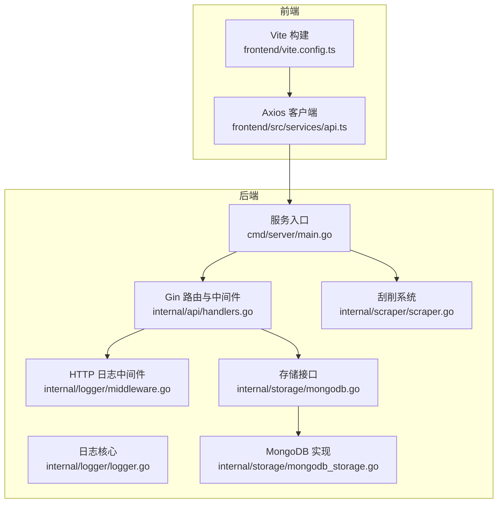
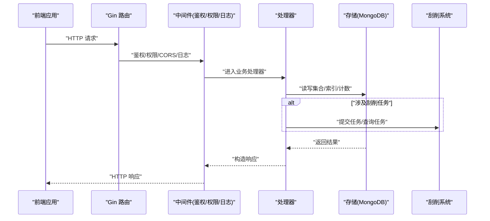
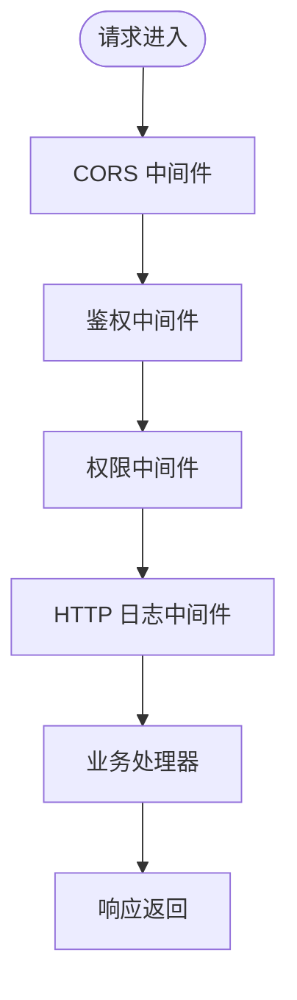
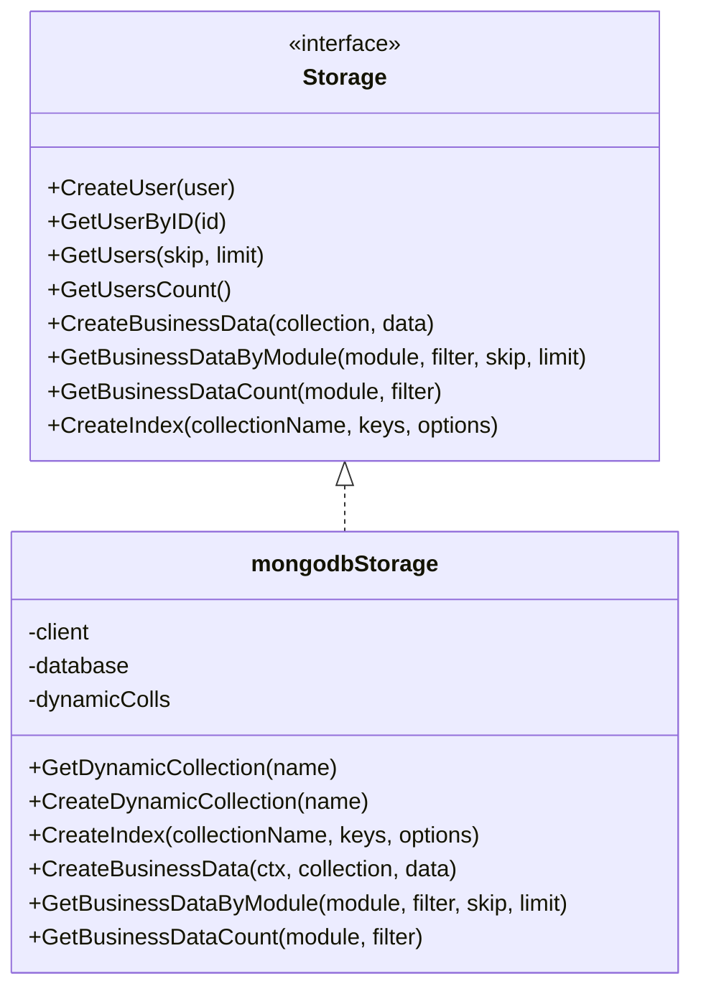
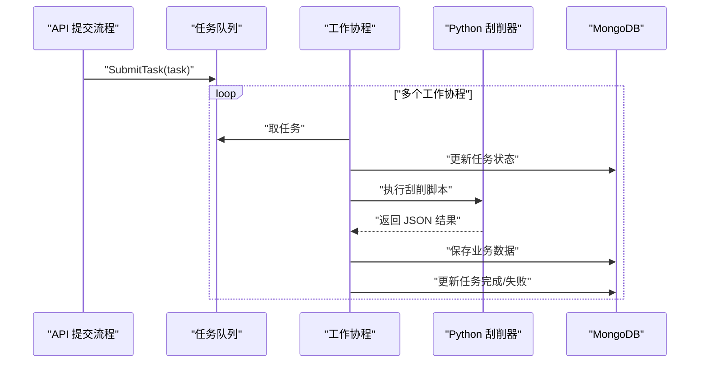
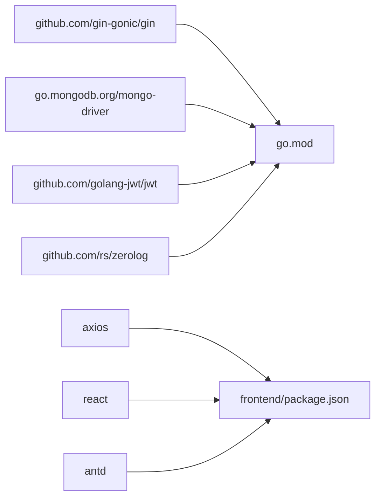

# 性能问题诊断

<cite>
**本文引用的文件**
- [cmd/server/main.go](file://cmd/server/main.go)
- [configs/config.yaml](file://configs/config.yaml)
- [internal/api/handlers.go](file://internal/api/handlers.go)
- [internal/logger/logger.go](file://internal/logger/logger.go)
- [internal/logger/middleware.go](file://internal/logger/middleware.go)
- [internal/storage/mongodb.go](file://internal/storage/mongodb.go)
- [internal/storage/mongodb_storage.go](file://internal/storage/mongodb_storage.go)
- [internal/scraper/scraper.go](file://internal/scraper/scraper.go)
- [frontend/src/services/api.ts](file://frontend/src/services/api.ts)
- [frontend/vite.config.ts](file://frontend/vite.config.ts)
- [frontend/package.json](file://frontend/package.json)
- [go.mod](file://go.mod)
- [docs/modules/scraper/implementation.md](file://docs/modules/scraper/implementation.md)
</cite>

## 目录
1. [简介](#简介)
2. [项目结构](#项目结构)
3. [核心组件](#核心组件)
4. [架构总览](#架构总览)
5. [详细组件分析](#详细组件分析)
6. [依赖分析](#依赖分析)
7. [性能考虑](#性能考虑)
8. [故障排查指南](#故障排查指南)
9. [结论](#结论)
10. [附录](#附录)

## 简介
本指南面向数据中心项目，提供系统性的性能问题诊断流程与优化建议，覆盖以下方面：
- CPU 使用率分析与热点定位
- 内存泄漏检测与内存压力缓解
- 数据库查询优化（MongoDB）
- 网络延迟诊断（后端接口与前端请求）
- Go 语言性能分析工具（pprof、trace）使用
- 前端性能优化（React 渲染、API 调用、缓存策略）
- 后端性能优化（goroutine 管理、数据库连接与索引、中间件性能）
- 性能基准测试与持续监控策略

## 项目结构
该项目采用分层与模块化组织方式：
- 后端入口与服务编排：cmd/server/main.go
- API 层与路由：internal/api/handlers.go
- 日志与中间件：internal/logger/logger.go、internal/logger/middleware.go
- 存储层（MongoDB）：internal/storage/mongodb.go、internal/storage/mongodb_storage.go
- 刮削系统（Worker Pool + Channel）：internal/scraper/scraper.go
- 前端（React + Vite）：frontend/src/services/api.ts、frontend/vite.config.ts、frontend/package.json
- 配置：configs/config.yaml、go.mod

**图表来源**
- [cmd/server/main.go:24-150](file://cmd/server/main.go#L24-L150)
- [internal/api/handlers.go:45-181](file://internal/api/handlers.go#L45-L181)
- [internal/logger/middleware.go:25-68](file://internal/logger/middleware.go#L25-L68)
- [internal/logger/logger.go:14-56](file://internal/logger/logger.go#L14-L56)
- [internal/storage/mongodb.go:14-90](file://internal/storage/mongodb.go#L14-L90)
- [internal/storage/mongodb_storage.go:27-51](file://internal/storage/mongodb_storage.go#L27-L51)
- [internal/scraper/scraper.go:34-72](file://internal/scraper/scraper.go#L34-L72)
- [frontend/src/services/api.ts:1-37](file://frontend/src/services/api.ts#L1-L37)
- [frontend/vite.config.ts:1-6](file://frontend/vite.config.ts#L1-L6)

**章节来源**
- [cmd/server/main.go:24-150](file://cmd/server/main.go#L24-L150)
- [configs/config.yaml:1-26](file://configs/config.yaml#L1-L26)
- [go.mod:1-50](file://go.mod#L1-L50)

## 核心组件
- 服务入口与生命周期：负责环境变量加载、日志初始化、存储初始化、RBAC 初始化、刮削系统启动、HTTP 服务启动与优雅关闭。
- API 层与中间件：统一鉴权、权限校验、日志记录、CORS、Gin Recovery。
- 存储层：抽象接口与 MongoDB 实现，支持动态集合、索引创建、分页查询。
- 刮削系统：基于 Worker Pool 的异步任务处理，Channel 队列与优雅停机。
- 前端：Axios 客户端封装、拦截器、超时设置。

**章节来源**
- [cmd/server/main.go:24-150](file://cmd/server/main.go#L24-L150)
- [internal/api/handlers.go:260-314](file://internal/api/handlers.go#L260-L314)
- [internal/logger/middleware.go:25-68](file://internal/logger/middleware.go#L25-L68)
- [internal/storage/mongodb.go:14-90](file://internal/storage/mongodb.go#L14-L90)
- [internal/storage/mongodb_storage.go:338-410](file://internal/storage/mongodb_storage.go#L338-L410)
- [internal/scraper/scraper.go:34-72](file://internal/scraper/scraper.go#L34-L72)
- [frontend/src/services/api.ts:1-37](file://frontend/src/services/api.ts#L1-L37)

## 架构总览
后端以 Gin 为核心，通过中间件链路处理请求；存储层统一抽象，当前实现为 MongoDB；刮削系统独立运行，与主服务通过任务队列交互。前端通过 Axios 与后端通信。

**图表来源**
- [internal/api/handlers.go:45-181](file://internal/api/handlers.go#L45-L181)
- [internal/logger/middleware.go:25-68](file://internal/logger/middleware.go#L25-L68)
- [internal/storage/mongodb_storage.go:338-410](file://internal/storage/mongodb_storage.go#L338-L410)
- [internal/scraper/scraper.go:75-99](file://internal/scraper/scraper.go#L75-L99)

## 详细组件分析

### 组件A：HTTP 服务与中间件链路
- 中间件包含 CORS、日志、recover，日志中间件会捕获响应体并按状态分类输出。
- 服务启动时设置 ReadTimeout/WriteTimeout，避免长时间阻塞导致资源占用。
- 优雅关闭：接收系统信号后，等待现有请求处理完毕并关闭 HTTP 服务器。

**图表来源**
- [cmd/server/main.go:100-118](file://cmd/server/main.go#L100-L118)
- [internal/api/handlers.go:260-314](file://internal/api/handlers.go#L260-L314)
- [internal/logger/middleware.go:25-68](file://internal/logger/middleware.go#L25-L68)

**章节来源**
- [cmd/server/main.go:121-148](file://cmd/server/main.go#L121-L148)
- [internal/logger/middleware.go:25-68](file://internal/logger/middleware.go#L25-L68)

### 组件B：存储层（MongoDB）
- 抽象接口定义了用户、权限、角色、业务数据、刮削任务、集合管理等 CRUD 与统计方法。
- 实现层支持动态集合、索引创建、分页查询（skip/limit）、排序（如按更新时间倒序）。
- 注意：部分聚合/统计方法未实现，需关注空实现对上层逻辑的影响。

**图表来源**
- [internal/storage/mongodb.go:14-90](file://internal/storage/mongodb.go#L14-L90)
- [internal/storage/mongodb_storage.go:16-51](file://internal/storage/mongodb_storage.go#L16-L51)

**章节来源**
- [internal/storage/mongodb.go:14-90](file://internal/storage/mongodb.go#L14-L90)
- [internal/storage/mongodb_storage.go:338-410](file://internal/storage/mongodb_storage.go#L338-L410)

### 组件C：刮削系统（Worker Pool + Channel）
- 采用经典 Worker Pool 模式：固定数量的工作协程从任务队列消费任务。
- 任务队列为带缓冲的 Channel，支持优雅停机：关闭 stopChan 与 taskQueue。
- 处理流程：更新任务状态 -> 执行外部脚本 -> 解析结果 -> 保存业务数据 -> 更新任务记录。

**图表来源**
- [internal/scraper/scraper.go:75-99](file://internal/scraper/scraper.go#L75-L99)
- [internal/scraper/scraper.go:102-120](file://internal/scraper/scraper.go#L102-L120)
- [internal/scraper/scraper.go:196-231](file://internal/scraper/scraper.go#L196-L231)
- [internal/scraper/scraper.go:234-288](file://internal/scraper/scraper.go#L234-L288)

**章节来源**
- [docs/modules/scraper/implementation.md:21-97](file://docs/modules/scraper/implementation.md#L21-L97)
- [internal/scraper/scraper.go:34-72](file://internal/scraper/scraper.go#L34-L72)

### 组件D：前端 API 客户端
- Axios 客户端默认 baseURL 与超时设置，请求拦截器自动注入 Bearer Token。
- 响应拦截器处理 401 自动登出与跳转。

**章节来源**
- [frontend/src/services/api.ts:1-37](file://frontend/src/services/api.ts#L1-L37)

## 依赖分析
- 后端依赖：Gin、MongoDB Driver、JWT、Zerolog、Lumberjack 等。
- 前端依赖：React、Axios、Ant Design、React Router、Zustand 等。

**图表来源**
- [go.mod:5-14](file://go.mod#L5-L14)
- [frontend/package.json:12-27](file://frontend/package.json#L12-L27)

**章节来源**
- [go.mod:1-50](file://go.mod#L1-L50)
- [frontend/package.json:1-29](file://frontend/package.json#L1-L29)

## 性能考虑

### CPU 使用率分析与热点定位
- 使用 top/htop 观察进程 CPU 占用，结合火焰图定位热点函数。
- 在生产环境启用 pprof（net/http/pprof），采集 CPU/heap/profile 数据，结合 trace 分析长尾请求。
- 后端建议在开发环境开启 pprof，生产环境谨慎开启并限制访问。

### 内存泄漏检测与内存压力缓解
- 使用 pprof heap 分析，对比不同时间点的堆快照，识别增长对象。
- 关注大对象与长生命周期容器（如缓存、全局 map），确保及时释放。
- 刮削系统中的动态集合映射表需注意并发安全与清理策略。

### 数据库查询优化（MongoDB）
- 分页与排序：优先使用索引支持的排序字段（如按更新时间倒序），避免全表扫描。
- 查询过滤：尽量在查询条件中使用索引字段，减少 $where 等不可用索引的操作。
- 索引策略：为高频查询字段创建复合索引；定期评估索引选择性与维护成本。
- 连接与客户端：复用 mongo.Client，避免频繁连接/断开；合理设置超时与重试。
- 统计与计数：对于 count 场景，评估是否需要精确计数，必要时引入缓存或近似算法。

### 网络延迟诊断
- 后端：利用日志中间件记录请求路径、状态码、耗时与响应体大小，快速定位慢接口。
- 前端：Axios 设置合理超时，区分网络层与业务层耗时；对批量请求进行合并与去重。
- CDN/静态资源：Vite 构建产物可配合 CDN 加速，减少首屏与静态资源加载时间。

### Go 语言性能分析工具使用
- pprof：通过 net/http/pprof 暴露端点，采集 CPU/heap/profile/trace 数据。
- trace：对特定请求或场景生成 trace，观察 goroutine、锁、系统调用等。
- 建议：在开发/预生产环境启用，生产环境仅在紧急排查时临时开启。

### 前端性能优化
- React 渲染优化：使用 memo、useMemo、useCallback 减少不必要重渲染；拆分大组件。
- API 调用优化：合并请求、缓存响应、防抖节流；对列表分页与懒加载。
- 缓存策略：本地缓存（localStorage/sessionStorage）与 HTTP 缓存头配合；版本化缓存键。

### 后端性能优化
- goroutine 管理：控制 worker 数量与队列长度，避免过载；使用上下文控制超时。
- 中间件性能：避免在日志中间件中对大响应体做昂贵操作；必要时采样记录。
- 数据库连接池优化：统一客户端、合理超时、批量写入；对写密集场景使用事务批处理。

## 故障排查指南

### CPU 使用率异常
- 步骤
  1) 使用 top/htop 定位进程，确认是否为后端主进程。
  2) 采集 pprof CPU profile，查看热点函数与调用栈。
  3) 检查是否存在无限循环、阻塞 IO 或高复杂度计算。
- 关注点
  - 刮削系统是否堆积任务导致 CPU 占用升高。
  - API 处理器是否存在未命中索引的查询。

**章节来源**
- [internal/scraper/scraper.go:102-120](file://internal/scraper/scraper.go#L102-L120)
- [internal/storage/mongodb_storage.go:366-383](file://internal/storage/mongodb_storage.go#L366-L383)

### 内存泄漏
- 步骤
  1) 采集 pprof heap 快照，对比前后差异。
  2) 关注全局缓存、动态集合映射、日志缓冲区。
  3) 检查是否存在 goroutine 泄漏或 Channel 阻塞。
- 建议
  - 对动态集合映射表增加容量上限与定期清理。
  - 日志中间件避免对大响应体做字符串拼接。

**章节来源**
- [internal/logger/middleware.go:10-24](file://internal/logger/middleware.go#L10-L24)
- [internal/storage/mongodb_storage.go:53-60](file://internal/storage/mongodb_storage.go#L53-L60)

### 数据库查询慢
- 步骤
  1) 分析日志中间件输出，定位慢接口与耗时。
  2) 检查查询过滤条件与排序字段是否命中索引。
  3) 使用 explain 分析查询计划，必要时创建复合索引。
- 关注点
  - 分页 skip/limit 较大时的性能退化。
  - 业务数据查询是否对嵌套字段进行过滤。

**章节来源**
- [internal/logger/middleware.go:36-66](file://internal/logger/middleware.go#L36-L66)
- [internal/storage/mongodb_storage.go:366-383](file://internal/storage/mongodb_storage.go#L366-L383)

### 网络延迟高
- 步骤
  1) 前端设置超时并记录请求耗时，区分网络与服务端耗时。
  2) 后端日志中间件记录状态码与响应体大小，定位异常接口。
  3) 检查跨域与鉴权中间件是否造成额外开销。
- 建议
  - 对批量请求进行合并与缓存。
  - 静态资源走 CDN，减少主站负载。

**章节来源**
- [frontend/src/services/api.ts:1-37](file://frontend/src/services/api.ts#L1-L37)
- [internal/logger/middleware.go:25-68](file://internal/logger/middleware.go#L25-L68)

### 刮削系统性能问题
- 步骤
  1) 检查 worker 数量与队列长度，避免过载。
  2) 监控外部脚本执行时间与输出解析。
  3) 评估业务数据写入是否成为瓶颈。
- 建议
  - 适当增加 worker 数量（受外部脚本与数据库写入能力影响）。
  - 对 Python 脚本进行性能剖析，优化耗时环节。

**章节来源**
- [docs/modules/scraper/implementation.md:21-97](file://docs/modules/scraper/implementation.md#L21-L97)
- [internal/scraper/scraper.go:196-231](file://internal/scraper/scraper.go#L196-L231)

## 结论
本指南提供了从系统入口、中间件链路、存储层到刮削系统的全链路性能诊断方法，并结合前端与数据库侧优化策略。建议团队建立：
- 性能基线与阈值告警
- 定期 pprof/trace 采集与回归分析
- 数据库索引与查询计划评审机制
- 前端缓存与请求合并策略
- 刮削系统容量规划与外部脚本优化

## 附录

### 性能基准测试方法
- 后端
  - 使用 wrk/vegeta 压测常见接口，记录 P50/P95/P99 延迟与吞吐。
  - 针对刮削接口模拟任务提交与执行，评估队列与 worker 性能。
- 前端
  - Lighthouse/Vite 预览模式评估首屏与交互性能。
  - 使用浏览器性能面板分析渲染与网络请求。

### 持续监控策略
- 指标
  - CPU/内存/IO、请求延迟与错误率、数据库慢查询数、队列长度、worker 利用率。
- 工具
  - Prometheus/Grafana + Loki（日志聚合）+ Tempo（Trace）。
- 告警
  - 延迟与错误率阈值告警；队列积压与 worker 空闲率异常告警。