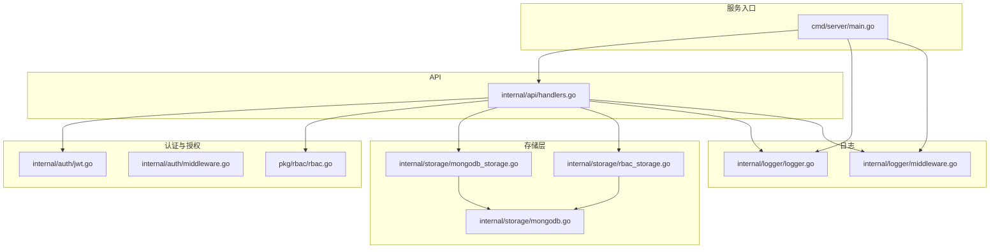
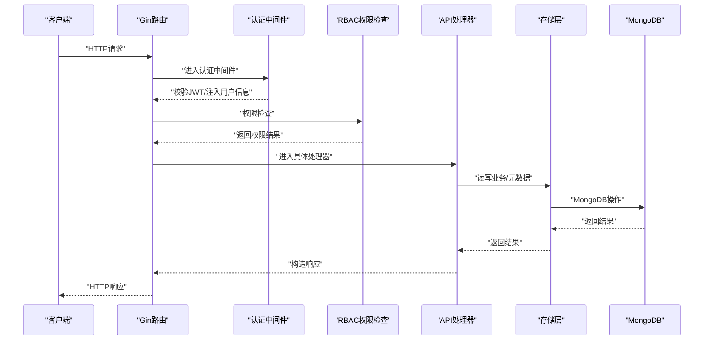
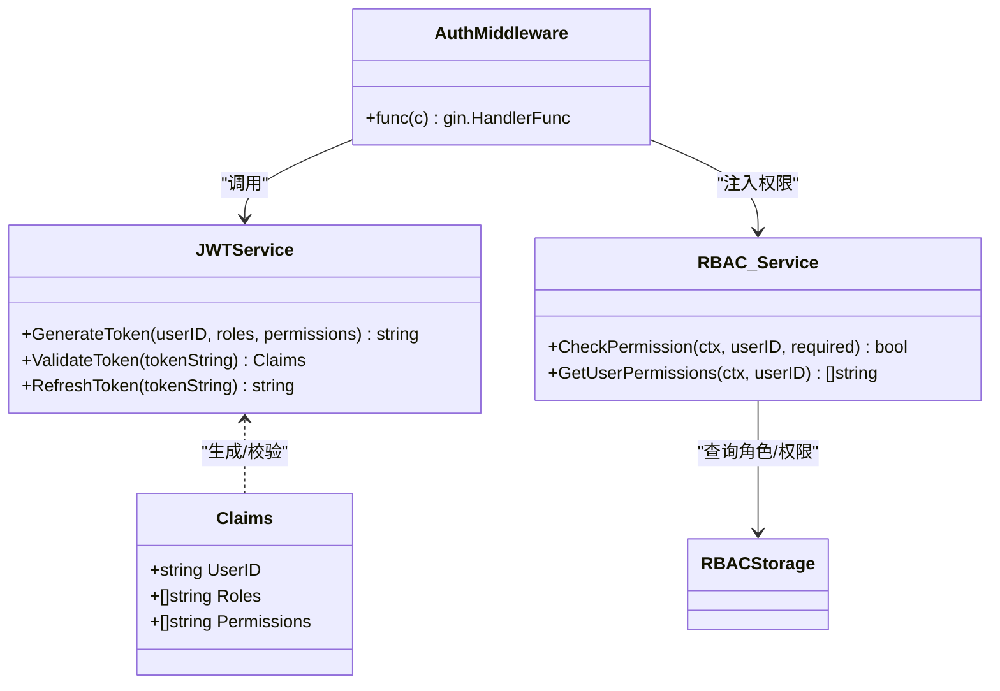
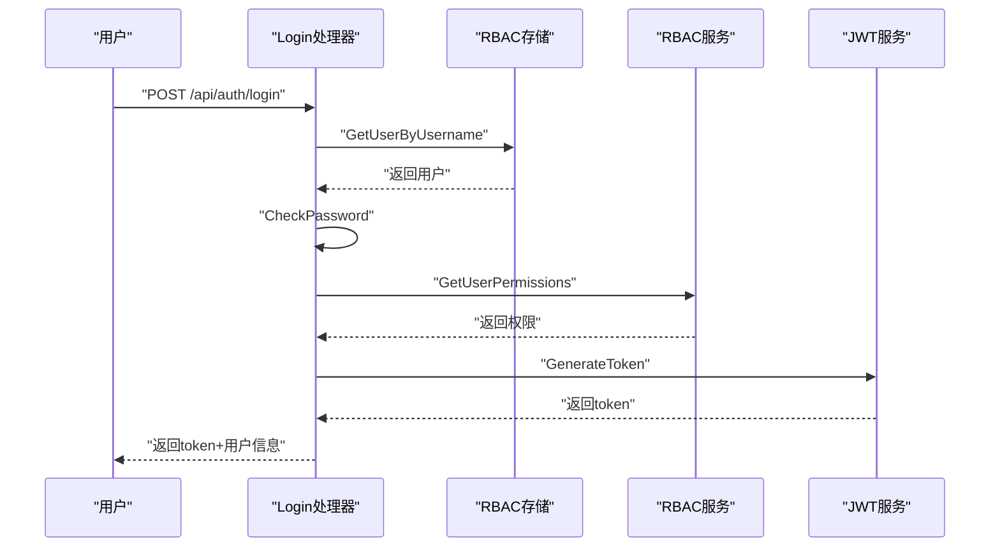
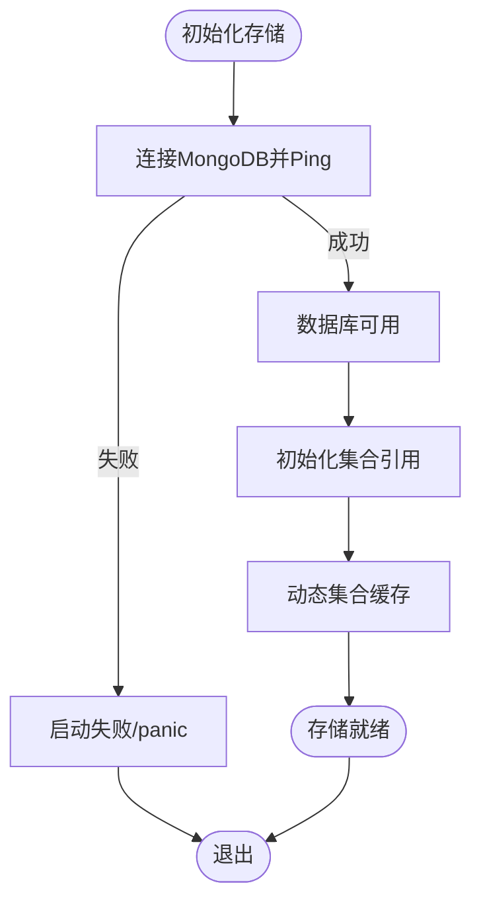
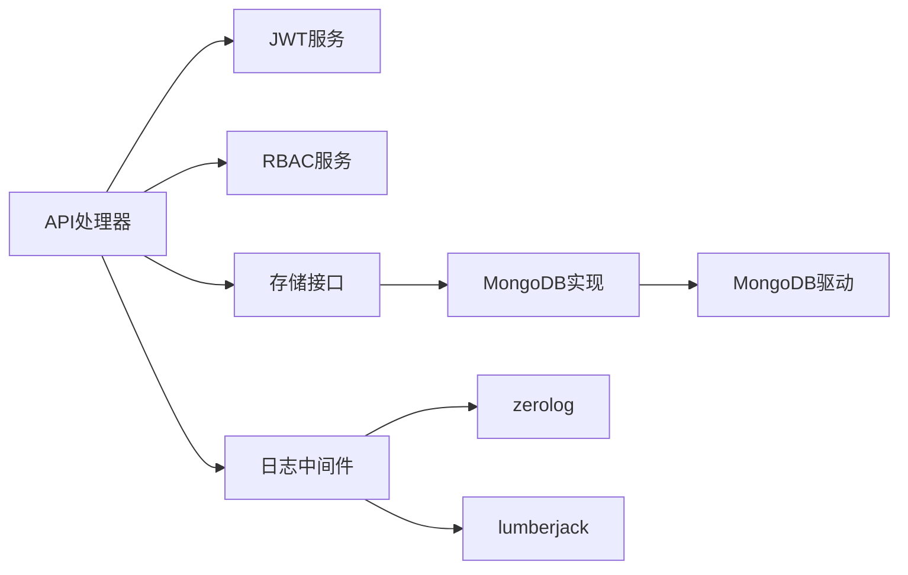

# 故障排除

<cite>
**本文引用的文件**
- [cmd/server/main.go](file://cmd/server/main.go)
- [configs/config.yaml](file://configs/config.yaml)
- [internal/api/handlers.go](file://internal/api/handlers.go)
- [internal/auth/jwt.go](file://internal/auth/jwt.go)
- [internal/auth/middleware.go](file://internal/auth/middleware.go)
- [internal/logger/logger.go](file://internal/logger/logger.go)
- [internal/logger/middleware.go](file://internal/logger/middleware.go)
- [internal/storage/mongodb.go](file://internal/storage/mongodb.go)
- [internal/storage/mongodb_storage.go](file://internal/storage/mongodb_storage.go)
- [internal/storage/rbac_storage.go](file://internal/storage/rbac_storage.go)
- [internal/models/models.go](file://internal/models/models.go)
- [pkg/rbac/rbac.go](file://pkg/rbac/rbac.go)
- [README.md](file://README.md)
- [docs/logging.md](file://docs/logging.md)
</cite>

## 目录
1. [简介](#简介)
2. [项目结构](#项目结构)
3. [核心组件](#核心组件)
4. [架构总览](#架构总览)
5. [详细组件分析](#详细组件分析)
6. [依赖分析](#依赖分析)
7. [性能考虑](#性能考虑)
8. [故障排除指南](#故障排除指南)
9. [结论](#结论)
10. [附录](#附录)

## 简介
本指南面向数据中心项目的运维与开发人员，提供系统化的故障排除方法与应急处置流程。内容覆盖认证失败、权限拒绝、数据库连接异常、性能问题、网络连接诊断、日志与监控、以及紧急情况下的应急处理。文档结合代码实现与配置文件，给出可执行的诊断步骤与定位策略。

## 项目结构
后端采用 Go + Gin + MongoDB 架构，核心模块包括：
- 服务入口与生命周期管理
- 认证与授权（JWT + RBAC）
- 日志系统（zerolog + lumberjack）
- 存储层（MongoDB，含业务与RBAC）
- API 路由与中间件
- 配置与环境变量

图表来源
- [cmd/server/main.go:24-150](file://cmd/server/main.go#L24-L150)
- [internal/api/handlers.go:45-181](file://internal/api/handlers.go#L45-L181)
- [internal/auth/jwt.go:34-111](file://internal/auth/jwt.go#L34-L111)
- [internal/auth/middleware.go:11-48](file://internal/auth/middleware.go#L11-L48)
- [pkg/rbac/rbac.go:55-99](file://pkg/rbac/rbac.go#L55-L99)
- [internal/logger/logger.go:14-56](file://internal/logger/logger.go#L14-L56)
- [internal/logger/middleware.go:25-68](file://internal/logger/middleware.go#L25-L68)
- [internal/storage/mongodb.go:14-90](file://internal/storage/mongodb.go#L14-L90)
- [internal/storage/mongodb_storage.go:27-51](file://internal/storage/mongodb_storage.go#L27-L51)
- [internal/storage/rbac_storage.go:60-79](file://internal/storage/rbac_storage.go#L60-L79)

章节来源
- [README.md:22-41](file://README.md#L22-L41)
- [cmd/server/main.go:24-150](file://cmd/server/main.go#L24-L150)

## 核心组件
- 服务入口与启动顺序：环境变量加载、日志初始化、存储初始化、RBAC默认数据、刮削系统、JWT/RBAC服务、路由注册、HTTP服务器启动与优雅关闭。
- 认证与授权：JWT 生成/校验/刷新；RBAC 权限检查与用户权限聚合。
- 日志系统：应用日志与HTTP日志分离，支持结构化输出与轮转。
- 存储层：统一接口抽象，MongoDB 实现，支持动态集合与索引。
- API 层：路由分组、认证中间件、权限中间件、集合级权限中间件。

章节来源
- [cmd/server/main.go:24-150](file://cmd/server/main.go#L24-L150)
- [internal/auth/jwt.go:34-111](file://internal/auth/jwt.go#L34-L111)
- [pkg/rbac/rbac.go:55-99](file://pkg/rbac/rbac.go#L55-L99)
- [internal/logger/logger.go:14-56](file://internal/logger/logger.go#L14-L56)
- [internal/storage/mongodb.go:14-90](file://internal/storage/mongodb.go#L14-L90)

## 架构总览
下图展示从客户端到数据库的关键交互链路，标注了常见故障点与定位方向。

图表来源
- [internal/api/handlers.go:260-314](file://internal/api/handlers.go#L260-L314)
- [internal/auth/middleware.go:11-48](file://internal/auth/middleware.go#L11-L48)
- [pkg/rbac/rbac.go:63-99](file://pkg/rbac/rbac.go#L63-L99)
- [internal/storage/mongodb_storage.go:338-408](file://internal/storage/mongodb_storage.go#L338-L408)

## 详细组件分析

### 组件A：认证与授权（JWT + RBAC）
- JWT 服务负责签发、校验与刷新，支持过期与刷新过期控制。
- 认证中间件从 Authorization 头提取 Bearer Token 并校验；权限中间件基于用户角色与权限进行判定。
- RBAC 服务聚合用户角色与权限，支持“系统管理员”超级权限与通配符匹配。

图表来源
- [internal/auth/jwt.go:20-111](file://internal/auth/jwt.go#L20-L111)
- [internal/auth/middleware.go:11-48](file://internal/auth/middleware.go#L11-L48)
- [pkg/rbac/rbac.go:55-99](file://pkg/rbac/rbac.go#L55-L99)

章节来源
- [internal/auth/jwt.go:34-111](file://internal/auth/jwt.go#L34-L111)
- [internal/auth/middleware.go:11-48](file://internal/auth/middleware.go#L11-L48)
- [pkg/rbac/rbac.go:63-99](file://pkg/rbac/rbac.go#L63-L99)

### 组件B：API处理器与中间件
- 路由注册按模块分组，保护路由使用认证与权限中间件。
- 集合级权限中间件在写操作时额外校验集合角色与权限。
- 登录流程：解析请求 → 查询用户 → 校验密码 → 获取权限 → 生成JWT → 返回用户信息。

图表来源
- [internal/api/handlers.go:183-221](file://internal/api/handlers.go#L183-L221)
- [internal/storage/rbac_storage.go:192-200](file://internal/storage/rbac_storage.go#L192-L200)
- [pkg/rbac/rbac.go:116-145](file://pkg/rbac/rbac.go#L116-L145)
- [internal/auth/jwt.go:44-66](file://internal/auth/jwt.go#L44-L66)

章节来源
- [internal/api/handlers.go:45-181](file://internal/api/handlers.go#L45-L181)
- [internal/api/handlers.go:183-221](file://internal/api/handlers.go#L183-L221)

### 组件C：存储层（MongoDB）
- 统一接口定义业务与RBAC相关操作。
- MongoDB 实现支持动态集合、索引创建、软删除与回收。
- 连接建立后进行 Ping 校验，失败直接导致启动失败。

图表来源
- [internal/storage/mongodb_storage.go:27-51](file://internal/storage/mongodb_storage.go#L27-L51)
- [internal/storage/rbac_storage.go:60-79](file://internal/storage/rbac_storage.go#L60-L79)

章节来源
- [internal/storage/mongodb.go:14-90](file://internal/storage/mongodb.go#L14-L90)
- [internal/storage/mongodb_storage.go:27-51](file://internal/storage/mongodb_storage.go#L27-L51)
- [internal/storage/rbac_storage.go:60-79](file://internal/storage/rbac_storage.go#L60-L79)

## 依赖分析
- 外部依赖：Gin、JWT、MongoDB Driver、zerolog、lumberjack、bcrypt 等。
- 组件耦合：API 层依赖认证、RBAC、存储；日志中间件贯穿请求链路；存储层通过接口解耦。

图表来源
- [go.mod:5-14](file://go.mod#L5-L14)
- [internal/api/handlers.go:33-42](file://internal/api/handlers.go#L33-L42)
- [internal/logger/middleware.go:25-68](file://internal/logger/middleware.go#L25-L68)
- [internal/logger/logger.go:14-56](file://internal/logger/logger.go#L14-L56)

章节来源
- [go.mod:5-14](file://go.mod#L5-L14)

## 性能考虑
- 启动阶段：日志初始化、存储连接、RBAC默认数据初始化、刮削系统启动等步骤串行进行，任一步骤失败会导致启动失败。
- 运行阶段：HTTP 中间件记录请求耗时与状态码，便于定位慢请求与错误请求。
- 存储层：动态集合与索引创建需关注集合数量与索引维护成本；批量查询建议使用分页与合适的排序键。

章节来源
- [cmd/server/main.go:24-150](file://cmd/server/main.go#L24-L150)
- [internal/logger/middleware.go:25-68](file://internal/logger/middleware.go#L25-L68)
- [internal/storage/mongodb_storage.go:71-78](file://internal/storage/mongodb_storage.go#L71-L78)

## 故障排除指南

### 一、认证失败（登录/令牌）
常见症状
- 登录返回 401，提示凭据无效。
- 接口返回 401，提示无效令牌。
- 刷新令牌失败或过期。

诊断步骤
1. 检查登录请求体字段是否完整（用户名、密码）。
2. 确认用户是否存在且密码哈希正确。
3. 校验 JWT Secret、过期时间与刷新过期时间配置。
4. 查看 HTTP 日志中请求与响应，确认状态码与耗时。
5. 如使用刷新令牌，检查是否超过刷新过期时间。

定位要点
- 登录流程：请求绑定 → 查询用户 → 密码校验 → 获取权限 → 生成JWT。
- 认证中间件：提取 Authorization 头 → 校验 Bearer 前缀 → 验证 JWT → 注入用户信息与权限。
- 刷新逻辑：允许过期令牌刷新，但需检查刷新过期时间。

章节来源
- [internal/api/handlers.go:183-221](file://internal/api/handlers.go#L183-L221)
- [internal/api/handlers.go:260-293](file://internal/api/handlers.go#L260-L293)
- [internal/auth/jwt.go:68-111](file://internal/auth/jwt.go#L68-L111)
- [internal/logger/middleware.go:25-68](file://internal/logger/middleware.go#L25-L68)

### 二、权限拒绝（403）
常见症状
- 返回 403，提示权限不足。
- 特定资源或操作被拒绝。

诊断步骤
1. 确认用户角色与权限是否正确分配。
2. 检查 RBAC 默认数据是否初始化成功。
3. 核对 API 路由权限映射与集合级权限中间件。
4. 查看权限检查逻辑是否命中“系统管理员”或通配符。

章节来源
- [internal/api/handlers.go:295-314](file://internal/api/handlers.go#L295-L314)
- [pkg/rbac/rbac.go:63-99](file://pkg/rbac/rbac.go#L63-L99)
- [internal/storage/rbac_storage.go:81-164](file://internal/storage/rbac_storage.go#L81-L164)

### 三、数据库连接异常
常见症状
- 启动阶段 panic，提示无法初始化存储。
- 运行中出现连接超时或查询失败。

诊断步骤
1. 检查 MongoDB URI、数据库名配置。
2. 确认 MongoDB 服务可达，防火墙放行端口。
3. 验证连接 Ping 成功后再继续初始化。
4. 关注日志中的连接错误与超时信息。

章节来源
- [cmd/server/main.go:42-58](file://cmd/server/main.go#L42-L58)
- [internal/storage/mongodb_storage.go:27-51](file://internal/storage/mongodb_storage.go#L27-L51)
- [internal/storage/rbac_storage.go:60-79](file://internal/storage/rbac_storage.go#L60-L79)

### 四、性能问题排查
常见症状
- 响应时间长、吞吐量低。
- CPU 使用率高、内存增长。

排查流程
1. 查看 HTTP 日志中的状态码分布与平均耗时。
2. 分析慢查询：确认查询条件、排序键与索引使用。
3. 检查集合数量与索引数量，避免过多索引影响写入性能。
4. 关注动态集合创建频率与缓存命中情况。

章节来源
- [internal/logger/middleware.go:25-68](file://internal/logger/middleware.go#L25-L68)
- [internal/storage/mongodb_storage.go:71-78](file://internal/storage/mongodb_storage.go#L71-L78)

### 五、网络连接问题
常见症状
- 服务无法启动或外部无法访问。
- DNS 解析失败或代理配置错误。

诊断步骤
1. 检查 SERVER_HOST/SERVER_PORT 配置。
2. 使用网络工具验证端口连通性。
3. 校验防火墙规则与安全组放行策略。
4. 如使用代理，确认代理配置与证书。

章节来源
- [cmd/server/main.go:121-127](file://cmd/server/main.go#L121-L127)
- [configs/config.yaml:20-26](file://configs/config.yaml#L20-L26)

### 六、日志分析与监控
- 日志等级：debug/info/warn/error，可通过环境变量配置。
- HTTP 日志：记录方法、路径、状态码、延迟、客户端IP、UA等。
- 应用日志：结构化输出，包含调用者信息与时间戳。
- 日志轮转：支持最大文件大小、保留数量与天数。

章节来源
- [docs/logging.md:3-176](file://docs/logging.md#L3-L176)
- [internal/logger/logger.go:14-56](file://internal/logger/logger.go#L14-L56)
- [internal/logger/middleware.go:25-68](file://internal/logger/middleware.go#L25-L68)

### 七、系统资源监控与告警
- 建议结合 HTTP 日志统计错误率与 P95/P99 延迟。
- 监控 MongoDB 连接数、命令耗时与索引使用率。
- 设置日志轮转阈值，防止磁盘占满。

章节来源
- [internal/logger/middleware.go:25-68](file://internal/logger/middleware.go#L25-L68)
- [internal/storage/mongodb_storage.go:71-78](file://internal/storage/mongodb_storage.go#L71-L78)

### 八、紧急情况应急处理
- 服务重启：优雅关闭（5秒超时），确保未处理请求完成。
- 数据恢复：利用软删除与回收机制恢复误删数据。
- 安全事件响应：冻结账户、撤销权限、审计日志回溯、变更密钥与令牌。

章节来源
- [cmd/server/main.go:143-148](file://cmd/server/main.go#L143-L148)
- [internal/storage/mongodb_storage.go:527-562](file://internal/storage/mongodb_storage.go#L527-L562)

## 结论
本指南基于代码实现与配置文件，给出了从认证、权限、存储到网络与性能的系统化故障排除路径。建议在日常运维中结合日志与监控，建立自动化巡检与告警机制，确保问题早发现、早处理。

## 附录

### A. 常见错误代码与处理策略
- HTTP 401（未授权）
  - 登录失败：检查用户名/密码与用户存在性。
  - 令牌无效：检查签名密钥、过期时间与格式。
- HTTP 403（权限不足）
  - 检查用户角色与权限分配，确认集合级权限。
- HTTP 500（服务器内部错误）
  - 检查存储连接、权限查询与JWT生成异常。
- MongoDB 错误
  - 连接失败：核对URI与网络连通。
  - 查询失败：检查索引与过滤条件。
- 系统错误
  - 启动失败：查看 panic 日志与环境变量配置。

章节来源
- [internal/api/handlers.go:183-221](file://internal/api/handlers.go#L183-L221)
- [internal/api/handlers.go:260-293](file://internal/api/handlers.go#L260-L293)
- [internal/storage/mongodb_storage.go:27-51](file://internal/storage/mongodb_storage.go#L27-L51)

### B. 环境变量与配置要点
- MongoDB 连接：URI、数据库名。
- JWT：密钥、过期时间、刷新过期时间。
- 日志：级别、HTTP日志文件、轮转参数。
- 服务器：主机、端口、读写超时。
- 刮削：工作协程数。

章节来源
- [configs/config.yaml:1-26](file://configs/config.yaml#L1-L26)
- [cmd/server/main.go:152-167](file://cmd/server/main.go#L152-L167)