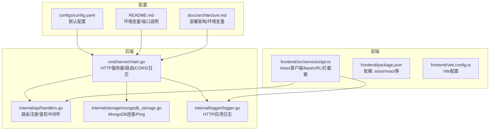
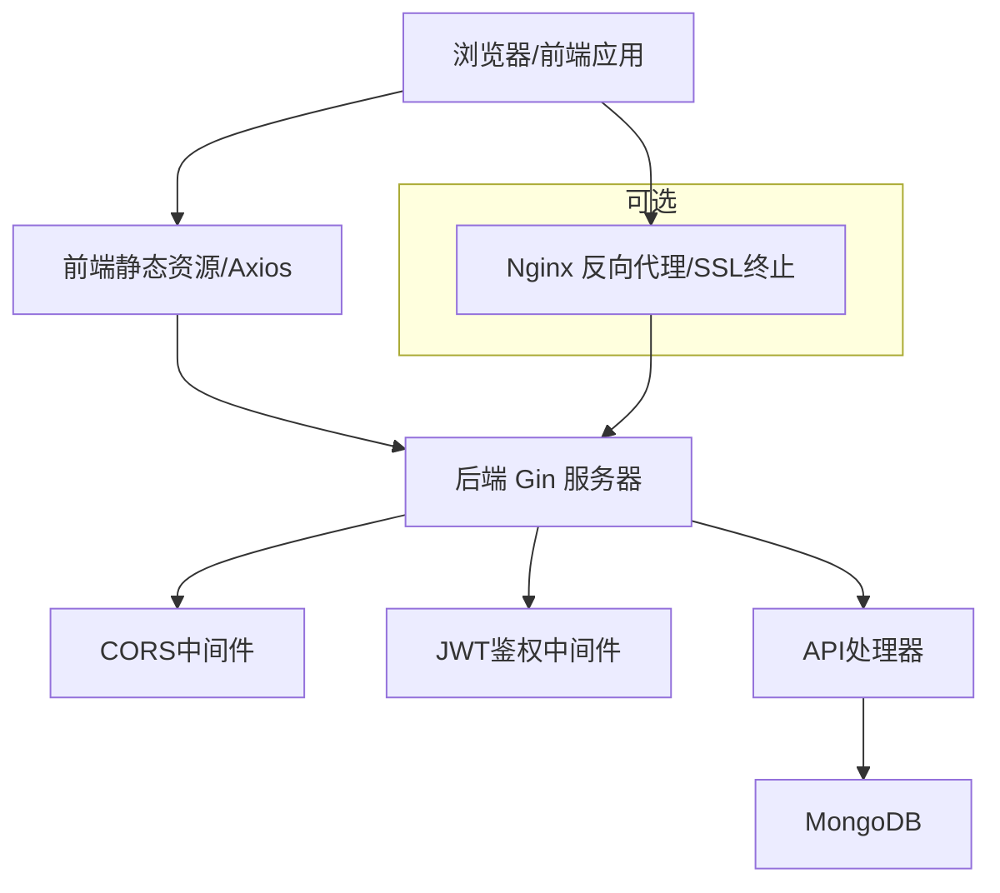
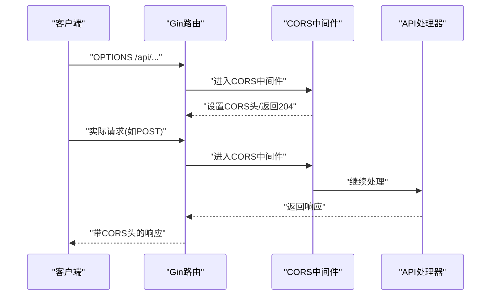
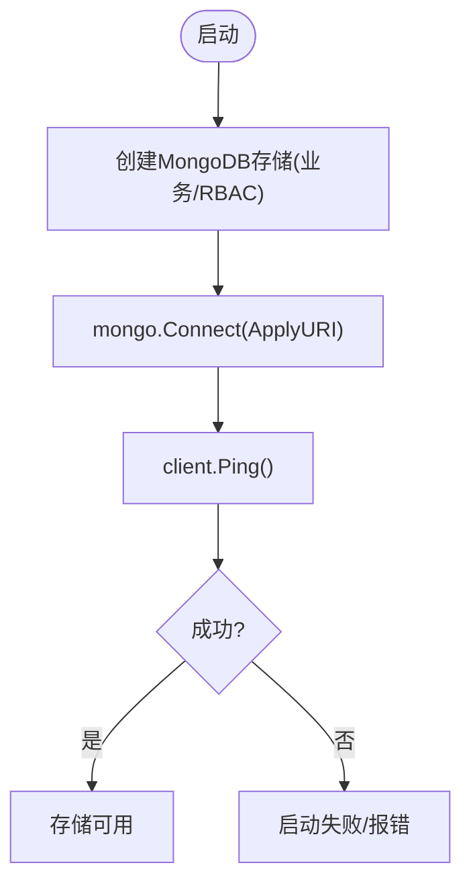
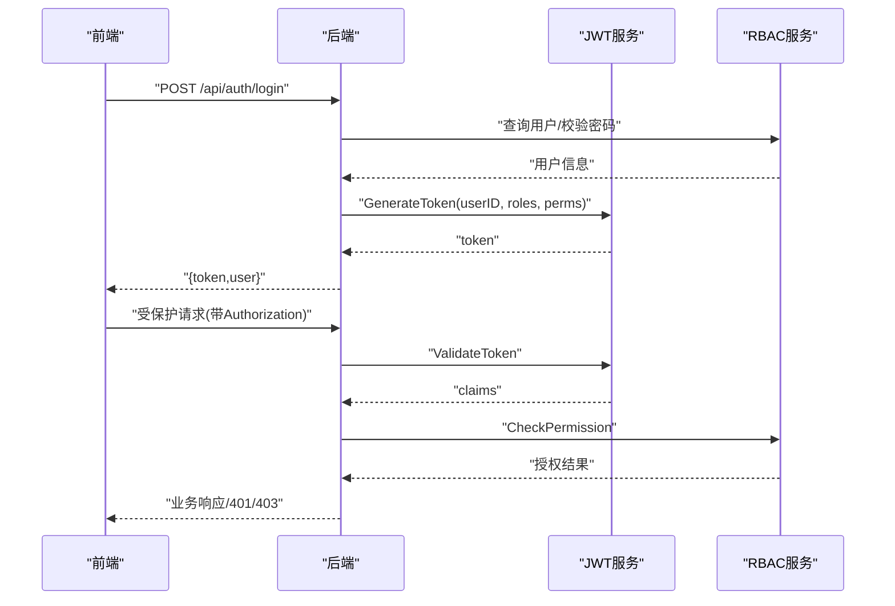
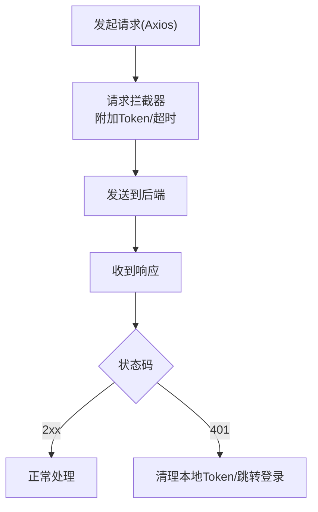
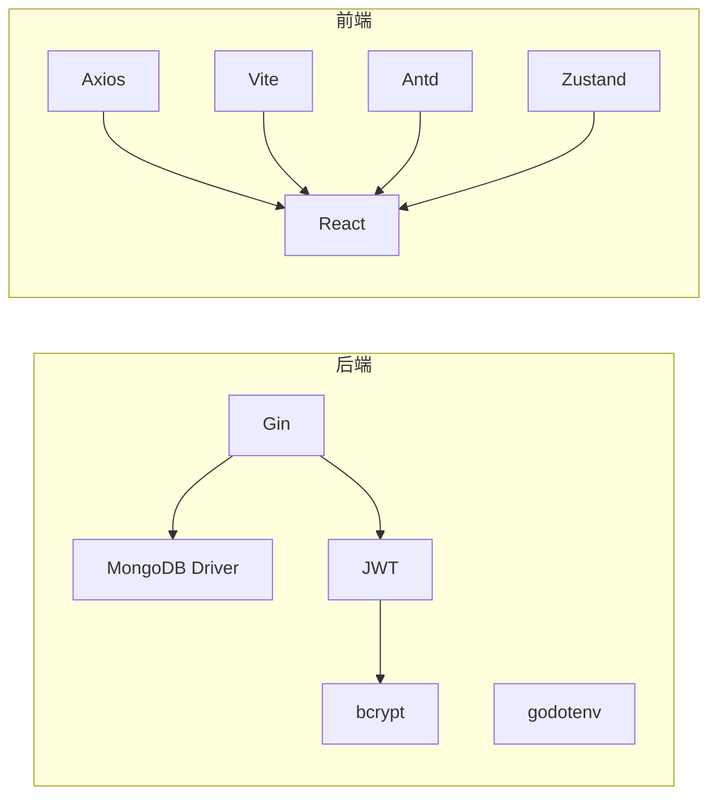
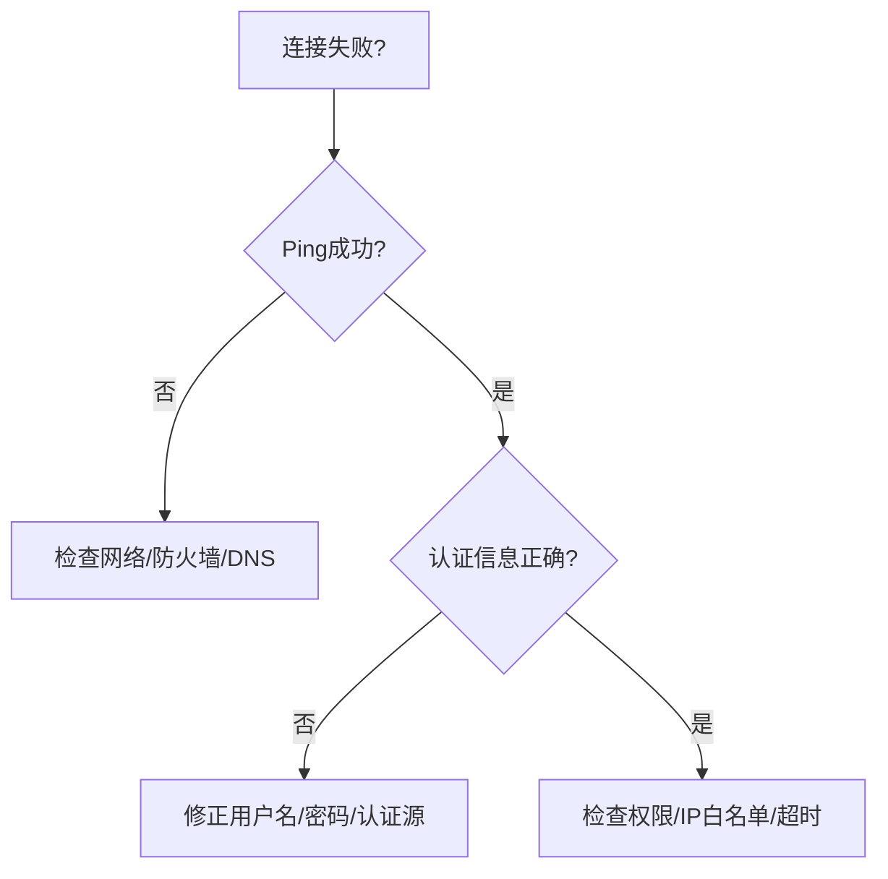
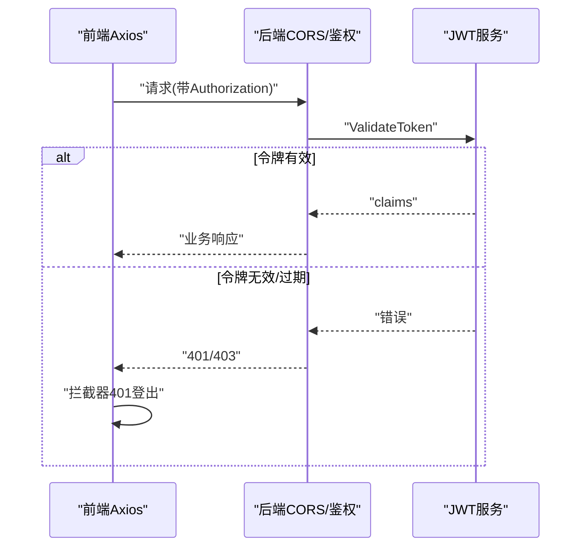

# 网络连接问题

<cite>
**本文引用的文件**
- [cmd/server/main.go](file://cmd/server/main.go)
- [configs/config.yaml](file://configs/config.yaml)
- [internal/storage/mongodb.go](file://internal/storage/mongodb.go)
- [internal/storage/mongodb_storage.go](file://internal/storage/mongodb_storage.go)
- [internal/api/handlers.go](file://internal/api/handlers.go)
- [internal/api/collection_permission_middleware.go](file://internal/api/collection_permission_middleware.go)
- [internal/auth/jwt.go](file://internal/auth/jwt.go)
- [internal/auth/middleware.go](file://internal/auth/middleware.go)
- [internal/logger/logger.go](file://internal/logger/logger.go)
- [frontend/src/services/api.ts](file://frontend/src/services/api.ts)
- [frontend/package.json](file://frontend/package.json)
- [frontend/vite.config.ts](file://frontend/vite.config.ts)
- [README.md](file://README.md)
- [docs/architecture.md](file://docs/architecture.md)
- [test/e2e.go](file://test/e2e.go)
</cite>

## 目录
1. [简介](#简介)
2. [项目结构](#项目结构)
3. [核心组件](#核心组件)
4. [架构总览](#架构总览)
5. [详细组件分析](#详细组件分析)
6. [依赖分析](#依赖分析)
7. [性能考量](#性能考量)
8. [故障排查指南](#故障排查指南)
9. [结论](#结论)
10. [附录](#附录)

## 简介
本指南聚焦数据中心项目的网络连接问题诊断与解决，覆盖以下方面：
- DNS解析失败、防火墙阻断、代理配置错误、SSL证书问题的识别与修复
- 使用ping、traceroute、telnet、curl等工具进行连通性测试的系统化步骤
- MongoDB连接问题的诊断方法（连接字符串、网络延迟、认证失败）
- 前端API调用失败的诊断流程（CORS、HTTPS证书、跨域）
- 开发/测试/生产环境的最佳实践与安全建议
- 网络监控与告警配置建议，帮助快速定位与恢复

## 项目结构
后端采用Go + Gin，前端采用React + Vite，数据库为MongoDB；整体通过环境变量与配置文件控制运行参数。

**图表来源**
- [cmd/server/main.go:24-150](file://cmd/server/main.go#L24-L150)
- [internal/api/handlers.go:45-181](file://internal/api/handlers.go#L45-L181)
- [internal/storage/mongodb_storage.go:27-51](file://internal/storage/mongodb_storage.go#L27-L51)
- [internal/logger/logger.go:14-56](file://internal/logger/logger.go#L14-L56)
- [frontend/src/services/api.ts:5-37](file://frontend/src/services/api.ts#L5-L37)
- [configs/config.yaml:1-26](file://configs/config.yaml#L1-L26)
- [README.md:50-78](file://README.md#L50-L78)
- [docs/architecture.md:724-756](file://docs/architecture.md#L724-L756)

**章节来源**
- [cmd/server/main.go:24-150](file://cmd/server/main.go#L24-L150)
- [frontend/src/services/api.ts:5-37](file://frontend/src/services/api.ts#L5-L37)
- [configs/config.yaml:1-26](file://configs/config.yaml#L1-L26)
- [README.md:50-78](file://README.md#L50-L78)
- [docs/architecture.md:724-756](file://docs/architecture.md#L724-L756)

## 核心组件
- HTTP服务器与路由：后端通过Gin启动HTTP服务，设置CORS中间件、日志中间件与恢复中间件，并注册API路由。
- MongoDB存储：初始化业务与RBAC数据库连接，执行Ping以验证可达性。
- 认证与授权：JWT服务负责签发/校验令牌；鉴权中间件从请求头提取并校验Bearer Token。
- 前端API客户端：Axios创建基础客户端，设置baseURL、超时与请求/响应拦截器（含401登出逻辑）。
- 日志系统：HTTP日志与应用日志分离，支持滚动与级别控制。

**章节来源**
- [cmd/server/main.go:97-127](file://cmd/server/main.go#L97-L127)
- [internal/storage/mongodb_storage.go:27-51](file://internal/storage/mongodb_storage.go#L27-L51)
- [internal/auth/jwt.go:44-83](file://internal/auth/jwt.go#L44-L83)
- [internal/auth/middleware.go:12-48](file://internal/auth/middleware.go#L12-L48)
- [frontend/src/services/api.ts:5-37](file://frontend/src/services/api.ts#L5-L37)
- [internal/logger/logger.go:14-56](file://internal/logger/logger.go#L14-L56)

## 架构总览
后端服务监听指定主机与端口，前端通过Axios访问后端API；MongoDB作为持久化存储。部署时可通过Nginx反向代理与SSL终止。

**图表来源**
- [cmd/server/main.go:100-113](file://cmd/server/main.go#L100-L113)
- [internal/auth/middleware.go:12-48](file://internal/auth/middleware.go#L12-L48)
- [internal/storage/mongodb_storage.go:27-51](file://internal/storage/mongodb_storage.go#L27-L51)
- [docs/architecture.md:800-821](file://docs/architecture.md#L800-L821)

**章节来源**
- [docs/architecture.md:800-821](file://docs/architecture.md#L800-L821)
- [cmd/server/main.go:121-127](file://cmd/server/main.go#L121-L127)

## 详细组件分析

### HTTP服务器与CORS
- CORS中间件设置允许来源、凭证、头部与方法，并对预检请求直接返回状态码。
- 服务器绑定地址与端口来自环境变量，默认监听0.0.0.0:8080。
- 设置读写超时，避免长时间连接占用。

**图表来源**
- [cmd/server/main.go:100-113](file://cmd/server/main.go#L100-L113)
- [internal/api/handlers.go:45-181](file://internal/api/handlers.go#L45-L181)

**章节来源**
- [cmd/server/main.go:100-113](file://cmd/server/main.go#L100-L113)
- [cmd/server/main.go:121-127](file://cmd/server/main.go#L121-L127)

### MongoDB连接与Ping验证
- 初始化业务存储与RBAC存储时，使用配置的URI与数据库名建立连接，并执行Ping以确认可达。
- 若连接失败，服务启动会直接报错退出，便于早期发现网络/认证问题。

**图表来源**
- [internal/storage/mongodb_storage.go:27-51](file://internal/storage/mongodb_storage.go#L27-L51)
- [cmd/server/main.go:42-58](file://cmd/server/main.go#L42-L58)

**章节来源**
- [internal/storage/mongodb_storage.go:27-51](file://internal/storage/mongodb_storage.go#L27-L51)
- [cmd/server/main.go:42-58](file://cmd/server/main.go#L42-L58)

### JWT认证与权限中间件
- 登录成功后生成JWT，包含用户ID、角色与权限列表。
- 鉴权中间件从Authorization头提取Bearer Token并校验有效性。
- 权限中间件结合RBAC服务检查具体操作权限。

**图表来源**
- [internal/auth/jwt.go:44-83](file://internal/auth/jwt.go#L44-L83)
- [internal/auth/middleware.go:12-48](file://internal/auth/middleware.go#L12-L48)
- [internal/api/handlers.go:260-314](file://internal/api/handlers.go#L260-L314)

**章节来源**
- [internal/auth/jwt.go:44-83](file://internal/auth/jwt.go#L44-L83)
- [internal/auth/middleware.go:12-48](file://internal/auth/middleware.go#L12-L48)
- [internal/api/handlers.go:260-314](file://internal/api/handlers.go#L260-L314)

### 前端API客户端与拦截器
- Axios基础配置包含baseURL与超时；请求拦截器自动附加Bearer Token；响应拦截器处理401并触发登出。
- 前端开发默认指向本地后端端口，需确保与后端监听端口一致。

**图表来源**
- [frontend/src/services/api.ts:5-37](file://frontend/src/services/api.ts#L5-L37)

**章节来源**
- [frontend/src/services/api.ts:5-37](file://frontend/src/services/api.ts#L5-L37)
- [frontend/package.json:12-28](file://frontend/package.json#L12-L28)

## 依赖分析
- 后端依赖：Gin（HTTP）、MongoDB驱动（数据库）、jwt-go（认证）、bcrypt（密码哈希）、godotenv（环境变量）。
- 前端依赖：axios（HTTP）、react/react-dom（UI）、vite（构建）、antd/zustand（组件与状态）。

**图表来源**
- [frontend/package.json:12-28](file://frontend/package.json#L12-L28)
- [cmd/server/main.go:3-22](file://cmd/server/main.go#L3-L22)

**章节来源**
- [frontend/package.json:12-28](file://frontend/package.json#L12-L28)
- [cmd/server/main.go:3-22](file://cmd/server/main.go#L3-L22)

## 性能考量
- HTTP超时设置：读/写超时均为秒级，避免慢连接占用资源。
- 日志滚动：HTTP与应用日志分别滚动，降低I/O压力。
- 并发与连接：MongoDB连接在启动阶段一次性建立，运行期复用；注意连接池大小与超时配置。

**章节来源**
- [cmd/server/main.go:124-125](file://cmd/server/main.go#L124-L125)
- [internal/logger/logger.go:14-56](file://internal/logger/logger.go#L14-L56)

## 故障排查指南

### 一、常见网络问题与诊断步骤

- DNS解析失败
  - 现象：无法解析域名或连接超时
  - 步骤：
    - 使用系统工具验证DNS：nslookup/dig
    - 检查hosts文件与系统DNS设置
    - 在容器/云环境中确认DNS策略
  - 关联项：后端环境变量中的MONGODB_URI与SERVER_HOST需可解析

- 防火墙阻断
  - 现象：端口不可达/连接被拒绝
  - 步骤：
    - 使用telnet/traceroute检测链路
    - 在目标机上放通端口（如8080/MongoDB 27017）
    - 检查安全组/ACL规则
  - 关联项：SERVER_PORT默认8080；MongoDB默认27017

- 代理配置错误
  - 现象：偶发超时/握手失败
  - 步骤：
    - 检查HTTP_PROXY/HTTPS_PROXY与NO_PROXY
    - 对内网服务设置NO_PROXY
    - 验证代理认证与证书
  - 关联项：前端Axios在代理环境下可能影响请求行为

- SSL/TLS证书问题
  - 现象：证书不受信/过期/域名不匹配
  - 步骤：
    - 使用openssl s_client验证证书链
    - 检查证书有效期与SAN
    - 生产环境建议通过Nginx终止SSL并统一证书管理
  - 关联项：部署架构图中Nginx可承担SSL终止

**章节来源**
- [docs/architecture.md:800-821](file://docs/architecture.md#L800-L821)
- [README.md:50-78](file://README.md#L50-L78)

### 二、MongoDB连接问题诊断

- 连接字符串配置
  - 检查MONGODB_URI是否正确（主机、端口、数据库、认证库、选项）
  - 多实例/副本集需使用合适的连接串
  - 关联项：业务存储与RBAC存储均使用各自URI

- 网络延迟测试
  - 使用ping/traceroute评估RTT与丢包
  - 在数据库侧执行基准查询，观察响应时间
  - 关联项：启动时执行Ping验证可达性

- 认证失败排查
  - 确认用户名/密码与认证源
  - 检查数据库用户权限与IP白名单
  - 关联项：启动阶段的Ping失败即刻暴露认证/网络问题

**图表来源**
- [internal/storage/mongodb_storage.go:33-35](file://internal/storage/mongodb_storage.go#L33-L35)
- [cmd/server/main.go:42-58](file://cmd/server/main.go#L42-L58)

**章节来源**
- [internal/storage/mongodb_storage.go:27-51](file://internal/storage/mongodb_storage.go#L27-L51)
- [cmd/server/main.go:42-58](file://cmd/server/main.go#L42-L58)

### 三、前端API调用失败诊断

- CORS配置检查
  - 后端已设置CORS中间件，若仍失败，检查来源、凭证与自定义头
  - 关联项：CORS中间件对OPTIONS预检直接返回204

- HTTPS证书验证
  - 生产环境建议通过Nginx终止SSL；本地开发可使用自签名证书并信任
  - 关联项：部署架构图包含Nginx

- 跨域问题解决
  - 确保前端baseURL与后端CORS策略一致
  - 关联项：前端Axios默认baseURL指向本地端口

- 401未授权处理
  - 响应拦截器检测401并触发登出；检查Token是否过期或被撤销
  - 关联项：前端拦截器与JWT过期策略配合

**图表来源**
- [frontend/src/services/api.ts:23-35](file://frontend/src/services/api.ts#L23-L35)
- [internal/auth/middleware.go:32-39](file://internal/auth/middleware.go#L32-L39)
- [internal/auth/jwt.go:69-83](file://internal/auth/jwt.go#L69-L83)

**章节来源**
- [frontend/src/services/api.ts:5-37](file://frontend/src/services/api.ts#L5-L37)
- [cmd/server/main.go:100-113](file://cmd/server/main.go#L100-L113)
- [internal/auth/middleware.go:12-48](file://internal/auth/middleware.go#L12-L48)
- [internal/auth/jwt.go:69-83](file://internal/auth/jwt.go#L69-L83)

### 四、不同环境的最佳实践与安全

- 开发环境
  - 使用本地MongoDB与默认端口；允许宽松CORS以便调试
  - 前端baseURL指向后端本地端口
  - 关联项：README提供默认端口与环境变量示例

- 测试环境
  - 与生产隔离的数据库实例；启用严格的CORS白名单
  - 使用独立的JWT密钥与较短过期时间

- 生产环境
  - 通过Nginx反向代理与SSL终止；统一证书管理
  - 限制暴露端口，启用WAF/DDoS防护；严格防火墙策略
  - 关联项：部署架构图与环境变量表

**章节来源**
- [README.md:50-78](file://README.md#L50-L78)
- [docs/architecture.md:724-756](file://docs/architecture.md#L724-L756)
- [docs/architecture.md:800-821](file://docs/architecture.md#L800-L821)

### 五、网络监控与告警配置建议

- 连接可用性
  - TCP端口探测：针对8080与27017
  - HTTP健康检查：GET /（或自定义健康端点）

- 延迟与吞吐
  - 数据库Ping/基准查询RTT
  - API路由QPS与P95/P99延迟

- 认证与授权
  - 401/403频率异常告警
  - JWT签发/刷新成功率监控

- 日志与审计
  - HTTP错误日志聚合与关键字告警
  - 关键路径增加结构化日志字段（trace_id、user_id、module）

- 告警策略
  - 连续失败阈值与恢复通知
  - 逐步升级：静默、邮件、电话

**章节来源**
- [internal/logger/logger.go:14-56](file://internal/logger/logger.go#L14-L56)
- [cmd/server/main.go:121-127](file://cmd/server/main.go#L121-L127)

## 结论
本指南从系统架构、核心组件与配置入手，给出了面向DNS、防火墙、代理与SSL的通用诊断步骤，并结合后端CORS、JWT认证与前端Axios拦截器的具体实现，形成可落地的排障流程。针对MongoDB连接与不同环境的差异，提供了针对性建议与最佳实践。配合完善的监控与告警体系，可显著提升网络问题的发现与恢复效率。

## 附录

### A. 系统化连通性测试清单
- DNS：nslookup/dig
- 主机连通：ping
- 路径追踪：traceroute
- 端口探测：telnet/nc
- HTTP：curl（含超时与CA验证）
- 数据库：mongo shell连接与简单查询

### B. 关键配置与端口
- 后端监听：SERVER_HOST/SERVER_PORT（默认0.0.0.0:8080）
- MongoDB：MONGODB_URI/MONGODB_DATABASE（业务），MONGODB_RBAC_URI/MONGODB_RBAC_DATABASE（权限）
- JWT：JWT_SECRET/JWT_EXPIRATION/JWT_REFRESH_EXPIRATION
- 日志：LOG_LEVEL/LOG_HTTP_FILE/滚动参数

**章节来源**
- [README.md:50-78](file://README.md#L50-L78)
- [configs/config.yaml:1-26](file://configs/config.yaml#L1-L26)
- [docs/architecture.md:724-756](file://docs/architecture.md#L724-L756)