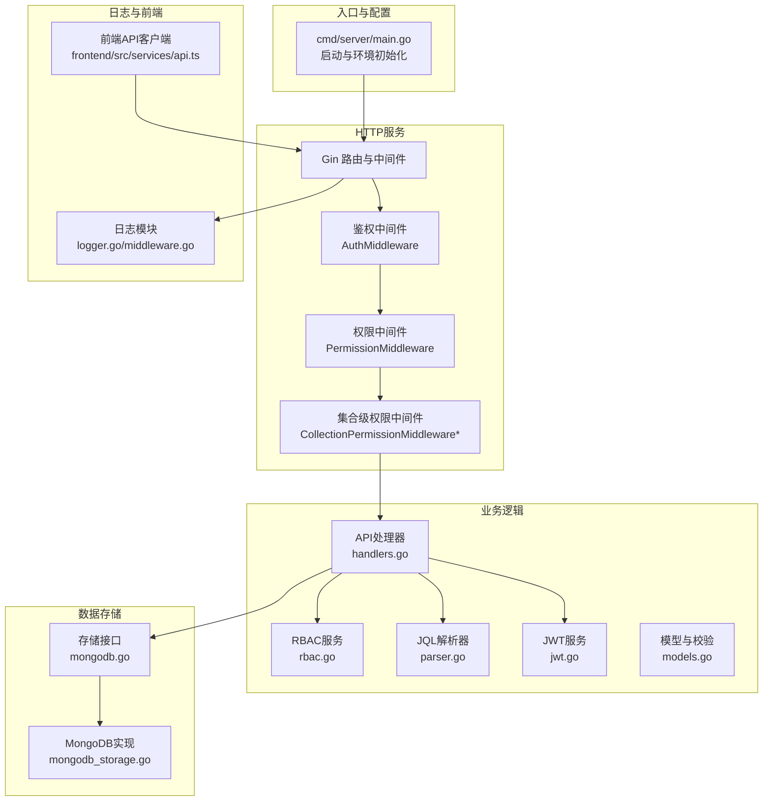
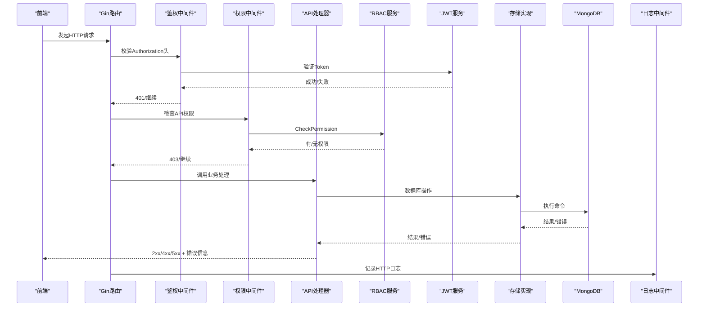
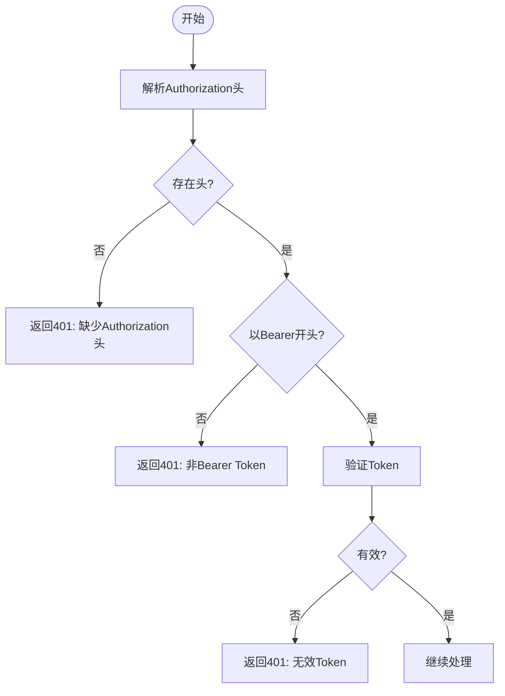
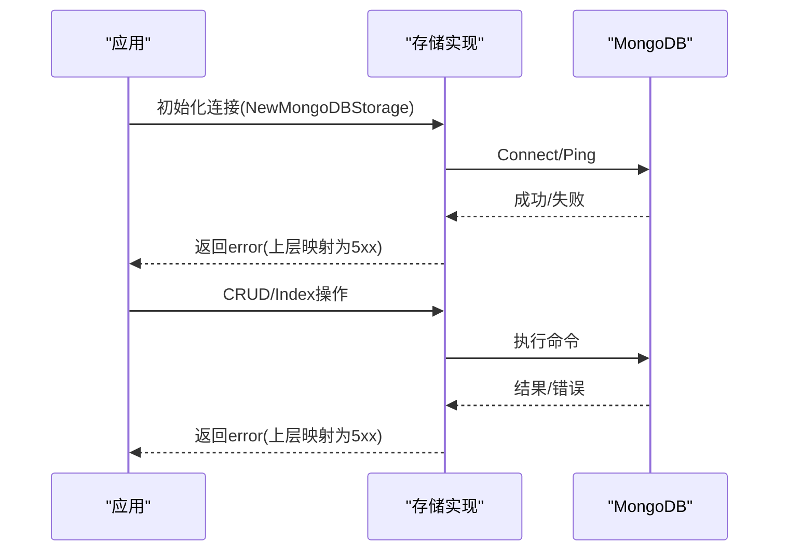
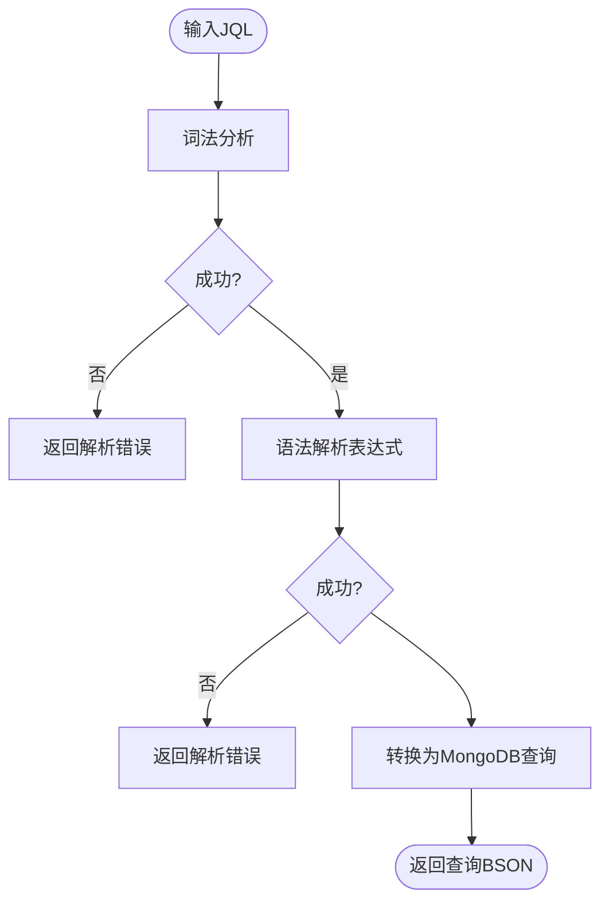
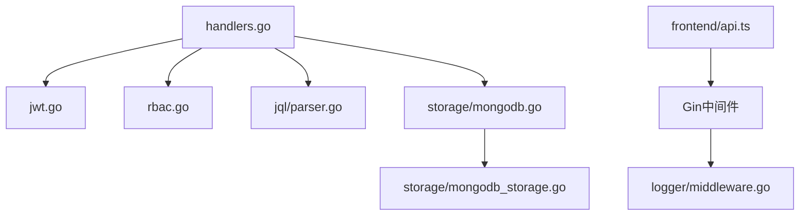

# 错误代码参考

<cite>
**本文档引用的文件**
- [cmd/server/main.go](file://cmd/server/main.go)
- [internal/api/handlers.go](file://internal/api/handlers.go)
- [internal/api/collection_permission_middleware.go](file://internal/api/collection_permission_middleware.go)
- [internal/auth/jwt.go](file://internal/auth/jwt.go)
- [internal/storage/mongodb.go](file://internal/storage/mongodb.go)
- [internal/storage/mongodb_storage.go](file://internal/storage/mongodb_storage.go)
- [pkg/jql/parser.go](file://pkg/jql/parser.go)
- [frontend/src/services/api.ts](file://frontend/src/services/api.ts)
- [internal/logger/logger.go](file://internal/logger/logger.go)
- [internal/logger/middleware.go](file://internal/logger/middleware.go)
- [internal/models/models.go](file://internal/models/models.go)
- [pkg/rbac/rbac.go](file://pkg/rbac/rbac.go)
- [docs/authentication.md](file://docs/authentication.md)
- [docs/rbac.md](file://docs/rbac.md)
</cite>

## 目录
1. [简介](#简介)
2. [项目结构](#项目结构)
3. [核心组件](#核心组件)
4. [架构总览](#架构总览)
5. [详细组件分析](#详细组件分析)
6. [依赖分析](#依赖分析)
7. [性能考虑](#性能考虑)
8. [故障排查指南](#故障排查指南)
9. [结论](#结论)
10. [附录](#附录)

## 简介
本参考手册系统梳理数据中心项目的错误与异常处理，覆盖HTTP状态码、业务错误、系统错误、JWT认证错误、MongoDB数据库错误、JQL查询错误以及前端API调用错误。针对每类错误，提供错误含义、触发条件、原因分析、解决方案与预防措施，并给出分类索引与快速查找指南，帮助开发者与运维人员高效定位与修复问题。

## 项目结构
后端采用Gin框架，按职责分层组织：入口程序负责环境与服务初始化；API层负责路由与中间件；存储层封装MongoDB访问；RBAC模块提供权限控制；日志模块统一记录HTTP与应用日志；前端通过Axios发起请求并统一拦截401错误。

图表来源
- [cmd/server/main.go:121-126](file://cmd/server/main.go#L121-L126)
- [internal/api/handlers.go:45-181](file://internal/api/handlers.go#L45-L181)
- [internal/api/collection_permission_middleware.go:16-48](file://internal/api/collection_permission_middleware.go#L16-L48)
- [internal/auth/jwt.go:20-25](file://internal/auth/jwt.go#L20-L25)
- [internal/storage/mongodb.go:14-90](file://internal/storage/mongodb.go#L14-L90)
- [internal/storage/mongodb_storage.go:16-51](file://internal/storage/mongodb_storage.go#L16-L51)
- [pkg/jql/parser.go:46-65](file://pkg/jql/parser.go#L46-L65)
- [internal/logger/middleware.go:25-68](file://internal/logger/middleware.go#L25-L68)
- [frontend/src/services/api.ts:5-37](file://frontend/src/services/api.ts#L5-L37)

章节来源
- [cmd/server/main.go:24-150](file://cmd/server/main.go#L24-L150)
- [internal/api/handlers.go:45-181](file://internal/api/handlers.go#L45-L181)

## 核心组件
- HTTP状态码与错误返回：后端在各处理器中直接以标准HTTP状态码返回错误信息，常见4xx/5xx场景明确。
- JWT认证与刷新：提供生成、验证、过期处理与刷新窗口控制。
- MongoDB存储：统一接口与具体实现，封装连接、Ping、集合操作与索引管理。
- JQL查询解析：词法/语法解析，生成MongoDB查询BSON。
- RBAC权限：基于用户角色与权限映射，支持通配符匹配与系统管理员特例。
- 日志：HTTP请求日志分级记录，便于问题追踪。
- 前端API：统一拦截401并自动登出与跳转。

章节来源
- [internal/api/handlers.go:183-221](file://internal/api/handlers.go#L183-L221)
- [internal/auth/jwt.go:44-83](file://internal/auth/jwt.go#L44-L83)
- [internal/storage/mongodb.go:14-90](file://internal/storage/mongodb.go#L14-L90)
- [internal/storage/mongodb_storage.go:27-51](file://internal/storage/mongodb_storage.go#L27-L51)
- [pkg/jql/parser.go:67-230](file://pkg/jql/parser.go#L67-L230)
- [pkg/rbac/rbac.go:63-99](file://pkg/rbac/rbac.go#L63-L99)
- [internal/logger/middleware.go:59-66](file://internal/logger/middleware.go#L59-L66)
- [frontend/src/services/api.ts:23-35](file://frontend/src/services/api.ts#L23-L35)

## 架构总览
下图展示错误处理在系统中的位置与流转路径，包括认证、权限、存储、查询与前端交互。

图表来源
- [internal/api/handlers.go:260-293](file://internal/api/handlers.go#L260-L293)
- [internal/api/handlers.go:295-314](file://internal/api/handlers.go#L295-L314)
- [internal/auth/jwt.go:68-83](file://internal/auth/jwt.go#L68-L83)
- [pkg/rbac/rbac.go:63-99](file://pkg/rbac/rbac.go#L63-L99)
- [internal/logger/middleware.go:25-68](file://internal/logger/middleware.go#L25-L68)

## 详细组件分析

### HTTP状态码与错误返回
- 400 请求体解析失败：请求体绑定失败时返回400及错误详情。
- 401 未认证/无效Token/非Bearer/Token过期：鉴权中间件与登录/注册流程返回相应错误。
- 403 无权限访问：权限中间件与集合级权限中间件返回403。
- 500 服务器内部错误：Token生成失败、存储写入失败等返回500。

章节来源
- [internal/api/handlers.go:189-191](file://internal/api/handlers.go#L189-L191)
- [internal/api/handlers.go:195-202](file://internal/api/handlers.go#L195-L202)
- [internal/api/handlers.go:207-210](file://internal/api/handlers.go#L207-L210)
- [internal/api/handlers.go:263-274](file://internal/api/handlers.go#L263-L274)
- [internal/api/handlers.go:276-281](file://internal/api/handlers.go#L276-L281)
- [internal/api/handlers.go:298-309](file://internal/api/handlers.go#L298-L309)
- [internal/api/collection_permission_middleware.go:25-30](file://internal/api/collection_permission_middleware.go#L25-L30)
- [internal/api/collection_permission_middleware.go:73-77](file://internal/api/collection_permission_middleware.go#L73-L77)
- [internal/api/collection_permission_middleware.go:109-113](file://internal/api/collection_permission_middleware.go#L109-L113)
- [docs/authentication.md:74-78](file://docs/authentication.md#L74-L78)

### JWT相关错误
- 生成失败：登录流程中生成Token失败返回500。
- 验证失败：缺少Authorization头、非Bearer格式、无效Token均返回401。
- 过期处理：支持过期Token刷新，但超出刷新窗口返回401并提示刷新过期。

图表来源
- [internal/api/handlers.go:260-293](file://internal/api/handlers.go#L260-L293)
- [internal/auth/jwt.go:68-83](file://internal/auth/jwt.go#L68-L83)
- [docs/authentication.md:74-78](file://docs/authentication.md#L74-L78)

章节来源
- [internal/api/handlers.go:183-221](file://internal/api/handlers.go#L183-L221)
- [internal/auth/jwt.go:44-111](file://internal/auth/jwt.go#L44-L111)
- [docs/authentication.md:74-78](file://docs/authentication.md#L74-L78)

### MongoDB数据库错误
- 连接失败：初始化存储时连接或Ping失败。
- 认证错误：URI配置错误导致连接被拒。
- 约束违反：业务层对“数据不存在/已删除”“刮削任务不存在/已删除”等场景返回错误信息。
- 查询/索引错误：存储实现中未显式返回HTTP状态码，错误通常在上层转换为5xx。

图表来源
- [internal/storage/mongodb_storage.go:27-51](file://internal/storage/mongodb_storage.go#L27-L51)
- [internal/storage/mongodb_storage.go:457-459](file://internal/storage/mongodb_storage.go#L457-L459)
- [internal/storage/mongodb_storage.go:657-659](file://internal/storage/mongodb_storage.go#L657-L659)
- [internal/storage/mongodb_storage.go:725-727](file://internal/storage/mongodb_storage.go#L725-L727)

章节来源
- [internal/storage/mongodb.go:14-90](file://internal/storage/mongodb.go#L14-L90)
- [internal/storage/mongodb_storage.go:27-51](file://internal/storage/mongodb_storage.go#L27-L51)
- [internal/storage/mongodb_storage.go:457-459](file://internal/storage/mongodb_storage.go#L457-L459)
- [internal/storage/mongodb_storage.go:657-659](file://internal/storage/mongodb_storage.go#L657-L659)
- [internal/storage/mongodb_storage.go:725-727](file://internal/storage/mongodb_storage.go#L725-L727)

### JQL查询错误
- 语法错误：意外字符、括号不匹配、期望运算符/值等。
- 字段不存在：解析到未知字段名时报错。
- 类型不匹配：函数/值类型与预期不符。
- 解析失败：整体Parse返回error，上层映射为400或500。

图表来源
- [pkg/jql/parser.go:67-230](file://pkg/jql/parser.go#L67-L230)
- [pkg/jql/parser.go:268-421](file://pkg/jql/parser.go#L268-L421)
- [pkg/jql/parser.go:538-574](file://pkg/jql/parser.go#L538-L574)

章节来源
- [pkg/jql/parser.go:67-230](file://pkg/jql/parser.go#L67-L230)
- [pkg/jql/parser.go:268-421](file://pkg/jql/parser.go#L268-L421)
- [pkg/jql/parser.go:538-574](file://pkg/jql/parser.go#L538-L574)

### 前端API调用错误
- 网络超时：Axios默认超时10秒，超时返回错误。
- 解析失败/响应格式错误：401时自动登出并跳转登录页。
- 其他错误：交由上层统一处理。

章节来源
- [frontend/src/services/api.ts:5-8](file://frontend/src/services/api.ts#L5-L8)
- [frontend/src/services/api.ts:23-35](file://frontend/src/services/api.ts#L23-L35)

### RBAC权限错误
- 无用户ID：中间件无法提取用户ID返回403。
- 权限不足：CheckPermission返回false或错误，返回403。
- 集合级权限：集合模块缺失、读取请求体失败、字段定义不存在等返回400/403/404。

章节来源
- [internal/api/handlers.go:295-314](file://internal/api/handlers.go#L295-L314)
- [internal/api/collection_permission_middleware.go:16-48](file://internal/api/collection_permission_middleware.go#L16-L48)
- [internal/api/collection_permission_middleware.go:50-93](file://internal/api/collection_permission_middleware.go#L50-L93)
- [internal/api/collection_permission_middleware.go:95-137](file://internal/api/collection_permission_middleware.go#L95-L137)
- [pkg/rbac/rbac.go:63-99](file://pkg/rbac/rbac.go#L63-L99)

## 依赖分析
- 组件耦合：API处理器依赖JWT、RBAC、存储与JQL；中间件依赖RBAC与JWT；日志中间件独立。
- 外部依赖：Gin、MongoDB驱动、JWT库、Axios。
- 错误传播：底层错误通过返回error上抛，HTTP层根据上下文映射为4xx/5xx。

图表来源
- [internal/api/handlers.go:23-43](file://internal/api/handlers.go#L23-L43)
- [internal/auth/jwt.go:20-41](file://internal/auth/jwt.go#L20-L41)
- [pkg/rbac/rbac.go:55-61](file://pkg/rbac/rbac.go#L55-L61)
- [pkg/jql/parser.go:46-65](file://pkg/jql/parser.go#L46-L65)
- [internal/storage/mongodb.go:14-90](file://internal/storage/mongodb.go#L14-L90)
- [internal/storage/mongodb_storage.go:16-51](file://internal/storage/mongodb_storage.go#L16-L51)
- [internal/logger/middleware.go:25-68](file://internal/logger/middleware.go#L25-L68)
- [frontend/src/services/api.ts:1-37](file://frontend/src/services/api.ts#L1-L37)

## 性能考虑
- 超时设置：HTTP服务器读/写超时均为10秒，避免长时间占用连接。
- 日志级别：根据环境变量设置全局日志级别，生产建议info/warn。
- 中间件顺序：鉴权与权限中间件尽早拦截，减少后续处理成本。
- 存储连接：MongoDB连接池与索引优化可降低查询延迟。

章节来源
- [cmd/server/main.go:121-126](file://cmd/server/main.go#L121-L126)
- [internal/logger/logger.go:14-56](file://internal/logger/logger.go#L14-L56)

## 故障排查指南
- 认证失败
  - 现象：401未认证/无效Token/非Bearer/Token过期
  - 排查：确认Authorization头格式、Token签名与有效期、刷新窗口
  - 参考：[internal/api/handlers.go:260-293](file://internal/api/handlers.go#L260-L293)，[internal/auth/jwt.go:68-111](file://internal/auth/jwt.go#L68-L111)
- 权限不足
  - 现象：403无权限
  - 排查：确认用户角色与权限映射、API权限码、集合级权限
  - 参考：[internal/api/handlers.go:295-314](file://internal/api/handlers.go#L295-L314)，[pkg/rbac/rbac.go:63-99](file://pkg/rbac/rbac.go#L63-L99)，[internal/api/collection_permission_middleware.go:16-48](file://internal/api/collection_permission_middleware.go#L16-L48)
- 数据库连接/认证失败
  - 现象：初始化失败/连接被拒
  - 排查：核对URI、凭据、网络连通性
  - 参考：[internal/storage/mongodb_storage.go:27-51](file://internal/storage/mongodb_storage.go#L27-L51)
- 数据不存在/已删除
  - 现象：业务层返回“数据不存在或已删除”
  - 排查：确认ID有效性、模块集合存在性
  - 参考：[internal/storage/mongodb_storage.go:457-459](file://internal/storage/mongodb_storage.go#L457-L459)，[internal/storage/mongodb_storage.go:657-659](file://internal/storage/mongodb_storage.go#L657-L659)，[internal/storage/mongodb_storage.go:725-727](file://internal/storage/mongodb_storage.go#L725-L727)
- JQL语法错误
  - 现象：解析报错（意外字符/括号/运算符/值）
  - 排查：检查JQL语法、字段名、函数使用
  - 参考：[pkg/jql/parser.go:214-230](file://pkg/jql/parser.go#L214-L230)，[pkg/jql/parser.go:322-421](file://pkg/jql/parser.go#L322-L421)
- 前端401自动登出
  - 现象：收到401自动清除本地token并跳转登录
  - 排查：确认后端JWT配置与前端拦截器
  - 参考：[frontend/src/services/api.ts:23-35](file://frontend/src/services/api.ts#L23-L35)

章节来源
- [internal/api/handlers.go:260-314](file://internal/api/handlers.go#L260-L314)
- [internal/auth/jwt.go:68-111](file://internal/auth/jwt.go#L68-L111)
- [internal/storage/mongodb_storage.go:27-51](file://internal/storage/mongodb_storage.go#L27-L51)
- [internal/storage/mongodb_storage.go:457-459](file://internal/storage/mongodb_storage.go#L457-L459)
- [internal/storage/mongodb_storage.go:657-659](file://internal/storage/mongodb_storage.go#L657-L659)
- [internal/storage/mongodb_storage.go:725-727](file://internal/storage/mongodb_storage.go#L725-L727)
- [pkg/jql/parser.go:214-230](file://pkg/jql/parser.go#L214-L230)
- [pkg/jql/parser.go:322-421](file://pkg/jql/parser.go#L322-L421)
- [frontend/src/services/api.ts:23-35](file://frontend/src/services/api.ts#L23-L35)

## 结论
本手册将数据中心项目的错误与异常进行了系统化梳理，明确了HTTP状态码、JWT、MongoDB、JQL与前端API的错误边界与处理策略。建议在生产环境中结合日志中间件与监控告警，持续优化超时与重试策略，确保用户体验与系统稳定性。

## 附录

### 分类索引与快速查找
- HTTP状态码
  - 400：请求体解析失败、集合模块缺失、请求体读取失败、字段ID缺失
  - 401：缺少Authorization头、非Bearer Token、无效Token、Token过期
  - 403：无用户ID、权限不足、集合级权限不足
  - 404：用户/权限/角色/字段定义不存在
  - 500：Token生成失败、服务器内部错误
- JWT
  - 生成失败：500
  - 验证失败：401
  - 刷新过期：401
- MongoDB
  - 连接/认证失败：初始化阶段
  - 数据不存在/已删除：业务层错误
- JQL
  - 语法错误：解析阶段
- 前端
  - 401自动登出与跳转

章节来源
- [internal/api/handlers.go:189-210](file://internal/api/handlers.go#L189-L210)
- [internal/api/handlers.go:263-281](file://internal/api/handlers.go#L263-L281)
- [internal/api/handlers.go:298-309](file://internal/api/handlers.go#L298-L309)
- [internal/api/collection_permission_middleware.go:25-30](file://internal/api/collection_permission_middleware.go#L25-L30)
- [internal/api/collection_permission_middleware.go:63-77](file://internal/api/collection_permission_middleware.go#L63-L77)
- [internal/api/collection_permission_middleware.go:109-113](file://internal/api/collection_permission_middleware.go#L109-L113)
- [internal/storage/mongodb_storage.go:457-459](file://internal/storage/mongodb_storage.go#L457-L459)
- [pkg/jql/parser.go:214-230](file://pkg/jql/parser.go#L214-L230)
- [frontend/src/services/api.ts:23-35](file://frontend/src/services/api.ts#L23-L35)